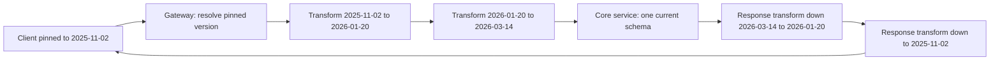
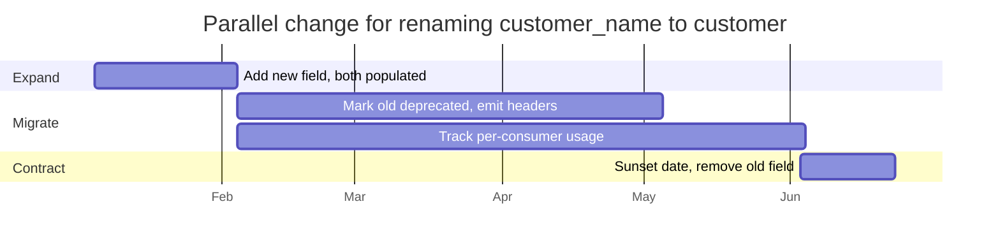

Versioning is a cost-allocation decision: it determines whether the provider or the consumer pays for change. Ship a new version and the provider pays — every live version is another code path, another test matrix, another set of on-call semantics, and it persists for as long as one consumer refuses to migrate. Ship a breaking change without a version and the consumer pays, in outages they did not schedule. Neither is free, and the engineering objective is not "clean versioning" but minimizing the number of concurrently live versions while never breaking a caller.
 
The practical consequence is that most changes should not produce a version at all. A new version is the escape hatch for changes that cannot be made additively; everything else evolves in place.
 
## Classifying Change
 
The line between breaking and non-breaking is defined by consumer behavior, not by your intuition about the schema.
 
| Change | Breaking? | Notes |
|--------|-----------|-------|
| Adding an optional response field | No, if consumers tolerate unknown fields | Breaks strict-schema clients and anything doing exact-match validation |
| Adding an optional request field | No | Server must keep the prior default behavior when absent |
| Adding a *required* request field | Yes | Old callers immediately fail validation |
| Removing or renaming a field | Yes | Includes renames that look cosmetic |
| Widening a type (`int32` to `int64`) | Usually yes for consumers | A 64-bit ID silently truncates in a JavaScript client past 2^53 |
| Narrowing a type or tightening validation | Yes | Previously accepted payloads now 400 |
| Adding an enum value | Yes in practice | Clients with exhaustive switches or strict deserializers fail |
| Changing a default value | Yes | Silent behavior change with no schema difference |
| Changing an error code for an existing condition | Yes | Retry and circuit-breaker logic branches on codes |
| Changing pagination defaults or maximums | Yes | Callers assuming a page size silently miss data |
| Changing latency or consistency characteristics | Yes, behaviorally | A read that becomes eventually consistent breaks read-your-writes assumptions |
 
The last three rows are the dangerous ones: they break consumers without changing a single line of the schema, so no schema-diff tool and no contract test built on structure alone will catch them. Behavioral contracts must be asserted explicitly in [Consumer-Driven Contract Testing](/distributed-systems/en/communication/api-gateway/contract-testing/), or they are not contracts.
 
The **tolerant reader** principle is what makes additive evolution possible at all: consumers must ignore fields they do not recognize, must not depend on field order, and must handle unknown enum values by falling into an explicit unknown branch rather than crashing or defaulting. This cannot be assumed — it has to be enforced in the SDKs you publish and verified in contract tests, because a single strict consumer converts every additive change into a breaking one.
 
:::caution
Generated clients from OpenAPI or JSON Schema frequently default to strict validation, rejecting unknown properties. If your published SDK is strict, then in practice you have no additive change path: every field addition is a breaking change and every release is a version. Configure generators for tolerant deserialization before you publish anything.
:::
 
## Versioning Mechanisms
 
| Mechanism | Example | Caching | Routing | When to prefer |
|-----------|---------|---------|---------|----------------|
| URI path | `/v2/accounts/42` | CDN-friendly, distinct keys | Trivial at the gateway | Public APIs with infrequent major versions |
| Custom header | `X-API-Version: 2` | Requires `Vary`, error-prone | Easy, but invisible in logs and browsers | Internal APIs with a controlled client set |
| Media type | `Accept: application/vnd.acme.account.v2+json` | Requires `Vary: Accept` | Content negotiation at the origin | Per-resource evolution where HTTP purity matters |
| Query parameter | `?api-version=2` | Fragments the cache key space | Trivial | Rarely; convenient for exploration, easy to omit accidentally |
| Date pinning | `Acme-Version: 2026-03-14` | Requires `Vary` | Gateway transformation chain | High-change-rate APIs with many long-lived consumers |
| Unversioned + additive only | field-level `@deprecated` | Native | None needed | gRPC and GraphQL, and internal services |
 
**URI path** versioning wins on operational clarity: the version is in the access log, in the CDN cache key, in the gateway routing table, and in a `curl` a support engineer types at 3am. Its weakness is granularity — `/v2` implies the whole surface changed even when one resource did, so consumers must migrate everything at once. Its other weakness is theoretical: `/v1/accounts/42` and `/v2/accounts/42` are different URIs for the same resource, which violates the identity property REST assumes (see [REST: Constraints, Resources, and HTTP Contracts](/distributed-systems/en/communication/synchronous-protocols/rest/)). In practice, that violation costs almost nothing and the operational clarity is worth it.
 
**Media type** versioning is the correct answer by REST's own rules and the worse answer operationally: `Vary: Accept` fragments shared caches, tooling handles it poorly, and debugging requires reading headers that most log formats drop by default.
 
**Date pinning** — an account's version is fixed at the timestamp of its first call, and callers opt into a newer date explicitly — is what high-velocity APIs converge on. The core service implements exactly one schema, the newest, and the gateway applies an ordered chain of transformations to translate requests up and responses down to the caller's pinned date.
 

*Each change ships one small bidirectional transform; the core never carries branching version logic, and the chain length grows with change count rather than with consumer count.*
 
The trade-off is explicit: business logic stays free of version conditionals, but you own a chain whose composition must be tested. Each transform must be individually correct and correct under composition, so the test matrix grows with chain length. It pays off when consumers are numerous and cannot be forced to migrate; it is overkill for an internal API with six known callers.
 
## Granularity and the Alternative to Versioning
 
Global versioning forces every consumer to migrate for a change that affects one endpoint. Per-resource versioning avoids that at the cost of a combinatorial support matrix. Field-level evolution avoids both, and it is the model that typed IDLs already give you:
 
- **Protobuf and gRPC**: field numbers are the contract, `reserved` prevents reuse, and unknown fields survive a round trip. Services usually version the package (`pay.v1`, `pay.v2`) only for genuinely incompatible redesigns and evolve additively otherwise (see [gRPC and Protocol Buffers](/distributed-systems/en/communication/synchronous-protocols/grpc-protocol-buffers/)).
- **GraphQL**: there is no version. Fields are added, marked `@deprecated(reason: ...)`, and removed once per-field usage telemetry reaches zero (see [GraphQL](/distributed-systems/en/communication/synchronous-protocols/graphql/)).
- **Event schemas**: compatibility modes in a registry enforce the same discipline mechanically for asynchronous contracts (see [Schema Evolution and Schema Registry](/distributed-systems/en/communication/async-messaging/schema-evolution-registry/)).
The pattern underneath all three is the same: make the change additive, make the old thing observably unused, then remove it. Versioning is what you do when that sequence is impossible.
 
## Expand/Contract Rollout
 
Introducing a change without a version — or migrating consumers off an old version — follows the parallel-change sequence. It is the same shape as a [zero-downtime database migration](/distributed-systems/en/deployment/deployment-patterns/zero-downtime-db-migrations/), applied to a public contract.
 

*The migrate phase is bounded by usage telemetry reaching zero, not by the calendar; the sunset date is a forcing function, not a guess.*
 
1. **Expand.** Add the new field or endpoint alongside the old. Writes populate both; reads accept either. Nothing breaks because nothing was removed.
2. **Signal.** Emit `Deprecation` and `Sunset` headers (RFC 8594) on every response from the old path, plus a `Link` to migration documentation. Machine-readable deprecation is what lets consumer CI fail on a deprecated call rather than discovering it after removal.
3. **Measure.** Attribute usage per consumer, per version, per field. Without this you cannot distinguish "nobody uses it" from "nobody used it in the last five minutes," and the removal decision is a guess.
4. **Contract.** Remove after the sunset date, ideally after a scheduled brownout — deliberately failing the old path for a few minutes during business hours, which surfaces the consumers who ignored every email. Brownouts convert a future outage into a scheduled, reversible one.
```shell
# Deprecation signalling on the old path. Deprecation carries the date the
# field became deprecated; Sunset carries the date it stops working.
curl -sS -D - -o /dev/null https://api.example.com/v1/accounts/42
 
# HTTP/2 200
# Deprecation: Wed, 04 Feb 2026 00:00:00 GMT
# Sunset: Wed, 03 Jun 2026 00:00:00 GMT
# Link: <https://docs.example.com/migrate/v2>; rel="deprecation"; type="text/html"
# Warning: 299 - "customer_name is deprecated, use customer.name"
```
 
## Implementation
 
```go
// Version resolution and the transform chain. The handler below the
// middleware only ever sees the current schema.
type Version string
 
// Ordered oldest to newest. A new dated release appends exactly one entry.
var releases = []Version{"2025-11-02", "2026-01-20", "2026-03-14"}
 
type Transform interface {
	// Upgrade rewrites an older request body into the next schema.
	Upgrade(context.Context, []byte) ([]byte, error)
	// Downgrade rewrites a newer response body into the older schema.
	Downgrade(context.Context, []byte) ([]byte, error)
}
 
var transforms = map[Version]Transform{
	"2025-11-02": splitCustomerName{}, // customer_name -> customer{first,last}
	"2026-01-20": renameAmountField{},
}
 
func (m *VersionMiddleware) Resolve(r *http.Request) (Version, error) {
	// Explicit header wins, so a caller can test a newer version without
	// changing their account-level pin.
	if h := r.Header.Get("Acme-Version"); h != "" {
		if !slices.Contains(releases, Version(h)) {
			// Unknown versions must fail loudly. Silently falling back to
			// "latest" is how a typo becomes a production incident.
			return "", fmt.Errorf("unknown version %q", h)
		}
		return Version(h), nil
	}
 
	// Otherwise use the version pinned to the account at first call. A
	// missing pin means a brand new account: pin it to the newest release
	// rather than defaulting old callers forward.
	pinned, err := m.accounts.PinnedVersion(r.Context(), authFrom(r).AccountID)
	if err != nil {
		return "", err
	}
	if pinned == "" {
		return releases[len(releases)-1], nil
	}
	return pinned, nil
}
 
func (m *VersionMiddleware) Handle(next http.Handler) http.Handler {
	return http.HandlerFunc(func(w http.ResponseWriter, r *http.Request) {
		ver, err := m.Resolve(r)
		if err != nil {
			problem(w, http.StatusBadRequest, "unknown-version", err.Error())
			return
		}
 
		// Emit deprecation signals before doing any work, so they are
		// present even on error responses.
		if dep, ok := m.deprecations[ver]; ok {
			w.Header().Set("Deprecation", dep.Since.Format(http.TimeFormat))
			w.Header().Set("Sunset", dep.Sunset.Format(http.TimeFormat))
			w.Header().Set("Link", `<`+dep.DocsURL+`>; rel="deprecation"`)
		}
		if sun, ok := m.deprecations[ver]; ok && time.Now().After(sun.Sunset) {
			problem(w, http.StatusGone, "version-sunset",
				"This API version was removed on "+sun.Sunset.Format(time.DateOnly))
			return
		}
 
		// Usage telemetry is what makes the removal decision evidential
		// rather than optimistic. Attribute per consumer, not just count.
		m.metrics.RecordVersionUse(ver, authFrom(r).AccountID, routePattern(r))
 
		body, err := io.ReadAll(http.MaxBytesReader(w, r.Body, 1<<20))
		if err != nil {
			problem(w, http.StatusBadRequest, "body-too-large", "Request body rejected.")
			return
		}
 
		// Walk the chain forward from the caller's version to current.
		idx := slices.Index(releases, ver)
		for _, v := range releases[idx : len(releases)-1] {
			if body, err = transforms[v].Upgrade(r.Context(), body); err != nil {
				slog.ErrorContext(r.Context(), "upgrade transform failed", "from", v, "err", err)
				problem(w, http.StatusInternalServerError, "internal", "Version translation failed.")
				return
			}
		}
 
		rec := newBodyRecorder(w) // buffers so the response can be downgraded
		r.Body = io.NopCloser(bytes.NewReader(body))
		next.ServeHTTP(rec, r)
 
		// Walk the chain backward to the caller's version.
		out := rec.Body()
		for i := len(releases) - 2; i >= idx; i-- {
			if out, err = transforms[releases[i]].Downgrade(r.Context(), out); err != nil {
				slog.ErrorContext(r.Context(), "downgrade transform failed", "at", releases[i], "err", err)
				problem(w, http.StatusInternalServerError, "internal", "Version translation failed.")
				return
			}
		}
		rec.FlushWith(out)
	})
}
```
 
Deprecation must also be declared in the published contract, not only at runtime:
 
```yaml
# OpenAPI fragment: the field is still served, but tooling and generated
# clients now surface the warning at build time rather than at sunset.
components:
  schemas:
    Account:
      type: object
      # Reject nothing on input, but do not silently accept typos either:
      # unknown properties are ignored, which is what tolerant readers need.
      additionalProperties: true
      properties:
        id:
          type: string
        customer_name:
          type: string
          deprecated: true
          description: >-
            Deprecated 2026-02-04, removed 2026-06-03. Use customer.name.
        customer:
          $ref: "#/components/schemas/Customer"
```
 
## Failure Modes and Operational Pitfalls
 
**Version sprawl.** Five live versions means five code paths and a test matrix nobody runs completely. Symptom: bugs fixed in the newest version only, because reproducing across all versions is too expensive. The countermeasure is a hard policy limit — at most two supported major versions, with a published support window — enforced by refusing to ship version N+1 until N-1 has zero traffic.
 
**The unversioned default that drifts.** An endpoint served without a version pin resolves to "latest," so every consumer who omitted the version breaks on release day. Pin at first call and treat a missing pin on an existing account as a bug, not as an invitation to serve the newest schema.
 
**Silent semantic change.** The schema is unchanged, but a field's meaning shifts — `amount` moves from major to minor units, `status` gains a state, a read becomes eventually consistent. Nothing in the type system catches it, and the symptom is corrupted downstream data rather than an error. These changes must be treated as breaking regardless of schema stability.
 
**Header-based versions stripped in transit.** A gateway, WAF, or CDN drops unknown request headers, and every request suddenly resolves to the default version. Detect with a version-distribution metric: a step change to 100% default is the signature. Path-based versioning is immune to this class.
 
**Cache collisions across versions.** Header or media-type versioning with a missing `Vary` lets a shared cache serve a v2 body to a v1 client. This produces field-shape errors in the client that look like server bugs.
 
**Sunset without telemetry.** Removing a version because the deadline arrived, without per-consumer usage data, guarantees you learn who was still calling it from the incident channel. Usage attribution is a prerequisite for removal, not a nice-to-have.
 
**SDK version coupling.** A published SDK whose major version is locked to the API version forces consumers to take unrelated library changes to migrate the API, and vice versa. Keep them independently versioned; the SDK should be able to speak two API versions during a migration window.
 
**Enum expansion breaking strict clients.** Adding a status value is wire-compatible and application-breaking. Ship new enum values behind a feature flag for a period, or document from the start that clients must handle unknown values, and verify that behavior in contract tests (see [Feature Flags](/distributed-systems/en/deployment/deployment-patterns/feature-flags/)).
 
## Choosing a Strategy
 
For a **public REST API** with external consumers you cannot contact, use URI path versioning with rare major versions, additive evolution within a version, and a published deprecation policy with `Deprecation`/`Sunset` headers and a support window measured in quarters. The operational transparency of a path is worth more than REST purity.
 
For a **high-change-rate public API** with many long-lived integrations, use date pinning plus a gateway transformation chain. Accept the chain-testing burden in exchange for keeping the core service on a single schema.
 
For **internal service-to-service APIs**, prefer no versions at all: additive-only evolution with a typed IDL, tolerant readers, contract tests in CI, server-before-client deploy ordering, and field-level deprecation with usage telemetry. Introduce a version only for a redesign that cannot be expressed additively — and when you do, run expand/contract rather than a flag day.