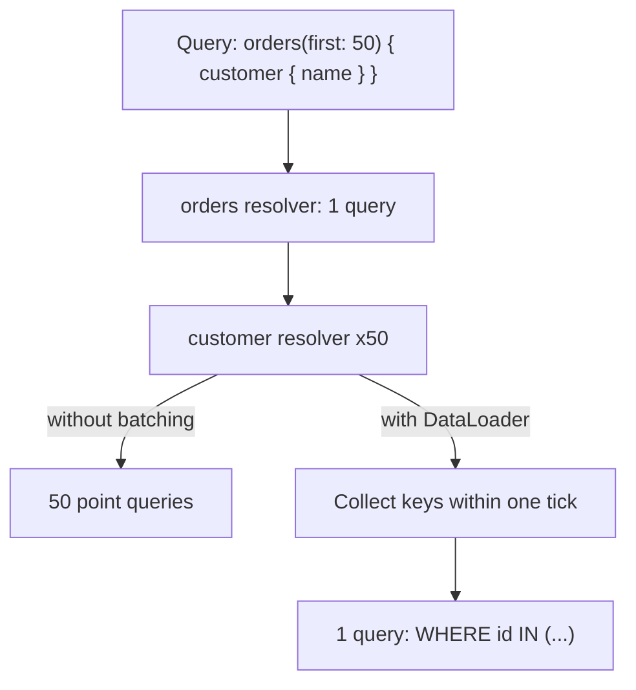
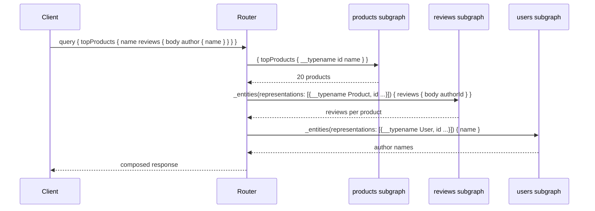

GraphQL moves response shaping from the server to the client. The client sends a query describing exactly the fields it wants and receives exactly those fields, which eliminates over-fetching and the chain of round trips a normalized REST model forces on a UI. The price is paid in four places: HTTP caching stops working because every request is a `POST` to one URL, request cost becomes unbounded and attacker-controlled, per-endpoint observability collapses into a single `/graphql` metric, and the N+1 query problem moves from the client into your resolver layer where it is much easier to hide.
 
Federation extends this to many teams: each service owns a **subgraph**, a router composes them into one **supergraph**, and clients query a unified schema that no single team owns. That buys organizational independence and costs you a distributed query planner in the hot path of every request.
 
## Execution Semantics
 
A GraphQL server is a type system plus **resolvers** — one function per field. Execution is a depth-first walk of the query's selection set: resolve a field, pass its result as the parent to child field resolvers, recurse. Sibling fields at the same level execute concurrently; root **mutation** fields execute strictly serially, which is the only ordering guarantee in the language.
 
That per-field resolver model is what makes GraphQL flexible and what makes it slow by default. A query selecting 5 fields on 100 objects invokes 500 resolvers, and any resolver that touches a database independently produces 500 queries.
 
### Nullability Propagation Is a Data-Loss Mechanism
 
Every field is nullable unless declared `Type!`. When a resolver for a non-null field returns an error or `null`, the error propagates *upward* to the nearest nullable ancestor, which is then set to `null` — discarding sibling fields that resolved successfully.
 
```graphql
type Query {
  order(id: ID!): Order        # nullable: errors stop here
}
 
type Order {
  id: ID!
  lineItems: [LineItem!]!      # non-null list of non-null items
  recommendations: [Product!]  # nullable: a failure here nulls only this field
}
```
 
If one element of `lineItems` fails to resolve, the whole `Order` becomes `null` because `lineItems` cannot be null and `Order` is the nearest nullable ancestor. A recommendation service outage that nulls `recommendations` costs one field; the same outage behind a non-null field costs the entire response.
 
:::caution
Declare a field `!` only when the client genuinely cannot render without it. Aggressive non-null annotations are the most common cause of "the whole page is blank because one downstream is degraded" — the schema itself converts a partial failure into a total one. Non-null is a coupling decision, not a data-quality assertion.
:::
 
Errors travel in a top-level `errors` array alongside partial `data`, and the HTTP status is `200` regardless. Every gateway metric, circuit breaker, and SLO built on HTTP status codes reads 100% success during a complete backend failure — the same trap as gRPC's trailer-borne status, and it must be fixed the same way, by extracting error counts from the body at the proxy or by emitting them from the server as first-class metrics.
 
## The N+1 Problem and DataLoader
 
The canonical failure: a query for 50 orders, each with a `customer` field, invokes the customer resolver 50 times and issues 50 `SELECT ... WHERE id = ?` statements.
 

*DataLoader defers key collection to the end of the event-loop tick and issues a single batched query for the whole level.*
 
**DataLoader** is the standard fix: resolvers request keys instead of rows, the loader accumulates keys until the current tick ends, then calls a batch function once with all of them and distributes results back by key. It also memoizes within the request, so the same key requested by ten resolvers costs one lookup.
 
Two constraints are non-negotiable. The loader instance must be created **per request** — a shared loader leaks one user's authorized data into another user's response through the memoization cache, and never expires stale rows. And the batch function must return results in the exact order of the requested keys, including explicit nulls for missing ones; misalignment silently returns the wrong entity for the wrong ID, which no test that uses a single-item fixture will catch.
 
Batching does not fix depth. A three-level nested query still produces three sequential batch rounds, so latency is proportional to query *depth* even when it is not proportional to breadth.
 
## Query Cost Control
 
A public GraphQL endpoint without cost controls lets any client construct a query that traverses cyclic relationships and multiplies work exponentially — `user { friends { friends { friends { ... } } } }`. The defenses compose; none is sufficient alone:
 
- **Depth limiting** rejects queries beyond a fixed nesting level. Cheap, coarse, and easily evaded by a wide shallow query.
- **Complexity analysis** assigns a static cost per field, multiplied by pagination arguments, and rejects queries above a budget. This is the real control, and it requires cost annotations that are maintained as the schema evolves.
- **Pagination limits** with a hard maximum on `first`/`last`, enforced in the schema and rechecked in resolvers.
- **Persisted queries (trusted documents)**: clients send a hash of a query registered at build time rather than the query text. The server executes only known operations, which eliminates arbitrary-query attacks entirely and shrinks request payloads. This is the correct posture for first-party clients; only genuinely open APIs need to accept arbitrary documents.
- **Introspection disabled in production** for non-public schemas. It is a schema disclosure, not a security boundary by itself, but there is no reason to publish an attack map.
- **Timeouts and concurrency budgets per resolver and per operation**, since complexity scoring is a static estimate and real cost is data-dependent (see [Load Shedding](/distributed-systems/en/resilience/flow-control/load-shedding/)).
Rate limiting by request count is meaningless here: one request can be a thousand times more expensive than another. Limit by computed complexity points consumed per window rather than by requests (see [Throttling and Rate Limiting at the Gateway Level](/distributed-systems/en/communication/api-gateway/throttling-rate-limiting/)).
 
## Caching Without URLs
 
GraphQL discards the property that makes [REST](/distributed-systems/en/communication/synchronous-protocols/rest/) cacheable: a `POST` to `/graphql` is uncacheable by every intermediary, and the URL carries no identity for the resource being fetched. Three layers replace it, and they are not interchangeable:
 
1. **CDN and edge caching** becomes possible only by sending the operation as a `GET` with a persisted-query hash in the query string, so the URL once again identifies the operation. Response `Cache-Control` is then computed from the most restrictive `@cacheControl` hint among the selected fields — one uncached field makes the whole response uncacheable.
2. **Server-side entity caching** keyed by type and ID, sitting under the resolvers. This survives arbitrary query shapes because it caches entities rather than responses, and it is where most of the benefit actually is.
3. **Normalized client caches** (Apollo Client, Relay, urql) split the response into entities keyed by a globally unique ID, so a mutation returning an updated object patches every view referencing it. This requires globally unique IDs across subgraphs; type-local integer IDs collide and corrupt the cache.
## Federation
 
Federation composes independently deployed subgraphs into one schema. Each subgraph declares which types it owns with `@key`, and the router resolves references across boundaries.
 
| Directive | Meaning | Typical use |
|-----------|---------|-------------|
| `@key(fields: "id")` | This type is an entity, addressable by these fields | Any type extended by another subgraph |
| `@external` | Field is defined in another subgraph | Referencing a key field locally |
| `@requires(fields: "...")` | This resolver needs fields owned elsewhere | Computed field depending on foreign data |
| `@provides(fields: "...")` | This path can return foreign fields without a hop | Denormalized data already in hand |
| `@shareable` | Multiple subgraphs may resolve this field | Fields legitimately duplicated |
| `@inaccessible` | Present in subgraphs, hidden from the supergraph | Staged rollout of a field |
 
```graphql
# products subgraph: owns Product
type Product @key(fields: "id") {
  id: ID!
  name: String!
  priceMinorUnits: Int!
}
 
# reviews subgraph: extends Product without owning it
type Product @key(fields: "id") {
  id: ID!
  reviews(first: Int! = 10): [Review!]!
  averageRating: Float
}
 
type Review @key(fields: "id") {
  id: ID!
  body: String!
  rating: Int!
  # The reviews subgraph knows only the key; the router fetches the rest.
  product: Product!
}
```
 
The router builds a **query plan**: a DAG of subgraph fetches with parallel branches where data is independent and sequential edges where one fetch depends on another's output. Cross-subgraph resolution uses the `_entities` root field — the router sends representations (the `@key` fields plus `__typename`) to the owning subgraph and receives the requested fields back.
 

*Each level of the query costs one sequential round to the owning subgraph; latency tracks query depth, not the number of subgraphs.*
 
Two properties follow. Latency is the critical path through the plan, so a deeply nested cross-subgraph query costs one sequential hop per boundary crossing regardless of how fast each subgraph is. And the fan-out is data-dependent: 20 products with 10 reviews each produce a representation list of 200 users, so subgraphs must be built to handle large `_entities` batches efficiently or the batching advantage inverts into a bulk-query timeout.
 
Composition is a build-time gate. The supergraph schema is composed from subgraph schemas in CI, and incompatible changes — a removed field another subgraph `@requires`, a type ownership conflict, an incompatible `@shareable` — fail composition before deployment. This is the mechanism that makes federation safe, and it is also a shared blocking dependency: a broken composition blocks every team's deploy, so composition checks must run on subgraph PRs, not only at publish time.
 
:::tip
Subgraph boundaries should follow bounded contexts, not database tables (see [Domain-Driven Design](/distributed-systems/en/microservice-patterns/service-decomposition/domain-driven-design/)). When two subgraphs both need to `@requires` fields from each other, the boundary is wrong: you have split one aggregate across two services and every query now pays two hops to reassemble it.
:::
 
## Router Configuration and Resolvers
 
```yaml
# Router: per-subgraph budgets and cost limits. Defaults are permissive
# and a single slow subgraph will otherwise stall the whole supergraph.
supergraph:
  listen: 0.0.0.0:4000
 
traffic_shaping:
  all:
    timeout: 5s              # per-subgraph request budget
    deduplicate_variables: true
  subgraphs:
    reviews:
      timeout: 800ms         # non-critical: fail fast and null the field
      global_rate_limit:
        capacity: 2000
        interval: 1s
 
limits:
  max_depth: 12
  max_aliases: 30
  max_root_fields: 20
  parser_max_tokens: 15000
 
persisted_queries:
  enabled: true
  safelist:
    enabled: true            # reject any operation not in the manifest
    require_id: true
 
telemetry:
  instrumentation:
    spans:
      mode: spec_compliant   # one span per subgraph fetch, not per request
```
 
```typescript
import DataLoader from "dataloader";
import type { Request } from "express";
 
interface Customer {
  id: string;
  name: string;
}
 
// Created per request. A module-level loader would leak one user's
// authorized rows into another user's response via the memo cache.
export function createLoaders(req: Request) {
  return {
    customerById: new DataLoader<string, Customer | null>(
      async (ids) => {
        const rows = await db.query<Customer>(
          "SELECT id, name FROM customers WHERE id = ANY($1) AND tenant_id = $2",
          [ids as string[], req.auth.tenantId],
        );
 
        // The batch function MUST return results positionally aligned
        // with `ids`, including explicit nulls. Returning the raw rows
        // silently maps the wrong customer onto the wrong order.
        const byId = new Map(rows.map((r) => [r.id, r]));
        return ids.map((id) => byId.get(id) ?? null);
      },
      { maxBatchSize: 500 }, // bound the IN clause; huge batches stall the DB
    ),
  };
}
 
export const resolvers = {
  Order: {
    async customer(
      order: { customerId: string },
      _args: unknown,
      ctx: { loaders: ReturnType<typeof createLoaders>; signal: AbortSignal },
    ) {
      // Honour cancellation: an abandoned HTTP request should not keep
      // resolvers running against the database.
      if (ctx.signal.aborted) throw new Error("request cancelled");
 
      const customer = await ctx.loaders.customerById.load(order.customerId);
      if (customer === null) {
        // Nullable field: return null rather than throwing, so one missing
        // customer does not null the entire Order via error propagation.
        return null;
      }
      return customer;
    },
  },
};
```
 
## Failure Modes and Operational Pitfalls
 
**One slow subgraph degrading everything.** Symptom: p99 on all operations tracks the slowest subgraph, even for queries that barely touch it. Detection requires per-subgraph fetch latency in the router's traces, not per-operation totals (see [Distributed Tracing](/distributed-systems/en/observability/logs-metrics-traces/distributed-tracing/)). Fix with per-subgraph timeouts sized to the field's importance and nullable fields so a timeout degrades rather than fails.
 
**Observability collapse.** Every request is `POST /graphql`, so URL-based dashboards show one endpoint with a bimodal latency distribution and no way to attribute cost. Require an operation name on every request, reject anonymous operations, and emit metrics keyed by operation name and by resolver.
 
**Error masking.** Server-side exception details leaking into the `errors` array disclose stack traces, SQL fragments, and internal hostnames. Mask errors by default in production and correlate with a trace ID that the client can quote in a support ticket.
 
**Cross-subgraph mutations without atomicity.** A single mutation touching two subgraphs is two independent writes with no transaction. There is no distributed commit in the protocol; if the second fails, the first stands. Model this explicitly with a [SAGA](/distributed-systems/en/coordination/distributed-transactions/saga-pattern/) and compensating actions, or keep the mutation inside one subgraph.
 
**Cache poisoning through shared loaders.** A loader or entity cache keyed without the tenant or authorization scope returns another tenant's data. The key must include every dimension the authorization decision depends on.
 
**Schema drift and silent breakage.** A field removal that composition permits can still break a client that was using it. Track per-field usage from operation telemetry, deprecate with `@deprecated(reason: ...)`, and remove only after usage reaches zero — the GraphQL equivalent of versioning discipline (see [API Versioning Strategies](/distributed-systems/en/communication/synchronous-protocols/api-versioning/)).
 
**Subscriptions treated as free.** Each subscription is a long-lived connection holding server state and a subgraph fan-out. At scale they have the same pinning, reconnect-storm, and idle-timeout properties as any long-lived stream (see [WebSocket and Server-Sent Events](/distributed-systems/en/communication/synchronous-protocols/websocket-sse/)).
 
## When to Use GraphQL
 
| Dimension | GraphQL | REST | gRPC |
|-----------|---------|------|------|
| Response shaping | Client-specified | Fixed per endpoint | Fixed per method |
| Round trips for a composite view | One | Many, or a purpose-built endpoint | Many, or a composite RPC |
| Edge caching | Only via persisted GET queries | Native | None |
| Request cost predictability | Unbounded without controls | Bounded per endpoint | Bounded per method |
| Schema enforcement | Strong, introspectable | Advisory (OpenAPI) | Compiler-enforced |
| Operational tooling | Specialized | Universal HTTP | Specialized |
 
Use GraphQL when many heterogeneous clients need different projections of the same entity graph and the alternative is a proliferating set of bespoke endpoints; when the frontend team's iteration speed is bottlenecked by backend endpoint changes; and when a federated supergraph genuinely reduces the coordination cost of assembling data owned by different teams.
 
Do not use it for internal service-to-service RPC, where [gRPC](/distributed-systems/en/communication/synchronous-protocols/grpc-protocol-buffers/) gives a stricter contract with a fraction of the runtime cost. Do not use it for read-heavy public APIs whose value comes from CDN caching. And if you have exactly one first-party client, a [BFF](/distributed-systems/en/communication/api-gateway/bff-pattern/) delivers most of the shaping benefit without the query planner, the cost analysis, or the federated composition pipeline.