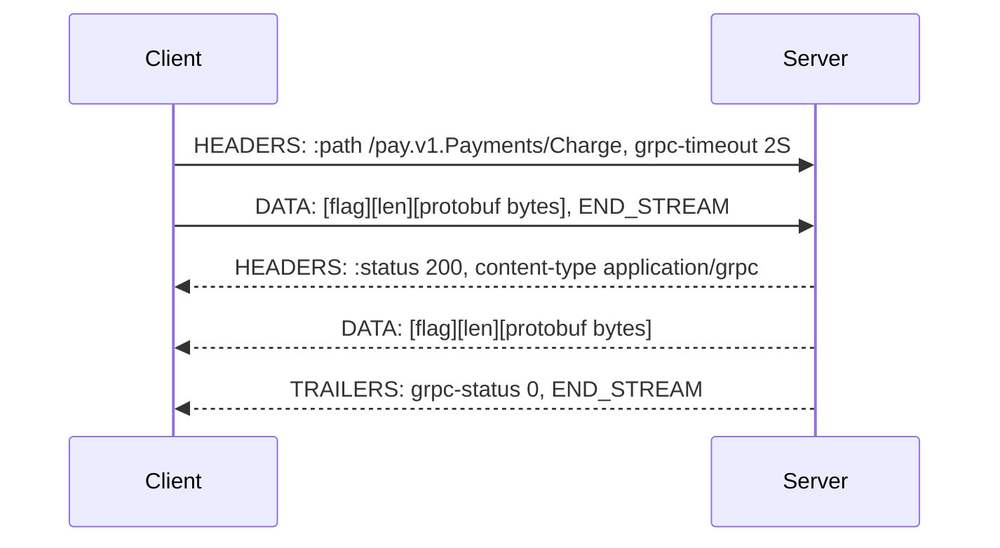
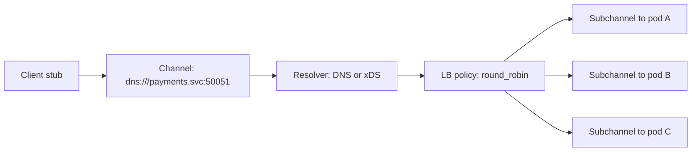

gRPC buys you compact binary encoding, a compiler-enforced contract, first-class deadlines, and bidirectional streaming. It costs you human-readable traffic, intermediary caching, browser reachability without a proxy, and a build pipeline that must generate stubs for every consumer language before anyone can call anything. The encoding win is real but usually smaller than expected — roughly 30-50% smaller payloads and 5-10x faster serialization than JSON on structured data — while the operational win from enforced deadlines and typed contracts is what actually pays for the migration.
 
**gRPC** is an RPC framework composed of three separable pieces that are tightly coupled in practice: Protocol Buffers as the interface definition language (**IDL**) and wire format, HTTP/2 as the transport, and a status protocol carried in HTTP trailers.
 
## Protobuf Wire Format: Field Numbers Are the Contract
 
A protobuf message on the wire is a flat sequence of key-value pairs. The key is a varint equal to `(field_number << 3) | wire_type`. Field *names* never appear on the wire — only numbers.
 
| Wire type | Value | Used by |
|-----------|-------|---------|
| VARINT | 0 | `int32`, `int64`, `uint32`, `uint64`, `sint32`, `sint64`, `bool`, `enum` |
| I64 | 1 | `fixed64`, `sfixed64`, `double` |
| LEN | 2 | `string`, `bytes`, embedded messages, packed repeated fields |
| I32 | 5 | `fixed32`, `sfixed32`, `float` |
 
**Varint** encoding uses 7 bits per byte with the high bit as a continuation flag, so small numbers cost one byte and values above 2^28 cost five. This has a direct design consequence: a negative `int32` is sign-extended to 64 bits and always consumes 10 bytes. Use `sint32`/`sint64`, which apply **ZigZag** encoding (`(n << 1) ^ (n >> 31)`) to map small-magnitude negatives onto small varints, for any field that can go negative.
 
Field numbers 1-15 encode their tag in a single byte; 16-2047 need two. Assign the low numbers to fields present on every message in a hot path, and leave a gap before starting rarely-set fields.
 
`repeated` scalar fields are **packed** by default in proto3: one LEN-prefixed block containing all values rather than a tag per element. A `repeated int32` of 1000 small values costs roughly 1000 bytes packed versus 2000 unpacked.
 
### Compatibility Rules That Actually Bind
 
The wire format has no schema negotiation. A reader that encounters an unrecognized field number retains it in an unknown-fields set and re-emits it on serialization, which is what makes proxy-and-forward services non-lossy. That mechanism defines what is safe:
 
- **Safe:** adding a field with a fresh number; removing a field *if* you `reserved` its number and name; renaming a field (names are local to the generated code); converting among `int32`, `uint32`, `int64`, `uint64`, and `bool` for in-range values; adding enum values.
- **Unsafe:** reusing a retired field number — old readers decode new data into the old field's type and silently produce garbage; changing a field's wire type; moving a field into or out of a `oneof`; switching between packed and unpacked representations for a non-scalar type.
:::danger
Never reuse a field number, even years after removing the field. One long-lived client, a message persisted in a Kafka topic, or a snapshot in object storage will decode number 7 with its old meaning and no error will be raised anywhere. Always write `reserved 7;` and `reserved "old_field_name";` so the compiler rejects reuse at build time — the only enforcement that survives team turnover.
:::
 
Enums are the second silent-corruption source. Proto3 requires the zero value to be an unspecified sentinel (`STATUS_UNSPECIFIED = 0`), and enums are open: a reader receiving a value it does not know keeps the number but cannot name it, so any `switch` without a default branch mishandles it. Treat unknown enum values as an explicit rejection path, never as the zero value.
 
### Presence: The Proto3 Trap
 
Proto3 originally removed field presence for scalars: a field set to `0`, `""`, or `false` is indistinguishable on the wire from an unset field, because default values are simply not serialized. This is correct for full-replacement writes and catastrophic for partial updates. A client sending `{balance: 0}` in an update RPC produces bytes identical to a message that omits `balance` entirely.
 
Two fixes exist. The `optional` keyword (restored in protobuf 3.15) generates explicit presence via a synthetic `oneof` and gives you `has_balance()`. Alternatively use a `google.protobuf.FieldMask` listing the fields the caller intends to modify — the convention for `Update*` RPCs, and the one that makes intent explicit rather than inferred.
 
## The gRPC Protocol on the Wire
 
A unary call is exactly one HTTP/2 stream. The method is encoded in `:path` as `/package.Service/Method`; there is no URL structure, no query string, and no HTTP verb semantics.
 

*The RPC result lives in trailers, not in the HTTP status: a transport-level 200 carrying grpc-status 13 is a failed call.*
 
Each message is length-prefixed with a 5-byte header: one compression-flag byte plus a 4-byte big-endian length. That framing is why gRPC requires a full HTTP/2 implementation end to end, and why any intermediary that buffers or rewrites bodies breaks it. The underlying stream mechanics, flow-control windows, and `GOAWAY` semantics are covered in [HTTP/2 and HTTP/3](/distributed-systems/en/communication/synchronous-protocols/http2-http3-quic/).
 
The **trailers** requirement is the sharpest operational constraint. `grpc-status` and `grpc-message` arrive after the body, so every proxy on the path must support HTTP/2 trailers. A server that fails before emitting any message sends a *trailers-only* response — a single `HEADERS` frame with `END_STREAM` carrying both `:status: 200` and the error code. Middleware that assumes a body follows headers mishandles precisely the error case.
 
:::caution
HTTP status 200 with `grpc-status: 14` is a failure. Gateway dashboards and SLO alerting built on HTTP status codes report 100% success during a total outage of a gRPC backend. Every proxy metrics pipeline must extract `grpc-status` from trailers explicitly, or your error-rate SLO is measuring nothing.
:::
 
### Deadlines Are the Feature
 
Every call carries a deadline in the `grpc-timeout` header as a value plus unit (`2S`, `500m`). The server converts it to a local deadline and the idiomatic frameworks propagate it into the request context, so downstream calls inherit the remaining budget automatically. On expiry the client cancels the stream with `RST_STREAM` and the server's context is cancelled — work actually stops instead of continuing on a request nobody is waiting for.
 
This is a real advantage over ad-hoc HTTP clients, where the server typically keeps working after the client has given up (see [Timeouts](/distributed-systems/en/resilience/protection-patterns/timeouts/)). The rule that makes it hold: deadlines are absolute and propagated, never re-derived per hop. A hop that sets a fresh 5 s timeout instead of inheriting the remaining 300 ms reintroduces exactly the asymmetry the mechanism exists to prevent.
 
### Status Codes and Retryability
 
| Code | Numeric | Retry safe? | Typical cause |
|------|---------|-------------|---------------|
| `OK` | 0 | — | Success |
| `CANCELLED` | 1 | No | Caller cancelled, or a propagated cancellation |
| `DEADLINE_EXCEEDED` | 4 | Only if idempotent | Budget exhausted; server may still be working |
| `NOT_FOUND` | 5 | No | Missing resource |
| `ALREADY_EXISTS` | 6 | No | Idempotent-create collision; usually treat as success |
| `PERMISSION_DENIED` | 7 | No | Valid identity, insufficient authority |
| `RESOURCE_EXHAUSTED` | 8 | Yes, with backoff | Quota, rate limit, message-size overflow |
| `FAILED_PRECONDITION` | 9 | No | System state wrong; retry cannot help |
| `ABORTED` | 10 | Yes | Concurrency conflict or transaction abort |
| `UNIMPLEMENTED` | 12 | No | Version skew between client and server |
| `INTERNAL` | 13 | No | Server bug; deterministic on retry |
| `UNAVAILABLE` | 14 | Yes | Transient: connection failure, draining, restart |
 
`UNAVAILABLE` is the only unconditionally retryable code, because it is defined to mean the RPC never reached application logic. `DEADLINE_EXCEEDED` is ambiguous by construction: the server may have committed the write before the client gave up, so retrying a non-idempotent call duplicates the effect (see [Idempotency and Safe HTTP Methods](/distributed-systems/en/communication/api-gateway/idempotency/)).
 
Rich error detail belongs in `google.rpc.Status` details rather than in `grpc-message`, which is a length-limited, header-safe string. Encode a typed `ErrorInfo` or `QuotaFailure` so clients branch on structure instead of substring-matching English prose.
 
## Channels, Subchannels, and Load Balancing
 
A gRPC **channel** is a virtual connection to a logical service: it resolves a name to a set of addresses and maintains one **subchannel** — one HTTP/2 connection — per address. The load-balancing policy picks a subchannel per RPC, which is what makes client-side balancing possible at all.
 

*Per-RPC balancing across subchannels; an L4 proxy in front of this would pin every RPC from the channel to a single backend.*
 
The default policy is `pick_first`, which uses one connection and therefore sends all traffic to one backend. For a replicated service that is almost never what you want: `round_robin` over a resolver returning all endpoints (a Kubernetes headless service, or xDS from a control plane) is the baseline. The alternative is an L7 proxy that understands HTTP/2 and balances per stream.
 
What does not work is an L4 load balancer. A channel holds one long-lived connection, so every RPC from that client lands on one backend until the connection dies, and newly scaled replicas receive nothing. Mitigate server-side with `MaxConnectionAge` plus jitter, forcing periodic `GOAWAY` and re-resolution (see [L4 vs. L7 Load Balancing](/distributed-systems/en/communication/load-balancing/l4-vs-l7/) and [Client-Side Discovery](/distributed-systems/en/microservice-patterns/service-discovery/client-side-discovery/)).
 
Keepalive must be configured symmetrically. A client pinging more often than the server's enforcement policy permits receives `GOAWAY` with `ENHANCE_YOUR_CALM` and `too_many_pings`, which shows up as periodic mass disconnects that look like network instability. Server `MinTime` must be less than or equal to the client keepalive interval.
 
## Implementation
 
```proto
syntax = "proto3";
 
package pay.v1;
 
option go_package = "example.com/gen/pay/v1;payv1";
 
import "google/protobuf/timestamp.proto";
 
service Payments {
  rpc Charge(ChargeRequest) returns (ChargeResponse);
}
 
message ChargeRequest {
  // Field numbers 1-15 cost a single tag byte; reserve them for
  // fields present on every request in the hot path.
  string account_id = 1;
  int64 amount_minor_units = 2;
  string currency = 3;
  // Client-generated key that makes this RPC safe to retry.
  string idempotency_key = 4;
 
  // Field 5 held a removed "merchant_code" string. Reusing the number
  // would make old readers decode new data as merchant_code.
  reserved 5;
  reserved "merchant_code";
 
  // Explicit presence: distinguishes "capture_immediately = false"
  // from "caller did not specify".
  optional bool capture_immediately = 6;
}
 
message ChargeResponse {
  string payment_id = 1;
  Status status = 2;
  google.protobuf.Timestamp settled_at = 3;
 
  enum Status {
    // Proto3 requires a zero sentinel. Treat it as a protocol error,
    // never as a valid business state.
    STATUS_UNSPECIFIED = 0;
    STATUS_AUTHORIZED = 1;
    STATUS_CAPTURED = 2;
    STATUS_DECLINED = 3;
  }
}
```
 
```go
package main
 
import (
	"context"
	"errors"
	"log/slog"
	"net"
	"time"
 
	"google.golang.org/grpc"
	"google.golang.org/grpc/codes"
	"google.golang.org/grpc/credentials"
	"google.golang.org/grpc/keepalive"
	"google.golang.org/grpc/status"
 
	payv1 "example.com/gen/pay/v1"
)
 
type server struct {
	payv1.UnimplementedPaymentsServer
	ledger Ledger
}
 
func (s *server) Charge(ctx context.Context, req *payv1.ChargeRequest) (*payv1.ChargeResponse, error) {
	if req.GetIdempotencyKey() == "" {
		return nil, status.Error(codes.InvalidArgument, "idempotency_key is required")
	}
 
	// The caller's deadline is already in ctx. Never create a fresh
	// timeout here: that lets this hop outlive the caller.
	if dl, ok := ctx.Deadline(); ok && time.Until(dl) < 50*time.Millisecond {
		// Not enough budget left to finish. Fail fast so the caller sees
		// a clean error instead of a half-applied write.
		return nil, status.Error(codes.DeadlineExceeded, "insufficient remaining deadline")
	}
 
	res, err := s.ledger.Charge(ctx, req.GetIdempotencyKey(), req.GetAmountMinorUnits())
	switch {
	case errors.Is(err, ErrDuplicate):
		// Idempotent replay: return the original result, not an error.
		return res.Proto(), nil
	case errors.Is(err, ErrInsufficientFunds):
		// FAILED_PRECONDITION: retrying cannot succeed until state changes.
		return nil, status.Error(codes.FailedPrecondition, "insufficient funds")
	case errors.Is(err, context.DeadlineExceeded):
		return nil, status.Error(codes.DeadlineExceeded, "ledger did not respond in time")
	case err != nil:
		slog.ErrorContext(ctx, "charge failed", "key", req.GetIdempotencyKey(), "err", err)
		// INTERNAL is not client-retryable, which is correct for bugs.
		return nil, status.Error(codes.Internal, "charge failed")
	}
	return res.Proto(), nil
}
 
func main() {
	creds, err := credentials.NewServerTLSFromFile("cert.pem", "key.pem")
	if err != nil {
		slog.Error("tls load failed", "err", err)
		return
	}
 
	srv := grpc.NewServer(
		grpc.Creds(creds),
		// Bound concurrent work; otherwise one client can occupy every
		// handler goroutine in the process.
		grpc.MaxConcurrentStreams(250),
		// Default is 4 MiB. Raise deliberately, and prefer streaming
		// over oversized unary payloads.
		grpc.MaxRecvMsgSize(8<<20),
		grpc.KeepaliveEnforcementPolicy(keepalive.EnforcementPolicy{
			// Must be <= the client keepalive interval, or clients get
			// GOAWAY with too_many_pings and reconnect in a loop.
			MinTime:             10 * time.Second,
			PermitWithoutStream: true,
		}),
		grpc.KeepaliveParams(keepalive.ServerParameters{
			Time:    20 * time.Second,
			Timeout: 5 * time.Second,
			// Force periodic reconnection so long-lived clients
			// rediscover newly scaled backends. Grace plus jitter
			// avoids a synchronized reconnect wave.
			MaxConnectionAge:      30 * time.Minute,
			MaxConnectionAgeGrace: 30 * time.Second,
		}),
	)
	payv1.RegisterPaymentsServer(srv, &server{})
 
	lis, err := net.Listen("tcp", ":50051")
	if err != nil {
		slog.Error("listen failed", "err", err)
		return
	}
	if err := srv.Serve(lis); err != nil {
		slog.Error("serve stopped", "err", err)
	}
}
```
 
Client retry policy belongs in the service config rather than in hand-written loops, so the framework can enforce a global budget instead of letting every call site amplify load independently:
 
```json
{
  "loadBalancingConfig": [{ "round_robin": {} }],
  "methodConfig": [
    {
      "name": [{ "service": "pay.v1.Payments" }],
      "timeout": "2s",
      "retryPolicy": {
        "maxAttempts": 4,
        "initialBackoff": "0.1s",
        "maxBackoff": "1s",
        "backoffMultiplier": 2,
        "retryableStatusCodes": ["UNAVAILABLE", "RESOURCE_EXHAUSTED"]
      }
    }
  ],
  "retryThrottling": {
    "maxTokens": 100,
    "tokenRatio": 0.1
  }
}
```
 
`retryThrottling` is the clause most often omitted and the one that matters most: it caps retries as a fraction of successful calls, so a struggling backend does not receive 4x its normal load from clients that are all retrying simultaneously (see [Retry Storms and Metastable Failures](/distributed-systems/en/resilience/flow-control/retry-storms-metastable-failures/)).
 
## Failure Modes and Operational Pitfalls
 
**Message-size cliffs.** The 4 MiB default receive limit produces `RESOURCE_EXHAUSTED` at the transport layer, typically for the single largest tenant only. Symptom: an RPC that works for 99% of accounts and fails deterministically for a handful. Fix by paginating or switching to server streaming (see [gRPC Streaming](/distributed-systems/en/communication/synchronous-protocols/grpc-streaming/)) rather than raising the ceiling indefinitely — a large unary message also means one contiguous allocation per in-flight call.
 
**Load imbalance after scale-out.** New pods idle while old ones saturate, because channels are pinned to backends. Detect with per-pod RPC-rate variance following a deployment; fix with `MaxConnectionAge` and a real LB policy rather than restarting clients.
 
**Deadline amnesia.** A service creates a new context with `context.Background()` instead of propagating the caller's, so work continues after the client has given up. Symptom: backend CPU and database load uncorrelated with client-observed traffic. Detect by comparing server-side handler duration against client-side RPC duration histograms — a heavy server tail with no matching client tail is the signature.
 
**Version skew producing `UNIMPLEMENTED`.** A client generated from a newer proto calls a method the deployed server lacks. This is a deploy-ordering bug: server first, client second, always. Failing CI on any proto change that removes or renames an RPC is cheap insurance (see [API Versioning Strategies](/distributed-systems/en/communication/synchronous-protocols/api-versioning/)).
 
**Proxy incompatibility with trailers.** An intermediary that terminates HTTP/2 without trailer support converts every error into a hung stream or a bare 200. Verify end to end with `grpcurl` through the actual ingress path, never against the pod directly.
 
**Enum drift.** A new enum value ships in the producer and consumers that `switch` without a default silently take the wrong branch. Enforce a rejecting default branch, and treat enum additions as a coordinated rollout even though they are wire-compatible. Registry-level governance of this is covered in [Schema Evolution and Schema Registry](/distributed-systems/en/communication/async-messaging/schema-evolution-registry/).
 
**Blocking stubs exhausting the caller.** Synchronous stubs in languages with thread-per-request models convert a slow downstream into caller thread-pool exhaustion, which propagates the outage upward. Bound the pool separately per dependency (see [Bulkhead Pattern](/distributed-systems/en/resilience/protection-patterns/bulkhead-pattern/)).
 
**Browser unreachability.** Browsers cannot control HTTP/2 frames or read trailers, so native gRPC from a page is impossible. gRPC-Web or Connect requires a translating proxy (Envoy's gRPC-Web filter, or a Connect-compatible server), and gRPC-Web supports only unary and server-streaming calls.
 
## When to Use gRPC
 
| Dimension | gRPC | REST/JSON | GraphQL |
|-----------|------|-----------|---------|
| Payload size and codec CPU | Compact binary, fast | Verbose, parser-bound | Verbose |
| Contract enforcement | Compiler-checked IDL | Advisory (OpenAPI) | Schema-enforced |
| Deadline propagation | Built into the protocol | Manual per client | Manual |
| Intermediary caching | None | Native at every layer | Effectively none |
| Browser support | Requires a proxy | Universal | Universal |
| Debuggability | Needs `grpcurl` and descriptors | `curl` and eyes | Introspection tooling |
| Streaming | First-class bidirectional | SSE or WebSocket alongside | Subscriptions |
 
Use gRPC for internal service-to-service traffic where call volume is high enough that serialization cost and connection efficiency show up in the CPU profile, where polyglot teams need a contract the compiler enforces, and where deadline propagation and cancellation across a call graph have real operational value.
 
Prefer [REST](/distributed-systems/en/communication/synchronous-protocols/rest/) when consumers are external or unknown, when edge caching is worth more than encoding efficiency, or when operability through standard HTTP tooling matters. Prefer [GraphQL](/distributed-systems/en/communication/synchronous-protocols/graphql/) when clients must shape responses across many entity graphs. Note also that a gRPC service can be exposed as REST through a transcoding gateway driven by `google.api.http` annotations: internal callers take the binary path and external ones get JSON, from one definition and one source of truth.