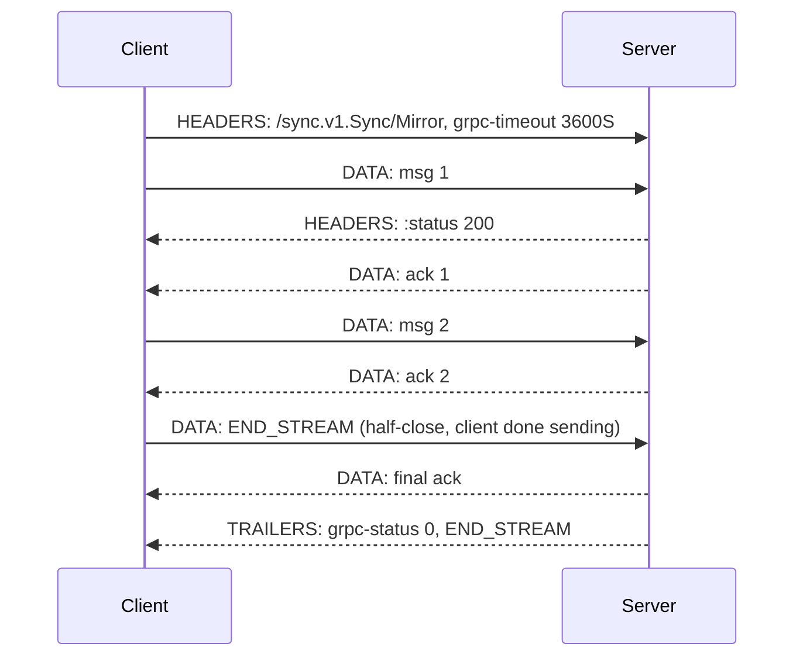

A stream is a single HTTP/2 stream held open for the duration of the call, and that single fact generates every trade-off on this page. You gain amortized framing cost, incremental delivery, and transport-level backpressure. You lose automatic retries after the first message, per-request load balancing, and the ability to treat any intermediary's idle timeout as somebody else's problem. Streams also pin memory and a concurrency slot on both peers for their entire lifetime, so an endpoint that holds 50,000 streams is an endpoint holding 50,000 slots on the server's `MAX_CONCURRENT_STREAMS` budget across its connections.
 
gRPC defines four call types, distinguished only by which side may send more than one message. The wire mechanics are identical: length-prefixed messages inside `DATA` frames, terminated by trailers carrying `grpc-status` (see [gRPC and Protocol Buffers](/distributed-systems/en/communication/synchronous-protocols/grpc-protocol-buffers/) for framing and status details).
 
| Call type | Client messages | Server messages | Retryable by the framework | Typical use |
|-----------|-----------------|-----------------|----------------------------|-------------|
| Unary | 1 | 1 | Yes | Ordinary RPC |
| Server-streaming | 1 | N | Only before the first response message | Large result sets, change feeds, tailing logs |
| Client-streaming | N | 1 | No | Bulk ingestion, file upload, metric batches |
| Bi-directional | N | N | No | Long-lived control planes, chat, interactive sessions |
 
## Lifecycle: Half-Close Is the Contract
 
A gRPC stream is two independent unidirectional byte flows. Each side closes its own direction with `END_STREAM`; the other direction stays open. This **half-close** is what makes client-streaming possible at all — the client finishes sending, the server then computes and replies on a direction that is still open.
 

*Bi-directional stream with client half-close; the server keeps sending after the client's direction is closed, and only trailers terminate the call.*
 
Three consequences follow directly:
 
- Message order is guaranteed within a direction and only within a direction. Nothing orders a client message against a server message; there is no request-response correlation unless you put a correlation ID in your own messages.
- The status arrives once, at the end, in trailers. A server that has already sent 10,000 messages and then fails emits `grpc-status: 13` after those messages. The client must be written to handle a partially-consumed stream that ends in an error — treating stream termination as success is a data-integrity bug, not a cosmetic one.
- There is no "error for message 7." Errors terminate the whole stream. Per-item failures in a bulk operation must be modeled inside the response message (a per-item status field), not as RPC errors.
## Backpressure Is HTTP/2 Flow Control, and It Is Not Automatic
 
The essential mechanism: every `DATA` frame consumes flow-control credit, and credit is only replenished by `WINDOW_UPDATE` after the receiver's application *reads* the message. A slow consumer stops calling `Recv`, the window drains, and the sender's `Send` blocks. That is real end-to-end backpressure propagating from application to transport, and it is the main reason streaming beats naive chunked HTTP for high-volume transfer.
 
It stops working the moment you break the coupling. Two common ways to break it:
 
- **Reading eagerly into an unbounded queue.** A receiver whose loop is `for { msg := Recv(); queue <- msg }` with an unbounded `queue` always drains the window promptly, so the sender never blocks and the receiver's heap grows until OOM. The queue must be bounded, and the bound is what translates into flow-control pressure.
- **Sending from an unbounded producer.** Fire-and-forget `Send` calls from a goroutine that never checks whether the peer is keeping up move the backlog into the sender's process instead.
Window sizing determines throughput exactly as it does for any HTTP/2 stream: the default 64 KB per stream caps a single stream at roughly bandwidth-delay-product limits, which is a few Mbps at intercontinental RTTs regardless of link capacity. Streaming across regions without raising `InitialWindowSize` is the most common cause of "gRPC streaming is slow" reports (see [HTTP/2 and HTTP/3](/distributed-systems/en/communication/synchronous-protocols/http2-http3-quic/)).
 
:::tip
Size messages between roughly 16 KB and 256 KB. Below that, per-message framing and codec overhead dominate and you burn CPU on syscall and allocation churn; above about 1 MB, a single message monopolizes the flow-control window, delays cancellation responsiveness, and forces a large contiguous allocation on the receiver. Chunk large payloads into a stream of medium messages rather than raising `MaxRecvMsgSize` toward the payload size.
:::
 
## Cancellation and Deadlines on Long-Lived Calls
 
Cancellation is a `RST_STREAM` frame. The server's context is cancelled and every blocking operation derived from it returns; this is the mechanism that makes streams cheap to abandon. What it does not do is unwind side effects — a client-streaming ingestion that has already written 40,000 of 50,000 rows leaves those rows written. Either make the operation idempotent under resume, or write to a staging area and commit atomically at half-close.
 
Deadlines are absolute and apply to the whole call, not per message. A server-streaming subscription with `grpc-timeout: 3600S` dies at one hour regardless of activity, and a subscription with no deadline never dies on its own — which is how you accumulate leaked streams from clients that vanished without a `FIN`. Both extremes are wrong in production:
 
- Set a finite maximum stream lifetime and have the client transparently reconnect with a resume token. This bounds resource leaks and forces the reconnect path to be exercised constantly instead of only during incidents.
- Enforce keepalive so that half-open connections — the client's machine slept, a NAT dropped the mapping, a firewall silently discarded state — are detected. Without keepalive pings the server holds the stream until the OS TCP timeout, which on Linux defaults to over two hours.
:::caution
gRPC's built-in retry policy is disabled for a call once the client has committed: for server-streaming, that is when the first response message is received; for client- and bi-directional streaming, once any message has been sent. Retries you configured in the service config silently do not apply to your streams. Stream resumption is an application-level concern — the client tracks the last processed offset or resume token and the server accepts it as a start position, exactly as a Kafka consumer tracks offsets (see [Kafka Architecture](/distributed-systems/en/communication/async-messaging/kafka-architecture/)).
:::
 
## Implementation
 
```proto
syntax = "proto3";
 
package sync.v1;
 
option go_package = "example.com/gen/sync/v1;syncv1";
 
service Sync {
  // Server-streaming: the resume token makes reconnection cheap after
  // a broken stream, since gRPC will not retry this for us.
  rpc WatchChanges(WatchRequest) returns (stream ChangeEvent);
 
  // Client-streaming: per-item outcomes go in the summary, because an
  // RPC error would abort the whole batch.
  rpc IngestBatch(stream Record) returns (IngestSummary);
 
  // Bi-directional: correlation_id is mandatory, since nothing in the
  // protocol pairs a response with a request.
  rpc Mirror(stream MirrorRequest) returns (stream MirrorResponse);
}
 
message WatchRequest {
  string shard_id = 1;
  // Opaque server-defined position. Empty means "from the beginning".
  string resume_token = 2;
}
 
message ChangeEvent {
  string entity_id = 1;
  bytes payload = 2;
  // Echoed on every event so the client can checkpoint and resume.
  string resume_token = 3;
}
 
message Record {
  string id = 1;
  bytes payload = 2;
}
 
message IngestSummary {
  int64 accepted = 1;
  repeated ItemFailure failures = 2;
 
  message ItemFailure {
    string id = 1;
    string reason = 2;
  }
}
```
 
Server-streaming with cancellation checks and bounded work per iteration:
 
```go
func (s *server) WatchChanges(req *syncv1.WatchRequest, stream syncv1.Sync_WatchChangesServer) error {
	ctx := stream.Context()
 
	cur, err := s.log.Open(ctx, req.GetShardId(), req.GetResumeToken())
	if err != nil {
		if errors.Is(err, ErrTokenExpired) {
			// The client must restart from a snapshot; a retry with the
			// same token would loop forever.
			return status.Error(codes.OutOfRange, "resume token expired, take a new snapshot")
		}
		return status.Error(codes.Internal, "cannot open change log")
	}
	defer cur.Close()
 
	for {
		// Cheap check so an abandoned client stops backend work immediately
		// instead of at the next blocking read.
		select {
		case <-ctx.Done():
			return status.FromContextError(ctx.Err()).Err()
		default:
		}
 
		ev, err := cur.Next(ctx)
		switch {
		case errors.Is(err, ErrNoMoreEvents):
			// Live tail: keep the stream open rather than terminating,
			// but respect the call deadline set by the client.
			if err := sleepCtx(ctx, 200*time.Millisecond); err != nil {
				return status.FromContextError(err).Err()
			}
			continue
		case err != nil:
			return status.Error(codes.Internal, "change log read failed")
		}
 
		// Send blocks when the HTTP/2 flow-control window is exhausted.
		// That block IS the backpressure: do not wrap it in a goroutine
		// with an unbounded queue.
		if err := stream.Send(ev.Proto()); err != nil {
			// A send error means the peer is gone; the status is already
			// determined by the transport, so just stop.
			return err
		}
	}
}
```
 
Bi-directional streaming needs concurrent send and receive loops, and the deadlock hazard is real:
 
```go
func (s *server) Mirror(stream syncv1.Sync_MirrorServer) error {
	ctx := stream.Context()
	g, ctx := errgroup.WithContext(ctx)
 
	// Bounded channel: this is what converts a slow producer into
	// flow-control pressure instead of unbounded heap growth.
	work := make(chan *syncv1.MirrorRequest, 64)
 
	g.Go(func() error {
		defer close(work)
		for {
			req, err := stream.Recv()
			if errors.Is(err, io.EOF) {
				return nil // client half-closed; drain and finish
			}
			if err != nil {
				return err
			}
			select {
			case work <- req:
			case <-ctx.Done():
				return ctx.Err()
			}
		}
	})
 
	g.Go(func() error {
		for req := range work {
			resp, err := s.apply(ctx, req)
			if err != nil {
				// Per-item failure travels inside the message. Returning
				// an error here would kill the whole session.
				resp = &syncv1.MirrorResponse{
					CorrelationId: req.GetCorrelationId(),
					Error:         err.Error(),
				}
			}
			// Send and Recv on a stream are each single-goroutine-safe but
			// must never be called concurrently with themselves.
			if err := stream.Send(resp); err != nil {
				return err
			}
		}
		return nil
	})
 
	return g.Wait()
}
```
 
```go
// Client keepalive must not be more aggressive than the server's
// EnforcementPolicy MinTime, or the server answers with GOAWAY
// and too_many_pings and the client reconnects in a loop.
conn, err := grpc.NewClient(target,
	grpc.WithTransportCredentials(creds),
	grpc.WithDefaultServiceConfig(`{"loadBalancingConfig":[{"round_robin":{}}]}`),
	grpc.WithKeepaliveParams(keepalive.ClientParameters{
		Time:                20 * time.Second, // ping an idle connection
		Timeout:             5 * time.Second,  // declare it dead after this
		PermitWithoutStream: true,             // required for idle subscriptions
	}),
	grpc.WithInitialWindowSize(4<<20),     // per stream, sized to the BDP
	grpc.WithInitialConnWindowSize(16<<20),
)
```
 
Intermediaries need explicit configuration or they will terminate long-lived streams on their own schedule:
 
```yaml
# Envoy route for a streaming service. The defaults are wrong for streams.
route:
  cluster: sync_v1
  # Disable the overall route timeout; it applies to the entire call,
  # so any finite value kills long-lived streams at that boundary.
  timeout: 0s
  # Idle timeout measured between frames, not for the whole stream.
  # Must exceed the application-level keepalive interval.
  idle_timeout: 300s
```
 
## Failure Modes and Operational Pitfalls
 
**Proxy idle timeouts terminating healthy streams.** Symptom: subscriptions die at a suspiciously round interval — 60 s, 5 min, 1 h — from every client simultaneously, with `UNAVAILABLE` and no server-side error. Detection: stream duration histograms with a hard cliff at a fixed value. The offender is usually a load balancer or ingress default rather than the application; check every hop, since the shortest timeout on the path wins.
 
**Streams silently bypassing retries.** Symptom: transient backend restarts produce user-visible failures on streaming endpoints while unary endpoints self-heal. Cause: the retry policy is inapplicable once the call is committed. Fix with application-level resume tokens plus client-side reconnect with exponential backoff and jitter (see [Retry with Exponential Backoff and Jitter](/distributed-systems/en/resilience/protection-patterns/retry-exponential-backoff/)).
 
**Bi-directional deadlock.** Both peers block in `Send` because neither is calling `Recv`, so neither flow-control window is replenished. The stream hangs until the deadline. This is a design error, not a tuning problem: send and receive must run in separate goroutines or on an event loop, and no code path may block a send on a response that arrives on the same stream.
 
**Load imbalance from long-lived streams.** A stream pins a client to one backend for hours. After a scale-out, new pods receive nothing; after a rolling update, all reconnections land simultaneously on whichever pods are up, producing a thundering herd. Mitigate with a bounded maximum stream lifetime with jitter (so reconnects spread), `MaxConnectionAge` on the server, and client-side balancing over multiple subchannels (see [L4 vs. L7 Load Balancing](/distributed-systems/en/communication/load-balancing/l4-vs-l7/)).
 
**Stream slot exhaustion.** Each open stream consumes one of `MAX_CONCURRENT_STREAMS` on its connection. Symptom: new RPCs queue client-side with no server-side load, since the client is waiting for a slot rather than for the server. Detect by monitoring in-flight streams per connection against the negotiated limit; a subscription workload and a request-response workload sharing a channel will starve each other.
 
**Half-open connections holding resources.** A client that vanishes without TCP teardown leaves the server holding the stream, its goroutines, and its cursors. Without keepalive this persists until the kernel TCP timeout. Symptom: server memory and open-cursor counts drift upward with no matching client count.
 
**Unbounded buffering defeating backpressure.** Symptom: heap growth proportional to producer rate, with flow-control windows never reaching zero. Detection: message-in-flight counters that only grow. The fix is a bounded queue whose capacity is chosen deliberately, not a larger window.
 
**Mid-stream errors read as clean termination.** A client loop that treats any `Recv` return as end-of-stream without inspecting the status will silently accept a truncated result set. Every stream consumer must distinguish `io.EOF` from a non-OK status, and callers that aggregate results must fail closed.
 
## When to Use Which Call Type
 
Use **unary** unless a specific property of streaming is required. It retries automatically, load balances per call, is trivially cacheable at the application level, and every proxy handles it correctly.
 
Use **server-streaming** for result sets that are large enough that materializing them costs real memory, or for change feeds and tailing where the client wants results as they occur. It is the correct replacement for polling a `List` endpoint every second, and the wrong replacement for offset pagination when the client actually wants random page access.
 
Use **client-streaming** for bulk ingestion where the per-message RPC overhead would dominate, and where the operation has a natural single summary result. Model per-item failures inside that summary.
 
Use **bi-directional** for genuinely interactive or long-lived sessions: control planes pushing configuration (xDS works this way), interactive protocols, and cases where a client must multiplex many logical requests over one stream. It is the most expensive option operationally — no retries, sticky routing, custom correlation, deadlock potential — so it needs to earn its place.
 
Do not use streaming as a message queue. A stream has no durability, no consumer groups, no replay beyond what you implement, and no buffering when the consumer is offline. When those properties are required, the answer is a broker, and the choice between queue and log semantics is covered in [Message Queue vs. Event Streaming](/distributed-systems/en/communication/async-messaging/message-queue-vs-event-streaming/).