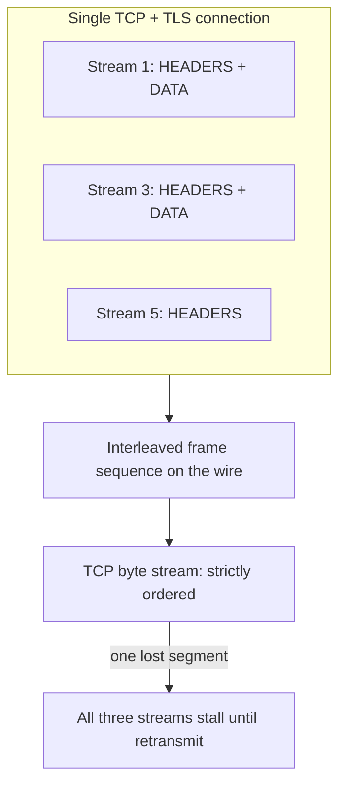
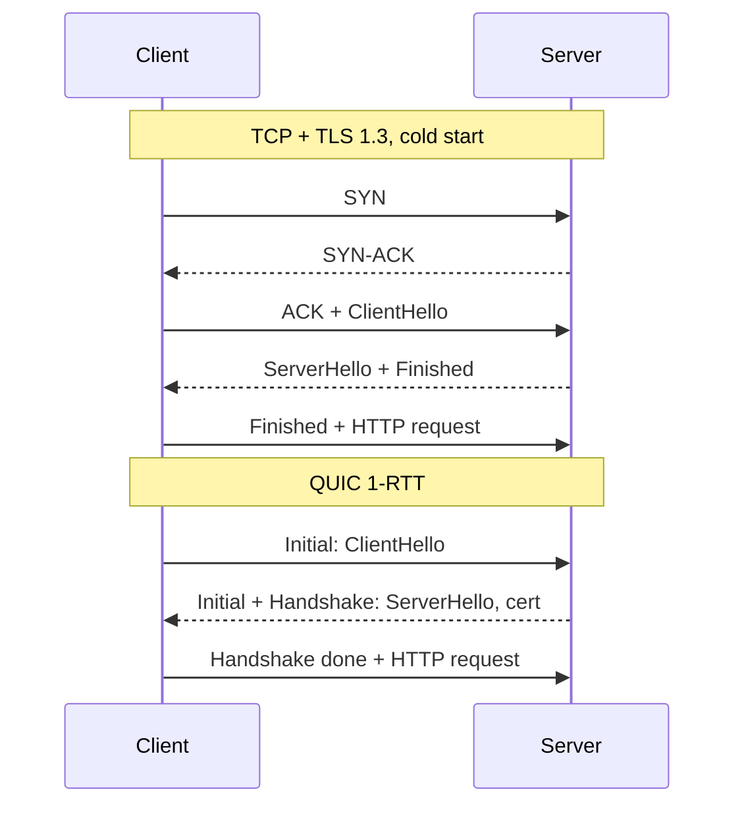

HTTP/2 solved application-layer head-of-line blocking and moved the problem down a layer; HTTP/3 solved it at the transport layer and paid for it with CPU, middlebox hostility, and a congestion controller you now operate yourself. Neither upgrade is free, and the failure modes each introduces are invisible in a lab with 0% packet loss — which is exactly why they surface first in mobile networks and cross-region traffic.
 
**HOL blocking** (head-of-line blocking) is the general condition where a delayed item at the front of an ordered queue stalls every item behind it, even when those items are independently processable. It exists at three distinct layers, and each protocol version addresses a different one.
 
| Layer | Mechanism | HTTP/1.1 | HTTP/2 | HTTP/3 |
|-------|-----------|----------|--------|--------|
| Application (request) | One in-flight request per connection | Blocked | Solved by stream multiplexing | Solved |
| Transport (byte stream) | TCP guarantees in-order delivery to the socket | Partially masked by 6 parallel connections | **Blocked**: one lost segment stalls all streams | Solved by per-stream QUIC delivery |
| Compression state | Header table must be applied in order | N/A (no compression) | HPACK requires ordered processing | QPACK, with explicit blocked-stream limit |
 
## What HTTP/1.1 Actually Costs
 
HTTP/1.1 permits exactly one outstanding request per connection. Pipelining was specified but is effectively dead: intermediaries mishandled it, and responses had to return in request order, which reintroduced HOL blocking anyway. Browsers compensated with roughly six connections per origin, and API clients compensated with connection pools.
 
The costs are concrete:
 
- **Handshake amplification.** Six connections means six TCP handshakes and six TLS handshakes on a cold start. At 80 ms RTT, TCP plus TLS 1.3 is 2 RTTs before the first byte of a request leaves the client.
- **Congestion window fragmentation.** Each connection maintains its own `cwnd` and slow-starts independently. Ten short-lived connections never leave slow start, so the aggregate throughput is far below what one warmed connection would achieve.
- **Header redundancy.** Every request repeats the full `Authorization`, `User-Agent`, `Cookie`, and trace headers as plaintext. For a stateless REST API (see [REST: Constraints, Resources, and HTTP Contracts](/distributed-systems/en/communication/synchronous-protocols/rest/)), header bytes routinely exceed body bytes on small requests.
- **Domain sharding** was the standard workaround: split assets across `static1`, `static2`, and so on to get more parallel connections. Under HTTP/2 this becomes actively harmful, since it re-fragments what should be a single multiplexed connection.
## HTTP/2: Binary Framing and Streams
 
HTTP/2 replaces the text protocol with a binary framing layer. One TCP connection carries many **streams**; each stream is a bidirectional sequence of **frames** tagged with a 31-bit stream ID (client-initiated odd, server-initiated even). Frame types that matter operationally: `HEADERS`, `DATA`, `SETTINGS`, `WINDOW_UPDATE`, `RST_STREAM`, `GOAWAY`, `PING`.
 

*HTTP/2 interleaves streams above TCP, so a single lost segment blocks streams whose bytes already arrived.*
 
Protocol selection happens in the TLS handshake via **ALPN** (Application-Layer Protocol Negotiation). Cleartext HTTP/2 (`h2c`) requires prior knowledge or an Upgrade dance and is essentially only used inside a mesh where TLS is terminated by a sidecar.
 
### Flow Control Is Two-Level and Silently Throttling You
 
HTTP/2 implements credit-based flow control at both the connection and stream level. A receiver advertises a window; a sender may not transmit more `DATA` octets than the window permits until a `WINDOW_UPDATE` replenishes it. The default initial window is 65,535 bytes per stream and per connection.
 
That default is the single most common cause of "HTTP/2 is slower than HTTP/1.1" reports. With a 100 ms RTT, 64 KB per RTT caps a single stream at roughly 5 Mbps regardless of available bandwidth — a classic bandwidth-delay product limit. Large downloads or gRPC streams across regions require raising `SETTINGS_INITIAL_WINDOW_SIZE` and the connection window to the BDP (bandwidth times RTT), often 8–16 MB for high-throughput intercontinental links.
 
:::tip
Compute the target window explicitly rather than guessing: for 200 Mbps at 150 ms RTT the BDP is 200e6 / 8 * 0.150 = 3.75 MB. Set both the stream and connection windows above that, and confirm the peer's advertised `SETTINGS_MAX_CONCURRENT_STREAMS` is high enough that your client is not queueing streams locally instead of sending them.
:::
 
### HPACK: Compression With Shared Mutable State
 
**HPACK** compresses headers using a static table of 61 common entries, a per-connection dynamic table of previously seen name-value pairs, and Huffman coding for literals. A repeated `authorization: Bearer ...` collapses to a one-byte index reference after the first request.
 
The consequence is stateful ordering: the dynamic table is mutated by each `HEADERS` frame and must be applied in transmission order, which is why HPACK is itself a source of HOL blocking. It is also an attack surface. Mark headers carrying secrets as never-indexed so they are not stored in the dynamic table, and bound `SETTINGS_HEADER_TABLE_SIZE` — an unbounded table plus adversarial header sets is a memory-exhaustion vector.
 
### Stream Concurrency, Cancellation, and Rapid Reset
 
`SETTINGS_MAX_CONCURRENT_STREAMS` bounds in-flight streams. Servers commonly default to 100–250; too low serializes clients, too high converts one connection into an unbounded work queue.
 
`RST_STREAM` cancels a single stream without tearing down the connection. This is what made **CVE-2023-44487 (HTTP/2 Rapid Reset)** possible: a client opens a stream and immediately resets it, freeing the concurrency slot on the client's accounting while the server has already dispatched backend work. Requests-per-second at the origin becomes decoupled from the concurrency limit, and a single connection can drive hundreds of thousands of RPS. The mitigation is to count resets — track the reset-to-request ratio per connection and send `GOAWAY` with `ENHANCE_YOUR_CALM` past a threshold — and to enforce request admission independently of stream accounting (see [Load Shedding](/distributed-systems/en/resilience/flow-control/load-shedding/)).
 
`GOAWAY` is the graceful-shutdown primitive: it carries the last stream ID the server will process, letting in-flight streams complete while new ones are refused. A server that closes the TCP connection without `GOAWAY` produces spurious client-side errors on every deploy. Two-phase `GOAWAY` — an initial one with stream ID 2^31-1 as a warning, then a final one after a drain interval — avoids the race where a client's in-flight stream arrives after the last-stream-ID snapshot.
 
:::caution
HTTP/2's single connection interacts badly with L4 load balancing. A connection is pinned to one backend for its lifetime, so long-lived client connections produce persistent load imbalance that no amount of L4 hashing fixes; a scaled-out backend receives zero traffic until clients reconnect. Fixes: terminate HTTP/2 at an L7 proxy that balances per stream, set a `max_connection_age` with jitter so clients periodically re-resolve, or use client-side balancing over multiple subchannels. See [L4 vs. L7 Load Balancing](/distributed-systems/en/communication/load-balancing/l4-vs-l7/).
:::
 
Server Push (`PUSH_PROMISE`) is a dead feature — browsers removed support because push either duplicated cached resources or arrived too late. Use `103 Early Hints` with `Link: rel=preload` instead: the client decides what it needs, so nothing is wasted.
 
## HTTP/3 and QUIC: Moving the Transport Into Userspace
 
**QUIC** is a transport protocol over UDP that provides encrypted, multiplexed, reliable streams. HTTP/3 is the HTTP semantics mapping onto QUIC. The essential change: streams are a transport-level concept, so loss on one stream does not delay delivery of another. QUIC packets carry frames belonging to any stream; a lost packet only stalls the streams whose bytes it contained.
 
TLS 1.3 is integrated rather than layered: the crypto handshake runs inside QUIC frames, giving 1-RTT connection establishment (versus TCP+TLS 1.3 at 2 RTTs) and 0-RTT on resumption.
 

*QUIC folds the transport and cryptographic handshakes together, removing one full round trip from cold-start latency.*
 
### 0-RTT and the Replay Problem
 
With a cached session ticket, a client can send application data in the very first flight. The data is encrypted with a key derived from the resumption secret, which has no freshness guarantee: an on-path attacker can capture and replay the 0-RTT flight, and the server cannot distinguish it from the original.
 
Only idempotent requests may be carried in 0-RTT. A `POST /payments` replayed twice is a duplicate charge. Enforce this at the edge: reject non-safe methods in early data, or require an idempotency key (see [Idempotency and Safe HTTP Methods](/distributed-systems/en/communication/api-gateway/idempotency/)). Servers should also maintain an anti-replay window, though a distributed edge fleet cannot do so perfectly across POPs.
 
### Connection Migration and Connection IDs
 
A TCP connection is identified by the four-tuple, so a NAT rebinding or a Wi-Fi-to-cellular handoff kills it. QUIC identifies connections by an opaque **Connection ID** in the packet header, so the connection survives an address change: the client migrates, validates the new path, and continues without a new handshake. For mobile clients this eliminates the reconnect-and-retry storm that occurs on every network transition.
 
The operational consequence is that load balancers must route on Connection ID, not on the four-tuple. QUIC-aware balancers use routable connection IDs that encode a server identifier; without this, a migrated connection lands on a server that lacks the crypto state and can only reset it.
 
### QPACK: Compression Without Ordered Delivery
 
HPACK cannot work over QUIC, since streams may arrive out of order and the dynamic table would be applied inconsistently. **QPACK** splits the state onto dedicated unidirectional encoder and decoder streams and lets the encoder choose how aggressively to reference the dynamic table.
 
A reference to a table entry not yet received makes the request stream **blocked** until the encoder stream catches up — reintroducing HOL blocking at the compression layer, on purpose and under an explicit budget. `SETTINGS_QPACK_BLOCKED_STREAMS` bounds how many streams may be blocked. Setting it to zero disables risky references entirely: worse compression, zero compression-induced blocking. That is often the right choice for latency-sensitive APIs with low header repetition.
 
### The CPU Cost Nobody Budgets For
 
TCP runs in the kernel with decades of offload support. QUIC runs in userspace, and every packet crosses the syscall boundary and is individually encrypted. Early deployments measured roughly 2x the CPU of TLS-over-TCP for equivalent throughput; the gap closes with `UDP_SEGMENT` (GSO) and `GRO`, batched `sendmmsg`/`recvmmsg`, and kernel or NIC offload, but it does not vanish.
 
Practical operational items:
 
- Raise UDP socket buffers. Default `net.core.rmem_max` on Linux is far too small for high-throughput QUIC and manifests as receive-buffer drops, which the congestion controller misreads as network loss and responds to by lowering the send rate.
- Monitor `netstat -su` receive errors, not just application metrics. QUIC loss is your congestion signal now.
- Congestion control is your code's responsibility. Deploying a library with a poorly tuned or non-standard controller means shipping a transport change to production with no kernel-level review.
```shell
# UDP receive buffer sizing for a QUIC edge node. Defaults cause
# silent receive-side drops that look like network loss to QUIC.
sysctl -w net.core.rmem_max=16777216
sysctl -w net.core.wmem_max=16777216
 
# Receive errors here indicate buffer drops, not path loss.
netstat -su | grep -i "receive buffer errors"
 
# Confirm the negotiated protocol end to end.
curl -sS --http3 -o /dev/null -w '%{http_version} %{time_connect}\n' https://api.example.com/health
```
 
### Discovery, Middleboxes, and Fallback
 
A client does not begin with HTTP/3. It learns about it from an `Alt-Svc: h3=":443"; ma=86400` response header over HTTP/2, or from a DNS `HTTPS` (SVCB) record carrying `alpn=h3`, which removes the first-connection penalty. Because UDP/443 is blocked or aggressively rate-limited on some corporate and carrier networks, clients race QUIC against TCP (a "happy eyeballs" strategy) and fall back. Any deployment must keep an HTTP/2 path serving.
 
QUIC also encrypts nearly the entire packet including most header fields, which defeats middlebox inspection — the deliberate anti-ossification design that lets QUIC evolve, and simultaneously the reason some network operators drop it.
 
## Configuration in Practice
 
```go
package main
 
import (
	"crypto/tls"
	"log/slog"
	"net/http"
	"time"
 
	"github.com/quic-go/quic-go"
	"github.com/quic-go/quic-go/http3"
	"golang.org/x/net/http2"
)
 
func main() {
	mux := http.NewServeMux()
	mux.HandleFunc("GET /health", func(w http.ResponseWriter, r *http.Request) {
		w.WriteHeader(http.StatusOK)
	})
 
	h2 := &http2.Server{
		// Bound in-flight work per connection. Too low serializes clients,
		// too high turns one connection into an unbounded work queue.
		MaxConcurrentStreams: 250,
		// Raise above the 64 KB default or a single stream is capped by
		// the bandwidth-delay product on any high-RTT path.
		MaxUploadBufferPerStream:     8 << 20,
		MaxUploadBufferPerConnection: 32 << 20,
		// Detect dead peers behind a NAT that silently dropped state.
		IdleTimeout:      120 * time.Second,
		ReadIdleTimeout:  30 * time.Second,
		PingTimeout:      15 * time.Second,
		MaxReadFrameSize: 1 << 20,
	}
 
	tcpSrv := &http.Server{
		Addr:              ":443",
		Handler:           mux,
		ReadHeaderTimeout: 5 * time.Second,  // slowloris bound
		WriteTimeout:      30 * time.Second, // must exceed the slowest legitimate response
		TLSConfig: &tls.Config{
			MinVersion: tls.VersionTLS13,
			NextProtos: []string{"h2", "http/1.1"}, // ALPN order is preference order
		},
	}
	if err := http2.ConfigureServer(tcpSrv, h2); err != nil {
		slog.Error("h2 configure failed", "err", err)
		return
	}
 
	h3 := &http3.Server{
		Addr:    ":443",
		Handler: mux,
		TLSConfig: &tls.Config{
			MinVersion: tls.VersionTLS13,
			NextProtos: []string{"h3"},
		},
		QUICConfig: &quic.Config{
			MaxIncomingStreams:             250,
			InitialStreamReceiveWindow:     4 << 20,
			InitialConnectionReceiveWindow: 16 << 20,
			MaxIdleTimeout:                 30 * time.Second,
			KeepAlivePeriod:                15 * time.Second,
			// Only enable after non-idempotent methods are rejected in
			// early data; 0-RTT payloads are replayable by design.
			Allow0RTT: false,
		},
	}
 
	// Advertise h3 on the TCP responses, otherwise clients never discover it.
	advertised := withAltSvc(mux, `h3=":443"; ma=86400`)
	tcpSrv.Handler = advertised
	h3.Handler = advertised
 
	go func() {
		if err := h3.ListenAndServe(); err != nil {
			// UDP/443 may be blocked; TCP must keep serving regardless.
			slog.Error("h3 listener stopped", "err", err)
		}
	}()
 
	if err := tcpSrv.ListenAndServeTLS("cert.pem", "key.pem"); err != nil &&
		err != http.ErrServerClosed {
		slog.Error("h2 listener stopped", "err", err)
	}
}
 
func withAltSvc(next http.Handler, value string) http.Handler {
	return http.HandlerFunc(func(w http.ResponseWriter, r *http.Request) {
		if r.ProtoMajor < 3 {
			w.Header().Set("Alt-Svc", value)
		}
		next.ServeHTTP(w, r)
	})
}
```
 
## Failure Modes and Operational Pitfalls
 
**Throughput collapse from default flow-control windows.** Symptom: HTTP/2 or gRPC streams cap at a few Mbps on high-RTT links while HTTP/1.1 with six connections is faster. Detection: throughput inversely proportional to RTT with no packet loss. Fix by sizing the windows to the BDP on both peers — a large window on one side alone accomplishes nothing.
 
**Load imbalance from long-lived connections.** Symptom: newly scaled pods sit at near-zero CPU while old ones saturate. Detection: per-backend request rate variance after a scale-out event. Fix with `max_connection_age` plus jitter and `GOAWAY`-based rebalancing.
 
**Rapid Reset and stream-accounting bypass.** Symptom: origin CPU saturation with modest connection counts and normal-looking concurrency metrics. Detection: `RST_STREAM` rate per connection, and requests-dispatched versus streams-concurrent divergence.
 
**Silent 0-RTT replay.** Symptom: duplicate side effects with no duplicate at the application layer's request log, since the replay is a legitimately authenticated request. This is why `Allow0RTT` must default off and be enabled only for safe methods.
 
**QUIC misdiagnosed as network loss.** Symptom: high retransmission and low throughput on a healthy path. Detection: kernel UDP receive-buffer errors climbing while the NIC shows no drops. Fix with socket buffer sizing and GSO/GRO enablement, not with congestion-control tuning.
 
**Timeout stacking across three protocol layers.** QUIC idle timeout, HTTP/3 request timeout, application handler deadline, and client patience must be ordered from innermost-shortest to outermost-longest. An idle timeout shorter than the keepalive interval tears down healthy connections continuously; the reconnect churn then looks like an upstream fault. See [Timeouts](/distributed-systems/en/resilience/protection-patterns/timeouts/).
 
**Connection coalescing surprises.** HTTP/2 clients reuse a connection for a different hostname if the certificate covers it and the IP matches. Two "independent" services behind one wildcard certificate share a connection, a flow-control window, and a `GOAWAY` — so one service's shutdown disrupts the other.
 
## When to Prefer Which
 
| Dimension | HTTP/1.1 | HTTP/2 | HTTP/3 |
|-----------|----------|--------|--------|
| Transport HOL blocking | Masked by parallel connections | Present, worsens with loss | Eliminated |
| Cold-start RTTs to first byte | 2 (TCP + TLS 1.3) | 2 | 1, or 0 on resumption |
| CPU per byte | Lowest | Low | Highest, improving with offload |
| Network survivability | Reconnect on IP change | Reconnect on IP change | Connection migration |
| Debuggability | Trivially readable | Requires tooling | Requires keylog plus tooling |
| Middlebox compatibility | Universal | Universal over TLS | UDP blocked on some networks |
 
Use HTTP/1.1 for low-volume internal endpoints, health checks, and anything where operator readability matters more than efficiency. Use HTTP/2 as the default for service-to-service traffic inside a datacenter, where loss is near zero so transport HOL blocking is not a practical concern and gRPC depends on it anyway (see [gRPC and Protocol Buffers](/distributed-systems/en/communication/synchronous-protocols/grpc-protocol-buffers/)). Use HTTP/3 for the internet-facing edge: mobile clients, lossy or high-RTT paths, and traffic patterns with many small parallel objects. Deploying HTTP/3 between two racks in the same datacenter buys nothing and costs CPU, because the loss rate that justifies it does not exist there.