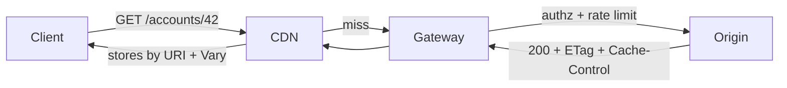
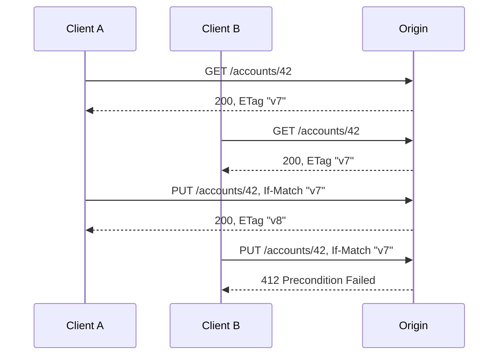

REST is an architectural style defined by six constraints, and every one of them is a trade: you give up a capability at the server in exchange for a property in the network. Statelessness costs you per-request context reconstruction and buys you horizontal scalability and free failover. A uniform interface costs you protocol-level efficiency and buys you intermediaries — caches, proxies, gateways — that understand your traffic without knowing your domain. Most systems that call themselves RESTful adopt the URI aesthetics and discard the constraints, which is why they inherit none of the benefits and all of the verbosity.
 
**REST** (Representational State Transfer) was specified by Roy Fielding as a description of how HTTP itself is supposed to work. That origin matters mechanically: the guarantees below are not conventions layered on top of HTTP, they are properties HTTP already implements in every CDN, reverse proxy, and browser cache on the path. When you break the constraints, you do not merely violate a style guide — you silently disable infrastructure that was doing work for you.
 
## The Six Constraints as Engineering Trade-offs
 
### Client-Server and Layered System
 
Client-server separates the user-interface concern from data storage, allowing independent evolution. **Layered system** is the constraint with the most operational leverage: a client cannot tell whether it is talking to the origin server or to an intermediary. That indistinguishability is what makes it legal to insert a CDN edge, a caching reverse proxy, a TLS-terminating load balancer, or an API gateway without touching client code.
 
The cost is that each layer adds latency and each layer can only act on information visible in the HTTP envelope. An intermediary cannot cache a response whose freshness depends on a field buried in the JSON body. This is the single most common reason production REST APIs get zero cache-hit rate: correctness information lives in the payload rather than in headers.
 

*Each layer acts only on the HTTP envelope; a body-encoded freshness rule is invisible to all three intermediaries.*
 
### Statelessness: Cost Moved to the Wire
 
Every request must carry all information required to understand it. No server-side session affinity, no "the second call assumes the first one happened on this box."
 
- **Benefit:** any replica can serve any request. Instance death costs zero user-visible state. Autoscaling and rolling updates become trivial, since draining a node loses nothing (see [Health-Aware Routing and Connection Draining](/distributed-systems/en/communication/load-balancing/health-aware-routing/)).
- **Cost:** authentication material, pagination cursors, and tenant context are re-transmitted and re-validated per request. A JWT with 40 claims plus a trace context can push request headers past 4 KB, which matters when the server has a `max_header_size` limit or when HPACK dynamic-table pressure degrades multiplexing efficiency under HTTP/2.
- **Anti-pattern:** sticky sessions used to "make REST work." Session affinity converts a stateless tier into a stateful one with none of the durability guarantees of a real state store. On rebalance, users lose carts and half-finished wizards.
Server-side state does not disappear; it moves into an explicit store (Redis, database) addressed by an identifier the client carries. That is a legitimate design, and it is materially different from affinity: the state is durable, replicated, and observable.
 
### Cacheability
 
Responses must be explicitly labeled cacheable or non-cacheable. HTTP defines two independent mechanisms, and confusing them is a common source of stale-data incidents:
 
1. **Freshness** — `Cache-Control: max-age`, `s-maxage`, `Expires`. The cache may serve the stored copy without contacting the origin. This eliminates a round trip entirely.
2. **Validation** — `ETag` / `Last-Modified` with `If-None-Match` / `If-Modified-Since`. The cache still makes a round trip, but a `304 Not Modified` avoids body transfer and origin serialization work.
Freshness saves latency; validation saves bandwidth and origin CPU. A read-heavy endpoint with a P99 dominated by network RTT needs freshness. An endpoint returning a 2 MB catalog that changes hourly needs validation.
 
:::caution
`Cache-Control: private` and `Vary: Authorization` are not interchangeable. `private` forbids shared caches from storing the response at all. `Vary: Authorization` permits storage but keys the entry by credential — which, on a CDN with millions of distinct tokens, produces an unbounded key space and a permanent 0% hit rate while consuming storage. For per-user data, use `private`, and reserve `Vary` for genuine representation variance such as `Accept-Encoding`.
:::
 
### Uniform Interface
 
The uniform interface is four sub-constraints: identification of resources (URIs), manipulation through representations, self-descriptive messages, and hypermedia as the engine of application state (**HATEOAS**).
 
The first three are what make intermediaries possible. Self-descriptive means a proxy can determine, from method and headers alone, whether a request is safe to retry, whether a response is cacheable, and how to parse the body. It is why `POST /getUser` is broken in a way that `GET /users/42` is not: the proxy must treat the POST as unsafe and uncacheable, so every read hits the origin.
 
HATEOAS is the constraint essentially nobody implements, and honesty is better than pretending. Its purpose is decoupling clients from URI structure: the client knows one entry point and discovers transitions from link relations in responses. It pays off when clients are numerous, independently deployed, and cannot be upgraded in lockstep — public APIs, long-lived embedded devices. It does not pay off for a first-party single-page app deployed alongside the API, where the client is generated from an [OpenAPI](/distributed-systems/en/communication/api-gateway/openapi-swagger/) document and coupled to the schema anyway. Adding `_links` to every payload while clients continue to hardcode URI templates is pure overhead.
 
### Code-on-Demand
 
The only optional constraint: the server may ship executable code (historically JavaScript) that extends the client. Rarely relevant to service-to-service APIs; the security surface is obvious.
 
## Resource Modeling: Identity Versus Representation
 
A **resource** is a conceptual mapping to a set of entities — not a row, not a class, not a DTO. A **representation** is a serialization of that resource's state at a point in time. `/accounts/42` identifies the account forever; `application/json` and `application/vnd.company.account.v2+json` are two representations of it.
 
The consequence is that resource identity must be stable across schema changes, storage migrations, and refactors. A URI containing a database shard identifier or an internal type discriminator will break the moment you reshard (see [Dynamic Rebalancing](/distributed-systems/en/data-management/data-partitioning/dynamic-rebalancing/)).
 
### URI Design That Survives Contact With Production
 
- Nouns for identity, HTTP method for the verb. `POST /accounts/42/transfers` rather than `POST /doTransfer?account=42`. The former makes the created thing addressable: the response carries `201 Created` with `Location: /transfers/8f3a`, and the client can `GET` it later to check state.
- Plural collections, singular members: `/accounts`, `/accounts/42`.
- Sub-resources only for genuine containment. `/accounts/42/transactions` is correct when a transaction has no meaning outside the account. If the same entity is reachable from two parents, promote it to a top-level resource and use query filters, otherwise you own two cache keys for one entity and must invalidate both.
- Operations that are not CRUD do exist. A state transition like "cancel" is best modeled either as a sub-resource creation (`POST /orders/91/cancellations`) or as a `PATCH` on a status field, depending on whether the transition itself has attributes worth persisting (reason, actor, timestamp). Cramming everything into `PUT` on the aggregate forces read-modify-write cycles and widens the lost-update window.
- Never encode the response format in the path. `/accounts/42.json` fragments the cache and duplicates the identity; use `Accept`.
### Content Negotiation and Representation Variance
 
`Accept`, `Accept-Encoding`, and `Accept-Language` select among representations; the origin must echo `Vary` listing exactly the request headers that influenced the choice. Omitting `Vary: Accept-Encoding` behind a shared cache is a classic incident: a gzip-encoded body gets served to a client that did not advertise gzip support, producing what looks like binary corruption at the application layer.
 
### Collections, Pagination, and the Unstable Offset
 
Offset pagination (`?offset=1000&limit=50`) has two production failures. First, cost: most engines must scan and discard the skipped rows, so P99 degrades linearly with page depth. Second, correctness: concurrent inserts and deletes shift the window, so clients silently skip or duplicate items during a full traversal.
 
Keyset (cursor) pagination — `WHERE (created_at, id) < (:ts, :id) ORDER BY created_at DESC, id DESC LIMIT 50` — is O(log n) per page via the index and is stable under concurrent writes, at the cost of losing random page access. Encode the cursor as an opaque token so the tuple layout stays a server-side implementation detail; if you expose the raw sort key, you have published an unversioned contract you can never change.
 
## The HTTP Contract
 
### Safety, Idempotency, and Retry Semantics
 
The method table is a machine-readable contract that determines whether an intermediary, a client library, or a service mesh may retry a request after a timeout.
 
| Method | Safe | Idempotent | Cacheable | Retry after timeout? |
|--------|------|-----------|-----------|----------------------|
| `GET` | Yes | Yes | Yes | Always |
| `HEAD` | Yes | Yes | Yes | Always |
| `PUT` | No | Yes | No | Yes, if the body is a full replacement |
| `DELETE` | No | Yes | No | Yes; expect `404`/`204` on the second attempt |
| `POST` | No | No | Only with explicit freshness | Only with an idempotency key |
| `PATCH` | No | Not inherently | No | Only if the patch is defined to be idempotent |
 
**Safe** means no intended state change, which is what allows a crawler or prefetching proxy to issue the request unprompted. **Idempotent** means N identical requests leave the same server state as one — it says nothing about the response being identical, which is why a second `DELETE` returning `404` is still idempotent.
 
`PATCH` is idempotent only for absolute operations. `{"op":"replace","path":"/status","value":"closed"}` (RFC 6902 JSON Patch) is idempotent; `{"op":"add","path":"/tags/-","value":"vip"}` appends and is not. JSON Merge Patch (RFC 7386) is idempotent by construction but cannot express array element edits or distinguish "set to null" from "leave alone" beyond its own null-means-delete rule. Choose deliberately and document it — a retrying client plus a non-idempotent patch is a duplicated-append bug that surfaces only under packet loss.
 
For `POST`, retry safety requires a client-generated **idempotency key** persisted with the operation result; the full mechanism, key lifetime, and concurrent-request handling are covered in [Idempotency and Safe HTTP Methods](/distributed-systems/en/communication/api-gateway/idempotency/).
 
### Conditional Requests: Caching and Optimistic Concurrency From One Primitive
 
The same `ETag` serves two purposes. On reads, `If-None-Match` enables `304`. On writes, `If-Match` implements compare-and-swap over HTTP: the server compares the supplied validator against the current one and returns `412 Precondition Failed` on mismatch. This is optimistic concurrency control with no lock, no lease, and no coordination cost until the moment of conflict.
 

*If-Match turns the lost-update race into an explicit 412 that the client can resolve by re-reading and re-applying.*
 
Without `If-Match`, the second `PUT` wins and Client A's write vanishes with no error anywhere in the system — the classic lost update. If a resource is mutable and shared, a write endpoint that accepts an unconditional `PUT` is a data-loss vector; return `428 Precondition Required` to force clients to opt in.
 
:::danger
Derive the `ETag` from a monotonic version counter or storage-engine revision, never from a hash of the serialized response bytes. Byte hashes change when the JSON encoder reorders map keys, when a field is added by a deploy, or when a floating-point value renders differently across library versions — producing spurious `412` storms during a rolling update, and, worse, identical ETags across genuinely different states if two representations happen to serialize identically after a field is dropped.
:::
 
### Status Codes and Machine-Readable Errors
 
Status codes are consumed by circuit breakers, retry middleware, and gateway metrics before any human sees them. Precision is operational, not pedantic:
 
- `400` malformed syntax versus `422` syntactically valid but semantically rejected. Retrying either is pointless; both must be classified as terminal by client middleware.
- `401` missing or invalid credentials versus `403` valid identity, insufficient authority. Only `401` should trigger a token-refresh path.
- `409` conflict with current resource state (duplicate creation) versus `412` failed precondition (stale validator). Different client remediations.
- `429` and `503` must carry `Retry-After`. A client honoring `Retry-After` avoids the synchronized retry wave described in [Retry Storms and Metastable Failures](/distributed-systems/en/resilience/flow-control/retry-storms-metastable-failures/).
- `502`/`503`/`504` are retryable; `500` generally is not, since it usually signals a deterministic bug that will reproduce.
Error bodies should use `application/problem+json` (RFC 9457) with a stable machine-readable `type` URI. Free-form English strings in a `message` field become an accidental contract the moment a client starts substring-matching on them.
 
## Implementation: Conditional Read and Compare-and-Swap Write
 
```go
package api
 
import (
	"context"
	"crypto/sha256"
	"encoding/hex"
	"encoding/json"
	"errors"
	"log/slog"
	"net/http"
	"strconv"
	"time"
)
 
type Account struct {
	ID      string `json:"id"`
	Balance int64  `json:"balance_minor_units"`
	version int64  // storage revision, never serialized to clients
}
 
var (
	ErrNotFound  = errors.New("account not found")
	ErrConflict  = errors.New("version conflict")
)
 
type Store interface {
	Get(ctx context.Context, id string) (Account, error)
	CompareAndSwap(ctx context.Context, a Account, expected int64) error
}
 
// etagOf derives a strong validator from the storage revision, not from the
// serialized bytes. Byte-derived ETags break on encoder or schema changes.
func etagOf(a Account) string {
	sum := sha256.Sum256([]byte(a.ID + ":" + strconv.FormatInt(a.version, 10)))
	return `"` + hex.EncodeToString(sum[:8]) + `"`
}
 
type Handler struct {
	store   Store
	timeout time.Duration // per-request upper bound, independent of client patience
}
 
func (h *Handler) GetAccount(w http.ResponseWriter, r *http.Request) {
	// Bound the downstream call. Without this, a slow store converts one
	// stuck dependency into exhausted server goroutines and file descriptors.
	ctx, cancel := context.WithTimeout(r.Context(), h.timeout)
	defer cancel()
 
	id := r.PathValue("id")
	acc, err := h.store.Get(ctx, id)
	switch {
	case errors.Is(err, ErrNotFound):
		problem(w, http.StatusNotFound, "account-not-found", "No account with that id.")
		return
	case errors.Is(err, context.DeadlineExceeded):
		// 504 is retryable; 500 would tell the client not to bother.
		w.Header().Set("Retry-After", "1")
		problem(w, http.StatusGatewayTimeout, "upstream-timeout", "Store did not respond in time.")
		return
	case err != nil:
		slog.ErrorContext(ctx, "store get failed", "id", id, "err", err)
		problem(w, http.StatusInternalServerError, "internal", "Unexpected failure.")
		return
	}
 
	tag := etagOf(acc)
	w.Header().Set("ETag", tag)
	// private: per-user data must never enter a shared cache.
	// must-revalidate: a stale balance is worse than an extra round trip.
	w.Header().Set("Cache-Control", "private, max-age=0, must-revalidate")
 
	if match := r.Header.Get("If-None-Match"); match == tag {
		w.WriteHeader(http.StatusNotModified) // no body, no serialization cost
		return
	}
 
	w.Header().Set("Content-Type", "application/json")
	if err := json.NewEncoder(w).Encode(acc); err != nil {
		// Status is already written; only logging is possible here.
		slog.ErrorContext(ctx, "response encode failed", "id", id, "err", err)
	}
}
 
func (h *Handler) PutAccount(w http.ResponseWriter, r *http.Request) {
	ctx, cancel := context.WithTimeout(r.Context(), h.timeout)
	defer cancel()
 
	ifMatch := r.Header.Get("If-Match")
	if ifMatch == "" {
		// Force clients to opt into concurrency control instead of
		// silently allowing last-write-wins on a shared resource.
		problem(w, http.StatusPreconditionRequired, "if-match-required",
			"Provide If-Match with the ETag from a prior GET.")
		return
	}
 
	var body Account
	// Cap the body to keep a hostile or buggy client from driving OOM.
	dec := json.NewDecoder(http.MaxBytesReader(w, r.Body, 1<<20))
	dec.DisallowUnknownFields()
	if err := dec.Decode(&body); err != nil {
		problem(w, http.StatusBadRequest, "malformed-body", "Body is not valid Account JSON.")
		return
	}
 
	id := r.PathValue("id")
	current, err := h.store.Get(ctx, id)
	if err != nil {
		problem(w, http.StatusNotFound, "account-not-found", "No account with that id.")
		return
	}
	if etagOf(current) != ifMatch {
		problem(w, http.StatusPreconditionFailed, "stale-etag",
			"Resource changed since your last read. Re-read and retry.")
		return
	}
 
	body.ID = id
	body.version = current.version + 1
	if err := h.store.CompareAndSwap(ctx, body, current.version); err != nil {
		if errors.Is(err, ErrConflict) {
			// Lost the race between the validator check and the write.
			problem(w, http.StatusPreconditionFailed, "stale-etag", "Concurrent update won.")
			return
		}
		slog.ErrorContext(ctx, "cas failed", "id", id, "err", err)
		problem(w, http.StatusInternalServerError, "internal", "Unexpected failure.")
		return
	}
 
	w.Header().Set("ETag", etagOf(body))
	w.WriteHeader(http.StatusOK)
}
 
func problem(w http.ResponseWriter, status int, kind, detail string) {
	w.Header().Set("Content-Type", "application/problem+json")
	w.WriteHeader(status)
	_ = json.NewEncoder(w).Encode(map[string]any{
		"type":   "https://api.example.com/problems/" + kind,
		"status": status,
		"detail": detail,
	})
}
```
 
The read-then-CAS sequence still contains a race, which is why `CompareAndSwap` takes the expected version rather than trusting the earlier `Get`. The validator check is an optimization that fails fast and produces a clean `412`; the storage-level compare-and-swap is the actual correctness boundary.
 
```shell
# Read, capture the validator, then attempt a conditional write.
ETAG=$(curl -sS -D - -o /dev/null https://api.example.com/accounts/42 \
  | awk 'tolower($1) == "etag:" { print $2 }' | tr -d '\r')
 
curl -sS -i -X PUT https://api.example.com/accounts/42 \
  -H "Content-Type: application/json" \
  -H "If-Match: ${ETAG}" \
  --data '{"id":"42","balance_minor_units":125000}'
# Expect 200 with a new ETag, or 412 if another writer committed first.
```
 
## Failure Modes and Operational Pitfalls
 
**Lost updates through unconditional writes.** Symptom: user-reported "my change disappeared" with no error in any log, because both writes returned `200`. Detection is the hard part — nothing is anomalous in metrics. Instrument the ratio of `PUT`/`PATCH` requests carrying `If-Match`; anything below 100% on a mutable shared resource is a latent data-loss path.
 
**Chattiness and the client-side N+1.** A normalized resource model forces the client into `GET /orders/91` followed by one `GET /products/{id}` per line item. Over a high-RTT mobile link, 30 sequential round trips at 120 ms each is 3.6 s of pure latency. Mitigations, in order of preference: connection multiplexing so the calls are concurrent rather than serial (see [HTTP/2 and HTTP/3](/distributed-systems/en/communication/synchronous-protocols/http2-http3-quic/)), a purpose-built composite resource, a [BFF](/distributed-systems/en/communication/api-gateway/bff-pattern/), or a query language such as [GraphQL](/distributed-systems/en/communication/synchronous-protocols/graphql/). Adding an `?expand=items.product` parameter is the common compromise, at the cost of a combinatorial cache-key explosion.
 
**Cache-key explosion and poisoning.** Every distinct query-parameter permutation is a distinct cache entry. Unbounded parameters — free-text search, arbitrary sort keys, client-generated correlation values echoed into the URI — drive hit rates to zero and can be used to evict hot entries deliberately. Normalize and allowlist query parameters at the gateway, and strip parameters that do not affect the representation. The corresponding cache-invalidation strategies are covered in [Cache Invalidation](/distributed-systems/en/data-management/distributed-caching/cache-invalidation/).
 
**`200 OK` wrapping an error.** Returning `{"success": false, "error": "..."}` with a `200` status defeats every intermediary: circuit breakers see a healthy dependency, retry middleware does not retry, gateway error-rate SLOs read zero during a full outage. The failure is invisible until customers complain.
 
**Timeout asymmetry.** The client times out at 2 s, the server keeps working for 30 s. The client retries, the server now processes the same non-idempotent operation twice, and load amplifies exactly when the system is already degraded. Server-side deadlines must be propagated and enforced, and must be shorter than the client's patience budget at every hop.
 
**Trailing-slash and case inconsistency.** `/accounts/42` and `/accounts/42/` are distinct URIs, hence distinct cache entries with independent invalidation. Pick one form and issue `301` for the other at the edge.
 
**`DELETE` retry ambiguity.** The first `DELETE` succeeds, the response is lost, the retry returns `404`. Client libraries that treat `404` as failure will report a spurious error on a successful delete. Document `404` on `DELETE` as success, or return `204` for both cases if the resource is tombstoned.
 
## When to Use REST, and When Not
 
| Dimension | REST/HTTP | gRPC | GraphQL | When to prefer REST |
|-----------|-----------|------|---------|---------------------|
| Payload efficiency | JSON, verbose | Protobuf, compact binary | JSON, verbose | Payloads are small or gzip-dominated; human debuggability outweighs bytes |
| Intermediary caching | Native, at every layer | None without custom work | Effectively none for `POST` queries | Read-heavy traffic with high cache-hit potential |
| Client diversity | Any HTTP client, including `curl` | Requires generated stubs | Requires a client library | Public APIs, unknown or unmanaged consumers |
| Schema enforcement | External (OpenAPI), advisory | Compiler-enforced IDL | Enforced by schema | Loose coupling is desired over strict contracts |
| Streaming | SSE or WebSocket alongside | First-class bidirectional | Subscriptions | No streaming requirement |
| Fetch shaping | Fixed per endpoint | Fixed per method | Client-specified | Access patterns are stable and few |
 
Use REST when consumers are heterogeneous or external, when read traffic dominates and can be cached at the edge, when operability through standard tooling (proxies, WAFs, curl, browser devtools) has real value, and when the resource model maps cleanly onto entities with stable identity.
 
Prefer alternatives when the workload is high-frequency internal service-to-service RPC where serialization cost and connection efficiency dominate (see [gRPC and Protocol Buffers](/distributed-systems/en/communication/synchronous-protocols/grpc-protocol-buffers/)); when clients need to shape responses across many entity graphs; when the interaction is inherently a long-lived stream rather than a request-response pair; or when the operation is a genuine procedure call — "recalculate risk exposure for portfolio 7 using the 14:00 snapshot" — that no amount of noun-shaping turns into a resource without distortion.