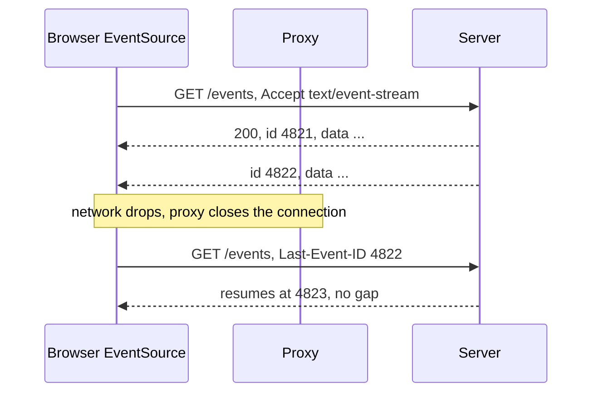
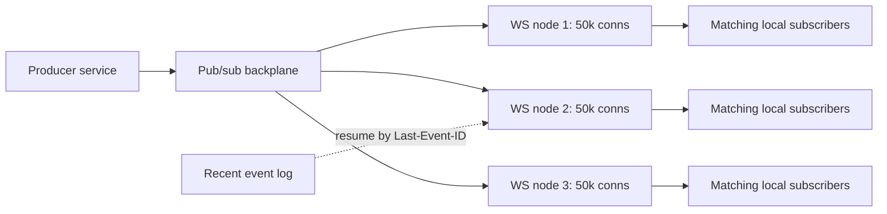

Both protocols exist to eliminate polling, and both do it by converting a stateless request-response tier into a stateful connection tier. That conversion is the entire cost: a server holding 200,000 connections holds 200,000 file descriptors, 200,000 write buffers, and 200,000 pieces of session state that vanish on deploy. Every operational problem below follows from it — sticky routing, fan-out across instances, slow consumers with no flow control, and a reconnect storm every time you ship.
 
Choose on directionality first. **SSE** (Server-Sent Events) is server-to-client only, runs over plain HTTP, and has resumption built into the protocol. **WebSocket** is full duplex over its own framing layer and has no resumption, no message identity, and no backpressure signal at the application layer. If the client only needs to receive, SSE is strictly less machinery to operate.
 
| Dimension | SSE | WebSocket | Long polling |
|-----------|-----|-----------|--------------|
| Direction | Server to client | Full duplex | Server to client, one message per request |
| Transport | HTTP, `text/event-stream` | Upgrade to RFC 6455 framing | Plain HTTP |
| Payload | UTF-8 text only | Text or binary | Any |
| Auto-reconnect | Built into `EventSource` | Application code | Application code |
| Resumption | `Last-Event-ID`, in the protocol | None; build your own | Application code |
| Proxy compatibility | Ordinary HTTP response | Needs Upgrade support at every hop | Universal |
| Multiplexing | Free over HTTP/2 | One TCP connection per socket over HTTP/1.1 | Free |
| When to prefer | Feeds, notifications, progress, dashboards | Interactive sessions, games, collaborative editing, client-initiated traffic | Fallback where nothing else survives the network |
 
## WebSocket: Handshake and Framing
 
The connection opens as an HTTP/1.1 `GET` with `Upgrade: websocket` and a random `Sec-WebSocket-Key`. The server answers `101 Switching Protocols` with `Sec-WebSocket-Accept`, the SHA-1 of the key concatenated with a fixed GUID. That value proves the peer understood the handshake rather than being an HTTP server that echoed headers — it is a cache-poisoning defense, not authentication.
 
After `101`, HTTP semantics are gone. There are no status codes, no headers, no methods; there are only frames:
 
- **Opcodes:** `0x1` text, `0x2` binary, `0x0` continuation, `0x8` close, `0x9` ping, `0xA` pong.
- **FIN bit and fragmentation:** a logical message may span multiple frames. Control frames (`0x8`-`0xA`) may be interleaved between fragments and must not themselves be fragmented, which is what lets a ping arrive during a large upload.
- **Masking:** client-to-server frames must be XOR-masked with a per-frame key. This is not security — the key is on the wire — it exists to keep a malicious script from crafting bytes that a transparent proxy would misparse as a second HTTP request. Server-to-client frames must not be masked.
- **Payload length:** 7 bits, or 7+16, or 7+64. Frame overhead is 2-14 bytes, versus HTTP's hundreds, which is the actual efficiency win.
- **Close handshake:** either side sends `0x8` with a code, the peer echoes it, then TCP closes. Code `1000` is normal; `1006` means the connection dropped without a close frame and is the code you will see in every real incident.
`Sec-WebSocket-Protocol` negotiates an application subprotocol, and it is the only place a browser client can put a value into the handshake — the browser `WebSocket` API cannot set arbitrary headers, which is why authentication tokens end up smuggled into the subprotocol field, the query string, or the first application message.
 
Over HTTP/2, WebSocket requires RFC 8441 Extended CONNECT, and support across proxies is uneven; most deployments still terminate WebSocket at HTTP/1.1. This matters because each HTTP/1.1 socket is a whole TCP connection, so a page with four sockets consumes four of the browser's six per-origin connections (see [HTTP/2 and HTTP/3](/distributed-systems/en/communication/synchronous-protocols/http2-http3-quic/)).
 
:::caution
WebSocket is not subject to the same-origin policy. The browser sends the `Origin` header but does not enforce a CORS preflight, so any page on the internet can open a socket to your endpoint with the user's cookies attached — Cross-Site WebSocket Hijacking. Validate `Origin` against an allowlist during the handshake and prefer a token in the first message over cookie-based auth, since cookies are attached automatically and the token is not.
:::
 
## SSE: The Stream Format and Free Resumption
 
SSE is an ordinary HTTP response with `Content-Type: text/event-stream` that never ends. The body is a sequence of field lines separated by blank lines:
 
```text
id: 4821
event: price
data: {"symbol":"ACME","priceMinorUnits":19250}
 
retry: 5000
 
: heartbeat comment, keeps intermediaries from closing the stream
 
id: 4822
event: price
data: {"symbol":"ACME","priceMinorUnits":19310}
```
 
The `id` field is what makes SSE operationally cheaper than WebSocket. The browser stores the last received `id`, and on reconnect sends it back as a `Last-Event-ID` request header automatically. The server resumes from that position. This is the resumption mechanism you would otherwise hand-build for a WebSocket or a gRPC stream, and it is free.
 

*EventSource reconnects on its own and replays the position via Last-Event-ID; nothing between 4822 and the resume point is lost provided the server retains that history.*
 
The constraints are real: text only, so binary payloads must be base64-encoded at a 33% size penalty; the browser `EventSource` API cannot set request headers, so authentication rides on cookies or a query parameter unless you use a `fetch`-based reader; and `retry:` only advises the browser's reconnect delay, which is otherwise a fixed few seconds with no jitter — a mass disconnect produces a synchronized reconnect wave unless the server randomizes `retry` per connection.
 
Proxies are the other hazard. Any hop that buffers the response body converts a live stream into a batch delivery that arrives minutes late or not at all. Response compression has the same effect when the compressor waits for a full block before flushing.
 
```nginx
location /events {
    proxy_pass http://app_upstream;
    proxy_http_version 1.1;
    proxy_buffering off;          # without this, events are batched by nginx
    gzip off;                     # compressors defeat per-event flushing
    proxy_read_timeout 3600s;     # default 60s silently kills the stream
    proxy_set_header Connection "";
}
```
 
## Backpressure and the Slow Consumer
 
Neither protocol has application-level flow control. A `Send` on a WebSocket writes into the kernel socket buffer; when that fills, the write blocks or the userspace library queues the message. A client on a congested mobile link consuming 5 messages per second while you publish 500 accumulates 495 messages per second somewhere, and that somewhere is your heap.
 
This is the single most common cause of a real-time service OOM-killing itself under load. The only defensible design is a bounded per-connection queue plus an explicit policy for what happens when it is full:
 
- **Conflate.** For state updates where only the latest value matters — prices, positions, dashboard gauges — keep one slot per key and overwrite. A slow consumer receives fewer updates, never stale ones, and memory is bounded by key count rather than message rate.
- **Drop with a marker.** Discard and send a "you missed N events, resync from this cursor" message so the client can reconcile explicitly.
- **Disconnect.** Close with a policy code and let the client reconnect and resume. Brutal, bounded, and correct for feeds that have a durable resume path.
What is never acceptable is an unbounded queue, because it converts one bad client into a whole-process failure. The general treatment is in [Backpressure](/distributed-systems/en/resilience/flow-control/backpressure/).
 
## Fan-Out Architecture
 
A connection lives on exactly one instance, but an event is usually produced somewhere else. Scaling therefore requires a **backplane**: instances subscribe to a pub/sub channel and forward matching events to their local connections.
 

*Each node holds connections and a local subscription index; the backplane fans out and a short retained log serves resumption after reconnect.*
 
Design points that decide whether this scales:
 
- **Topic granularity.** Broadcasting every event to every node and filtering locally is simple and wastes bandwidth linearly in node count. Sharding subscriptions by topic reduces that but requires routing knowledge in the backplane. Redis pub/sub is fire-and-forget with no durability; Kafka gives retention and replay at the cost of consumer-group mechanics (see [Message Queue vs. Event Streaming](/distributed-systems/en/communication/async-messaging/message-queue-vs-event-streaming/)).
- **Retention for resumption.** `Last-Event-ID` is only useful if some component still has the events after that ID. A short retained log — minutes, not days — covers reconnects while bounding storage.
- **Per-connection budget.** Plan on tens of kilobytes per connection for buffers and bookkeeping; 100k connections is single-digit gigabytes before any application state. Raise `ulimit -n` and the kernel's `nofile` limits, and remember the load balancer needs ephemeral ports for every backend connection.
## Implementation
 
```go
// Bounded per-connection queue with conflation, plus liveness pings.
type Client struct {
	conn   *websocket.Conn
	send   chan []byte // bounded: this is the backpressure boundary
	userID string
}
 
const (
	writeWait  = 10 * time.Second  // per-frame write deadline
	pongWait   = 60 * time.Second  // peer must pong within this
	pingPeriod = 45 * time.Second  // must be < pongWait
	maxMessage = 64 << 10          // reject oversized client frames
)
 
func (c *Client) writePump(ctx context.Context) {
	ticker := time.NewTicker(pingPeriod)
	defer func() {
		ticker.Stop()
		c.conn.Close()
	}()
 
	for {
		select {
		case msg, ok := <-c.send:
			if !ok {
				// Hub closed the channel: send a proper close frame so the
				// client sees 1000 instead of an abnormal 1006.
				_ = c.conn.WriteControl(websocket.CloseMessage,
					websocket.FormatCloseMessage(websocket.CloseNormalClosure, ""),
					time.Now().Add(writeWait))
				return
			}
			// A deadline is mandatory: without it a stalled TCP connection
			// blocks this goroutine until the kernel gives up, holding the
			// queue and its memory for hours.
			if err := c.conn.SetWriteDeadline(time.Now().Add(writeWait)); err != nil {
				return
			}
			if err := c.conn.WriteMessage(websocket.TextMessage, msg); err != nil {
				return
			}
 
		case <-ticker.C:
			_ = c.conn.SetWriteDeadline(time.Now().Add(writeWait))
			if err := c.conn.WriteControl(websocket.PingMessage, nil,
				time.Now().Add(writeWait)); err != nil {
				return // peer is gone; stop holding resources for it
			}
 
		case <-ctx.Done():
			return // graceful shutdown path
		}
	}
}
 
// publish applies the slow-consumer policy. Never block the producer and
// never grow the queue without bound.
func (c *Client) publish(msg []byte) {
	select {
	case c.send <- msg:
	default:
		// Queue full: this client cannot keep up. Close it and let the
		// client reconnect and resume from its last cursor. Dropping
		// silently would produce an inconsistent client view.
		slog.Warn("slow consumer evicted", "user", c.userID, "queued", len(c.send))
		close(c.send)
	}
}
 
func (h *Hub) handleUpgrade(w http.ResponseWriter, r *http.Request) {
	// WebSocket has no CORS preflight; Origin must be checked here or the
	// endpoint is open to cross-site hijacking with the user's cookies.
	if !h.allowedOrigins[r.Header.Get("Origin")] {
		http.Error(w, "forbidden origin", http.StatusForbidden)
		return
	}
 
	conn, err := h.upgrader.Upgrade(w, r, nil)
	if err != nil {
		return // Upgrade already wrote the error response
	}
	conn.SetReadLimit(maxMessage)
	_ = conn.SetReadDeadline(time.Now().Add(pongWait))
	conn.SetPongHandler(func(string) error {
		// Each pong extends the read deadline; a peer that stops ponging
		// is reaped instead of lingering until the TCP timeout.
		return conn.SetReadDeadline(time.Now().Add(pongWait))
	})
 
	client := &Client{conn: conn, send: make(chan []byte, 256), userID: userFrom(r)}
	h.register <- client
	go client.writePump(r.Context())
	go client.readPump()
}
```
 
```go
// SSE handler: flushing, heartbeats, and Last-Event-ID resumption.
func (s *Server) Events(w http.ResponseWriter, r *http.Request) {
	rc := http.NewResponseController(w)
 
	w.Header().Set("Content-Type", "text/event-stream")
	w.Header().Set("Cache-Control", "no-cache, no-transform") // no-transform stops proxy compression
	w.Header().Set("Connection", "keep-alive")
	w.Header().Set("X-Accel-Buffering", "no") // tells nginx not to buffer
 
	// The browser sends this automatically after a dropped connection.
	from := r.Header.Get("Last-Event-ID")
	cur, err := s.log.Open(r.Context(), userFrom(r), from)
	if err != nil {
		// Cursor too old: tell the client to resync rather than silently
		// skipping events it will never see.
		http.Error(w, "cursor expired, resync required", http.StatusGone)
		return
	}
	defer cur.Close()
 
	// Randomize the client's reconnect delay so a mass disconnect does not
	// produce a synchronized reconnect wave.
	fmt.Fprintf(w, "retry: %d\n\n", 3000+rand.Intn(4000))
	_ = rc.Flush()
 
	heartbeat := time.NewTicker(15 * time.Second)
	defer heartbeat.Stop()
 
	for {
		select {
		case <-r.Context().Done():
			return // client gone; stop reading the backend cursor
		case <-heartbeat.C:
			// A comment line keeps intermediaries from reaping an idle stream.
			if _, err := io.WriteString(w, ": ping\n\n"); err != nil {
				return
			}
			_ = rc.Flush()
		case ev, ok := <-cur.C():
			if !ok {
				return
			}
			if _, err := fmt.Fprintf(w, "id: %s\nevent: %s\ndata: %s\n\n",
				ev.ID, ev.Type, ev.JSON); err != nil {
				return // client disconnected mid-write
			}
			// Without Flush the event sits in the write buffer indefinitely.
			_ = rc.Flush()
		}
	}
}
```
 
## Failure Modes and Operational Pitfalls
 
**Idle timeouts cutting healthy connections.** Symptom: every connection dies at exactly 60 s, 5 min, or 1 h, from all clients at once, with close code `1006`. The offender is a load balancer, ingress, or corporate proxy default, and the shortest timeout on the path wins. Fix by raising the idle timeout at every hop *and* sending application-level pings or SSE comments at a shorter interval — the keepalive must be more frequent than the strictest timeout.
 
**Deploy-triggered reconnect storms.** Every rolling restart disconnects every connection on that instance simultaneously; without jitter they all reconnect within the same second, and the handshake plus auth plus resume-query load can exceed steady-state load by orders of magnitude. Fix with jittered `retry` values, exponential backoff with jitter in custom clients, and staggered pod termination (see [Retry with Exponential Backoff and Jitter](/distributed-systems/en/resilience/protection-patterns/retry-exponential-backoff/)).
 
**Unbounded write queues.** Symptom: memory grows linearly with publish rate and never recovers, concentrated on a handful of connections. Detect with a per-connection queue-depth histogram, not an average — the average is fine while one client is at the limit.
 
**Half-open connections.** The client's laptop sleeps or a NAT drops the mapping; no `FIN` arrives, so the server holds the connection, its subscription, and its buffers until the kernel TCP timeout, which is over two hours by default on Linux. Ping/pong with a read deadline is the only reliable detector.
 
**Load imbalance from connection pinning.** New instances receive no connections after a scale-out because existing clients stay attached. A bounded maximum connection lifetime with jitter forces gradual redistribution and keeps the reconnect path continuously exercised (see [L4 vs. L7 Load Balancing](/distributed-systems/en/communication/load-balancing/l4-vs-l7/)).
 
**Auth that never expires.** A token validated once at handshake time authorizes a connection that lives for hours after the token expires or the user's permissions are revoked. Re-verify on a timer, cap connection lifetime at the token lifetime, and terminate on a revocation event (see [JWT](/distributed-systems/en/security/authentication-authorization/jwt/)).
 
**Compression amplification.** `permessage-deflate` with context takeover keeps a per-connection compression window — tens of kilobytes each, which at 100k connections is gigabytes of memory spent to save bandwidth you probably were not short of. Disable context takeover or the extension entirely for high-connection-count workloads.
 
**SSE buffered into uselessness.** Symptom: events arrive in bursts of dozens after long silence, or the browser's `EventSource` never fires. Cause: a buffering proxy, a compression layer, or a missing `Flush` in the handler. Verify with `curl -N` through the real ingress path.
 
## When to Use Which
 
Use **SSE** for server-to-client feeds: notifications, live dashboards, progress indicators, LLM token streaming, activity timelines. It rides ordinary HTTP infrastructure, multiplexes for free over HTTP/2, and gives you resumption without writing any. Its unidirectionality is a feature — client actions go over normal REST calls, which stay retryable, cacheable, and observable.
 
Use **WebSocket** when the client sends messages at a rate or latency that request-per-action cannot serve: collaborative editing, multiplayer state, interactive terminals, trading interfaces with client-side order flow. Accept in exchange that you are building resumption, backpressure policy, and reconnect logic yourself.
 
Use neither for service-to-service communication. Inside the datacenter, [gRPC streaming](/distributed-systems/en/communication/synchronous-protocols/grpc-streaming/) gives the same duplex semantics with typed contracts, deadlines, and cancellation. For durable delivery to consumers that may be offline, a broker is the answer, not a socket — a connection is not a queue, and nothing you send while the client is disconnected exists anywhere unless you wrote a log for it.