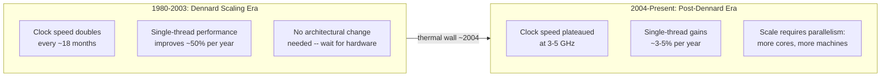
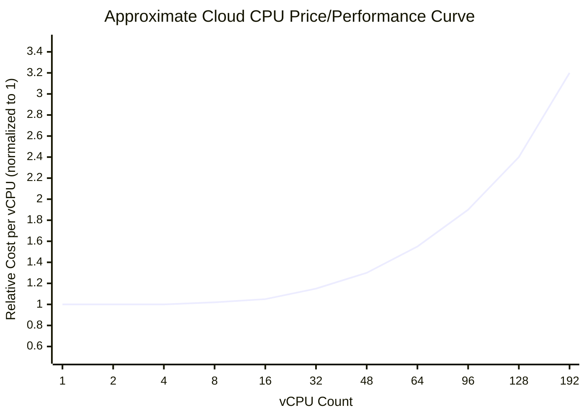
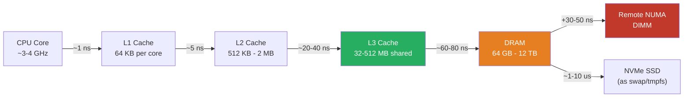
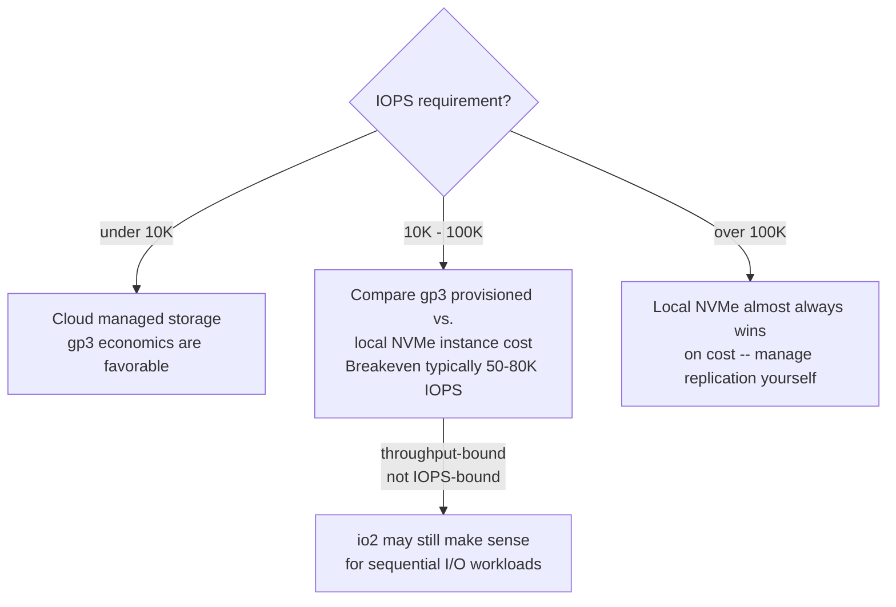
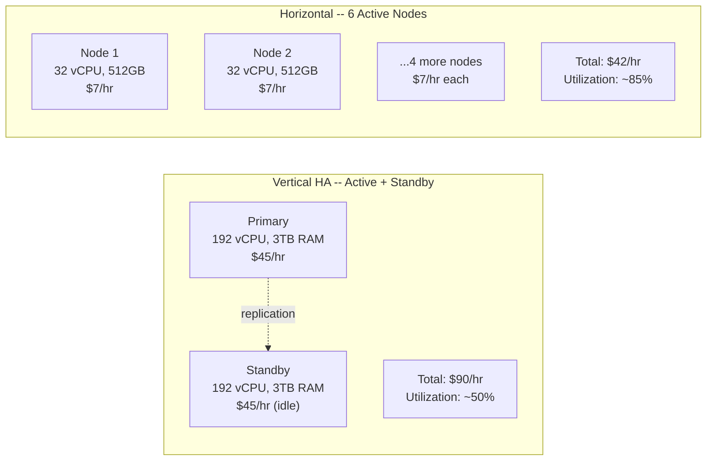

The decision to distribute a system is not primarily a software decision — it is a hardware economics decision. Distributed systems exist because the cost of buying more performance from a single machine eventually exceeds the cost of coordinating multiple machines, and because certain hardware limits are not merely expensive to overcome but physically impossible. Understanding *where* those limits are and *what shape the cost curve takes* as you approach them is prerequisite knowledge for any architectural decision involving scale.
 
## The End of Free Performance: Dennard Scaling and Moore's Law
 
For three decades, engineers could ignore hardware constraints and expect performance to improve for free. Two empirical observations made this possible.
 
**Moore's Law** (1965) observed that transistor density on integrated circuits doubles approximately every two years. More transistors meant more capability: larger caches, more sophisticated out-of-order execution units, wider SIMD lanes.
 
**Dennard Scaling** (1974) observed that as transistors shrank, they also consumed proportionally less power and switched faster. Shrinking a transistor by 50% allowed clock frequency to increase by ~40% while keeping power density constant. This is why CPU clock speeds went from ~1 MHz in 1980 to ~3 GHz by 2003: 23 years of roughly doubling every 18 months.
 
Both of these tailwinds ended at different times and for different reasons.
 
Dennard Scaling **broke down around 2004-2006**. As transistors shrank below ~90nm, leakage current — current that flows even when the transistor is nominally "off" — became a dominant component of total power. Increasing clock frequency past ~3-4 GHz caused power density to exceed what cooling systems could practically dissipate. The thermal wall is real: Intel's Prescott-generation Pentium 4 at 3.8 GHz consumed ~115 W on a 90nm process; doubling to ~7 GHz would have required ~460 W from the CPU alone, exceeding the thermal envelope of any practical cooling solution.
 
The industry response was to stop increasing clock frequency and instead add more cores. A modern high-end server CPU (AMD EPYC 9654, Intel Xeon Platinum 8592+) runs at 2.4-3.7 GHz base clock — barely faster than CPUs from 2003 — but has 96-128 cores. **Sequential single-threaded performance has improved only modestly since 2005.** The benchmark most relevant to software performance, single-core IPC (Instructions Per Cycle) gain, has averaged roughly 3-5% per year since then, versus the 50%+ annual gains of the Dennard scaling era.
 
Moore's Law for transistor density has also slowed dramatically. The 18-month doubling cadence held until roughly 2012-2015. Since then, each process node transition has taken longer and delivered smaller density gains. TSMC's N3 and N2 nodes deliver meaningful improvements, but each generation costs exponentially more to design for and manufacture: an N2 mask set costs over $20 million, which is why only Apple, NVIDIA, AMD, and a handful of others can afford leading-edge silicon.
 
The practical consequence for systems architects: **you cannot count on hardware performance catching up to your software's demands.** The era in which you could defer a scalability decision by waiting a few years for faster hardware is over.
 

*The Dennard Scaling collapse shifted the burden of performance improvement from hardware to software and architecture.*
 
## CPU Cost-Performance Curves
 
Within the vertical scaling model, CPU cost does not scale linearly with performance. Three distinct regimes exist in cloud and on-premises hardware markets.
 
**Commodity compute regime (1-16 vCPU):** The most densely manufactured and aggressively priced tier. Hyperscaler cloud providers run millions of these instances. Price/performance is at its peak here. An 8-vCPU instance gives you roughly 8x the compute of a 1-vCPU instance at close to 8x the price — the relationship is approximately linear.
 
**Mid-range regime (16-64 vCPU):** Still commodity but larger instances begin carrying a moderate premium. The primary driver is that larger instances require larger physical hosts, and not all rack configurations can accommodate them. Memory-to-CPU ratios diverge into specialized instance families (compute-optimized, memory-optimized, storage-optimized), each carrying different per-vCPU prices. Expect a 10-25% premium over the linear extrapolation from the commodity tier.
 
**Large-instance regime (64-192+ vCPU):** Non-linear cost growth. These instances occupy entire physical hosts or require multi-socket NUMA configurations. The workloads that need them are few and specific (large in-memory databases, high-frequency trading platforms, real-time simulation). Cloud providers price them with 40-100% premiums over linear extrapolation, and bare-metal equivalents often cost 3-5x more than the equivalent aggregated smaller instances.
 

*Relative per-vCPU cost increases non-linearly as instance size grows. The inflection point varies by cloud provider but typically begins around 32-48 vCPU.*
 
The more significant CPU limit is not cost but **single-thread throughput**. Any workload with a critical path that is fundamentally sequential — parsing a complex query plan, executing a stored procedure, running a single-threaded event loop — cannot exploit additional cores. Latency-sensitive applications that must minimize the time to complete a single operation are bounded by single-core performance, which has barely moved in 20 years and will not meaningfully improve on current roadmaps.
 
## Memory: The Latency Stagnation Problem
 
Memory is the most misunderstood hardware scaling dimension because two very different properties — **capacity** and **latency** — have diverged dramatically since the 1990s.
 
**DRAM capacity** has continued to grow. A single DIMM today holds 64-256 GB. A fully populated dual-socket server can reach 12 TB of DRAM. Capacity is not the bottleneck.
 
**DRAM latency** has barely improved in 25 years. In 2000, DDR1 SDRAM had a typical random-access latency of ~60 ns. In 2024, DDR5-6400 has a typical CAS latency of ~14 ns at the module level — but this is the cycle-count latency, not wall-clock latency. At higher clock speeds, the *absolute* wall-clock latency of DDR5 is 14 cycles × (1 / 6.4 GHz) ≈ **2.2 ns per cycle, multiplied by CAS 46** ≈ roughly 14 ns for the best-case local DIMM access. In practice, including memory controller overhead, row precharge, and bank conflicts, typical effective latency for a random cache-miss access is **60-80 ns for DDR5** — essentially unchanged from DDR1.
 
The consequence: CPU caches exist specifically to hide this latency. L1 cache access is ~1 ns, L2 is ~5 ns, L3 is ~20-40 ns. Code that fits its working set in L3 cache runs fast. Code that generates cache misses into DRAM runs slow — and adding more RAM does not make those misses faster.
 

*Memory hierarchy latency: the gap between L3 cache and DRAM is the single most impactful performance cliff in modern systems. Remote NUMA adds another 30-50 ns on top.*
 
**Memory bandwidth** is the other dimension. A modern DDR5 dual-channel system delivers ~100 GB/s of peak bandwidth. A 4-channel high-end workstation system reaches ~200 GB/s. These numbers sound large but are easily saturated by data-intensive workloads. An in-memory database scanning a large table touches every byte once — at 100 GB/s, scanning 1 TB takes 10 seconds of raw memory bandwidth, ignoring all processing overhead.
 
Adding more RAM does not increase bandwidth (adding DIMMs to existing channels does not linearly add bandwidth — only adding channels does). This is why memory-optimized cloud instances exist: they configure more DRAM channels per socket to increase bandwidth alongside capacity.
 
:::caution
A common vertical scaling mistake is adding RAM to fix a performance problem caused by cache-miss-heavy access patterns. If your workload accesses memory with poor locality — random key lookups in a hash map larger than L3 cache, for example — adding more RAM makes more data *available* but does not make access *faster*. The fix is data structure redesign (cache-friendly layouts, smaller records, better locality through partitioning), not more DIMM slots.
:::
 
## Storage: The IOPS Cliff and Bandwidth Economics
 
Storage performance has improved more dramatically than any other hardware dimension in the past decade, primarily through the NVMe SSD revolution. Understanding the current curves requires distinguishing between three access dimensions: **latency**, **IOPS**, and **throughput (bandwidth)**.
 
| Storage Type | Latency (random 4K read) | Max IOPS (single device) | Sequential Throughput | Price per GB |
|---|---|---|---|---|
| 7200 RPM HDD | 3-10 ms | 80-200 IOPS | 150-250 MB/s | $0.02-0.05 |
| SATA SSD (TLC) | 50-100 µs | 80K-100K IOPS | 500-560 MB/s | $0.06-0.10 |
| NVMe SSD (TLC) | 20-100 µs | 700K-1.2M IOPS | 3-7 GB/s | $0.10-0.20 |
| NVMe SSD (Optane/PLC) | 7-10 µs | 1.5M+ IOPS | 7-14 GB/s | $0.50-2.00 |
| DRAM (as tmpfs) | 60-80 ns | ~10B+ effective | 50-200 GB/s | $3-10 per GB |
 
The critical observation: **NVMe SSDs have effectively eliminated storage latency as a bottleneck for most database workloads.** A random 4K read at 20 µs latency means 50,000 IOPS per second from a single device. PostgreSQL on NVMe storage achieves 99th-percentile query latencies that were impossible on spinning disk systems regardless of how much you paid.
 
However, the *cost* curve for storage IOPS is non-linear at the high end. Cloud block storage (AWS EBS `gp3`, GCP Persistent Disk) is priced by both capacity (per GB-month) and provisioned IOPS (per IOPS-month) separately. The economics break down quickly for IOPS-intensive workloads:
 
- `gp3` at baseline: 3,000 IOPS included, $0.08/GB-month
- `gp3` at 16,000 IOPS: +$0.005 per provisioned IOPS beyond 3,000 — adds $65/month for 13,000 additional IOPS
- `io2` (dedicated IOPS): $0.125/GB-month + $0.065 per IOPS — a 100K IOPS volume costs $6,500/month in IOPS charges alone
At this cost level, **local NVMe storage on a dedicated instance becomes significantly cheaper for IOPS-intensive workloads** like high-write databases. A storage-optimized instance (AWS `i4i.8xlarge`, 3.75 TB NVMe, ~2.5M read IOPS) costs ~$2.50/hour versus an EBS `io2` volume providing equivalent IOPS at $9+/hour. The operational cost is higher (you manage your own RAID, replication, and backup), but the economics are clear for workloads that saturate provisioned IOPS.
 

*Storage economics decision: the IOPS cost on managed block storage becomes prohibitive above ~50-80K sustained IOPS.*
 
## Network: Bandwidth Has Scaled, Latency Has Not
 
Network hardware has followed a similar trajectory to storage: throughput has improved dramatically, latency has not.
 
**Bandwidth progression:** 1 GbE (2000s) → 10 GbE (2010s standard) → 25 GbE per server (2016+) → 100 GbE (hyperscalers, 2018+) → 400 GbE (emerging, 2022+). Cloud instances now routinely offer 25-100 Gbps network bandwidth. This means network throughput is rarely the bottleneck for distributed data transfer within a data center or cloud region.
 
**Latency:** Same-rack latency on a modern 25 GbE network with a modern NIC is approximately 5-20 µs for a raw packet round trip at the hardware level. Software overhead adds significantly more: the Linux kernel's TCP/IP stack processes a packet in ~10-30 µs under light load, bringing practical application-level round-trip latency to 50-100 µs. This is the number that matters for distributed systems — it is the irreducible floor on any cross-machine operation, and it is essentially unchanged from 10 GbE hardware 15 years ago.
 
This latency floor has significant implications for distributed database designs. A distributed transaction that requires two sequential network round trips (coordinator → participant 1 → coordinator → participant 2) cannot complete in less than ~200-400 µs even with perfect code, regardless of how fast the network hardware is. This is why systems like Google Spanner and CockroachDB have minimum transaction latency measured in single-digit milliseconds — that latency is not a software implementation limitation, it is a physical constraint of the speed of light and network stack overhead.
 
**Kernel bypass networking (DPDK, RDMA)** eliminates the kernel overhead by having applications read directly from NIC hardware, reducing latency to ~1-5 µs. This is used in high-frequency trading, high-performance computing, and purpose-built storage systems (NVMe-over-Fabrics). The operational complexity and software ecosystem limitations mean it is not practical for general-purpose distributed systems.
 
:::note
Network bandwidth scaling creates an asymmetric situation in distributed architectures: you can move a lot of data between machines cheaply, but you cannot make any individual coordination operation fast. This is why architectures that batch work (Kafka consumer groups, MapReduce shuffle phases, bulk database replication) perform far better than architectures that require fine-grained per-item coordination across machines.
:::
 
## The Total Cost of Ownership Inflection Point
 
The economic argument for horizontal scaling over vertical scaling is not that individual commodity servers are cheaper — they are not, on a pure per-core or per-GB basis. The argument is that the *aggregate* cost of N commodity servers providing equivalent availability and throughput is lower than the cost of a single large server, especially when you include:
 
- **HA redundancy cost:** A single large server requires a standby replica of equal size for high availability. Two servers at N/2 capacity each can serve as active-active peers, using capacity that would otherwise be idle. The standby large-server model pays full price for capacity that sits warm and unused.
- **Overprovisioning cost:** Vertical scaling requires provisioning for peak load plus headroom. Horizontal scaling with auto-scaling provisions for average load and scales to peak, then scales back. The savings on cloud infrastructure can be 30-50% for bursty workloads.
- **Upgrade disruption cost:** Upgrading a vertical-scaled system requires a maintenance window and typically causes downtime. Adding a node to a horizontal cluster is (ideally) a zero-downtime operation.
- **Failure recovery cost:** A large-instance failure recovers slowly — crash recovery, buffer pool warming, log replay. Replacing a commodity node in a distributed cluster is typically faster and involves replication catchup rather than a full local recovery.

*Equivalent compute capacity: vertical active+standby pair at $90/hr versus horizontal active cluster at $42/hr — nearly identical total compute, roughly half the cost. Horizontal adds coordination complexity.*
 
The inflection point where horizontal becomes economically superior to vertical varies by workload type:
 
- **Pure stateless compute (web servers, API workers):** Horizontal wins at almost any scale above a few hundred RPS. There is no reason to pay for a large instance when commodity instances behind a load balancer provide better availability and lower cost simultaneously.
- **Stateful single-writer systems (relational databases, message brokers):** Vertical scaling remains competitive up to 32-48 cores and 256-512 GB RAM. Beyond this, the NUMA penalties, standby cost, and licensing premiums (for commercial databases priced per-socket) tip the economics toward horizontal.
- **Read-heavy workloads with replicas:** Adding read replicas is horizontal scaling. A single-primary, multiple-replica PostgreSQL configuration is a hybrid architecture that extracts most of the benefit of horizontal scaling for reads while keeping write-path simplicity.
## Hardware Limits That Are Not Negotiable
 
Some performance constraints cannot be overcome by spending more money on hardware. They are governed by physics.
 
**The speed of light:** A signal traveling through fiber optic cable at approximately 2/3 the speed of light in a vacuum takes ~5 ms to travel 1,000 km. A round trip from New York to London is ~70 ms minimum, irreducible regardless of hardware investment. This is why geographically distributed consensus protocols have minimum latency floors that appear in every distributed database's benchmark disclaimers.
 
**DRAM random access latency:** As described above, ~60-80 ns for a cache-miss access. This has not meaningfully changed in 25 years and is bounded by fundamental DRAM cell physics — specifically, the time required to charge and discharge a capacitor reliably across process-node scaling.
 
**CPU pipeline depth and branch misprediction cost:** Deeper pipelines allow higher clock frequencies but increase the penalty for mispredicted branches. Modern CPUs with 14-20 stage pipelines pay 14-20 cycles on a misprediction — at 3 GHz, that is 5-7 ns flushed. Speculative execution and branch predictors mitigate this, but highly unpredictable code (complex if-chains over uncacheable data) hits these limits regardless of CPU generation.
 
**Disk seek time (mechanical):** The ~5 ms average seek time of a spinning disk is bounded by the physical rotational speed of the platter (7200 RPM = 8.3 ms per rotation) and actuator arm mechanics. This physical limit is why HDDs remain unsuitable for latency-sensitive random I/O and will remain so regardless of future improvements in platter density.
 
:::danger
Architectural decisions made under incorrect assumptions about hardware capabilities are the most expensive mistakes in distributed systems. Assuming that memory latency will improve with more RAM, that adding CPUs will speed up sequential operations, or that network round-trip latency can be reduced below ~50 µs with standard software stacks will embed false premises into capacity models, SLO budgets, and system designs that are very difficult to unwind later.
:::
 
## Translating Hardware Limits Into Architectural Constraints
 
Each hardware limit directly implies a set of architectural constraints that should be treated as first-class design inputs.
 
| Hardware Limit | Architectural Implication |
|---|---|
| ~3-5 GHz frequency plateau | Latency-sensitive code must minimize instruction count, not rely on frequency increases. JIT-compiled and interpreted languages pay a real throughput tax. |
| ~60-80 ns DRAM latency | Cache-miss-heavy access patterns are the dominant performance bottleneck. Data layout matters more than algorithmic complexity for large-scale data. |
| NUMA bandwidth penalty | Database buffer pools must be NUMA-local. JVM heap sizing that crosses NUMA boundaries degrades performance unpredictably. |
| ~50-100 µs same-rack RTT | Any operation requiring network coordination cannot achieve sub-100 µs latency. Synchronous fine-grained coordination in hot paths is architecturally unsound. |
| ~5 ms/1000 km speed-of-light RTT | Active-active cross-region writes with strong consistency are incompatible with single-digit millisecond latency SLOs. |
| NVMe IOPS ceiling (~1-5M per device) | Per-device IOPS can saturate even NVMe. Designs that funnel all I/O through a single device — whether a single SSD or a single EBS volume — hit this ceiling at scale. |
 
See [Cost-Performance Curves and Hardware Limits](/distributed-systems/en/foundations/monoliths-to-distributed/cost-performance-curves/) for the companion analysis of why stateless vs. stateful design directly determines which of these limits you encounter first.
See [Network Reliability, Bandwidth Limitations, and Topology Changes](/distributed-systems/en/foundations/monoliths-to-distributed/network-reliability/) for how network hardware limits propagate into distributed system reliability constraints.