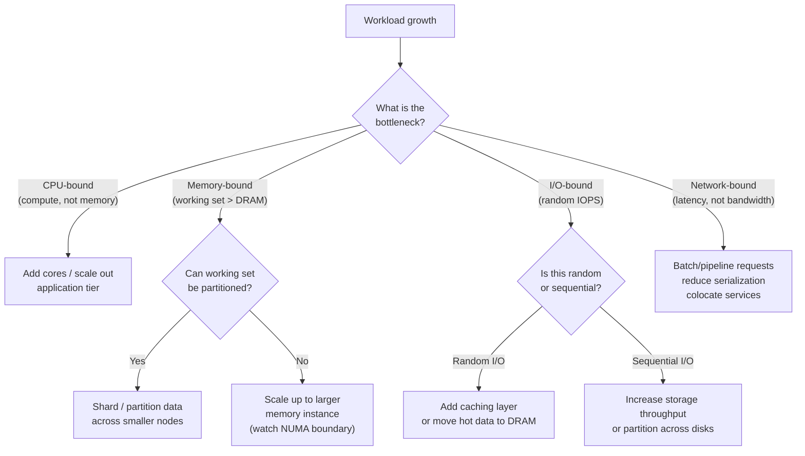

Every architectural decision is ultimately a resource allocation decision. Understanding the cost-performance curve of each hardware layer — CPU, memory, storage, network — tells you which bottleneck you will hit next and how much it will cost to defer it. Guessing wrong produces either overprovisioned infrastructure or a 3am incident.
 
## CPU Scaling: Cores, Frequency, and the Memory Wall
 
Single-thread performance has been effectively flat since 2006. Clock frequencies plateaued around 4-5 GHz due to power density limits — the **power wall**. Dennard Scaling, which allowed higher clock speeds without proportional power increases as transistors shrank, broke down around the same time. The industry responded by adding more cores, which created a different problem: most software is not written to exploit dozens of parallel threads efficiently.
 
The relationship between core count and throughput is not linear. **Amdahl's Law** states that the maximum speedup from parallelization is bounded by the serial fraction of a program:
 
```
Speedup = 1 / (S + (1 - S) / N)
```
 
Where `S` is the fraction of execution that must be serial and `N` is the number of parallel workers. If 10% of your workload is serial, no amount of parallelism can exceed a 10× speedup — even with infinite cores. A real-world HTTP service with connection management, request parsing, and authentication logic that cannot be fully parallelized will see throughput plateau well before saturating all available cores.
 
Beyond Amdahl, there is **cache contention**. Modern CPUs have L1/L2 caches per core and a shared L3 cache across cores on the same die. When many threads compete for the same cache lines, **false sharing** degrades performance: two threads writing to different variables that happen to occupy the same 64-byte cache line cause the line to bounce between cores' private caches, generating inter-core coherence traffic.
 
```go
// False sharing: counter0 and counter1 likely occupy the same cache line
type BadCounters struct {
    counter0 int64
    counter1 int64
}
 
// Padded to force each counter onto its own cache line (64 bytes)
type PaddedCounters struct {
    counter0 int64
    _pad0    [56]byte
    counter1 int64
    _pad1    [56]byte
}
```
 
The **memory wall** is the dominant CPU bottleneck at high core counts. DRAM latency is roughly 60-100ns; an L1 cache hit is ~1ns. A CPU stalled waiting for main memory wastes 60-100 clock cycles per access. High-core-count servers (64+ cores) saturate memory bandwidth before they saturate compute capacity. Adding more cores beyond that point yields zero throughput improvement — you have bought processing capacity that spends most of its time waiting for data.
 
```shell
# Measure memory bandwidth on a running Linux system
# mlc (Intel Memory Latency Checker) gives the most accurate picture
mlc --bandwidth_matrix
 
# Alternative: stream benchmark
# Compile with: gcc -O3 -fopenmp stream.c -o stream
./stream
 
# Example output on a dual-socket 32-core server:
# Function    Best Rate MB/s  Avg time     Min time     Max time
# Copy:          145230.8     0.022033     0.022034     0.022035
# Scale:         144821.4     0.022097     0.022096     0.022099
# Add:           160430.1     0.029924     0.029920     0.029929
# Triad:         160289.2     0.029958     0.029946     0.029964
```
 
The cost curve for CPU reflects these constraints. Cloud instance pricing scales roughly linearly with vCPU count within a family, but large instance types (32xlarge, 48xlarge) carry a 15-30% per-vCPU premium because demand is lower, margins are higher, and the underlying hardware (high-core-count server with ECC memory, redundant PSUs, top-of-rack bandwidth) costs more per unit than commodity mid-range servers.
 
## Memory: Capacity, Bandwidth, and the NUMA Tax
 
DRAM capacity scales in predictable cost steps driven by the JEDEC DDR standard generation. DDR5 (current mainstream as of 2024-2025) provides roughly 2× the bandwidth of DDR4 per channel, but the key constraint is not bandwidth — it is **memory channel count**, which is fixed by the CPU socket design.
 
A typical dual-socket server with AMD EPYC or Intel Xeon supports 8-12 memory channels per socket, providing a theoretical peak bandwidth of ~300-400 GB/s per socket. That sounds large until you consider an in-memory database with 96 cores all trying to scan a 512 GB dataset simultaneously. At ~4 GB/s per core theoretical requirement, that is 384 GB/s of memory bandwidth needed — and you are at the hardware ceiling.
 
**The NUMA topology compounds the memory cost curve** for large instances. On a dual-socket server, each socket has its local DRAM. Cross-socket memory access (remote NUMA access) adds 30-80% latency compared to local access. Operating systems attempt NUMA-local allocation by default, but under memory pressure, the kernel allocates from remote nodes, silently degrading performance.
 
```shell
# Pin a process to NUMA node 0, allocating memory locally
numactl --cpunodebind=0 --membind=0 ./your-service
 
# Verify NUMA memory allocation of a running process (PID 1234)
numastat -p 1234
 
# Output columns: Node0 (local) vs Node1 (remote)
# High values in Node1 columns indicate NUMA thrashing
```
 
The practical cost implication: memory-optimized cloud instances (`r7g`, `x2idn`) charge a premium specifically because they provision more DRAM capacity relative to CPU. The premium is not arbitrary — it reflects the hardware BOM cost of populating all DIMM slots and the reduced yield from qualifying high-density memory modules.
 
| Instance class | Ratio (GB RAM / vCPU) | Relative cost/vCPU | Primary use case |
|---|---|---|---|
| General purpose (`m7i`) | 4 GB | 1.0× (baseline) | Balanced workloads |
| Compute optimized (`c7i`) | 2 GB | 0.8× | CPU-bound, low-memory |
| Memory optimized (`r7i`) | 8 GB | 1.3× | In-memory DB, caching |
| High-memory (`x2idn`) | 32 GB | 3.8× | SAP HANA, large in-memory analytics |
| Storage optimized (`i4i`) | 4 GB + NVMe | 2.1× | High IOPS, NVMe-local storage |
 
The jump to high-memory instances represents the point where vertical memory scaling becomes architecturally expensive. At 3.8× cost per vCPU, the economics of distributing state across a Redis Cluster or partitioning a dataset across multiple smaller nodes typically become favorable — unless the workload is irreducibly stateful and coordination-sensitive.
 
## Storage: The Latency Hierarchy and IOPS Economics
 
Storage is a hierarchy of latency and cost. Every layer has a distinct cost-performance curve, and choosing the wrong layer is a common source of both unnecessary cost and unexpected bottlenecks.
 
```
Component          | Latency        | Throughput      | Cost (relative)
-------------------|----------------|-----------------|----------------
CPU L1 cache       | ~1 ns          | ~1 TB/s         | N/A (on-die)
CPU L2 cache       | ~4 ns          | ~400 GB/s       | N/A (on-die)
CPU L3 cache       | ~40 ns         | ~200 GB/s       | N/A (on-die)
DRAM               | ~60-100 ns     | ~100-400 GB/s   | 1× (baseline)
NVMe SSD (local)   | ~100-200 μs    | ~7 GB/s         | 0.05×
SATA SSD           | ~200-500 μs    | ~500 MB/s       | 0.02×
Network-attached   | ~500 μs-2 ms   | ~1-10 GB/s      | 0.005×
(EBS gp3, Azure Premium)
HDD                | ~5-10 ms       | ~100-200 MB/s   | 0.001×
```
 
The gap between NVMe latency (~100μs) and DRAM latency (~100ns) is 1000×. This is the most important number in storage performance. Any workload that cannot fit its **working set** — the subset of data accessed frequently — into DRAM will have its performance dominated by NVMe (or worse, network-attached storage) latency.
 
**IOPS costs on cloud block storage are non-linear.** AWS EBS `gp3` provides a baseline of 3,000 IOPS and 125 MB/s at no additional charge. Provisioning beyond that is charged per IOPS, and the curve steepens quickly:
 
```
gp3 cost breakdown (approximate, us-east-1):
- Storage: $0.08/GB/month
- Baseline 3,000 IOPS: included
- Each additional 1,000 IOPS: +$0.005/IOPS/month
- Max 16,000 IOPS: $0.08/GB + $65/month in IOPS fees
 
io2 Block Express (for consistent sub-millisecond latency):
- Storage: $0.125/GB/month
- IOPS: $0.065/IOPS/month at base tier
- 50,000 IOPS = $3,250/month in IOPS fees alone
```
 
At 50,000 IOPS, you are paying more for the IOPS provisioning than for a mid-range compute instance. This is the economic signal that the workload should be redesigned — adding a caching layer in front, batching writes, moving to an LSM-tree storage engine with sequential I/O patterns, or partitioning the dataset so the working set fits in DRAM.
 
:::tip
The single highest-leverage storage optimization is usually reducing random I/O. Sequential reads on NVMe are 10-50× faster than random reads at the same throughput figure, because sequential I/O allows read-ahead prefetching and amortizes seek cost. A workload that reads 1 GB sequentially completes in ~150ms on NVMe; the same 1 GB as 250,000 random 4KB reads takes ~25 seconds at typical random read latency.
:::
 
## Network: Bandwidth, Latency, and the Serialization Tax
 
Network bandwidth on cloud instances is increasingly generous — 100 Gbps is standard on large instances. The number that matters more is **latency**, specifically the round-trip time (RTT) between cooperating services within the same availability zone.
 
Typical same-AZ RTT on AWS/GCP/Azure: **0.1-0.5ms**. This appears small. At 1ms RTT with a synchronous request-response protocol, the theoretical maximum is 1,000 requests per second over a single connection — regardless of bandwidth or CPU availability. This is a **latency-bound concurrency ceiling**, not a bandwidth ceiling.
 
```
Maximum requests/sec (single connection) = 1000ms / RTT
At 0.2ms RTT → 5,000 req/s
At 1ms RTT  → 1,000 req/s
At 5ms RTT  →   200 req/s (cross-AZ typical)
```
 
The solution is connection multiplexing, pipelining, or batching — not more bandwidth. gRPC's HTTP/2 multiplexing allows thousands of in-flight requests over a single TCP connection. Kafka producers batch records into a single network write. This is why high-throughput systems are architecturally biased toward asynchronous, batched communication: it amortizes the per-request latency tax.
 
The **serialization cost** is a frequently overlooked component of the network performance curve. Every object that crosses a network boundary must be serialized to bytes and deserialized on the other side. For JSON over REST:
 
```
A 10-field JSON object:
- Serialization (Go/Jackson): ~1-5 μs per object
- At 100,000 req/s: 100ms-500ms of pure serialization CPU per second
- Wire size: ~300-500 bytes per object
 
Same object in Protobuf:
- Serialization: ~0.1-0.5 μs per object
- At 100,000 req/s: 10ms-50ms CPU per second
- Wire size: ~80-120 bytes per object (3-4× smaller)
```
 
At moderate throughput, serialization cost is noise. At 500,000+ req/s, it becomes a meaningful fraction of CPU budget, which is why gRPC with Protocol Buffers shows substantial CPU efficiency gains over REST+JSON at scale — not because of HTTP/2 vs HTTP/1.1, but because of binary serialization vs text serialization.
 
:::caution
Cross-AZ network traffic carries two costs that are easy to miss: latency (5-20ms RTT vs 0.1-0.5ms same-AZ) and egress charges ($0.01-0.02/GB depending on provider and region). A high-throughput service making synchronous cross-AZ calls for every request will have both degraded tail latency and a non-trivial network egress bill. Design data affinity and placement with AZ topology in mind.
:::
 
## Where the Curves Converge: The Bottleneck Shift Pattern
 
Hardware performance curves do not degrade uniformly — they have **inflection points** where cost accelerates non-linearly. Recognizing these inflection points drives the right scaling decision.
 

*Bottleneck shift decision tree. Each hardware layer has a distinct mitigation strategy; misidentifying the bottleneck leads to expensive and ineffective scaling.*
 
The typical bottleneck progression for a growing web service is:
 
1. **CPU** — the first limit hit by compute-bound workloads; solved by horizontal scaling of stateless application tier.
2. **Database connection pool** — not a hardware limit but behaves like one; solved by connection pooling (PgBouncer, ProxySQL) before reaching hardware limits.
3. **Database I/O** — random read IOPS on the primary; solved by read replicas, caching, or index optimization before hardware upgrades.
4. **Memory** — working set exceeds available DRAM; the most expensive inflection point because solutions (sharding, larger instances, tiered storage) all carry significant complexity or cost.
5. **Network** — typically hit last for internal services, but hit first when egress costs or cross-AZ latency dominate.
The engineering discipline is **measuring which layer is actually saturated** rather than guessing. Vertical scaling buys time at each step; horizontal scaling restructures the problem so the curve resets. Neither strategy eliminates the underlying physics — it changes which layer hits its ceiling next.
 
:::note
Cloud provider **Savings Plans and Reserved Instances** fundamentally change the cost curve comparison. On-demand pricing makes large instances appear expensive; a 3-year reserved commitment on a single large instance may be cheaper than running multiple smaller spot instances at equivalent capacity with the operational overhead of managing horizontal scale. Total cost of ownership must include engineering time, not just infrastructure line items.
:::