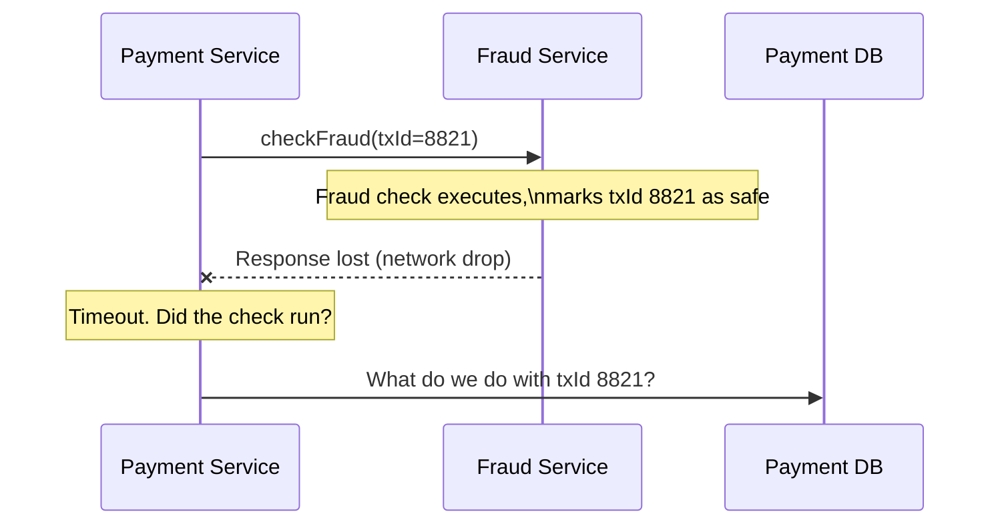
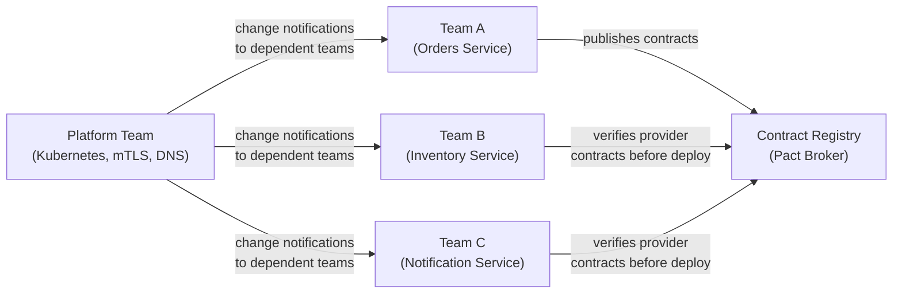

Between 1991 and 1997, engineers at Sun Microsystems — L. Peter Deutsch, Bill Joy, and others — codified a list of assumptions that developers routinely make when building distributed systems and that reality routinely violates. The list became known as the **Eight Fallacies of Distributed Computing**. They are not historical curiosities. Every incident report from a system that was "working fine in staging" and failed in production maps to at least one of them.
 
The fallacies are not a checklist to read once. They are a diagnostic framework. When a distributed system behaves unexpectedly, the first question is: which assumption did we make that does not hold here?
 
## Fallacy 1: The Network Is Reliable
 
This is the foundational fallacy. Everything else compounds it.
 
A function call in a monolith either executes or the process crashes — there is no third state. A network call between services has at least four outcomes: the request arrived and succeeded, the request arrived and failed, the request never arrived, or the response was lost after the server processed it. The caller cannot distinguish between the last three without additional information.
 
The practical consequence is **partial failure**: a state where some components of a distributed operation have completed and others have not, with the caller uncertain about which. A payment service that calls a fraud-detection service over the network and receives a timeout does not know whether the fraud check ran and the response was lost, or whether the check never ran. Processing the payment in either case produces different correctness outcomes.
 

*The caller cannot distinguish between a failed fraud check and a lost response. Both look identical from the payment service's perspective.*
 
The disciplines that address this:
 
- **Idempotency** — design operations so that executing them twice produces the same result as executing them once. A fraud check for the same transaction ID should return the cached result, not run twice. See [Idempotency and Safe HTTP Methods](/distributed-systems/en/communication/api-gateway/idempotency/) for implementation patterns.
- **Timeouts on every network call** — a call without a timeout will block indefinitely when the network fails, eventually exhausting thread pools or connection pools.
- **Retry with backoff** — retrying immediately under network stress amplifies the problem. Exponential backoff with jitter distributes retry load. See [Retry with Exponential Backoff and Jitter](/distributed-systems/en/resilience/protection-patterns/retry-exponential-backoff/).
- **Circuit breakers** — stop retrying into a failing dependency before the retry storm cascades. See [Circuit Breaker](/distributed-systems/en/resilience/protection-patterns/circuit-breaker/).
Network failure rates in production are not theoretical. AWS publishes availability SLAs for individual services, but does not publish inter-service packet loss rates. Empirically, within a single availability zone, packet loss is rare but not zero. Across availability zones or regions, it is a routine operational condition.
 
## Fallacy 2: Latency Is Zero
 
In-process function calls complete in nanoseconds. Network calls complete in hundreds of microseconds to milliseconds — a difference of three to six orders of magnitude. Code that is correct and performant when function calls are free becomes incorrect or unusable when those calls cross a network.
 
The most common manifestation is the **N+1 query problem translated to services**: a service that fetches a list of 100 order IDs and then makes a separate HTTP call per order to enrich each one with customer data. This pattern is idiomatic in local code. Over a network at 0.5ms per call, it produces 50ms of serialized latency before the first response byte is returned — and that assumes perfect availability.
 
```go
// Naive: 100 sequential network calls
func enrichOrders(ctx context.Context, orderIDs []string) ([]EnrichedOrder, error) {
    results := make([]EnrichedOrder, 0, len(orderIDs))
    for _, id := range orderIDs {
        // Each call: ~0.5ms same-AZ. 100 calls = ~50ms minimum.
        // Under load, p99 per call = 5ms. 100 calls = ~500ms.
        customer, err := customerClient.GetByOrderID(ctx, id)
        if err != nil {
            return nil, fmt.Errorf("enriching order %s: %w", id, err)
        }
        results = append(results, EnrichedOrder{OrderID: id, Customer: customer})
    }
    return results, nil
}
 
// Correct: one batched call or parallel calls with bounded concurrency
func enrichOrdersBatched(ctx context.Context, orderIDs []string) ([]EnrichedOrder, error) {
    // Single call, server-side join: ~0.5ms + query time
    customers, err := customerClient.GetByOrderIDs(ctx, orderIDs)
    if err != nil {
        return nil, fmt.Errorf("batch enrichment: %w", err)
    }
    // map and merge locally
    index := make(map[string]Customer, len(customers))
    for _, c := range customers {
        index[c.OrderID] = c
    }
    results := make([]EnrichedOrder, 0, len(orderIDs))
    for _, id := range orderIDs {
        results = append(results, EnrichedOrder{OrderID: id, Customer: index[id]})
    }
    return results, nil
}
```
 
Latency also has a **tail problem**. The median (p50) latency of a network call may be 0.5ms, but the p99 may be 5ms and the p999 may be 50ms. A request that fans out to 10 downstream services has a completion time determined by the *slowest* response — meaning p99 latency of the composite operation approaches the p999 of a single call. This is the **tail latency amplification** effect, and it means optimizing median latency while ignoring tail latency produces systems that appear fast in synthetic benchmarks and feel slow to real users at the 99th percentile.
 
:::tip
The most reliable way to surface N+1 and tail latency problems in development is distributed tracing with span-level timing. A trace that shows 100 sequential 0.5ms spans for what should be a single enrichment operation makes the problem unmistakable. Catching this in code review requires knowing to look for loops that contain network calls.
:::
 
## Fallacy 3: Bandwidth Is Infinite
 
In-process data transfer is bounded only by memory bandwidth (tens to hundreds of GB/s). Network bandwidth is bounded by the NIC, the switch fabric, and the instance's allocated bandwidth cap — typically 1–100 Gbps for cloud instances, but often shared across all processes on the host.
 
Bandwidth becomes a constraint in three specific scenarios:
 
**Large payload serialization.** A service that serializes a full object graph on every response — including fields the caller never uses — wastes bandwidth and serialization CPU proportionally. Over millions of requests, this aggregates into a measurable network egress cost and a measurable increase in serialization overhead.
 
**Chatty protocols.** REST over HTTP/1.1 requires a header overhead of 200–800 bytes per request, even for a 20-byte payload. At 500,000 req/s, that is 100–400 MB/s of header overhead. HTTP/2 header compression (HPACK) and multiplexing reduce this significantly; gRPC's binary framing reduces it further.
 
**Fan-out amplification.** A single inbound request that triggers writes to 50 downstream services multiplies bandwidth consumption by 50. Under traffic spikes, this saturates the network before CPU or memory become bottlenecks.
 
```python
# Wasteful: returning full entity when caller needs 3 fields
@app.get("/orders/{order_id}")
def get_order(order_id: str) -> Order:  # Order has 47 fields, 8KB serialized
    return db.get_order(order_id)
 
# Better: projection-aware response for known consumer contracts
@app.get("/orders/{order_id}/summary")
def get_order_summary(order_id: str) -> OrderSummary:  # 3 fields, ~80 bytes
    order = db.get_order(order_id)
    return OrderSummary(
        order_id=order.order_id,
        status=order.status,
        total_amount=order.total_amount
    )
```
 
The design responses are field projection (return only what was asked for), compression (gzip/Brotli for JSON payloads, built-in compression in Protobuf), binary serialization formats (Protobuf, Avro, FlatBuffers), and pagination for large collection responses.
 
## Fallacy 4: The Network Is Secure
 
A monolith's internal function calls are not observable by a network attacker. Service-to-service calls over a network are, in principle, observable and modifiable by anyone with access to the network path — which in a cloud environment includes other tenants on shared infrastructure, misconfigured firewall rules, and compromised internal services.
 
The specific risks in a distributed system that do not exist in a monolith:
 
- **Eavesdropping** on unencrypted internal traffic (credentials, PII, session tokens transmitted between services)
- **Spoofing** — a compromised service impersonating another to gain elevated privileges
- **Man-in-the-middle** interception between services that do not mutually authenticate
- **Lateral movement** — once one service is compromised, traversing to others via internal APIs that trust anything on the same network segment
The assumption that internal network traffic is safe because it is "inside the firewall" is the premise of perimeter-based security, and it fails the moment any internal component is compromised or misconfigured. The alternative is **zero trust** — every service-to-service call is authenticated and authorized regardless of network origin. See [Zero Trust Architecture](/distributed-systems/en/security/zero-trust/never-trust-always-verify/) for the engineering implementation.
 
The minimum production baseline for internal service communication:
 
```yaml
# Istio PeerAuthentication: enforce mTLS for all traffic in the namespace
apiVersion: security.istio.io/v1beta1
kind: PeerAuthentication
metadata:
  name: default
  namespace: production
spec:
  mtls:
    mode: STRICT   # reject any plaintext traffic between services
```
 
**Mutual TLS (mTLS)** ensures that both the client and the server present valid certificates before the connection is established. This provides authentication (both parties are who they claim to be) and encryption (traffic is unreadable to observers) without application-layer changes. See [mTLS: Mutual Authentication and Encryption](/distributed-systems/en/service-mesh/network-policies-mtls/mtls/).
 
:::caution
Zero trust is not achieved by adding mTLS alone. Authentication proves identity; it does not enforce authorization. A service that authenticates successfully but has no authorization check can still access any API endpoint it can reach. mTLS is the transport security layer; RBAC or ABAC policies enforced at the application or mesh layer are the access control layer. Both are required.
:::
 
## Fallacy 5: Topology Does Not Change
 
In a monolith, the topology is one process. Adding or removing capability is a deployment. In a distributed system, topology — which services exist, where they are running, which IP addresses they are reachable at — changes continuously:
 
- Auto-scaling adds and removes instances in response to load
- Rolling deployments cycle out old instances and introduce new ones
- Health checks fail, instances are evicted, replacements are provisioned
- Cloud providers reassign IP addresses on instance restart
- Kubernetes reschedules pods to different nodes during cluster maintenance
Code that hardcodes IP addresses or assumes that a service it called 10 seconds ago is still reachable at the same address will fail in exactly this environment. This is why **service discovery** exists: to provide a stable logical name for a service that resolves to whatever instances are currently healthy. See [Service Discovery](/distributed-systems/en/microservice-patterns/service-discovery/) for the full taxonomy of client-side and server-side discovery patterns.
 
The corollary is that connection pools must be managed defensively. A connection pool that holds long-lived TCP connections to specific IPs will accumulate stale connections as the topology shifts under it, producing connection errors that look like intermittent failures until the pool is refreshed.
 
```go
// Connection pool configured for topology volatility
transport := &http.Transport{
    DialContext: (&net.Dialer{
        Timeout:   2 * time.Second,   // fail fast on new connections to dead IPs
        KeepAlive: 30 * time.Second,
    }).DialContext,
    MaxIdleConns:          100,
    IdleConnTimeout:       60 * time.Second, // expire idle conns before IPs rotate
    TLSHandshakeTimeout:   5 * time.Second,
    ResponseHeaderTimeout: 10 * time.Second,
    DisableKeepAlives:     false,
}
```
 
## Fallacy 6: There Is Only One Administrator
 
A monolith has one deployment pipeline, one configuration management system, one team with write access to its runtime state. A distributed system with 50 services may have 15 teams, 50 deployment pipelines, 5 different configuration management approaches, and shared infrastructure components maintained by a platform team that none of the product teams control.
 
The operational consequence is **undifferentiated change propagation**: a schema migration in a database owned by Team A silently breaks the API contract relied upon by Team B, which deploys independently on a different cycle. A network policy change by the platform team blocks traffic between Service C and Service D with no notification. A certificate rotation in a shared PKI causes mTLS handshake failures across services that cached the old certificate chain.
 
This fallacy is the technical basis for several distributed systems practices:
 
- **Consumer-driven contract testing** — each consumer of an API asserts the contract it depends on; changes that break any consumer's contract are caught before deployment. See [Consumer-Driven Contract Testing (Pact)](/distributed-systems/en/communication/api-gateway/contract-testing/).
- **API versioning** — breaking changes are published as a new version, not in-place modifications, giving consumers time to migrate.
- **Backward-compatible schema evolution** — Protobuf's field numbering and Avro's schema registry patterns allow producers and consumers to deploy independently without synchronizing schema changes.
- **Audit logging and change management** for shared infrastructure changes that have blast radii across teams.

*Multiple independent administrators require formal contract management and change propagation mechanisms, not tribal knowledge.*
 
## Fallacy 7: Transport Cost Is Zero
 
Moving data between processes has CPU, memory, and time costs that are absent in in-process calls. These costs exist even on a local loopback interface and grow with serialization complexity, payload size, and the number of network hops.
 
The specific costs:
 
**Serialization and deserialization CPU.** Every object that crosses a process boundary must be converted to bytes (serialized) and reconstructed on the other side (deserialized). At low request rates this is noise; at 100,000+ req/s per instance it becomes a material fraction of CPU budget. A service spending 15% of its CPU on JSON serialization is a service that will hit a CPU ceiling earlier than its compute work would predict.
 
**Context switching and syscall overhead.** A network send involves at minimum: a write syscall, kernel buffer allocation, TCP segmentation, NIC DMA transfer, interrupt processing on the receiver, kernel-to-userspace copy, and read syscall. Even with kernel bypass (DPDK, io_uring) this chain has irreducible overhead compared to a pointer dereference.
 
**Memory allocation pressure.** Serialization libraries typically allocate intermediate byte buffers. Under high throughput, this generates significant GC pressure in managed-runtime languages (JVM, Go's GC, Python), producing latency spikes at GC pause intervals.
 
```go
// Reusing serialization buffers to reduce allocation pressure
var bufPool = sync.Pool{
    New: func() interface{} {
        return new(bytes.Buffer)
    },
}
 
func marshalResponse(v interface{}) ([]byte, error) {
    buf := bufPool.Get().(*bytes.Buffer)
    defer func() {
        buf.Reset()
        bufPool.Put(buf)
    }()
 
    if err := json.NewEncoder(buf).Encode(v); err != nil {
        return nil, err
    }
    // copy before returning — buf goes back to pool
    result := make([]byte, buf.Len())
    copy(result, buf.Bytes())
    return result, nil
}
```
 
The design response is to minimize the number of remote calls, batch where possible, use efficient serialization formats, and profile serialization cost explicitly before assuming compute is the bottleneck.
 
## Fallacy 8: The Network Is Homogeneous
 
In-process code runs on one machine with one OS, one JVM or runtime version, one CPU architecture. A distributed system spans multiple machines, potentially across cloud providers, on-premises data centers, availability zones, and regions — with different MTU settings, different NIC firmware, different TCP stack configurations, different clock sources, and different failure domains.
 
The practical failure modes this produces:
 
**MTU mismatch and silent packet fragmentation.** Default Ethernet MTU is 1500 bytes. Jumbo frames (9000 bytes MTU) are common within data centers. A misconfigured network path that silently fragments packets without `DF` (Don't Fragment) bit handling causes connection hangs that look like application-layer timeouts. The failure is intermittent, only affects payloads above a size threshold, and is nearly impossible to diagnose without packet-level inspection.
 
**TCP nagle and delayed ACK interaction.** TCP's Nagle algorithm coalesces small writes; the delayed ACK algorithm delays acknowledgments by up to 40ms. Together on a connection with small, frequent messages, they can combine to produce ~40ms added latency per round-trip — invisible in homogeneous environments where both sides use the same TCP configuration, but surfacing as random latency spikes when one side disables Nagle (as gRPC does) and the other does not.
 
**Clock sources and timezone assumptions.** Services running on different hosts have different hardware clocks with different drift rates. A service on AWS in `us-east-1` and a service in `eu-west-1` may disagree on wall-clock time by tens to hundreds of milliseconds even after NTP synchronization. Code that uses wall-clock ordering for event sequencing — "the event with the later timestamp wins" — produces incorrect results under this condition. See [Physical Clocks: Quartz Drift, NTP Limitations, Leap Second Problem](/distributed-systems/en/foundations/time-and-ordering/physical-clocks/).
 
**Encoding and character set assumptions.** A service that treats all strings as UTF-8 and calls an upstream that returns Latin-1 encoded data produces silent corruption or panics depending on the string handling library. Cross-language service interactions frequently encounter this.
 
:::danger
MTU-related fragmentation failures are among the hardest distributed systems problems to diagnose because they are path-dependent, size-threshold-dependent, and intermittent. They commonly manifest as connections that complete handshake and exchange small messages correctly, then hang when a payload crosses the fragmentation threshold. If a network issue reproduces only with payloads above a specific size, check MTU configuration on every network device in the path before investigating the application layer.
:::
 
## Using the Fallacies as a Design Review Checklist
 
The eight fallacies are most useful as a structured prompt during architecture review and incident postmortem analysis. For each service boundary in a design:
 
| Fallacy | Design review question |
|---|---|
| Network reliability | What happens to in-flight operations when this call times out? Is the operation idempotent? |
| Zero latency | Does any code path make N network calls in a loop? What is the p99 fan-out latency? |
| Infinite bandwidth | What is the largest payload this API can return? Is it bounded? Is compression enabled? |
| Secure network | Is all traffic between these services encrypted and mutually authenticated? |
| Stable topology | Are service addresses resolved via discovery, not hardcoded? Are connection pools configured to expire? |
| One administrator | Are API contracts tested automatically across team boundaries? Are schema changes backward-compatible? |
| Zero transport cost | Has serialization CPU been profiled at target throughput? Are buffers reused? |
| Homogeneous network | Are MTU, TCP settings, and clock synchronization verified across all network paths in scope? |
 
The disciplines that address the fallacies — idempotency, circuit breakers, service discovery, contract testing, mTLS, binary serialization, distributed tracing — are not independent features to bolt on. They are the direct engineering response to each false assumption. Understanding which fallacy a pattern addresses is what distinguishes applying it correctly from applying it as cargo cult.