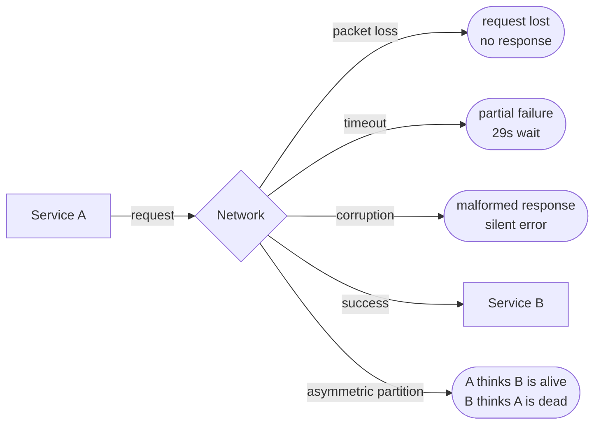
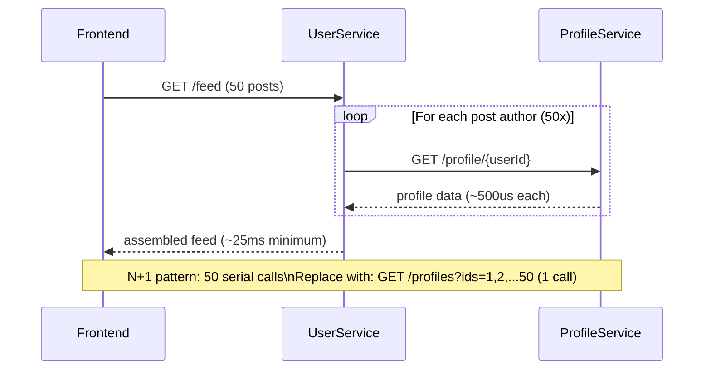
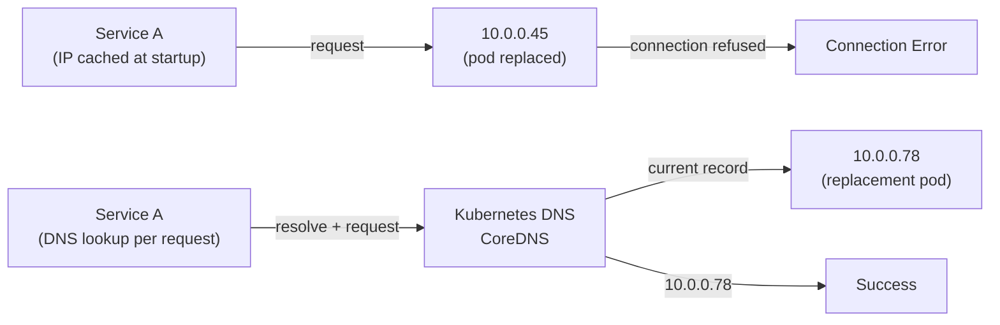
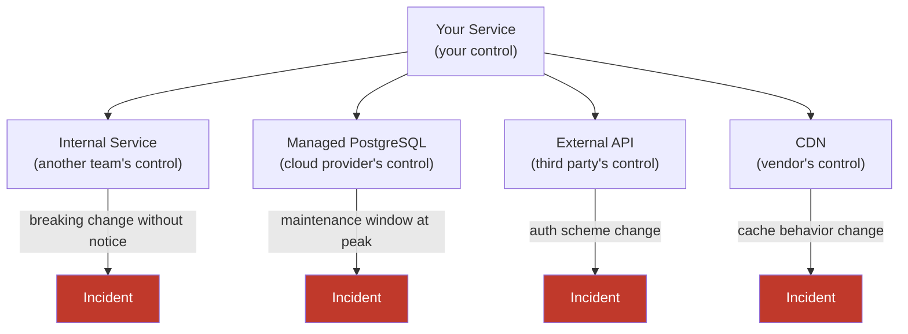

Peter Deutsch and James Gosling formalized eight assumptions that engineers new to distributed systems consistently make — assumptions that are true on a single machine and catastrophically false when a network sits between components. Originally articulated at Sun Microsystems in the 1990s, these fallacies are not a historical curiosity. They are the root cause of the majority of production incidents in distributed systems today, because the assumptions they describe are not consciously held beliefs — they are the implicit defaults in most programming languages, frameworks, and mental models inherited from single-machine development.
 
Each fallacy is a hypothesis. What follows is the empirical refutation of each, with the failure modes they produce and the engineering responses that handle the reality.
 
## Fallacy 1: The Network Is Reliable
 
No part of a distributed system is more frequently unreliable than the network, and no assumption causes more production incidents than treating it as if it were.
 
Network failures are not exceptional events requiring special code paths. They are a continuous background condition in any system of sufficient scale. The failure modes are diverse:
 
- **Packet loss** occurs on any network segment, including "reliable" cloud provider networks. A 0.01% packet loss rate means roughly 1 in 10,000 packets is dropped — catastrophic for streaming protocols that depend on ordering.
- **Intermittent connectivity** causes partial failures that are harder to handle than total failures: a request that takes 29 seconds to fail is worse than one that fails in 50 ms, because it holds threads, connections, and resources for the entire duration.
- **Asymmetric partitions** allow traffic to flow in one direction but not the other. A service can send heartbeats successfully while receiving no responses — creating conditions where it believes it is live while the rest of the cluster believes it is dead.
- **Silent data corruption** on network hardware (NIC bugs, faulty switches, bit flips in transit) causes data to arrive malformed without any indication of the error at the TCP level. Applications that do not validate checksums on data received over the network will silently operate on corrupted data.

*Four failure modes between two services: only one of five outcomes is the happy path.*
 
**The engineering response** is to treat every network call as an operation that may fail, time out, or succeed after an arbitrary delay, and to code defensively at every call site:
 
```go
func callDependency(ctx context.Context, client *http.Client, url string) (*Response, error) {
    // Always propagate context for cancellation
    req, err := http.NewRequestWithContext(ctx, http.MethodGet, url, nil)
    if err != nil {
        return nil, fmt.Errorf("building request: %w", err)
    }
 
    // Explicit timeout on every outbound call -- never rely on default (infinite)
    ctx, cancel := context.WithTimeout(ctx, 2*time.Second)
    defer cancel()
 
    resp, err := client.Do(req)
    if err != nil {
        // Distinguish timeout from other errors for circuit breaker decisions
        if errors.Is(err, context.DeadlineExceeded) {
            return nil, fmt.Errorf("dependency timeout after 2s: %w", err)
        }
        return nil, fmt.Errorf("dependency call failed: %w", err)
    }
    defer resp.Body.Close()
 
    if resp.StatusCode >= 500 {
        return nil, fmt.Errorf("dependency returned %d", resp.StatusCode)
    }
 
    // Read with limit -- never trust network-delivered size
    body, err := io.ReadAll(io.LimitReader(resp.Body, 10*1024*1024))
    if err != nil {
        return nil, fmt.Errorf("reading response: %w", err)
    }
 
    return parseResponse(body)
}
```
 
## Fallacy 2: Latency Is Zero
 
The assumption that function calls across a network have negligible cost is the single most common cause of unintentional performance degradation in service-oriented architectures.
 
A function call on a single machine completes in nanoseconds. A cross-service call over a 10 GbE network in the same datacenter completes in ~100-500 µs under light load. Under load, with queuing, that same call takes 5-50 ms. Across availability zones, 2-10 ms. Across regions, 30-300 ms. These numbers are not negotiable with better hardware; they are governed by the physics of signal propagation and OS network stack overhead.
 
The failure mode of this fallacy is **N+1 query problems** in disguise. A service that loads an entity and then makes one network call per related entity to resolve associations is the distributed equivalent of the N+1 SQL anti-pattern. A page that displays 50 user profiles, each requiring a separate lookup call, generates 50 serial or parallel network round trips — 50 × 500 µs = 25 ms minimum in the best case, and much more under any contention.
 

*The distributed N+1 pattern: 50 serial lookups where a single batched call would suffice.*
 
**The engineering response** is to design APIs that support batching, to use asynchronous parallel calls where serial is not required, and to account for network latency in every performance budget:
 
```python
from typing import List
import asyncio
import aiohttp
 
# Anti-pattern: serial calls
async def get_profiles_serial(user_ids: List[int]) -> List[dict]:
    profiles = []
    async with aiohttp.ClientSession() as session:
        for uid in user_ids:  # N network round trips
            async with session.get(f"/profile/{uid}") as resp:
                profiles.append(await resp.json())
    return profiles
 
# Correct: single batched call, or parallel if batch API unavailable
async def get_profiles_batched(user_ids: List[int]) -> List[dict]:
    async with aiohttp.ClientSession() as session:
        ids_param = ",".join(str(uid) for uid in user_ids)
        async with session.get(f"/profiles?ids={ids_param}") as resp:
            return await resp.json()  # 1 network round trip regardless of N
 
# When batching is unavailable: parallel with concurrency limit
async def get_profiles_parallel(user_ids: List[int], max_concurrent: int = 10) -> List[dict]:
    semaphore = asyncio.Semaphore(max_concurrent)
    async def fetch_one(uid: int) -> dict:
        async with semaphore:
            async with aiohttp.ClientSession() as session:
                async with session.get(f"/profile/{uid}") as resp:
                    return await resp.json()
    return await asyncio.gather(*[fetch_one(uid) for uid in user_ids])
```
 
## Fallacy 3: Bandwidth Is Infinite
 
Bandwidth constraints are subtle because modern networks provide headline throughput numbers that seem more than adequate until they are not. A 10 Gbps network link between two racks sounds unlimited for application traffic — and is, until a bulk data transfer, a log shipper, or a backup job runs concurrently and drives the link to saturation. At saturation, latency for all other traffic on the same link spikes dramatically due to queuing.
 
The bandwidth fallacy produces two specific failure modes in microservices architectures.
 
**Chatty protocols.** A service that serializes large domain objects on every call — sending the full state of a 10 KB record when only two fields changed — wastes bandwidth and serialization CPU unnecessarily. The failure mode is subtle: the service functions correctly in development where networks are unconstrained, then degrades under production load when many instances are communicating simultaneously.
 
**Unbounded response sizes.** An API that returns all records in a collection rather than paginating allows clients to inadvertently request multi-gigabyte responses. A single mis-scoped query returning a full table scan exhausts the calling service's heap and network buffer simultaneously.
 
**The engineering response** is to design for network efficiency from the start:
 
```protobuf
// gRPC/Protobuf: binary serialization, wire-efficient field encoding
// Only send changed fields -- avoid full object serialization for updates
message UserProfileUpdate {
    string user_id = 1;                    // always required
    optional string display_name = 2;      // only set if changed
    optional string avatar_url = 3;        // only set if changed
    google.protobuf.Timestamp updated_at = 4;
    // NOT: full UserProfile object with 40 fields
}
 
// Pagination is mandatory for any collection endpoint
message ListOrdersRequest {
    string customer_id = 1;
    int32 page_size = 2;       // max enforced server-side, e.g. 100
    string page_token = 3;     // cursor, not offset -- offset is O(N)
}
```
 
:::caution
Never return unbounded collections from a service endpoint. A `GET /orders` that returns all orders for a customer is a latent production incident: correct in development with 10 test records, catastrophic when a customer accumulates 50,000 orders over three years. Always enforce server-side pagination limits, regardless of what the client requests.
:::
 
## Fallacy 4: The Network Is Secure
 
Security assumptions in distributed systems operate at every layer — transport, identity, authorization, and data integrity — and failures at any layer produce consequences that are qualitatively different from a single-machine security failure, because the attack surface is the entire network fabric.
 
The threat model for a distributed system includes:
- **Eavesdropping** on unencrypted inter-service traffic (relevant inside a VPC; relevant for any shared network infrastructure)
- **Man-in-the-middle** attacks on services that do not validate TLS certificates or use self-signed certs without pinning
- **Unauthorized lateral movement** — a compromised service calling internal APIs that assume any caller within the network perimeter is trusted
- **Replay attacks** on APIs that do not include request timestamps or nonces in signatures
The specific failure mode of "the network is secure" is the **implicit internal trust boundary**: the assumption that traffic arriving from within a private network or VPC does not need to be authenticated or authorized. This is the central premise that zero-trust architecture explicitly rejects. An internal service that does not require authentication tokens on its API is one lateral movement away from full internal compromise if any perimeter component is breached.
 
**The engineering response** includes mutual TLS (mTLS) for service-to-service authentication, signed request payloads for critical operations, and authorization checks that treat identity, not network location, as the trust boundary:
 
```yaml
# Istio PeerAuthentication -- enforce mTLS for all intra-mesh traffic
apiVersion: security.istio.io/v1beta1
kind: PeerAuthentication
metadata:
  name: default
  namespace: production
spec:
  mtls:
    mode: STRICT   # PERMISSIVE during migration, STRICT in steady state
 
---
# AuthorizationPolicy -- explicit allowlist, deny by default
apiVersion: security.istio.io/v1beta1
kind: AuthorizationPolicy
metadata:
  name: order-service-authz
  namespace: production
spec:
  selector:
    matchLabels:
      app: order-service
  action: ALLOW
  rules:
    - from:
        - source:
            principals: ["cluster.local/ns/production/sa/api-gateway"]
            # Only the API gateway may call order-service directly
      to:
        - operation:
            methods: ["GET", "POST"]
            paths: ["/orders/*"]
```
 
## Fallacy 5: Topology Doesn't Change
 
The network topology a service discovers at startup will not be the topology it operates against one hour, one day, or one week later. In a Kubernetes cluster, pod IP addresses change every time a pod restarts. Cluster autoscaling adds and removes nodes. Rolling deployments cycle through IP addresses. Service mesh configurations update in real time. DNS TTLs expire and are refreshed with different addresses.
 
The failure mode of treating topology as static is **stale service discovery**: a client that resolves a service's IP at startup and caches it forever will route requests to a dead host when that host is replaced. The failure is delayed and intermittent — the service works until the cached IP becomes stale, then fails in production after running correctly for days or weeks, making it appear like a regression from an unrelated change.
 

*Static IP caching versus dynamic DNS resolution: the cached IP routes to a dead pod while the DNS-resolving client routes correctly.*
 
**The engineering response** is to never hardcode IP addresses, to honor DNS TTLs, and to use service mesh or service registry abstractions that decouple logical service identity from physical network location:
 
```go
// WRONG: resolve once at startup, cache forever
var serviceAddr = net.LookupHost("order-service.production.svc.cluster.local")
 
// CORRECT: use an HTTP client with a transport that respects DNS TTLs
// Go's net/http DefaultTransport already does this via Resolver with caching
// but explicit configuration for production:
transport := &http.Transport{
    DialContext: (&net.Dialer{
        Timeout:   5 * time.Second,
        KeepAlive: 30 * time.Second,
        // Resolver with reduced DNS cache TTL to pick up topology changes faster
    }).DialContext,
    MaxIdleConnsPerHost:   100,
    IdleConnTimeout:       90 * time.Second,
    TLSHandshakeTimeout:   10 * time.Second,
    ResponseHeaderTimeout: 10 * time.Second,
    DisableKeepAlives:     false,
}
 
client := &http.Client{Transport: transport}
// Each request naturally re-resolves via the OS resolver with TTL expiry
```
 
## Fallacy 6: There Is Only One Administrator
 
A single-machine system has a single administrative domain: one team controls the OS, the application, the configuration, and the dependencies. A distributed system deployed across cloud infrastructure, managed Kubernetes, third-party databases, external APIs, CDNs, and SaaS integrations operates under many administrative domains simultaneously — each with its own change cadence, incident response process, and operational decisions that can affect your system without notice.
 
This fallacy produces **dependency coupling failures**: a third-party API that changes its authentication scheme, a managed database provider that applies a version upgrade during your peak traffic window, a CDN that modifies caching behavior in a configuration push, or an internal team that deploys a breaking API change without coordination.
 
The engineering responses are defensive but necessary:
 
- **Versioned API contracts** with explicit deprecation policies on all service interfaces, not just external APIs. Internal breaking changes without versioning are the single most common cause of cross-team incidents in microservices organizations.
- **Consumer-driven contract testing** (Pact or similar) that validates that provider changes do not break known consumers before the change reaches production.
- **Graceful degradation** for third-party dependencies: a feature that depends on an external recommendation API should degrade to a static fallback, not return `500` to users.
- **Dependency inventories** that track which external services each internal service depends on, with explicit SLA tracking for each.

*A service with four external administrative domains: each is an independent source of failure outside your control.*
 
## Fallacy 7: Transport Cost Is Zero
 
Moving data between components in a distributed system is never free, and the costs are not limited to network bandwidth charges. Transport cost has three dimensions: **time cost** (serialization and deserialization CPU), **money cost** (egress charges, bandwidth utilization), and **complexity cost** (protocol overhead, versioning, schema evolution).
 
**Serialization cost** is frequently underestimated. JSON serialization in a high-throughput service running at 100,000 RPS, with an average payload of 2 KB, requires serializing and deserializing 200 MB/s of JSON. On a modern CPU, JSON parsing runs at roughly 200-500 MB/s — meaning JSON processing alone may consume one to two full CPU cores at this throughput. Binary formats (Protocol Buffers, MessagePack, Avro) parse at 1-5 GB/s, delivering 5-10x throughput improvement for the same CPU budget.
 
**Egress cost** is an often-overlooked architectural concern. Major cloud providers charge $0.08-$0.09 per GB for outbound data transfer. A service that replicates large objects between regions, or that returns large payloads to clients over the public internet, can generate significant egress bills that dwarf compute costs. A design decision to store data in one region and process it in another — reasonable from a compute perspective — may be economically irrational when egress costs are properly accounted for.
 
| Format | Parse speed | Size vs JSON | Versioning |
|---|---|---|---|
| JSON | 200-500 MB/s | 1× (baseline) | Human-readable, no schema enforcement |
| Protocol Buffers | 1-3 GB/s | 0.3-0.5× (significantly smaller) | Field number-based, backward compatible |
| Apache Avro | 800 MB/s - 1.5 GB/s | 0.4-0.6× | Schema registry required, rich evolution |
| MessagePack | 500 MB/s - 1 GB/s | 0.5-0.7× | No schema enforcement |
| FlatBuffers | 3-5 GB/s (zero-copy) | 0.5-1× | Zero deserialization — direct memory access |
 
**The engineering response** is to select serialization formats based on actual throughput requirements and operational constraints, not defaults:
 
```protobuf
syntax = "proto3";
package order.v1;
 
// Protocol Buffers: compact binary, schema-enforced, backward compatible
// Adding fields: use new field numbers, never reuse
// Removing fields: mark as reserved, never remove number from registry
message Order {
    string order_id = 1;
    string customer_id = 2;
    repeated OrderLineItem line_items = 3;
    OrderStatus status = 4;
    google.protobuf.Timestamp created_at = 5;
    google.protobuf.Timestamp updated_at = 6;
    // Field 7 reserved for future payment_method_id
    reserved 7;
    reserved "payment_method_id";
}
 
enum OrderStatus {
    ORDER_STATUS_UNSPECIFIED = 0;  // proto3 requires zero-value default
    ORDER_STATUS_PENDING = 1;
    ORDER_STATUS_CONFIRMED = 2;
    ORDER_STATUS_SHIPPED = 3;
    ORDER_STATUS_DELIVERED = 4;
    ORDER_STATUS_CANCELLED = 5;
}
```
 
## Fallacy 8: The Network Is Homogeneous
 
The network connecting distributed system components is not a uniform, transparent medium. It is a heterogeneous collection of hardware (switches, routers, load balancers, firewalls, NAT devices), protocols (IPv4, IPv6, VXLAN overlays, MPLS backbones), and policy enforcement points that each impose their own constraints, limitations, and behaviors — many of which are invisible to applications.
 
The practical consequences of heterogeneity:
 
**MTU mismatches.** Different network segments have different Maximum Transmission Unit (MTU) sizes. The standard Ethernet MTU is 1,500 bytes. Jumbo frames extend this to 9,000 bytes on networks that support them. VXLAN overlays add 50-54 bytes of encapsulation overhead, reducing the effective MTU available to applications. A packet larger than the path MTU is either fragmented (adding latency and fragmentation reassembly cost) or dropped (causing mysterious connectivity failures that are not retried correctly by all protocol implementations). gRPC connections that send large frames across network segments with VXLAN overlay will silently fail to connect if the MTU is not correctly configured end-to-end.
 
**Middlebox interference.** Stateful firewalls, NAT devices, and load balancers maintain connection state tables with idle timeout policies. A TCP connection that is idle for longer than the middlebox's timeout (commonly 60-300 seconds) has its state silently dropped. The next packet on that connection causes a TCP RST from the middlebox — a failure that looks to the application like an unexpected connection reset, not a timeout. This is why database connection pools must configure `keepalive` settings shorter than the shortest middlebox timeout in the path.
 
**IPv4 vs. IPv6 dual-stack behavior.** Applications and libraries that handle IPv6 incorrectly — binding only to IPv4, assuming IPv4 address format in string parsing, failing to handle IPv6 address literals in URLs (`http://[::1]:8080/`) — produce failures that are topology-dependent: they work in IPv4-only environments and fail silently or cryptically in dual-stack environments.
 
:::tip
Always configure TCP `keepalive` on database connections and long-lived HTTP/2 connections. The standard recommendation is `keepalive_time = 60s`, `keepalive_interval = 10s`, `keepalive_probes = 6`. This ensures the OS sends keepalive probes every 60 seconds of idle time, detecting dead connections and preventing middlebox state table expiry from silently orphaning connections.
 
```go
import "net"
 
dialer := &net.Dialer{
    KeepAlive: 30 * time.Second, // Send keepalive probes after 30s idle
    Timeout:   5 * time.Second,
}
// All connections created with this dialer will have TCP keepalive enabled
```
:::
 
**The engineering response** to network heterogeneity is to never assume that a protocol that works in your development environment will behave identically in production, and to validate network behavior across all path segments:
 
```shell
# Discover path MTU to a target -- critical for diagnosing fragmentation issues
tracepath -n 10.0.0.1
 
# Test specific MTU with no-fragment bit set
ping -M do -s 1400 10.0.0.1   # Linux
ping -D -s 1400 10.0.0.1      # macOS
 
# Check for TCP keepalive on existing connections
ss -tnp | grep ESTABLISHED
 
# Validate that TCP keepalive is actually configured on a socket
ss -tnop state established | grep timer
```
 
## The Compounding Effect: When Multiple Fallacies Interact
 
In production incidents, these fallacies rarely appear in isolation. The most severe outages combine multiple false assumptions simultaneously.
 
A representative cascade:
1. **Topology changes** (Fallacy 5): A Kubernetes rolling deployment cycles pod IPs.
2. **Network reliability failure** (Fallacy 1): A brief network partition isolates a subset of new pods.
3. **Zero-latency assumption** (Fallacy 2): Services make synchronous N+1 calls to the newly cycled pods, each waiting for the full timeout.
4. **Thread pool exhaustion**: Waiting threads consume all available connections to the partitioned pods.
5. **Infinite bandwidth assumption** (Fallacy 3): Retry storms send amplified traffic to the recovering nodes.
6. **Single administrator assumption** (Fallacy 6): The Kubernetes upgrade that triggered the deployment was applied by the platform team without coordinating with the application team's high-traffic window.
The postmortem for this incident will correctly identify each of these as a contributing factor. The prevention is not fixing each fallacy in isolation — it is designing systems that make the correct assumption from the start: **networks fail, have non-zero latency, finite bandwidth, require authentication, change topology, have multiple administrative domains, non-zero transport cost, and non-uniform behavior**. Every component that crosses a network boundary is interacting with an environment governed by these physical and operational realities, and the architecture must reflect them.
 
See [Network Reliability, Bandwidth Limitations, and Topology Changes](/distributed-systems/en/foundations/monoliths-to-distributed/network-reliability/) for a deeper analysis of how these properties manifest in specific network failure scenarios.
See [Failure Models](/distributed-systems/en/foundations/system-models/failure-models/) for the formal taxonomy of how network fallacies translate into crash-stop, omission, and Byzantine failure modes.