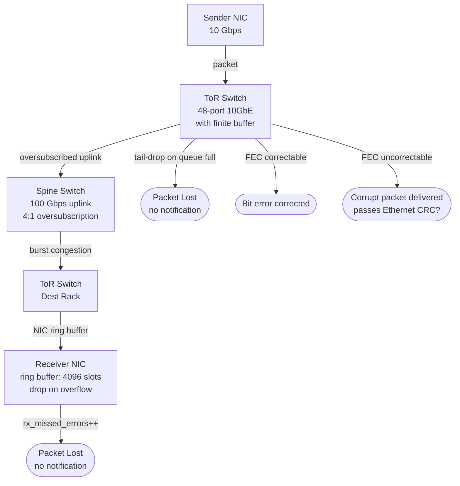
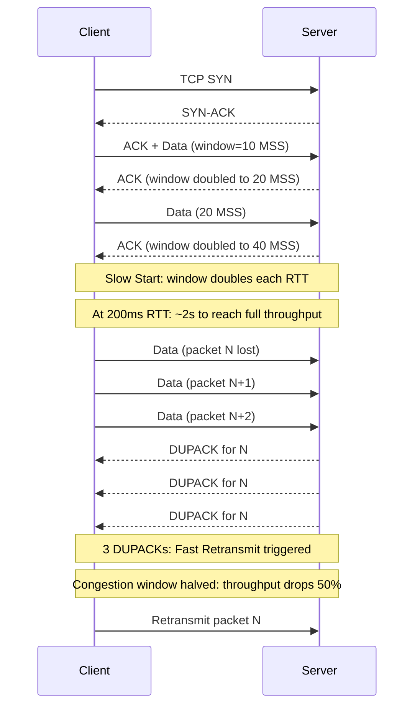
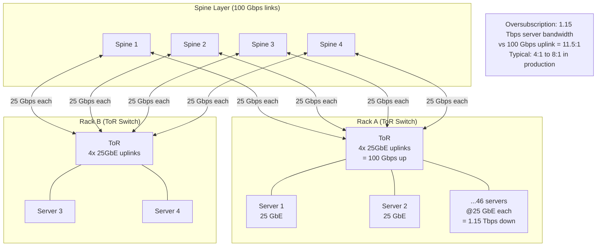
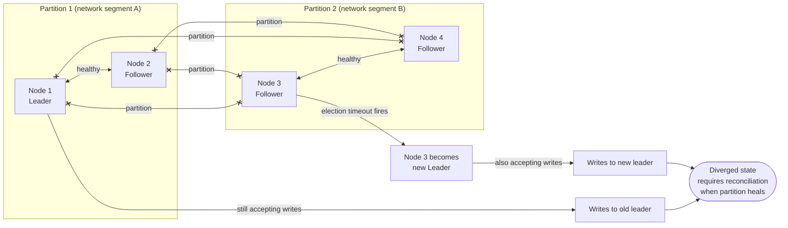
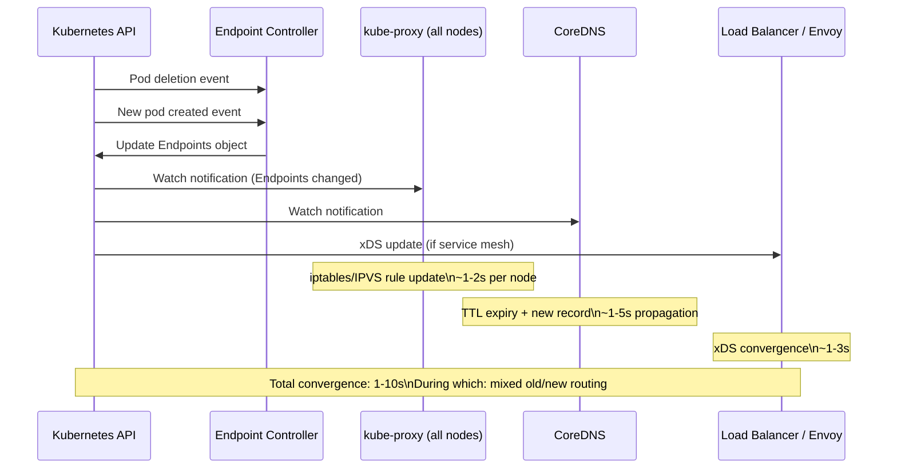
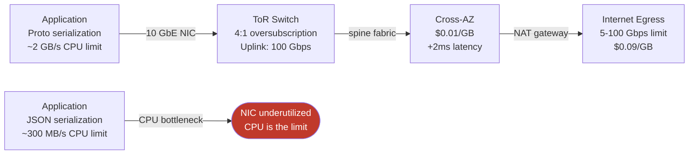

Network reliability is not a binary property. A network is not "up" or "down" — it operates on a continuous spectrum of partial degradation: packets are delayed, reordered, duplicated, and silently dropped at rates that vary by path, load, hardware health, and time of day. Distributed systems that treat the network as either fully functional or completely absent fail in production because the worst failures are not total — they are partial, intermittent, and often invisible to the applications experiencing them.
 
Understanding the network requires understanding it at three levels simultaneously: the physical layer (cables, switches, NICs), the protocol layer (TCP congestion control, retransmission, head-of-line blocking), and the topology layer (how components are connected and how those connections change over time). Failures at each layer have distinct signatures and require distinct responses.
 
## The Physical Layer: Where Packets Actually Die
 
Packet loss begins at hardware. The mechanisms are mundane but the consequences for distributed systems are severe.
 
**NIC ring buffer overflow.** A Network Interface Card maintains a fixed-size ring buffer in host memory for received packets. When the kernel's interrupt handler cannot drain this buffer fast enough — during CPU saturation, high-interrupt-rate events, or NUMA-local memory contention — the buffer overflows and incoming packets are silently dropped. The NIC increments a hardware counter (`rx_missed_errors`, visible via `ethtool -S <interface>`), but no ICMP error is generated, no TCP notification is sent, and the application has no direct visibility into the loss.
 
**Switch buffer congestion.** Network switches have finite input and output queues. When traffic arrives faster than it can be forwarded — due to an oversubscribed uplink, a traffic burst, or a slow consumer on the egress port — the queue fills and tail-drop discards additional packets. Modern switches use WRED (Weighted Random Early Detection) to discard packets probabilistically before queues fill, preferring to drop individual TCP flows early rather than causing global TCP synchronization collapse when all queues fill simultaneously.
 
**Physical media errors.** Fiber optic transceivers degrade over time, producing elevated bit error rates before complete failure. A transceiver operating at 10⁻⁹ BER (one bit error per billion transmitted bits) on a 10 Gbps link produces approximately 10 errors per second — low enough to be corrected by FEC (Forward Error Correction) at the physical layer, but degrading enough that TCP retransmissions become noticeable. The signature in the application layer is elevated p99 latency with no apparent cause in application metrics.
 
**Silent data corruption.** Network hardware, particularly at high line rates, occasionally delivers packets with corrupted content that passes the Ethernet CRC check. This occurs due to bit flips in switch ASICs, DRAM bit errors in packet buffers, and transient electrical interference. TCP checksums are 16-bit and do not provide cryptographic integrity — they catch most but not all corruption. Applications that require data integrity over unreliable network paths must implement application-layer checksums (CRC32, xxHash) on payload content independent of transport-layer guarantees.
 

*Four loss and corruption points across a two-hop datacenter path: none of them generate ICMP errors visible to the application.*
 
## TCP Under Stress: What the Protocol Does When the Network Fails
 
TCP's reliability mechanisms — retransmission, flow control, congestion control — are designed for a world where packet loss is the primary congestion signal. Understanding what these mechanisms do under realistic network stress is prerequisite knowledge for designing distributed systems that behave predictably under load.
 
### Congestion Control and Its Failure Modes
 
TCP congestion control assumes that packet loss is caused by congestion, not by random physical errors. When a loss is detected (via duplicate ACKs or RTO expiry), TCP cuts its congestion window, reducing throughput. On high-quality datacenter networks where random loss rates are low, this assumption is reasonable. On WAN paths with higher natural loss rates, or on heavily loaded datacenter networks, TCP may misinterpret physical-layer errors as congestion, causing unnecessary throughput reduction.
 
**TCP Slow Start** begins every new connection at a congestion window of 1-10 MSS (Maximum Segment Size, typically 1,460 bytes) and doubles it every RTT until it reaches the slow-start threshold. For a connection with 1 ms RTT and 10 MSS initial window, reaching 1 MB/s throughput requires approximately 8-10 RTTs, or about 10 ms. On a 200 ms cross-region RTT, reaching the same throughput requires 8-10 RTTs × 200 ms = 1.6-2 seconds. This is why short-lived HTTP connections over high-latency paths perform poorly for large transfers — TCP spends most of the connection's lifetime in slow start.
 
**TCP Head-of-Line Blocking.** TCP delivers data in order. A single lost packet causes all subsequent data in the receive buffer to be held until the lost packet is retransmitted and received. On a 10 ms RTT connection with a 1% loss rate, a 1 MB transfer that triggers one retransmission experiences a ~10 ms stall for a ~10 MB/s nominal throughput stream — negligible in isolation but catastrophic when multiplied across many concurrent streams on a busy node.
 
HTTP/2 multiplexes many logical streams over a single TCP connection. A single packet loss triggers TCP's head-of-line blocking for all multiplexed streams simultaneously — a problem HTTP/2 was supposed to solve but instead moved to a lower layer. HTTP/3 over QUIC eliminates this by implementing per-stream reliability directly in UDP, so a loss on one stream does not stall others.
 

*TCP slow start and congestion response: window growth is exponential during slow start; loss causes an immediate 50% throughput reduction.*
 
### TCP Timeout vs. RST: Different Failure Signatures
 
Applications experience TCP failures in two qualitatively different ways, and confusing them leads to incorrect retry strategies.
 
**TCP RST (connection reset):** The remote peer or a middlebox actively terminates the connection by sending a RST segment. This is an immediate signal — the application receives an error synchronously. Common causes: the remote process crashed and the OS sent RST on cleanup; a firewall or NAT device timed out the connection state and sent RST when the next packet arrived; a load balancer removed the backend and rejected the connection.
 
**TCP timeout:** No RST is received. The sending side retransmits multiple times according to its retransmission timer schedule (approximately 1s, 2s, 4s, 8s, 16s in standard exponential backoff), then declares the connection dead after the retransmission limit is reached. On Linux, the default `tcp_retries2` is 15, which can cause TCP to attempt retransmission for up to ~924 seconds before giving up. Applications that rely on OS-level TCP timeouts for failure detection will hold threads and connections for this entire duration.
 
:::danger
Never rely on the OS TCP timeout for distributed system failure detection. Set explicit application-level timeouts on every network call. The OS may spend up to 15 minutes retransmitting before declaring a connection dead. At the application level, a 2-30 second timeout is the maximum acceptable window for any synchronous service call, depending on the SLO requirements of the calling service.
:::
 
The correct failure detection strategy is: application-level timeout (2-30s) → circuit breaker opens after threshold failures → health checks detect and remove unhealthy instances → DNS or service registry propagates updated routing.
 
## Bandwidth: The Topology of Constraints
 
Bandwidth in datacenter and cloud environments is not uniform. Available bandwidth between any two components depends on the path between them, the oversubscription ratios at each hop, and the current utilization on shared links.
 
### Datacenter Network Topology
 
Modern datacenter networks follow a **Clos (fat-tree) topology**: multiple layers of switches with full-mesh interconnection between adjacent layers. The design goal is **bisectional bandwidth** — the total bandwidth available across any partition of the network into two halves should equal the aggregate input bandwidth. A perfect fat-tree achieves 1:1 oversubscription.
 
In practice, datacenters accept oversubscription at the ToR (Top-of-Rack) to spine layer in exchange for lower hardware cost. A 4:1 oversubscription means four times more bandwidth is available from servers to the ToR switch than the ToR has in uplink capacity to the spine. Under typical traffic patterns (bursty, not all-active simultaneously), this is acceptable. When all servers in a rack simultaneously send large transfers — during Spark shuffle phases, database backup jobs, or bulk data migrations — the oversubscribed uplink becomes the bottleneck and all traffic on that rack suffers.
 

*Leaf-spine topology with oversubscription: server-to-ToR bandwidth exceeds ToR-to-spine uplink capacity, creating a contention point under heavy intra-rack-to-external traffic.*
 
### Cloud Network Topology and Its Implications
 
Cloud providers abstract physical network topology behind virtual network primitives (VPC, subnet, security group), but the underlying physics remain. Several constraints are operationally relevant.
 
**Same-instance bandwidth is finite.** Cloud instances have per-instance network bandwidth limits that scale with instance size. A `c6i.large` (2 vCPU) provides up to 12.5 Gbps network bandwidth; a `c6i.32xlarge` (128 vCPU) provides up to 50 Gbps. The "up to" qualifier is significant: baseline bandwidth is a fraction of the peak, and network-intensive workloads on small instances encounter the limit more quickly than CPU metrics suggest.
 
**Same-AZ traffic is free and fast.** Cross-AZ traffic costs money ($0.01-$0.02/GB between AZs on major providers) and adds 1-3 ms latency. This pricing structure creates a subtle architectural bias: systems designed primarily to minimize cost tend to co-locate everything in one AZ, creating a hidden availability risk where a single AZ outage takes down the entire system.
 
**Placement groups reduce inter-node latency.** AWS Cluster Placement Groups, GCP Compact Placement Policies, and similar constructs guarantee that instances are placed on the same physical rack or within the same low-latency network cluster. For latency-sensitive distributed systems (Kafka clusters, distributed databases, consensus-heavy workloads), placement groups reduce inter-node RTT from ~500 µs to ~100 µs — a 5x latency improvement that meaningfully affects quorum write performance.
 
:::tip
For any distributed system that performs synchronous replication or consensus — Kafka, Zookeeper, etcd, Cassandra, Redis Cluster — use placement groups or equivalent co-location constructs to minimize inter-node latency. A Raft cluster where followers are 500 µs from the leader has a minimum write latency of 1 ms (one round trip). The same cluster with 100 µs inter-node latency achieves 200 µs write latency — a 5x improvement in the critical path.
:::
 
## Network Partitions: Characteristics and Detection
 
A **network partition** is a condition where some nodes in a distributed system can communicate with each other but not with other nodes. This is distinct from a total network failure — in a partition, nodes are alive and processing, just unable to reach each other across the partition boundary.
 
Partitions are particularly insidious because:
 
1. **Nodes inside each partition continue operating.** They do not know they are partitioned — they only know that they cannot reach some other nodes. A partition is indistinguishable from a crashed peer until timing and metadata allow differentiation.
2. **Partitions are asymmetric.** Node A may be able to send messages to Node B but not receive them (one-way partition). This creates states where A believes B is alive (it gets no connection error when sending) but B cannot inform A of anything.
3. **Partitions heal.** Unlike crashes, partitions resolve when connectivity is restored. When a partition heals, both sides may have diverged in state — each having accepted writes that the other has not seen. This divergence must be reconciled, and the reconciliation strategy (last-write-wins, vector clock merge, user-resolution) is the defining property of the system's consistency model.

*Split-brain during a network partition: both partitions elect leaders and accept writes, creating divergent state that must be reconciled.*
 
**Partition detection time** is the most operationally significant variable. A system detects a partition when heartbeats from a peer stop arriving for longer than the configured failure detection timeout. Shorter timeouts detect partitions faster but increase the false-positive rate — transient network hiccups trigger leader elections and reconfiguration events unnecessarily. Longer timeouts reduce false positives but increase the window during which a partitioned system operates in a potentially inconsistent state.
 
The Phi Accrual Failure Detector (used by Akka and Cassandra) addresses this trade-off by computing a failure probability rather than a binary timeout: φ increases continuously as the interval since the last heartbeat grows, allowing the application to choose its own acceptable false-positive threshold rather than committing to a fixed timeout.
 
## Topology Changes: Operational Sources and Their Blast Radius
 
Network topology changes during normal operations are not exceptional events — they are routine in any dynamically managed infrastructure.
 
### Kubernetes Pod Lifecycle and IP Churn
 
Every Kubernetes pod receives a unique IP address that is allocated at pod creation and released at pod deletion. Any operation that replaces a pod — rolling deployment, autoscaling, health check failure and restart, node drain for maintenance, eviction due to resource pressure — changes the IP address associated with that service instance.
 
The rate of IP churn in a production Kubernetes cluster is higher than most engineers expect. A cluster running 500 services with rolling deployments every 2 hours per service generates approximately 250 pod IP changes per hour — over 6,000 per day. Each change requires:
 
1. The Endpoints object for the service to be updated by the Endpoint Controller
2. `kube-proxy` on all relevant nodes to update iptables or IPVS rules
3. The Envoy sidecar in each pod (if using Istio/Linkerd) to receive updated cluster configuration via xDS
4. DNS records for headless services to be updated in CoreDNS
The propagation delay from pod creation to full routing convergence is typically 1-5 seconds in a healthy cluster and can extend to 30-60 seconds under load or during control plane stress. During this window, some requests will be routed to the old (terminating) pod and others to the new pod, producing a mixture of success and failure responses that is visible as elevated error rates in metrics.
 

*Routing convergence during a Kubernetes pod replacement: multiple independent propagation paths must all converge before routing is fully correct.*
 
### BGP Reconvergence in Cloud Environments
 
Cloud providers use BGP (Border Gateway Protocol) internally for routing between availability zones and regions, and for routing between provider infrastructure and customer resources. BGP reconvergence after a topology change — link failure, route withdrawal, or router restart — takes time, and during reconvergence traffic may be blackholed, misrouted, or experience elevated loss.
 
The 2017 Google global outage and the 2021 Facebook/Instagram/WhatsApp outage were both caused by BGP route withdrawals that propagated globally, making entire portions of the internet unreachable. These events are extreme examples of the same mechanism that causes intermittent cross-AZ or cross-region connectivity issues on smaller scales in production systems daily.
 
For distributed systems, the operational implication is that **cross-AZ and cross-region network links should be treated with the same skepticism as any other unreliable dependency**. A circuit breaker that monitors failure rates on cross-AZ traffic and opens when error rates exceed a threshold is not paranoid engineering — it is the correct response to the actual reliability characteristics of these links.
 
### Link Aggregation and ECMP Failover
 
High-availability network configurations use **ECMP (Equal Cost Multi-Path)** routing to spread traffic across multiple redundant links. When one link in an ECMP group fails, the hash function used to distribute flows must be recomputed, and existing TCP connections may be rehashed to different paths. This does not break TCP connections (the new path reaches the same destination), but it does cause a brief interruption while the new path is established and any per-path state (QoS markings, firewall state, NAT translations) is re-created.
 
In practice, ECMP failover appears in application metrics as a brief (~100ms-1s) spike in latency and error rate affecting a fraction of connections — exactly the kind of transient failure that a properly configured retry strategy with exponential backoff handles correctly, but that a fixed-timeout-without-retry strategy converts into a user-visible error.
 
## Bandwidth Limitations in Practice: Four Bottleneck Archetypes
 
Bandwidth limitations manifest differently depending on where in the network path the bottleneck sits.
 
**Intra-host bottleneck (CPU-bound serialization).** The bottleneck is not the NIC but the application's ability to produce or consume data fast enough to saturate the NIC. JSON serialization at ~300 MB/s cannot saturate a 10 GbE NIC; Protobuf at ~2 GB/s can. For CPU-bound serialization workloads, switching to a more efficient format is more effective than increasing network bandwidth.
 
**Intra-rack bottleneck (ToR oversubscription).** All-to-all communication patterns within a Kubernetes cluster — typical during MapReduce shuffle, distributed sort, or Kafka consumer group rebalancing — saturate the ToR uplink when aggregate inter-rack traffic exceeds uplink capacity. The fix is rack-aware scheduling: place communicating processes on the same rack (or same AZ) to keep traffic local wherever possible.
 
**Inter-AZ bottleneck (metered, latency-penalized).** Designs that place frequently-communicating services in different AZs for availability reasons pay both latency (1-3ms) and bandwidth cost ($0.01-0.02/GB). The architectural response is to co-locate services that communicate frequently while distributing services that handle user-facing requests across AZs for availability.
 
**Egress bottleneck (internet-bound traffic).** Outbound traffic to the internet or to external APIs passes through NAT gateways, internet gateways, or direct-connect endpoints, each with bandwidth limits. A service that regularly transfers large objects to external parties or serves large downloads to end users must account for the upstream bandwidth limit of these gateways — limits that are often much lower than internal network bandwidth.
 

*Bandwidth bottleneck progression: CPU-bound serialization limits NIC utilization; oversubscribed ToR limits cross-rack throughput; egress gateway limits external transfer.*
 
## Designing for Network Reality
 
The operational response to network unreliability, limited bandwidth, and topology change is not to build systems that assume reliable networks — it is to build systems whose behavior is correct and bounded under all realistic failure conditions.
 
**Timeouts at every layer.** Every network call at the application layer must have an explicit timeout. Every connection pool must have an idle connection timeout shorter than the shortest middlebox timeout in the path (typically 30-60 seconds for cloud load balancers). Every health check must have a distinct failure threshold and recovery threshold.
 
**Retry with bounded amplification.** Retries are necessary for transient failures, but unbounded retries convert transient failures into sustained overload. Retry logic must include: exponential backoff with full jitter, a maximum retry count, a deadline that prevents retrying beyond the caller's timeout, and idempotency keys on mutating operations so that duplicated retries are safe.
 
```go
func retryWithBackoff(ctx context.Context, maxAttempts int, fn func() error) error {
    var lastErr error
    for attempt := 0; attempt < maxAttempts; attempt++ {
        if err := ctx.Err(); err != nil {
            return fmt.Errorf("context cancelled before attempt %d: %w", attempt, err)
        }
 
        lastErr = fn()
        if lastErr == nil {
            return nil
        }
 
        if !isRetryable(lastErr) {
            return lastErr // Fast fail non-transient errors
        }
 
        if attempt == maxAttempts-1 {
            break
        }
 
        // Full jitter: sleep = random(0, min(cap, base * 2^attempt))
        cap := 30 * time.Second
        base := 100 * time.Millisecond
        maxWait := min(cap, base * time.Duration(1<<attempt))
        jitter := time.Duration(rand.Int63n(int64(maxWait)))
 
        select {
        case <-time.After(jitter):
        case <-ctx.Done():
            return fmt.Errorf("context cancelled during backoff: %w", ctx.Err())
        }
    }
    return fmt.Errorf("all %d attempts failed, last error: %w", maxAttempts, lastErr)
}
```
 
**Traffic shaping and priority queues.** When bandwidth is limited and multiple traffic types share a link, traffic shaping (token bucket rate limiters at the application level, QoS markings at the network level) prevents bulk transfers from starving latency-sensitive traffic. Kafka replication traffic, backup jobs, and log shipping should be explicitly rate-limited so that user-facing API traffic retains its bandwidth allocation under load.
 
**Topology-aware scheduling.** For workloads with significant inter-node communication, scheduling decisions should account for network topology. Kubernetes `topologySpreadConstraints` distribute pods across failure domains. Kafka partition assignment should place replicas in different racks or AZs. Cassandra's `NetworkTopologyStrategy` replication strategy distributes replicas across defined data centers explicitly.
 
```yaml
# Kubernetes: spread pods across availability zones
# Ensures a single AZ failure loses at most 1/N of the replicas
apiVersion: apps/v1
kind: Deployment
spec:
  template:
    spec:
      topologySpreadConstraints:
        - maxSkew: 1                          # At most 1 pod more in one zone than another
          topologyKey: topology.kubernetes.io/zone
          whenUnsatisfiable: DoNotSchedule    # Prefer availability over scheduling speed
          labelSelector:
            matchLabels:
              app: order-service
```
 
See [The 8 Fallacies of Distributed Computing](/distributed-systems/en/foundations/monoliths-to-distributed/eight-fallacies/) for the behavioral implications of the assumptions this page refutes at the implementation level.
See [Failure Models](/distributed-systems/en/foundations/system-models/failure-models/) for how network failures translate into the formal failure model taxonomy used in distributed algorithms.
See [Failure Propagation: Cascading Failure Analysis](/distributed-systems/en/foundations/system-models/cascading-failure/) for how the network degradation modes described here propagate into application-level outages.