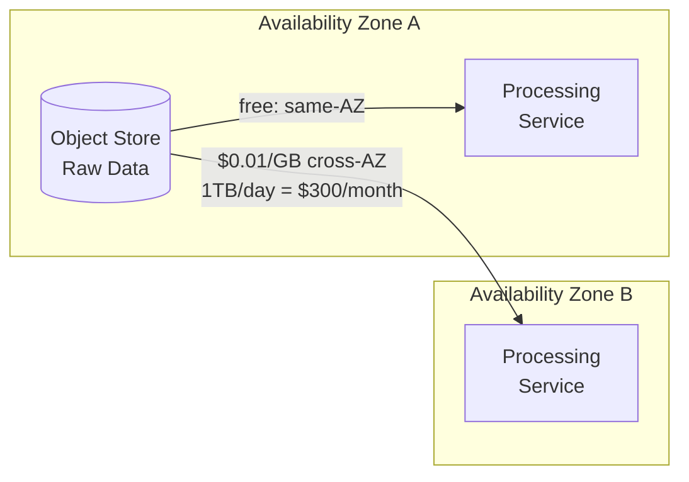
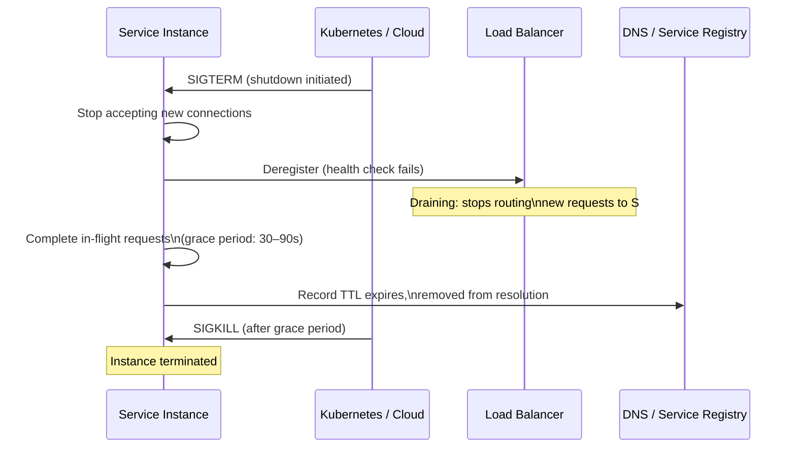
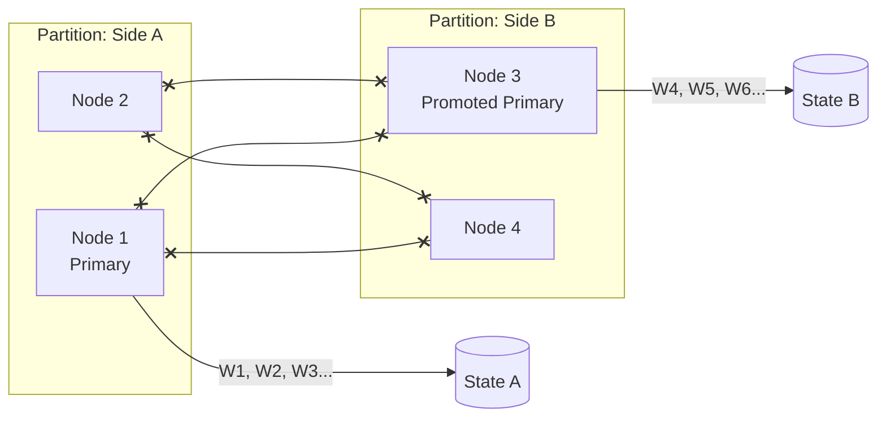

The network is not a wire. It is a stack of abstractions — physical media, switching silicon, firmware, kernel TCP/IP implementation, and userspace socket API — each with its own failure modes, each hiding the failures of the layer beneath it from the layer above. Understanding where these failures originate determines whether you design a system that survives them or one that collapses in unexpected ways the first time the network behaves like a network.

## The TCP Illusion and What Lies Beneath It

**TCP** presents a reliable, ordered, byte-stream abstraction to applications. It does this by hiding packet loss, reordering, duplication, and corruption behind retransmission, sequence numbers, and checksums. This abstraction is enormously useful and also dangerous, because it trains engineers to think of network communication as fundamentally reliable when the underlying physical reality is anything but.

What TCP does *not* hide:

- **Connection failure** — TCP cannot retransmit across a broken connection. When a path fails during a long-lived connection, the connection must be torn down and re-established. Applications that hold connections open indefinitely without keepalive probes will not discover the failure until they attempt to send data — which may be hours later for idle connections.
- **Latency variance** — TCP retransmission adds latency proportional to RTT × the number of retransmits. A packet lost once adds one RTT of latency. The initial retransmission timeout (RTO) is typically 200ms–1000ms, meaning a single loss event can add hundreds of milliseconds to a request that otherwise takes 0.5ms. This is the mechanism behind tail latency spikes that correlate with nothing obvious in application metrics.
- **Receive buffer pressure** — when a receiver is slower than a sender, the receive buffer fills. TCP signals this via a shrinking window advertisement. The sender slows proportionally. Applications that do not drain the receive buffer fast enough — typically because they are blocked on processing the previous message — create **head-of-line blocking** within a single connection.
- **TIME_WAIT accumulation** — after a connection closes, the socket remains in `TIME_WAIT` state for 2×MSL (Maximum Segment Lifetime, typically 60–120 seconds) to absorb late-arriving packets from the closed session. Under high connection churn (short-lived HTTP/1.1 connections, for example), `TIME_WAIT` sockets can exhaust the local port range (65,535 ports minus reserved range), causing new connection failures with `EADDRINUSE` or `ECONNREFUSED` that look like application failures.
```shell
# Observe TCP connection state distribution on a production host
ss -s

# Example output showing TIME_WAIT accumulation under high churn:
# Total: 142308
# TCP:   98442 (estab 1204, closed 94108, orphaned 0, timewait 94108)
# ...
# timewait: 94108  ← 94k sockets in TIME_WAIT; port exhaustion risk

# Tune kernel to recycle TIME_WAIT sockets faster (Linux)
sysctl -w net.ipv4.tcp_tw_reuse=1
sysctl -w net.ipv4.tcp_fin_timeout=15  # reduce from default 60s
```

:::caution
`net.ipv4.tcp_tw_recycle` was a common recommendation for TIME_WAIT exhaustion but was removed in Linux 4.12 because it caused connection failures for clients behind NAT. Use `tcp_tw_reuse` instead, which is safe for outbound connections. If TIME_WAIT exhaustion persists, the correct architectural fix is connection pooling to avoid high connection churn in the first place.
:::

## Packet Loss: Causes, Rates, and Asymmetric Impact

Packet loss is not rare in production networks. Its sources are categorized by mechanism:

**Congestion loss** occurs when a switch or router's output queue fills faster than it can be drained. The queue drops tail packets. This is the intended TCP congestion signal — senders detect loss and reduce transmission rate. In a well-designed network, congestion loss is brief and self-correcting. In a poorly provisioned or misconfigured network, sustained congestion loss raises effective latency by 1–4 RTTs per lost packet and reduces throughput toward zero for long-lived flows.

**Corruption loss** occurs when a packet's checksum fails verification, typically due to failing hardware — degraded fiber, a faulty NIC, or a switch port with electromagnetic interference. Corruption loss produces a distinctive pattern: it is deterministic (the same path fails repeatedly), affects all flows using that path, and does not respond to TCP's congestion window backoff. If a service's p99 latency is consistently elevated on connections through a specific switch, corruption loss on that path is the most likely cause.

**Policy loss** occurs when a firewall, security group, or network ACL silently drops packets that do not match a permit rule. Unlike congestion or corruption, policy loss is completely silent from the sender's perspective. The TCP connection handshake appears to succeed (or does not — depending on whether the SYN is dropped), and then the connection hangs indefinitely. This is frequently confused with application-layer slowness.

**Loss rates in cloud environments** are low but not zero. AWS's intra-AZ network targets sub-0.01% packet loss under normal conditions. Cross-AZ loss rates are higher and more variable. During maintenance events, BGP reconvergence, or hardware replacement, loss rates can spike to 1–5% for seconds to minutes. For a 10,000-byte payload fragmented into seven packets, a 1% per-packet loss rate produces a 7% chance the full payload requires at least one retransmit.

The asymmetric impact of loss on application protocols:

```
At 0% loss:     request latency = network RTT + processing time
At 0.1% loss:   ~0.1% of requests add 1 RTO (200ms–1000ms) to latency
At 1% loss:     long TCP flows see throughput degradation proportional to
                1 / (RTT × √loss_rate) — Mathis formula
At 5% loss:     effective throughput for a 10 Gbps link drops to
                ~500 Mbps for a single large flow; p99 latency becomes
                dominated by retransmit timeouts, not propagation delay
```

The engineering responses are: keep request payloads small (avoid fragmentation), use HTTP/2 or gRPC which multiplex over fewer connections (reducing the probability that a given connection experiences loss), implement retries at the application layer with idempotency guarantees, and set RTO floors that match your SLO (default 200ms RTO minimum in Linux is often too conservative for intra-AZ traffic).

## Bandwidth: The Actual Constraint Is Not What You Think

Cloud instance network bandwidth is specified as a burst-capable ceiling (`up to 25 Gbps`) with a baseline that is typically 30–50% of the peak. Sustained transmission at peak for more than 5–30 minutes triggers throttling that reduces throughput to the baseline. This behavior is documented inconsistently by providers and produces confusion when batch data transfer jobs run fine for the first few minutes and then mysteriously slow down.

More practically, bandwidth constraints manifest at the **flow level**, not the instance level. A single TCP connection cannot fill a 25 Gbps NIC because TCP's congestion window growth is bounded by the BDP (Bandwidth-Delay Product):

```
BDP = bandwidth × RTT
For a 10 Gbps link with 0.3ms intra-AZ RTT:
BDP = 10 Gbps × 0.0003s = 375 KB

A single TCP connection's maximum inflight data = one BDP = 375 KB
To fill 10 Gbps, you need: 10 Gbps / (375 KB / 0.3ms) = ~1 connection
(in theory; in practice, TCP slow start and buffer tuning affect this)

For a 10 Gbps link with 80ms cross-region RTT:
BDP = 10 Gbps × 0.08s = 100 MB

A single TCP connection needs a 100 MB congestion window to saturate
this link — far above default socket buffer sizes (typically 4–8 MB)
```

This means cross-region or cross-continent links are **chronically underutilized by default** unless socket buffers are explicitly tuned or multiple parallel connections are used. A replication job between two regions that saturates the link locally but runs at 5% utilization remotely is a buffer size problem, not a bandwidth problem.

```shell
# Check and tune TCP socket buffer sizes for high-BDP paths
sysctl net.ipv4.tcp_rmem   # current: min default max (bytes)
sysctl net.ipv4.tcp_wmem

# For a 10 Gbps link with 80ms RTT: BDP = 100 MB
# Set max buffer to 2× BDP to allow headroom
sysctl -w net.ipv4.tcp_rmem="4096 131072 209715200"   # max 200 MB
sysctl -w net.ipv4.tcp_wmem="4096 131072 209715200"
sysctl -w net.core.rmem_max=209715200
sysctl -w net.core.wmem_max=209715200

# Enable TCP BBR congestion control (Linux 4.9+): better throughput
# under loss and long-fat-network paths than CUBIC
sysctl -w net.ipv4.tcp_congestion_control=bbr
```

**Egress billing asymmetry** is a bandwidth constraint of an entirely different kind. Cloud providers charge for outbound (egress) traffic at $0.01–$0.09/GB depending on destination. Inbound (ingress) is free. Same-region traffic between services is typically free or near-free. Cross-AZ traffic is charged ($0.01/GB on AWS). Internet egress is the most expensive tier.

The practical consequence is that data gravity — moving computation to the data rather than data to the computation — is not just a performance principle; it is an economics principle. A service that streams 1 TB/day of raw data to another AZ for processing pays roughly $300/month in cross-AZ transfer fees, while a service that performs the computation in the same AZ as the data pays nothing. At 10 TB/day the differential is $3,000/month — enough to justify a significant architectural investment.


*Data gravity economics: compute colocated with storage pays zero transfer cost; compute in a different AZ accrues ongoing egress charges proportional to data volume.*

## Topology Changes: What Moves and Why

A production distributed system's network topology is continuously mutating. The sources of change are predictable even when their timing is not:

**Auto-scaling events.** A load spike triggers the addition of new instances. Each new instance receives an IP address from the subnet pool. The load balancer registers the new instance after health checks pass — typically 30–90 seconds after the scaling event fires. During that window, existing instances absorb the additional load. If the scaling trigger threshold is set too high (CPU > 80% for 5 minutes), the lag between load increase and new capacity means existing instances operate above capacity for minutes before relief arrives.

**Rolling deployments.** A deployment replaces instances one by one (or N at a time). At any moment during a rolling deployment, the fleet is running two versions of the software. Requests may be routed to either version. If the new version changes an API response schema in a non-backward-compatible way, in-flight requests from clients that have already cached the old schema format will fail. This is why backward-compatible schema evolution is a deployment requirement, not a courtesy.

**Spot instance and preemptible VM reclamation.** Cloud providers give 2-minute (AWS spot) or 30-second (GCP preemptible) interruption notices before forcibly terminating spot/preemptible instances. A stateful service on a spot instance with a 30-second checkpoint interval and a 2-minute interruption window can drain state gracefully. A stateless service needs to complete or reject in-flight requests within the notice period. Services that do not handle the termination signal (`SIGTERM` on Linux) will have their connections closed ungracefully, causing TCP RST to in-flight callers.

**BGP reconvergence.** In multi-region or hybrid cloud deployments, route changes are propagated via BGP. A failed link or a manually updated route table triggers BGP reconvergence, during which traffic may follow a suboptimal or incorrect path for seconds to minutes. TCP connections that were established before the route change may continue on the old path (if it still exists) or experience retransmission timeouts until the connection is re-established on the new path.

**DNS TTL and caching.** Service discovery via DNS is only as fresh as the TTL on the records. A default TTL of 300 seconds means that a newly unhealthy instance remains in DNS-resolved addresses for up to 5 minutes. Clients that cache DNS responses beyond the TTL (aggressive JVM DNS caching is a well-known example) extend this window further.


*Graceful shutdown sequence. Each step has a timing dependency; if the load balancer deregistration lags behind SIGTERM, new requests arrive at an instance that has already stopped serving.*

## Graceful Shutdown and Connection Draining

Topology changes cause connection failures when services are terminated without draining in-flight requests. The graceful shutdown sequence must account for the latency between when a signal is sent and when traffic stops arriving:

```go
func main() {
    srv := &http.Server{
        Addr:    ":8080",
        Handler: router,
    }

    // Start server in background
    go func() {
        if err := srv.ListenAndServe(); err != http.ErrServerClosed {
            log.Fatalf("server error: %v", err)
        }
    }()

    // Wait for termination signal
    quit := make(chan os.Signal, 1)
    signal.Notify(quit, syscall.SIGTERM, syscall.SIGINT)
    <-quit

    // Phase 1: stop accepting new connections immediately
    // Phase 2: wait for load balancer to stop routing (typically 15–30s)
    // Phase 3: drain in-flight requests with a deadline
    log.Println("shutdown initiated — draining connections")

    // Give the load balancer time to deregister this instance
    // before we start refusing new connections
    time.Sleep(15 * time.Second)

    ctx, cancel := context.WithTimeout(context.Background(), 30*time.Second)
    defer cancel()

    if err := srv.Shutdown(ctx); err != nil {
        log.Fatalf("forced shutdown: %v", err)
    }

    log.Println("shutdown complete")
}
```

The 15-second sleep before `srv.Shutdown` is not incidental. It accounts for the gap between the process receiving `SIGTERM` and the load balancer completing deregistration. Without it, the load balancer continues routing new requests to the instance during shutdown, and those requests receive connection refused errors.

:::tip
Kubernetes `terminationGracePeriodSeconds` and the `preStop` hook exist precisely to manage this gap. Set `terminationGracePeriodSeconds` to at least the sum of: load balancer deregistration latency + maximum in-flight request duration. A value of 60–90 seconds is appropriate for most HTTP services; services with long-running streaming connections or jobs need longer. If the grace period is too short, Kubernetes sends SIGKILL before drain completes.
:::

## Network Partitions: The Failure the CAP Theorem Is Actually About

A **network partition** is a failure where some nodes in a distributed system can communicate with each other but not with other nodes — not because those nodes have crashed, but because the network path between them is broken. All nodes are running and healthy from their own perspective. They have simply lost the ability to coordinate.

Partitions are distinct from node failures in a critical way: during a partition, both sides of the partition may continue operating independently, producing divergent state that must be reconciled when the partition heals. A database with a primary in `us-east-1a` and a replica in `us-east-1b` that experiences an AZ partition will see the primary continue accepting writes. When the partition heals, the replica must replay all writes it missed — and if the replica was promoted to primary during the partition (because it looked like the original primary had crashed), both sides have independent write histories that must be merged or discarded.


*A network partition produces two independent primaries (split-brain), each accepting writes. On partition heal, states A and B diverge and cannot be merged without application-specific conflict resolution.*

This is the **split-brain** scenario. It is addressed by consensus algorithms (Raft, Paxos) that require a quorum of nodes to agree before committing a write. With a quorum requirement, a minority partition cannot accept writes — it stalls rather than diverge. The cost is availability: the minority side is unavailable for writes until the partition heals. This is the CP choice in CAP. The AP choice is to allow both sides to continue writing and resolve conflicts later — which requires application-level conflict resolution logic (CRDTs, last-write-wins, or manual review).

See [CAP Theorem: CP vs. AP Systems](/distributed-systems/en/data-management/consistency-models/cap-theorem/) for the formal treatment of this trade-off.

## Observing Network Health in Production

Network failures manifest as application symptoms — timeout errors, increased p99 latency, connection pool exhaustion — without obvious correlation to a network cause unless the right metrics are instrumented.

```shell
# Per-interface packet loss and error rates (Linux)
ip -s link show eth0
# rx/tx errors, drops, overruns indicate NIC or buffer pressure

# TCP retransmission rate: high values indicate packet loss
netstat -s | grep -i retransmit
# or with ss:
ss -ti | grep retrans

# Track retransmission rate over time with a metric exporter
# node_exporter exposes:
# node_netstat_TcpExt_TCPRetransFail
# node_netstat_Tcp_RetransSegs

# DNS resolution latency: high values indicate topology churn or TTL problems
dig +stats api.internal.example.com
# Look for: Query time in msec

# Connection pool health: exhaustion appears as queue depth and wait time
# Application-specific, but for Go's net/http:
# expvar: http.client.transport.idle_conns, wait_duration
```

The signals that point to network layer problems rather than application layer problems:

- **Timeout errors without elevated CPU or memory on the target service** — the target is healthy but unreachable; suspect partition or routing failure
- **Increased p99 latency with flat p50** — retransmission events (loss-correlated) or queue buildup at a specific switch
- **Correlated failures across services with no shared code path** — shared network path; suspect the common network segment
- **Failures that resolve on connection teardown and reconnect** — stale connection through a failed NAT mapping or load balancer instance
- **Port exhaustion errors (`ECONNREFUSED`, `EADDRINUSE`)** — connection churn without pooling; TIME_WAIT accumulation
:::note
Cloud provider network dashboards and VPC flow logs provide aggregate visibility but not packet-level detail. For path-level diagnosis, `traceroute` (with ICMP or TCP probes), `mtr` (continuous traceroute with loss statistics per hop), and `tcpdump` on both sender and receiver are the ground-truth tools. VPC flow logs show connection-level metadata; they do not show retransmissions, window scaling, or congestion events, which require kernel-level metrics or packet capture.
:::

The network is not a passive conduit that either works or does not. It is an active participant in every distributed operation — introducing latency variance, dropping packets, fragmenting payloads, changing paths mid-connection, and failing in ways that are invisible to the layers above it until the cumulative effect surfaces as application-level symptoms. Building distributed systems that are resilient to the network's actual behavior — not the idealized model — requires understanding these mechanisms at the level where they originate.