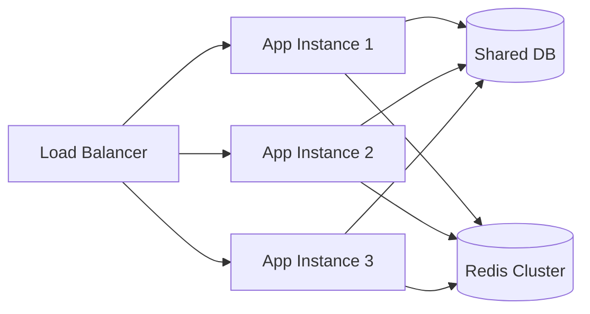
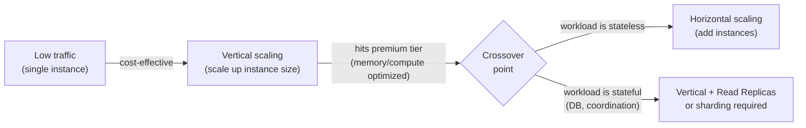

Scaling is not a choice between two equally valid options. It is a sequence of decisions made under constraints — hardware ceilings, budget curves, latency budgets, and the irreversible architectural commitments that each path demands.
 
## Vertical Scaling: Physics as the Ceiling
 
**Vertical scaling** (scale-up) means adding resources to a single machine: more CPU cores, more RAM, faster NVMe storage, higher-bandwidth NICs. For a long time, this was the default answer to capacity problems because it required zero changes to application code.
 
The economics made sense when Moore's Law held. From 1970 to roughly 2005, transistor density doubled every ~18 months, which meant that waiting 18 months and buying a new server was often cheaper than re-architecting software. That era is over.
 
Modern high-core-count servers expose a fundamental hardware constraint: **NUMA (Non-Uniform Memory Access)**. When a CPU socket needs to access memory physically attached to a different socket, the latency penalty is 2-4× compared to local memory access. A 128-core server is not a 128-core homogeneous machine — it is two or four NUMA nodes connected by an inter-socket interconnect (Intel UPI, AMD Infinity Fabric). Code that is not NUMA-aware — which includes most off-the-shelf databases — experiences contention and unpredictable latency under high core counts.
 
```shell
# Inspect NUMA topology on a Linux host
numactl --hardware
 
# Output on a dual-socket 64-core server:
# available: 2 nodes (0-1)
# node 0 cpus: 0-31 63-95
# node 0 size: 128795 MB
# node 1 cpus: 32-62 96-127
# node 1 size: 129024 MB
# node distances:
# node   0   1
#   0:  10  21    ← cross-socket access is 2.1× more expensive
#   1:  21  10
```
 
Beyond NUMA, there is the **memory bus saturation** problem. A 96-core server with DDR5 memory typically has 8-12 memory channels. At full utilization, those channels saturate before the CPUs do. At that point, adding more CPU cores produces zero throughput improvement — you have bought expensive silicon that spends most of its time stalled waiting for memory.
 
The hard ceiling is the largest instance a cloud provider sells. As of 2024, that is roughly 448 vCPUs and 24 TB RAM on AWS (`u-24tb1.112xlarge`). When you hit it, you have no vertical headroom left — and you have likely already been paying a significant per-unit premium to be near that ceiling for months.
 
:::caution
Vertical scaling masks architectural problems. A monolith that requires a 48xlarge instance to handle load is a monolith with serious coupling problems that a bigger machine will not fix — it will merely delay the conversation at 10× the cost.
:::
 
## Horizontal Scaling: Complexity as the Tax
 
**Horizontal scaling** (scale-out) distributes load across multiple commodity machines. The economics are compelling: two servers at half the cost of one large server, with the additional benefit of redundancy. The catch is that your application must be designed to support it.
 
The core requirement is **statelessness**. If a service stores session state, in-progress computation state, or cache state locally on the instance, then any request routed to a different instance fails or returns stale data. This forces all durable state out of the application tier and into a shared layer — databases, distributed caches, object stores — which then become the bottleneck and consistency point.
 

*Stateless application tier horizontally scaled behind a load balancer. All persistent state lives in shared infrastructure, which becomes the coordination bottleneck.*
 
Horizontal scaling introduces problems that simply do not exist in a single-process model:
 
- **Partial failures.** One instance can die while others continue serving traffic. A caller cannot distinguish between a slow node and a failed node without timeouts, which must be tuned against your latency SLO.
- **Clock skew.** Two instances will not have perfectly synchronized clocks. Operations that depend on wall-clock ordering (e.g., "last write wins" conflict resolution) become unreliable without deliberate clock synchronization strategies.
- **Network latency.** A function call that takes nanoseconds in a monolith now crosses a network with ~0.5ms median latency in a well-provisioned data center, and potentially orders of magnitude higher under packet loss or TCP retransmission.
- **Distributed coordination.** Any operation that requires atomicity across multiple instances — distributed locks, distributed transactions — requires coordination protocols (2PC, Raft-based consensus) that are expensive and carry their own failure modes.
See [The 8 Fallacies of Distributed Computing](/distributed-systems/en/foundations/monoliths-to-distributed/eight-fallacies/) for the full taxonomy of assumptions that horizontal scaling invalidates.
 
## Cost-Performance Curves: Where Each Strategy Breaks Down
 
The practical decision between vertical and horizontal is not philosophical — it is a function of where you are on each strategy's cost curve.
 
| Dimension | Vertical Scaling | Horizontal Scaling | When to prefer vertical |
|---|---|---|---|
| **Unit cost at low scale** | Low | Higher (orchestration overhead) | Workloads under ~10k req/s |
| **Unit cost at high scale** | Superlinear (premium tier pricing) | Near-linear | Almost never at high scale |
| **Operational complexity** | Low | High (service discovery, load balancing, distributed state) | Teams without platform engineering capacity |
| **Failure blast radius** | Single point of failure | Partial failure possible | When downtime is acceptable |
| **Latency** | Nanosecond inter-process comms | Sub-millisecond to millisecond network hops | Latency-critical, lock-heavy workloads |
| **Stateful workloads** | No coordination required | Requires external state management | When state cannot be externalized |
| **Elasticity** | Manual, requires instance replacement | Automated, sub-minute provisioning | When demand is predictable |
 
The cost crossover point sits roughly where vertical scaling moves you from a general-purpose instance to a memory-optimized or compute-optimized tier. At that point, you are paying a 20-40% premium per unit of resource. That is usually the signal to invest in horizontal architecture.
 

*Cost-driven decision path. The crossover point triggers architectural investment, not a hardware upgrade.*
 
## Stateful Services: The Constraint That Changes Everything
 
Stateless services scale horizontally without coordination. Stateful services — databases, consensus participants, workflow engines, session stores — resist horizontal scaling because distributing state introduces consistency problems.
 
A PostgreSQL primary can be scaled vertically almost indefinitely. When vertical limits are reached, horizontal options are constrained:
 
- **Read replicas** offload read traffic but do not help write throughput and introduce replication lag.
- **Sharding** distributes write load but requires a routing layer, eliminates cross-shard transactions, and complicates schema migrations.
- **Multi-primary replication** (e.g., Galera, CockroachDB, Spanner) distributes writes but introduces synchronous cross-node coordination on every write, which adds latency proportional to inter-node round-trip time.
This is the core reason why most production architectures use **vertical scaling for the data tier** far longer than for the application tier. The operational and consistency cost of distributing state is frequently higher than the hardware cost of a larger database server.
 
:::tip
Before concluding that your database needs horizontal scaling, profile the workload. In the majority of cases, the bottleneck is a missing index, an N+1 query pattern, a missing cache layer, or connection pool exhaustion — not raw CPU or memory capacity. Fixing those is always cheaper than sharding.
:::
 
## The Auto-Scaling Boundary Problem
 
Cloud auto-scaling (AWS Auto Scaling Groups, Kubernetes HPA) operates on horizontal scaling. It provisions new instances in response to CPU, memory, or custom metrics. The latency between a scaling trigger and a new instance serving traffic is typically 60-180 seconds, which covers gradual load increases but not sudden traffic spikes.
 
The **cold start problem** compounds this: a new instance must fetch secrets, warm up connection pools, populate local caches, and complete health check registration before it can serve traffic. For JVM-based services, JIT compilation adds another 30-120 seconds of degraded throughput before the application reaches peak performance.
 
Vertical scaling has no cold start problem. When a workload has spiky, unpredictable traffic patterns and a cold start that takes longer than the spike duration, vertical scaling may be the operationally correct choice even if it appears wasteful at steady state.
 
:::danger
Auto-scaling based on CPU utilization alone is a footgun for latency-sensitive services. A service can have 20% CPU utilization while being completely I/O-bound on database connections, at which point adding instances increases connection pool pressure without improving throughput. Always instrument and alert on the actual bottleneck resource, not a proxy metric.
:::
 
## The Hybrid Reality
 
Production systems rarely choose one strategy exclusively. The canonical pattern is:
 
- **Application tier:** Horizontal, stateless, auto-scaled. Instances are ephemeral and replaceable.
- **Cache tier:** Horizontally partitioned (Redis Cluster, Memcached consistent hashing), vertically sized per node to minimize eviction rates.
- **Database primary:** Vertically scaled as long as economically viable, with read replicas for read offload.
- **Analytical / OLAP workloads:** Horizontally scaled across many small nodes (Spark, Presto, BigQuery Capacitor) because the embarrassingly parallel nature of analytical queries maps cleanly to horizontal architecture.
The engineering cost of horizontal scaling is not a reason to avoid it — at sufficient scale it becomes unavoidable. The discipline is recognizing which tier is actually bottlenecked, what the true cost of each scaling strategy is at that tier, and whether you are solving a scaling problem or a code quality problem.