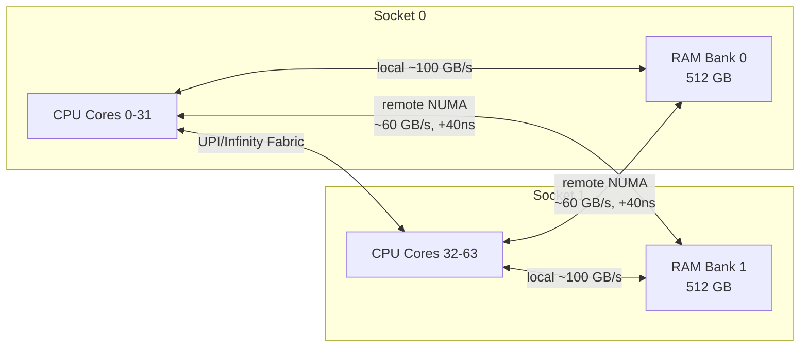
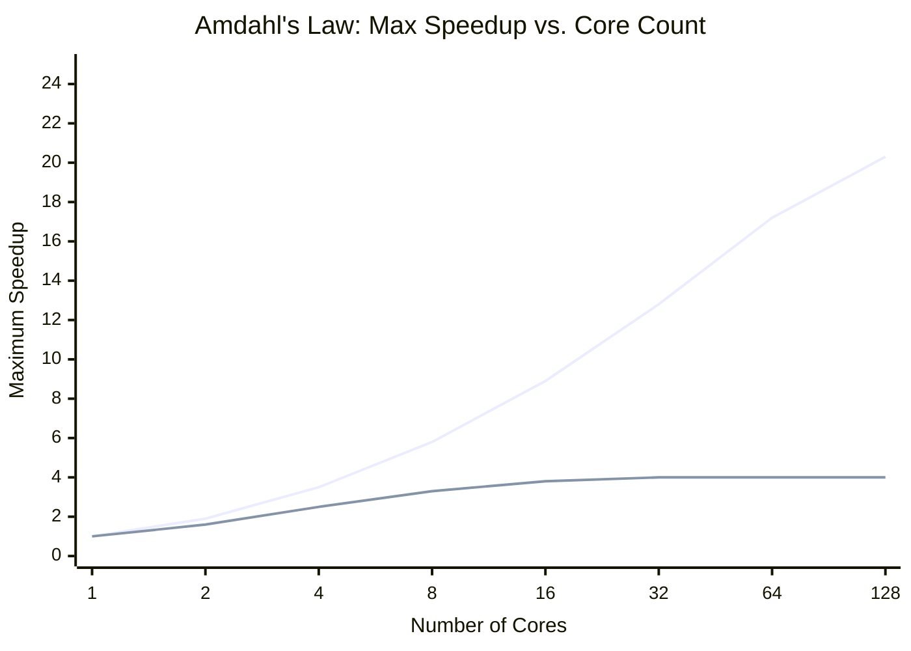
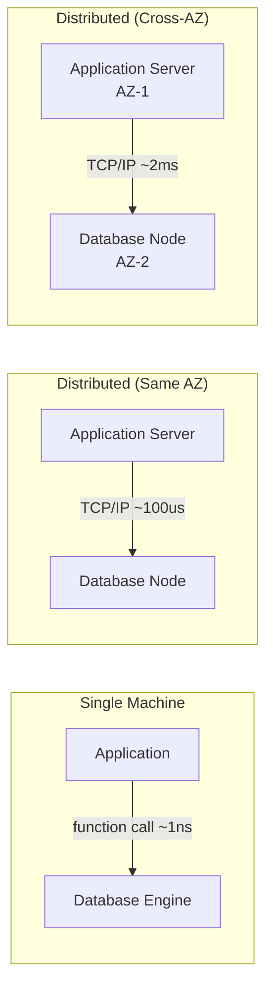

Every system eventually hits a wall. Traffic grows, data volumes accumulate, or latency requirements tighten beyond what the current hardware configuration can deliver. The response to that wall defines the entire downstream architecture: either add more capability to existing machines (**vertical scaling**, scale-up) or add more machines (**horizontal scaling**, scale-out). The choice is not aesthetic — it is determined by physics, economics, and the nature of the workload. Getting it wrong early means carrying the wrong assumptions into every subsequent architectural decision.
 
## Vertical Scaling: The Physics of a Single Machine
 
Vertical scaling means replacing or upgrading a machine with one that has more CPUs, more RAM, faster storage, or higher network bandwidth. For stateful systems — databases, caches, message brokers — this is often the path of least resistance because no application code changes, no distribution logic is required, and the consistency model remains trivially simple.
 
The appeal is real, but it runs directly into several hard physical limits.
 
### NUMA Topology and Memory Bandwidth
 
Modern multi-socket servers do not have uniform memory access. In a **Non-Uniform Memory Access (NUMA)** architecture, each CPU socket has its own local memory bank. A CPU accessing its local memory achieves full bandwidth (typically 100-200 GB/s on current Xeon or EPYC hardware). The same CPU accessing memory attached to a *remote* socket crosses the NUMA interconnect — Intel's UPI (Ultra Path Interconnect) or AMD's Infinity Fabric — and pays a latency penalty of 30-100 ns and a bandwidth penalty of 30-50% compared to local access.
 

*Two-socket NUMA topology: remote memory access pays a bandwidth and latency penalty through the inter-socket interconnect.*
 
This matters operationally. A PostgreSQL instance on a 2-socket server with 96 cores will not linearly scale read throughput as you add cores, because cache-line transfers between sockets become a bottleneck. Database buffer pools that span NUMA boundaries cause frequent remote memory accesses. The Linux kernel's NUMA balancing heuristics mitigate but do not eliminate this, and they introduce their own CPU overhead through page migration.
 
Scaling to 4-socket and 8-socket machines amplifies this: every additional socket adds another hop on the NUMA mesh, and the coherency traffic required to keep CPU caches consistent across sockets grows with the square of socket count. This is why 4-socket and 8-socket machines have historically been the domain of in-memory databases (SAP HANA, VoltDB) willing to pay enormous per-core licensing costs to exploit the raw memory capacity.
 
### Amdahl's Law: The Ceiling on Parallelism
 
**Amdahl's Law** establishes the theoretical maximum speedup from adding CPU cores when a portion of the workload is inherently sequential:
 
```
Speedup(N) = 1 / (S + (1 - S) / N)
```
 
Where `S` is the fraction of the program that is strictly serial and `N` is the number of processors. As `N` approaches infinity, the maximum speedup approaches `1/S`.
 
The implication is brutal: a workload with just 5% serial code cannot be sped up by more than 20x, no matter how many cores you add. A workload with 20% serial code is capped at 5x. In practice, "serial" includes lock contention, single-threaded I/O paths, sequential log writes, and any coordination point that serializes concurrent operations.
 

*Upper line: 1% serial fraction (approaches 100x cap). Lower line: 20% serial fraction (hard cap at 5x). Real workloads sit somewhere between these curves.*
 
### The Universal Scalability Law
 
Neil Gunther's **Universal Scalability Law (USL)** extends Amdahl's Law by adding a second penalty term for **coherency** — the overhead of keeping shared state consistent across multiple concurrent actors:
 
```
C(N) = N / (1 + α(N - 1) + βN(N - 1))
```
 
Where `α` is the contention parameter (serialization), `β` is the coherency parameter (crosstalk), and `N` is the number of concurrent workers. The coherency term `β` is quadratic in `N`, which means USL predicts that throughput can actually *decrease* as you add more concurrency, once coherency overhead dominates.
 
This is not theoretical. PostgreSQL's throughput on a single instance plateaus and then decreases past a certain connection count because lock manager overhead and shared buffer cache coherency both have `β > 0`. Connection poolers like PgBouncer exist specifically to cap `N` below the USL coherency cliff. Redis is single-threaded for the same reason: eliminating `β` entirely by serializing all operations yields better throughput than a multi-threaded design with non-zero `β`.
 
:::tip
Measuring your workload's `α` and `β` parameters requires load testing with varying concurrency levels and fitting the USL curve to the data. Tools like `usl4j` (Java) or the R `usl` package automate the regression. If your throughput curve turns over and descends past a concurrency level you regularly reach in production, you have a coherency problem that more hardware will not fix.
:::
 
### The Cost Curve Is Non-Linear
 
Cloud instance pricing for vertical scaling is not linear. Moving from a 4-core to an 8-core instance doubles compute but roughly doubles price. Moving from a 96-core general-purpose instance to a 192-core high-memory instance can cost 4-6x more for 2x the core count, because the larger SKUs are less commoditized and carry a significant premium.
 
The most expensive part of vertical scaling is the top end: the last doubling of capacity frequently costs 3-5x more than the previous doubling. There is a price/performance cliff around 48-64 vCPU instances on most cloud providers where general-purpose instances give way to memory-optimized or compute-optimized SKUs at premium prices. Bare-metal equivalents (required for NUMA-sensitive workloads) add another 40-80% premium on top.
 
There is also a **single point of failure** cost that no pricing spreadsheet captures: a single large machine is a single failure domain. When it crashes, everything on it is unavailable. Hardware RAID, redundant power supplies, and hot-standby replicas reduce but do not eliminate this risk.
 
## Horizontal Scaling: The Physics of a Distributed System
 
Horizontal scaling adds more machines and distributes the workload across them. It eliminates the single-point-of-failure problem, can scale to effectively arbitrary throughput, and uses commodity hardware at the cheap end of the price/performance curve. It introduces an entirely different category of problems in exchange.
 
### The Network Is Now the Bottleneck
 
On a single machine, inter-component communication is in-process function calls operating at ~1 ns. Horizontal scaling replaces those calls with network round trips. A same-rack round trip on a 10 GbE network is ~100 µs under unloaded conditions. Cross-AZ traffic within a cloud region adds 1-3 ms. Cross-region adds 30-300 ms depending on geography.
 
These numbers dominate the performance profile of distributed systems. A single database query that takes 1 ms on local hardware takes 3-5 ms in a distributed configuration that requires network coordination, simply due to the latency of the round trips. Any operation that requires multiple sequential round trips — and most non-trivial database operations do — pays this cost multiplicatively.
 

*Latency increase from intra-process to intra-AZ to cross-AZ communication: five orders of magnitude.*
 
### State Is the Enemy of Horizontal Scale
 
**Stateless** components scale horizontally without coordination: add more instances behind a load balancer, and throughput increases linearly (modulo shared downstream dependencies). Any instance can handle any request. This is why HTTP application servers, API gateways, and compute workers scale horizontally so easily.
 
**Stateful** components require that related requests reach the same instance, or that state be synchronized across instances. Both paths impose coordination overhead. Synchronizing state requires consensus protocols, replication lag management, and conflict resolution strategies. Sticky routing requires session affinity at the load balancer, which breaks when instances fail.
 
The fundamental tension: **horizontal scaling of stateful systems is always a distributed systems problem**. It requires explicit decisions about consistency (what happens when two replicas disagree?), availability (what happens during a network partition?), and partition tolerance (how is state divided?). These are not engineering details — they are the defining characteristics of every distributed database, cache, and message broker ever built.
 
:::caution
"Just add more nodes" applied to a stateful service without rearchitecting the state management layer does not produce linear scale. It typically produces a distributed monolith: the operational complexity of a distributed system with the scaling properties of a single machine, because all nodes still serialize through a shared database.
:::
 
### Coordination Overhead Grows With Node Count
 
Every node added to a distributed system increases the communication overhead for operations that require coordination — leader election, distributed locking, quorum writes, two-phase commit, and gossip-based membership protocols. The worst case is O(N²) message complexity (all-to-all coordination), which is why large-scale systems use gossip protocols (O(N log N)) or hierarchical coordination (O(log N)) rather than full mesh coordination.
 
This is the distributed systems equivalent of the USL coherency penalty: adding more nodes to a system with high coordination requirements eventually causes throughput to plateau or decrease. The Raft consensus algorithm, for example, requires a quorum of (N/2 + 1) nodes to acknowledge each write; as N grows, write latency increases because you must wait for more ACKs to arrive over the network.
 
## The Scaling Decision Matrix
 
Neither approach dominates in all scenarios. The decision is driven by workload characteristics, operational constraints, and cost tolerance.
 
| Dimension | Vertical Scaling | Horizontal Scaling |
|---|---|---|
| **Complexity to implement** | Low — no code changes | High — requires stateless or distributed state design |
| **Maximum throughput ceiling** | Hard physical limit (~192 cores, ~24 TB RAM on current hardware) | Effectively unbounded with correct sharding |
| **Latency profile** | Low — in-process communication | Higher — network round trips add ~100 µs to ms per hop |
| **Failure blast radius** | Total — single machine failure is total outage | Partial — N-1 machines survive any single node failure |
| **Cost curve** | Linear to superlinear — premium for large SKUs | Linear — commodity hardware at consistent price/performance |
| **State management** | Trivial — no distribution required | Complex — requires explicit consistency model |
| **Operational overhead** | Low — one machine to manage | High — service discovery, health checking, distributed config |
| **Suitable workloads** | Latency-sensitive, stateful, low-to-medium throughput | High-throughput, embarrassingly parallel, read-heavy with caching |
 
## The Pragmatic Path: Scale Up First, Then Scale Out
 
In practice, the most operationally sound strategy for early-stage systems is to scale vertically until the cost or physical limit forces a horizontal redesign. A well-configured single PostgreSQL server on a 32-core, 256 GB RAM machine with NVMe SSDs handles workloads that would surprise most engineers who have never measured it: 10,000-50,000 queries per second on a properly indexed read-heavy workload, with sub-millisecond 99th-percentile latency.
 
The forcing function for horizontal scaling is not "big company uses microservices, therefore I should too." It is one or more concrete constraints:
 
- **Throughput exceeds what a single machine can sustain**, even with all reasonable vertical options exhausted.
- **Fault tolerance requirements** are incompatible with a single point of failure — an SLA that mandates 99.99% availability requires at least N+1 redundancy, which requires horizontal distribution.
- **Geographic distribution** is required — users in multiple continents need sub-100ms latency, which no single datacenter can provide.
- **Data volume exceeds single-machine storage** — active datasets larger than ~40 TB on a single NVMe-backed instance exceed practical vertical limits.
- **Regulatory requirements** mandate data residency in specific jurisdictions, forcing geographic distribution.
The mistake is making the horizontal scaling decision speculatively, before any of these constraints are real. A system designed for horizontal scale from day one carries all the distributed systems complexity — coordination protocols, eventual consistency handling, partial failure management — during the phase when development speed matters most and traffic is lowest.
 
:::note
The "diagonal" scaling pattern — scale up individual nodes while also scaling out the number of nodes — is used by systems like Kafka and Cassandra. Each broker/node is large (32-64 cores, high RAM, NVMe storage) to maximize single-node throughput and minimize coordination overhead, while the cluster as a whole scales horizontally by adding more such nodes. This approach gets the most out of both strategies.
:::
 
## Failure Modes Specific to Each Strategy
 
**Vertical scaling failure modes:**
- **Single-point-of-failure outage:** The machine crashes, the entire service is unavailable until it restarts or a standby is promoted. For database primaries, cold restart time can be minutes to hours on large instances due to InnoDB/PostgreSQL crash recovery and buffer pool warming.
- **Resource saturation with no incremental relief:** When a vertical-scaled system reaches its capacity limit, there is no "add one more unit of capacity" option short of a full hardware upgrade, which typically requires maintenance downtime.
- **NUMA-induced performance cliffs:** A workload that accidentally crosses NUMA boundaries can experience sudden performance degradation that looks like a software bug but is a hardware topology issue, diagnosable only with `numastat` and NUMA-aware profiling.
**Horizontal scaling failure modes:**
- **Partial failure states:** N nodes can be in N different states simultaneously — some up, some down, some partitioned, some returning stale data. Handling partial failures correctly is the fundamental engineering challenge of distributed systems.
- **Thundering herd on node recovery:** When a node rejoins the cluster, other nodes may immediately attempt to synchronize state, transferring large amounts of data simultaneously. This can saturate network bandwidth and cause cascading load on the recovering node.
- **Coordinator bottlenecks:** Any operation that requires centralized coordination (distributed locking, global sequence generation, single-leader writes) creates a bottleneck that does not scale horizontally. Systems designed with the assumption of "just add more nodes" often contain hidden coordinator singletons that become the actual scaling limit.
- **Split-brain on network partition:** If a network partition isolates a subset of nodes, those nodes may continue accepting writes, creating divergent state that must be reconciled or discarded when the partition heals.
See [Failure Models](/distributed-systems/en/foundations/system-models/failure-models/) for a systematic taxonomy of distributed system failure modes.
See [The 8 Fallacies of Distributed Computing](/distributed-systems/en/foundations/monoliths-to-distributed/eight-fallacies/) for the assumptions that break when moving from vertical to horizontal scale.