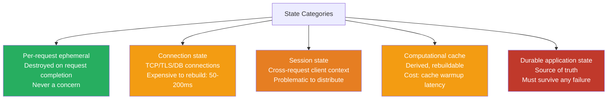
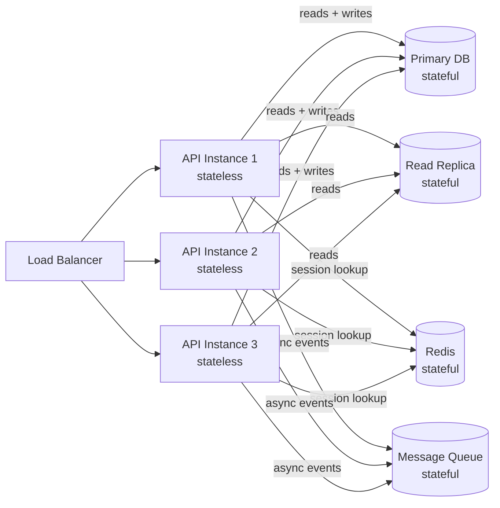
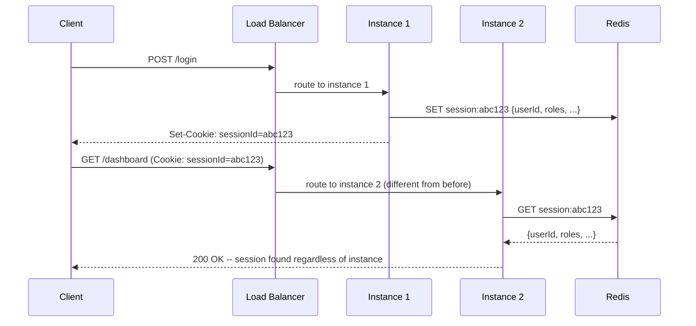
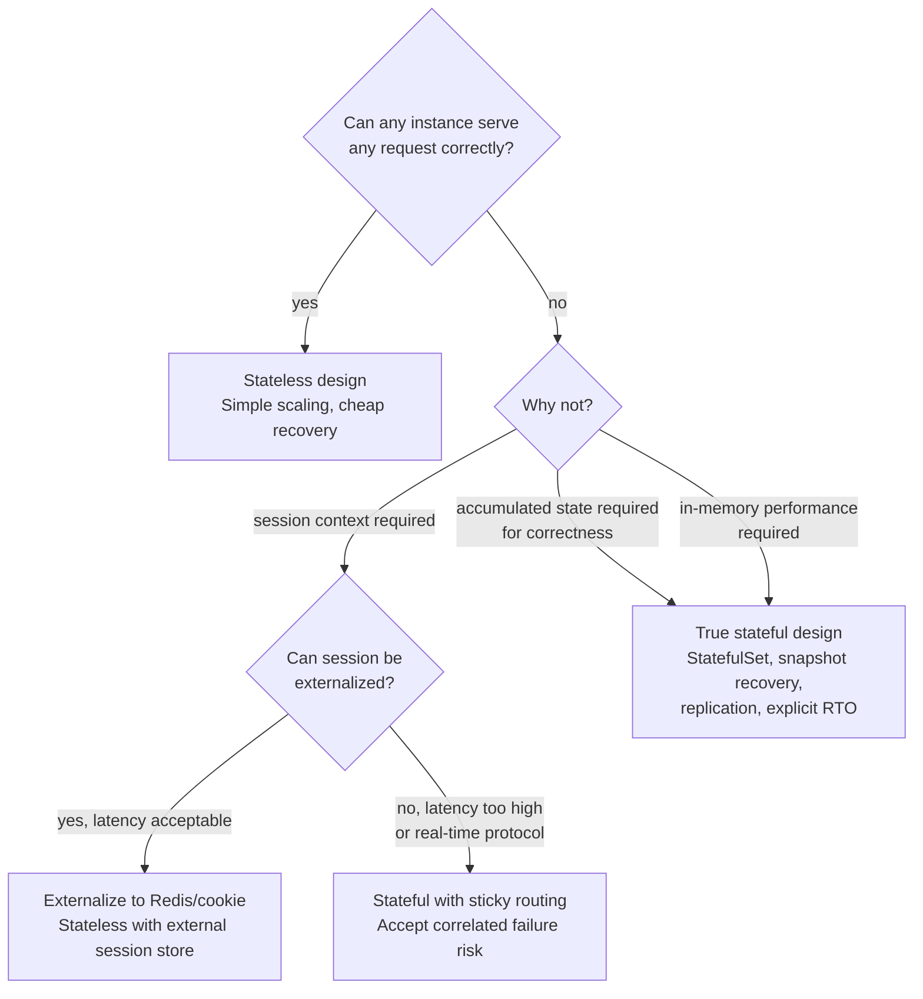

The distinction between stateful and stateless services is frequently presented as binary and obvious. It is neither. State exists on a spectrum — from ephemeral per-request computation to durable data that must survive any number of failures — and a design choice that is correct for one type of state is actively harmful for another. The question "is this service stateful?" is less useful than "what *kind* of state does this service hold, what are the consequences of losing it, and who is responsible for that state's durability?"
 
## What State Actually Is
 
"State" in a distributed systems context means any data that a service instance holds which affects how it responds to future requests. This is broader than it first appears, and conflating different categories of state leads to design errors.
 
**Per-request ephemeral state** is computation in flight: variables on the stack, objects in heap during a request, partial results being assembled. Every service holds this; it is destroyed at request completion and has no bearing on the stateful/stateless distinction.
 
**Connection state** is the protocol negotiation overhead that must be amortized across multiple requests: TCP handshake, TLS session establishment, database authentication and authorization, HTTP/2 stream multiplexing. A service that holds open database connections is holding connection state, even if it considers itself stateless in the application sense. This state is expensive to reconstruct (~50-200 ms per new database connection including TLS and authentication) and is the reason connection poolers exist.
 
**Session state** is application-level context accumulated across multiple requests from the same client: authentication tokens, shopping cart contents, wizard step progress, partial form submissions. This is the state that causes the most operational problems in distributed systems because it is too large and too client-specific to encode in every request, yet too ephemeral to justify durable storage.
 
**Computational cache state** is derived data: precomputed aggregates, hot query result caches, in-memory lookup tables built at startup. This state can be rebuilt from authoritative sources but at non-trivial cost — a service that loses its in-memory cache and must refill it from a database may be briefly slow but is not incorrect.
 
**Durable application state** is the source-of-truth data that the system exists to manage: account balances, order records, user profiles, event logs. This state must never be lost to a service restart and is almost always stored in an external persistence system. Whether that system is a database, an object store, or an event log is an implementation detail; the requirement that it survives any single component failure is not.
 

*State categories by consequence of loss: green is safe to lose, orange is recoverable with cost, red must never be lost.*
 
## Why Stateless Services Scale
 
A service is effectively stateless when any instance can handle any request without coordination with peer instances. The precise technical requirement is **no mutable shared state between instances**. An instance may hold read-only configuration, local in-memory caches that can be rebuilt, or ephemeral per-request state — none of these violate the stateless contract.
 
The scaling advantages of this design are mechanical, not aspirational.
 
**Load balancing is unconditional.** Any request can go to any instance. Round-robin, least-connections, random — any algorithm works because there is no routing constraint. Adding capacity means adding instances and registering them with the load balancer. No data migration, no rebalancing, no coordination.
 
**Failure recovery is immediate.** When an instance crashes, its in-flight requests fail, but no persistent state is lost. A replacement instance starts cold and is immediately capable of serving any request. Recovery time is the time to start a new process and pass a health check — typically seconds. Compare this to a stateful service where recovery involves replaying a write-ahead log, populating a cache, re-establishing connections, or waiting for replication to catch up.
 
**Deployments are zero-risk.** Rolling updates of stateless services are trivially safe: bring up new instances, shift traffic, drain old instances. Canary deployments reduce blast radius to a percentage of traffic. Blue/green switches are instantaneous. No migration scripts, no schema changes, no in-flight state to drain.
 
**Auto-scaling works correctly.** Scale-in events — removing instances during low traffic — are safe because instances carry no unique state. A stateful service that is scaled in loses whatever state was local to the removed instances.
 
:::tip
The strictest definition of stateless is a service that could be replaced mid-request — where a proxy could send the first half of a request to one instance and the second half to another — and produce correct results. Almost nothing meets this standard, but it is a useful mental model for identifying where state is actually being held.
:::
 
## The Illusion: Stateless Services Still Depend on Stateful Backends
 
Statelessness does not eliminate state. It relocates it. Every stateless HTTP API service depends on stateful backends: relational databases, key-value stores, object storage, message queues. The state does not go away; it gets pushed to components explicitly designed to manage it durably and consistently.
 
This three-tier model — stateless compute layer over stateful storage layer — is the dominant architecture of web-scale systems. The compute layer scales horizontally and trivially because all its state is externalized. The storage layer carries all the distributed systems complexity: replication, consistency guarantees, partition tolerance, failover. The distinction between "easy to scale" (stateless compute) and "hard to scale" (stateful storage) is not a coincidence — it is the entire point.
 

*Stateless compute over stateful storage: horizontal scaling is trivial for the compute tier because all persistent state is externalized to components designed to manage it.*
 
The consequence is that scaling a stateless service requires the storage tier to absorb increased load. A stateless API service scaled from 3 to 30 instances delivers 10x more requests to the database. If the database cannot absorb that load, the stateless compute tier is irrelevant. **The scaling ceiling of a stateless service is set by its stateful dependencies, not by the stateless instances themselves.**
 
## Session State: The Most Common Design Error
 
Session state — information accumulated across multiple requests from a single client — is the category most likely to be handled incorrectly in a service that claims to be stateless.
 
The naive implementation stores session data in instance-local memory (a `HashMap<SessionId, SessionData>` in Java, a module-level `dict` in Python). This works perfectly with a single instance. With multiple instances it fails silently: requests routed to different instances see no session context, producing authentication failures, lost cart contents, or corrupted wizard state.
 
The two common responses to this are both architecturally significant.
 
**Sticky sessions (session affinity)** configure the load balancer to route all requests from a given client to the same instance, typically using a cookie or IP hash. This restores correctness but re-introduces statefulness at the infrastructure level. When that instance fails or is removed, all of its sessions are lost simultaneously — a correlated failure that affects many users at once rather than distributing failure probability across the fleet. During deployments, sticky sessions make rolling updates complicated: draining an instance means waiting for all sticky sessions to time out, potentially holding up deployments for hours.
 
**Externalized session state** moves session data to a shared store — Redis, Memcached, a database table — that any instance can read. Session lookup adds one network round trip (~0.5-1 ms for a local Redis) to every request that requires session context. This is the correct architectural solution: sessions survive instance failure, routing is unconstrained, deployments are clean.
 
A more radical variant is **encoding session state directly in the client** via signed tokens. JWTs (JSON Web Tokens) carry session claims in a cryptographically signed payload that the server can verify without any storage lookup. The advantages are real: zero backend infrastructure for session storage, no session lookup latency, works naturally with CDNs and edge computing. The limitations are equally real: tokens cannot be invalidated server-side before expiry (a fundamental security limitation), payload size is transmitted on every request, and sensitive claims in the payload are visible to anyone who intercepts the token (mitigated but not eliminated by encryption).
 

*Externalized session state: instance 2 serves a request using session data created by instance 1, with no sticky routing required.*
 
## Stateful Services: When They Are the Right Answer
 
Statefulness is not a design flaw to be eliminated. It is a requirement for specific categories of workloads where the cost of externalizing state exceeds the benefit, or where the access patterns make external state coordination physically infeasible.
 
**In-memory databases and caches.** Redis, Memcached, VoltDB, and similar systems exist specifically because some workloads need state access at memory speeds — sub-millisecond latency that no network round trip to external storage can provide. The statefulness is the product: these systems are valuable precisely because they hold data close to compute. Designing them as stateless would be incoherent.
 
**Database connection poolers.** PgBouncer, ProxySQL, and similar tools hold stateful connection pools: authenticated, negotiated connections to database backends that would cost 50-200 ms each to re-establish. They are stateful proxies that convert many stateless application connections into a smaller pool of persistent backend connections. Their statefulness is an explicit performance optimization.
 
**Stream processing with accumulated state.** A Kafka Streams application that computes a rolling 5-minute count of events per user must maintain a state store that accumulates values across messages. This state store is local to the processing instance — for performance — but is typically persisted to a changelog topic for durability. The stateful design is not optional; the computation *is* the accumulated state.
 
**Long-lived protocol connections.** WebSocket servers, game servers, XMPP messaging servers, and video conferencing servers hold per-connection state: authentication context, subscription lists, sequence numbers, media negotiation state. This state cannot be externalized without adding a network hop to every message, which often breaks latency requirements for real-time protocols. These systems are correctly designed as stateful with sticky routing to specific instances.
 
**ML model serving with warmup cost.** Large language model inference servers, recommendation engines, and similar systems spend significant time loading model weights into GPU/CPU memory. A "stateless" design that loaded and unloaded model weights per request would be unusable. The warm model state is worth preserving across requests, making these services intentionally stateful with respect to their in-memory model.
 
:::note
The Kubernetes distinction between `Deployment` (stateless) and `StatefulSet` (stateful) captures this operational asymmetry precisely. A `Deployment` pod gets a random name (`api-xyz12`) and can be killed and replaced arbitrarily. A `StatefulSet` pod gets a stable ordinal identity (`kafka-0`, `kafka-1`), stable network hostnames, and ordered startup/shutdown semantics. These are not cosmetic differences — they are the operational primitives required to manage replicated state correctly.
:::
 
## The Operational Asymmetry: Kill vs. Drain
 
The single most consequential difference between stateful and stateless services is the operational response to any lifecycle event: deployments, scaling events, failures, and maintenance.
 
**Stateless lifecycle: kill and replace.** A stateless instance can be terminated at any point with no coordination. In-flight requests fail and are retried by clients or proxied. The instance is replaced immediately. No state is lost because no unique state exists on that instance.
 
**Stateful lifecycle: drain, snapshot, restore.** A stateful instance must be drained before termination: existing connections or sessions must be migrated or allowed to complete, in-memory state must be checkpointed or replicated to peers, and the replacement instance must either recover from the checkpoint or catch up via replication before serving traffic. This process can take seconds to hours depending on the amount of state involved.
 
| Event | Stateless service | Stateful service |
|---|---|---|
| **Instance crash** | Replace immediately, no data loss | Detect, elect new primary or restore from replica, potential data loss window |
| **Rolling deployment** | Shift traffic, drain, terminate, no ceremony | Pause writes or use replication failover, validate state consistency post-deploy |
| **Scale-in** | Terminate any instance safely | Drain connections, migrate partitions, rebalance load |
| **Scale-out** | Start new instances, register, serve | Start new instance, bootstrap state (snapshot transfer, log replay), warm up |
| **Recovery time** | Seconds (process startup + health check) | Seconds to minutes (state recovery) to hours (large snapshot replay) |
 
This asymmetry has deep implications for SLO (Service Level Objective) design. A stateless service can credibly commit to recovery times measured in seconds. A stateful service must account for state recovery time in its RTO (Recovery Time Objective), and that recovery time grows with data volume in a way that is often non-obvious until the first production failure.
 
## Anti-Patterns That Create Accidental Statefulness
 
Statefulness often enters a service not by design but through implementation choices that seem reasonable in isolation.
 
**Local in-memory caches without external backing.** A service that builds a lookup table at startup by reading from a database and stores it in a module-level variable is stateful with respect to that cache. If the service was scaled out to five instances and the underlying data changes, five different cache states exist simultaneously — a split-brain cache. Requests routed to different instances return different results. The fix is either a shared external cache or a cache invalidation mechanism (TTL, event-driven invalidation) that keeps all instances consistent.
 
**Local file system usage.** A service that writes temporary files, uploads, or processing artifacts to the local filesystem is stateful with respect to those files. When the instance is replaced, the files are gone. When the service scales to multiple instances, each instance has a different filesystem view. Kubernetes makes this explicit: pods lose their local filesystem on restart unless a `PersistentVolumeClaim` is attached — and attaching persistent volumes reintroduces StatefulSet semantics.
 
**Hardcoded outbound connections.** A service that opens a single connection to a database at startup and holds it in a global variable is stateful with respect to that connection. When the database connection drops and the service attempts to reconnect, the reconnection logic may fail under load. Connection pool libraries (HikariCP, `database/sql` in Go, SQLAlchemy) exist to manage this state correctly, with health checking, reconnection backoff, and pool sizing.
 
**Accumulated metrics or state in application memory.** Prometheus counters, rate limiters implemented as in-memory token buckets, circuit breaker state, and retry budgets — all of these accumulate state in application memory. When an instance restarts, they reset to zero. For most metrics this is acceptable (the Prometheus scrape will briefly show a counter reset). For circuit breakers and rate limiters, a reset can cause a briefly unsafe state: a rate limiter that just restarted has full budget and may allow a burst that the cluster-level budget has already consumed.
 
:::danger
A service with a local in-memory rate limiter deployed across 10 instances provides 10x the intended rate limit, because each instance enforces the limit independently. A burst that hits different instances in round-robin fashion will be allowed by each instance up to its local limit, summing to 10x the intended global limit. Rate limiting that must enforce a global constraint must be implemented in a shared external store — Redis is the canonical choice — not in instance-local memory.
:::
 
## Designing the Boundary: Where to Put State
 
The practical design question is not "should my service be stateless?" but "at which layer in the stack should each type of state live?"
 
**Externalize session state** to a purpose-built session store with appropriate TTLs. Redis with automatic key expiry is the standard choice. Keep session payloads small — store only identity and permissions, not arbitrary application context.
 
**Externalize coordination state** — distributed locks, leader election records, configuration that must be consistent across instances — to a dedicated coordination service. etcd, ZooKeeper, and Consul are purpose-built for this. Do not implement distributed coordination in a shared database table unless you understand the locking semantics precisely.
 
**Keep computational caches local but treat them as rebuild-able.** An in-memory cache that can be rebuilt from authoritative data within an acceptable latency budget does not need to be externalized. The service is stateless with respect to its observable behavior even if it holds local cache state.
 
**Accept stateful design explicitly for stateful workloads.** If the access pattern requires sub-millisecond latency to accumulated state (stream processing, in-memory databases), or if connection setup costs are amortized across many requests (database proxies, connection poolers), design for statefulness explicitly: stable identities, ordered lifecycle, snapshot-based recovery, and replication.
 

*Decision flow for the stateful vs. stateless boundary: session externalization recovers most of the benefits of stateless design for the most common cases.*
 
## Measuring the Impact: Latency Budget for State Operations
 
State location directly determines the latency budget available for serving a request. Instrumenting these numbers in production is the only reliable way to know whether an externalized state design is meeting its SLOs.
 
| State location | Typical access latency | Suitable for |
|---|---|---|
| CPU register / L1 cache | < 1 ns | Per-request ephemeral computation |
| L3 cache / local heap | ~20-40 ns | Local in-memory cache, connection pool objects |
| Local NVMe SSD | ~20-100 µs | Write-ahead log, local checkpoint files |
| Same-rack Redis (pipeline) | ~0.1-0.5 ms | Session state, distributed locks, rate limiter tokens |
| Same-AZ database read | ~1-5 ms | Durable application state, strong consistency reads |
| Cross-AZ database read | ~5-15 ms | Replicated state with AZ fault tolerance |
| Cross-region read | ~50-300 ms | Geo-distributed data, eventual consistency acceptable |
 
A service with a target P99 latency of 10 ms has a budget of roughly 10 ms to spend across all I/O operations in a request. If session state lookup (0.5 ms) + a primary database read (3 ms) + a Redis cache check (0.3 ms) + internal processing (2 ms) = 5.8 ms, there is margin. If the same service makes three sequential database reads (3 ms × 3 = 9 ms), there is almost none. State location is not a theoretical concern — it directly determines whether an SLO is achievable.
 
See [Replication Strategies](/distributed-systems/en/data-management/replication/) for how stateful services manage state durability across failures.
See [Distributed Caching](/distributed-systems/en/data-management/distributed-caching/) for the specific patterns used to externalize computational cache state at scale.