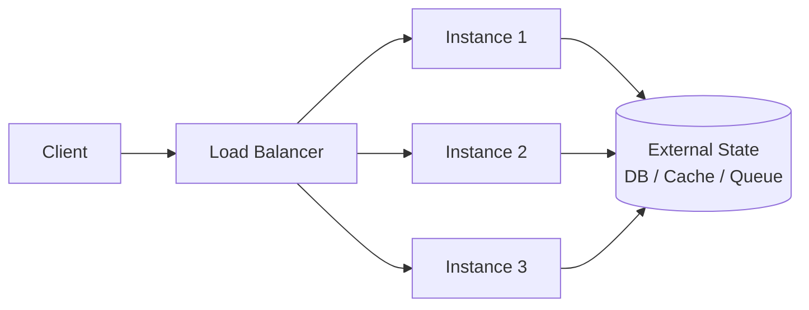
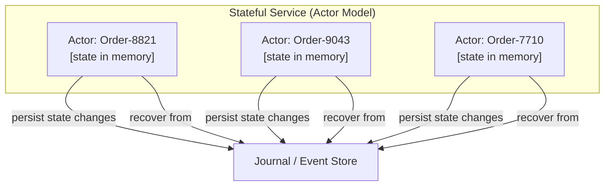

The stateless/stateful distinction is not a binary property of a service — it is a question of *where* state lives and *who* is responsible for its consistency. Every service that does meaningful work touches state somewhere. The architectural choice is whether that state is owned locally by the service instance or externalized to shared infrastructure, and that choice cascades into every decision about deployment, failure recovery, scaling, and correctness.

## What State Actually Means

**State** is any data whose value at time *T+1* depends on operations performed before *T*. It comes in several distinct forms that are often conflated:

- **Request state** — data that exists only for the duration of a single request/response cycle. An HTTP request body, a parsed query object, a temporary computation buffer. This is never the source of stateful vs. stateless debate.
- **Session state** — data that persists across multiple requests from the same client: authentication tokens, shopping cart contents, wizard step progress, in-flight multi-step transactions.
- **Resource state** — durable domain data: user records, order history, account balances, inventory counts. This always lives in persistent storage; the question is which service owns it.
- **Computational state** — intermediate results of long-running processing: Spark task progress, stream processing consumer offsets, saga orchestration step, workflow execution position.
- **Membership state** — knowledge of which peers exist in a cluster, their health, and their roles. Used by consensus algorithms, gossip protocols, service registries.
A **stateless service** holds no state beyond the current request. Given the same inputs and external dependencies, it produces the same output regardless of which instance handles the request and regardless of prior requests. A **stateful service** maintains state that affects future behavior — either in memory, on local disk, or in a component it owns exclusively.

:::note
"Stateless" as commonly used in microservices architecture means *instance-stateless*: the service instances themselves are interchangeable. The service as a whole is not stateless — it reads and writes state via external dependencies (databases, caches, queues). This distinction matters because the consistency guarantees of those external dependencies become *your* consistency guarantees.
:::

## The Stateless Service Model: Mechanics and Constraints

A stateless service instance can be replaced, duplicated, or terminated at any point without affecting correctness. Every instance operates identically given the same request and the same state of its external dependencies.


*Stateless instances are interchangeable. Any instance handles any request; all durable state lives in shared external infrastructure.*

This model buys three operational properties:

**Horizontal scalability without coordination.** Adding an instance requires no data migration, no rebalancing, no membership reconfiguration. The load balancer begins routing to the new instance after a health check passes.

**Trivial failure recovery.** When an instance dies, in-flight requests fail and are retried (if the client implements retries) or dropped. No state is lost because no state was held locally. The replacement instance starts cold with no recovery procedure.

**Deployment simplicity.** Rolling deployments, canary releases, and blue/green cutover all work cleanly because instances carry no state that must be migrated or versioned during the transition.

The constraints are equally concrete:

**External state becomes the bottleneck.** Every piece of state that the application tier externalizes becomes a request to shared infrastructure. A stateless authentication service that validates JWTs against a database on every request has replaced local state with a network round-trip on the critical path. The instance is stateless; the *system* latency is not.

**Consistency is delegated, not eliminated.** A stateless service reading from a PostgreSQL read replica that is 200ms behind the primary will return stale data. The service cannot distinguish stale from fresh without querying the primary — which negates the read offload benefit. Statelessness moves the consistency question to the external dependency; it does not answer it.

**Session affinity is a trap.** Load balancers support sticky sessions (routing a client consistently to the same instance based on a cookie or IP hash). This is a crutch that converts a nominally stateless service into a de facto stateful one without the operational properties that stateful design provides. Sticky session instances become single points of failure; if the pinned instance dies, the session is lost anyway. The correct solution is to externalize the session state — not to pretend stickiness makes instances equivalent.

```go
// Wrong: storing session in instance memory
var sessions = map[string]*Session{}

func handleRequest(w http.ResponseWriter, r *http.Request) {
    sessionID := r.Cookie("session_id")
    sess := sessions[sessionID.Value] // fails on any other instance
    // ...
}

// Correct: session lives in Redis, instance is stateless
func handleRequest(w http.ResponseWriter, r *http.Request) {
    sessionID, err := r.Cookie("session_id")
    if err != nil {
        http.Error(w, "missing session", http.StatusUnauthorized)
        return
    }

    ctx := r.Context()
    sess, err := sessionStore.Get(ctx, sessionID.Value)
    if err != nil {
        // Redis unavailable or session expired -- handle explicitly
        http.Error(w, "session unavailable", http.StatusServiceUnavailable)
        return
    }
    // any instance can now serve this request
}
```

## The Stateful Service Model: When Local State Is the Right Answer

Stateful services hold state directly: in process memory, on locally attached disks, or in a component they own exclusively (a database that only one service writes to). This introduces coordination costs but eliminates the latency and consistency penalties of externalizing everything.

The cases where stateful design is architecturally correct — not just convenient:

**1. Stream processing with large operator state.** A Flink job computing a 7-day rolling average over a 10TB event stream maintains state (partial aggregations, windowed buffers, watermarks) that is too large to externalize without prohibitive I/O cost. The state is colocated with the computation because externalizing it would require reading and writing gigabytes per operator per second. Flink's RocksDB state backend stores this state on the task manager's local NVMe, checkpointing snapshots to object storage asynchronously for fault tolerance.

**2. Consensus participants.** Raft nodes, ZooKeeper ensemble members, and etcd peers maintain a replicated log that *is* their state. These services are inherently stateful — the correctness guarantee of the consensus algorithm depends on the durability and ordering of the local log. You cannot externalize a Raft participant's log to a shared database without breaking the invariants the algorithm relies on.

**3. Databases and storage engines.** A PostgreSQL primary owns its WAL, its buffer pool, its index structures. A Redis instance owns its keyspace. These are definitionally stateful services. The entire value proposition of a storage engine is that it manages state with specific durability, indexing, and query semantics.

**4. Actors and entity-based processing.** Frameworks like Akka, Orleans, and Temporal Workflow maintain per-entity state in memory with a persistence model behind them. An `OrderActor` that holds current order state in memory and persists changes to a journal provides serialized access to order state without requiring a distributed lock on every operation. This is only correct when the entity is pinned to one actor/process — which requires stateful placement.

**5. Local caching for read-heavy, tolerance-for-staleness workloads.** A service that caches product catalog data in process memory avoids the network round-trip to Redis on every render. The tradeoff is stale reads during the TTL window. For workloads where eventual consistency on catalog data is acceptable and read volume is extremely high (millions of req/s), local cache eliminates the caching tier as a bottleneck entirely.


*Actor-based stateful service: each entity's state lives in a dedicated actor. Serialized access per actor eliminates distributed locking. The journal provides durability and recovery.*

## Operational Cost of Each Model

Stateless services impose operational costs on the shared infrastructure they depend on. Stateful services impose operational costs on the services themselves.

| Dimension | Stateless | Stateful |
|---|---|---|
| **Horizontal scaling** | Trivial — add instances | Complex — data migration, rebalancing, or sharding required |
| **Failure recovery** | Replace instance; no data recovery needed | Must recover state: restore snapshot, replay log, rejoin cluster |
| **Deployment** | Rolling/canary with no migration | May require quorum awareness, leader election, coordinated drain |
| **Consistency** | Delegated to external dependencies | Owned locally; complexity scales with replication requirements |
| **Latency** | Adds network RTT for every state access | In-process state access is nanoseconds; no network on hot path |
| **Memory pressure** | Bounded by single request working set | Unbounded if state grows without eviction policy |
| **Blast radius of instance failure** | Zero state loss; in-flight requests fail | In-memory state lost unless persisted; requires durability design |
| **Testing** | Simple — instances are deterministic given inputs | Complex — must test state recovery, replication lag, split-brain |

## The Durability Contract: What Stateful Services Must Guarantee

A stateful service that holds state in memory without a durability mechanism is a liability, not an asset. Any process restart — planned or unplanned — erases all in-memory state. The durability contract for a stateful service must be explicit:

**Synchronous durability** — state is written to durable storage before the operation is acknowledged. Guarantees zero data loss on crash. Adds write latency proportional to storage I/O (typically 0.1–2ms for NVMe, 0.5–5ms for network-attached block storage).

**Asynchronous durability** — state is written to durable storage in the background after acknowledgment. Lower write latency but a defined window of potential data loss (the **RPO**, Recovery Point Objective) equal to the flush interval.

**Checkpoint-based durability** — used by stream processors (Flink, Spark Streaming). State is snapshotted to durable object storage at configurable intervals. Recovery replays events from the last checkpoint. RPO equals the checkpoint interval; recovery time depends on checkpoint size and replay throughput.

```yaml
# Flink stateful stream processor: checkpoint configuration
execution:
  checkpointing:
    interval: 30s              # RPO: up to 30s of reprocessed events on recovery
    mode: EXACTLY_ONCE
    min-pause: 10s
    timeout: 10m
    externalized-checkpoints:
      cleanup-mode: RETAIN_ON_CANCELLATION

state:
  backend: rocksdb             # NVMe-backed; handles state larger than heap
  incremental: true            # only changed state blocks are checkpointed
  checkpoints-dir: s3://your-bucket/flink-checkpoints
```

:::caution
Stateful services that do not document their durability contract — specifically their RPO and RTO (Recovery Time Objective) — are not production-ready. The question "what happens to your state when this instance dies?" must have a precise answer, not "we'll figure it out when it happens." Failure to define this upfront produces data loss incidents that are difficult to detect (silent state corruption) and impossible to recover from retroactively.
:::

## The Placement Problem: Stateful Services and Infrastructure

Stateless services are placement-agnostic — the scheduler can put them anywhere. Stateful services have placement constraints that interact with the underlying infrastructure in ways that compound operational complexity.

**Local disk affinity.** A stateful service using NVMe-backed local storage cannot be freely rescheduled. When Kubernetes evicts a pod with local state, that state is gone unless the service has a recovery mechanism. `StatefulSet` with `volumeClaimTemplates` binds a pod to a `PersistentVolume`, constraining it to nodes where that volume is accessible — which may conflict with cluster rebalancing.

**Network identity.** Stateless pods are anonymous. Stateful services often need stable network identities so that peers, clients, and configuration can address them consistently. Kubernetes `StatefulSet` provides stable DNS names (`pod-0.service.namespace.svc.cluster.local`) precisely for this reason.

**Ordered deployment and shutdown.** Stateless services can be deployed and terminated in any order. Stateful services frequently have ordering requirements: a Kafka broker must complete leader rebalancing before shutdown; a database replica must catch up before promotion. Kubernetes `StatefulSet` handles ordered rollout (`pod-0` before `pod-1` before `pod-2`) but requires services to implement graceful shutdown hooks that respect those semantics.

```yaml
# StatefulSet for a stateful service with stable identity and persistent storage
apiVersion: apps/v1
kind: StatefulSet
metadata:
  name: order-processor
spec:
  serviceName: order-processor   # creates stable DNS per pod
  replicas: 3
  podManagementPolicy: OrderedReady  # pod-0 ready before pod-1 starts
  template:
    spec:
      terminationGracePeriodSeconds: 120  # time to flush state and drain
      containers:
        - name: order-processor
          image: order-processor:v2.4.1
          lifecycle:
            preStop:
              exec:
                command: ["/bin/sh", "-c", "kill -SIGTERM 1 && sleep 90"]
          volumeMounts:
            - name: state-volume
              mountPath: /var/lib/order-processor/state
  volumeClaimTemplates:
    - metadata:
        name: state-volume
      spec:
        accessModes: [ReadWriteOnce]
        storageClassName: premium-ssd
        resources:
          requests:
            storage: 100Gi
```

## Decision Criteria: Which Model to Choose

The choice is not "prefer stateless" as a blanket rule. It is a function of what the state is, how large it is, how frequently it is accessed, and what consistency guarantees the workload requires.

**Use stateless when:**
- State naturally fits in an external database or cache with acceptable latency for your SLO
- The workload requires elastic scaling in response to traffic spikes
- Team size or operational maturity does not support the failure recovery complexity of stateful services
- Requests are independent — no dependency on prior request outcomes held in memory
**Use stateful when:**
- State is too large or too frequently accessed to externalize without violating latency SLOs
- The correctness guarantee depends on serialized, in-process access to state (actor model, consensus participant)
- You are building infrastructure — a database, a queue, a stream processor — where owning state is the service's primary function
- Cross-network consistency overhead for state access would dominate request latency
:::danger
The distributed monolith anti-pattern most commonly emerges when teams attempt to make inherently stateful operations look stateless by externalizing them to a shared database that all services write to. This produces the worst of both models: the deployment complexity of distributed services combined with a shared global state layer that serializes writes, propagates schema changes as global coordination events, and becomes the single point of failure the distribution was meant to eliminate. Database-per-service exists precisely to prevent this.
:::

The irreversible commitment in this decision is not the initial choice — it is the accumulation of dependent design decisions that follow. A service designed as stateless that grows session-affinity hacks, local caches with no invalidation strategy, and undocumented in-memory queues has become stateful without gaining any of the operational rigor stateful design demands. Audit what your service *actually* holds in memory before concluding it is stateless.