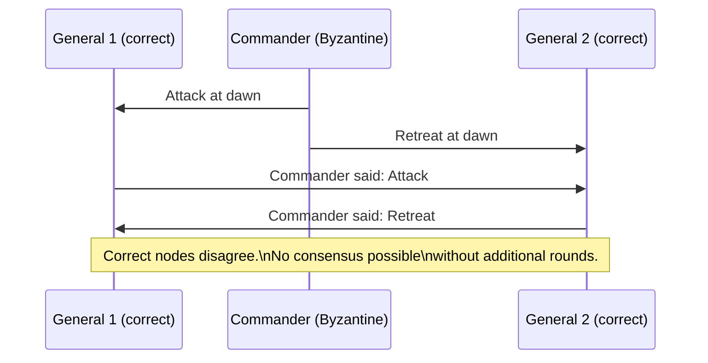
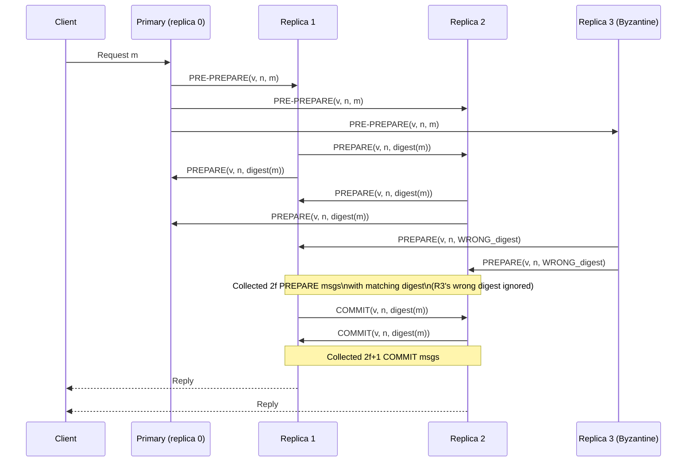

In 1982, Lamport, Shostak, and Pease published "The Byzantine Generals Problem" -- a paper that formalized the worst-case failure model in distributed systems. The problem is named after a scenario in which Byzantine army generals must coordinate an attack, but some generals may be traitors who send contradictory messages to different peers to cause disagreement. The paper proved that this coordination is impossible unless the fraction of traitors is less than one third of the total.
 
The model has outlasted its military metaphor. Today, Byzantine fault tolerance (BFT) underpins blockchain consensus, secure multi-party computation, and safety-critical aerospace and automotive systems. Understanding why 3f+1 is the minimum and how BFT protocols are structured is prerequisite to evaluating any system that claims to operate correctly in the presence of adversarial or corrupted participants.
 
## What Byzantine Failure Actually Means
 
A **Byzantine fault** is any deviation from the correct protocol that is not a crash. A Byzantine process may:
 
- Send different values to different peers in the same protocol round
- Send values that are syntactically valid but semantically incorrect
- Selectively omit messages to some peers while sending to others
- Replay old messages out of context
- Collude with other Byzantine processes to coordinate deception
- Respond to liveness checks while refusing to participate in consensus
This is the **arbitrary failure model**: there are no constraints on what a faulty process does, only on how many faulty processes exist. A single Byzantine node can simultaneously appear correct to one subset of the system and failed to another, making it impossible for correct nodes to reach agreement by simply waiting for a response.
 

 
*Byzantine commander sends conflicting orders to correct generals. The correct generals cannot distinguish a Byzantine commander from a correct commander whose messages were reordered.*
 
The key distinction from crash and omission failures: crash-stop and omission failures are **detectable by absence** -- a failed process sends nothing. A Byzantine process is **detectable only by inconsistency** -- it sends too much, or the wrong things, and correct nodes must detect the inconsistency through cross-checking with other nodes.
 
## The 3f+1 Lower Bound
 
The fundamental result: to tolerate f Byzantine faults in a system of n processes, you need:
 
```
n >= 3f + 1
```
 
This is a hard lower bound. No deterministic BFT protocol can tolerate f Byzantine faults with fewer than 3f+1 participants.
 
The proof by contradiction: suppose n = 3f. Divide the processes into three groups of f: group A (correct), group B (correct), group C (Byzantine). The Byzantine processes in C can impersonate group A to group B and impersonate group B to group A. From group A's perspective, all responses from C look like they come from correct nodes. From group B's perspective, similarly. With only f correct responses from A and f Byzantine responses from C (masquerading as A), group B cannot determine a quorum of correct votes. The system cannot make progress without risk of deciding on a value injected by the Byzantine processes.
 
With n = 3f+1, a quorum of 2f+1 responses guarantees at least f+1 correct responses even if all f Byzantine nodes respond. Since two quorums of size 2f+1 must overlap in at least f+1 nodes, and f+1 > f, the overlap always contains at least one correct node. This correct node's value can be used to detect Byzantine inconsistency.
 
```
n = 3f + 1, quorum size = 2f + 1
 
Quorum 1: f+1 correct + f Byzantine = 2f+1 nodes
Quorum 2: f+1 correct + f Byzantine = 2f+1 nodes
Overlap:  at least (2f+1) + (2f+1) - (3f+1) = f+1 nodes
          of which at least 1 is correct
 
=> Any two quorums share at least one correct node
=> A value certified by two quorums cannot be entirely fabricated
```
 
Compare this with crash-stop tolerance, which requires only 2f+1 nodes for a quorum of f+1 correct responses. Byzantine tolerance doubles the overhead because you must account for actively misleading responses, not just absent ones.
 
## PBFT: Practical Byzantine Fault Tolerance
 
**Practical BFT (PBFT)**, published by Castro and Liskov in 1999, was the first BFT protocol with practical performance. It operates in three phases: pre-prepare, prepare, and commit. The three-phase structure is necessary to ensure that correct nodes agree on both the order of requests and the fact that a quorum has agreed on that order.
 

 
*PBFT three-phase protocol with one Byzantine replica (R3). The correct replicas collect 2f matching PREPARE messages, ignoring R3's conflicting digest. With n=4 and f=1, the quorum of 2f+1=3 is reached by the two correct replicas plus the correct primary.*
 
The three phases serve distinct purposes:
 
**Pre-prepare** (primary to replicas): the primary assigns a sequence number n to the request within view v and broadcasts it. This establishes request ordering. A Byzantine primary can assign the same sequence number to two different requests (equivocation), which the prepare phase detects.
 
**Prepare** (replicas to all): each replica that accepts the pre-prepare broadcasts a prepare message containing the digest of the request. A replica is "prepared" when it has collected 2f prepare messages (from other replicas) with matching view, sequence number, and digest. This phase prevents a Byzantine primary from assigning conflicting ordering to different replicas.
 
**Commit** (replicas to all): each prepared replica broadcasts a commit message. A replica executes the request when it has collected 2f+1 commit messages. This phase ensures that at least f+1 correct replicas are prepared before any correct replica commits -- guaranteeing that the prepared state survives any subsequent view change.
 
The communication complexity of PBFT is **O(n^2)** per consensus round -- every replica sends a message to every other replica in the prepare and commit phases. This quadratic scaling is PBFT's primary limitation. With n=100 replicas, a single consensus round requires ~10,000 messages. This is tractable for small deployments (n=4 to 20) and intractable for large ones.
 
## View Changes: Handling a Byzantine Primary
 
The primary in PBFT may be Byzantine. It might refuse to forward client requests, assign sequence numbers out of order, or send different requests to different replicas. The **view change protocol** handles primary failure by rotating to the next replica as primary when the current primary is suspected.
 
A replica initiates a view change when its timer expires without seeing progress (no request committed within the timeout). It broadcasts a `VIEW-CHANGE` message with its current state. A new primary is elected when 2f+1 replicas have sent VIEW-CHANGE messages for the same new view number. The new primary then broadcasts a `NEW-VIEW` message proving it collected the required VIEW-CHANGE messages.
 
The view change protocol is the most complex part of PBFT and accounts for most of its implementation difficulty. It must ensure that:
 
- No committed request is lost across view changes
- No uncommitted request is falsely claimed as committed
- A Byzantine new primary cannot inject fabricated history into the NEW-VIEW message
:::caution
PBFT's view change protocol is notoriously difficult to implement correctly. Several published PBFT implementations have had subtle bugs in the view change path that allowed Byzantine replicas to violate safety under specific sequences of view changes and crashes. For production BFT systems, prefer BFT libraries with extensive formal verification (e.g., BFT-SMaRt, Hotstuff) over implementing PBFT from scratch.
:::
 
## HotStuff: Linear Communication Complexity
 
**HotStuff** (Yin et al., 2019), adopted as the basis for LibraBFT (now DiemBFT) and several other modern BFT protocols, achieves **O(n) communication complexity** per round by introducing a leader that aggregates votes using threshold signatures.
 
The key insight: instead of requiring every replica to broadcast to every other replica, each replica sends its vote to the leader. The leader aggregates 2f+1 votes into a **quorum certificate (QC)** using a threshold signature scheme (e.g., BLS signatures) and broadcasts the QC to all replicas. Verifying a threshold signature is O(1) regardless of how many replicas signed it.
 
```
PBFT:    O(n^2) messages per round -- every replica to every replica
HotStuff: O(n)  messages per round -- every replica to leader, leader broadcasts QC
```
 
HotStuff uses three phases (prepare, pre-commit, commit, decide) rather than PBFT's two, but the linear communication cost makes it viable for larger replica sets (n=100 to 1000). Tendermint, used in Cosmos-based blockchains, is a synchronous variant of HotStuff. PBFT and HotStuff variants now underpin most practical BFT deployments.
 
## When Byzantine Fault Tolerance Is Actually Required
 
Byzantine fault tolerance has a significant cost: 3x the replication overhead of crash-stop tolerance and substantially higher protocol complexity. It is justified in a narrow set of scenarios:
 
**Adversarial participants.** Public blockchain networks (Bitcoin, Ethereum, Cosmos) cannot assume that any node operator follows the protocol. BFT or Nakamoto consensus is required because any node might be operated by a party with financial incentive to cheat.
 
**Hardware fault-induced corruption.** In aerospace and automotive systems, cosmic ray bit flips can cause a processor to compute incorrect values that pass plausibility checks. The DO-178C avionics standard and ISO 26262 automotive standard require Byzantine-tolerant architectures for safety-critical functions. A flight control system that receives conflicting sensor readings from three redundant sensors needs BFT logic to determine which reading is faulty.
 
**Multi-organization trust boundaries.** A supply chain consortium where each organization operates its own replica has no basis to trust that other organizations will not attempt to manipulate shared state. Hyperledger Fabric's ordering service and the original Facebook Diem project used BFT consensus for exactly this reason.
 
**Scenarios that do NOT require BFT:**
 
- A database cluster where all nodes run on hardware you control
- A Kafka cluster where all brokers are operated by the same organization
- A Kubernetes etcd cluster on trusted infrastructure
- Any system where nodes fail by crashing, not by producing incorrect values
:::note
"My system needs to be secure, therefore it needs BFT" is a category error. Security against external attackers (authentication, authorization, encryption) is orthogonal to Byzantine fault tolerance. BFT addresses the case where a node that has already been admitted to the consensus group begins producing incorrect protocol messages. If you control the nodes and the threat is external attackers trying to break in, you need mTLS and proper authentication -- not BFT replication overhead. See [Zero Trust Architecture](/distributed-systems/en/security/zero-trust/never-trust-always-verify/) for the correct framing.
:::
 
## Byzantine Fault Tolerance in Storage Systems
 
BFT is not limited to consensus protocols. Storage systems face Byzantine faults in the form of **silent data corruption** -- a disk that returns incorrect data without signaling an I/O error. This is distinct from a crashed disk (which returns errors) and more insidious because the corruption is invisible to the application layer.
 
The solution is **end-to-end checksums** stored independently from the data. ZFS computes and stores a checksum for every block in a separate checksum tree; when reading a block, it verifies the checksum and, in a RAID configuration, can reconstruct the block from a correct copy. HDFS stores block checksums and verifies them on read, triggering replication from a good replica when corruption is detected.
 
```
Byzantine disk failure detection:
 
Data block + Checksum stored separately
On read: recompute checksum from data
If checksum mismatch: block is corrupted (Byzantine disk)
If checksum match: data is correct (with overwhelming probability)
 
Without end-to-end checksums:
- RAID protects against disk crash (detected by drive firmware)
- RAID does NOT protect against silent corruption (wrong data, valid CRC)
- Corrupted data propagates to all replicas undetected
```
 
The distinction between crash failures and Byzantine failures in storage is the motivation for end-to-end data integrity in every serious distributed storage system. Netflix's observation that roughly 1 in 10,000 disk sectors returned silently corrupted data in their early AWS deployments drove adoption of checksums throughout their storage pipeline.