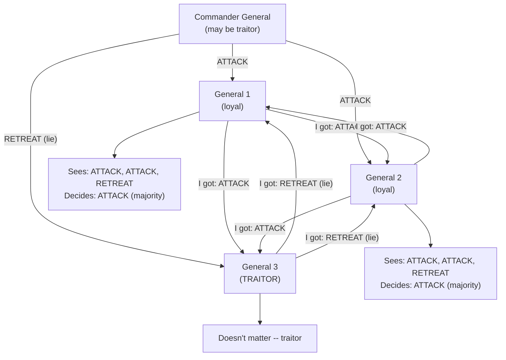
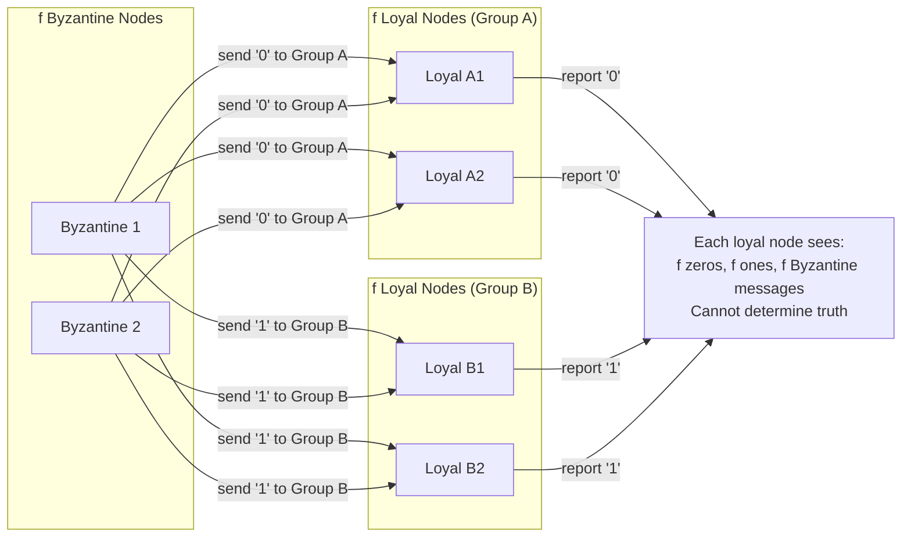
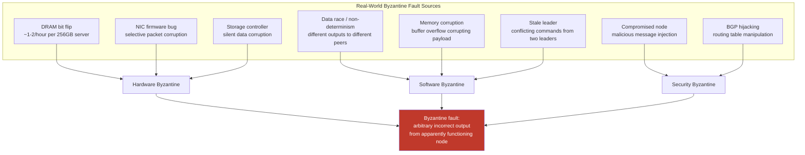
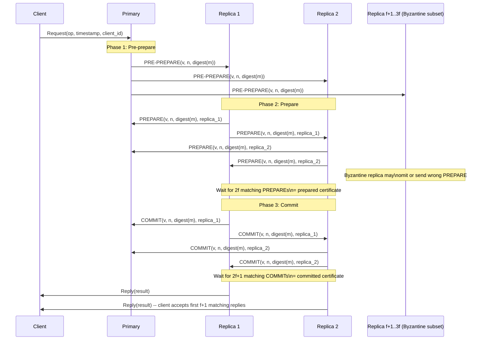
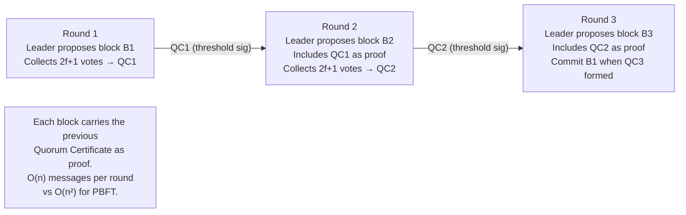
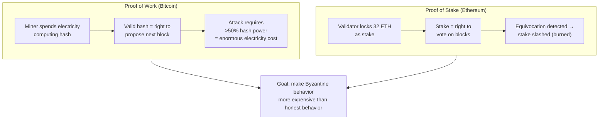

Every failure model discussed so far assumes that faulty processes fail in cooperative ways — they stop, they slow down, they drop messages. Byzantine faults shatter that assumption. A Byzantine process may do anything: send contradictory messages to different peers, selectively forward some messages and suppress others, respond correctly to some participants while lying to others, or behave correctly for extended periods before launching a targeted attack at a critical moment. The term derives from the Byzantine Generals Problem, introduced by Lamport, Shostak, and Pease in 1982 — a thought experiment that formalized the problem of reaching agreement when some participants are actively working to prevent it.
 
Byzantine fault tolerance (BFT) is not primarily a security problem, though security is one source of Byzantine behavior. It is a correctness problem: how does a system produce correct outputs when some fraction of its components are producing arbitrary, potentially adversarial outputs? The answer requires fundamentally different algorithmic machinery than crash-tolerant consensus, and it has a harder resource requirement: where crash-tolerant consensus needs `2f+1` nodes to tolerate `f` failures, Byzantine fault tolerance needs `3f+1`.
 
## The Byzantine Generals Problem
 
The original formulation imagines several divisions of a Byzantine army surrounding an enemy city. Each division is commanded by a general, and the generals communicate only by messenger. Some generals may be traitors who will try to prevent loyal generals from reaching agreement on a battle plan (attack or retreat). The problem: devise a protocol that allows loyal generals to agree on the same action, regardless of what the traitors do.
 
The traitors can behave arbitrarily: they can send different orders to different generals, fail to send messages, send messages that appear to come from other generals, or coordinate their deception with other traitors. This captures exactly the behavior of Byzantine faults in distributed systems — arbitrary behavior, potentially coordinated, potentially deceptive.
 

*Byzantine Generals with one traitor: loyal generals exchange what they received and take a majority vote. With 1 traitor and 4 generals (3f+1=4, f=1), majority correctly resolves to ATTACK.*
 
The fundamental result from Lamport, Shostak, and Pease: **Byzantine agreement is impossible with fewer than `3f+1` total nodes when `f` are Byzantine**. Equivalently, if more than one-third of participants are Byzantine, no deterministic protocol can guarantee agreement among the loyal participants.
 
## Why 3f+1: The Lower Bound
 
The impossibility of Byzantine agreement with fewer than `3f+1` nodes is not an arbitrary restriction — it follows from an information-theoretic argument about what loyal nodes can conclude from messages they receive.
 
Consider `3f` nodes with `f` Byzantine faulty. In the worst case, during any round of message exchange, the `f` Byzantine nodes can send different values to different loyal nodes, creating a scenario where:
 
- `f` Byzantine nodes send conflicting messages.
- The remaining `2f` loyal nodes split into two groups of `f`, each having received what appears to be a consistent majority view from different sources.
- No loyal node can distinguish which `f` of the nodes it trusts are Byzantine.

*With only 3f nodes: Byzantine nodes split f loyal nodes into two equal groups, each seeing an apparently valid majority. No node can distinguish Byzantine from loyal.*
 
With `3f+1` nodes: the `2f+1` loyal nodes constitute a majority over any `f` Byzantine nodes. Even if the Byzantine nodes collude to send conflicting messages, a majority vote among `3f+1` nodes produces a result that is consistent with what the loyal majority actually received. The `f` Byzantine votes cannot tip the balance because they are outnumbered `2f+1` to `f` — more than 2:1.
 
The proof that `3f+1` is both necessary and sufficient was established by Lamport, Shostak, and Pease and later refined by Dolev and Strong. For the synchronous model, they showed that `f+1` rounds of message exchange are sufficient — each round eliminates one potential traitor's ability to deceive.
 
## Byzantine Behavior in Real Systems
 
The most important insight for production engineers is that Byzantine faults do not require malicious actors. The same class of algorithmic problems arises from hardware malfunctions and software bugs that cause components to behave in ways inconsistent with their specification.
 
### Hardware-Induced Byzantine Behavior
 
**DRAM bit flips (Single-Event Upsets).** Cosmic rays, alpha particles from solder contamination, and high-energy neutrons cause individual bits in DRAM to flip without any external indication. The rate is approximately 10⁻⁷ to 10⁻⁸ bit flips per bit per hour on commodity ECC-less DRAM. A server with 256 GB of DRAM (about 2 × 10¹² bits) experiences roughly one to two bit flip events per hour. Without ECC memory, these flips corrupt data silently — a process reads a value that was correctly written but has since been corrupted in memory, producing results that are wrong but structurally valid.
 
At scale, this matters. A distributed system with 1,000 nodes, each with 256 GB DRAM, expects approximately 1,000-2,000 bit flip events per hour across the fleet. Most affect irrelevant memory regions. A small fraction corrupt critical data structures — vote counts, sequence numbers, checksums, routing tables — producing Byzantine-level behavior from what appears to be correct hardware.
 
**NIC and switch firmware bugs.** Network interface cards and switches contain processors running firmware. Firmware bugs have historically caused packet corruption that passed IP checksum validation, selective packet forwarding (some flows forwarded correctly, others silently dropped or corrupted), and incorrect ECMP hash computations that created asymmetric routing. From the distributed algorithm's perspective, a node affected by a NIC firmware bug may send some messages correctly while corrupting others — exactly Byzantine send behavior.
 
**Storage controller silent corruption.** RAID controllers and SAS/SATA controllers have documented cases of silently delivering corrupted data that passed on-disk checksums. This is distinct from a disk read failure (which returns an error) — the data is delivered successfully but is wrong. A process that reads a corrupted database page, performs a computation on it, and returns the result to the network is exhibiting Byzantine behavior: it is correct from a process perspective but producing wrong outputs.
 
### Software-Induced Byzantine Behavior
 
**Non-deterministic execution.** A process with a data race may produce different outputs on different runs with the same inputs, or produce outputs that depend on scheduling order. If that process participates in a consensus protocol, it may send different values to different peers in the same protocol round — exactly Byzantine behavior. JVM JIT compilation differences between nodes, glibc math library precision differences across architectures, and floating-point non-determinism across CPUs are all documented sources of this in practice.
 
**Memory corruption bugs.** A buffer overflow or use-after-free bug may corrupt the memory region containing a message payload, causing a process to send a structurally valid but semantically wrong message. The corrupted message passes all network-level integrity checks — TCP checksum, TLS, application-level framing — but contains wrong data. Recipient nodes disagree on the value they received from the corrupted sender.
 
**Stale leadership / split-brain.** A process that incorrectly believes it is still the leader — due to a partitioned network that has not been correctly handled — may issue commands that conflict with the actual current leader's commands. This is Byzantine behavior at the protocol level: two nodes both claim to be authoritative for the same resource and issue conflicting directives to the rest of the cluster.
 

*Byzantine faults arise from three independent sources: hardware errors, software bugs, and malicious actors. The algorithmic challenge is identical regardless of source.*
 
## Practical Byzantine Fault Tolerance: PBFT
 
The Practical Byzantine Fault Tolerance (PBFT) algorithm, published by Castro and Liskov in 1999, was the first BFT protocol with practical performance characteristics — O(n²) message complexity rather than the exponential complexity of earlier approaches. It operates in three phases under the partially synchronous network model and tolerates up to `f` Byzantine replicas among `3f+1` total replicas.
 
### PBFT Protocol Overview
 
PBFT designates one replica as the **primary** (leader) and the rest as **backups**. A client request goes through three phases before being executed:
 
**Phase 1 — Pre-prepare:** The primary assigns a sequence number to the client request and broadcasts a PRE-PREPARE message containing the request digest and sequence number to all backups.
 
**Phase 2 — Prepare:** Each backup that accepts the pre-prepare broadcasts a PREPARE message to all other replicas (primary + all backups). A replica waits until it receives `2f` matching PREPARE messages from different replicas. At this point, the replica has a **prepared certificate** — proof that a quorum of `2f+1` replicas (including itself) accepted the same sequence number assignment.
 
**Phase 3 — Commit:** Each replica that has a prepared certificate broadcasts a COMMIT message. A replica waits until it receives `2f+1` matching COMMIT messages. At this point, the replica has a **committed certificate** and executes the request.
 

*PBFT three-phase protocol: two all-to-all broadcast rounds (O(n²) messages) provide Byzantine safety by requiring 2f+1 matching messages at each phase.*
 
### Why Two Phases Are Necessary
 
The two phases (prepare + commit) are not redundant. They serve distinct purposes:
 
**Prepare phase** ensures that no two non-faulty replicas prepare different requests for the same sequence number within the same view. It establishes that the primary's assignment is consistent.
 
**Commit phase** ensures that a request that is committed at one replica is committed at all non-faulty replicas — even across view changes. The commit phase anchors the decision across potential primary failures and view changes, preventing a situation where a replica commits a value that disappears if the primary is replaced.
 
### PBFT Message Complexity and Scalability
 
PBFT's message complexity is O(n²) per request due to the all-to-all broadcast in the prepare and commit phases. With `n = 100` replicas, a single request requires approximately 100² = 10,000 messages. At `n = 1,000`, it is 1,000,000 messages per request.
 
This quadratic complexity is PBFT's fundamental scalability limitation. It makes PBFT practical for small replication groups (`n ≤ 20`) but impractical for large-scale distributed systems. The message complexity is not an implementation detail — it is a consequence of the information-theoretic requirement that each node must hear from `2f+1` other nodes to form a safe certificate.
 
:::caution
PBFT's O(n²) message complexity means that doubling the number of replicas quadruples the message overhead per request. A PBFT cluster with 10 replicas handles consensus at a manageable overhead; a cluster with 100 replicas spends more network capacity on consensus messages than on actual application traffic at any reasonable throughput. This is why practical BFT deployments either use small replication groups or employ hierarchical protocols that run BFT within small groups and coordinate between groups with simpler protocols.
:::
 
## HotStuff: Linear-Complexity BFT
 
HotStuff (2018, Yin et al.) demonstrated that BFT consensus can be achieved with **O(n) message complexity per phase** using threshold signatures. Instead of collecting `2f+1` individual signatures, a leader aggregates them into a **Quorum Certificate (QC)** — a single compact proof that `2f+1` replicas agreed. Each round produces one QC, and the next round builds on the previous QC, creating a chained structure.
 
HotStuff is the basis for several production blockchain consensus engines: DiemBFT (Facebook's Diem/Libra), Tendermint, and several Ethereum 2.0 validator client implementations. Its linear complexity makes it practical at network scales of hundreds to thousands of validators.
 

*HotStuff's chained QC structure: each round produces a single Quorum Certificate that serves as the proof for the next round, reducing message complexity from O(n²) to O(n).*
 
## Proof of Work and Proof of Stake as BFT Mechanisms
 
Blockchain consensus protocols solve a variant of Byzantine agreement under a different threat model: open, permissionless participation where the identity of participants is not known in advance.
 
**Proof of Work (PoW)** achieves Byzantine fault tolerance probabilistically. Miners compete to find a hash below a target value; the probability of finding a valid hash is proportional to computational power. An attacker controlling less than 50% of total hash power cannot consistently produce valid blocks faster than the honest majority. Safety is probabilistic: the probability of a double-spend attack decreases exponentially with the number of confirming blocks. Bitcoin requires 6 confirmations (~1 hour) for high-value transactions, giving the attacker a `(0.5)^6 ≈ 1.6%` chance of success even with 50% hash power.
 
**Proof of Stake (PoS)** achieves Byzantine fault tolerance by requiring validators to lock up ("stake") economic value that can be destroyed ("slashed") if they behave dishonestly. Ethereum's Casper FFG requires validators to publish explicit votes; equivocating (signing conflicting votes for the same slot) results in slashing — confiscation of a portion of the validator's stake. The economic cost of Byzantine behavior must exceed the economic gain from a successful attack.
 

*PoW and PoS both achieve Byzantine fault tolerance by making Byzantine behavior economically irrational: the attacker must spend more than they can gain.*
 
## Detecting Byzantine Behavior Without Full BFT
 
Full BFT protocols carry substantial overhead. For many production distributed systems, the threat model does not include active adversaries — the Byzantine failures are silent hardware or software errors, not coordinated attacks. A lighter-weight approach is to detect Byzantine behavior after the fact and alert, rather than prevent it in real time.
 
**Cross-validation checksums.** Application-level CRC32 or xxHash checksums on all data written to and read from storage, computed independently from transport-layer checksums. A mismatch between the computed and stored checksum indicates storage-layer silent corruption. PostgreSQL's `data_checksums` feature does exactly this — each page has a CRC that is verified on every read.
 
```shell
# Enable PostgreSQL data page checksums (at initdb time, or pg_checksums for existing clusters)
initdb --data-checksums /var/lib/postgresql/data
 
# Verify checksums on an existing cluster offline
pg_checksums --check /var/lib/postgresql/data
# Output: Checksum verification completed
# Files scanned:   1023
# Blocks scanned:  131072
# Bad checksums:   0          # non-zero here = silent corruption detected
```
 
**Audit logs and hash chaining.** An append-only audit log where each entry includes a cryptographic hash of the previous entry creates a tamper-evident chain. Any modification to a historical entry invalidates all subsequent hashes, making corruption detectable by anyone who stores the current chain head. This is the mechanism behind certificate transparency logs, blockchain ledgers, and Git's object model.
 
**Determinism verification (multi-party computation cross-check).** For critical computations, running the same computation on multiple independent nodes and comparing outputs detects Byzantine behavior in the computation path. This is the mechanism used by multi-party computation (MPC) protocols for private key management, and by Google's Byzantine-resilient production systems that cross-check results between replicas before returning outputs to clients.
 
:::tip
ECC (Error-Correcting Code) memory is the single most cost-effective defense against hardware-induced Byzantine faults. ECC DIMM modules correct single-bit errors and detect double-bit errors automatically. The cost premium over standard DIMM is approximately 10-20%. For any distributed system handling financial data, medical records, or safety-critical state, ECC memory should be treated as a baseline requirement, not an optional feature. Cloud providers that offer bare-metal instances typically list ECC memory support as a hardware specification.
:::
 
## Threshold Signatures and Byzantine-Resilient Cryptography
 
Many modern BFT protocols rely on **threshold signature schemes** to achieve linear message complexity. A `(t, n)` threshold signature scheme allows any `t` of `n` key-share holders to collaboratively produce a signature that can be verified against a single public key, without any single party holding the full private key.
 
In BFT consensus, this means that `2f+1` validators can produce a Quorum Certificate by contributing their key shares, and the resulting certificate is a single compact signature rather than a collection of `2f+1` individual signatures. The size of the certificate does not grow with the number of signers.
 
**BLS (Boneh-Lynn-Shacham) signatures** support efficient aggregation: multiple BLS signatures over the same message can be combined into a single signature with constant size. Ethereum's Beacon Chain uses BLS12-381 signatures for validator attestations, allowing thousands of validator signatures to be aggregated into a compact proof.
 
```python
# Conceptual illustration: BLS signature aggregation
# (using py_ecc library, simplified)
from py_ecc.bls import G2ProofOfPossession as bls
 
# Each validator signs the same message
signatures = []
for validator_key in validator_signing_keys:
    sig = bls.Sign(validator_key, block_hash)
    signatures.append(sig)
 
# Aggregate all signatures into one
# The aggregate has the same size as a single signature
aggregate_sig = bls.Aggregate(signatures)
 
# Verify against aggregate public key
aggregate_pubkey = bls.AggregatePKs(validator_public_keys)
is_valid = bls.FastAggregateVerify(
    validator_public_keys, 
    block_hash, 
    aggregate_sig
)
# is_valid is True iff 2f+1 validators correctly signed the same block_hash
```
 
## The Cost of Byzantine Fault Tolerance
 
Full BFT comes with real costs that must be weighed against the threat model:
 
| Property | Crash-tolerant (Raft/Paxos) | Byzantine-tolerant (PBFT/HotStuff) |
|---|---|---|
| **Minimum nodes for f failures** | `2f+1` | `3f+1` |
| **Message complexity (per decision)** | O(n) — Raft, O(n²) — Multi-Paxos | O(n²) — PBFT, O(n) — HotStuff |
| **Cryptographic overhead** | None or minimal (TLS for transport) | Digital signatures on every message |
| **View change complexity** | O(n) — Raft leader election | O(n²) — PBFT view change, O(n) — HotStuff |
| **Practical max cluster size** | Hundreds to thousands of nodes | Tens (PBFT) to hundreds (HotStuff) |
| **Latency vs crash-tolerant** | Baseline | 2-5× higher per round |
| **Threat model required** | Crash faults only | Arbitrary faults including adversarial |
 
The decision to use BFT is ultimately a threat model decision. For a private datacenter with physical access controls, trusted operators, and ECC memory, crash-tolerant consensus (Raft, Paxos) is appropriate — Byzantine faults are rare and detectable through monitoring. For a permissionless blockchain, a financial system processing transactions from untrusted counterparties, or any system where individual node operators cannot be fully trusted, Byzantine fault tolerance is not optional.
 
See [Deterministic vs. Probabilistic Failure Models](/distributed-systems/en/foundations/system-models/deterministic-vs-probabilistic/) for how Byzantine failure rates are incorporated into quantitative reliability analysis.
See [Consensus Algorithms: Raft](/distributed-systems/en/coordination/consensus-algorithms/raft/) for the crash-tolerant consensus baseline that BFT protocols extend.
See [Byzantine Fault Tolerance: PBFT, Proof of Work / Proof of Stake](/distributed-systems/en/coordination/consensus-algorithms/byzantine-fault-tolerance/) for the production deployment details of these algorithms.