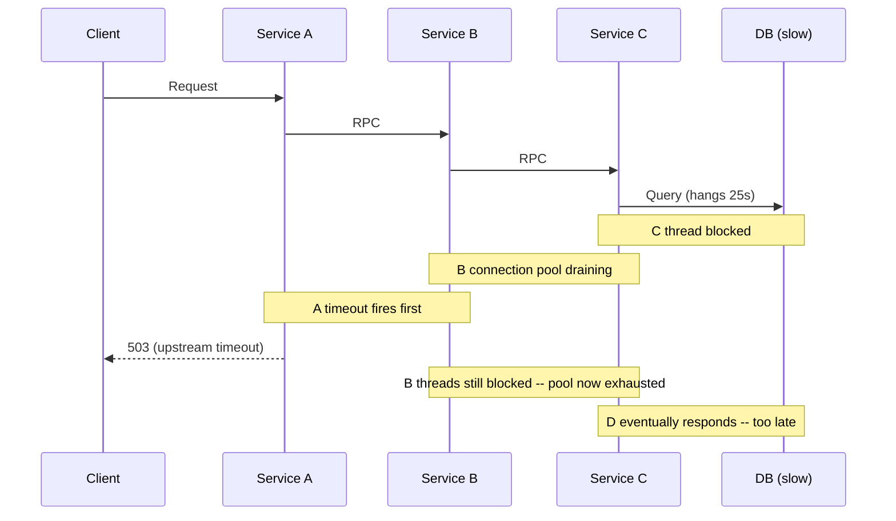
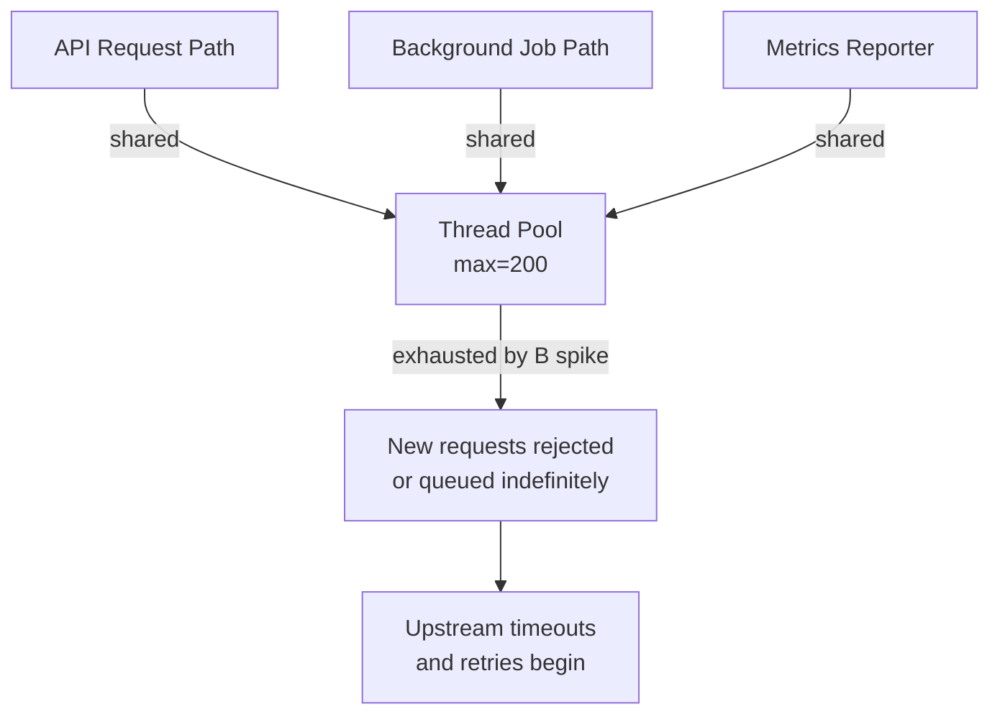
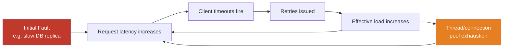
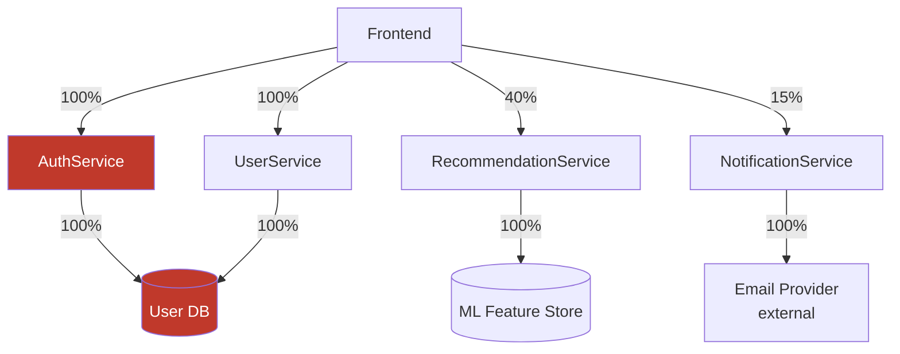

Cascading failure is not a single event — it is a process. A localized fault in one component triggers a sequence of resource exhaustion, timeout amplification, and retry storms that defeat the defenses of adjacent components until the failure envelope engulfs systems that were never directly involved in the original fault. Understanding cascading failure requires understanding the propagation *mechanism*, not just the symptom.
 
The canonical example: a single slow database replica causes query threads to block. Blocked threads hold connection pool slots. The pool exhausts. New requests queue. The queue fills. Upstream services begin timing out. Those timeouts trigger retries. Retries increase load on an already-degraded database. The database degrades further. Services that previously had no database dependency begin failing because they share a JVM thread pool with the services that do. The outage scope has now exceeded the failure domain of the original fault by an order of magnitude.
 
## Propagation Mechanisms
 
Cascades travel through several distinct physical channels. Each has its own propagation speed and intervention point.
 
### Synchronous Call Chain Collapse
 
In a synchronous request graph — where Service A calls B, B calls C, and C calls D — a slowdown at D causes latency amplification at every upstream tier. If each service has a timeout of `T`, the worst-case end-to-end latency is `N * T` where `N` is the chain depth. More critically, if D becomes slow rather than failing outright (the partial failure mode), threads in C accumulate waiting for D responses. C's thread pool is finite. New requests to C begin queueing. B's outbound connections to C begin timing out or blocking. B's pool exhausts. The collapse propagates upstream layer by layer.
 

*Synchronous chain collapse: A times out before D responds, but B and C threads remain blocked, draining their pools for subsequent requests.*
 
The insidious property here is **fan-in amplification**. If 100 clients call A per second and each request makes one call to D with a 30-second timeout, within 30 seconds you have 3,000 blocked threads distributed across the chain. If any tier has a thread pool smaller than 3,000, it is now saturated and refusing new requests.
 
### Resource Contention Propagation
 
Resources that appear unrelated are often co-located: thread pools, connection pools, file descriptor limits, CPU cores, memory, and network buffers are all shared within a process boundary. A failure in one call path consumes these shared resources, starving unrelated call paths.
 
The classic case is a **noisy neighbor** in a microservice: a low-priority background job that runs in the same JVM as a latency-sensitive API. If the background job triggers garbage collection pressure or saturates the connection pool, the API path degrades even though it has no logical dependency on the background job.
 

*Shared thread pool contention: a background job spike starves the API path with no direct logical dependency.*
 
### Retry Amplification
 
Retries are the most common accelerant of cascading failure. A client that retries a failed request three times multiplies the load on a degraded system by 3x. If 10 upstream services all retry three times with no jitter, the degraded system receives 30x its normal request volume at exactly the moment it has the least capacity to handle it.
 
**Exponential backoff without jitter** creates a different pathology: synchronized retry waves. All clients backed off for the same interval (e.g., 2 seconds) will fire their retries simultaneously. The retry thunderclap arrives as a synchronized burst that overwhelms whatever recovery the downstream system has achieved. This pattern is formally called a **retry storm** and is responsible for a disproportionate share of multi-hour outages in production systems.

```mermaid
gantt
    title Synchronized vs. Jittered Retry Waves
    dateFormat ss
    section No Jitter
    Initial burst     :a1, 00, 2s
    Retry wave 1      :a2, 02, 2s
    Retry wave 2      :a3, 04, 2s
    section With Jitter
    Initial burst     :b1, 00, 2s
    Retry (spread)    :b2, 02, 4s
    Retry (spread)    :b3, 05, 4s
```
 

*Without jitter, retries arrive as synchronized bursts that can re-saturate a recovering system. Jitter spreads load across time.*
 
:::danger
Never implement fixed-interval retries in a distributed system. A single service retrying at `baseDelay = 1s` is benign. Fifty services all retrying at `baseDelay = 1s` after a shared dependency degrades is a denial-of-service attack against your own infrastructure. Always combine exponential backoff with full jitter: `delay = random(0, min(cap, base * 2^attempt))`.
:::
 
### Head-of-Line Blocking
 
In systems with FIFO request queues, a single slow request can block all subsequent requests waiting behind it. This is **head-of-line (HOL) blocking**. HTTP/1.1 suffers from this structurally — a slow response on a persistent connection blocks all subsequent requests on that connection. HTTP/2 multiplexing mitigates HOL blocking at the HTTP layer but reintroduces it at the TCP layer (a single packet loss causes all streams to pause while TCP retransmits).
 
In application-level queues — message brokers, work queues, task schedulers — a message that causes a consumer to hang blocks downstream processing of all subsequent messages in that partition. A "poison pill" message (a malformed event that causes an exception on every consumer attempt) can halt an entire Kafka partition indefinitely if the consumer has no dead-letter routing and no maximum delivery attempt limit.
 
## Metastable Failures
 
A **metastable failure** is a cascade that, once triggered, is self-sustaining even after the original fault is removed. The system has entered a new stable state — a degraded equilibrium — from which it cannot recover without external intervention.
 
The mechanism: the system's load-handling behavior under stress introduces a feedback loop that increases stress. Common feedback loops include:
 
- **Retry amplification under load:** The system is overloaded → requests time out → clients retry → load increases → more timeouts → more retries → load increases further. Removing the original fault does not reduce the retry-amplified load; the retries themselves are now the load.
- **GC spirals in JVM services:** Increased latency → requests queue in heap → heap pressure → GC pauses → increased latency. Once the GC pause duration exceeds the request timeout, clients begin failing, then retrying, adding further heap pressure. The system never GCs its way out.
- **Connection pool starvation:** Pool exhausted → requests queue → queue timeout fires → error returned → client retries → pool remains exhausted. Existing connections are held by blocked threads that will not release until their queries complete.

*Metastable failure feedback loop: even after the initial trigger is resolved, retry-amplified load sustains the degraded state.*
 
The defining characteristic of a metastable failure is that **the system cannot self-heal** under its current load. Recovery requires either shedding load (circuit breakers, rate limiting, traffic diversion) or adding capacity faster than the retry amplification consumes it. In practice, the fastest recovery path is aggressive request shedding at the entry point — returning `503 Service Unavailable` for a period allows queues to drain and threads to free, breaking the feedback loop.
 
:::caution
Metastable failures are frequently misdiagnosed during postmortems as "load spikes" because the load *is* elevated by the time anyone is looking at dashboards. The actual trigger — a brief network partition, a transient disk I/O spike, a configuration push — may have resolved minutes before the service entered its self-sustaining degraded state. Postmortem analysis must trace load patterns backward in time to find the original perturbation.
:::
 
## Dependency Graph Analysis
 
Assessing blast radius before a failure occurs requires a precise model of the dependency graph. There are two relevant representations:
 
**Static dependency graph:** Which services call which other services. This can be extracted from service meshes (Istio, Linkerd), API gateways, or distributed tracing data. The static graph tells you which services are *potentially* affected by a given failure.
 
**Dynamic load dependency graph:** How much of each service's request volume depends on which downstream services. This is more operationally relevant. A service may have 10 downstream dependencies, but if 90% of its requests only invoke one of them, a failure in the other nine has limited blast radius in practice.
 

*Weighted dependency graph: UserDB is a critical path dependency (100% of requests transitively depend on it). EmailProvider failure affects only 15% of traffic.*
 
Critical paths — dependency chains that block 100% of user-facing requests — require the highest resilience investment. Non-critical paths (optional features, async enrichments) should be protected by fallbacks that degrade gracefully rather than propagating failures upstream.
 
The single most dangerous graph topology for cascading failure is the **diamond dependency**: two services A and B both depend on service C, and a higher-level service D depends on both A and B. A failure in C causes both A and B to fail, causing D to fail with 2x the failure surface of a linear chain. In large microservice graphs, diamond dependencies are nearly unavoidable, which is why blast radius analysis must account for in-degree, not just path depth.
 
## Failure Propagation Through Shared Infrastructure
 
Beyond application-level dependencies, failures propagate through shared infrastructure layers that no service dependency graph captures.
 
**Shared DNS resolvers:** A DNS resolver overloaded or returning stale records causes every service that uses it to fail name resolution. This is a horizontal propagation path that cuts across all application-level dependency boundaries. In Kubernetes clusters, CoreDNS under load is a known failure mode for this reason.
 
**Shared network fabric:** In multi-tenant Kubernetes nodes, a noisy neighbor that saturates NIC bandwidth or triggers aggressive retransmission storms degrades network throughput for all co-resident pods. This manifests as elevated latency across unrelated services with no apparent application-level dependency.
 
**Shared storage I/O:** NFS mounts, network-attached block storage, and shared disk controllers are notorious serial bottlenecks. A workload that saturates IOPS on a shared storage backend causes all other workloads attached to that backend to experience latency increases — regardless of their application-level dependency graph.
 
**Control plane saturation:** In Kubernetes, etcd write latency impacts the API server, which impacts controller reconciliation loops, which impacts pod scheduling and service endpoint updates. A Kubernetes API server under load can cause new pods to fail scheduling, services to fail endpoint registration, and autoscalers to operate on stale data — all during the exact window when you need the control plane most.
 
:::tip
Instrument shared infrastructure independently from application metrics. etcd latency, CoreDNS query rate, node NIC saturation, and storage IOPS should all have dedicated dashboards and alerts. Application-layer distributed traces will not surface these failure modes because the failure occurs below the application instrumentation boundary.
:::
 
## Blast Radius Containment
 
Containment strategies operate on a spectrum from static architectural decisions to runtime enforcement.
 
**Bulkhead isolation** partitions shared resources (thread pools, connection pools, semaphores) by downstream dependency. A service with three downstream dependencies should have three separate thread pools, sized independently. A failure in dependency C exhausts only C's pool; the pools for A and B remain available. This is the architectural equivalent of watertight compartments in a ship — the failure domain is bounded structurally.
 
**Failure domain segmentation** at the infrastructure level means grouping components by failure domain (rack, availability zone, region) and routing traffic such that a failure in one domain does not trigger cascading load on another. This requires overprovisioning each domain to handle realistic failure scenarios — typically N+1 or N+2 capacity — which is expensive but is the only mechanism that prevents a single AZ failure from propagating to a full-region outage.
 
**Circuit breakers** break the synchronous feedback loop by fast-failing requests to a known-degraded dependency rather than allowing them to block threads. An open circuit breaker converts a thread-blocking failure into an immediate error, allowing the calling service's thread pool to drain. Critically, circuit breakers must be placed *at the dependency boundary*, not at the service entry point.
 
**Load shedding with priority queues** ensures that when total request volume exceeds system capacity, low-priority requests are dropped first. This requires request priority metadata to be propagated end-to-end through headers (e.g., custom `X-Request-Priority` headers respected by all services). Without this, undifferentiated load shedding drops latency-sensitive user requests at the same rate as background health-check traffic.
 
See [Circuit Breaker](/distributed-systems/en/resilience/protection-patterns/circuit-breaker/) for state machine details and tuning parameters.
See [Bulkhead Pattern](/distributed-systems/en/resilience/protection-patterns/bulkhead-pattern/) for thread pool and semaphore isolation implementation.
 
## Analyzing a Cascade Post-Mortem
 
Effective cascade postmortems require reconstructing the timeline with millisecond-level precision. The required data sources:
 
| Signal | What it reveals | Tool |
|--------|-----------------|------|
| Distributed traces | Which service-to-service calls failed first and when | Jaeger, Tempo, Zipkin |
| Thread pool metrics | When pools exhausted, queue depth over time | Prometheus, Dropwizard Metrics |
| Connection pool metrics | Pool wait time, active/idle ratio | HikariCP metrics, pgBouncer stats |
| Circuit breaker state | When CBs opened and what triggered them | Micrometer, custom gauges |
| Infrastructure metrics | CPU, NIC, disk IOPS, memory | Node Exporter, CloudWatch |
| Retry rate | Retries per second from each service | OpenTelemetry counters |
 
The reconstruction goal is to identify the **first anomaly** — the metric that deviated before all others. This is typically not the service that generated the most alerts, but a quiet upstream dependency that crossed a performance cliff. Correlating this first anomaly with infrastructure events (deployments, cron jobs, traffic spikes, configuration changes) reveals the root cause.
 
A critical mistake in postmortems is anchoring on the component that failed most visibly. In a cascade, the loudest failure is usually the most downstream component — the service closest to users that had no circuit breakers and absorbed the full amplified load. The root cause is typically several hops upstream and several minutes earlier.
 
## Quantifying Cascade Risk: Failure Mode and Effects Analysis
 
**Failure Mode and Effects Analysis (FMEA)** adapted for distributed systems produces a risk matrix that quantifies which single-component failures have the highest blast radius. For each component in the dependency graph, estimate:
 
- **Probability of failure** (based on historical incident rate or failure model)
- **Detection time** (how long before monitoring fires an alert)
- **Blast radius** (fraction of total system requests impacted if this component fails)
- **Time to recovery** (mean time to restore, including manual intervention if required)
The product of these four factors — a Risk Priority Number (RPN) — identifies which components deserve architectural hardening investment. Components with high blast radius and high detection time are the most dangerous: they can be silently degrading for minutes before any alert fires, during which time the cascade has already propagated.
 
This analysis invariably surfaces shared infrastructure (databases, caches, service meshes, DNS) as the highest-RPN components, which is why redundancy and multi-AZ deployment for shared infrastructure is not optional in production systems that have SLOs measured in four nines or higher.