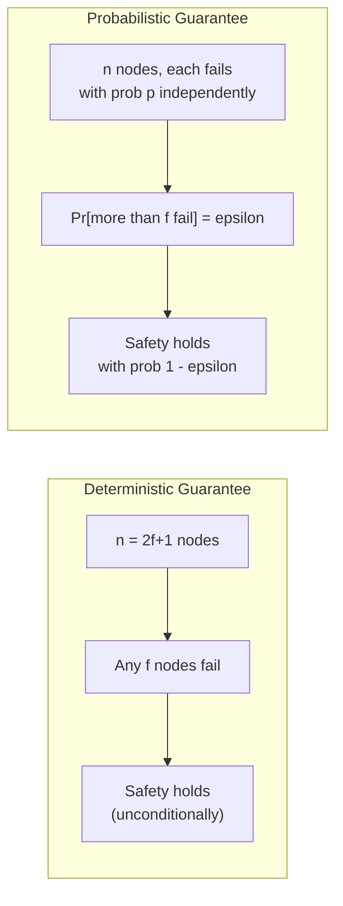
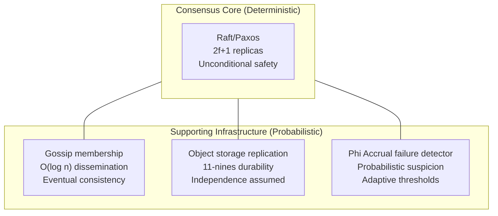

Classical distributed systems theory operates deterministically: a system tolerates f failures if and only if certain structural conditions hold regardless of which f nodes fail or when. This is a clean, provable guarantee. It is also disconnected from the way failures actually happen in production, where nodes do not fail according to adversarial scheduling but according to hardware wear curves, software bug distributions, and correlated environmental conditions.
 
Probabilistic failure models trade the mathematical certainty of deterministic guarantees for a closer match to observable reality. Neither approach is universally superior -- they address different questions and are often used together in the same system.
 
## Deterministic Failure Models: Structure Over Statistics
 
A **deterministic failure model** makes worst-case assumptions about which components can fail and provides guarantees that hold regardless of the failure pattern, as long as the assumed maximum number of failures is not exceeded.
 
The canonical form: a system of n nodes tolerates f failures if any execution in which at most f nodes deviate from correct behavior satisfies the system's safety and liveness properties. This is what Raft's safety proof guarantees -- not "Raft is probably safe with three nodes" but "Raft is safe with three nodes as long as at most one node fails, no matter which node, no matter when."
 
The strength of this guarantee is its unconditional nature. You do not need to know the failure rate of your hardware, the correlation structure of your failure modes, or the statistical distribution of downtime events. If your system has 2f+1 nodes and f or fewer fail simultaneously, the deterministic guarantee holds.
 
The cost is **worst-case pessimism**. Deterministic models must be designed for the worst possible combination of f simultaneous failures. In practice, simultaneous failures are far less likely than sequential ones -- but the deterministic model cannot exploit this because it provides no probability structure over which failure patterns are likely.
 

 
*Deterministic vs. probabilistic guarantees. The deterministic model gives an unconditional bound; the probabilistic model gives a bound that holds with high probability under specific assumptions about failure distributions.*
 
## Failure Rate Arithmetic: MTTF and MTTR
 
Probabilistic models are built on measured failure rates. The two fundamental metrics are:
 
**MTTF (Mean Time to Failure)**: the average time a component operates before failing. For a hard disk, typical MTTF is 1--3 million hours (roughly 100--300 years), but this is an average across millions of drives -- individual drives can fail far sooner.
 
**MTTR (Mean Time to Recovery)**: the average time from failure detection to restoration of correct operation. For a Kubernetes pod restart, MTTR might be 30 seconds. For a disk replacement in a data center, MTTR might be 4--8 hours. For a node requiring manual intervention, MTTR might be days.
 
**Availability** is derived from these two:
 
```
Availability = MTTF / (MTTF + MTTR)
 
Example: disk with MTTF = 100,000 hours, MTTR = 8 hours
Availability = 100,000 / (100,000 + 8) = 99.992%
 
Annual downtime = (1 - 0.99992) * 8760 hours/year = 7 hours/year
```
 
For a system of n **independent** components where the system fails if any component fails (series configuration -- no redundancy):
 
```
System MTTF (series) = MTTF_component / n
 
3 independent disks in series (all must be available):
System MTTF = 100,000 / 3 = 33,333 hours ~= 3.8 years
```
 
For n components where the system fails only if all components fail (parallel configuration -- full redundancy):
 
```
System MTTF (parallel) ~= MTTF_component * (1 + 1/2 + 1/3 + ... + 1/n)
 
3 independent disks in parallel (any one suffices):
System MTTF ~= 100,000 * (1 + 0.5 + 0.33) = 183,333 hours ~= 20 years
```
 
RAID-1 (mirroring) and replication factors in distributed databases are implementations of parallel redundancy. The probabilistic guarantee is that the probability of data loss equals the probability of all replicas failing before any one is repaired.
 
```python
import math
 
def availability_series(component_availability: float, n: int) -> float:
    """System availability when all n components must be available."""
    return component_availability ** n
 
def availability_parallel(component_availability: float, n: int) -> float:
    """System availability when any one of n components suffices."""
    component_unavailability = 1 - component_availability
    return 1 - (component_unavailability ** n)
 
def data_loss_probability_replication(
    annual_failure_rate: float,  # failures per node per year
    mttr_years: float,           # mean time to repair in years
    replication_factor: int
) -> float:
    """
    Probability of data loss per year for a replicated dataset.
    Assumes independent failures and immediate re-replication after repair.
    """
    # Probability that a node fails in any given year
    p_fail = 1 - math.exp(-annual_failure_rate)
    # Probability that all replicas fail before any one is repaired
    # (simplified model: sequential failures within MTTR window)
    p_loss = p_fail
    for i in range(1, replication_factor):
        # conditional probability of losing replica i given i-1 are already lost
        p_loss *= (annual_failure_rate * mttr_years)
    return p_loss
 
# Example: 3-way replication, 4% annual disk failure rate, 8-hour MTTR
afr = 0.04       # 4% annual failure rate
mttr = 8 / 8760  # 8 hours in years
rf = 3
 
p = data_loss_probability_replication(afr, mttr, rf)
print(f"Data loss probability per year: {p:.2e}")
# Output: approximately 2e-9 (2 in a billion per year)
# This is the basis for "11 nines" durability claims in object storage
```
 
## The Independence Assumption and Correlated Failures
 
The arithmetic above assumes **independent failures**: the probability that node B fails is unaffected by whether node A has failed. This assumption is central to probabilistic durability calculations and is routinely violated in production.
 
**Correlated failures** occur when multiple components share a failure mode:
 
- **Common hardware batch**: drives from the same manufacturing batch with a shared defect fail at elevated rates during the same time window. Backblaze's drive reliability data repeatedly shows manufacturer-specific and batch-specific failure rate spikes that are 5--20x higher than the population average.
- **Common power domain**: an AZ power failure takes down all nodes sharing a power feed simultaneously. Three replicas in the same AZ have correlated availability that no amount of replication factor arithmetic can address.
- **Common software version**: a bug introduced in a deployment simultaneously affects all nodes running the same version. The entire fleet fails together in a way that is invisible to failure rate models based on hardware MTTF.
- **Thundering herd on recovery**: when one replica fails and a replacement begins re-replicating, the increased I/O load on surviving replicas raises their failure probability. The second failure is not independent of the first.
The practical consequence: **advertised durability numbers are only valid if the independence assumption holds**. "11 nines" (99.999999999%) annual durability for S3 is derived from probability calculations that assume failures across AZs and hardware batches are independent. If you store all your S3 objects in a single region and that region has a correlated failure event -- as AWS us-east-1 has had multiple times -- the independence assumption fails and the probability calculation becomes meaningless.
 
:::danger
Never use single-region replication for data where durability is critical, regardless of the replication factor or the advertised MTTF of individual components. Correlated failures within a region (power, network, software deployment) can simultaneously affect all replicas. The correct countermeasure is geographic distribution across failure domains that share no common infrastructure -- not a higher replication factor within the same failure domain. Three replicas in one AZ is strictly worse than two replicas in two AZs for correlated failure tolerance.
:::
 
## Probabilistic Quorums
 
Deterministic quorums require strict majorities: in a system of n nodes, at least f+1 correct nodes must participate in every operation. **Probabilistic quorums** (Malkhi et al., 2001) relax this to: a randomly chosen subset of nodes such that any two subsets overlap with high probability.
 
The construction: each operation contacts a random sample of size k from n nodes. The probability that two samples of size k from n nodes do NOT overlap is:
 
```
Pr[no overlap] = C(n-k, k) / C(n, k)
 
For n=1000, k=50:
Pr[no overlap] = C(950, 50) / C(1000, 50) ~= (950/1000)^50 ~= 0.0052
 
=> With k=50 out of 1000 nodes, two random quorums fail to overlap
   with probability ~0.5% -- equivalent to about 2 nines of correctness.
 
For n=1000, k=100:
Pr[no overlap] ~= (900/1000)^100 ~= 2.6e-5
=> ~4.5 nines of correctness with k=100 out of 1000 nodes.
```
 
This scales sublinearly: achieving high-probability overlap in a 1000-node system requires contacting only 100 nodes (10%), compared to 501 nodes (50.1%) for a deterministic majority quorum. The trade-off is probabilistic rather than unconditional correctness -- two concurrent operations may occasionally not observe each other, violating linearizability with small probability.
 
Probabilistic quorums are used in large-scale gossip-based systems and epidemic dissemination protocols where the overhead of contacting a deterministic majority quorum is prohibitive. They are not appropriate for systems where the correctness guarantee must be unconditional (financial transactions, consensus decisions).
 
## Epidemic and Gossip Dissemination
 
**Gossip protocols** use probabilistic models to guarantee eventual information dissemination without requiring any node to know the full membership of the system. Each node periodically selects k random peers and exchanges state. The analysis relies on the theory of epidemics (information spread mirrors disease transmission):
 
```
After t rounds of gossip with fanout k:
Fraction of informed nodes ~= 1 - (1 - 1/n)^(k*t)
 
For n=1000, k=3, t=10:
Fraction ~= 1 - (999/1000)^30 ~= 1 - 0.97 = 0.030
=> Only 3% informed after 10 rounds -- gossip spreads slowly at first.
 
For n=1000, k=3, t=50:
Fraction ~= 1 - (999/1000)^150 ~= 1 - 0.86 = 0.14
=> 14% after 50 rounds.
 
For n=1000, k=3, t=200:
Fraction ~= 1 - 0.74 = 0.26
 
The critical insight: gossip convergence is logarithmic in n.
Full dissemination to all n nodes takes O(log n) rounds,
regardless of n. With n=10^6 nodes and k=3:
Full coverage in ~= log(10^6) / log(3) ~= 13 rounds.
```
 
The logarithmic convergence is why gossip scales to millions of nodes while deterministic broadcast protocols (which require contacting every node) do not. Cassandra uses gossip for cluster membership and failure detection. Consul uses gossip via the SWIM protocol. The probabilistic guarantee is: a piece of information injected into the gossip network reaches all correct nodes within O(log n) rounds with high probability.
 
:::tip
The fanout k in a gossip protocol is a tunable parameter that trades convergence speed against network overhead. k=3 is the common default -- it achieves O(log n) convergence with 3x network amplification per round. Increasing k to 5 or 7 speeds convergence but increases bandwidth consumption proportionally. In practice, tune k based on your convergence time requirement and available bandwidth budget, not as a fixed constant.
:::
 
## Combining Deterministic and Probabilistic Models
 
Production systems routinely combine both approaches. The deterministic model governs the **consensus core** -- the part of the system that must be unconditionally correct. The probabilistic model governs **supporting infrastructure** where statistical guarantees are sufficient.
 

 
*Typical architecture: deterministic consensus at the core with probabilistic supporting infrastructure. Each layer uses the model appropriate to its correctness requirements.*
 
The boundary between the two models must be explicit. A common error is allowing probabilistic infrastructure to feed decisions into deterministic consensus in ways that violate the deterministic model's assumptions. For example: using gossip-based membership to drive quorum membership in a Raft cluster. If the gossip protocol has not converged when a Raft election occurs, different nodes may have different views of cluster membership -- producing quorums that do not actually overlap. The deterministic safety proof assumes a fixed, consistent membership; gossip convergence cannot guarantee this in finite time.
 
The correct approach is to use a deterministic consensus protocol (etcd, ZooKeeper) to manage cluster membership changes, and use gossip only for non-consensus information (health status, load metrics, cache invalidation) where eventual consistency is acceptable.
 
:::note
Probabilistic durability guarantees such as "11 nines of annual durability" are not the same as fault tolerance guarantees. Durability is a statement about the probability of data loss over time. Fault tolerance is a statement about availability during failures. A system can have high durability (data is eventually recoverable) and low availability (data is inaccessible during recovery). MTTF-based calculations address neither the correlated failure problem nor the recovery time problem -- they are useful for hardware provisioning decisions but should not be the primary basis for SLO commitments. See [SLI, SLO, and Error Budgets](/distributed-systems/en/observability/slo-sla-error-budgets/slo/) for how to translate probabilistic failure models into operational commitments.
:::