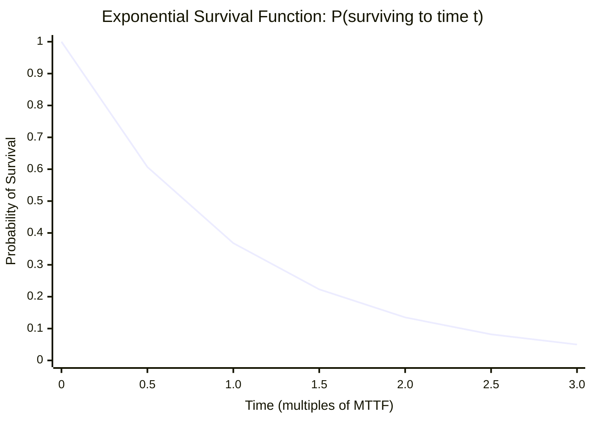
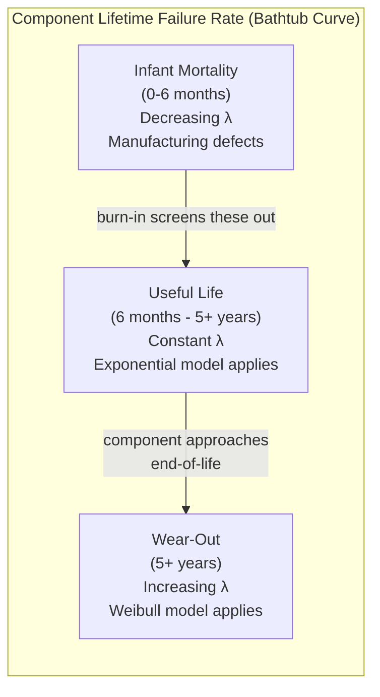
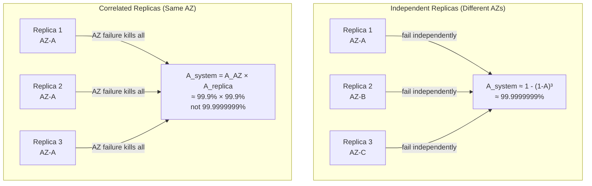
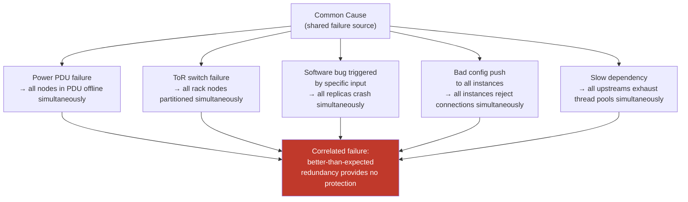
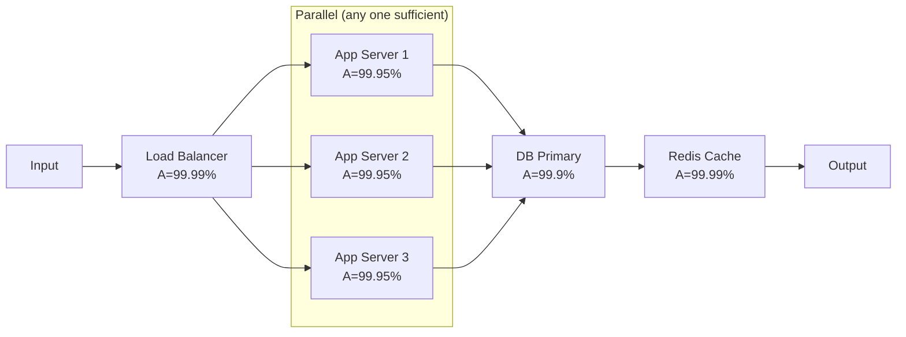

The failure models covered so far — crash-stop, crash-recovery, omission, Byzantine — are **deterministic**: they describe *what kinds* of failures can occur and what properties a correct algorithm must maintain in their presence. They say nothing about *how often* failures occur or whether multiple components are likely to fail simultaneously. For algorithm correctness proofs, this is the right level of abstraction. For capacity planning, replication factor decisions, SLO budgeting, and infrastructure cost optimization, it is entirely insufficient.
 
**Probabilistic failure models** complement deterministic models by quantifying failure rates, failure distributions over time, and the statistical relationships between failures in different components. They answer the questions that deterministic models deliberately leave unanswered: what is the probability that all three replicas of a shard fail simultaneously? How many nines of availability does a given architecture actually deliver? How long until the first disk failure in a cluster of 10,000 drives?
 
These are not academic questions. Every replication factor decision, every SLO commitment, and every capacity reserve is implicitly a probabilistic claim. Making those claims explicit and grounding them in accurate statistical models is the difference between a system design that meets its availability targets and one that fails them in ways that surprise its operators.
 
## The Exponential Distribution: The Memoryless Component
 
The foundational model for hardware and software component failure rates is the **exponential distribution**. A component with exponential failure rate `λ` (failures per unit time) has survival function:
 
```
P(component survives to time t) = e^(-λt)
```
 
The exponential distribution has a unique property: **memorylessness**. The probability that a component fails in the next hour is the same regardless of how long it has already been running. A component that has been operating for 10,000 hours is no more or less likely to fail in the next hour than a brand-new one.
 
This is captured by the **failure rate** (hazard function), which for an exponential distribution is the constant `λ` at all times. The mean time to failure (MTTF) is simply:
 
```
MTTF = 1 / λ
```
 
A hard disk rated at 1.5 million hour MTTF has `λ = 1 / 1,500,000 ≈ 6.67 × 10⁻⁷` failures per hour. In a cluster of 10,000 such disks:
 
```
Cluster failure rate = 10,000 × λ = 10,000 / 1,500,000 ≈ 0.00667 failures/hour
Expected time between disk failures in cluster = 1 / 0.00667 ≈ 150 hours ≈ 6.25 days
```
 
This arithmetic is the reason storage systems at scale require continuous background repair: with 10,000 drives, the expected interval between drive failures is less than a week — regardless of the individually excellent MTTF rating of each drive.
 

*Exponential survival: by time t = MTTF, only 36.8% of components are still operating — not 50%. Half-life occurs at 0.693 × MTTF. A component rated at 1M hour MTTF has a 63.2% chance of failing before reaching 1M hours.*
 
The memorylessness assumption is accurate for electronic components during their **useful life period** — after infant mortality failures (early manufacturing defects) have been screened out and before wear-out begins. It is less accurate at end-of-life, where accumulated wear increases failure probability — a region better described by the Weibull distribution.
 
### The Bathtub Curve
 
The empirical failure rate of hardware components over their lifetime follows a characteristic **bathtub curve** with three phases:
 
**Infant mortality phase (decreasing failure rate):** Manufacturing defects, solder joint weaknesses, and early-life process variations cause elevated failure rates in the first weeks to months of operation. Enterprise hardware vendors typically burn-in components before shipping to screen out infant mortality failures.
 
**Useful life phase (constant failure rate):** The component operates in its designed operating regime. Failures are random and memoryless — the exponential model applies here.
 
**Wear-out phase (increasing failure rate):** Mechanical wear (spinning disk actuator bearings, fan bearings), electromigration in conductor paths, capacitor aging, and oxide degradation cause failure rates to increase. SSD NAND flash wear, measured in program-erase (P/E) cycles, is a well-characterized wear-out mechanism: a consumer-grade TLC NAND SSD rated at 300 P/E cycles per cell will show increasing uncorrectable error rates as it approaches that limit.
 

*The bathtub curve: exponential (constant failure rate) model is appropriate only during the useful life phase. Enterprise burn-in testing eliminates the infant mortality phase before deployment.*
 
## The Weibull Distribution: Modeling Wear-Out
 
The **Weibull distribution** generalizes the exponential by introducing a shape parameter `β` that captures whether failure rate is increasing, constant, or decreasing over time:
 
```
Failure rate (hazard function) h(t) = (β/η) × (t/η)^(β-1)
```
 
Where `η` (eta) is the characteristic life (scale parameter) and `β` (beta) is the shape parameter:
 
- `β < 1`: Decreasing failure rate (infant mortality phase)
- `β = 1`: Constant failure rate (reduces to exponential distribution, useful life phase)
- `β > 1`: Increasing failure rate (wear-out phase)
- `β ≈ 2-4`: Typical for mechanical wear-out (bearing failures, actuator fatigue)
- `β ≈ 3-5`: Typical for SSD NAND wear-out, capacitor aging
For capacity planning purposes, the Weibull model is used when components have known wear mechanisms — spinning disk drive bearings, SSD P/E cycle limits, battery state-of-health degradation, and fan bearing lifetimes are all cases where `β > 1` provides materially better failure rate predictions than the exponential model.
 
```python
import numpy as np
from scipy.stats import weibull_min
 
def component_reliability_analysis(
    beta: float,      # Shape parameter
    eta: float,       # Scale parameter (characteristic life in hours)
    t: float          # Time to evaluate (hours)
) -> dict:
    """
    Compute key reliability metrics for a Weibull-distributed component.
    
    For a disk with beta=2.5, eta=40000 hours (4.6 years characteristic life):
    - Survival at t=8760 (1 year): ~96.5%
    - Survival at t=26280 (3 years): ~73.4%
    - Survival at t=43800 (5 years): ~36.1%
    """
    # Survival function P(T > t)
    survival = np.exp(-(t / eta) ** beta)
 
    # Hazard (instantaneous failure rate at time t)
    hazard = (beta / eta) * (t / eta) ** (beta - 1)
 
    # Mean time to failure (Weibull MTTF)
    from scipy.special import gamma
    mttf = eta * gamma(1 + 1/beta)
 
    return {
        "survival_probability": survival,
        "instantaneous_failure_rate_per_hour": hazard,
        "mttf_hours": mttf,
        "mttf_years": mttf / 8760,
    }
 
# Example: Enterprise SSD with wear-out characteristics
ssd = component_reliability_analysis(beta=3.0, eta=50000, t=26280)
# After 3 years (26280 hours):
# survival: ~81.2%, hazard rate increasing vs. new drive
```
 
## Availability: Steady-State Probability of Correct Operation
 
A single component's **availability** `A` is the long-run fraction of time it operates correctly:
 
```
A = MTTF / (MTTF + MTTR)
```
 
Where MTTR is the **Mean Time To Repair** — the average duration of a failure event, from first detection through diagnosis, repair, and restoration to service.
 
For a database primary with MTTF = 10,000 hours and MTTR = 2 hours:
 
```
A = 10,000 / (10,000 + 2) = 0.9998 = 99.98% availability
```
 
This sounds excellent until you consider that:
- 99.98% availability means 1.75 hours of downtime per year.
- In a cluster with 100 such primaries, the expected number experiencing downtime in any given hour is 100 × (1 - 0.9998) = 0.02 primaries — about one failure every 50 hours, or roughly 175 failures per year across the cluster.
The **downtime budget** derivation makes availability targets concrete:
 
| Availability | Annual downtime | Monthly downtime |
|---|---|---|
| 99% ("two nines") | 87.6 hours | 7.3 hours |
| 99.9% ("three nines") | 8.76 hours | 43.8 minutes |
| 99.99% ("four nines") | 52.6 minutes | 4.4 minutes |
| 99.999% ("five nines") | 5.26 minutes | 26.3 seconds |
| 99.9999% ("six nines") | 31.5 seconds | 2.6 seconds |
 
:::caution
MTTF figures in vendor datasheets are derived from accelerated life testing on small samples under controlled conditions, then extrapolated to field conditions. The actual field MTTF for storage devices can differ from datasheet MTTF by a factor of 2-5×, with the datasheet typically being optimistic. Google's 2007 disk drive failure study (Pinheiro et al.) found that drives operating at moderate temperatures (30-45°C) had field failure rates 2-3× higher than manufacturer-stated AFR (Annual Failure Rate) figures. Capacity planning should use actual field failure rates from operational data, not datasheets.
:::
 
## Composing Availabilities: Series and Parallel Systems
 
Real systems are composed of multiple components. How independent component availabilities combine depends on the system's fault tolerance architecture.
 
### Series Systems (All Components Required)
 
In a series system, every component must be available for the system to function. Unavailability in any component causes system unavailability. The system availability is the product of individual availabilities:
 
```
A_series = A₁ × A₂ × A₃ × ... × Aₙ
```
 
For a three-tier system (load balancer A=99.99%, application server A=99.95%, database A=99.9%):
 
```
A_series = 0.9999 × 0.9995 × 0.999 = 0.9984 = 99.84%
```
 
The weakest component dominates. Adding a highly available load balancer barely matters when the database limits the system to 99.9%.
 
### Parallel Systems (Redundancy)
 
In a parallel system, the system is available as long as at least one of `n` redundant components is available. Assuming independent failures:
 
```
A_parallel = 1 - (1 - A)ⁿ
```
 
For three replicas each with A = 99.9%:
 
```
A_parallel = 1 - (1 - 0.999)³ = 1 - (0.001)³ = 1 - 10⁻⁹ = 99.9999999%
```
 
This number is misleadingly optimistic for two reasons.
 
**The independence assumption is almost always violated.** Replicas sharing a power domain, a network switch, a Kubernetes node pool, or a cloud availability zone are not independent — they share failure modes. A power outage that kills one replica kills all replicas in the same rack. The formula `1 - (1-A)ⁿ` assumes no common cause failures; reality includes them abundantly.
 
**MTTR is not zero.** The formula computes the probability that all replicas are simultaneously unavailable at a random moment, assuming failures are independent and instantaneous to detect and repair. In practice, the interval between detection of the first failure and completion of recovery includes health check intervals, automated failover delays, backup promotion time, and log catchup time. During this MTTR window, the system is operating with reduced redundancy — a single additional failure during this window causes total unavailability.
 

*The independence assumption: replicas in different AZs achieve independence; replicas in the same AZ share a correlated failure mode that destroys the product formula.*
 
## Correlated Failures: The Dominant Risk at Scale
 
In practice, the dominant availability risk for distributed systems is not independent component failure — it is **correlated failure**: multiple components failing due to the same underlying cause.
 
### Common Cause Failures
 
**Shared infrastructure:** Power distribution units, cooling systems, network switches, and top-of-rack switch uplinks are single points of failure for all components behind them. A rack-level power failure takes down all nodes in that rack simultaneously. A ToR switch failure isolates all nodes in the rack simultaneously.
 
**Software bugs:** A bug in a database engine, Kafka broker, or container runtime that causes a crash on a specific input is a correlated failure waiting to happen. If all replicas run the same software version and all receive the same input, all crash simultaneously. Rolling deployments reduce this risk by staging the update, but a correlated crash triggered by a data pattern in the live stream affects all replicas that have received the update.
 
**Configuration changes:** A misconfigured resource limit, a wrong TLS certificate, or an erroneous network policy pushed simultaneously to all instances is a correlated failure. This is the most common source of large-scale outages: changes applied simultaneously to all components, defeating the redundancy that protects against individual component failure.
 
**Overload cascades:** A single slow dependency causing all upstream services to exhaust their thread pools simultaneously is a correlated failure. The dependency's slowness is the common cause; the simultaneous exhaustion is the correlated effect.
 

*Common cause failures defeat independent redundancy: the failure probability is that of the common cause, not the product of independent replica failure probabilities.*
 
### Modeling Correlated Failures: The Beta-Binomial Model
 
A simple model for correlated failures supplements the independent failure probability `p` with a correlation parameter `ρ` (rho) that captures the probability that, given one replica fails, other replicas fail simultaneously.
 
Under independent failures, the probability that all `k` of `n` replicas fail simultaneously is `p^k`. Under correlated failures with correlation `ρ`:
 
```
P(all k replicas fail) ≈ ρ × p + (1 - ρ) × p^k
```
 
The `ρ × p` term represents the probability that a common-cause event fails all replicas simultaneously. Even for a small `ρ = 0.01` and individual replica failure probability `p = 0.001`:
 
```
P(all 3 replicas fail, independent): 0.001³ = 10⁻⁹
P(all 3 replicas fail, ρ=0.01):    0.01 × 0.001 + 0.99 × 0.001³
                                   = 0.00001 + ~0   ≈ 10⁻⁵
```
 
Introducing 1% correlation increases the probability of total failure by four orders of magnitude. The practical implication: **achieving high availability requires minimizing correlation through architectural isolation, not just adding more replicas**.
 
## MTTF, MTTR, and the Recovery Rate
 
The availability formula `A = MTTF / (MTTF + MTTR)` makes clear that both MTTF and MTTR are design variables. For very high availability targets, MTTR is often the binding constraint.
 
Consider a target of 99.999% availability (five nines). With a given MTTF of 10,000 hours:
 
```
0.99999 = 10,000 / (10,000 + MTTR)
10,000 + MTTR = 10,000 / 0.99999 = 10,000.1
MTTR = 0.1 hours = 6 minutes
```
 
**A five-nines availability target with a 10,000-hour component MTTF requires a maximum MTTR of 6 minutes.** This is not a monitoring tuning problem — it is an architectural one. Six minutes from first component failure to full restoration of service requires:
 
- Automated failure detection with subsecond precision (health check intervals of 1-5 seconds, not minutes).
- Automated failover without human intervention (no paging an on-call engineer).
- Pre-warmed standby instances that can serve traffic immediately on promotion.
- Replica catch-up that completes in under 2-3 minutes (imposing constraints on maximum replication lag and WAL replay speed).
This is why five-nines systems are almost never the result of more reliable components — the component failure rates required would be unachievably high. They are the result of fast automated recovery from the frequent failures that inevitably occur.
 
```go
// Availability model: computing required MTTR for a given availability target
func requiredMTTR(targetAvailability float64, mttfHours float64) float64 {
    // From A = MTTF / (MTTF + MTTR):
    // MTTR = MTTF * (1/A - 1) = MTTF * (1 - A) / A
    return mttfHours * (1 - targetAvailability) / targetAvailability
}
 
func componentsMTTF(individualMTTF float64, n int) float64 {
    // For n identical independent components in a cluster:
    // Cluster MTTF = individual MTTF / n (first failure expected at 1/nλ)
    return individualMTTF / float64(n)
}
 
func main() {
    individualDiskMTTF := 1_500_000.0 // hours
    clusterSize := 10_000
 
    clusterFirstFailureMTTF := componentsMTTF(individualDiskMTTF, clusterSize)
    fmt.Printf("Expected hours between disk failures in %d-node cluster: %.1f (%.1f days)\n",
        clusterSize, clusterFirstFailureMTTF, clusterFirstFailureMTTF/24)
 
    // Required MTTR for 99.99% availability with this cluster failure rate
    requiredMTTRHours := requiredMTTR(0.9999, clusterFirstFailureMTTF)
    fmt.Printf("Required MTTR for 99.99%% availability: %.2f hours (%.0f minutes)\n",
        requiredMTTRHours, requiredMTTRHours*60)
    // Output:
    // Expected hours between disk failures in 10000-node cluster: 150.0 (6.3 days)
    // Required MTTR for 99.99% availability: 0.02 hours (1 minutes)
}
```
 
## Reliability Block Diagrams and Fault Trees
 
For complex systems with mixed series and parallel components, **Reliability Block Diagrams (RBDs)** provide a structured method for computing system availability from component-level availabilities.
 
An RBD represents the system as a network of blocks (components) where:
- Blocks in **series** (sequential path) model components where all must function.
- Blocks in **parallel** (redundant paths) model components where any one suffices.

*Reliability Block Diagram: parallel app servers compose to high availability; the series database primary is the system's availability bottleneck.*
 
For this RBD:
```
A_app_tier = 1 - (1 - 0.9995)³ = 1 - (0.0005)³ ≈ 1 - 1.25×10⁻¹⁰ ≈ 99.9999999%
A_system = 0.9999 × 0.99999999 × 0.999 × 0.9999 ≈ 0.9988 = 99.88%
```
 
The database primary at 99.9% dominates and limits the system to 99.88% regardless of how many app servers are added. This analysis surfaces the correct investment: improving database availability (via synchronous replication to a hot standby, active-active configuration, or reducing MTTR) yields far more system availability improvement than adding more app servers to an already highly available tier.
 
**Fault Tree Analysis (FTA)** takes the dual perspective: starting from an undesired top-level event (system unavailability) and working backward through AND/OR gates to identify the component failure combinations that cause it. AND gates (all conditions required for the top event) correspond to series components; OR gates (any condition sufficient) correspond to parallel components.
 
FTA is particularly useful for identifying **cut sets** — minimal sets of component failures that cause system failure. A single-element cut set is a single point of failure. A two-element cut set is a double point of failure that must be considered in capacity planning.
 
## Probabilistic Failure Models in Practice: Replication Factor Decisions
 
The most direct application of probabilistic failure modeling in distributed systems is choosing replication factors for data storage.
 
The question is: what replication factor `r` is required such that the probability of losing all `r` replicas simultaneously is below some threshold `p_max`?
 
Under independent failures with per-replica annual failure probability `q`:
 
```
P(all r replicas fail within window W) ≈ q^r  (for small q, short window W)
```
 
For a storage system targeting durability of 99.999999999% (eleven nines, or one-in-ten-billion annual data loss probability) with per-drive annual failure probability q = 0.005 (0.5% AFR):
 
```
0.005^r ≤ 10⁻¹¹
r × log(0.005) ≤ -11
r ≥ 11 / log(1/0.005) = 11 / 2.301 ≈ 4.78
```
 
Five replicas suffices — under the independence assumption.
 
Accounting for correlated failures changes the calculus fundamentally. If replicas are co-located in the same datacenter, a datacenter-level event (power outage, fire, cooling failure) that occurs with probability `p_dc_failure = 10⁻⁴` per year fails all replicas simultaneously regardless of the replication factor. To achieve eleven-nines durability with `p_dc_failure = 10⁻⁴`, replicas must span at least two geographically independent datacenters:
 
```
P(data loss) = P(both DCs fail within window W) ≈ p_dc₁ × p_dc₂
             = 10⁻⁴ × 10⁻⁴ = 10⁻⁸
```
 
Still not eleven nines. Three independent geographic locations:
```
P(data loss) ≈ (10⁻⁴)³ = 10⁻¹² < 10⁻¹¹
```
 
This is the quantitative basis for the standard practice of distributing replicas across at least three geographically independent failure domains for durable storage systems.
 
:::note
Google Colossus, Amazon S3, and Azure Blob Storage all use erasure coding (Reed-Solomon or similar) rather than simple replication for long-term data durability. Erasure coding with `(n, k)` parameters stores data as `k` data shards and `n-k` parity shards; any `k` of the `n` shards can reconstruct the data. This achieves higher durability per unit of storage overhead compared to full replication. For example, RS(6,3) (6 data + 3 parity shards, tolerates any 3 simultaneous shard losses) achieves similar or better durability to 3× replication at 1.5× the storage overhead instead of 3×.
:::
 
## The Relationship Between Deterministic and Probabilistic Models
 
Deterministic and probabilistic failure models are not competing frameworks — they operate at different levels of abstraction and answer different questions.
 
**Deterministic models** (crash-stop, omission, Byzantine) establish **correctness guarantees**: under these worst-case failure assumptions, the algorithm produces the right answer. They make no claims about frequency.
 
**Probabilistic models** establish **likelihood bounds**: given realistic failure rates and correlations, how likely is each failure scenario, and what is the expected system behavior over time?
 
A complete system analysis requires both:
1. **Correctness analysis (deterministic):** Does the system produce correct results when up to `f` components fail according to the failure model? If the answer is no, fix the algorithm regardless of probability.
2. **Availability analysis (probabilistic):** Given actual failure rates and correlations, how often does the system reach a state where `f` or more components have failed? This determines whether the theoretical fault tolerance is exercised rarely or constantly.
The combination yields the correct engineering decisions: a system with perfect BFT algorithm correctness but co-located replicas that share a power domain will experience correlated failures that defeat the BFT guarantees routinely. The algorithm is correct; the deployment is wrong.
 
| Question | Model | Tool |
|---|---|---|
| Can the algorithm produce wrong results when f nodes are Byzantine? | Deterministic | Byzantine agreement proof |
| How often do f or more nodes actually fail in this cluster? | Probabilistic | MTTF/availability calculations |
| What is the probability of total data loss? | Probabilistic | Replication factor + correlation analysis |
| Is 3× replication sufficient for our durability SLA? | Probabilistic | Durability probability calculation |
| Does our consensus algorithm maintain safety during a partition? | Deterministic | Safety proof (CAP/Raft invariants) |
| How long is the partition likely to last in this network? | Probabilistic | Network reliability statistics |
 
See [Failure Propagation: Cascading Failure Analysis](/distributed-systems/en/foundations/system-models/cascading-failure/) for how probabilistic independent failures are amplified into correlated outages through retry storms and resource exhaustion.
See [Replication Strategies](/distributed-systems/en/data-management/replication/) for how these durability probability calculations translate into specific replication topology decisions.