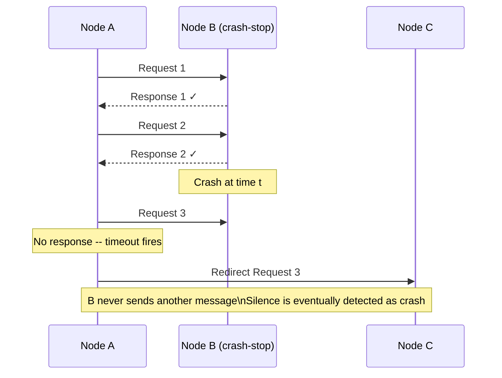
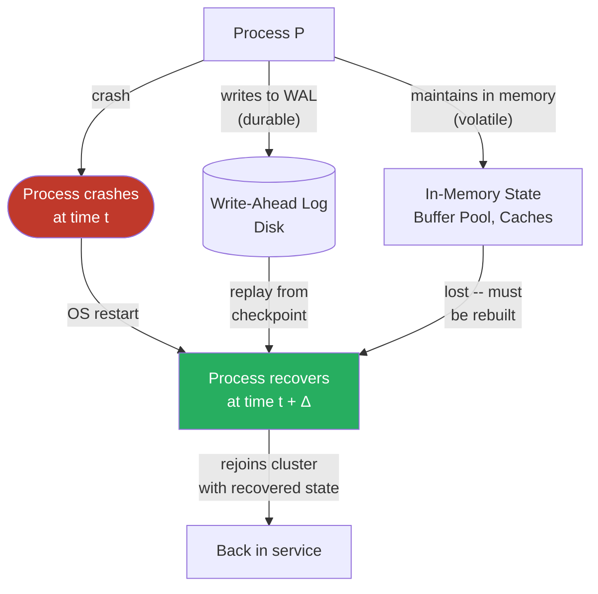
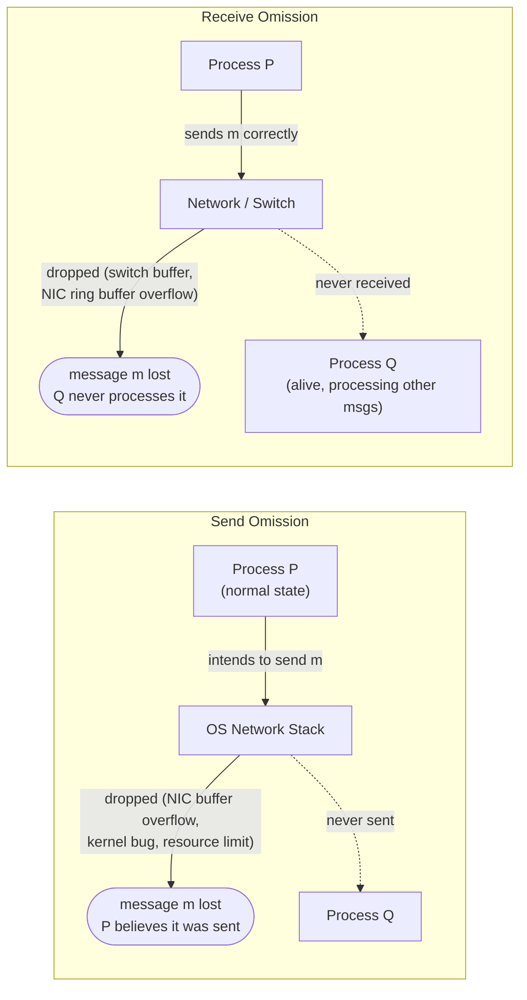
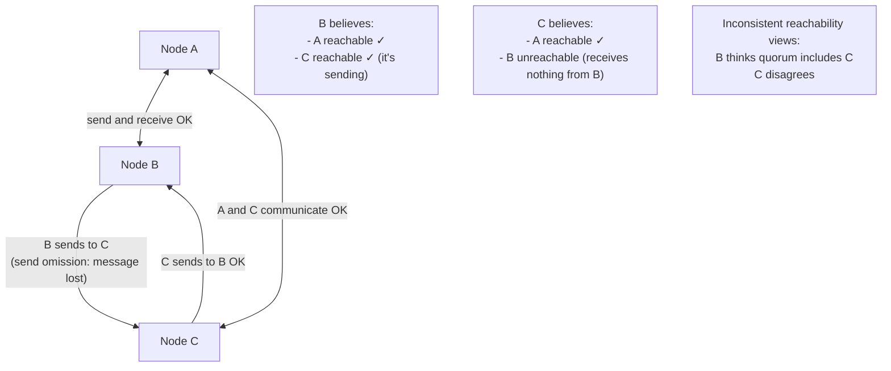
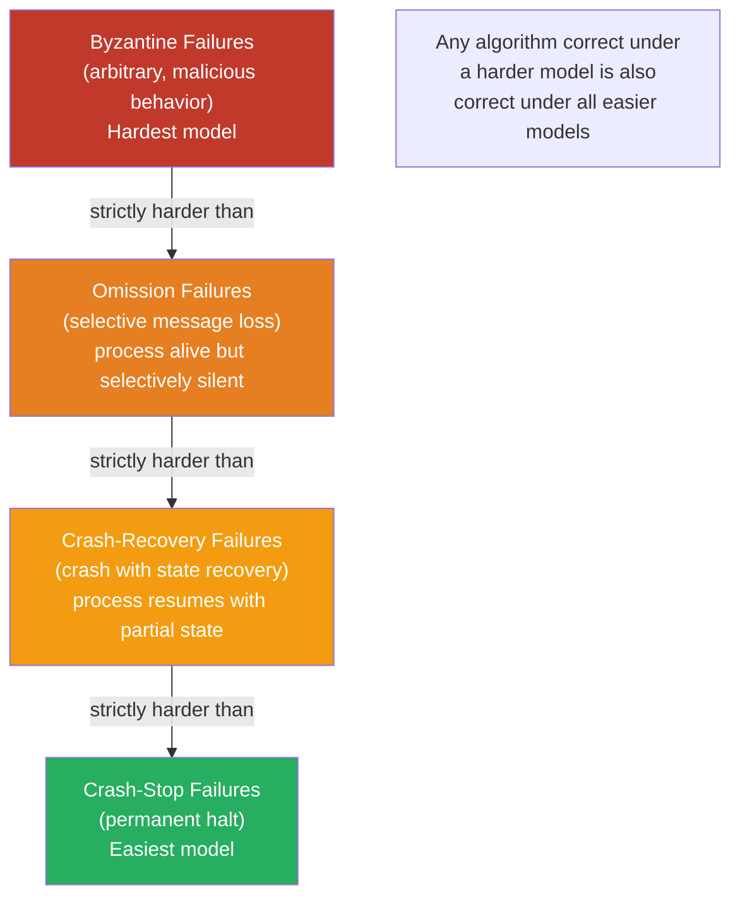

Distributed systems fail constantly, but not all failures are equivalent. A process that halts permanently presents a fundamentally different challenge than one that halts and restarts with partial memory, and both differ from a process that continues executing while selectively dropping messages. These distinctions are not taxonomic pedantry — the failure model a system tolerates determines the algorithms available to it, the safety properties it can guarantee, and the operational response required when failure occurs.
 
Failure models form a strict hierarchy by the strength of their assumptions. Weaker assumptions (more failure modes tolerated) require more complex algorithms and provide stronger real-world guarantees. Stronger assumptions (fewer failure modes tolerated) enable simpler algorithms but break when reality violates the assumption. Most catastrophic production incidents happen exactly at this boundary: systems designed for the simpler failure model encountering a failure that belongs to a harder one.
 
## Crash-Stop (Fail-Stop) Failures
 
The **crash-stop** model, also called **fail-stop**, is the simplest and most benign failure model. A process in this model:
 
1. Operates correctly until some moment `t`.
2. At time `t`, permanently stops executing — no further messages are sent, no further state transitions occur.
3. Other processes can *eventually* detect the crash (with the help of a failure detector).
The defining property is permanence combined with completeness: once a process stops, it never restarts, and its silence is eventually distinguishable from a slow process (given a failure detector of sufficient quality).
 

*Crash-stop behavior: normal operation until the crash moment; after the crash, permanent silence with no partial or inconsistent responses.*
 
### Algorithmic Properties Under Crash-Stop
 
The crash-stop model is attractive for algorithm designers because it eliminates a whole class of ambiguity: a crashed process never sends incorrect messages. Any message that arrives is authentic and correct — the concern is only about missing messages, not malformed or contradictory ones.
 
Under crash-stop with a perfect failure detector (◇P), **consensus** is solvable with `f+1` processes that can tolerate `f` crash failures. The Paxos algorithm, in its simplest analysis, assumes crash-stop semantics: a proposer that stops hearing from an acceptor during the prepare phase can safely conclude that acceptor has crashed and proceed with a quorum that excludes it.
 
**Reliable broadcast** under crash-stop requires only `f+1` correct processes (out of `n` total) to ensure delivery to all correct processes. The standard **Eager Reliable Broadcast** protocol retransmits messages from crashed sources: when a process receives a message `m` from source `p` for the first time, it rebroadcasts `m` to all. This works under crash-stop because a crashed process never sends a partially consistent set of messages — it either sent the full message before crashing or sent nothing.
 
### The Idealization Problem
 
Crash-stop is an idealization that real systems approximate but never fully satisfy.
 
A process does not always crash cleanly. It may:
- Crash while writing to a socket, sending a partial message that corrupts the receiver's protocol state.
- Crash while holding a distributed lock, causing dependent processes to block until the lock times out.
- Crash while partway through a disk write, leaving persistent state in an inconsistent intermediate form.
- Have its OS send a TCP RST to active connections as part of socket cleanup, notifying peers of the crash — this is closer to fail-stop behavior.
The "permanent" aspect of crash-stop is also frequently violated in practice. A process killed by the OS out-of-memory killer may be automatically restarted by a process supervisor (systemd, Kubernetes). From the perspective of the distributed algorithm, what appears as a crash-stop failure is actually a crash-recovery failure with a brief recovery window. If the algorithm made decisions based on the assumption that the crashed process was permanently gone, those decisions may be incorrect.
 
:::caution
Kubernetes `Deployment` restarts — where a crashed pod is replaced by a new pod with the same service identity but fresh state — present as crash-recovery failures to the distributed system, not crash-stop failures. Algorithms that assume a crashed participant never returns must account for this: in Raft, a restarted node must replay its log from its peers before participating in quorum decisions. In ZooKeeper, a restarted server must synchronize its data tree from the leader before rejoining the ensemble.
:::
 
## Crash-Recovery (Fail-Recovery) Failures
 
The **crash-recovery** model relaxes the permanence assumption: a process may crash and later resume execution. The resumption may begin from:
 
- **Persistent state**: data written to durable storage (disk, NVMe, remote storage) before the crash is available on recovery.
- **Volatile state**: data held only in memory is lost at the crash boundary.
This single distinction — what survives the crash — drives the entire design of crash-recovery algorithms. Durable writes are expensive (fsync, write-ahead logs, synchronous replication); the question is which writes must be durable and which can safely remain volatile.
 

*Crash-recovery: persistent state survives the crash boundary and is replayed during recovery; volatile state must be rebuilt from authoritative sources.*
 
### What Must Be Durable
 
The fundamental question in crash-recovery design is **what the system cannot afford to lose**. The answer divides system components into different durability tiers:
 
**Tier 1 — Must survive any crash, unconditionally:**
- Transaction log entries that have been acknowledged to clients
- Write-ahead log records for in-progress transactions
- Cluster membership and configuration state
- Leader election epoch/term numbers (Raft's `currentTerm`, Paxos ballot numbers)
If Raft's `currentTerm` is lost on crash, a restarted node may accept a vote request from a stale leader that was already superseded — violating the single-leader guarantee. This is why Raft requires `currentTerm`, `votedFor`, and `log[]` to be stored on stable (durable) storage and synced before responding to any RPC.
 
**Tier 2 — Durable but can be rebuilt at higher cost:**
- Database page cache contents (can be rebuilt from disk, but slowly)
- Secondary index structures (can be rebuilt from primary storage)
- Query result caches (can be recomputed)
**Tier 3 — Volatile, loss is acceptable:**
- In-flight request buffers
- Connection state
- Pre-computed aggregates used only for performance
```go
// Raft persistent state: must be written to stable storage
// before responding to any RPC, as per the Raft paper specification
type RaftPersistentState struct {
    CurrentTerm int64  // Latest term seen (monotonically increasing)
    VotedFor    *int64 // CandidateId voted for in current term (nil if none)
    Log         []LogEntry // Log entries; each entry contains command + term
}
 
func (r *Raft) persist() error {
    // Must complete a durable write before this function returns.
    // Using fsync or equivalent to ensure data reaches stable storage.
    state := RaftPersistentState{
        CurrentTerm: r.currentTerm,
        VotedFor:    r.votedFor,
        Log:         r.log,
    }
    data, err := encodeState(state)
    if err != nil {
        return fmt.Errorf("encoding persistent state: %w", err)
    }
    // Write to WAL, then fsync -- not just write()
    if err := r.storage.WriteAndSync(data); err != nil {
        return fmt.Errorf("persisting raft state: %w", err)
    }
    return nil
}
 
// Called before responding to RequestVote or AppendEntries
func (r *Raft) handleRequestVote(args RequestVoteArgs) (RequestVoteReply, error) {
    r.mu.Lock()
    defer r.mu.Unlock()
 
    // ... voting logic ...
 
    // Persist before replying -- violating this ordering breaks safety
    if err := r.persist(); err != nil {
        return RequestVoteReply{}, err
    }
    return reply, nil
}
```
 
### Recovery Protocol Requirements
 
Under crash-recovery, algorithms must handle three distinct scenarios that do not arise under crash-stop:
 
**Stale state on recovery.** A process recovers with persistent state that reflects the world as it was at the crash time. The world has since moved on: other nodes have made decisions, log entries have been committed, cluster membership may have changed. The recovering process must catch up before it can safely participate in quorum operations.
 
In Raft, a recovering follower uses the normal `AppendEntries` RPC to catch up from the current leader. The leader sends log entries from the point where the follower diverged. The follower cannot vote or serve reads until it has received and applied all committed entries.
 
**Zombie processes.** A process that crashes and recovers quickly may find that other nodes have already taken action assuming it was permanently gone — elected a new leader, removed it from the ISR, expired its distributed lock. The recovered process must recognize it has been superseded and defer to the current cluster state rather than acting on its pre-crash authority.
 
The standard mechanism is **epoch/generation numbering**: each new leadership term, cluster epoch, or lock generation carries a monotonically increasing number. A process that recovers with epoch `n` and finds the cluster operating at epoch `n+3` knows it missed three state transitions and must resynchronize rather than act.
 
**Amnesia attacks.** A particularly dangerous scenario occurs when a process recovers with persistent state that is internally consistent but out of date in a way that could cause it to act against the current cluster consensus. For example: a Raft node that persisted `votedFor = Node A` in term 5, then crashed before learning that Node B won the election and committed entries in terms 5 and 6. On recovery, the node correctly knows it voted for A in term 5 — but the cluster has moved to term 7. If the node incorrectly concludes it can grant a vote to A in term 5 again, it could violate Raft's safety invariant.
 
Raft handles this via term numbers: a node that receives any RPC with a higher term than its own immediately updates its term to that value and transitions to follower state. The durable `currentTerm` ensures this check is performed correctly after recovery.
 
### Crash-Recovery in Practice: PostgreSQL and fsync
 
PostgreSQL's crash recovery protocol is the canonical real-world implementation of crash-recovery semantics. Its Write-Ahead Log (WAL) ensures that every committed transaction is recorded durably before the commit acknowledgment is sent to the client.
 
```sql
-- PostgreSQL WAL configuration for durability
-- These settings determine the crash-recovery guarantee
 
-- synchronous_commit: controls when WAL is flushed
-- 'on' (default): WAL flushed to disk before commit ACK -- full crash-safety
-- 'local': WAL flushed locally but not to sync replicas -- local crash-safe
-- 'off': WAL buffered -- risk of data loss on crash, ~3x write throughput gain
SET synchronous_commit = on;
 
-- wal_sync_method: how WAL flushes are implemented
-- 'fdatasync' or 'fsync': OS-level durability guarantee
-- 'open_datasync': direct I/O -- bypasses OS buffer cache
SHOW wal_sync_method;
 
-- checkpoint_completion_target: fraction of checkpoint interval
-- used to spread checkpoint I/O, reducing fsync spike latency
SET checkpoint_completion_target = 0.9;
```
 
The 2018 PostgreSQL `fsync` data loss bug demonstrated the consequence of violating crash-recovery semantics: on some Linux kernel versions, a failed `fsync` call returned success while leaving the WAL buffer in a state that subsequent writes could not recover. PostgreSQL's assumption that `fsync` returning success meant durable write was violated, causing data corruption on recovery. The lesson: crash-recovery guarantees are only as strong as the storage layer's actual durability semantics.
 
## Omission Failures
 
The **omission failure** model covers a different class of fault: a process that is alive and otherwise correct but fails to send or receive some messages. Omission failures are strictly harder than crash-stop failures because the process continues executing — it is not silent, it is selectively silent.
 
There are two subtypes:
 
**Send omission:** A process fails to send a message it should have sent. The process transitions normally and believes it sent the message, but the message never leaves (dropped in the network stack, in a NIC buffer, or by explicit application logic).
 
**Receive omission:** A process fails to receive a message that was sent to it. The message was correctly transmitted but was dropped before the process's application layer could process it (lost in a switch buffer, in the NIC ring buffer, or in the OS socket receive queue).
 

*Send omission: the sender believes it sent but the message was never transmitted. Receive omission: the message was transmitted but never received by the intended process.*
 
### Why Omission Is Harder Than Crash-Stop
 
Under crash-stop, a process that stops sending messages has crashed. Its silence is a reliable signal. Under omission failures, silence is ambiguous: a process that is not responding might be temporarily unable to send (send omission), might not have received the request (receive omission), or might genuinely be crashed. From the outside, these are indistinguishable without explicit probing.
 
Furthermore, **omission failures can be asymmetric across processes**. Node A may successfully exchange messages with Node B, while Node C cannot receive messages from Node B even though Node B believes it is sending them. This creates inconsistent views of who is reachable from where, which is precisely the condition that makes split-brain dangerous: nodes that believe they are in the majority may not be.
 

*Asymmetric send omission: B believes it can reach C; C cannot receive from B. Different nodes have inconsistent reachability views.*
 
### Omission and the Two Generals Problem
 
The **Two Generals Problem** (Lamport, 1978) demonstrates the fundamental limit that omission failures impose on distributed coordination. Two armies must coordinate an attack: they can only communicate through messages that may or may not be delivered. The problem proves that **no protocol can guarantee both armies agree to attack simultaneously** if any message can be lost.
 
The proof is by induction: any protocol consists of a finite sequence of messages. If the last message is critical (the final confirmation), it might be lost — so the sender cannot rely on it. But then the second-to-last message becomes the final confirmation, and the same argument applies. The regress continues to the first message, proving no deterministic protocol can guarantee agreement under arbitrary message loss.
 
The Two Generals Problem is not merely a curiosity. It is the reason why exactly-once delivery in distributed systems is impossible without additional constraints. **At-most-once** and **at-least-once** delivery are both achievable; **exactly-once** requires either a reliable channel (eliminating the omission model) or application-level idempotency that makes duplicate delivery safe.
 
### Omission Failures in Real Systems
 
Omission failures are not corner cases — they are a daily occurrence in production systems at scale.
 
**NIC ring buffer overflows** are send and receive omission failures at the hardware level. A saturated receive buffer silently discards packets; the process never learns they arrived. Monitoring `rx_missed_errors` and `rx_fifo_errors` via `ethtool -S <iface>` provides the only visibility.
 
**TCP socket send buffer saturation** causes send omission at the application level. When the kernel's TCP send buffer is full (because the remote receiver's window is closed or the link is saturated), a `write()` call will block or return `EAGAIN`. An application that fails to handle this correctly — assuming `write()` success means the message was sent — is experiencing application-level send omission.
 
**Kafka consumer lag with `max.poll.interval.ms` exceeded** produces a specific omission pattern: a consumer that holds a partition but is too slow to process messages is evicted from the consumer group. From the broker's perspective, the consumer stopped sending heartbeats — an apparent crash-stop. From the consumer's perspective, it was processing messages and never intentionally stopped consuming. The partition's messages are omitted from that consumer's processing until it rejoins.
 
```java
// Guarding against application-level omission failures in Kafka consumers:
// explicit handling of poll timeout exceeded and rebalance events
 
consumer.subscribe(List.of("orders"), new ConsumerRebalanceListener() {
    @Override
    public void onPartitionsRevoked(Collection<TopicPartition> partitions) {
        // Critical: commit offsets synchronously before partition is reassigned.
        // Failure to commit here causes reprocessing (at-least-once), not omission.
        // But committing stale offsets causes omission of subsequent messages.
        try {
            consumer.commitSync(currentOffsets);
        } catch (CommitFailedException e) {
            log.error("Commit failed during rebalance -- messages may be reprocessed", e);
        }
    }
 
    @Override
    public void onPartitionsAssigned(Collection<TopicPartition> partitions) {
        // Reset processing state for newly assigned partitions
        partitions.forEach(tp -> currentOffsets.put(tp, 
            new OffsetAndMetadata(consumer.position(tp))));
    }
});
 
while (running) {
    // max.poll.interval.ms controls how long between polls before eviction
    // Set this to comfortably exceed your worst-case processing time
    ConsumerRecords<String, String> records = consumer.poll(Duration.ofMillis(500));
    
    for (ConsumerRecord<String, String> record : records) {
        try {
            processRecord(record);
            currentOffsets.put(
                new TopicPartition(record.topic(), record.partition()),
                new OffsetAndMetadata(record.offset() + 1)
            );
        } catch (Exception e) {
            // Decide: skip (omit) this record, or retry?
            // Retrying indefinitely causes consumer lag growth and eventual eviction.
            // Skipping to DLQ is an intentional omission with visibility.
            deadLetterQueue.send(record, e);
            log.error("Record sent to DLQ after processing failure", e);
        }
    }
}
```
 
### Channel Omission vs. Process Omission
 
A precise taxonomy distinguishes two levels at which omission failures occur:
 
**Channel omission (network-level omission):** Messages are lost in transit between correctly operating processes. The processes themselves are executing correctly; the network path between them drops messages. TCP eliminates channel omission through acknowledgment and retransmission — it provides reliable ordered delivery above an unreliable IP layer. UDP does not.
 
**Process omission:** A process receives a message but fails to process it (receive omission) or processes it but fails to send the response (send omission). This is not fixed by TCP because the message reached the process — the omission happened within the process boundary.
 
Algorithms designed for channel omission (assuming reliable channels but potentially faulty processes) are strictly simpler than algorithms for process omission. Most consensus algorithms in the distributed systems literature assume **reliable channels** (no message loss in transit) and model failure only at the process level. In practice, TCP provides this reliable-channel abstraction over an unreliable network.
 
## The Failure Model Hierarchy
 
These three models form a strict containment hierarchy. An algorithm that tolerates omission failures also handles crash-stop failures (a crashed process simply omits all future messages). An algorithm that handles crash-recovery failures handles crash-stop failures (a process that never recovers is just crash-stop with an infinite recovery time).
 

*The failure model hierarchy: algorithms designed for harder failure models work correctly under easier ones, but not vice versa.*
 
### Choosing the Right Model
 
The correct failure model for a system is the *hardest* failure mode that the system's environment can realistically produce. Designing for a weaker model than the environment can exhibit produces a system that is correct under normal conditions and catastrophically wrong under the failure conditions it was not designed for.
 
| System | Failure model encountered | Why |
|---|---|---|
| Single-machine process supervisor (systemd) | Crash-stop | OS-level process death; supervisor restarts are modeled as new processes |
| Database with WAL (PostgreSQL, MySQL InnoDB) | Crash-recovery | WAL enables state recovery after restart; process identity persists |
| Kubernetes pod workload | Crash-recovery | Pod restarts restore identity (StatefulSet) or create new identity (Deployment) |
| Message queue consumer | Omission | Consumer may be alive but fail to ack messages (slow consumer eviction) |
| Network partition scenario | Omission | Both sides are alive; messages between them are lost |
| Hardware DRAM bit flip | Byzantine | Data corruption without process crash — appears in wrong results |
| Malicious actor in network | Byzantine | Intentional message modification, replay, or selective forwarding |
 
The failure model also determines the **minimum redundancy required**. Under crash-stop failures, `f+1` replicas tolerate `f` failures — a majority (quorum) of `⌊n/2⌋ + 1` from `n` nodes is sufficient for consensus. Under Byzantine failures, `3f+1` replicas are required to tolerate `f` failures — a two-thirds supermajority. Choosing the crash-stop model for a system that encounters Byzantine failures results in a system that requires only half the correct replicas to agree, allowing a Byzantine actor to tip the balance.
 
:::danger
Never assume crash-stop failure semantics for a distributed system that runs in a shared-tenancy environment (public cloud, multi-tenant Kubernetes), handles financial transactions, or processes data from external untrusted sources. Hardware bit flips in DRAM occur at rates of 10⁻⁷ per bit per hour on commodity hardware — enough to corrupt a critical datum in a large distributed system within months. NIC firmware bugs, virtualization hypervisor bugs, and network equipment firmware errors can all produce omission or Byzantine-level failures that no crash-stop-designed algorithm handles correctly.
:::
 
## Operational Mapping: From Model to Alerting
 
Understanding which failure model each component can exhibit directly informs the observability and alerting strategy.
 
**Crash-stop indicators:**
- Process exit code (non-zero or signal-terminated)
- Health check endpoint stops responding
- Heartbeat timeout exceeds `failure_timeout`
- Log stream abruptly ends
**Crash-recovery indicators:**
- Process restart counter increases (`kubectl describe pod` shows `RESTARTS > 0`)
- Application startup log entries appear mid-session
- In-memory counter metrics reset to zero (Prometheus shows counter reset)
- Replication lag spikes then recovers (node catching up from log)
**Omission failure indicators:**
- Monotonically increasing `rx_missed_errors` or `rx_fifo_errors` (NIC-level omission)
- Request success rate drops without corresponding error rate increase (requests received but responses silently dropped)
- Consumer lag grows without consumer crash (Kafka omission pattern)
- Circuit breaker transitions to open state on a specific downstream (send omission to that target)
- Clock skew between two nodes that are nominally communicating (heartbeats arrive but data messages don't — asymmetric omission)
See [Byzantine Faults: Malicious or Corrupted Actors](/distributed-systems/en/foundations/system-models/byzantine-faults/) for the analysis of failure modes that go beyond omission into arbitrary, potentially adversarial behavior.
See [Network Models: Synchronous, Asynchronous, and Partially Synchronous](/distributed-systems/en/foundations/system-models/network-models/) for how the timing model interacts with the failure model to determine what algorithms are possible.
See [Deterministic vs. Probabilistic Failure Models](/distributed-systems/en/foundations/system-models/deterministic-vs-probabilistic/) for the extension of these models to probabilistic failure analysis used in real capacity planning.