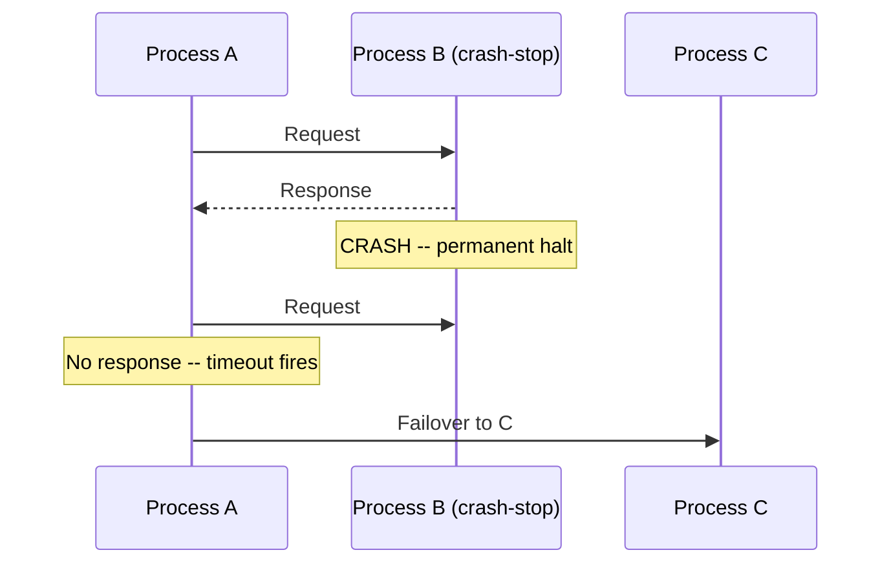
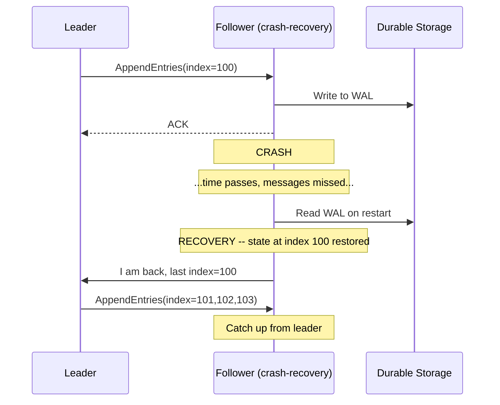
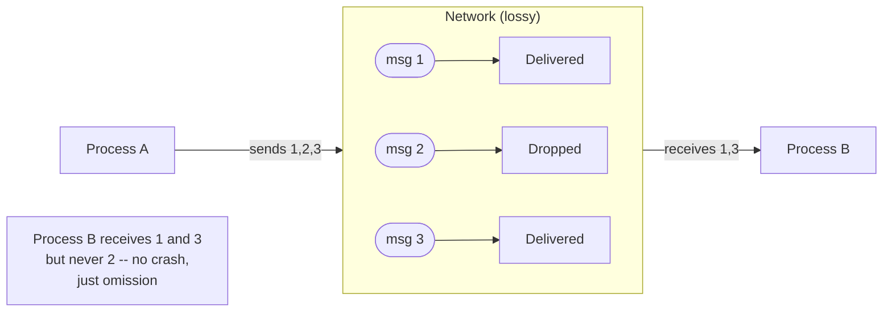

Distributed systems algorithms are not designed against a single notion of failure. They are designed against a specific **failure model**: a formal characterization of how processes and communication channels can deviate from correct behavior. The failure model determines what guarantees an algorithm can provide, what recovery mechanisms are necessary, and what detection infrastructure must exist beneath it.
 
Choosing the wrong failure model for your system -- assuming crash-stop behavior in a network that actually exhibits Byzantine faults, for example -- produces algorithms that are correct in theory and catastrophically wrong in practice. The taxonomy below moves from weakest to strongest, where strength means the model captures more ways things can go wrong.
 
## Crash-Stop Failures
 
In the **crash-stop** (also called **fail-stop**) model, a process operates correctly until it halts permanently. Once stopped, it takes no further actions, sends no further messages, and never resumes. Other processes may eventually detect the crash through timeout or heartbeat failure.
 
This is the simplest failure model and the one most distributed algorithms target first. Its defining property is **permanence**: a crashed process stays crashed. There is no ambiguity about whether a silent process has failed or is merely slow.
 

 
*Crash-stop failure: after the crash, Process B sends no further messages. The silence is eventually detectable via timeout.*
 
The practical implication is that crash-stop gives you a clean **failure boundary**. Any message sent before the crash may or may not have been processed; any message sent after the crash is definitively not processed. Algorithms can reason about this boundary precisely.
 
Most academic distributed systems literature -- Paxos, Raft, primary-backup replication -- assumes crash-stop failures. The safety proofs depend on the guarantee that a failed node does not send contradictory messages after failure. A Raft leader that crashes cannot simultaneously send conflicting log entries to different followers; it simply stops.
 
:::caution
Crash-stop is an idealization. Real processes do not always fail cleanly. A process can crash while a message is in transit, resulting in partial sends. A process can crash, have its port freed by the OS, and have a new process bind to the same port -- causing the new process to receive messages intended for the crashed one. Crash-stop algorithms must handle these edge cases through idempotency and sequence numbers, not by assuming the model holds perfectly.
:::
 
## Crash-Recovery Failures
 
In the **crash-recovery** model, a process may crash and later resume execution. After recovery, it must reconstruct its state from durable storage because in-memory state was lost. The process is unaware of the time that passed during the crash or the messages it missed.
 
This model is closer to production reality. Kubernetes restarts crashed pods. OS processes are killed and restarted by supervisors. Database servers crash and recover from WAL replay. The question is not whether recovery happens, but what state the process can reconstruct and what it must assume about the state of the rest of the system during its absence.
 

 
*Crash-recovery with WAL: the follower restores persisted state and requests missing entries from the leader.*
 
Crash-recovery introduces a critical challenge: **state divergence during the crash window**. While a process is down, the rest of the system continues making progress. When the process recovers, it must:
 
1. Determine what state it had at the time of crash
2. Identify what changes occurred during its absence
3. Reconcile its recovered state with the current system state
The durability contract determines step 1. If the process persisted every state change synchronously before acknowledging it, the recovered state is accurate up to the last acknowledged operation. If it used asynchronous persistence, the recovered state may be behind the last acknowledged operation by up to the flush interval -- the **recovery point objective (RPO)**.
 
For consensus algorithms, crash-recovery is handled by requiring a recovering node to catch up with the current leader before participating in consensus again. Raft's log replication handles this directly: a recovered follower sends its last known log index to the leader, which replays all missing entries.
 
The harder case is **recovering a leader or primary**. A recovering leader must determine whether it was the sole leader before crashing (no split occurred) or whether a new leader was elected during its absence. Raft handles this through term numbers: a recovering node with an outdated term cannot be a leader and must step down immediately upon discovering a higher term.
 
| Failure type | In-memory state | Persisted state | Recovery action |
|---|---|---|---|
| Crash-stop | Lost | N/A -- no recovery | Failover to replica |
| Crash-recovery (sync persist) | Lost | Current at crash time | Replay WAL, catch up from peer |
| Crash-recovery (async persist) | Lost | Behind by flush interval | Replay WAL, request retransmission |
| Crash-recovery (no persist) | Lost | None | Full state transfer from peer |
 
## Omission Failures
 
**Omission failures** occur when a process or network link fails to send or receive specific messages while otherwise continuing to operate correctly. The process does not crash -- it is running, processing some messages, and appearing alive -- but certain messages are silently dropped.
 
This is qualitatively different from crash failures because the process continues to participate in the system, potentially making progress on some operations while silently failing on others. From the perspective of a process waiting for a response, an omission failure is indistinguishable from a very slow response -- which is exactly why timeouts in partially synchronous systems cannot definitively distinguish failure from delay.
 
There are two sub-types:
 
**Send omission**: a process fails to send a message it should have sent. The classic example is a full socket send buffer: the application calls `write()`, the kernel returns success, but the TCP stack drops the segment because the send buffer is full or the connection has reset without the application detecting it.
 
**Receive omission**: a process fails to receive a message that was sent to it. The message was delivered to the network stack but dropped before the application read it -- due to a full receive buffer, a firewall rule, or a kernel bug.
 

 
*Omission failure: Process A sends three messages; Process B receives two. Neither process crashes. The gap is invisible to both without explicit sequence tracking.*
 
The detection challenge for omission failures is significant. A process experiencing send omissions may believe it has communicated state to its peers when it has not. A process experiencing receive omissions may make decisions based on an incomplete view of system state.
 
**Handling omission at the application layer** requires:
 
- **Sequence numbers** on every message to detect gaps
- **Acknowledgments** so senders know which messages were received
- **Retransmission** for unacknowledged messages
- **Idempotency** so that retransmitted messages do not cause duplicate processing
TCP provides sequence numbers, acknowledgments, and retransmission. However, TCP guarantees delivery only for the duration of the connection. A TCP connection that resets silently -- due to a NAT mapping expiry, a load balancer timeout, or a firewall rule -- drops all in-transit messages without notifying either endpoint until the next send attempt.
 
:::tip
In-process omission failures (a goroutine or thread that stops processing its input channel while remaining alive) are common in production and not handled by TCP. A deadlocked consumer, a blocked database write, or a full in-memory queue all create omission-like behavior at the application layer. Distinguish between network omissions (handled by TCP retransmit) and application-layer omissions (require explicit health checks, watchdogs, and queue depth monitoring).
:::
 
## Performance Failures (Timing Failures)
 
**Performance failures** (also called **timing failures**) occur when a process or network link operates correctly but outside the timing bounds assumed by the system. In the synchronous model, a message delayed beyond the known upper bound Δ is a performance failure. In production, performance failures are far more common than any other failure type.
 
Sources of performance failures:
 
- **GC pauses** -- a JVM stop-the-world GC pauses all threads for 0.5--10 seconds. From the outside, the process looks crashed. Its heartbeat stops. Other nodes time it out and initiate leader election. When the GC completes, the original process resumes, potentially believing it is still the leader.
- **CPU starvation** -- a noisy neighbor on a shared host consumes CPU, causing the process to execute slowly. Heartbeats arrive late. Timeouts fire. False failure detection occurs.
- **Network congestion** -- a switch queue builds up during a traffic burst. Messages that normally arrive in 0.5ms arrive in 50ms or not at all. The network has not failed; it is just slow.
- **Disk I/O stalls** -- a write to a storage backend blocks for seconds due to a failing disk, a full write cache, or a slow NFS mount. A process blocked on I/O cannot process heartbeats or consensus messages.
```go
// Performance failure detection: differentiate slow from dead
// using an adaptive timeout based on observed latency distribution
 
type FailureDetector struct {
    // Phi Accrual Detector parameters
    windowSize    int
    recentSamples []time.Duration
    mu            sync.Mutex
}
 
func (fd *FailureDetector) RecordHeartbeat(latency time.Duration) {
    fd.mu.Lock()
    defer fd.mu.Unlock()
    fd.recentSamples = append(fd.recentSamples, latency)
    if len(fd.recentSamples) > fd.windowSize {
        fd.recentSamples = fd.recentSamples[1:]
    }
}
 
// Phi returns a suspicion level: higher values mean more likely failed.
// Threshold of 8.0 gives <0.1% false positive rate under normal conditions.
// Threshold of 16.0 gives ~0% false positive but slower detection.
func (fd *FailureDetector) Phi(now time.Time, lastHeartbeat time.Time) float64 {
    fd.mu.Lock()
    defer fd.mu.Unlock()
    elapsed := now.Sub(lastHeartbeat)
    if len(fd.recentSamples) == 0 {
        return 0
    }
    // compute mean and std dev of recent inter-arrival times
    var sum, sumSq float64
    for _, s := range fd.recentSamples {
        v := float64(s)
        sum += v
        sumSq += v * v
    }
    n := float64(len(fd.recentSamples))
    mean := sum / n
    variance := (sumSq / n) - (mean * mean)
    if variance <= 0 {
        variance = 1
    }
    stddev := math.Sqrt(variance)
    y := (float64(elapsed) - mean) / stddev
    // approximate CDF of normal distribution
    phi := -math.Log10(1 - 0.5*(1+math.Erf(y/math.Sqrt2)))
    return phi
}
```
 
The Phi Accrual Failure Detector (Hayashibara et al., 2004) is the canonical response to performance failures in consensus systems. Rather than a binary alive/dead verdict, it outputs a continuous suspicion value that accounts for recent latency variance. Akka, Cassandra, and etcd all use variants of this approach.
 
See [Phi Accrual Failure Detector: Viewing Failure as a Probability](/distributed-systems/en/resilience/failure-detection/phi-accrual-detector/) for the full treatment.
 
## Byzantine Failures
 
**Byzantine failures** are the strongest failure model: a faulty process may behave arbitrarily. It can send different values to different peers, send messages at the wrong time, collude with other faulty processes, or selectively participate in some protocol steps but not others. The term comes from the Byzantine Generals Problem (Lamport, Shostak, Pease, 1982).
 
Byzantine failures subsume all other failure models. A Byzantine process can simulate a crash (by sending no messages), an omission failure (by dropping specific messages), or a performance failure (by delaying messages strategically). The failure model is used primarily in:
 
- **Blockchain consensus** (Bitcoin's Proof of Work, Tendermint, HotStuff) where nodes may be operated by adversarial parties
- **Safety-critical systems** where hardware faults can cause bit flips that produce incorrect but plausible-looking values
- **Multi-party computation** where protocol participants have incentive to cheat
For most distributed databases, message queues, and coordination services running on trusted infrastructure, Byzantine fault tolerance is not required -- and its cost (roughly 3f+1 nodes to tolerate f Byzantine faults, vs 2f+1 for crash-stop) is not justified. See [Byzantine Faults: Malicious or Corrupted Actors](/distributed-systems/en/foundations/system-models/byzantine-faults/) for the full treatment.
 
## Failure Model Selection in Practice
 
The choice of failure model is not purely academic -- it determines the minimum required replication factor, the complexity of the consensus algorithm, and the operational burden of failure detection.
 
| Failure model | Min nodes for f faults | Example systems | Detection mechanism |
|---|---|---|---|
| Crash-stop | 2f+1 | Raft, Paxos, ZooKeeper | Heartbeat timeout |
| Crash-recovery | 2f+1 (with durable state) | etcd, PostgreSQL streaming replication | Heartbeat + log position |
| Omission | 2f+1 (with retransmit) | Most TCP-based systems | Sequence number gaps + ACKs |
| Performance | 2f+1 (with adaptive timeout) | Cassandra, Akka Cluster | Phi Accrual Detector |
| Byzantine | 3f+1 | PBFT, Tendermint, HotStuff | Protocol-level vote counting |
 
The practical default for infrastructure running on trusted hardware is the **crash-recovery model with omission handling at the network layer** (via TCP). Crash-stop is assumed by most consensus algorithms but must be implemented carefully to avoid the performance-failure trap: a process that appears crashed due to GC pauses or CPU starvation should not trigger irreversible failover actions without adequate timeout margins.
 
:::danger
The most dangerous failure mode in practice is the **gray failure**: a process that is partially functional -- responding to health checks but failing to process certain request types, or processing requests slowly enough to violate SLOs without triggering binary alive/dead detectors. Gray failures are not captured by any of the classical failure models. Detecting them requires semantic health checks (does the process produce correct output, not just a TCP ACK?) and SLO-based alerting on latency and error rate, not just liveness probes.
:::