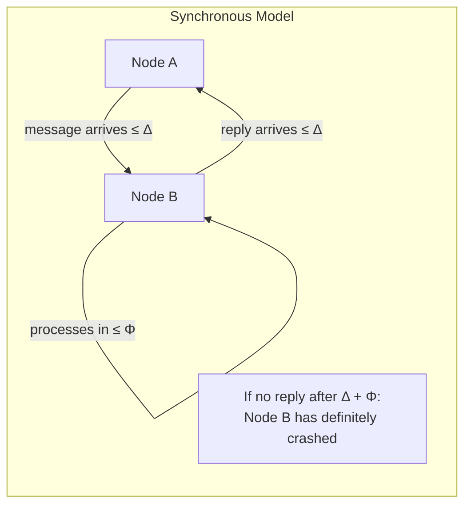
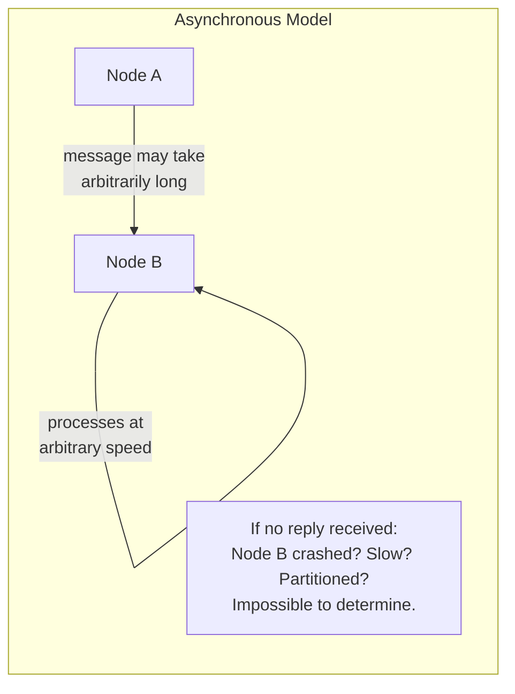
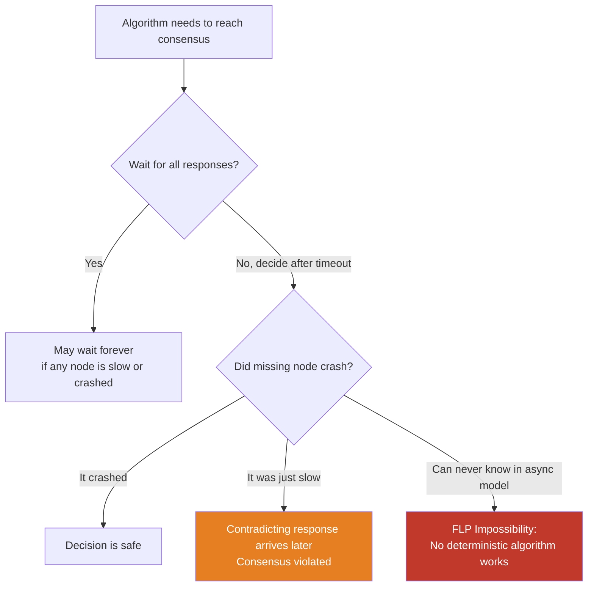
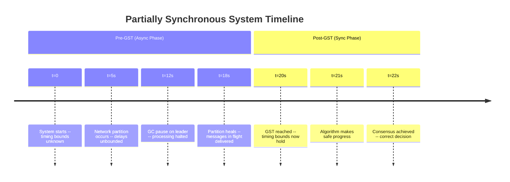
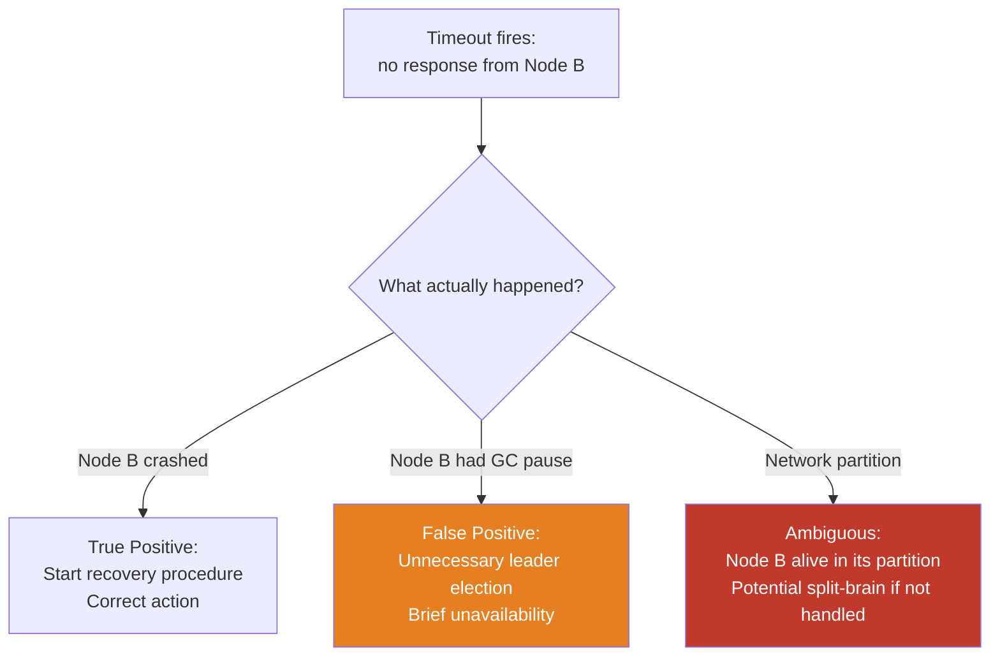
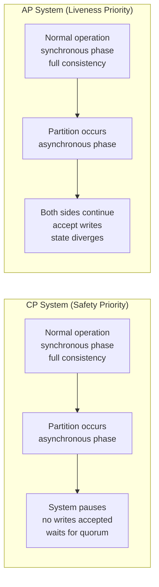

Every distributed algorithm makes assumptions about time. How long can a message take to arrive? How fast does a processor execute steps? Can we distinguish a slow node from a dead one? The answers to these questions are not just theoretical concerns — they determine which algorithms are correct, which safety properties are achievable, and which failure modes a system must tolerate. The three network timing models — **synchronous**, **asynchronous**, and **partially synchronous** — are the formal framework within which these questions are answered.
 
These models are not descriptions of specific hardware or protocols. They are abstractions that define the *worst-case* guarantees a system designer can rely on. Understanding them is prerequisite to understanding why consensus is hard, why timeouts are unreliable failure detectors, and why real distributed systems occupy the uncomfortable middle ground between theoretical extremes.
 
## The Synchronous Model
 
In the **synchronous model**, every component of the system operates within known, bounded time:
 
- Message delivery is guaranteed within a known maximum delay `Δ` (delta).
- Every process executes each step of its algorithm within a known maximum time `Φ` (phi).
- Clock drift between nodes is bounded by a known constant `ε` (epsilon).
Under these assumptions, the system has **global temporal consistency**: a process that has not heard from a peer within time `Δ + Φ` can conclude with certainty that the peer has crashed, not merely that it is slow. Timeouts become reliable failure detectors. Leader election, consensus, and distributed coordination become algorithmically tractable in ways that are impossible in weaker models.
 

*In the synchronous model, silence after a known timeout is conclusive evidence of failure — not ambiguity.*
 
The synchronous model enables powerful algorithms. The **Dolev-Strong Byzantine broadcast** algorithm, which tolerates up to `f` Byzantine faults with `f+1` rounds of message exchange, relies on synchrony: each round completes within `Δ`, so `f+1` rounds complete in `(f+1)Δ` total time. Without the bounded-delay assumption, the algorithm cannot proceed to the next round safely because it cannot determine whether a missing message means a slow node or a crashed one.
 
**The problem:** No real network satisfies the synchronous model's assumptions. Packet delays are unbounded in practice — a GC pause, a kernel page fault, a switch buffer overflow, or a TCP retransmission can each cause delays far exceeding any fixed `Δ`. The synchronous model is useful for algorithm analysis and for specialized hardware systems (real-time embedded systems, some HPC environments with InfiniBand), but it does not describe internet-based distributed systems.
 
## The Asynchronous Model
 
The **asynchronous model** is the opposite extreme: it makes no timing assumptions at all.
 
- Messages may take arbitrarily long to deliver, but are eventually delivered (no message loss).
- Processes may execute at arbitrary speeds.
- There is no notion of time or clocks — only the order of events matters.
This is the strongest possible adversarial model. An algorithm that is correct under asynchrony is correct under any weaker model (synchronous or partially synchronous) as well. This makes the asynchronous model theoretically attractive.
 

*In the asynchronous model, silence carries no information: a non-responding node may have crashed, may be computing, or may be delivering a message that arrives years later.*
 
The asynchronous model produces the most important impossibility result in distributed systems theory.
 
### The FLP Impossibility Result
 
In 1985, Fischer, Lynch, and Paterson proved the **FLP Impossibility**: in a fully asynchronous system, there is no deterministic algorithm that can solve consensus (agreement on a single value) even with just one possible crash failure.
 
The proof's key insight is subtle. In an asynchronous system, a process cannot distinguish between a crashed peer and a slow peer. Any algorithm that declares a decision after waiting for a timeout might be making the wrong decision — the "crashed" peer might still be computing and could deliver a conflicting response. If the algorithm waits longer to be safe, an adversary can slow down the computation to prevent the algorithm from ever terminating. No fixed waiting strategy works; there is always an execution schedule that prevents consensus from being reached in finite time.
 

*The FLP dilemma: in a fully asynchronous model, no waiting strategy can safely distinguish crash from slowness, making deterministic consensus impossible.*
 
FLP is not merely an academic result. It is the reason that every practical consensus algorithm — Paxos, Raft, Zab, PBFT — relies on timing assumptions that go beyond the pure asynchronous model. Raft uses leader election timeouts. Paxos uses round timers. Multi-Paxos uses heartbeats. These are all mechanisms for injecting partial synchrony into a system that would otherwise be fully asynchronous.
 
FLP also explains why **randomized consensus algorithms** (like Ben-Or's algorithm and its descendants) can avoid the impossibility: they sacrifice determinism. By flipping coins, they can break the adversary's ability to construct a worst-case execution schedule. But randomized algorithms introduce their own complexity — probabilistic guarantees rather than absolute ones, and expected-time bounds rather than worst-case bounds.
 
:::note
FLP proves that *deterministic* consensus is impossible under pure asynchrony with even one crash failure. It does not say consensus is impossible with randomization, nor does it apply to systems where timing assumptions hold for long enough to make progress. The practical takeaway is not "consensus is impossible" but "consensus requires either timing assumptions or randomization — and production systems use timing."
:::
 
## The Partially Synchronous Model
 
The **partially synchronous model**, formalized by Dwork, Lynch, and Stockmeyer (DLS) in 1988, captures the reality of production networks: timing bounds exist, but they are not always known and do not always hold.
 
DLS defined two specific variants:
 
**DLS Model 1 (Unknown bounds, always hold):** There exist fixed bounds `Δ` and `Φ` on message delivery and process speed, but the algorithm designer does not know what these bounds are. The system is synchronous, but the algorithm cannot rely on any particular value of `Δ`. This requires algorithms that work for *any* timing, discovering the appropriate values through operation.
 
**DLS Model 2 (Known bounds, hold eventually):** The bounds `Δ` and `Φ` are known, but they only hold after some unknown **Global Stabilization Time (GST)**. Before GST, the system behaves asynchronously — delays may be arbitrary. After GST, timing bounds hold and consensus can be achieved. The algorithm cannot know when GST has occurred, but it must be safe (no wrong decisions) at all times and live (eventually make progress) after GST.
 
The GST model is the most practically useful formalization: it captures the experience of real networks where behavior is mostly synchronous but occasionally experiences unbounded delays during failure events, network congestion, or GC pauses.
 

*The GST model: safety must hold through the asynchronous pre-GST phase; liveness is only guaranteed once GST is reached.*
 
### Why Partial Synchrony Is the Right Model for Production
 
Real distributed systems do not behave synchronously at all times, and they do not behave asynchronously at all times. They oscillate:
 
- **Most of the time:** messages arrive within tens to hundreds of milliseconds. Processing completes quickly. The system behaves roughly synchronously.
- **Occasionally:** a GC pause freezes a process for 200ms-10s. A switch buffer overflow causes a burst of packet loss. A network reconfiguration causes 30 seconds of elevated latency. During these periods, the system behaves asynchronously.
- **Rarely:** a network partition creates an extended asynchronous phase lasting minutes to hours.
Under partial synchrony, the design contract for distributed algorithms is:
 
- **Safety** (no wrong decisions, no data corruption, no consistency violations) must hold unconditionally — including during asynchronous phases.
- **Liveness** (eventually making progress, eventually electing a leader, eventually committing a transaction) is only guaranteed once the system returns to a stable synchronous phase.
This is exactly the contract that Raft and Paxos satisfy. Raft's safety properties (no two leaders in the same term, committed log entries are never overwritten) hold even during network partitions. Its liveness properties (a leader is eventually elected, log entries are eventually committed) only hold when the network is stable enough for heartbeats to arrive reliably.
 
## Implications for Algorithm Design
 
The choice of timing model determines the design space for distributed algorithms. The implications are concrete and visible in every production consensus system.
 
### Timeouts as Imperfect Failure Detectors
 
In a synchronous system, timeouts are perfect failure detectors: a timeout after `Δ + Φ` conclusively identifies a crashed node. In a partially synchronous system, timeouts are **unreliable failure detectors** that produce false positives (declaring a live node dead during an asynchronous phase) and false negatives (a crashed node whose death has not yet been detected because `Δ` has not been exceeded).
 
The practical consequence: every production distributed system must be designed to tolerate false failure detections. A Raft cluster that incorrectly believes the leader is dead will hold an election, potentially causing a brief unavailability window as a new leader is elected. If this false detection happens during a GC pause, the "dead" leader may recover and find a new leader in its place — a situation Raft handles correctly by using term numbers to reject stale leader messages.
 

*Timeout interpretation under partial synchrony: the same timeout event can mean three different things, only one of which is the expected scenario.*
 
### Timeout Calibration Trade-offs
 
Timeout values in a distributed system are a fundamental trade-off between false positive rate and detection latency:
 
| Timeout too short | Timeout too long |
|---|---|
| False positives during GC pauses, slow nodes | Long detection time for real failures |
| Unnecessary leader elections and reconfiguration | Extended unavailability during real partitions |
| Election storms under load | Large data loss window for crash recovery |
| High messaging overhead from frequent re-elections | Applications experience long timeout-wait periods |
 
**Practical calibration:** The canonical starting point for systems like etcd is `heartbeat_interval = 150ms`, `election_timeout = 750ms-1500ms` (5-10× heartbeat interval). This is tuned to tolerate GC pauses up to ~500ms without false positives, while still detecting real failures within ~1-2 seconds. Applications with more stringent availability requirements use tighter timeouts and accept higher false-positive rates — which requires their state machines to handle spurious leader elections correctly.
 
### Safety vs. Liveness Under Asynchrony
 
The CAP theorem is often described as a trade-off between consistency and availability during partitions. Through the lens of timing models, it is more precisely a statement about the safety/liveness trade-off under asynchrony:
 
- **CP systems** (Cassandra in strong consistency mode, etcd, Zookeeper) prioritize safety. During an asynchronous phase (partition), they stop making progress (violate liveness) rather than risk making incorrect decisions (violate safety). They wait for synchrony to return.
- **AP systems** (Cassandra in eventual consistency mode, DynamoDB with eventual reads) prioritize liveness. During a partition, they continue making progress (accepting reads and writes) at the cost of potential safety violations (different partitions diverge). They accept the risk of incorrect decisions during asynchrony.
Neither approach is universally correct. The choice depends on what "incorrect decision" means for the specific application: an account balance discrepancy (safety-critical, use CP) versus a view counter that can be briefly stale (safety-relaxed, AP acceptable).
 

*CP vs. AP under a network partition: the timing model determines which property is sacrificed during the asynchronous phase.*
 
## The Consensus Hierarchy Under Each Model
 
The three timing models define a strict hierarchy of what is computationally achievable:
 
| Problem | Synchronous | Asynchronous | Partially Synchronous |
|---|---|---|---|
| **Reliable broadcast** | Achievable | Achievable | Achievable |
| **Leader election** | Achievable | Impossible (FLP variant) | Achievable after GST |
| **Consensus (crash faults)** | Achievable | Impossible (FLP) | Achievable after GST |
| **Consensus (Byzantine faults)** | Achievable (needs `3f+1` nodes) | Impossible | Achievable after GST (needs `3f+1` nodes) |
| **Total order broadcast** | Achievable | Equivalent to consensus → impossible | Achievable after GST |
| **Atomic commit (2PC)** | Achievable | Blocks on coordinator crash | Achievable with timeout-based recovery |
 
The equivalence between **consensus** and **total order broadcast** (Atomic Broadcast) is a fundamental result: any algorithm that solves one can be transformed to solve the other. This is why distributed databases that require serializable transactions and distributed systems that require log ordering all fundamentally require some form of consensus — and why they all require partial synchrony to work.
 
## Practical Partial Synchrony: What Production Systems Assume
 
No production distributed system explicitly identifies which DLS variant it operates under. But their design decisions encode the assumptions implicitly.
 
**Raft** assumes partial synchrony (DLS Model 2). Its election timeouts implement the "timing bounds hold eventually" assumption: if the network is unstable enough that timeouts never hold, Raft will never elect a stable leader (liveness fails). But it will never produce two committed log entries that conflict (safety holds).
 
**Apache Kafka's ISR (In-Sync Replica) mechanism** assumes partial synchrony for its replication protocol. A replica that falls behind by more than `replica.lag.time.max.ms` (default: 30 seconds) is removed from the ISR — a timeout-based failure detection that produces false positives during GC pauses or temporary latency spikes, causing unnecessary ISR shrinking and subsequent re-expansion.
 
**Google Spanner** makes a more aggressive timing assumption: it relies on TrueTime, GPS-synchronized clocks with a known, bounded uncertainty interval `[t-ε, t+ε]`. By committing transactions with timestamps that account for the uncertainty interval, Spanner converts a partial synchrony problem into one it can solve with high confidence. This is not full synchrony — the bounds are probabilistic and can be violated during GPS outages — but it is tighter than the standard partially synchronous model.
 
```go
// Practical implementation of partial synchrony awareness:
// A leader heartbeat mechanism that degrades gracefully under asynchrony
 
type LeaderHeartbeat struct {
    interval     time.Duration // How often to send heartbeats
    timeout      time.Duration // How long before declaring leader dead
    jitter       time.Duration // Randomize to avoid synchronized elections
    lastReceived time.Time
    mu           sync.Mutex
}
 
func (h *LeaderHeartbeat) IsLeaderAlive() bool {
    h.mu.Lock()
    defer h.mu.Unlock()
 
    elapsed := time.Since(h.lastReceived)
    // Timeout is a heuristic, not a proof of death.
    // False positives (live leader declared dead) are handled by term numbers.
    // False negatives (dead leader not yet detected) are bounded by h.timeout.
    return elapsed < h.timeout
}
 
func (h *LeaderHeartbeat) OnHeartbeatReceived() {
    h.mu.Lock()
    defer h.mu.Unlock()
    h.lastReceived = time.Now()
}
 
// Election timeout with jitter: avoids synchronized elections
// when multiple followers detect the same leader timeout simultaneously
func (h *LeaderHeartbeat) ElectionTimeout() time.Duration {
    // Add random jitter in [0, jitter) to desynchronize elections
    jitterVal := time.Duration(rand.Int63n(int64(h.jitter)))
    return h.timeout + jitterVal
}
```
 
:::caution
A common mistake when tuning distributed consensus systems is setting election timeouts too aggressively short in an attempt to minimize failover time. On JVM-based systems (Kafka, Zookeeper, Elasticsearch), GC pauses of 200ms-2s are common even with G1GC or ZGC. An election timeout shorter than the 99th-percentile GC pause duration will produce frequent false leader elections, creating instability that compounds under load — exactly the conditions when stability is most needed.
:::
 
## The Real-World Model: Partial Synchrony With Failure Detectors
 
In practice, distributed systems augment partial synchrony with **failure detectors** — modules that provide hints about process crashes, even if those hints are imperfect. Chandra and Toueg (1996) classified failure detectors by two properties:
 
**Completeness:** Eventually, every crashed process is suspected by every correct process. (No crashed process is permanently missed.)
 
**Accuracy:** No correct process is ever suspected. (No false positives.)
 
Perfect failure detectors (complete and accurate) do not exist under asynchrony — this is equivalent to solving consensus, which FLP proves impossible. But **eventually strongly accurate** failure detectors (complete, and eventually accurate after some stabilization time) are achievable under partial synchrony, and they are sufficient to solve consensus.
 
This is precisely what production heartbeat-based failure detectors implement: they are eventually accurate (false positives during GC pauses resolve once the pause ends) and eventually complete (a permanently crashed node will eventually exceed the timeout on all observers). The combination gives consensus algorithms the failure detection they need without requiring full synchrony.
 
| Failure Detector Class | Completeness | Accuracy | Sufficient for Consensus? |
|---|---|---|---|
| **Perfect (P)** | Strong | Strong | Yes (synchronous only) |
| **Eventually Perfect (◇P)** | Strong | Eventually Strong | Yes (partially synchronous) |
| **Strong (S)** | Strong | Weak (one correct node never suspected) | Yes |
| **Eventually Strong (◇S)** | Strong | Eventually Weak | Yes (weakest sufficient class) |
| **Weak (W)** | Weak | Weak | No |
 
Production systems implement approximately **◇P (Eventually Perfect)**: heartbeats detect failures with high probability, false positives resolve once timing stabilizes, and the consensus algorithm (Raft, Paxos) handles the residual ambiguity through its epoch/term numbering scheme.
 
See [Failure Models: Crash-Stop, Crash-Recovery, Omission](/distributed-systems/en/foundations/system-models/failure-models/) for how the timing model interacts with the failure model taxonomy.
See [Byzantine Faults: Malicious or Corrupted Actors](/distributed-systems/en/foundations/system-models/byzantine-faults/) for the additional complexity introduced when the failure model is extended beyond crash faults.
See [Lamport Timestamps: Capturing Causality](/distributed-systems/en/foundations/time-and-ordering/lamport-timestamps/) for how causality is tracked in asynchronous systems where global time cannot be relied upon.