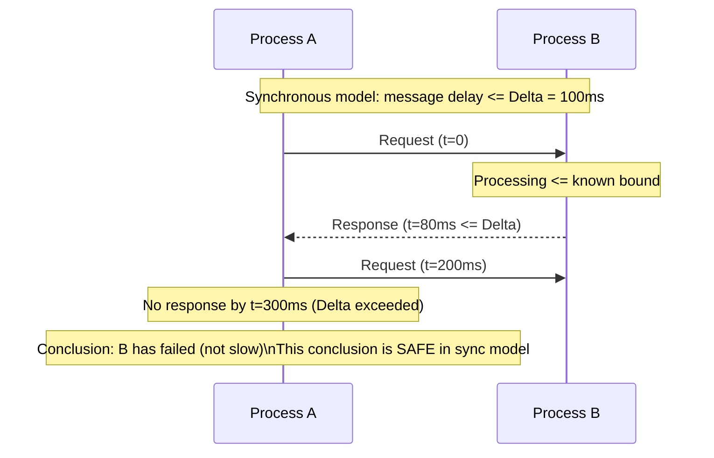
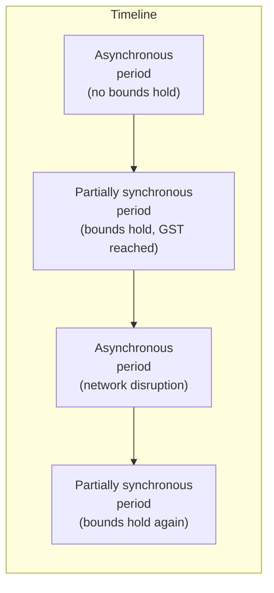
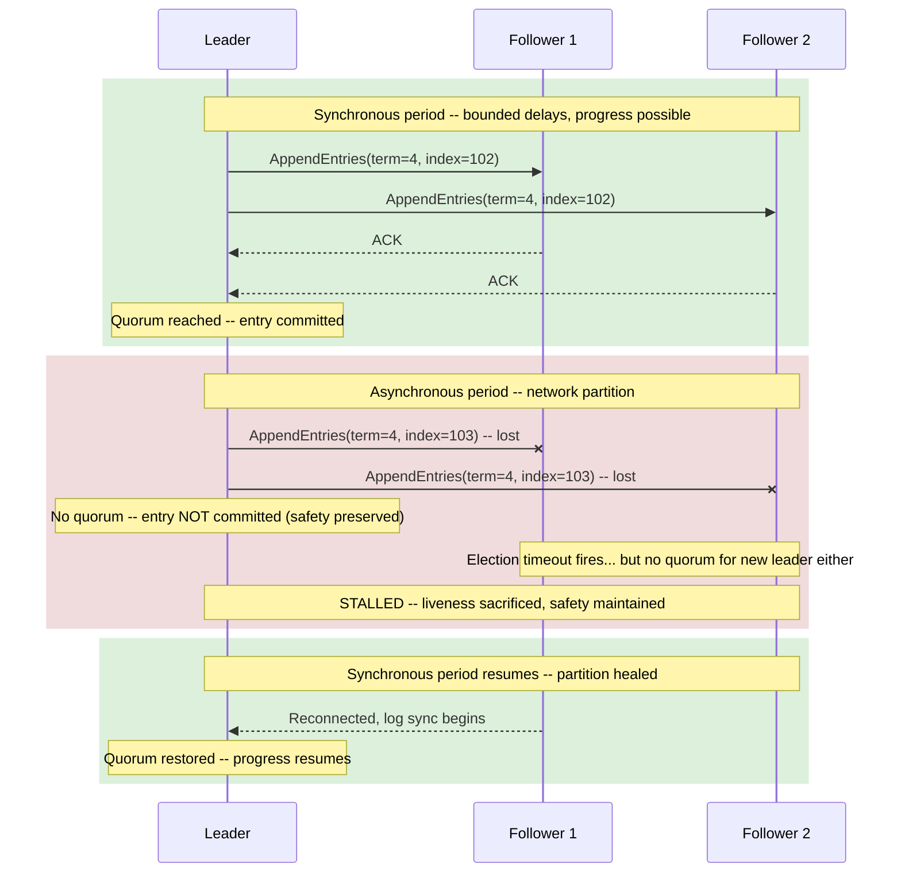

Distributed systems algorithms are not designed against the actual network — they are designed against a **network model**: a formal set of assumptions about message delivery timing, process execution speed, and whether clocks are available. The choice of model determines what algorithms are possible, what guarantees they can provide, and what happens when the model's assumptions are violated in production.

This is not academic formalism. The reason a Raft cluster stalls when it loses quorum rather than electing two leaders is a direct consequence of the network model its safety proof assumes. The reason your service's timeout configuration is always wrong is a direct consequence of operating in a model where timing bounds exist but are unknown. Getting the model right is the prerequisite for understanding why distributed algorithms behave the way they do.

## The Synchronous Model

In the **synchronous model**, every aspect of distributed execution has a known finite upper bound:

- **Message delivery** — every message sent between processes arrives within a known maximum delay *Δ*
- **Process execution** — every step of a process's computation completes within a known maximum time
- **Clock drift** — if processes have local clocks, their drift rate is bounded by a known constant
Under these assumptions, the world becomes tractable. If you know a message will arrive within *Δ* time, waiting *Δ* + ε is sufficient to conclude it was lost. If you know a process executes within a bounded time, a timeout of that bound plus transmission latency reliably distinguishes a failed process from a slow one.


*In the synchronous model, exceeding the known delay bound Δ is a reliable failure signal. A timeout is not a guess — it is a proof of failure.*

The synchronous model enables a clean solution to **failure detection**: a process is definitively dead if it has not responded within the bounded time window. This makes problems like leader election, distributed consensus, and distributed snapshots algorithmically straightforward — or at least, straightforward relative to weaker models.

The problem is that the synchronous model does not exist in practice. No real network provides a guaranteed upper bound on message delivery. A packet can be delayed by:

- TCP retransmission caused by packet loss (adds one RTO, typically 200ms-1000ms, per loss event)
- Switch queue buildup during a traffic burst
- CPU scheduling jitter on the receiver — a process preempted by the kernel OS scheduler may not be scheduled again for tens of milliseconds
- Virtual machine pauses — a hypervisor live-migrating a VM, running garbage collection, or responding to a balloon driver request can pause all processes in the VM for hundreds of milliseconds to seconds
- Full GC pauses in JVM-based services, which can suspend all application threads for 0.5-30 seconds depending on heap size and GC algorithm
None of these have a known upper bound. Any of them can cause a message that "should" have arrived within Δ to arrive late — making a timeout-based failure conclusion incorrect.

:::danger
The most severe consequence of treating production infrastructure as synchronous is **false positive failure detection**: concluding that a process has failed when it is merely slow or paused. In a system with automatic failover, this triggers leader re-election or replica promotion based on a false premise. If the "failed" leader is actually alive and paused, resuming execution after the pause produces two simultaneous leaders — the split-brain condition. The safety proof of synchronous-model algorithms breaks the moment the synchrony assumption is violated. See [Failover and Leader Election: The Split-Brain Risk](/distributed-systems/en/data-management/replication/failover-leader-election/).
:::

## The Asynchronous Model

The **asynchronous model** makes the opposite extreme assumption: there are no timing bounds whatsoever.

- Messages may be delayed arbitrarily — a message sent now may arrive in one millisecond or one year, and both are consistent with the model
- Processes may execute arbitrarily slowly — a process that has not responded may be running slowly, not failed
- Clocks, if they exist, may drift at any rate and provide no useful timing information
Under this model, timeouts are meaningless. You cannot set a timeout that reliably distinguishes a failed process from a slow one, because there is no bound on slowness. You cannot use wall-clock time for anything that requires coordination between processes, because clocks may disagree arbitrarily.

The asynchronous model is the *weakest* model — it assumes the least about the system and therefore makes the fewest assumptions that can be violated. An algorithm that is correct in the asynchronous model is correct in any real network, because any bound violations the real network produces are already permitted by the model.

The devastating implication of the asynchronous model is captured by the **FLP impossibility result** (Fischer, Lynch, Paterson, 1985): in a fully asynchronous system where processes can fail by crashing, there is no deterministic algorithm that can solve **consensus** — agreement among a set of processes on a single value — even with only one faulty process.

The proof's mechanism is elegant and important to understand:

```
FLP Impossibility (informal):

Given an asynchronous system with >=1 crash-stop failures possible:

1. A consensus algorithm must terminate (liveness) and all correct
   processes must agree on the same value (safety).

2. In an asynchronous system, there is always a "bivalent" initial
   configuration -- one where the outcome (0 or 1) is not yet determined.

3. From any bivalent configuration, there always exists a sequence of
   steps that keeps the system bivalent -- an adversarial scheduler can
   delay messages or fail a process at precisely the point where any
   decision step would occur.

4. Therefore: no deterministic algorithm can guarantee that a bivalent
   state eventually terminates. Either it might never decide (violating
   liveness), or it might decide inconsistently (violating safety).
```

This is not a limitation of cleverness — it is a mathematical proof that consensus is impossible in the asynchronous model with any faults. The result motivated the entire field of practical consensus algorithm design, which achieves consensus by escaping the asynchronous model through one of two mechanisms:

- **Adding timing assumptions** — introducing bounds on message delivery, even probabilistic ones, that allow algorithms to make progress under normal conditions (the partially synchronous model)
- **Adding randomization** — using coin flips to break the adversarial scheduling scenarios the FLP proof relies on (Ben-Or's randomized consensus, later extended by Bracha-Toueg)
The asynchronous model is the theoretical floor. Real systems must escape it to solve consensus. The question is how.

## The Partially Synchronous Model

The **partially synchronous model**, introduced by Dwork, Lynch, and Stockmeyer in 1988, is the model that accurately describes production distributed systems and under which all practical consensus algorithms are designed.

It exists in two variants, both of which capture the intuition that real networks are "usually synchronous" but not "always synchronous":

**Variant 1: GST (Global Stabilization Time).** There exists an unknown time GST such that after GST, the system behaves synchronously — message delays and process speeds are bounded by known constants. Before GST, the system may be fully asynchronous. GST is not known to any process and may never be reached in a pathological scenario. The guarantee is: if GST is eventually reached and stays stable, consensus algorithms will terminate.

**Variant 2: Eventual synchrony.** The system alternates between synchronous and asynchronous periods. The timing bounds may be temporarily violated, but eventually periods of synchrony occur and algorithms can make progress during those periods.


*The partially synchronous model: timing bounds hold during stable periods and are violated during disruptions. Algorithms make progress during synchronous periods and preserve safety during asynchronous ones.*

The design principle that emerges from partial synchrony is the **separation of safety and liveness**:

- **Safety** (correctness invariants — no two nodes decide different values, no data is corrupted) must hold at all times, including during asynchronous periods when the system has no timing guarantees
- **Liveness** (the system eventually makes progress — a decision is eventually reached, a leader is eventually elected) is only required to hold during synchronous periods
This is precisely how Raft and Paxos behave. During a network partition — an asynchronous period — they stall. They do not elect two leaders, do not commit writes on both sides of the partition, do not produce inconsistent state. Safety is preserved at the cost of availability. When the partition heals — when the system re-enters a synchronous period — leader election succeeds, log replication resumes, and progress is made.


*Raft under partial synchrony: safety is preserved during the asynchronous partition (no commits without quorum) and liveness resumes during synchronous periods.*

## Timeout Configuration as Model Calibration

The partially synchronous model makes timeout configuration precise: a timeout is an *estimate* of the synchrony bound Δ. Set it too low relative to actual delays, and you get false positive failure detection — triggering unnecessary failovers, split-brain conditions, and recovery cascades. Set it too high, and the system is slow to detect real failures and slow to recover.

The correct timeout is not derivable from theory — it must be measured from the actual system. The minimum viable timeout is:

```
timeout >= max_processing_time + 2 * max_one_way_network_delay + safety_margin
```

In practice, "max" is undefined because the asynchronous model permits arbitrary delays. What you can measure is the *empirical* p99.9 or p99.99 of round-trip time under normal operating conditions. A timeout set at the p99.9 will produce a false positive for one in every 1,000 heartbeats under normal conditions. Whether that is acceptable depends on the cost of a false positive in your specific system.

```go
// Raft timeout configuration: a concrete example of model calibration
type RaftConfig struct {
    // HeartbeatInterval: how often the leader sends heartbeats to followers.
    // Must be significantly less than ElectionTimeout to allow multiple
    // heartbeats per election window -- prevents spurious elections due to
    // a single delayed heartbeat.
    HeartbeatInterval time.Duration

    // ElectionTimeout: how long a follower waits without a heartbeat before
    // starting an election. Should be >> HeartbeatInterval to avoid
    // spurious elections, but << MTTR (mean time to detect real failure)
    // to recover quickly.
    //
    // Practical range: 150ms-5000ms depending on network latency and
    // GC/VM pause characteristics of your infrastructure.
    ElectionTimeout time.Duration

    // ElectionTimeoutJitter: randomization applied to ElectionTimeout per
    // node to prevent split votes (multiple followers timing out simultaneously).
    // Typically 0.5-1.0 x ElectionTimeout.
    ElectionTimeoutJitter time.Duration
}

// Typical configuration for intra-AZ deployment (p99 RTT ~1ms)
var IntraAZConfig = RaftConfig{
    HeartbeatInterval:     50 * time.Millisecond,
    ElectionTimeout:       150 * time.Millisecond,
    ElectionTimeoutJitter: 150 * time.Millisecond, // range: 150-300ms
}

// Conservative configuration for cross-AZ deployment (p99 RTT ~5ms,
// JVM GC pauses possible up to 200ms)
var CrossAZConfig = RaftConfig{
    HeartbeatInterval:     150 * time.Millisecond,
    ElectionTimeout:       1000 * time.Millisecond,
    ElectionTimeoutJitter: 1000 * time.Millisecond, // range: 1000-2000ms
}
```

:::caution
JVM GC pauses are the most common cause of spurious leader elections in Java/Scala-based distributed systems (Kafka, Elasticsearch, Cassandra). A stop-the-world GC pause of 500ms on the leader node causes it to miss heartbeat intervals, triggering elections on followers that perceived the leader as failed. When the GC pause ends, the original leader may attempt to continue as leader while an election is in progress — requiring a term-number increment to resolve. Tuning election timeouts without profiling GC pause durations on the leader produces timeouts that are wrong for the actual failure modes. Use G1GC or ZGC with pause targets below your heartbeat interval; instrument `jvm_gc_pause_seconds` and alert when pause duration approaches `HeartbeatInterval / 2`.
:::

## Implications for Algorithm Design

The network model a distributed algorithm assumes constrains which problems it can solve and what guarantees it can provide. The practical mapping:

| Model | Failure detection | Consensus | Example algorithms |
|---|---|---|---|
| **Synchronous** | Perfect (timeouts are definitive) | Solvable deterministically | Theoretical only; no production use |
| **Asynchronous** | Impossible (no timeout bound) | Impossible (FLP) | Purely async systems avoid consensus |
| **Partially synchronous** | Eventually perfect (correct during sync periods) | Solvable with liveness during sync periods | Raft, Paxos, Zab, PBFT |

**Eventually perfect failure detectors** (Chandra-Toueg, 1996) are the formal tool designed for the partially synchronous model. They are characterized by two properties:

- **Strong completeness** — every crashed process is eventually permanently suspected by every correct process
- **Eventual strong accuracy** — after some time, no correct process is suspected
The "eventual" qualifier is the key. During asynchronous periods, the failure detector may produce false positives (suspecting a correct process). During synchronous periods, it is accurate. Raft's heartbeat timeout is an implementation of an eventually perfect failure detector.

The model also explains the behavior of **etcd and ZooKeeper under network stress**. Both use quorum-based consensus (Raft and Zab respectively). When network delays push heartbeat delivery beyond election timeout thresholds — an asynchronous period — the cluster may lose its leader and enter an election cycle. Writes stall; reads from followers may serve stale data. This is not a bug. It is the correct behavior for a CP system in the partially synchronous model: safety is preserved (no split-brain, no inconsistent commits), liveness is temporarily sacrificed (writes stall until a new leader is elected during a synchronous period).

The corollary: if your use case requires that a distributed coordination service never stalls writes during network disruptions, you are asking for an AP system, and the trade-off is that the AP system may produce inconsistent results during those same disruptions. The model determines which trade-off you are making. Choosing the model is not a technical decision — it is a requirements decision that must be made with full understanding of what each model sacrifices.

:::note
The partially synchronous model is a theoretical abstraction, not an operational prescription. In production, "the system is synchronous" means "timing bounds are currently holding" — which you cannot observe directly, only infer from the absence of timeout events. Distributing tracing and SLO-based latency alerting are the practical instruments that tell you whether your system is operating in the synchronous regime or drifting toward the asynchronous one. See [Distributed Tracing: Span, Trace, and Baggage Propagation](/distributed-systems/en/observability/logs-metrics-traces/distributed-tracing/).
:::