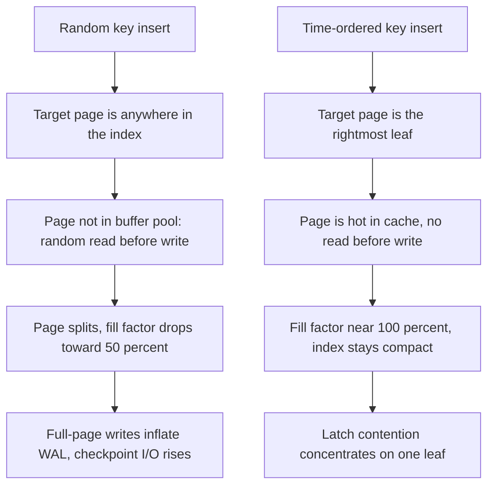

An identifier scheme is a choice about where uniqueness comes from, and every option trades three quantities against each other: coordination cost at generation time, index locality at write time, and information leaked to whoever sees the ID. A database sequence gives perfect locality and zero leakage but requires a round trip to a single writer. Random UUIDs need no coordination and leak nothing but destroy write locality. Time-ordered schemes sit between them, and the reason there are three popular ones rather than one is that they resolve the remaining trade-offs differently.
 
## Bit Layouts
 
The layout is the design. Everything downstream, sortability, generation rate, collision probability, and leakage, follows mechanically from how the bits are allocated.
 
```text
Snowflake (64 bits, signed int64)
 0 | 41 bits timestamp (ms since custom epoch) | 10 bits node | 12 bits seq |
   `- sign bit, always 0 so values stay positive in Java and SQL BIGINT
 
UUIDv7 (128 bits, RFC 9562)
| 48 bits unix_ts_ms | 4 ver | 12 bits rand_a | 2 var | 62 bits rand_b |
                       ^0111    ^ may hold sub-ms precision or a counter
 
ULID (128 bits, 26 chars Crockford base32)
| 48 bits unix_ts_ms | 80 bits randomness |
                       ^ monotonic variant increments this within the same ms
 
KSUID (160 bits)
| 32 bits seconds since custom epoch | 128 bits randomness |
```
 
**Snowflake** buys exact monotonicity per node with an explicit node ID, which means it needs assigned identity and therefore coordination once, at deployment. Twelve sequence bits cap a node at 4096 IDs per millisecond, roughly 4.1 million per second, and 41 timestamp bits give about 69 years from the chosen epoch. It fits in a `BIGINT`, which is why it remains the default in systems where an 8-byte primary key matters.
 
**UUIDv7** replaces the random high bits of UUIDv4 with a millisecond timestamp, keeping the 128-bit format and the existing tooling. RFC 9562 permits three approaches to sub-millisecond ordering: fill `rand_a` with sub-millisecond fraction, use it as a counter seeded randomly, or borrow bits from `rand_b`. With 62 random bits per millisecond, collisions require an enormous per-millisecond generation rate before they become plausible, and no node identity is needed at all.
 
**ULID** is the same idea in a form designed to be read and typed: 26 characters of Crockford base32, case-insensitive, no hyphens, lexicographically sortable as text. Its monotonic variant increments the 80-bit random field when two IDs land in the same millisecond, which preserves ordering but makes the next value predictable from the previous one.
 
| Dimension | UUIDv4 | Snowflake | UUIDv7 | ULID |
|---|---|---|---|---|
| Size, binary | 16 B | 8 B | 16 B | 16 B |
| Size, text | 36 chars | up to 19 | 36 chars | 26 chars |
| Coordination needed | None | Node ID assignment | None | None |
| Sortable by creation | No | Yes, exactly per node | k-sortable to the ms | k-sortable to the ms |
| Rate ceiling | None | 4096 per ms per node | Practically none | Practically none |
| Leaks creation time | No | Yes | Yes | Yes |
| Leaks volume | No | Yes, via sequence bits | No | Only in monotonic mode |
| When to prefer | Opaque public tokens, no ordering needed | 8-byte PK, node identity already managed | Default for new systems on standard UUID tooling | Human-facing IDs, URL-safe text form |
 
"k-sortable" is the precise claim and worth stating carefully: IDs generated in the same millisecond by different nodes sort arbitrarily against each other. Time-ordered IDs give you index locality, not a causal or transactional order. Using ID comparison to decide which of two events happened first is wrong for the same reason wall clocks are wrong; see [The Happened-Before Relation](/distributed-systems/en/foundations/time-and-ordering/happened-before/).
 
## Why Locality Dominates the Decision
 
The reason a random primary key hurts is mechanical, and it differs between storage engines.
 

*B-tree insert paths. Time ordering converts random I/O and page splits into a single hot leaf, trading one bottleneck for a different, usually smaller one.*
 
In a B-tree, inserting a random key means the target leaf is uniformly distributed across the index. Once the index exceeds the buffer pool, each insert becomes a random read followed by a write, page splits leave leaves roughly half full, and in PostgreSQL every first touch of a page after a checkpoint emits a full-page image into the WAL. A clustered index on a random UUID, as in InnoDB, applies all of this to the table data itself rather than just an index. The commonly cited outcome, an index several times larger and an order of magnitude slower once it stops fitting in memory, is a consequence of these three effects compounding.
 
Time-ordered keys append at the right edge. Fill factor stays near full, the hot leaf stays cached, and no random read precedes the write. The cost is that every concurrent inserter contends for the same leaf latch, which becomes visible only at high write concurrency and is far cheaper than random I/O.
 
In an [LSM tree](/distributed-systems/en/data-management/storage-engines/lsm-tree-vs-b-tree/), the effect appears in compaction rather than page splits. Random keys make every flushed SSTable span the whole key range, so every level-0 file overlaps every other, read amplification rises, and compaction rewrites more data per byte ingested. Time-ordered keys produce non-overlapping files with tight ranges, which compaction handles cheaply and which lets bloom filters and range scans skip whole files.
 
:::caution
The same property that helps single-node storage hurts range-partitioned distributed stores. A time-prefixed key sends all writes to the shard owning the current time range, producing a hot partition in HBase, Bigtable, or a range-sharded DynamoDB index. The standard fix is a salt or hash prefix on the shard key while keeping the time-ordered ID as the row key within the shard; see [Skew and Hot-Spot Problems](/distributed-systems/en/data-management/data-partitioning/skew-hot-spots/).
:::
 
## Implementation
 
```go
package snowflake
 
import (
	"errors"
	"fmt"
	"sync"
	"time"
)
 
const (
	epochMillis = 1735689600000 // 2025-01-01T00:00:00Z. Never change this.
	nodeBits    = 10
	seqBits     = 12
	maxNode     = (1 << nodeBits) - 1
	maxSeq      = (1 << seqBits) - 1
	timeShift   = nodeBits + seqBits
	nodeShift   = seqBits
	maxElapsed  = (int64(1) << 41) - 1
)
 
var (
	ErrClockRollback = errors.New("snowflake: clock moved backwards")
	ErrEpochExceeded = errors.New("snowflake: timestamp exceeds 41 bits")
	ErrNodeID        = errors.New("snowflake: node ID out of range")
)
 
type Generator struct {
	mu        sync.Mutex
	node      int64
	lastMs    int64
	seq       int64
	tolerance time.Duration // Backward drift absorbed by waiting, not erroring.
	now       func() int64
}
 
// New requires an explicitly assigned node ID. Defaulting it to zero, to a
// hash of the hostname, or to a random value is the single most common way
// this scheme produces duplicate IDs in production.
func New(node int64, tolerance time.Duration, now func() int64) (*Generator, error) {
	if node < 0 || node > maxNode {
		return nil, fmt.Errorf("%w: %d not in [0,%d]", ErrNodeID, node, maxNode)
	}
	return &Generator{node: node, tolerance: tolerance, now: now}, nil
}
 
func (g *Generator) Next() (int64, error) {
	g.mu.Lock()
	defer g.mu.Unlock()
 
	ms := g.now()
	if ms < g.lastMs {
		drift := time.Duration(g.lastMs-ms) * time.Millisecond
		if drift > g.tolerance {
			// Emitting IDs from a rewound clock reuses (ms, node, seq)
			// triples that were already handed out. Fail loudly; a caller
			// retry after the clock resyncs is the only safe recovery.
			return 0, fmt.Errorf("%w by %s, tolerance %s", ErrClockRollback, drift, g.tolerance)
		}
		ms = g.waitUntil(g.lastMs)
	}
 
	if ms == g.lastMs {
		g.seq = (g.seq + 1) & maxSeq
		if g.seq == 0 {
			// 4096 IDs consumed within this millisecond. Spin to the next
			// one rather than borrowing bits from the timestamp.
			ms = g.waitUntil(g.lastMs)
		}
	} else {
		g.seq = 0
	}
 
	elapsed := ms - epochMillis
	if elapsed < 0 || elapsed > maxElapsed {
		return 0, fmt.Errorf("%w: elapsed=%d", ErrEpochExceeded, elapsed)
	}
	g.lastMs = ms
	return elapsed<<timeShift | g.node<<nodeShift | g.seq, nil
}
 
// waitUntil blocks until the clock strictly passes prev.
func (g *Generator) waitUntil(prev int64) int64 {
	for {
		ms := g.now()
		if ms > prev {
			return ms
		}
		time.Sleep(200 * time.Microsecond)
	}
}
```
 
Two details separate this from the naive version. The `now` function should be built on a monotonic reading anchored to wall time rather than a raw `CLOCK_REALTIME` call, so an NTP step does not appear as a rollback on every invocation. And the rollback branch distinguishes small drift, which is absorbed by waiting, from a genuine backward step, which must be an error: silently sleeping through a thirty-second rewind converts a visible failure into a thirty-second stall, and silently continuing converts it into duplicate primary keys.
 
## Failure Modes and Operational Pitfalls
 
**Duplicate node IDs.** This is the dominant Snowflake outage. A deployment that derives the node ID from a config default, a hostname hash with a small modulus, an ordinal that resets on rescheduling, or an environment variable missing in one manifest will run two generators with the same ID. They collide only when both emit in the same millisecond with the same sequence value, so the symptom is rare primary key violations under load, not a clean failure at startup. Assign node IDs from a coordination service with a lease, log the assigned ID at startup, and alert on any duplicate observed across the fleet.
 
**Clock rollback across restarts.** A generator that persists nothing resumes from whatever the clock says. If the machine's clock was corrected backwards while the process was down, the new process reissues timestamps it already used. Persisting the last emitted millisecond, or refusing to serve until the clock passes a stored high-water mark, closes this. It is the same durability requirement as a [Lamport counter](/distributed-systems/en/foundations/time-and-ordering/lamport-timestamps/).
 
**Sequence exhaustion under burst.** 4096 per millisecond per node sounds large until a batch import or a retry storm drives a single process past it. The generator then spins, and latency appears as a plateau at exactly one millisecond per 4096 IDs. Detection: a counter for spin events. Mitigation: more nodes, or a scheme with more entropy per millisecond such as UUIDv7.
 
**Storing UUIDs as text.** A 36-character `CHAR(36)` column is 36 bytes plus collation overhead against 16 bytes binary, and the difference is multiplied by every secondary index that carries the primary key. Combined with random ordering this is how a table's indexes end up several times the size of its data. Use the native `uuid` type or `BINARY(16)`.
 
**Assuming IDs are secrets.** Sequential or time-ordered IDs make resource enumeration trivial and expose creation times. Snowflake's sequence bits additionally leak volume: sampling IDs over an interval reveals how many objects a competitor created, the same inference the German tank problem describes. Public-facing identifiers should be random or an opaque mapping over the internal ID, and authorization must never depend on an ID being unguessable.
 
**Changing the epoch or the bit layout after launch.** Both are one-way doors. Moving the epoch reorders existing IDs relative to new ones; reallocating bits between node and sequence changes the meaning of every stored value. Treat the layout as a wire format with a version, and decide the 41-bit horizon consciously rather than discovering it in year 69.
 
**Using ID order as event order.** Two IDs from different nodes in the same millisecond sort by node ID, not by time, and clock skew between nodes reorders IDs across milliseconds. Any logic that needs real ordering needs a logical clock; see [Hybrid Logical Clocks](/distributed-systems/en/foundations/time-and-ordering/hybrid-logical-clocks/).
 
## When to Use and When Not To
 
Use UUIDv7 as the default for new systems: it needs no node assignment, drops into existing UUID columns and libraries, and gives millisecond locality without an operational dependency. Use Snowflake when the 8-byte primary key materially matters, meaning wide tables with many secondary indexes or a hot cache where 8 bytes versus 16 changes the working set, and when you already have a mechanism for assigning stable node identity. Use ULID when identifiers appear in URLs, logs, or support tickets and the compact case-insensitive text form is worth more than tooling compatibility.
 
Use UUIDv4 when the identifier is public and must leak nothing at all, including creation time, and accept the write-locality cost or keep it out of the clustered index by pairing it with an internal sequential key. Use a database sequence when generation is already going through a single writer, since it is smaller, faster, and leaks less than any distributed scheme. Do not use any time-ordered ID as a raw shard key in a range-partitioned store without a salt, and do not use any of them as a causal ordering, an authorization token, or a substitute for a version number.