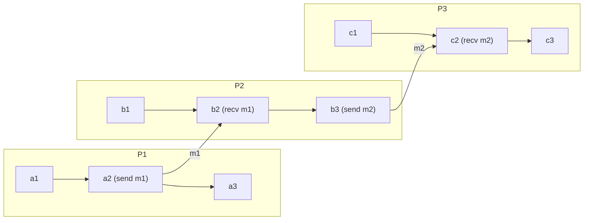

A distributed system has no shared clock and no shared memory, so no process can observe a global sequence of events. What a process can observe is exactly two things: the order of events it executed locally, and the fact that a message it received must have been sent before it arrived. Lamport's **happened-before** relation, written `a -> b`, is the closure of those two observations under transitivity, and it is the strongest ordering that can be established without trusting physical time.
 
## The Partial Order Induced by Message Passing
 
`->` is the smallest relation on events satisfying three rules:
 
1. **Process order.** If `a` and `b` are events in the same process and `a` precedes `b` in that process's local execution sequence, then `a -> b`.
2. **Message order.** If `a` is the send of message `m` and `b` is the receive of the same `m`, then `a -> b`.
3. **Transitivity.** If `a -> b` and `b -> c`, then `a -> c`.
The resulting relation is a **strict partial order**: irreflexive, asymmetric, and transitive. It is *partial* precisely because rules 1 and 2 leave most pairs of events unrelated. Two events `a` and `b` are **concurrent**, written `a || b`, when neither `a -> b` nor `b -> a` holds. Concurrency here is not a statement about wall-clock simultaneity; it is a statement about the absence of an information path. Events separated by hours are concurrent if no chain of local steps and messages connects them.
 

*A space-time diagram of three processes. `a1 -> c3` holds through the chain `a1 -> a2 -> b2 -> b3 -> c2 -> c3`, while `a3 || b1` and `a3 || c1` because no path connects them.*
 
The set of all events `e` with `e -> x` is the **causal past** of `x`, sometimes called its causal history. This is the special-relativity analogy Lamport drew on: the causal past is a backward light cone, and everything outside both cones is concurrent. The practical consequence is that the causal past is the only information `x` could possibly have been influenced by. Any state an event depends on must be reachable through message edges, and any system that lets influence travel outside those edges has broken the model, not the model's assumptions.
 
`->` captures **potential** causality, not actual causality. If a process sends a message immediately after an unrelated local computation, `->` records a dependency that no application-level logic actually has. This over-approximation is safe (it never claims independence where a dependency exists) but expensive: it inflates conflict metadata and forces unnecessary delivery ordering. Some systems narrow it explicitly, for example by tracking causality per key or per aggregate rather than per process.
 
## Concurrency Is Not Transitive
 
A frequent modeling error is treating `||` as an equivalence-like relation. It is not transitive. In the diagram above, `b1 || a3` and `a3 || c1`, but that says nothing about `b1` and `c1`. Constructing a counterexample is easy: with `a2 -> b2` and `b2 -> b3`, the event `b3` is concurrent with `a3` and `a1` is concurrent with `b1`, while `a1 -> b3` holds. Any algorithm that partitions events into "concurrency groups" and resolves each group independently is relying on transitivity that does not exist, and it will produce different results depending on the order in which pairs are compared.
 
## Consistent Cuts and Snapshots
 
A **cut** is a set of events closed under process order: for each process it contains a prefix of that process's local sequence. A cut is **consistent** if it is also closed under `->`, meaning that for every event `e` in the cut and every `f` with `f -> e`, `f` is also in the cut. Inconsistent cuts contain a message receive without its corresponding send, describing a global state that never existed and that no execution could ever have produced.
 
This is why the Chandy-Lamport snapshot algorithm exists in the form it does: marker messages propagate along the same channels as application messages, so the recorded state is guaranteed to be closed under `->` even though no process ever pauses. The same requirement drives backup consistency across sharded databases, distributed debugging and replay, and deadlock detection. A snapshot taken by sampling each shard at "the same wall-clock instant" is not a consistent cut unless clock uncertainty is bounded and accounted for, which is precisely the guarantee TrueTime sells.
 
:::danger
Restoring an inconsistent cut resurrects effects without their causes. A replica that has applied a receive whose send was rolled back will diverge permanently from every other replica, and because both replicas consider themselves internally consistent, no read-repair or anti-entropy pass will flag the divergence.
:::
 
## The Clock Condition and What Timestamps Can Prove
 
A logical clock is a function `C` assigning a number to each event. It satisfies the **clock condition** when `a -> b` implies `C(a) < C(b)`. Lamport timestamps satisfy this by incrementing on each local event and taking `max(local, received) + 1` on receive. The converse does not hold: `C(a) < C(b)` tells you nothing, because concurrent events also receive ordered timestamps. Lamport timestamps can therefore *extend* `->` into a total order (break ties by process ID) but cannot *decide* it.
 
Deciding `->` requires per-process counters. A vector clock assigns each event an N-entry vector and yields the exact characterization: `VC(a) < VC(b)` (componentwise `<=` with at least one strict `<`) holds **if and only if** `a -> b`, and incomparable vectors mean concurrency. That precision costs O(N) metadata per event or per version, where N is the number of causally independent writers.
 
| Mechanism | Decides `->`? | Metadata per event | Reuse of entries after restart | When to prefer |
|---|---|---|---|---|
| Lamport timestamp | No (one direction only) | 1 integer | Safe if monotonic | Total-order tie-breaking, mutual exclusion, request sequencing |
| Vector clock | Yes | O(N) entries | Requires incarnation ID | Multi-leader or leaderless replication with conflict detection |
| Version vector | Yes, per key | O(replicas) per key | Requires incarnation ID | Per-object conflict tracking where N is bounded by replicas, not clients |
| Dotted version vector | Yes, per key + client write | O(replicas) plus dots | Handles concurrent client writes | Dynamo-style stores with many clients per key |
| Interval tree clock | Yes | Adaptive, forks and joins | Built-in identity management | Dynamic membership where process IDs are not known up front |
| Hybrid logical clock | Yes, with bounded skew | 1 timestamp plus counter | Depends on NTP bound | Systems needing both causality and human-readable time |
 
See [Lamport Timestamps](/distributed-systems/en/foundations/time-and-ordering/lamport-timestamps/) and [Vector Clocks](/distributed-systems/en/foundations/time-and-ordering/vector-clocks/) for the algorithms and their edge cases, and [Hybrid Logical Clocks](/distributed-systems/en/foundations/time-and-ordering/hybrid-logical-clocks/) for the physical-time hybrid.
 
## Enforcing Causal Delivery
 
The most common runtime use of `->` is **causal delivery**: a message is handed to the application only after every message that happened before it has been delivered. Implemented over broadcast, this is the mechanism underneath causal consistency, and the check is purely arithmetic on vector clocks.
 
```go
package causal
 
import (
	"context"
	"errors"
	"fmt"
	"sync"
)
 
// VectorClock maps a process ID to the count of events that process has
// executed. Missing entries are implicitly zero.
type VectorClock map[string]uint64
 
// Message carries the sender's vector clock as observed at send time.
type Message struct {
	From    string
	Clock   VectorClock
	Payload []byte
}
 
var errDuplicate = errors.New("causal: message already delivered")
 
// Deliverer buffers messages until their causal dependencies are satisfied.
type Deliverer struct {
	mu         sync.Mutex
	self       string
	clock      VectorClock
	pending    []Message
	out        chan<- Message
	maxPending int
}
 
func NewDeliverer(self string, out chan<- Message, maxPending int) *Deliverer {
	return &Deliverer{
		self:       self,
		clock:      VectorClock{},
		out:        out,
		maxPending: maxPending,
	}
}
 
// deliverable applies the causal delivery test. A message from p is
// deliverable when it is the next one expected from p, and when every other
// entry in its clock is already covered by local state.
func (d *Deliverer) deliverable(m Message) (bool, error) {
	if m.From == d.self {
		return false, fmt.Errorf("causal: loopback message from %s", m.From)
	}
	want := d.clock[m.From] + 1
	switch got := m.Clock[m.From]; {
	case got < want:
		return false, errDuplicate
	case got > want:
		// Gap: an earlier message from the same sender has not arrived.
		return false, nil
	}
	for pid, n := range m.Clock {
		if pid == m.From {
			continue
		}
		if n > d.clock[pid] {
			// The sender saw an event from pid that we have not seen yet.
			return false, nil
		}
	}
	return true, nil
}
 
// Receive is safe for concurrent use. It either delivers immediately,
// buffers, or rejects when the buffer is exhausted.
func (d *Deliverer) Receive(ctx context.Context, m Message) error {
	d.mu.Lock()
	defer d.mu.Unlock()
 
	ok, err := d.deliverable(m)
	switch {
	case errors.Is(err, errDuplicate):
		return nil // At-least-once transport: silently idempotent.
	case err != nil:
		return err
	case ok:
		return d.deliverLocked(ctx, m)
	}
 
	if len(d.pending) >= d.maxPending {
		// Backpressure instead of unbounded growth. A permanently missing
		// dependency must surface as an error, not as a memory leak.
		return fmt.Errorf("causal: pending buffer full (%d), blocked on %s",
			d.maxPending, m.From)
	}
	d.pending = append(d.pending, m)
	return nil
}
 
// deliverLocked emits m, advances local state, then cascades through the
// buffer, since one delivery can unblock an arbitrary chain of others.
func (d *Deliverer) deliverLocked(ctx context.Context, m Message) error {
	for {
		select {
		case d.out <- m:
		case <-ctx.Done():
			return ctx.Err()
		}
		d.clock[m.From] = m.Clock[m.From]
 
		next := -1
		kept := d.pending[:0]
		for _, p := range d.pending {
			if next >= 0 {
				kept = append(kept, p)
				continue
			}
			ok, err := d.deliverable(p)
			if errors.Is(err, errDuplicate) {
				continue // Drop, do not re-buffer.
			}
			if err != nil {
				return err
			}
			if ok {
				next = 0
				m = p
				continue
			}
			kept = append(kept, p)
		}
		d.pending = kept
		if next < 0 {
			return nil
		}
	}
}
```
 
The two branches of the gap test are what matters operationally. A `got > want` gap means loss or reordering on a single sender's channel and is usually transient. A blocked entry for some third process `pid` means a transitive dependency is missing, and it can be permanent if that process crashed after sending to one peer and before sending to another.
 
## Failure Modes and Operational Pitfalls
 
**Hidden channels break the model silently.** `->` only knows about messages the system itself carries. A user who reads a value on replica A, then calls a colleague who writes on replica B, has created a real causal dependency the system cannot see. It records the two writes as concurrent and either flags a spurious conflict or, worse, discards one. Every out-of-band path is such a channel: a shared cache, a shared filesystem, a browser tab, a Kafka topic the tracker does not instrument, an operator running a manual script. Detection is nearly impossible after the fact; the mitigation is to route influence through tracked channels or attach client-supplied causal context to writes.
 
**Last-write-wins discards concurrency by construction.** LWW compares physical timestamps and keeps the larger, which means every concurrent pair loses one update with no error and no metric. Under clock skew it can also discard a write that *happened before* the winner in wall-clock terms but arrived with a lower timestamp. The symptom is intermittent, unreproducible data loss reported by users. See [Eventual Consistency and LWW](/distributed-systems/en/data-management/consistency-models/eventual-consistency/) for the quantified version of this trade-off.
 
**Reused identity corrupts comparison.** If a process restarts and resets its counter, or a new process reuses a retired ID, vector entries move backwards. Comparisons then report `->` where concurrency exists, and merges silently drop versions. Every identity must carry an incarnation or epoch number that increments across restarts and is part of the key.
 
**Metadata growth outruns payload.** When clients act as causal principals, N is the client count, and vectors dwarf the values they annotate. Version vectors bounded by replica count, dotted version vectors for concurrent client writes, and pruning entries below a globally acknowledged watermark are the standard fixes. The failure symptom is storage amplification and rising deserialization CPU rather than incorrectness.
 
**Causal buffers convert loss into latency.** A missing dependency shows up as delivery latency, not as an error, until the buffer fills. Instrument buffer depth, per-sender gap size, and the age of the oldest pending message; alert on age, not depth, because a slow permanent block looks identical to a healthy burst until it is too late.
 
**Ordering guarantees do not compose across partitions.** Kafka orders within a partition, not across partitions; independent RPCs create no edge; a fan-out to two services followed by their writes to a shared store produces genuine concurrency even though the application code reads sequentially. Cross-service `->` edges exist only where context is explicitly propagated, which is exactly what a trace parent header encodes. Dropping propagation at one hop deletes edges from both the observability graph and any causal-consistency mechanism riding on it.
 
## When to Reason in Terms of Happened-Before
 
Use it when concurrent updates must be **detected** rather than silently resolved: multi-leader and leaderless replication, offline-first clients that reconcile on reconnect, CRDT merge functions, collaborative editing, and any workflow where losing an update is a correctness bug rather than an acceptable approximation. Use it when you need a consistent global state, such as snapshots, backups spanning shards, or replay-based debugging. Use it when session guarantees like read-your-writes and monotonic reads must survive a client being routed to a different replica; see [Causal Consistency and Session Guarantees](/distributed-systems/en/data-management/consistency-models/causal-consistency-session-guarantees/).
 
Do not pay for it when a single leader per partition already imposes a total order on every write to that partition, since the log position subsumes `->`. Do not pay for it on high-cardinality keys with low conflict probability where the metadata per version exceeds the value itself and where a lost concurrent update carries negligible business cost. And do not expect it to provide **external consistency**: `->` says nothing about events with no information path between them, so a transaction that commits after another finished in real time may still be ordered arbitrarily unless physical time with a bounded uncertainty interval is layered on top, which is the entire point of [TrueTime and Spanner](/distributed-systems/en/foundations/time-and-ordering/truetime-spanner/).