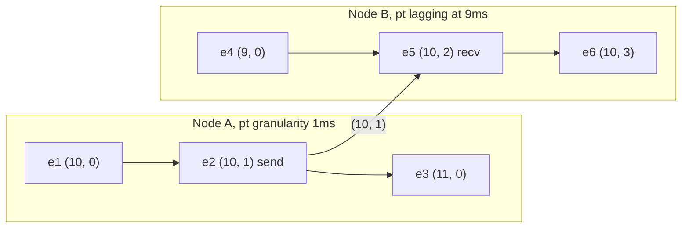
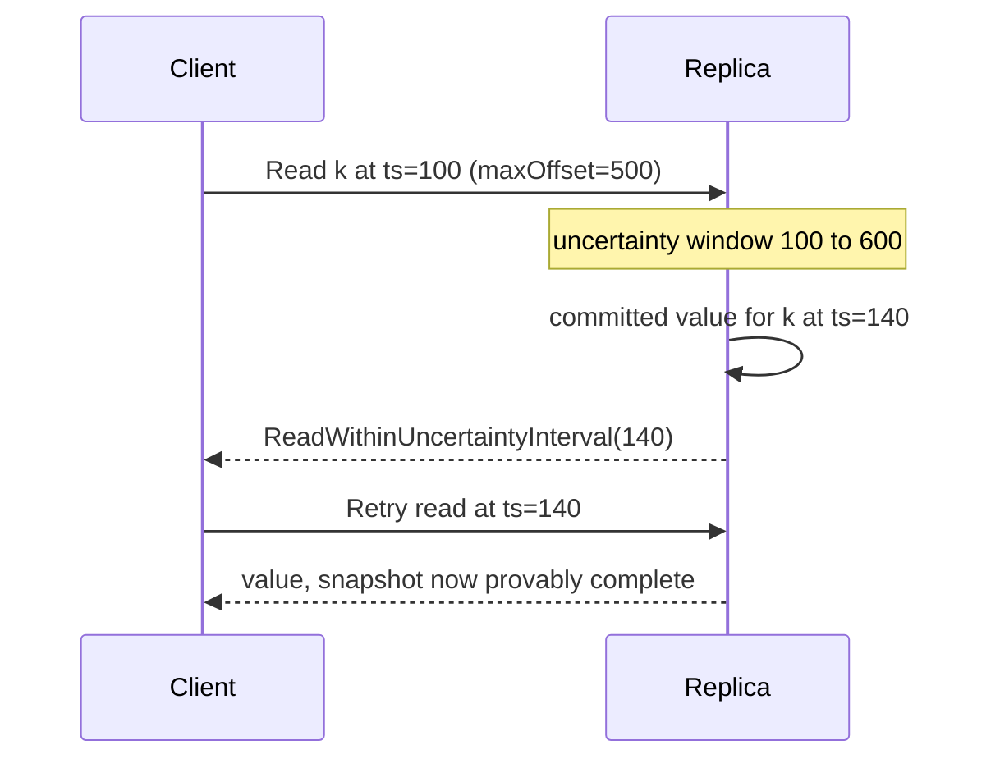

A hybrid logical clock is a pair `(l, c)`: `l` is a physical timestamp that only ever moves forward and never lags the node's own wall clock, and `c` is a logical counter that breaks ties when `l` does not advance. The pair satisfies the clock condition, so `a -> b` implies `HLC(a) < HLC(b)`, while `l` stays within the NTP skew bound of true time. That combination is what makes HLC the default timestamp in CockroachDB, YugabyteDB, MongoDB, and most distributed SQL engines built after Spanner: causality without atomic clocks, and timestamps a human can still read in a log.
 
## Update Rules
 
Let `pt` be the node's current physical clock reading in the chosen unit. Two operations maintain the pair.
 
**Local event or send:**
 
```text
l_new = max(l, pt)
if l_new == l:
    c = c + 1        // Physical clock did not advance; fall back to logical.
else:
    c = 0            // Physical clock advanced; the counter is not needed.
l = l_new
```
 
**Receive of a message stamped `(lm, cm)`:**
 
```text
l_new = max(l, lm, pt)
if   l_new == l and l_new == lm: c = max(c, cm) + 1
elif l_new == l:                 c = c + 1
elif l_new == lm:                c = cm + 1
else:                            c = 0     // pt is strictly the largest.
l = l_new
```
 
The `max(l, lm, pt)` is the Lamport `max` with the local physical reading added as a third candidate. That third term is the whole idea: whenever real time has moved past everything the system has observed, the counter resets and `l` re-anchors to physical time. The counter therefore only grows during the interval in which many causally-linked events occur inside a single physical clock tick, or in which a peer's clock is ahead of ours. Both are bounded, which is why `c` stays small.
 

*B's physical clock reads 9 when a message stamped `(10, 1)` arrives, so `l` jumps to 10 and the counter continues from the sender's value. Subsequent local events at B increment only `c` until B's own `pt` passes 10.*
 
Two properties follow directly and are worth stating precisely, because both are load-bearing in production systems:
 
- **Bounded drift from physical time.** If every node's clock is within `eps` of true time, then `l` at any node never exceeds true time by more than `eps`. HLC timestamps can therefore be compared to wall-clock deadlines, used for TTLs, and read in logs, unlike bare Lamport values.
- **Bounded counter.** `c` is bounded by the number of causally dependent events that fit inside the clock granularity plus the skew window. With millisecond granularity and a 500ms offset budget, a 16-bit counter is generous; with a 32-bit counter, overflow requires a genuine skew incident rather than load.
## Encoding and Granularity
 
The pair must fit into a single comparable value for storage keys and index prefixes. Two encodings dominate:
 
- **Packed 64-bit.** For example 48 bits of milliseconds since epoch and 16 bits of counter, or 44 bits and 20. Sorting the raw integer sorts the timestamp, which is exactly what an MVCC key suffix needs. The risk is that packing makes counter overflow a correctness event rather than a metadata event.
- **Split fields.** CockroachDB uses a 64-bit nanosecond wall time plus a separate 32-bit logical counter. Wider, but overflow is effectively impossible and the wall component is directly comparable to `time.Time`.
Granularity is a real trade-off, not a formatting choice. Coarser physical units (milliseconds) mean more events share an `l` value and the counter carries more of the ordering, which is harmless but reduces how much of the timestamp is meaningful physically. Finer units (nanoseconds) waste bits, since no clock source is accurate to nanoseconds, and inflate the value range unnecessarily.
 
## Implementation
 
```go
package hlc
 
import (
	"errors"
	"fmt"
	"math"
	"sync"
	"time"
)
 
// Timestamp is the (physical, logical) pair. Comparison is lexicographic,
// which is why the packed form sorts correctly as a single integer.
type Timestamp struct {
	WallNanos int64
	Logical   uint32
}
 
func (t Timestamp) Less(o Timestamp) bool {
	if t.WallNanos != o.WallNanos {
		return t.WallNanos < o.WallNanos
	}
	return t.Logical < o.Logical
}
 
var (
	// ErrClockOffset means a peer's clock is outside the configured budget.
	// The correct response is to remove this node from service, not to
	// accept the timestamp: accepting it propagates the bad clock cluster
	// wide and cannot be undone.
	ErrClockOffset  = errors.New("hlc: peer clock beyond max offset")
	ErrLogicalOverf = errors.New("hlc: logical counter overflow")
)
 
type Clock struct {
	mu        sync.Mutex
	physical  func() int64 // Injected for tests; must be non-decreasing.
	maxOffset time.Duration
	ts        Timestamp
}
 
func New(physical func() int64, maxOffset time.Duration) *Clock {
	return &Clock{physical: physical, maxOffset: maxOffset}
}
 
// Now applies the local-event rule and returns the new timestamp.
func (c *Clock) Now() (Timestamp, error) {
	c.mu.Lock()
	defer c.mu.Unlock()
 
	pt := c.physical()
	if pt > c.ts.WallNanos {
		c.ts = Timestamp{WallNanos: pt}
		return c.ts, nil
	}
	// Physical clock has not advanced past l, including the case where it
	// jumped backwards. l never regresses; the counter absorbs the stall.
	if c.ts.Logical == math.MaxUint32 {
		return Timestamp{}, fmt.Errorf("%w at wall=%d", ErrLogicalOverf, c.ts.WallNanos)
	}
	c.ts.Logical++
	return c.ts, nil
}
 
// Update applies the receive rule against an inbound timestamp.
func (c *Clock) Update(m Timestamp) (Timestamp, error) {
	c.mu.Lock()
	defer c.mu.Unlock()
 
	pt := c.physical()
	if m.WallNanos-pt > int64(c.maxOffset) {
		return Timestamp{}, fmt.Errorf("%w: peer=%d local=%d budget=%s",
			ErrClockOffset, m.WallNanos, pt, c.maxOffset)
	}
 
	switch {
	case m.WallNanos > c.ts.WallNanos && m.WallNanos > pt:
		c.ts = Timestamp{WallNanos: m.WallNanos, Logical: m.Logical + 1}
	case pt > c.ts.WallNanos && pt > m.WallNanos:
		c.ts = Timestamp{WallNanos: pt}
	default:
		// Local l is the maximum. Take the larger counter on a tie.
		if m.WallNanos == c.ts.WallNanos && m.Logical > c.ts.Logical {
			c.ts.Logical = m.Logical
		}
		if c.ts.Logical == math.MaxUint32 {
			return Timestamp{}, fmt.Errorf("%w at wall=%d", ErrLogicalOverf, c.ts.WallNanos)
		}
		c.ts.Logical++
	}
	return c.ts, nil
}
```
 
The `physical` function must be monotonic within the process. On Linux this means `CLOCK_MONOTONIC` for the delta and a periodically resynchronized wall anchor, not a bare `CLOCK_REALTIME` read, because a backward NTP step between two calls would otherwise stall `l` and burn counter space for the duration of the step. Go's `time.Now` carries a monotonic reading that is only valid for subtraction within a process, which is exactly the right primitive for the delta but not for the anchor.
 
## Uncertainty Intervals: What HLC Does Not Give You
 
HLC provides causal ordering and approximate physical ordering. It does **not** provide external consistency, because two transactions with no communication between them can commit in real time order `T1` then `T2` while receiving timestamps in the opposite order, as long as the difference is within the skew bound. Systems that need serializable snapshot reads close the gap with an **uncertainty interval**: a read at timestamp `ts` treats the window `[ts, ts + maxOffset]` as ambiguous, and any value found in that window forces the read to be retried at the higher timestamp.
 

*A value inside the uncertainty window cannot be proven to be concurrent or prior, so the transaction restarts at the observed timestamp rather than risking a stale read.*
 
The operational cost is that a larger `maxOffset` widens the window and increases restart rate under contention. Tightening the offset budget reduces restarts but makes the cluster more sensitive to real clock drift, since a node exceeding the budget must remove itself from service. That tension is the entire argument for TrueTime's tightly bounded `eps`; see [Google TrueTime and Spanner](/distributed-systems/en/foundations/time-and-ordering/truetime-spanner/).
 
## Trade-offs Against the Alternatives
 
| Dimension | Wall clock | Lamport | Vector clock | HLC |
|---|---|---|---|---|
| Size | 8 bytes | 8 bytes | O(N) entries | 8 to 12 bytes |
| `a -> b` implies order | No | Yes | Yes | Yes |
| Order implies `a -> b` | No | No | Yes | No |
| Detects concurrency | No | No | Yes | No |
| Close to real time | Yes | No | No | Yes, within `eps` |
| Survives clock skew safely | No | Yes | Yes | Yes, up to `maxOffset` |
| When to prefer | Display, TTLs only | Terms, ballots, fencing | Multi-writer conflict detection | MVCC timestamps, snapshot reads, CDC ordering |
 
Note the third row: HLC does not decide concurrency. Two incomparable events always receive ordered HLC values, so a store that needs siblings still needs [vector clocks](/distributed-systems/en/foundations/time-and-ordering/vector-clocks/). HLC replaces the scalar Lamport clock, not the vector.
 
## Failure Modes and Operational Pitfalls
 
**A forward clock jump poisons the cluster permanently.** A misconfigured NTP server, a VM restored from a snapshot with a future clock, or a manual `date` command sets one node's `pt` hours ahead. That node stamps events with future values, every peer adopts them through `max`, and because `l` never regresses, the entire cluster is stuck in the future until real time catches up. Symptoms: writes appear with timestamps ahead of `now()`, TTL-based expiry fires early or never, uncertainty restarts spike, follower reads at "now minus staleness" return nothing. This is why `Update` must reject rather than accept an out-of-budget timestamp, and why CockroachDB nodes deliberately terminate on sustained offset violation. Recovery from an accepted jump means quiescing writes and waiting, not editing timestamps.
 
:::danger
Accepting a peer timestamp outside `maxOffset` is unrecoverable in place. The bad value propagates through every `max` in the system within one gossip round, and no subsequent correction can pull `l` back down without violating monotonicity. Rejecting the message and taking the node out of service is strictly the safer failure.
:::
 
**Unauthenticated timestamps allow inflation.** Any client that can send a message can push `l` forward. MongoDB signs `clusterTime` with an HMAC precisely so that an untrusted driver cannot advance the cluster clock. If HLC values cross a trust boundary, either sign them or clamp them at the boundary.
 
**Backward jumps burn counter space silently.** A backward step leaves `l` unchanged while `c` increments on every event. Nothing breaks until the counter approaches its width, so a packed 16-bit counter under a multi-second backward step during a high write rate is an overflow incident. Instrument the counter value itself, not just the wall component, and alert on any sustained nonzero baseline.
 
**Leap second handling must match across the fleet.** Mixing smeared and stepped leap-second handling in the same cluster creates a guaranteed multi-hundred-millisecond disagreement for a day. Either the whole fleet smears against the same NTP source or none of it does.
 
**Persisting nothing across restart.** After a crash, a node resumes from its physical clock. If that clock is behind the values it issued before the crash, it can reissue timestamps in a range already used for other events. Systems address this by persisting a high-water mark, by waiting out `maxOffset` before serving, or both. Skipping this is the same class of bug as a non-durable [Lamport counter](/distributed-systems/en/foundations/time-and-ordering/lamport-timestamps/).
 
**Causality still only travels through tracked channels.** HLC inherits the hidden-channel limitation of the underlying relation. An out-of-band path between two clients produces no `max` anywhere, so the ordering is decided by physical clocks alone and is only as good as `eps`; see [The Happened-Before Relation](/distributed-systems/en/foundations/time-and-ordering/happened-before/).
 
## When to Use and When Not To
 
Use HLC as the timestamp for MVCC versions, snapshot reads, and follower reads with bounded staleness, where you need both a causally sound order and a value comparable to wall time; this is the design in [CockroachDB](/distributed-systems/en/case-studies/distributed-sql/cockroachdb-raft-hlc/). Use it for ordering CDC streams and cross-service event logs, where consumers need to reason about "events before time T" without a global sequencer. Use it for session tokens that give a client read-your-writes across replicas: the client carries the highest HLC it has seen and replicas wait until they have caught up.
 
Do not use it when the application must distinguish concurrent writes, which requires vectors. Do not use it for fencing where a strictly monotone counter per resource is simpler and immune to clock configuration entirely. Do not use it when external consistency is a hard requirement and you cannot pay for uncertainty restarts, which is the case for TrueTime-backed designs. And do not deploy it without an enforced clock-offset budget, monitoring on measured peer offset, and a node-level policy to self-remove on violation, since without those the algorithm's safety argument has no foundation.