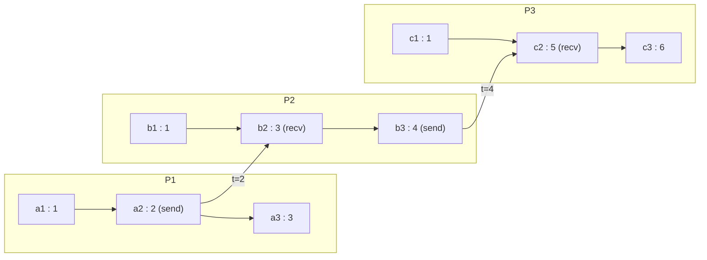

A Lamport timestamp is a single unsigned integer per process, maintained by two rules, that guarantees `a -> b` implies `C(a) < C(b)`. It is the cheapest possible mechanism satisfying the **clock condition**, and the price of that cheapness is that the implication runs in one direction only: from a pair of timestamps alone you cannot tell whether the events were causally ordered or concurrent. Understanding exactly what the number proves, and what it merely suggests, is the difference between a correct fencing token and silent data loss.
 
## The Algorithm
 
Each process `p` holds a counter `C_p`, initialized to zero, and applies two rules:
 
- **IR1 (local event).** Before timestamping any local event, including a send, increment: `C_p = C_p + 1`.
- **IR2 (receive).** On receiving a message carrying timestamp `t`, set `C_p = max(C_p, t) + 1`, then timestamp the receive event with the new value.
The `max` in IR2 is the entire mechanism. It drags the receiver's counter past anything the sender had observed, so every element of the sender's causal past is now strictly below the receive event. The `+ 1` after the `max` is not cosmetic: without it, a send and its matching receive would share a timestamp, and `->` would map to `<=` rather than `<`, destroying the strictness that tie-breaking later depends on.
 

*Counter propagation under IR1 and IR2. Note `a3 : 3` and `b2 : 3` share a value while being causally unrelated, and `b1 : 1` carries a smaller timestamp than `a3 : 3` despite `b1 || a3`.*
 
That diagram contains both failure modes of the scalar clock in one picture. Equal timestamps do not mean concurrency; they mean the counters happened to align. A smaller timestamp does not mean "happened before"; it means only "did not happen after". The relation the clock actually certifies is the contrapositive: if `C(a) >= C(b)`, then `a -> b` is impossible. That is a real, usable guarantee, and it is what makes Lamport clocks correct for rejecting stale operations even though they are useless for detecting conflicts.
 
## Implementation With Durable Monotonicity
 
The counter must survive process restarts, otherwise a restarted process re-issues timestamps it has already used and the clock condition breaks across the restart boundary. Persisting on every event costs an `fsync` per operation, so production implementations reserve a window ahead of the current value and only persist when the window is exhausted, accepting a jump forward after a crash.
 
```go
package lamport
 
import (
	"context"
	"fmt"
	"sync"
)
 
// Persister durably records a counter high-water mark. Store must not return
// nil until the value has reached stable storage.
type Persister interface {
	Store(ctx context.Context, highWater uint64) error
	Load(ctx context.Context) (uint64, error)
}
 
// Stamp is the totally ordered timestamp: the scalar counter plus the
// originating process ID used only to break ties.
type Stamp struct {
	Counter uint64
	PID     string
}
 
// Less implements the arbitrary but consistent total order that extends the
// happened-before partial order.
func (s Stamp) Less(o Stamp) bool {
	if s.Counter != o.Counter {
		return s.Counter < o.Counter
	}
	return s.PID < o.PID
}
 
func (s Stamp) String() string { return fmt.Sprintf("%d@%s", s.Counter, s.PID) }
 
type Clock struct {
	mu        sync.Mutex
	pid       string
	counter   uint64
	highWater uint64 // Persisted; counter is never allowed to exceed it.
	window    uint64 // Counters reserved per fsync. Tune against restart jump.
	store     Persister
}
 
func New(ctx context.Context, pid string, window uint64, store Persister) (*Clock, error) {
	if window == 0 {
		return nil, fmt.Errorf("lamport: window must be positive")
	}
	hw, err := store.Load(ctx)
	if err != nil {
		return nil, fmt.Errorf("lamport: load high-water mark: %w", err)
	}
	// Resume at the persisted mark, not at the last observed counter. The
	// gap is wasted counter space, which is free; reuse would not be.
	return &Clock{pid: pid, counter: hw, highWater: hw, window: window, store: store}, nil
}
 
// reserveLocked extends the durable window when the counter catches up to it.
func (c *Clock) reserveLocked(ctx context.Context) error {
	if c.counter <= c.highWater {
		return nil
	}
	next := c.counter + c.window
	if err := c.store.Store(ctx, next); err != nil {
		// Roll back so no timestamp escapes that is not covered by a
		// durable mark. Callers must treat this as a hard failure.
		c.counter = c.highWater
		return fmt.Errorf("lamport: reserve to %d: %w", next, err)
	}
	c.highWater = next
	return nil
}
 
// Tick applies IR1 for a local event or a send.
func (c *Clock) Tick(ctx context.Context) (Stamp, error) {
	c.mu.Lock()
	defer c.mu.Unlock()
	c.counter++
	if err := c.reserveLocked(ctx); err != nil {
		return Stamp{}, err
	}
	return Stamp{Counter: c.counter, PID: c.pid}, nil
}
 
// Update applies IR2 for a receive. remote is the timestamp carried by the
// inbound message.
func (c *Clock) Update(ctx context.Context, remote uint64) (Stamp, error) {
	c.mu.Lock()
	defer c.mu.Unlock()
	if remote > c.counter {
		c.counter = remote
	}
	c.counter++
	if err := c.reserveLocked(ctx); err != nil {
		return Stamp{}, err
	}
	return Stamp{Counter: c.counter, PID: c.pid}, nil
}
```
 
The rollback in `reserveLocked` is the non-obvious part. If the durable store fails, the in-memory counter must not stay ahead of the persisted mark, because a crash immediately afterwards would resurrect the process at a lower value and hand out duplicate timestamps. Handing out a timestamp that is not covered by a durable mark is the same class of bug as acknowledging a write before the WAL has been flushed.
 
## From Partial Order to Total Order
 
Pairing the counter with a process ID and comparing lexicographically, as `Stamp.Less` does, yields a **total order** on all events. It is consistent with `->` (every causal pair is ordered correctly) but otherwise arbitrary, since concurrent pairs are ordered by whatever the tie-break says. That arbitrariness is the point: many algorithms need *some* agreed sequence and do not care which one, as long as every process computes the same one.
 
Lamport's original application was distributed mutual exclusion: each process broadcasts a timestamped request, queues all requests in `Stamp` order, and enters the critical section when its own request is at the head and it has received a strictly later message from every other process. The correctness argument depends on two assumptions that rarely hold in practice and are the reason nobody deploys it as written:
 
- **FIFO channels per pair.** Out-of-order delivery lets a process believe a peer has no outstanding request when it does.
- **No failures.** A single crashed participant blocks every other process forever, because the "later message from everyone" condition can never be satisfied. There is no leader, no lease, and no timeout in the algorithm.
Production mutual exclusion therefore uses leases and fencing rather than a global request queue; see [Lease-Based Locking](/distributed-systems/en/coordination/distributed-locking/lease-based-locking/) and [Fencing Tokens](/distributed-systems/en/coordination/distributed-locking/fencing-tokens/).
 
## Where Lamport Clocks Actually Ship
 
The scalar clock rarely appears under its own name, but its shape is everywhere a system needs monotone epochs that reject stale actors:
 
- **Raft terms.** A term increments on every election attempt, travels on every RPC, and any node seeing a higher term adopts it and steps down. That is IR2 with a step-down side effect; a message carrying a lower term is rejected exactly because `C(a) >= C(b)` proves the sender cannot have observed current state. See [Raft](/distributed-systems/en/coordination/consensus-algorithms/raft/).
- **Paxos ballot numbers.** Ballots are `(counter, proposer_id)` pairs compared lexicographically, which is `Stamp.Less` verbatim, and an acceptor's promise is a refusal to move backwards in that total order.
- **ZooKeeper zxid and Kafka leader epochs.** Both are monotone counters that partition history into eras; a replica presenting an old epoch is fenced. The epoch is durable for the same reason `reserveLocked` persists.
- **Fencing tokens for storage.** A lock service issues a strictly increasing token, and the storage layer rejects any write carrying a token below the highest it has seen. This is the pure contrapositive use of the clock condition, and it is what makes fencing sound even when leases expire under GC pauses.
| Property | Lamport timestamp | Vector clock | Wall-clock timestamp | Hybrid logical clock |
|---|---|---|---|---|
| Size per event | 1 counter | O(N) entries | 1 timestamp | 1 timestamp plus counter |
| Proves `a -> b` from values | No | Yes | No | Yes, within skew bound |
| Detects concurrency | No | Yes | No | Yes |
| Rejects stale actors | Yes | Yes, at higher cost | Unsafe under skew | Yes |
| Relatable to human time | No | No | Yes | Yes |
| When to prefer | Epochs, terms, ballots, fencing, arbitrary total order | Conflict detection in multi-writer replication | Never for ordering; only for display and TTLs | Causality plus debuggable timestamps |
 
## Failure Modes and Operational Pitfalls
 
**Using Lamport order as merge semantics.** Because the total order is arbitrary among concurrent events, resolving replica conflicts by "highest Lamport timestamp wins" silently discards one of two genuinely concurrent updates, and the survivor is decided by a process ID tie-break with no relationship to user intent. The value ordering looks deterministic, which makes the loss invisible in tests. If concurrent updates must be preserved or surfaced, the metadata has to be a [vector clock](/distributed-systems/en/foundations/time-and-ordering/vector-clocks/), not a scalar.
 
**Counter inflation from a single fast or hostile peer.** One process that ticks in a tight loop, or a malformed message carrying a near-maximum counter, propagates through every `max` in the cluster and permanently inflates all counters. With `uint64` there is no overflow risk in any realistic lifetime, but with a 32-bit counter or a counter packed into a bitfield alongside an epoch, this is a wrap-around incident. Validate inbound timestamps against a plausibility bound before applying IR2, and alert on the delta between a node's counter and its message rate.
 
:::caution
Packing a Lamport counter into a fixed bitfield, for instance 22 bits of counter alongside a node ID and epoch, converts inflation from a cosmetic issue into a correctness one. Once it wraps, the clock condition is violated and stale actors pass every fencing check. Budget the bit width against the *inflated* rate, not the local event rate.
:::
 
**Forgetting IR1 on sends, or applying IR2 without the increment.** Both bugs produce a clock that mostly works. Missing IR1 on a send means two causally ordered events can carry the same value; missing the `+ 1` in IR2 means a receive shares a timestamp with its send. Neither shows up under low concurrency; both surface as rare, unreproducible ordering violations under load. The regression test is a property test asserting strict monotonicity along every causal chain, not an example test.
 
**Non-durable counters after restart.** A process that restarts from zero re-issues low timestamps that peers have already surpassed. Its messages are then either ignored by fencing logic (unavailability) or, worse, accepted by any component that only compares against its own local counter (correctness). The symptom is a node that appears healthy, sends traffic, and has none of it take effect.
 
**Assuming any relationship to real time.** Lamport values are unitless. A timestamp of 4 million says nothing about when an event occurred, cannot be compared across disjoint clusters that never exchange messages, and cannot drive TTLs, retention, or expiry. Systems that need both properties reach for [Hybrid Logical Clocks](/distributed-systems/en/foundations/time-and-ordering/hybrid-logical-clocks/), which keep the `max` rule but anchor the value near physical time.
 
**Cross-cluster comparison.** Two clusters that never communicate have counters that drift arbitrarily. Merging their event logs by Lamport order produces a sequence that is consistent with neither cluster's real history. Any federation boundary needs a shared epoch or a physical anchor.
 
## When to Use and When Not To
 
Use a Lamport timestamp when you need a **monotone epoch** that lets a receiver reject anything a stale actor could have produced: leader terms, configuration versions, lock generations, storage fencing tokens, cache generation counters. Use it when you need a deterministic, cluster-wide total order over requests and the specific order among concurrent requests is semantically irrelevant, such as sequencing operations into a replicated log. Use it when metadata size is dominated by per-event overhead and the writer count is large enough that O(N) vectors are unaffordable.
 
Do not use it when the application must know whether two updates were concurrent, since the scalar loses exactly that information. Do not use it when a single-partition leader already assigns log offsets, because the offset is a stronger and cheaper ordering. Do not use it for anything that must correlate with human time or with events outside the message-passing system. And do not use it as a unique identifier: `(counter, pid)` pairs are unique, but bare counters collide across processes by construction, which is why [distributed ID generation](/distributed-systems/en/foundations/time-and-ordering/distributed-id-generation/) schemes always embed a node identifier.