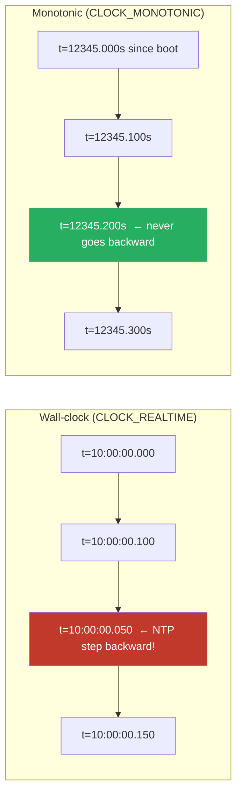
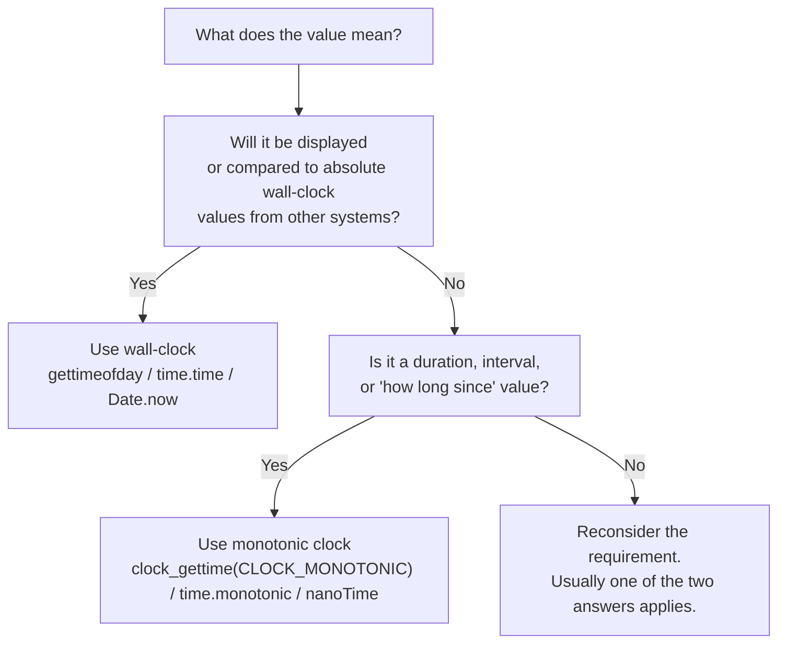

Operating systems expose at least two different clocks to applications, with different semantics, different guarantees, and entirely different failure modes. The names vary by platform — `CLOCK_REALTIME` and `CLOCK_MONOTONIC` on Linux, `System.currentTimeMillis()` and `System.nanoTime()` in Java, `time.time()` and `time.monotonic()` in Python, `time.Now()` returning both readings in Go — but the underlying distinction is the same: one tracks wall-clock time (what humans call "now"), the other tracks elapsed time (how long since some unspecified moment). Using the wrong one is one of the most common sources of subtle production bugs in distributed systems, and the bug typically only surfaces during a specific environmental event: an NTP adjustment, a leap second, a daylight saving transition, or a clock skew between nodes.
 
The decision rule is straightforward to state but easy to get wrong in practice: **wall-clock time is for displaying to humans; monotonic time is for everything else**. The reasoning behind that rule, and the specific APIs to use to implement it correctly, are the subject of this page.
 
## What Each Clock Actually Measures
 
A **wall-clock** (time-of-day) clock attempts to report the current UTC time, derived from the system's idea of when the Unix epoch occurred plus the elapsed time since then, as adjusted by NTP and any explicit clock-setting operations. It is intended to correspond to "the time" — the same value a person would write on a document or a log entry would print.
 
A **monotonic clock** reports the elapsed time since some unspecified reference point (typically system boot, but the specific zero is irrelevant by design). It guarantees that successive reads never return decreasing values, and that the rate of advance approximately tracks elapsed physical time. It is intended for measuring durations, intervals, and "how long since X" computations.
 
The critical guarantees are different:
 
| Property | Wall-clock | Monotonic |
|---|---|---|
| Reports current UTC time | Yes | No |
| Survives NTP step backward without going backward | No | Yes |
| Continues advancing during NTP slew | Yes (at modified rate) | Yes (at corrected rate) |
| Affected by daylight saving transitions | Sometimes (depends on timezone API) | No |
| Affected by leap seconds | Yes | Implementation-defined |
| Reference epoch | Unix epoch (1970-01-01 UTC) | Unspecified (typically boot) |
| Suitable for cross-machine comparison | Approximately (within clock skew) | No (different reference per machine) |
| Suitable for measuring elapsed time | No | Yes |
 
The most important difference, and the one that causes the most production bugs: **wall-clock time can move backward**. When NTP discovers that a server's clock is 200ms ahead of correct time, it can step the clock backward by 200ms — meaning two consecutive calls to `gettimeofday()` may return values where the second is earlier than the first.
 

*Wall-clock can step backward during NTP correction; monotonic clock never does. The two readings reflect entirely different abstractions.*
 
## The Failure Modes of Using Wall-Clock Time for Durations
 
Using wall-clock time to measure intervals — duration of a request, time until a lease expires, age of a cache entry — produces a class of bugs that are notoriously hard to diagnose because they only manifest during specific environmental events.
 
### Negative Durations
 
The simplest failure: a duration calculation produces a negative value.
 
```python
# WRONG: using wall-clock time for duration
start = time.time()  # Returns wall-clock seconds since epoch
do_work()
elapsed = time.time() - start
 
# If NTP stepped backward during do_work(), elapsed is negative.
# Downstream code that assumes elapsed >= 0 fails in surprising ways:
if elapsed < timeout:
    # This branch is taken with negative elapsed -- 
    # the request "completed faster than instantly"
    pass
```
 
Negative durations propagate into:
- Histograms and metrics (Prometheus's `Histogram.observe(negative_value)` is undefined behavior)
- Rate limiter token bucket refill calculations (refill = elapsed × rate; negative elapsed means negative tokens added)
- Cache TTL computations (age = now - inserted_at; negative age means "never expires")
- SLA latency reports (negative latencies in P99 calculations skew aggregates)
### Apparent Infinite Loops
 
A timeout loop that uses wall-clock time can become an infinite loop after a forward clock step.
 
```python
# WRONG: using wall-clock time for timeout polling
deadline = time.time() + 30  # 30-second deadline
 
while time.time() < deadline:
    if check_condition():
        return True
    time.sleep(0.1)
 
return False  # Timeout
```
 
If NTP steps the clock forward by 60 seconds at the moment this loop starts, `deadline` is set 60 seconds further in the future than intended. The loop will run for 90 seconds, not 30. If the clock steps backward by 60 seconds mid-loop, the loop runs for 90 seconds for a different reason — the time appears to flow backward, extending the deadline relatively further in the future. Either way, the timeout is wrong.
 
### Lease and Lock Expiry Bugs
 
Wall-clock-based distributed locks are particularly dangerous because the timing assumptions cross machine boundaries.
 
```python
# Distributed lock with wall-clock TTL -- DANGEROUS
def acquire_lock(key, ttl_seconds=30):
    expiry = time.time() + ttl_seconds  # Wall-clock expiry
    redis.set(key, "locked", nx=True, exat=int(expiry))
    return expiry
 
def is_lock_still_held(expiry):
    # If wall-clock stepped forward, this returns False prematurely
    # If wall-clock stepped backward, this returns True after actual expiry
    return time.time() < expiry
```
 
Two nodes can simultaneously believe they hold the same lock if their wall clocks have drifted in opposite directions. This is the failure mode that Martin Kleppmann analyzed in his 2016 critique of the Redlock algorithm: a node whose clock is running slightly fast believes its lock has expired and releases it; another node acquires the lock; the first node — using its lease token — still believes it holds the lock and writes data that the second node also writes.
 
:::danger
Distributed locks based on wall-clock TTLs are fundamentally unsafe in the presence of clock skew between nodes. Fencing tokens (monotonically increasing sequence numbers that the lock service issues with each acquisition) are the only mechanism that prevents two clients from believing they hold the same lock simultaneously. Even with monotonic clocks within each node, locks across nodes require something stronger than time-based expiry. See [Fencing Tokens](/distributed-systems/en/coordination/distributed-locking/fencing-tokens/).
:::
 
### Time-Based Sequencing Errors
 
A common pattern uses timestamps as a tiebreaker in conflict resolution: "the write with the newer timestamp wins." This is the **Last Write Wins (LWW)** strategy used by Cassandra, DynamoDB, and many CRDT implementations. It fundamentally depends on wall-clock time, and is therefore subject to all wall-clock failure modes.
 
If two nodes write concurrently and the node with the slower clock writes second (in real time) but with an earlier timestamp (in wall-clock time), the system silently keeps the earlier write — losing data without any error indication. The 2012 Cassandra incident during a leap second was exactly this: the JVM's clock stepped back 1 second, causing subsequent writes to appear "older" than recently written data, and the gossip protocol propagated the older data as authoritative.
 
## When Wall-Clock Time Is the Right Answer
 
Wall-clock time is the right choice when the *meaning* of the value is "the time as humans understand it." Specifically:
 
**Log timestamps for human reading.** A log line `2025-07-14T15:43:21.847Z user_id=12345 action=login` is correct with wall-clock time. A 100ms drift in the log timestamp is not a correctness issue — it just makes the log entry slightly inaccurate, which is acceptable.
 
**Scheduled events at absolute times.** "Run this report at 03:00 UTC every day" requires wall-clock time. The cron daemon, Kubernetes CronJobs, and similar schedulers must use wall-clock time because the user's intent is expressed in wall-clock terms.
 
**Document timestamps for users.** Created-at and updated-at timestamps stored in databases are wall-clock values because users expect them to correspond to "the time" in the human sense.
 
**Audit trails and compliance.** Regulatory and security requirements typically specify wall-clock timestamps. The slight imprecision relative to monotonic time is acceptable for audit purposes.
 
**Coarse-grained TTLs where 1-second uncertainty is tolerable.** A 60-second cache entry, a 1-hour session, a 24-hour token — for these, wall-clock-based expiry is fine because the failure mode (cache entry expires 100ms early or late) does not produce incorrect behavior.
 
The common thread: wall-clock time is appropriate when the value will be *displayed* or *compared semantically against human-meaningful absolute times*, and when small inaccuracies do not cause correctness problems.
 
## When Monotonic Time Is the Right Answer
 
Monotonic time is the right choice when the *meaning* of the value is "how long since X." Specifically:
 
**Measuring durations.** Request latencies, function execution times, database query durations, network round-trip times — anything where the computed value is "elapsed time" rather than "the time."
 
**Timeouts and deadlines.** A 30-second request timeout means "30 seconds of elapsed wall-clock-rate time from when the request started," not "until the wall-clock reads 30 seconds after a specific moment." Monotonic time captures the former correctly.
 
**Rate limiters and token buckets.** Refill rates are expressed as "tokens per second of elapsed time." The token bucket implementation must compute elapsed time using monotonic clocks; otherwise, NTP steps cause incorrect refill amounts.
 
**Backoff timing in retries.** Exponential backoff with jitter computes wait times as elapsed-time durations. These must use monotonic time.
 
**Health check intervals.** "Send a heartbeat every 5 seconds" means every 5 seconds of elapsed time. If wall-clock steps backward, a wall-clock-based health checker will pause for the duration of the step.
 
**Distributed consensus timers.** Raft election timeouts, ZooKeeper session timeouts, and similar protocol timers must use monotonic time. Production incidents have been caused by leader election storms triggered by simultaneous wall-clock steps causing all followers to consider the leader's heartbeats overdue.
 
**Performance benchmarks and profiling.** Any code that measures "how long did this take" must use monotonic time for the measurement to be meaningful.
 

*The clock selection decision tree: when in doubt, ask whether the value's meaning is "the time" or "elapsed time."*
 
## Platform-Specific API Reference
 
The naming and semantics vary by language and platform. The following are the correct API choices for each common environment.
 
### C / POSIX
 
The `clock_gettime()` function takes a clock ID specifying which clock to read:
 
```c
#include <time.h>
 
struct timespec wall_ts, mono_ts;
 
// Wall-clock time, can be set by NTP, can go backward
clock_gettime(CLOCK_REALTIME, &wall_ts);
 
// Monotonic time, never goes backward, not affected by NTP steps
clock_gettime(CLOCK_MONOTONIC, &mono_ts);
 
// Monotonic time that does NOT advance during system suspend
// (Linux-specific, useful for some embedded scenarios)
clock_gettime(CLOCK_MONOTONIC_RAW, &mono_ts);
 
// CLOCK_BOOTTIME advances during suspend (Linux-specific)
// Useful when measuring real elapsed time across sleep events
clock_gettime(CLOCK_BOOTTIME, &mono_ts);
```
 
`CLOCK_MONOTONIC` is the standard choice for duration measurement. `CLOCK_MONOTONIC_RAW` provides a clock not subject to NTP slewing, useful when you specifically want hardware-rate elapsed time. `CLOCK_BOOTTIME` is useful for measuring durations that should include any system suspend time (e.g., on a mobile device that may sleep).
 
### Java / JVM
 
```java
// WRONG for durations -- wall-clock, can go backward
long startMs = System.currentTimeMillis();
doWork();
long elapsedMs = System.currentTimeMillis() - startMs;  // May be negative!
 
// CORRECT for durations -- monotonic, never goes backward
long startNs = System.nanoTime();
doWork();
long elapsedNs = System.nanoTime() - startNs;  // Always non-negative
 
// java.time package: Instant uses wall-clock by default
Instant now = Instant.now();  // Uses CLOCK_REALTIME equivalent
 
// For durations between Instants, prefer Duration
Duration timeout = Duration.ofSeconds(30);
 
// Java 9+: use a Clock to make code testable and clear
Clock systemUtc = Clock.systemUTC();  // Wall-clock
// There is no built-in monotonic Clock -- use System.nanoTime() directly
```
 
The most common Java mistake: using `System.currentTimeMillis()` for timeout deadlines or duration measurements. `System.nanoTime()` is the correct API for these.
 
### Go
 
Go's `time.Now()` cleverly returns a `time.Time` value that includes *both* a wall-clock reading and a monotonic reading. Operations that compute differences between `time.Time` values automatically use the monotonic component when available:
 
```go
import "time"
 
// time.Now() returns a Time with both wall-clock and monotonic readings
start := time.Now()
doWork()
 
// time.Since uses the monotonic component automatically -- correct duration
elapsed := time.Since(start)  // Equivalent to time.Now().Sub(start)
 
// Comparisons of two time.Time values from time.Now() use monotonic component
later := time.Now()
if later.After(start) {  // Correct comparison using monotonic
    // ...
}
 
// WARNING: time.Time values serialized to JSON or stored in DB lose
// the monotonic component. When deserialized, comparisons use wall-clock.
// For persisted timestamps, treat them as wall-clock values.
serialized, _ := start.MarshalJSON()
var restored time.Time
restored.UnmarshalJSON(serialized)
// restored does NOT have a monotonic reading -- subsequent comparisons use wall-clock
 
// To explicitly strip the monotonic reading:
wallOnly := start.Round(0)
```
 
Go's design eliminates the most common monotonic-vs-wall-clock bugs by default: as long as you use `time.Since`, `time.Until`, or `t1.Sub(t2)` for duration computation, you get correct monotonic behavior automatically. The pitfall is values that have lost their monotonic component through serialization.
 
### Python
 
```python
import time
 
# WRONG for durations -- wall-clock
start = time.time()
do_work()
elapsed = time.time() - start  # May be negative or skip during NTP adjustment
 
# CORRECT for durations -- monotonic since Python 3.3
start = time.monotonic()
do_work()
elapsed = time.monotonic() - start  # Always non-negative
 
# Even higher precision (Python 3.7+)
start = time.monotonic_ns()  # Integer nanoseconds, no float precision loss
do_work()
elapsed_ns = time.monotonic_ns() - start
 
# For wall-clock with timezone-aware datetime
from datetime import datetime, timezone
now = datetime.now(timezone.utc)  # Wall-clock UTC
```
 
### JavaScript / Node.js
 
```javascript
// WRONG for durations -- wall-clock
const start = Date.now();
await doWork();
const elapsed = Date.now() - start;  // May be negative after clock adjustment
 
// CORRECT for durations -- monotonic high-resolution time
const start = performance.now();  // Returns DOMHighResTimeStamp (ms with sub-ms precision)
await doWork();
const elapsed = performance.now() - start;  // Always non-negative
 
// Node.js specific: process.hrtime.bigint() for nanosecond precision
const start = process.hrtime.bigint();
await doWork();
const elapsed = process.hrtime.bigint() - start;  // BigInt nanoseconds
```
 
### Rust
 
```rust
use std::time::{Instant, SystemTime, UNIX_EPOCH};
 
// CORRECT for durations -- Instant is monotonic by definition
let start = Instant::now();
do_work();
let elapsed = start.elapsed();  // Duration, always non-negative
 
// Wall-clock when needed (rare)
let now = SystemTime::now();
let since_epoch = now.duration_since(UNIX_EPOCH)
    .expect("Time went backward");  // Yes, this can fail!
```
 
Rust's standard library separates these into two distinct types: `Instant` is monotonic-only and cannot be converted to/from wall-clock time, while `SystemTime` is wall-clock and explicitly returns a `Result` from comparison operations to acknowledge that wall-clock arithmetic can fail. This type-level separation prevents the entire class of "used the wrong clock" bugs at compile time.
 
## Combining Both Clocks: Wall-Clock Reading with Monotonic Tracking
 
Some scenarios require both: knowing approximately what wall-clock time an event occurred, while also being able to compute elapsed time accurately. The pattern is to capture both readings at the start and only use them appropriately:
 
```go
type Event struct {
    WallTime    time.Time     // For display, log correlation, persistence
    MonoTime    time.Time     // Captured from time.Now() -- has monotonic reading
}
 
func NewEvent() *Event {
    now := time.Now()
    return &Event{
        WallTime: now,
        MonoTime: now,  // Same value, but used for different purposes
    }
}
 
func (e *Event) AgeForLogging() string {
    // Wall-clock age for human-readable log output
    return time.Since(e.WallTime).String()  // Imprecise but ok for logs
}
 
func (e *Event) AgeForExpiry() time.Duration {
    // Monotonic age for correctness-critical expiry decisions
    return time.Since(e.MonoTime)  // Precise, NTP-step-safe
}
```
 
In Go, `time.Now()` already provides this behavior in a single value. In other languages without this design, you need to capture both readings explicitly:
 
```python
import time
from dataclasses import dataclass
 
@dataclass
class TimestampedEvent:
    wall_time: float  # Wall-clock seconds since epoch -- for display
    mono_time: float  # Monotonic seconds since reference -- for elapsed-time math
 
    @classmethod
    def now(cls):
        # Capture both atomically -- they should be very close to each other
        return cls(
            wall_time=time.time(),
            mono_time=time.monotonic(),
        )
 
    def age(self) -> float:
        # Use monotonic for correctness
        return time.monotonic() - self.mono_time
 
    def __str__(self) -> str:
        # Use wall-clock for display
        return f"Event at {time.ctime(self.wall_time)}"
```
 
## The Special Case: Cross-Machine Comparisons
 
The monotonic clock guarantees do not extend across machines. Each machine has its own monotonic clock with its own reference epoch (typically system boot time). A monotonic timestamp from machine A cannot be meaningfully compared to a monotonic timestamp from machine B — they reference different zero points.
 
For cross-machine event ordering, neither wall-clock nor monotonic time is sufficient on its own:
 
- **Wall-clock** is subject to inter-machine clock skew (typically 1-10 ms, worst case 100+ ms) and the failure modes documented above.
- **Monotonic** is per-machine only; there is no shared reference.
The correct mechanisms for cross-machine ordering are **logical clocks** (Lamport timestamps), **vector clocks**, **hybrid logical clocks (HLC)**, or **physically synchronized clocks with explicit uncertainty intervals** (Google Spanner's TrueTime). These are covered in subsequent topics. The principle remains: do not use wall-clock timestamps for cross-machine causal ordering, and do not assume monotonic clocks can be compared across machines.
 
:::tip
Hybrid Logical Clocks (HLC) combine the best of both worlds: they incorporate the wall-clock reading so that timestamps approximately match human-readable time, while also providing the monotonic ordering guarantees of logical clocks. CockroachDB, YugabyteDB, and several other distributed databases use HLC for transaction ordering. See [Lamport Timestamps](/distributed-systems/en/foundations/time-and-ordering/lamport-timestamps/) for the foundational logical clock approach that HLC extends.
:::
 
## A Practical Audit Checklist
 
When inheriting or reviewing existing code, the following audit identifies most clock-related bugs:
 
1. **Grep for time APIs that return wall-clock values:** `currentTimeMillis`, `gettimeofday`, `time.time()`, `Date.now()`, `Date()`, `Time.now()`, `DateTime.now()`. For each occurrence, ask: "Is this value being subtracted from another time, used for a timeout, used for expiry, or compared for ordering?" If yes, this is a bug — replace with the monotonic equivalent.
2. **Grep for `sleep` and timer setup that uses absolute time:** `sleep_until(some_wall_time)`, `setTimeout(..., absoluteTime)`, scheduled jobs at specific wall-clock times. Verify that the scheduling intent is "at this absolute time" (correct) versus "after this many seconds elapsed" (use monotonic instead).
3. **Look for distributed lease/lock TTL code:** Any code that compares a stored expiry timestamp against current time is suspect if the timestamps are wall-clock. Even with synchronized clocks, this is unsafe across machines and requires additional mechanisms (fencing tokens, lease renewal protocols).
4. **Check serialization boundaries:** In Go, when a `time.Time` is serialized to JSON, persisted to a database, or sent over a network, it loses its monotonic component. Comparisons after deserialization use wall-clock — make sure that is what you want.
5. **Look for "last activity" or "session timeout" logic:** A common pattern stores `last_activity = current_time()` on each request and expires sessions when `current_time() - last_activity > timeout`. If wall-clock time is used, NTP steps can prematurely expire sessions or extend them indefinitely.
6. **Audit cron / scheduled job definitions:** Wall-clock is correct here (the user means "at 3 AM"), but ensure the system handles DST transitions correctly. Most cron implementations have well-documented DST behavior; verify the documented behavior matches your intent.
See [Physical Clocks: Quartz Drift, NTP Limitations, Leap Second Problem](/distributed-systems/en/foundations/time-and-ordering/physical-clocks/) for the hardware and protocol context that makes monotonic clocks necessary.
See [The Happened-Before Relation: Foundation of Causality](/distributed-systems/en/foundations/time-and-ordering/happened-before/) for the abstraction that allows ordering events across machines where neither physical clock is sufficient.
See [Fencing Tokens: Preventing Stale Lock Holders](/distributed-systems/en/coordination/distributed-locking/fencing-tokens/) for the correct mechanism that replaces time-based expiry for distributed locks.