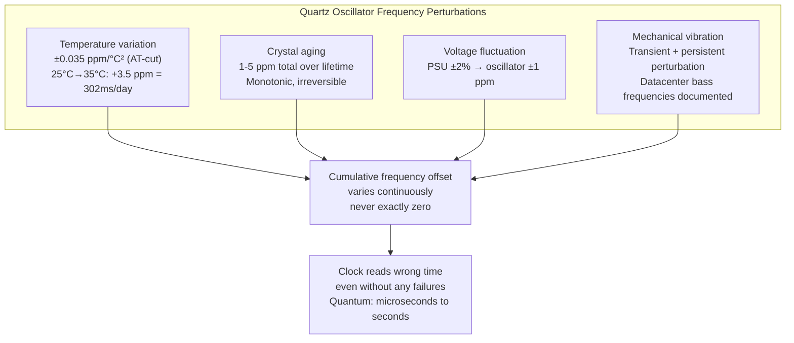
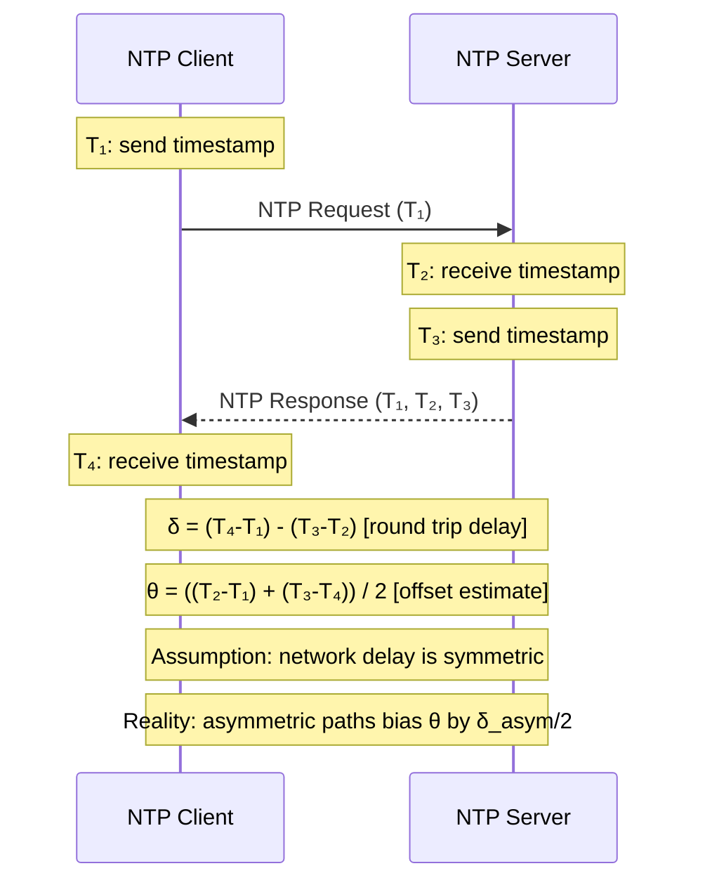

Every server has a clock. Every distributed system problem involving ordering, timeouts, leases, and expiration assumes that clock means something consistent. It does not. The physical clocks in commodity servers are quartz oscillators that drift, are corrected periodically by NTP over an unreliable network, and are occasionally subjected to discontinuous jumps to handle the mismatch between atomic time and Earth's rotation. At any given moment, two servers in the same datacenter may disagree on the current time by milliseconds to seconds, and there is no reliable in-band mechanism to know by how much.
 
This is not a solvable problem in the general case — it is a physical constraint that distributed systems must design around. Understanding the mechanisms of clock unreliability at the hardware and protocol level is the prerequisite for understanding why logical clocks, vector clocks, and hybrid logical clocks exist, and why Google built TrueTime.
 
## Quartz Oscillator Drift: The Physics
 
Server timekeeping begins with a quartz crystal oscillator. A quartz crystal, when subjected to an electric field, vibrates at a frequency determined by its physical dimensions — typically 32.768 kHz for real-time clock (RTC) crystals or 10-100 MHz for system oscillators. The OS counts oscillator ticks and derives wall-clock time from them.
 
The problem is that the oscillation frequency is not perfectly stable. It varies with:
 
**Temperature.** Quartz frequency has a well-characterized temperature dependence, typically expressed as a parabolic curve with a peak near 25-30°C. A standard AT-cut quartz crystal (the most common RTC type) has a temperature coefficient of approximately ±0.035 ppm/°C² around its turnover temperature. A server in a datacenter operating at 35°C rather than 25°C introduces a frequency offset of approximately:
 
```
Δf/f ≈ 0.035 ppm/°C² × (35 - 25)² = 3.5 ppm
```
 
At 3.5 ppm drift, the clock gains or loses 3.5 microseconds per second — about 302 milliseconds per day, or approximately 110 seconds per year. A server that loses network connectivity for 24 hours and relies solely on its local oscillator will drift by ~300ms from true time.
 
**Aging.** Quartz crystals undergo slow frequency drift over their lifetime due to mass transfer on the crystal surface, stress relief in mounting structures, and changes in surface contamination. A typical commodity oscillator drifts 1-5 ppm over its lifetime; precision-grade oscillators drift < 0.1 ppm per year. The aging drift is monotonic and approximately linear, but its rate varies between individual crystals even from the same production batch.
 
**Mechanical stress and vibration.** Physical shock to a server chassis can cause a frequency perturbation that persists after the vibration stops. This is the mechanism behind the documented phenomenon of datacenter vibration — bass frequencies from audio playback near a storage server correlated with disk access latency spikes, because vibration-induced frequency perturbations in the local oscillator affected timing circuits.
 
**Voltage variation.** Power supply fluctuations modulate oscillator frequency through the varactor diodes used in voltage-controlled oscillators. A power supply that is nominally 3.3V but fluctuates ±2% introduces oscillator frequency variation as it does so.
 

*Four independent physical mechanisms cause quartz oscillator frequency deviation: the clock is never exactly correct, only approximately so.*
 
### TCXO and OCXO: Better Oscillators
 
Temperature-Compensated Crystal Oscillators (TCXOs) and Oven-Controlled Crystal Oscillators (OCXOs) reduce temperature sensitivity by orders of magnitude. A TCXO applies a compensating voltage based on a temperature sensor reading, achieving ±0.5-2 ppm stability across a wide temperature range. An OCXO encloses the crystal in a precision oven at a fixed temperature, achieving ±0.001-0.1 ppm stability. Both are used in telecoms equipment, GPS receivers, and specialized measurement hardware — not in commodity server motherboards, where cost constraints dictate standard AT-cut crystals.
 
The practical divide: a GPS receiver's TCXO can achieve clock accuracy of ±100 nanoseconds relative to UTC without GPS lock for hours. A commodity server motherboard at 25°C operating temperature drifts at ±3 ppm — roughly ±260 milliseconds per day. Under varying datacenter temperatures (15-45°C across cold and hot aisles), the drift is substantially worse.
 
## NTP: The Correction Mechanism and Its Error Budget
 
Network Time Protocol (NTP) is the standard mechanism for synchronizing server clocks to a time hierarchy rooted in atomic clocks (Stratum 0). The hierarchy:
 
- **Stratum 0:** Atomic clocks (cesium, rubidium), GPS receivers with PPS output — accurate to nanoseconds
- **Stratum 1:** Servers directly connected to Stratum 0 sources — typically accurate to ±1-50 µs
- **Stratum 2:** Servers synchronized to Stratum 1 — typically accurate to ±1-10 ms
- **Stratum 3+:** Further removed servers, accuracy degrades with each hop
Commodity servers in cloud environments are typically Stratum 3-4, synchronized to cloud provider NTP infrastructure. The achievable synchronization accuracy depends on the quality and stability of the network path between client and server.
 
### NTP Synchronization Algorithm
 
NTP estimates clock offset using a sequence of timestamp exchanges. A client sends a request at time `T₁`, the server receives it at `T₂`, sends a response at `T₃`, and the client receives the response at `T₄`. The round-trip delay and clock offset are estimated as:
 
```
Round-trip delay δ = (T₄ - T₁) - (T₃ - T₂)
Clock offset θ = ((T₂ - T₁) + (T₃ - T₄)) / 2
```
 
The offset estimate assumes symmetric network delay: half the round-trip delay went in each direction. This assumption fails in practice. Asymmetric routing, asymmetric queue depths at network devices, and asymmetric transmission media (different speeds for upstream and downstream traffic) all cause systematic bias in the NTP offset estimate.
 
A typical Stratum 2 NTP server over a local network achieves synchronization accuracy of ±1-5 ms for the offset estimate. Over the public internet, ±10-100 ms is common. A cloud provider's internal NTP service over a low-latency intra-datacenter path achieves ±100-500 µs.
 

*NTP four-timestamp exchange: the offset calculation assumes symmetric network delay. Asymmetric routing introduces systematic bias that NTP cannot detect or correct.*
 
### NTP Error Sources and Their Magnitudes
 
**Network path asymmetry.** On a 10 ms round-trip path where 7 ms goes forward and 3 ms comes back, NTP calculates `θ` as if each direction was 5 ms — a systematic 2 ms bias. This is not random error; it is a constant offset that NTP cannot distinguish from true clock skew. Network path changes (route flaps, ECMP rehashing) can cause the asymmetry to change discontinuously, producing a sudden apparent change in clock offset.
 
**NTP timestamp resolution.** NTP uses 64-bit timestamps with a 32-bit fractional seconds field — theoretical resolution of 2⁻³² seconds ≈ 232 picoseconds. Practical resolution is limited by the system clock's tick resolution (typically 1 ms or 10 ms on older kernels, 1 µs on modern kernels with `CLOCK_REALTIME` and hardware timestamping NICs).
 
**Kernel scheduling jitter.** NTP's userspace daemon (`ntpd`, `chronyd`) reads the system clock via a syscall. The time between the NTP packet arriving at the NIC and the kernel scheduling `ntpd` to process it is scheduling jitter — typically 0.1-1 ms on a loaded system, up to 10 ms under CPU contention. This jitter shows up as noise in the offset measurement, limiting synchronization accuracy.
 
**Clock stepping vs. slewing.** When NTP detects a large offset, it has two correction strategies:
- **Slewing:** Gradually adjusting the clock rate (typically ±500 ppm) to converge on the correct time without a discontinuous jump. At 500 ppm, correcting a 500 ms offset takes 1,000 seconds — about 16 minutes.
- **Stepping:** Immediately setting the clock to the corrected value. This causes a discontinuous clock jump that can make timestamps go backward or skip forward by hundreds of milliseconds.
Both strategies create problems for distributed systems. Slewing means the clock is wrong for a potentially long convergence period. Stepping causes non-monotonic time readings.
 
:::danger
Any distributed system that uses `gettimeofday()` or `System.currentTimeMillis()` for sequencing events, generating unique IDs, or making lease expiry decisions is vulnerable to NTP clock steps. A step backward causes the same timestamp to be issued twice. A step forward creates a gap in the timestamp sequence. Neither is detectable by the application code making the call. Use monotonic clocks (`clock_gettime(CLOCK_MONOTONIC)` in C, `time.Now()` in Go, `System.nanoTime()` in Java) for measuring durations and intervals; never use wall-clock time for relative ordering.
:::
 
### Chrony vs. ntpd: Modern NTP Clients
 
`chrony` is the preferred NTP client for modern Linux distributions, superseding the traditional `ntpd`. Its key advantages for distributed systems:
 
**Faster convergence.** `chrony` uses a larger pool of NTP sources and a more aggressive polling strategy, achieving synchronization within seconds of startup rather than the minutes required by `ntpd`'s conservative approach.
 
**Better handling of intermittent connectivity.** `ntpd` can reject NTP responses during initial clock discipline if the measured offset exceeds its panic threshold (default: 1000 seconds). `chrony` handles large initial offsets more gracefully.
 
**Hardware timestamp support.** `chrony` can use hardware timestamping from NICs that support `SO_TIMESTAMPING`, bypassing kernel scheduling jitter and achieving sub-microsecond synchronization accuracy over a local network.
 
```ini
# /etc/chrony.conf -- production configuration for high-accuracy sync
# Use multiple NTP sources for robustness
server 169.254.169.123 prefer iburst  # AWS EC2 Time Sync Service
server time1.google.com iburst
server time2.google.com iburst
 
# Maximum clock slew rate (ppm)
# Higher value = faster convergence but more continuous rate instability
maxdistance 1.5
 
# Allow stepping the clock only at startup (not during normal operation)
# makestep threshold max-updates
makestep 1.0 3  # Allow up to 1s step, for first 3 clock updates only
 
# Record tracking statistics for drift compensation
driftfile /var/lib/chrony/drift
 
# Hardware timestamping (if NIC supports SO_TIMESTAMPING)
hwtimestamp eth0
 
# Log clock adjustments for observability
log tracking measurements statistics
```
 
## The Leap Second Problem
 
A **leap second** is an occasional 1-second insertion (or deletion) into UTC to keep it aligned with UT1 (astronomical time based on Earth's rotation). Earth's rotation is irregular — it slows due to tidal friction with the Moon and speeds up after major earthquakes that redistribute mass toward Earth's center. The International Earth Rotation and Reference Systems Service (IERS) announces leap seconds approximately 6 months in advance.
 
Between 1972 and 2016, 27 positive leap seconds were inserted. On the day a positive leap second occurs, the UTC clock reads 23:59:60 before advancing to 00:00:00 — a second that does not exist in normal timekeeping.
 
The fundamental problem: computers do not handle a 61-second minute. The POSIX time standard defines time as seconds elapsed since the Unix epoch, and explicitly excludes leap seconds from the count — meaning POSIX time is not an accurate count of elapsed seconds, and there is no standard in-band way to know whether a POSIX timestamp spans a leap second.
 
### Failure Modes During Leap Second Events
 
**Linux kernel 2.6.x leap second bug (2012).** A bug in the Linux kernel's hrtimer subsystem caused `clock_nanosleep()` and `futex` with `CLOCK_REALTIME` timeout to spin at 100% CPU when a leap second was inserted. The cause: the kernel's leap second handling updated `CLOCK_REALTIME` by smearing the correction into `nanoseconds` field, creating a state where the timer expired immediately on every evaluation. This affected Cassandra, Java applications, and any service using futex-based synchronization. Hundreds of production systems across multiple companies experienced CPU saturation lasting from seconds to hours after the leap second.
 
**Leap second and Cassandra (2012 and 2015).** Apache Cassandra uses `System.currentTimeMillis()` for write timestamps. During a leap second event, the JVM received a time correction that caused `System.currentTimeMillis()` to return values 1 second in the past compared to immediately preceding calls. Cassandra's gossip protocol, which uses timestamps to decide which replica's data is newest, treated old data as newer than recent data for a window following the leap second. This produced silent data corruption (newer writes overwritten by older data) that persisted until manual intervention.
 
**Google's Leap Smear.** Google solved the leap second problem in their infrastructure by distributing the 1-second correction over a 24-hour window — adding approximately 11.6 microseconds to each second during the smear window instead of inserting a single discontinuous second. The result: UTC clocks on Google infrastructure are never exactly correct during a smear, but they are monotonically increasing and the error never exceeds 1 second.
 
Amazon Web Services adopted the same approach in 2015. This creates a new problem: during a smear period, time as reported by AWS servers differs from time as reported by non-smeared systems by up to 500 ms (at the midpoint of the 24-hour smear). Timestamps from smeared and non-smeared systems cannot be directly compared.
 
```mermaid
timeline
    title Leap Second Timeline -- June 30, 2015 23:59:00 UTC
    section UTC Standard
        23:59:58 : Normal second
        23:59:59 : Normal second
        23:59:60 : LEAP SECOND (extra second inserted)
        00:00:00 : Next day begins
    section Linux (non-smeared)
        23:59:58 : Normal -- unixtime = 1435708798
        23:59:59 : Normal -- unixtime = 1435708799
        23:59:60 : Clock reads 23:59:59 AGAIN -- unixtime = 1435708799 (repeated)
        00:00:00 : unixtime = 1435708800 (jumps by 1 after repeat)
    section Google/AWS Smear
        23:00:00 : Smear begins -- +11.6us/s added
        23:59:59 : Clocks run 500ms slow at this point
        00:00:00 : Smear continues until 00:59:00
        00:59:00 : Smear complete -- clocks correct again
```
*Leap second handling strategies: standard Linux repeats a timestamp; Google/AWS smear creates a 24-hour window of systematic slowness. Neither produces accurate UTC throughout.*
 
### Leap Second Abolition
 
In November 2022, the General Conference on Weights and Measures (CGPM) voted to abolish leap seconds by 2035. UTC will be allowed to drift from UT1 by more than the current 0.9-second limit, with a larger correction applied at a future date (proposed: once per century or when the divergence reaches a threshold). The motivation was exactly the distributed systems problems described above.
 
Until 2035, leap seconds remain a hazard. A production checklist for each announced leap second:
 
```shell
# Verify chrony/ntpd is configured for leap smear (on AWS/GCP infrastructure)
chronyc tracking | grep "Leap status"
# Expected: "Normal" during normal operation, "Insert second" near a leap event on non-smeared infra
 
# Check if kernel has the leap second flag set
adjtimex | grep status
# Bit 4 (value 16) set = kernel believes a leap second is pending
 
# Verify Java uses CLOCK_MONOTONIC for timing (not affected by leap second steps)
# In JVM: System.nanoTime() -> CLOCK_MONOTONIC (safe)
#         System.currentTimeMillis() -> CLOCK_REALTIME (unsafe during leap second)
 
# For Kafka, Cassandra, ZooKeeper: verify they use monotonic clocks
# ZooKeeper 3.4.6+ uses System.nanoTime() for timeouts
# Kafka 0.10+ uses CLOCK_MONOTONIC for internal scheduling
```
 
## Clock Uncertainty and the Implications for Distributed Systems
 
The combined effect of oscillator drift, NTP synchronization error, and leap second events is that wall-clock time on any commodity server is uncertain to a degree that varies with time since last NTP sync, network path quality, and leap second status.
 
A realistic uncertainty budget for a typical cloud server:
 
| Source | Typical magnitude | Worst case |
|---|---|---|
| Quartz oscillator drift (since last sync) | ±0.1-1 ms | ±10-100 ms (if NTP unreachable) |
| NTP synchronization error | ±0.5-5 ms | ±50 ms (public internet) |
| Network path asymmetry (systematic) | ±0.5-2 ms | ±10 ms (satellite link) |
| Kernel scheduling jitter | ±0.1-1 ms | ±10 ms (heavy load) |
| Leap second step (brief event) | ±0 ms | ±1,000 ms |
| **Total typical uncertainty** | **±1-10 ms** | **±100 ms** |
 
:::tip
AWS, GCP, and Azure all offer high-accuracy time synchronization services that bypass the public NTP path:
- **AWS:** EC2 Time Sync Service at `169.254.169.123` (link-local), achieving ±1 ms synchronization for most instances, ±100 µs for Nitro instances with hardware timestamps.
- **GCP:** Metadata server at `metadata.google.internal`, achieves ±100 µs on GCP.
- **Azure:** Windows Time Service, ±1 ms accuracy.
Use these services instead of public NTP pools for distributed systems that make any assumptions about clock accuracy. For systems requiring sub-millisecond clock accuracy (distributed databases, financial systems), evaluate instances with hardware timestamp support.
:::
 
### What Applications Can and Cannot Rely On
 
**What you can rely on:**
- **Monotonic clock ordering within a single process.** `CLOCK_MONOTONIC` never goes backward within a process lifetime. It is appropriate for measuring durations, timeouts, and relative intervals.
- **Approximate current time.** For human-readable timestamps in logs, metrics, and audit trails, wall-clock time is perfectly adequate even at millisecond-level uncertainty.
- **Coarse-grained TTL expiry.** A cache entry with a 60-second TTL is correctly expired within ±10ms of the intended expiry time — tolerable for most caching use cases.
**What you cannot rely on:**
- **Cross-machine event ordering.** Two events timestamped with wall-clock time from different machines cannot be reliably ordered if they occurred within ~10 ms of each other.
- **Distributed lease validity.** A lease that expires at wall-clock time `T` cannot be safely assumed to have expired from the perspective of other machines until `T + 2ε` where `ε` is the maximum clock uncertainty. Google Spanner uses this explicitly — a transaction is not safe to commit until `T_commit + ε_max` has elapsed on the committing server.
- **Unique ID generation from timestamp.** Snowflake-style IDs that include a millisecond timestamp component can produce duplicate IDs if a clock step backward occurs between two ID generation calls.
```go
// Correct: use monotonic clock for durations and timeouts
func measureDuration() {
    start := time.Now() // Go's time.Now() returns a value with monotonic reading
    doWork()
    elapsed := time.Since(start) // Uses monotonic component -- correct even after NTP step
    log.Printf("work took %v", elapsed)
}
 
// Correct: use wall clock for human-readable timestamps only
func logEvent(event string) {
    // time.Now().UTC().Format() is fine for log timestamps
    // Accept that two events on different machines within 10ms have uncertain ordering
    log.Printf("[%s] %s", time.Now().UTC().Format(time.RFC3339Nano), event)
}
 
// WRONG: using wall clock for cross-machine ordering or unique IDs
func generateIDUnsafe() int64 {
    // If clock steps backward, two calls can return the same value
    // or the sequence can go backward
    return time.Now().UnixNano() // NOT SAFE for globally unique, monotonic IDs
}
 
// CORRECT: use a monotonic sequence with wall-clock epoch
// (Snowflake-style with clock-step detection)
type SnowflakeGenerator struct {
    mu          sync.Mutex
    lastTime    int64
    sequence    int64
    workerID    int64
}
 
func (g *SnowflakeGenerator) Next() int64 {
    g.mu.Lock()
    defer g.mu.Unlock()
 
    now := time.Now().UnixMilli()
 
    if now < g.lastTime {
        // Clock stepped backward -- wait for clock to catch up
        // rather than issuing duplicate or out-of-order IDs
        time.Sleep(time.Duration(g.lastTime-now) * time.Millisecond)
        now = g.lastTime
    }
 
    if now == g.lastTime {
        g.sequence = (g.sequence + 1) & 0xFFF // 12-bit sequence
        if g.sequence == 0 {
            // Sequence exhausted this millisecond -- wait for next ms
            for now <= g.lastTime {
                now = time.Now().UnixMilli()
            }
        }
    } else {
        g.sequence = 0
    }
 
    g.lastTime = now
    return (now << 22) | (g.workerID << 12) | g.sequence
}
```
 
See [Monotonic Clocks vs. Time-of-Day: Which One to Use](/distributed-systems/en/foundations/time-and-ordering/monotonic-vs-time-of-day/) for the practical programming model that follows from these clock limitations.
See [The Happened-Before Relation: Foundation of Causality](/distributed-systems/en/foundations/time-and-ordering/happened-before/) for how logical clocks solve the ordering problem that physical clocks cannot.
See [Google TrueTime and Spanner: Working with Uncertainty](/distributed-systems/en/foundations/time-and-ordering/truetime-spanner/) for the production approach to bounding and exploiting clock uncertainty rather than ignoring it.