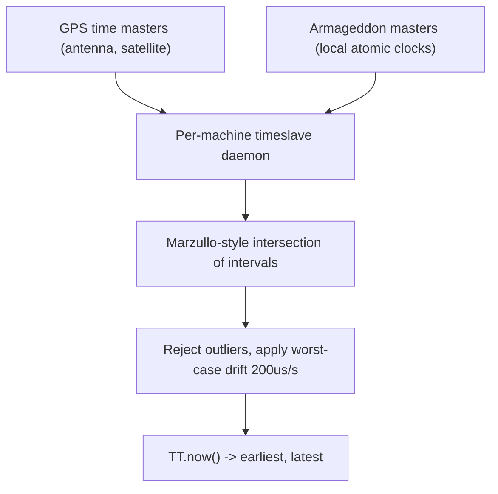
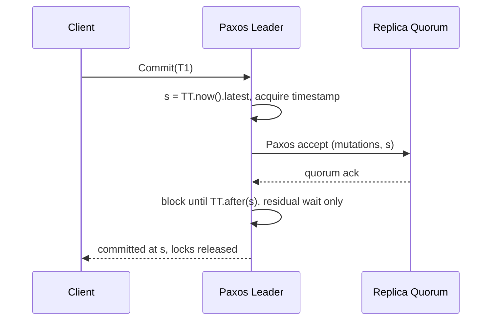

Every other clock API lies by omission: `clock_gettime` returns an instant with no statement about how wrong it is. TrueTime returns an interval, `[earliest, latest]`, with the guarantee that true time lies inside it. The engineering consequence is inverted from every NTP-based design: instead of hoping the error is small enough to ignore, Spanner makes the error a first-class input, and pays for it in explicit, measurable write latency rather than in rare, unexplained ordering anomalies.
 
## The API and What It Guarantees
 
TrueTime exposes three operations:
 
- `TT.now()` returns `[earliest, latest]` with absolute time `t_abs` guaranteed to satisfy `earliest <= t_abs <= latest`.
- `TT.after(t)` is true when `t` is provably in the past, that is `t < earliest`.
- `TT.before(t)` is true when `t` is provably in the future, that is `t > latest`.
The half-width `eps = (latest - earliest) / 2` is the instantaneous uncertainty. In the published Spanner deployment it follows a sawtooth: roughly 1ms immediately after a time-master poll, growing at the applied worst-case drift rate of 200 microseconds per second, and reset every 30 seconds, giving a peak near 7ms and a mean around 4ms. Those numbers are not incidental; they are the direct multiplicand of every commit's added latency.
 
The bound is only as good as the hardware behind it. Each datacenter runs time masters of two independent kinds, precisely because their failure modes do not correlate:
 

*Two uncorrelated reference classes feed a per-machine daemon that intersects candidate intervals, discards liars, and widens the result by the assumed drift since the last successful poll.*
 
GPS fails through antenna damage, radio interference, spoofing, and receiver bugs. Atomic clocks fail through slow frequency drift after their oscillator degrades, which is uncorrelated with anything a satellite does. The daemon polls a mix of both, applies a Marzullo-style interval intersection to discard machines whose intervals do not overlap the majority, and then widens its own interval by the assumed drift accumulated since the last poll. Uncertainty grows monotonically between polls; that growth is the sawtooth, and it is the mechanism by which a machine cut off from all time masters becomes progressively less useful rather than silently wrong.
 
## Commit Wait: Buying External Consistency With Latency
 
External consistency is the guarantee that if transaction `T1` commits before `T2` begins in real time, then `T1`'s timestamp is smaller than `T2`'s, even when the two touch disjoint data and never communicate. No logical clock can provide it, because with no message between them there is no `max` to propagate. HLC cannot provide it either; see [Hybrid Logical Clocks](/distributed-systems/en/foundations/time-and-ordering/hybrid-logical-clocks/).
 
Spanner's protocol is two rules, and the second is the whole trick:
 
1. **Start rule.** The coordinator assigns commit timestamp `s = TT.now().latest`, a value guaranteed to be at or after true time at the moment of assignment.
2. **Commit wait.** The coordinator does not release locks or acknowledge the client until `TT.after(s)` is true, that is until `s` is provably in the past.
Together these make the timestamp order match the real-time order of the visible commit events. `T1` cannot acknowledge before `s1` is in the past, and `T2` cannot pick a timestamp below true time at its start, so `s1 < s2` whenever `T1` finished before `T2` started.
 

*Commit wait runs concurrently with Paxos replication. If replication takes longer than `2 * eps`, the residual wait is zero and the guarantee is free.*
 
That overlap is the practical answer to "does this add 8ms to every write". The expected wait is roughly `2 * eps`, around 8 to 10ms at the published sawtooth, but cross-datacenter Paxos replication already costs comparable or greater time. The wait is only visible when replication is fast, which in a single-region deployment it often is. What the wait cannot overlap is lock hold time: locks stay held through the wait, so contention on hot rows is amplified by exactly the uncertainty window. A workload with a single hot key sees throughput on that key capped near `1 / (2 * eps)` transactions per second.
 
Read-only transactions pay nothing. They are assigned a timestamp and served from any replica whose safe time has advanced past it, taking no locks and blocking no writers. This asymmetry is the design's real payoff: the entire cost of external consistency is pushed onto writes, and reads become lock-free snapshot reads at a chosen point in time.
 
## Implementation Shape
 
```go
package spanner
 
import (
	"context"
	"errors"
	"fmt"
	"time"
)
 
// Interval is the TrueTime return value. True time is guaranteed to fall
// within [Earliest, Latest]; no narrower claim may be made anywhere.
type Interval struct {
	Earliest time.Time
	Latest   time.Time
}
 
func (i Interval) Epsilon() time.Duration { return i.Latest.Sub(i.Earliest) / 2 }
 
// After reports TT.after(t): t is provably in the past.
func (i Interval) After(t time.Time) bool { return i.Earliest.After(t) }
 
type TrueTime interface {
	Now(ctx context.Context) (Interval, error)
}
 
var ErrClockUncertainty = errors.New("spanner: uncertainty exceeds budget")
 
// CommitAt implements the start rule plus commit wait. replicate must return
// only after the mutation is durable on a quorum at timestamp s.
func CommitAt(
	ctx context.Context,
	tt TrueTime,
	budget time.Duration,
	replicate func(context.Context, time.Time) error,
) (time.Time, error) {
	iv, err := tt.Now(ctx)
	if err != nil {
		// No bound means no timestamp may be assigned. Failing the commit
		// is correct; guessing is how external consistency is lost.
		return time.Time{}, fmt.Errorf("spanner: truetime unavailable: %w", err)
	}
	if eps := iv.Epsilon(); eps > budget {
		// A widening interval means the time masters are unreachable or a
		// local oscillator is suspect. Resign leadership rather than serve
		// commits whose wait would exceed the latency SLO.
		return time.Time{}, fmt.Errorf("%w: eps=%s budget=%s", ErrClockUncertainty, eps, budget)
	}
 
	s := iv.Latest
 
	// Replication overlaps the wait. Both must complete before the ack.
	if err := replicate(ctx, s); err != nil {
		return time.Time{}, fmt.Errorf("spanner: replicate at %s: %w", s, err)
	}
 
	for {
		cur, err := tt.Now(ctx)
		if err != nil {
			// Locks are still held here. The caller must abort and release.
			return time.Time{}, fmt.Errorf("spanner: truetime during commit wait: %w", err)
		}
		if cur.After(s) {
			return s, nil
		}
		remaining := s.Sub(cur.Earliest)
		select {
		case <-ctx.Done():
			return time.Time{}, ctx.Err()
		case <-time.After(remaining):
		}
	}
}
```
 
The error paths carry the design. A commit that cannot obtain a bound must fail rather than fall back to a bare clock read, and a leader whose `eps` has grown past budget must resign rather than serve slow commits, because a growing `eps` is evidence of a time-source problem, not merely a latency problem.
 
## Trade-offs Against Software-Only Designs
 
| Dimension | TrueTime plus commit wait | HLC plus uncertainty restarts | NTP wall clock plus LWW |
|---|---|---|---|
| External consistency | Yes | No | No |
| Write latency cost | `2 * eps`, overlapped with replication | None | None |
| Read cost | Lock-free snapshot reads | Restarts when a value falls inside the window | None |
| Hot-key throughput | Capped by lock hold plus wait | Capped by restart rate | Unbounded, incorrect |
| Hardware requirement | GPS and atomic time masters | Standard NTP | Standard NTP |
| Failure under clock skew | Latency rises, correctness holds | Restart rate rises, correctness holds | Silent lost updates |
| When to prefer | Cross-region serializable workloads where correctness is contractual | Commodity infrastructure, restart-tolerant workloads | Never for ordering |
 
The row that matters most is the last failure row. All three designs degrade under clock skew; only the first two degrade in a direction an operator can see on a dashboard. This is the general principle worth taking away from Spanner independent of whether you can deploy it: convert clock error into latency or into retries, never into silent divergence.
 
Commodity equivalents now exist. Amazon Time Sync with ClockBound exposes an error interval over standard EC2 instances, and the same commit-wait construction is implementable on top of it. The hardware moat that made TrueTime a Google-only capability in 2012 has largely eroded; the protocol design has not.
 
## Failure Modes and Operational Pitfalls
 
**Time master partition inflates `eps` linearly.** A machine that loses all masters keeps serving, with its interval widening at 200 microseconds per second. After five minutes `eps` is 60ms and commit wait dominates every write; after an hour the node is unusable. Symptom: p99 write latency climbing smoothly with no change in load, correlated with a single zone. Detection: export `eps` itself as a gauge and alert on its slope, not its value. Recovery: evict the node from leadership; do not attempt to serve through it.
 
:::danger
Skipping commit wait, or acknowledging the client before `TT.after(s)`, produces a system that passes every functional test and violates external consistency only under concurrent cross-partition workloads. There is no error, no log line, and no metric. The anomaly surfaces as a client observing `T2` while a causally earlier `T1` is not yet visible, typically reported months later as an unreproducible support ticket.
:::
 
**Assuming TrueTime removes the need for consensus.** Timestamps order transactions; they do not replicate them or elect leaders. Spanner still runs Paxos per shard, and every durability and availability property comes from that, not from the clock. A design that replaces consensus with synchronized clocks has replaced a proven agreement protocol with an assumption about hardware.
 
**Correlated time-source failure.** Deploying only GPS masters, or sourcing all atomic references from one vendor batch, defeats the entire redundancy argument. GPS spoofing, an antenna cable failure across a shared conduit, and a firmware bug in one receiver model are all single events that can move many masters together. The Marzullo intersection only discards outliers when the honest majority is genuinely independent.
 
**Leap second policy mismatch.** A fleet in which some machines smear and others step disagrees by up to a second for the smear window. Since the guarantee is an interval containing true time, a stepped machine's interval is briefly wrong rather than merely wide, which breaks the invariant rather than degrading it. Fleet-wide policy uniformity is a correctness requirement here, not hygiene.
 
**Uniform hot keys against the wait.** Because locks are held across the wait, a queue-like table with a single incrementing counter row serializes at roughly `1 / (2 * eps)`. The fix is application-level sharding of the contended row, not clock tuning; no realistic `eps` makes a single-row hot spot fast.
 
**Reading `latest` and treating it as the time.** Application code that calls the API and uses only one endpoint of the interval has reintroduced the lie the API exists to remove. Any comparison against a TrueTime value must be `After` or `Before`, both of which are conservative; a direct comparison against `earliest` or `latest` is a claim the API never made.
 
## When to Use and When Not To
 
Use interval-based time when the ordering guarantee is contractual: financial ledgers spanning regions, systems where an auditor can observe two operations externally and demand that their recorded order match, and multi-region databases offering serializable reads without a global sequencer. Use it when reads dominate and you want lock-free consistent snapshots at a chosen timestamp, since that is where the design's cost structure pays off. Use the underlying pattern, exposing error bounds rather than instants, in any system where clock error currently manifests as silent anomalies.
 
Do not adopt it when a single-region deployment with a single Paxos leader per shard already gives you a total order at zero clock cost; the log position is stronger and cheaper. Do not adopt it for workloads dominated by contention on a small key set, where the lock hold extension is the binding constraint. Do not adopt it without the operational apparatus, meaning redundant independent time sources, `eps` as a monitored signal, and an automatic leadership resignation policy, because the algorithm's safety argument is a hardware argument. For Spanner's replication and transaction machinery beyond the clock, see [Spanner: TrueTime, Paxos Groups, and External Consistency](/distributed-systems/en/case-studies/distributed-sql/spanner-architecture/).