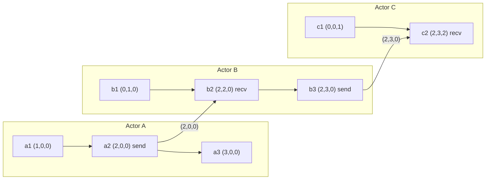

A vector clock replaces the single counter of a Lamport timestamp with one counter per actor, which upgrades the guarantee from an implication to an equivalence: `VC(a) < VC(b)` holds **if and only if** `a -> b`. Incomparable vectors mean the events are concurrent, and that is information no scalar can carry. The cost is `O(N)` metadata per event or per version, and the entire engineering difficulty of vector clocks in production is not the algorithm but the question of what counts as an actor, because that choice sets `N` and decides whether the metadata stays bounded.
 
## The Algorithm and the Comparison Rules
 
Each actor `p` holds a vector `V_p` indexed by actor ID, with absent entries treated as zero. Two rules maintain it:
 
- **Local event or send.** `V_p[p] = V_p[p] + 1`, then attach a copy of `V_p` to the message.
- **Receive of a message carrying `W`.** `V_p[k] = max(V_p[k], W[k])` for every `k`, then `V_p[p] = V_p[p] + 1`.
Only an actor may increment its own entry; every other entry moves purely by pointwise `max`. That asymmetry is what makes each entry a truthful statement of the form "I have observed at least this many events from actor `k`", which is what the comparison then exploits.
 
Given two vectors `U` and `V`, exactly one of four cases holds:
 
| Relation | Test | Meaning |
|---|---|---|
| `U == V` | All entries equal | Same event or identical causal history |
| `U < V` | Every entry `U[k] <= V[k]`, at least one strict | The event stamped `U` happened before the one stamped `V` |
| `U > V` | Symmetric | Reverse causal order |
| `U \|\| V` | Some `k` with `U[k] > V[k]` and some `j` with `U[j] < V[j]` | Concurrent: neither observed the other |
 
The fourth case is the only reason to pay for vectors. It is detected by a single pass that sets two boolean flags, so comparison is `O(N)` with an early exit once both flags are set.
 

*Vectors ordered as (A,B,C). `a2 -> c2` because `(2,0,0)` is dominated componentwise by `(2,3,2)`. `a3 (3,0,0)` and `b3 (2,3,0)` are concurrent: A leads in its own entry, B leads in its own.*
 
Note that `a3` and `b3` are concurrent even though a scalar Lamport clock would have ordered them `3 < 5`. The vector preserves the distinction because B never observed A's third event, and the entry for A in B's vector remains at `2` to say so.
 
## The Identity Problem: Who Is an Actor?
 
`N` is not the number of nodes in the cluster. It is the number of entities allowed to increment their own entry, and picking that set wrong is the single most common way vector clocks fail in production.
 
- **Vector clock, per process.** Actors are processes; the vector tracks the causal history of message delivery. Used for causal broadcast and consistent snapshots. `N` is bounded by the process count but the vector must be attached to every message.
- **Version vector, per key.** Actors are replicas of that key, and the vector annotates versions in storage rather than messages. `N` is the replication factor, typically three to five, so the metadata is small and constant. This is what Dynamo-style stores actually want.
- **Dotted version vector.** A version vector plus a **dot**, the single `(actor, counter)` pair identifying the specific write event, kept separate from the causal context the writer had read. Without the dot, two sequential writes by the same client through different coordinators are indistinguishable from concurrent writes, and every write forks a new sibling.
The failure people hit is treating clients as actors. Ten thousand clients writing one key produce a ten-thousand-entry vector, and because clients come and go, the vector grows without bound while the value it annotates does not. The fix is structural, not a tuning parameter: move actor identity server-side and use dots to preserve per-client write sequencing.
 
## Implementation
 
```go
package vclock
 
import (
	"errors"
	"fmt"
)
 
// Clock maps an actor ID to its event counter. A missing key means zero, so
// the sparse encoding costs nothing for actors that never wrote.
type Clock map[string]uint64
 
// Ordering is the result of comparing two clocks.
type Ordering int
 
const (
	Equal Ordering = iota
	Before
	After
	Concurrent
)
 
// Compare decides the happened-before relation exactly. One pass over the
// union of keys, with an early exit once both directions are witnessed.
func Compare(u, v Clock) Ordering {
	var uAhead, vAhead bool
	for k, a := range u {
		if a > v[k] {
			uAhead = true
			break
		}
	}
	for k, b := range v {
		if b > u[k] {
			vAhead = true
			break
		}
	}
	switch {
	case uAhead && vAhead:
		return Concurrent
	case uAhead:
		return After
	case vAhead:
		return Before
	default:
		return Equal
	}
}
 
// Merge returns the pointwise maximum, the least upper bound of both causal
// histories. Neither input is mutated.
func Merge(u, v Clock) Clock {
	out := make(Clock, len(u)+len(v))
	for k, a := range u {
		out[k] = a
	}
	for k, b := range v {
		if b > out[k] {
			out[k] = b
		}
	}
	return out
}
 
// Actor is an identity plus an incarnation. Reusing a bare ID after a state
// loss moves counters backwards and silently corrupts every comparison.
type Actor struct {
	ID          string
	Incarnation uint64
}
 
func (a Actor) Key() string { return fmt.Sprintf("%s.%d", a.ID, a.Incarnation) }
 
var ErrCounterRegression = errors.New("vclock: counter regression for actor")
 
// Advance applies a local write. The regression check catches restored
// backups and reused identities before they can produce false ordering.
func Advance(c Clock, self Actor, lastKnown uint64) (Clock, error) {
	cur := c[self.Key()]
	if cur < lastKnown {
		return nil, fmt.Errorf("%w: %s at %d, durable state at %d",
			ErrCounterRegression, self.Key(), cur, lastKnown)
	}
	out := make(Clock, len(c)+1)
	for k, n := range c {
		out[k] = n
	}
	out[self.Key()] = cur + 1
	return out, nil
}
 
// Prune drops entries that every replica has already observed, as reported
// by watermark. Dropping anything else can turn a concurrent pair into an
// ordered one, which is silent data loss rather than a spurious conflict.
func Prune(c Clock, watermark Clock) Clock {
	out := make(Clock, len(c))
	for k, n := range c {
		if w, ok := watermark[k]; ok && n <= w {
			continue
		}
		out[k] = n
	}
	return out
}
```
 
`Compare` is the hot path in any read that must reconcile siblings, and its shape matters. Iterating the union of key sets rather than a dense array is what keeps a version vector cheap when most actors have never touched a given key. Reconciling a sibling set of size `k` is `O(k^2 * N)` in the worst case, which is fine at `k = 3` and pathological at `k = 500`.
 
## Failure Modes and Operational Pitfalls
 
**Actor identity reuse.** A replica that loses its state and rejoins under the same ID starts its entry at zero. Peers holding a higher value for that entry will now dominate its new writes, so those writes are treated as stale and dropped during merge. The symptom is a node accepting writes normally, with clients receiving success, while the data never survives a read repair. The `Incarnation` field above is the fix: identity must change whenever durable state does not survive. Restoring a replica from a snapshot has exactly the same hazard.
 
:::danger
Pruning entries by age or by size cap can convert a concurrent pair into an apparently ordered one, and the merge then discards a real update with no error. Riak's classic vector-clock pruning had this property, which is one reason dotted version vectors with bounded, replica-scoped actors replaced it. Prune only entries dominated by a cluster-wide watermark, or do not prune at all.
:::
 
**Sibling explosion.** In a store that returns siblings on conflict, a client that writes without echoing back the causal context it read is telling the system "I have observed nothing", so every write is concurrent with every previous one. Sibling counts grow linearly with request rate for that key, read latency grows with sibling count, and the object eventually exceeds the maximum value size. Detection: a metric for siblings-per-read at p99 and an alert on any key exceeding a small constant. Recovery: force a reconciling write that merges all siblings, then fix the client to round-trip the context.
 
**Metadata dominating payload.** A vector with a thousand entries is tens of kilobytes of actor IDs and counters annotating a value that may be a hundred bytes. The symptom is storage amplification, network egress growth, and deserialization CPU rising faster than request rate. Intern actor IDs into a per-cluster dictionary and encode counters as varints before concluding the design is unworkable, but if `N` is unbounded by construction, only re-scoping actor identity helps.
 
**Treating concurrency detection as conflict resolution.** A vector clock reports *that* two versions are concurrent. It says nothing about what changed or how to combine the values, and there is no correct generic answer. Either surface siblings to the application, or use a data type whose merge is defined to be commutative, associative, and idempotent; see [CRDTs](/distributed-systems/en/data-management/consistency-models/crdts/).
 
**Assuming a total order exists.** Sorting versions by vector clock is not defined, because the order is partial. Code that feeds vectors into a comparison-based sort will produce different results depending on input order and can violate the sort's own contract in languages that check for it. Sort by a tie-broken Lamport value for display, and use the vector only for the pairwise decision.
 
**Clock comparison in the wrong layer.** Comparing vectors at the API gateway or in a client SDK, where the code lacks the full sibling set, gives an answer that is correct pairwise but wrong globally: three mutually concurrent versions have no maximum, so any "pick the newer one" loop over pairs discards data depending on iteration order.
 
## When to Use and When Not To
 
Use vector clocks when concurrent writes must be detected rather than silently resolved: leaderless or multi-leader replication, offline-first clients that reconcile on reconnect, collaborative state, and shopping-cart-like objects where losing an update is a correctness bug. Use them when you need causal delivery or causally consistent snapshots, where the comparison drives buffering rather than storage. Use them when the actor set is bounded and server-side, which in practice means version vectors scoped to replicas of a key.
 
Do not use them when a single leader per partition already totally orders writes; the log offset is strictly stronger and costs one integer. Do not use them when the application's conflict policy is genuinely last-write-wins and an occasional lost update is acceptable, since you would pay `O(N)` metadata to compute a distinction you then throw away. Do not use them to reject stale actors, where a scalar epoch is sufficient and cheaper; see [Lamport Timestamps](/distributed-systems/en/foundations/time-and-ordering/lamport-timestamps/). And do not use them where timestamps must also be comparable to physical time, for retention, TTLs, or debugging, which is the gap [Hybrid Logical Clocks](/distributed-systems/en/foundations/time-and-ordering/hybrid-logical-clocks/) exist to close.
 
For the relation the vectors decide, see [The Happened-Before Relation](/distributed-systems/en/foundations/time-and-ordering/happened-before/); for the production consequences of the Dynamo design and its conflict handling, see [Vector Clocks in the Dynamo Paper](/distributed-systems/en/case-studies/dynamodb-cassandra/vector-clocks-conflict-resolution/).