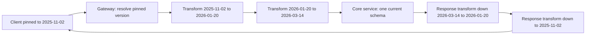
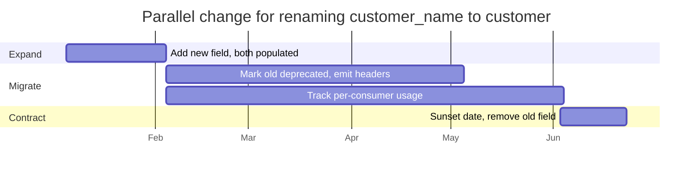

Versiyonlama bir maliyet dağıtım kararıdır: değişimin bedelini sağlayıcının mı yoksa tüketicinin mi ödeyeceğini belirler. Yeni bir versiyon çıkarırsanız bedeli sağlayıcı öder — yaşayan her versiyon ayrı bir kod yolu, ayrı bir test matrisi, ayrı bir nöbet semantiğidir ve tek bir tüketici bile göç etmeyi reddettiği sürece yaşamaya devam eder. Versiyon çıkarmadan kırıcı bir değişiklik yaparsanız bedeli tüketici öder; planlamadığı kesintilerle. İkisi de bedava değildir ve mühendislik hedefi "temiz versiyonlama" değil, hiçbir çağıranı kırmadan aynı anda yaşayan versiyon sayısını en aza indirmektir.
 
Bunun pratik sonucu şudur: değişikliklerin çoğu hiç versiyon üretmemelidir. Yeni versiyon, toplamalı (additive) biçimde yapılamayan değişiklikler için bir acil çıkış kapısıdır; geri kalan her şey yerinde evrilir.
 
## Değişikliğin Sınıflandırılması
 
Kırıcı ile kırıcı olmayan arasındaki sınırı, sizin şema sezginiz değil tüketici davranışı tanımlar.
 
| Değişiklik | Kırıcı mı? | Notlar |
|------------|------------|--------|
| Opsiyonel yanıt alanı eklemek | Tüketiciler bilinmeyen alanları tolere ediyorsa hayır | Katı şemalı istemcileri ve tam eşleşme doğrulaması yapan her şeyi kırar |
| Opsiyonel istek alanı eklemek | Hayır | Alan yokken sunucu önceki varsayılan davranışı korumalıdır |
| *Zorunlu* istek alanı eklemek | Evet | Eski çağıranlar anında doğrulamadan düşer |
| Alan kaldırmak veya adını değiştirmek | Evet | Kozmetik görünen yeniden adlandırmalar dahil |
| Tipi genişletmek (`int32` → `int64`) | Tüketiciler için genellikle evet | 64 bitlik bir ID, 2^53 üstünde bir JavaScript istemcisinde sessizce kırpılır |
| Tipi daraltmak veya doğrulamayı sıkılaştırmak | Evet | Önceden kabul edilen payload'lar artık 400 alır |
| Enum değeri eklemek | Pratikte evet | Kapsayıcı switch'i veya katı deserializer'ı olan istemciler düşer |
| Varsayılan değeri değiştirmek | Evet | Şema farkı olmayan sessiz davranış değişikliği |
| Mevcut bir durum için hata kodunu değiştirmek | Evet | Retry ve circuit breaker mantığı kodlara göre dallanır |
| Sayfalama varsayılanlarını veya üst sınırını değiştirmek | Evet | Sayfa boyutunu varsayan çağıranlar sessizce veri kaçırır |
| Gecikme veya tutarlılık karakteristiğini değiştirmek | Davranışsal olarak evet | Nihai tutarlı hale gelen bir okuma, kendi yazısını okuma varsayımını kırar |
 
Son üç satır tehlikeli olanlardır: şemadan tek satır değiştirmeden tüketicileri kırarlar, dolayısıyla hiçbir şema karşılaştırma aracı ve yalnızca yapıya bakan hiçbir sözleşme testi bunları yakalamaz. Davranışsal sözleşmeler [Tüketici Güdümlü Sözleşme Testi](/distributed-systems/tr/communication/api-gateway/contract-testing/) içinde açıkça iddia edilmelidir; edilmiyorsa onlar sözleşme değildir.
 
Toplamalı evrimi mümkün kılan şey **tolerant reader** ilkesidir: tüketiciler tanımadıkları alanları yok saymalı, alan sırasına bağımlı olmamalı ve bilinmeyen enum değerlerini çökmeden ya da varsayılana düşmeden açık bir bilinmeyen dalıyla işlemelidir. Bu varsayılamaz — yayımladığınız SDK'larda zorlanmalı ve sözleşme testlerinde doğrulanmalıdır, çünkü tek bir katı tüketici her toplamalı değişikliği kırıcı hale getirir.
 
:::caution
OpenAPI veya JSON Schema'dan üretilen istemciler sıklıkla varsayılan olarak katı doğrulama yapar ve bilinmeyen özellikleri reddeder. Yayımladığınız SDK katıysa, pratikte toplamalı bir değişiklik yolunuz yok demektir: her alan eklemesi kırıcı bir değişiklik, her sürüm bir versiyondur. Herhangi bir şey yayımlamadan önce üreticileri toleranslı deserializasyon için yapılandırın.
:::
 
## Versiyonlama Mekanizmaları
 
| Mekanizma | Örnek | Caching | Yönlendirme | Ne zaman tercih edilir |
|-----------|-------|---------|-------------|------------------------|
| URI path | `/v2/accounts/42` | CDN dostu, ayrı anahtarlar | Gateway'de basit | Nadir major versiyonlu public API'ler |
| Özel header | `X-API-Version: 2` | `Vary` gerektirir, hataya açık | Kolay, ama log'larda ve tarayıcıda görünmez | Kontrollü istemci kümesi olan iç API'ler |
| Media type | `Accept: application/vnd.acme.account.v2+json` | `Vary: Accept` gerektirir | Origin'de content negotiation | HTTP saflığının önemli olduğu kaynak bazlı evrim |
| Query parametresi | `?api-version=2` | Cache anahtar uzayını parçalar | Basit | Nadiren; keşif için pratik, kazara atlanması kolay |
| Tarih sabitleme | `Acme-Version: 2026-03-14` | `Vary` gerektirir | Gateway dönüşüm zinciri | Çok sayıda uzun ömürlü tüketicisi olan, hızlı değişen API'ler |
| Versiyonsuz + yalnızca toplamalı | alan bazlı `@deprecated` | Yerleşik | Gerekmez | gRPC ve GraphQL ile iç servisler |
 
**URI path** versiyonlaması operasyonel netlikte kazanır: versiyon erişim log'unda, CDN cache anahtarında, gateway yönlendirme tablosunda ve bir destek mühendisinin sabah 3'te yazdığı `curl`'dedir. Zayıflığı granülaritedir — tek bir kaynak değişse bile `/v2` tüm yüzeyin değiştiğini ima eder, dolayısıyla tüketiciler her şeyi aynı anda göç ettirmek zorunda kalır. Diğer zayıflığı teoriktir: `/v1/accounts/42` ile `/v2/accounts/42` aynı kaynak için farklı URI'lerdir ve bu, REST'in varsaydığı kimlik özelliğini ihlal eder (bkz. [REST: Kısıtlar, Kaynaklar ve HTTP Sözleşmeleri](/distributed-systems/tr/communication/synchronous-protocols/rest/)). Pratikte bu ihlalin maliyeti neredeyse sıfırdır ve operasyonel netlik buna değer.
 
**Media type** versiyonlaması REST'in kendi kurallarına göre doğru, operasyonel olarak daha kötü cevaptır: `Vary: Accept` paylaşımlı cache'leri parçalar, araçlar bunu kötü işler ve hata ayıklama, çoğu log formatının varsayılan olarak attığı header'ları okumayı gerektirir.
 
**Tarih sabitleme** — bir hesabın versiyonu ilk çağrısının zaman damgasında sabitlenir ve çağıranlar daha yeni bir tarihe açıkça geçer — hızlı değişen API'lerin yakınsadığı modeldir. Çekirdek servis tam olarak tek bir şemayı, en yenisini uygular; gateway ise istekleri yukarı, yanıtları aşağı çevirmek için sıralı bir dönüşüm zinciri uygular.
 

*Her değişiklik küçük ve çift yönlü tek bir dönüşüm getirir; çekirdek hiçbir zaman dallanan versiyon mantığı taşımaz ve zincirin uzunluğu tüketici sayısıyla değil değişiklik sayısıyla büyür.*
 
Denge açıktır: iş mantığı versiyon koşullarından arınmış kalır, ama bileşimi test edilmesi gereken bir zincirin sahibi olursunuz. Her dönüşüm hem tek başına hem bileşim altında doğru olmalıdır, dolayısıyla test matrisi zincir uzunluğuyla büyür. Tüketiciler çok sayıdaysa ve göçe zorlanamıyorsa karşılığını verir; altı bilinen çağıranı olan bir iç API için gereğinden fazladır.
 
## Granülarite ve Versiyonlamanın Alternatifi
 
Küresel versiyonlama, tek bir endpoint'i etkileyen bir değişiklik için her tüketiciyi göçe zorlar. Kaynak bazlı versiyonlama bunu önler ama kombinatoryal bir destek matrisi maliyeti çıkarır. Alan bazlı evrim ikisinden de kaçınır ve tipli IDL'lerin zaten verdiği model budur:
 
- **Protobuf ve gRPC**: sözleşme alan numaralarıdır, `reserved` yeniden kullanımı engeller ve bilinmeyen alanlar gidiş dönüşten sağ çıkar. Servisler paketi (`pay.v1`, `pay.v2`) genellikle yalnızca gerçekten uyumsuz yeniden tasarımlar için versiyonlar, geri kalanında toplamalı evrilir (bkz. [gRPC & Protocol Buffers](/distributed-systems/tr/communication/synchronous-protocols/grpc-protocol-buffers/)).
- **GraphQL**: versiyon yoktur. Alanlar eklenir, `@deprecated(reason: ...)` ile işaretlenir ve alan bazlı kullanım telemetrisi sıfıra indiğinde kaldırılır (bkz. [GraphQL](/distributed-systems/tr/communication/synchronous-protocols/graphql/)).
- **Olay şemaları**: bir registry'deki uyumluluk modları, aynı disiplini asenkron sözleşmeler için mekanik olarak zorlar (bkz. [Şema Evrimi ve Schema Registry](/distributed-systems/tr/communication/async-messaging/schema-evolution-registry/)).
Üçünün de altındaki desen aynıdır: değişikliği toplamalı yap, eskiyi gözlemlenebilir biçimde kullanılmaz hale getir, sonra kaldır. Versiyonlama, bu dizi mümkün olmadığında yaptığınız şeydir.
 
## Expand/Contract Çıkışı
 
Bir değişikliği versiyonsuz getirmek — veya tüketicileri eski bir versiyondan taşımak — paralel değişim dizisini izler. Bu, bir public sözleşmeye uygulanmış haliyle [sıfır kesintili veritabanı migration'ı](/distributed-systems/tr/deployment/deployment-patterns/zero-downtime-db-migrations/) ile aynı biçimdir.
 

*Göç aşamasının sınırı takvim değil, kullanım telemetrisinin sıfıra inmesidir; sunset tarihi bir tahmin değil zorlayıcı bir işlevdir.*
 
1. **Expand.** Yeni alanı veya endpoint'i eskinin yanına ekleyin. Yazmalar ikisini de doldurur, okumalar ikisini de kabul eder. Hiçbir şey kaldırılmadığı için hiçbir şey kırılmaz.
2. **Sinyal ver.** Eski yoldan dönen her yanıtta `Deprecation` ve `Sunset` header'larını (RFC 8594) ve göç dokümantasyonuna bir `Link` yayın. Tüketici CI'ının, kaldırıldıktan sonra keşfetmek yerine deprecated bir çağrıda kırılmasını sağlayan şey makine tarafından okunabilir deprecation'dır.
3. **Ölç.** Kullanımı tüketici, versiyon ve alan bazında atfedin. Bu olmadan "kimse kullanmıyor" ile "son beş dakikada kimse kullanmadı"yı ayırt edemezsiniz ve kaldırma kararı bir tahmin olur.
4. **Contract.** Sunset tarihinden sonra kaldırın; ideal olarak planlı bir brownout'un ardından — eski yolu mesai saatleri içinde birkaç dakikalığına kasten kırmak, her e-postayı yok sayan tüketicileri yüzeye çıkarır. Brownout, gelecekteki bir kesintiyi planlı ve geri alınabilir bir kesintiye çevirir.
```shell
# Deprecation signalling on the old path. Deprecation carries the date the
# field became deprecated; Sunset carries the date it stops working.
curl -sS -D - -o /dev/null https://api.example.com/v1/accounts/42
 
# HTTP/2 200
# Deprecation: Wed, 04 Feb 2026 00:00:00 GMT
# Sunset: Wed, 03 Jun 2026 00:00:00 GMT
# Link: <https://docs.example.com/migrate/v2>; rel="deprecation"; type="text/html"
# Warning: 299 - "customer_name is deprecated, use customer.name"
```
 
## Uygulama
 
```go
// Version resolution and the transform chain. The handler below the
// middleware only ever sees the current schema.
type Version string
 
// Ordered oldest to newest. A new dated release appends exactly one entry.
var releases = []Version{"2025-11-02", "2026-01-20", "2026-03-14"}
 
type Transform interface {
	// Upgrade rewrites an older request body into the next schema.
	Upgrade(context.Context, []byte) ([]byte, error)
	// Downgrade rewrites a newer response body into the older schema.
	Downgrade(context.Context, []byte) ([]byte, error)
}
 
var transforms = map[Version]Transform{
	"2025-11-02": splitCustomerName{}, // customer_name -> customer{first,last}
	"2026-01-20": renameAmountField{},
}
 
func (m *VersionMiddleware) Resolve(r *http.Request) (Version, error) {
	// Explicit header wins, so a caller can test a newer version without
	// changing their account-level pin.
	if h := r.Header.Get("Acme-Version"); h != "" {
		if !slices.Contains(releases, Version(h)) {
			// Unknown versions must fail loudly. Silently falling back to
			// "latest" is how a typo becomes a production incident.
			return "", fmt.Errorf("unknown version %q", h)
		}
		return Version(h), nil
	}
 
	// Otherwise use the version pinned to the account at first call. A
	// missing pin means a brand new account: pin it to the newest release
	// rather than defaulting old callers forward.
	pinned, err := m.accounts.PinnedVersion(r.Context(), authFrom(r).AccountID)
	if err != nil {
		return "", err
	}
	if pinned == "" {
		return releases[len(releases)-1], nil
	}
	return pinned, nil
}
 
func (m *VersionMiddleware) Handle(next http.Handler) http.Handler {
	return http.HandlerFunc(func(w http.ResponseWriter, r *http.Request) {
		ver, err := m.Resolve(r)
		if err != nil {
			problem(w, http.StatusBadRequest, "unknown-version", err.Error())
			return
		}
 
		// Emit deprecation signals before doing any work, so they are
		// present even on error responses.
		if dep, ok := m.deprecations[ver]; ok {
			w.Header().Set("Deprecation", dep.Since.Format(http.TimeFormat))
			w.Header().Set("Sunset", dep.Sunset.Format(http.TimeFormat))
			w.Header().Set("Link", `<`+dep.DocsURL+`>; rel="deprecation"`)
		}
		if sun, ok := m.deprecations[ver]; ok && time.Now().After(sun.Sunset) {
			problem(w, http.StatusGone, "version-sunset",
				"This API version was removed on "+sun.Sunset.Format(time.DateOnly))
			return
		}
 
		// Usage telemetry is what makes the removal decision evidential
		// rather than optimistic. Attribute per consumer, not just count.
		m.metrics.RecordVersionUse(ver, authFrom(r).AccountID, routePattern(r))
 
		body, err := io.ReadAll(http.MaxBytesReader(w, r.Body, 1<<20))
		if err != nil {
			problem(w, http.StatusBadRequest, "body-too-large", "Request body rejected.")
			return
		}
 
		// Walk the chain forward from the caller's version to current.
		idx := slices.Index(releases, ver)
		for _, v := range releases[idx : len(releases)-1] {
			if body, err = transforms[v].Upgrade(r.Context(), body); err != nil {
				slog.ErrorContext(r.Context(), "upgrade transform failed", "from", v, "err", err)
				problem(w, http.StatusInternalServerError, "internal", "Version translation failed.")
				return
			}
		}
 
		rec := newBodyRecorder(w) // buffers so the response can be downgraded
		r.Body = io.NopCloser(bytes.NewReader(body))
		next.ServeHTTP(rec, r)
 
		// Walk the chain backward to the caller's version.
		out := rec.Body()
		for i := len(releases) - 2; i >= idx; i-- {
			if out, err = transforms[releases[i]].Downgrade(r.Context(), out); err != nil {
				slog.ErrorContext(r.Context(), "downgrade transform failed", "at", releases[i], "err", err)
				problem(w, http.StatusInternalServerError, "internal", "Version translation failed.")
				return
			}
		}
		rec.FlushWith(out)
	})
}
```
 
Deprecation yalnızca çalışma zamanında değil, yayımlanan sözleşmede de bildirilmelidir:
 
```yaml
# OpenAPI fragment: the field is still served, but tooling and generated
# clients now surface the warning at build time rather than at sunset.
components:
  schemas:
    Account:
      type: object
      # Reject nothing on input, but do not silently accept typos either:
      # unknown properties are ignored, which is what tolerant readers need.
      additionalProperties: true
      properties:
        id:
          type: string
        customer_name:
          type: string
          deprecated: true
          description: >-
            Deprecated 2026-02-04, removed 2026-06-03. Use customer.name.
        customer:
          $ref: "#/components/schemas/Customer"
```
 
## Hata Modları ve Operasyonel Tuzaklar
 
**Versiyon yayılması.** Beş canlı versiyon, beş kod yolu ve kimsenin tamamını çalıştırmadığı bir test matrisi demektir. Belirti: hataların yalnızca en yeni versiyonda düzeltilmesi, çünkü tüm versiyonlarda yeniden üretmek fazla pahalıdır. Karşı önlem sert bir politika limitidir — yayımlanmış bir destek penceresiyle en fazla iki desteklenen major versiyon — ve bu, N-1 sıfır trafiğe inmeden N+1'i çıkarmayı reddederek uygulanır.
 
**Kayan versiyonsuz varsayılan.** Versiyon sabitlemesi olmadan sunulan bir endpoint "en yeni"ye çözülür; dolayısıyla versiyonu atlayan her tüketici sürüm gününde kırılır. İlk çağrıda sabitleyin ve mevcut bir hesapta eksik sabitlemeyi, en yeni şemayı sunma daveti olarak değil bir hata olarak ele alın.
 
**Sessiz anlam değişikliği.** Şema aynı kalır ama bir alanın anlamı kayar — `amount` ana birimden alt birime geçer, `status` yeni bir durum kazanır, bir okuma nihai tutarlı hale gelir. Tip sistemindeki hiçbir şey bunu yakalamaz ve belirti hata değil, downstream'de bozulmuş veridir. Bu değişiklikler şema kararlılığından bağımsız olarak kırıcı sayılmalıdır.
 
**Header tabanlı versiyonun yolda düşürülmesi.** Bir gateway, WAF veya CDN bilinmeyen istek header'larını atar ve her istek birden varsayılan versiyona çözülür. Bir versiyon dağılımı metriğiyle tespit edin: varsayılana %100 basamak geçişi bunun imzasıdır. Path tabanlı versiyonlama bu sınıfa karşı bağışıktır.
 
**Versiyonlar arası cache çakışması.** `Vary` eksik olan header veya media type versiyonlaması, paylaşımlı bir cache'in v1 istemcisine v2 gövdesi sunmasına izin verir. Bu, istemcide sunucu hatası gibi görünen alan yapısı hataları üretir.
 
**Telemetrisiz sunset.** Tüketici bazlı kullanım verisi olmadan, yalnızca tarih geldiği için bir versiyonu kaldırmak, hâlâ kimin çağırdığını olay kanalından öğrenmenizi garanti eder. Kullanım atfı kaldırmanın ön koşuludur, güzel bir ek değil.
 
**SDK versiyon bağımlılığı.** Major versiyonu API versiyonuna kilitlenmiş bir SDK, tüketicileri API'yi göç ettirmek için ilgisiz kütüphane değişikliklerini almaya zorlar; tersi de geçerlidir. İkisini bağımsız versiyonlayın; SDK, göç penceresi boyunca iki API versiyonunu konuşabilmelidir.
 
**Enum genişlemesinin katı istemcileri kırması.** Bir status değeri eklemek wire uyumlu ama uygulama kırıcıdır. Yeni enum değerlerini bir süre feature flag arkasında çıkarın veya istemcilerin bilinmeyen değerleri işlemek zorunda olduğunu en baştan belgeleyin ve bu davranışı sözleşme testlerinde doğrulayın (bkz. [Feature Flag'ler](/distributed-systems/tr/deployment/deployment-patterns/feature-flags/)).
 
## Strateji Seçimi
 
Ulaşamadığınız harici tüketicileri olan bir **public REST API** için: nadir major versiyonlarla URI path versiyonlaması, versiyon içinde toplamalı evrim, ve `Deprecation`/`Sunset` header'ları ile çeyrek yıllarla ölçülen bir destek penceresi içeren yayımlanmış bir deprecation politikası. Path'in operasyonel şeffaflığı REST saflığından değerlidir.
 
Çok sayıda uzun ömürlü entegrasyonu olan **hızlı değişen bir public API** için: tarih sabitleme artı gateway dönüşüm zinciri. Çekirdek servisi tek bir şemada tutmanın karşılığında zincir test yükünü kabul edin.
 
**İç servisler arası API'lerde** hiç versiyon kullanmamayı tercih edin: tipli bir IDL ile yalnızca toplamalı evrim, tolerant reader'lar, CI'da sözleşme testleri, istemciden önce sunucu deploy sıralaması ve kullanım telemetrili alan bazlı deprecation. Versiyonu yalnızca toplamalı ifade edilemeyen bir yeniden tasarım için getirin — ve getirdiğinizde tek bir geçiş günü yerine expand/contract uygulayın.