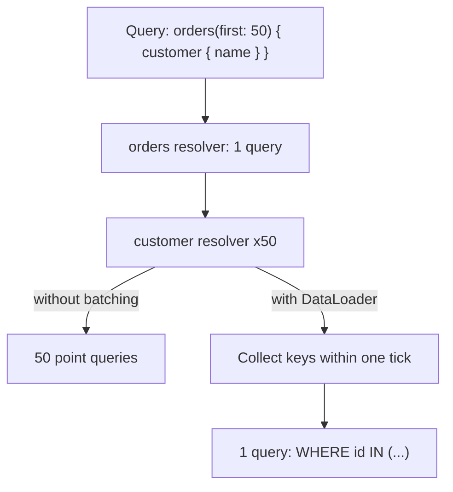
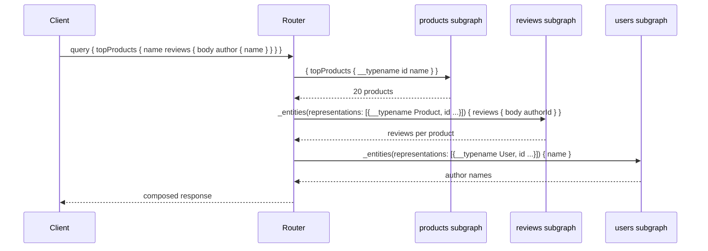

GraphQL, yanıt şekillendirmeyi sunucudan istemciye taşır. İstemci tam olarak istediği alanları tarif eden bir sorgu gönderir ve tam olarak o alanları alır; bu, aşırı veri çekmeyi ve normalize edilmiş bir REST modelinin arayüze dayattığı gidiş dönüş zincirini ortadan kaldırır. Bedel dört yerden ödenir: her istek tek bir URL'e yapılan bir `POST` olduğu için HTTP caching çalışmaz hale gelir, istek maliyeti sınırsız ve saldırgan kontrollü olur, endpoint bazlı gözlemlenebilirlik tek bir `/graphql` metriğine çöker ve N+1 sorgu problemi istemciden çıkıp saklanmasının çok daha kolay olduğu resolver katmanınıza taşınır.
 
Federasyon bunu birçok ekibe genişletir: her servis bir **subgraph**'a sahip olur, bir router bunları tek bir **supergraph**'ta birleştirir ve istemciler tek bir ekibin sahip olmadığı birleşik bir şemayı sorgular. Bu, organizasyonel bağımsızlık kazandırır ve size her isteğin sıcak yolunda çalışan dağıtık bir query planner'a mal olur.
 
## Yürütme Semantiği
 
Bir GraphQL sunucusu, bir tip sistemi artı **resolver**'lardan (alan başına bir fonksiyon) oluşur. Yürütme, sorgunun seçim kümesi üzerinde derinlik öncelikli bir gezintidir: alanı çöz, sonucunu alt alan resolver'larına ebeveyn olarak geçir, özyinele. Aynı seviyedeki kardeş alanlar eşzamanlı çalışır; kök **mutation** alanları kesinlikle sırayla çalışır ve bu, dildeki tek sıralama garantisidir.
 
Alan başına resolver modeli, GraphQL'i hem esnek hem de varsayılan olarak yavaş kılan şeydir. 100 nesne üzerinde 5 alan seçen bir sorgu 500 resolver çağırır ve veritabanına dokunan her resolver bağımsız olarak 500 sorgu üretir.
 
### Null Yayılımı Bir Veri Kaybı Mekanizmasıdır
 
`Type!` olarak bildirilmedikçe her alan null olabilir. Non-null bir alanın resolver'ı hata döndürdüğünde veya `null` verdiğinde, hata *yukarı* doğru en yakın nullable ataya yayılır ve o ata `null` yapılır; başarıyla çözülmüş kardeş alanlar da böylece atılır.
 
```graphql
type Query {
  order(id: ID!): Order        # nullable: errors stop here
}
 
type Order {
  id: ID!
  lineItems: [LineItem!]!      # non-null list of non-null items
  recommendations: [Product!]  # nullable: a failure here nulls only this field
}
```
 
`lineItems` içindeki tek bir eleman çözülemezse, `lineItems` null olamayacağı ve `Order` en yakın nullable ata olduğu için tüm `Order` `null` olur. `recommendations` alanını null'layan bir öneri servisi kesintisi tek bir alana mal olur; aynı kesinti non-null bir alanın arkasındaysa tüm yanıta mal olur.
 
:::caution
Bir alanı yalnızca istemci gerçekten onsuz render edemiyorsa `!` ile işaretleyin. Agresif non-null anotasyonları, "tek bir downstream bozuk diye tüm sayfa boş" durumunun en yaygın nedenidir — şemanın kendisi kısmi bir hatayı tam bir hataya çevirir. Non-null bir veri kalitesi iddiası değil, bir bağlılık kararıdır.
:::
 
Hatalar, kısmi `data` ile birlikte üst seviye bir `errors` dizisinde taşınır ve HTTP status ne olursa olsun `200`'dür. HTTP status kodları üzerine kurulmuş her gateway metriği, circuit breaker ve SLO, tam bir backend çöküşü sırasında %100 başarı okur — gRPC'nin trailer'da taşınan status'uyla aynı tuzak ve aynı şekilde, proxy'de gövdeden hata sayıları çıkararak veya sunucudan birinci sınıf metrik yayarak düzeltilmelidir.
 
## N+1 Problemi ve DataLoader
 
Kanonik hata: her biri `customer` alanı içeren 50 sipariş için yapılan bir sorgu, customer resolver'ını 50 kez çağırır ve 50 adet `SELECT ... WHERE id = ?` çalıştırır.
 

*DataLoader anahtar toplamayı event loop tick'inin sonuna erteler ve tüm seviye için tek bir batch sorgu çalıştırır.*
 
**DataLoader** standart çözümdür: resolver'lar satır yerine anahtar ister, loader mevcut tick bitene kadar anahtarları biriktirir, ardından batch fonksiyonunu hepsiyle bir kez çağırır ve sonuçları anahtara göre geri dağıtır. Ayrıca istek içinde memoize eder, dolayısıyla on resolver tarafından istenen aynı anahtar tek bir aramaya mal olur.
 
İki kısıt pazarlık dışıdır. Loader örneği **istek başına** oluşturulmalıdır — paylaşılan bir loader, memoization önbelleği üzerinden bir kullanıcının yetkili verisini başka bir kullanıcının yanıtına sızdırır ve bayat satırları hiç düşürmez. Ve batch fonksiyonu sonuçları istenen anahtarların tam sırasıyla, eksik olanlar için açık null'lar dahil döndürmelidir; hizalama bozulursa yanlış ID'ye yanlış varlık sessizce döner ve tek elemanlı fixture kullanan hiçbir test bunu yakalamaz.
 
Batch'leme derinliği çözmez. Üç seviye iç içe bir sorgu yine üç ardışık batch turu üretir; dolayısıyla gecikme, genişlikle orantılı olmasa bile sorgu *derinliğiyle* orantılıdır.
 
## Sorgu Maliyeti Kontrolü
 
Maliyet kontrolü olmayan bir public GraphQL endpoint'i, herhangi bir istemcinin döngüsel ilişkileri gezen ve işi üstel olarak katlayan bir sorgu kurmasına izin verir — `user { friends { friends { friends { ... } } } }`. Savunmalar birbirini tamamlar; hiçbiri tek başına yeterli değildir:
 
- **Derinlik sınırlama**, sabit bir iç içelik seviyesinin ötesindeki sorguları reddeder. Ucuz, kaba ve geniş ama sığ bir sorguyla kolayca atlatılır.
- **Karmaşıklık analizi**, alan başına statik bir maliyet atar, sayfalama argümanlarıyla çarpar ve bütçeyi aşan sorguları reddeder. Asıl kontrol budur ve şema evrildikçe bakımı yapılan maliyet anotasyonları gerektirir.
- **Sayfalama limitleri**: `first`/`last` için şemada zorlanan ve resolver'larda yeniden kontrol edilen sert bir üst sınır.
- **Persisted query'ler (trusted documents)**: istemciler sorgu metni yerine build zamanında kaydedilmiş bir sorgunun hash'ini gönderir. Sunucu yalnızca bilinen operasyonları çalıştırır; bu, keyfi sorgu saldırılarını tamamen ortadan kaldırır ve istek payload'larını küçültür. Birinci taraf istemciler için doğru duruş budur; yalnızca gerçekten açık API'lerin keyfi doküman kabul etmesi gerekir.
- **Üretimde introspection kapalı** (public olmayan şemalar için). Bu tek başına bir güvenlik sınırı değil bir şema ifşasıdır, ama saldırı haritası yayımlamak için de bir sebep yoktur.
- **Resolver ve operasyon başına timeout ve eşzamanlılık bütçeleri**, çünkü karmaşıklık puanlaması statik bir tahmindir ve gerçek maliyet veriye bağlıdır (bkz. [Yük Atma](/distributed-systems/tr/resilience/flow-control/load-shedding/)).
Burada istek sayısına göre rate limiting anlamsızdır: bir istek diğerinden bin kat pahalı olabilir. İstek yerine pencere başına tüketilen hesaplanmış karmaşıklık puanına göre sınırlayın (bkz. [Gateway Düzeyinde Throttling ve Rate Limiting](/distributed-systems/tr/communication/api-gateway/throttling-rate-limiting/)).
 
## URL Olmadan Caching
 
GraphQL, [REST](/distributed-systems/tr/communication/synchronous-protocols/rest/)'i cache'lenebilir kılan özelliği atar: `/graphql`'e yapılan bir `POST` her ara katman için cache'lenemezdir ve URL, çekilen kaynağın kimliğini taşımaz. Yerini üç katman alır ve bunlar birbirinin yerine geçmez:
 
1. **CDN ve edge caching**, ancak operasyonu query string'inde persisted-query hash'i olan bir `GET` olarak göndererek mümkün olur; böylece URL yeniden operasyonu tanımlar. Yanıtın `Cache-Control`'ü, seçilen alanlar arasındaki en kısıtlayıcı `@cacheControl` ipucundan hesaplanır — cache'lenmeyen tek bir alan tüm yanıtı cache'lenemez yapar.
2. **Sunucu tarafı entity caching**, tip ve ID ile anahtarlanmış olarak resolver'ların altında durur. Yanıtları değil varlıkları cache'lediği için keyfi sorgu şekillerinden sağ çıkar ve faydanın çoğu aslında buradadır.
3. **Normalize istemci cache'leri** (Apollo Client, Relay, urql) yanıtı küresel olarak benzersiz bir ID ile anahtarlanmış varlıklara böler; böylece güncellenmiş bir nesne döndüren mutation, o nesneye referans veren her görünümü yamalar. Bu, subgraph'lar arasında küresel benzersiz ID gerektirir; tipe özel tamsayı ID'ler çakışır ve cache'i bozar.
## Federasyon
 
Federasyon, bağımsız deploy edilen subgraph'ları tek bir şemada birleştirir. Her subgraph sahip olduğu tipleri `@key` ile bildirir ve router sınırlar arası referansları çözer.
 
| Direktif | Anlamı | Tipik kullanım |
|----------|--------|----------------|
| `@key(fields: "id")` | Bu tip bir entity'dir, bu alanlarla adreslenebilir | Başka bir subgraph tarafından genişletilen her tip |
| `@external` | Alan başka bir subgraph'ta tanımlıdır | Yerelde bir key alanına referans vermek |
| `@requires(fields: "...")` | Bu resolver başka yerde sahip olunan alanlara ihtiyaç duyar | Yabancı veriye bağlı hesaplanmış alan |
| `@provides(fields: "...")` | Bu yol yabancı alanları ek sıçrama olmadan döndürebilir | Zaten elde olan denormalize veri |
| `@shareable` | Bu alanı birden fazla subgraph çözebilir | Meşru biçimde tekrarlanan alanlar |
| `@inaccessible` | Subgraph'ta var, supergraph'ta gizli | Bir alanın aşamalı açılışı |
 
```graphql
# products subgraph: owns Product
type Product @key(fields: "id") {
  id: ID!
  name: String!
  priceMinorUnits: Int!
}
 
# reviews subgraph: extends Product without owning it
type Product @key(fields: "id") {
  id: ID!
  reviews(first: Int! = 10): [Review!]!
  averageRating: Float
}
 
type Review @key(fields: "id") {
  id: ID!
  body: String!
  rating: Int!
  # The reviews subgraph knows only the key; the router fetches the rest.
  product: Product!
}
```
 
Router bir **query plan** kurar: verinin bağımsız olduğu yerlerde paralel dallar, bir getirmenin diğerinin çıktısına bağlı olduğu yerlerde ardışık kenarlar içeren bir subgraph getirme DAG'ı. Subgraph'lar arası çözümleme `_entities` kök alanını kullanır — router, temsilleri (`@key` alanları artı `__typename`) sahibi olan subgraph'a gönderir ve istenen alanları geri alır.
 

*Sorgunun her seviyesi, sahibi olan subgraph'a bir ardışık tur maliyeti çıkarır; gecikme subgraph sayısını değil sorgu derinliğini takip eder.*
 
Bundan iki özellik çıkar. Gecikme, plan üzerindeki kritik yoldur; dolayısıyla derin iç içe geçmiş, subgraph'lar arası bir sorgu, her subgraph ne kadar hızlı olursa olsun her sınır geçişi için bir ardışık sıçrama maliyeti çıkarır. Fan-out ise veriye bağlıdır: her biri 10 review'lu 20 ürün, 200 kullanıcılık bir temsil listesi üretir; dolayısıyla subgraph'lar büyük `_entities` batch'lerini verimli işleyecek şekilde kurulmalıdır, aksi halde batch'leme avantajı bir toplu sorgu zaman aşımına dönüşür.
 
Kompozisyon bir build zamanı kapısıdır. Supergraph şeması, subgraph şemalarından CI'da oluşturulur ve uyumsuz değişiklikler — başka bir subgraph'ın `@requires` ettiği kaldırılmış bir alan, tip sahipliği çakışması, uyumsuz bir `@shareable` — deployment öncesinde kompozisyonu düşürür. Federasyonu güvenli kılan mekanizma budur ve aynı zamanda paylaşılan bloklayıcı bir bağımlılıktır: bozuk bir kompozisyon her ekibin deploy'unu engeller, dolayısıyla kompozisyon kontrolleri yalnızca publish anında değil subgraph PR'larında çalışmalıdır.
 
:::tip
Subgraph sınırları veritabanı tablolarını değil bounded context'leri izlemelidir (bkz. [Domain-Driven Design](/distributed-systems/tr/microservice-patterns/service-decomposition/domain-driven-design/)). İki subgraph birbirinden alan `@requires` etmek zorunda kalıyorsa sınır yanlıştır: tek bir aggregate'i iki servise bölmüşsünüzdür ve artık her sorgu onu yeniden birleştirmek için iki sıçrama öder.
:::
 
## Router Yapılandırması ve Resolver'lar
 
```yaml
# Router: per-subgraph budgets and cost limits. Defaults are permissive
# and a single slow subgraph will otherwise stall the whole supergraph.
supergraph:
  listen: 0.0.0.0:4000
 
traffic_shaping:
  all:
    timeout: 5s              # per-subgraph request budget
    deduplicate_variables: true
  subgraphs:
    reviews:
      timeout: 800ms         # non-critical: fail fast and null the field
      global_rate_limit:
        capacity: 2000
        interval: 1s
 
limits:
  max_depth: 12
  max_aliases: 30
  max_root_fields: 20
  parser_max_tokens: 15000
 
persisted_queries:
  enabled: true
  safelist:
    enabled: true            # reject any operation not in the manifest
    require_id: true
 
telemetry:
  instrumentation:
    spans:
      mode: spec_compliant   # one span per subgraph fetch, not per request
```
 
```typescript
import DataLoader from "dataloader";
import type { Request } from "express";
 
interface Customer {
  id: string;
  name: string;
}
 
// Created per request. A module-level loader would leak one user's
// authorized rows into another user's response via the memo cache.
export function createLoaders(req: Request) {
  return {
    customerById: new DataLoader<string, Customer | null>(
      async (ids) => {
        const rows = await db.query<Customer>(
          "SELECT id, name FROM customers WHERE id = ANY($1) AND tenant_id = $2",
          [ids as string[], req.auth.tenantId],
        );
 
        // The batch function MUST return results positionally aligned
        // with `ids`, including explicit nulls. Returning the raw rows
        // silently maps the wrong customer onto the wrong order.
        const byId = new Map(rows.map((r) => [r.id, r]));
        return ids.map((id) => byId.get(id) ?? null);
      },
      { maxBatchSize: 500 }, // bound the IN clause; huge batches stall the DB
    ),
  };
}
 
export const resolvers = {
  Order: {
    async customer(
      order: { customerId: string },
      _args: unknown,
      ctx: { loaders: ReturnType<typeof createLoaders>; signal: AbortSignal },
    ) {
      // Honour cancellation: an abandoned HTTP request should not keep
      // resolvers running against the database.
      if (ctx.signal.aborted) throw new Error("request cancelled");
 
      const customer = await ctx.loaders.customerById.load(order.customerId);
      if (customer === null) {
        // Nullable field: return null rather than throwing, so one missing
        // customer does not null the entire Order via error propagation.
        return null;
      }
      return customer;
    },
  },
};
```
 
## Hata Modları ve Operasyonel Tuzaklar
 
**Tek yavaş subgraph'ın her şeyi bozması.** Belirti: ona neredeyse hiç dokunmayan sorgular dahil tüm operasyonlarda p99'un en yavaş subgraph'ı takip etmesi. Tespit, operasyon toplamlarını değil router trace'lerindeki subgraph başına getirme gecikmesini gerektirir (bkz. [Dağıtık İzleme](/distributed-systems/tr/observability/logs-metrics-traces/distributed-tracing/)). Çözüm: alanın önemine göre boyutlandırılmış subgraph başına timeout'lar ve zaman aşımının hataya değil bozunmaya yol açması için nullable alanlar.
 
**Gözlemlenebilirlik çöküşü.** Her istek `POST /graphql`'dir; dolayısıyla URL tabanlı dashboard'lar iki tepeli bir gecikme dağılımına sahip tek bir endpoint gösterir ve maliyeti hiçbir şeye atfedemezsiniz. Her istekte operasyon adı zorunlu kılın, anonim operasyonları reddedin ve metrikleri operasyon adına ve resolver'a göre anahtarlayarak yayın.
 
**Hata maskeleme eksikliği.** Sunucu tarafı istisna detaylarının `errors` dizisine sızması stack trace'leri, SQL parçalarını ve iç hostname'leri ifşa eder. Üretimde hataları varsayılan olarak maskeleyin ve istemcinin destek talebinde belirtebileceği bir trace ID ile ilişkilendirin.
 
**Atomiklik olmadan subgraph'lar arası mutation.** İki subgraph'a dokunan tek bir mutation, transaction'sız iki bağımsız yazmadır. Protokolde dağıtık commit yoktur; ikincisi başarısız olursa birincisi yerinde kalır. Bunu bir [SAGA](/distributed-systems/tr/coordination/distributed-transactions/saga-pattern/) ve telafi edici eylemlerle açıkça modelleyin veya mutation'ı tek bir subgraph içinde tutun.
 
**Paylaşılan loader'lar üzerinden cache zehirlenmesi.** Tenant veya yetkilendirme kapsamı olmadan anahtarlanmış bir loader ya da entity cache, başka bir tenant'ın verisini döndürür. Anahtar, yetkilendirme kararının bağlı olduğu her boyutu içermelidir.
 
**Şema kayması ve sessiz kırılma.** Kompozisyonun izin verdiği bir alan kaldırma, o alanı kullanan bir istemciyi yine de kırabilir. Operasyon telemetrisinden alan başına kullanımı izleyin, `@deprecated(reason: ...)` ile emekliye ayırın ve yalnızca kullanım sıfıra indiğinde kaldırın — versiyonlama disiplininin GraphQL karşılığı budur (bkz. [API Versiyonlama Stratejileri](/distributed-systems/tr/communication/synchronous-protocols/api-versioning/)).
 
**Subscription'ların bedava sanılması.** Her subscription, sunucu durumu ve subgraph fan-out'u tutan uzun ömürlü bir bağlantıdır. Ölçekte, herhangi bir uzun ömürlü stream'le aynı sabitlenme, yeniden bağlanma fırtınası ve idle timeout özelliklerine sahiptir (bkz. [WebSocket ve Server-Sent Events](/distributed-systems/tr/communication/synchronous-protocols/websocket-sse/)).
 
## GraphQL Ne Zaman Kullanılır
 
| Boyut | GraphQL | REST | gRPC |
|-------|---------|------|------|
| Yanıt şekillendirme | İstemci belirler | Endpoint başına sabit | Metot başına sabit |
| Bileşik bir görünüm için gidiş dönüş | Bir | Çok, ya da amaca özel endpoint | Çok, ya da bileşik RPC |
| Edge caching | Yalnızca persisted GET sorgularıyla | Yerleşik | Yok |
| İstek maliyeti öngörülebilirliği | Kontrolsüzse sınırsız | Endpoint başına sınırlı | Metot başına sınırlı |
| Şema zorlaması | Güçlü, introspection'lı | Tavsiye niteliğinde (OpenAPI) | Derleyici zorlamalı |
| Operasyonel araçlar | Özelleşmiş | Evrensel HTTP | Özelleşmiş |
 
Çok sayıda heterojen istemcinin aynı varlık grafiğinin farklı projeksiyonlarına ihtiyaç duyduğu ve alternatifin çoğalan bir özel endpoint yığını olduğu durumlarda; frontend ekibinin hızının backend endpoint değişikliklerine takıldığı yerlerde; ve federasyonlu bir supergraph'ın farklı ekiplerin sahip olduğu veriyi birleştirmenin koordinasyon maliyetini gerçekten azalttığı durumlarda GraphQL kullanın.
 
İç servisler arası RPC için kullanmayın; orada [gRPC](/distributed-systems/tr/communication/synchronous-protocols/grpc-protocol-buffers/) çalışma zamanı maliyetinin çok küçük bir kısmıyla daha katı bir sözleşme verir. Değerinin kaynağı CDN caching olan okuma ağırlıklı public API'ler için kullanmayın. Ve tek bir birinci taraf istemciniz varsa, bir [BFF](/distributed-systems/tr/communication/api-gateway/bff-pattern/) şekillendirme faydasının çoğunu query planner, maliyet analizi ve federasyon kompozisyon hattı olmadan verir.