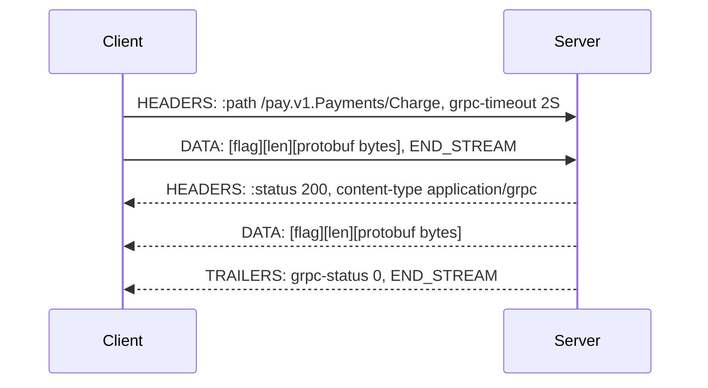
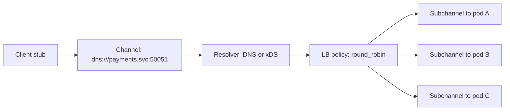

gRPC size kompakt binary kodlama, derleyicinin zorladığı bir sözleşme, birinci sınıf deadline'lar ve çift yönlü streaming kazandırır. Karşılığında insan tarafından okunabilir trafiği, ara katman caching'ini, proxy olmadan tarayıcıdan erişilebilirliği ve herhangi biri çağrı yapabilmeden önce her tüketici dili için stub üretmek zorunda olan bir build hattını maliyet olarak yazar. Kodlama kazancı gerçektir ama genellikle beklenenden küçüktür — yapılandırılmış veride JSON'a göre kabaca %30-50 daha küçük payload ve 5-10 kat daha hızlı serileştirme — buna karşılık migrasyonun bedelini asıl ödeyen şey, zorunlu kılınan deadline'lar ve tipli sözleşmelerden gelen operasyonel kazançtır.
 
**gRPC**, pratikte sıkı biçimde bağlı olan üç ayrılabilir parçadan oluşan bir RPC çatısıdır: arayüz tanım dili (**IDL**) ve wire formatı olarak Protocol Buffers, transport olarak HTTP/2 ve HTTP trailer'larında taşınan bir status protokolü.
 
## Protobuf Wire Formatı: Sözleşme Alan Numaralarıdır
 
Wire üzerindeki bir protobuf mesajı, düz bir anahtar-değer çiftleri dizisidir. Anahtar, `(field_number << 3) | wire_type` değerine eşit bir varint'tir. Alan *adları* wire'da hiç görünmez; yalnızca numaralar görünür.
 
| Wire type | Değer | Kullanan tipler |
|-----------|-------|-----------------|
| VARINT | 0 | `int32`, `int64`, `uint32`, `uint64`, `sint32`, `sint64`, `bool`, `enum` |
| I64 | 1 | `fixed64`, `sfixed64`, `double` |
| LEN | 2 | `string`, `bytes`, gömülü mesajlar, packed repeated alanlar |
| I32 | 5 | `fixed32`, `sfixed32`, `float` |
 
**Varint** kodlaması bayt başına 7 bit kullanır ve en yüksek biti devam bayrağı olarak ayırır; dolayısıyla küçük sayılar bir bayt, 2^28 üzerindeki değerler beş bayt tutar. Bunun doğrudan bir tasarım sonucu vardır: negatif bir `int32`, 64 bite işaret genişletmesiyle taşınır ve her zaman 10 bayt harcar. Negatif olabilen her alan için, küçük mutlak değerli negatifleri küçük varint'lere eşleyen **ZigZag** kodlamasını (`(n << 1) ^ (n >> 31)`) uygulayan `sint32`/`sint64` kullanın.
 
1-15 arası alan numaraları tag'ini tek baytta kodlar; 16-2047 iki bayt ister. Düşük numaraları sıcak yoldaki her mesajda bulunan alanlara verin ve nadiren set edilen alanlara geçmeden önce boşluk bırakın.
 
`repeated` skaler alanlar proto3'te varsayılan olarak **packed**'tir: eleman başına tag yerine tüm değerleri içeren tek bir LEN önekli blok. 1000 küçük değerli bir `repeated int32` packed halde kabaca 1000 bayt, packed olmadan 2000 bayt tutar.
 
### Gerçekten Bağlayıcı Olan Uyumluluk Kuralları
 
Wire formatında şema müzakeresi yoktur. Tanımadığı bir alan numarasıyla karşılaşan okuyucu onu bir unknown-fields kümesinde saklar ve serileştirirken yeniden yayar; proxy'leyip ileten servislerin veri kaybetmemesini sağlayan mekanizma budur. Neyin güvenli olduğunu da bu mekanizma tanımlar:
 
- **Güvenli:** yeni bir numarayla alan eklemek; numarasını ve adını `reserved` yapmak *koşuluyla* alan kaldırmak; alan adını değiştirmek (adlar üretilen koda özeldir); aralık içindeki değerler için `int32`, `uint32`, `int64`, `uint64` ve `bool` arasında dönüşüm; enum'a değer eklemek.
- **Güvensiz:** emekliye ayrılmış bir alan numarasını yeniden kullanmak — eski okuyucular yeni veriyi eski alanın tipiyle çözer ve sessizce çöp üretir; bir alanın wire type'ını değiştirmek; alanı `oneof` içine almak veya dışına çıkarmak; skaler olmayan bir tip için packed ve unpacked temsiller arasında geçiş yapmak.
:::danger
Bir alan numarasını, alanı kaldırdıktan yıllar sonra bile asla yeniden kullanmayın. Uzun ömürlü tek bir istemci, bir Kafka topic'inde kalıcılaşmış bir mesaj veya nesne depolamadaki bir snapshot, 7 numarayı eski anlamıyla çözer ve hiçbir yerde hata üretilmez. Her zaman `reserved 7;` ve `reserved "old_field_name";` yazın; böylece derleyici yeniden kullanımı build zamanında reddeder — ekip değişimlerinden sağ çıkan tek zorlama budur.
:::
 
Sessiz bozulmanın ikinci kaynağı enum'lardır. Proto3 sıfır değerinin belirtilmemiş bir sentinel olmasını zorunlu kılar (`STATUS_UNSPECIFIED = 0`) ve enum'lar açıktır: tanımadığı bir değeri alan okuyucu numarayı korur ama adlandıramaz, dolayısıyla default dalı olmayan her `switch` onu yanlış işler. Bilinmeyen enum değerlerini sıfır değeri gibi değil, açık bir reddetme yolu olarak ele alın.
 
### Presence: Proto3 Tuzağı
 
Proto3 başlangıçta skalerler için alan varlığını (presence) kaldırdı: `0`, `""` veya `false` olarak set edilmiş bir alan, wire üzerinde hiç set edilmemiş bir alandan ayırt edilemez, çünkü varsayılan değerler serileştirilmez. Bu, tam yer değiştirme yazmaları için doğru, kısmi güncellemeler için felakettir. Bir güncelleme RPC'sinde `{balance: 0}` gönderen istemci, `balance` alanını tamamen atlayan bir mesajla birebir aynı baytları üretir.
 
İki çözüm var. `optional` anahtar kelimesi (protobuf 3.15'te geri getirildi) sentetik bir `oneof` üzerinden açık presence üretir ve size `has_balance()` verir. Alternatif olarak, çağıranın değiştirmeyi amaçladığı alanları listeleyen bir `google.protobuf.FieldMask` kullanın — `Update*` RPC'lerinin konvansiyonu budur ve niyeti çıkarsanan değil açıkça belirtilen bir şey haline getirir.
 
## Wire Üzerinde gRPC Protokolü
 
Unary bir çağrı tam olarak bir HTTP/2 stream'idir. Metot, `:path` içinde `/package.Service/Method` olarak kodlanır; URL yapısı, query string veya HTTP fiil semantiği yoktur.
 

*RPC sonucu HTTP status'ta değil trailer'larda yaşar: grpc-status 13 taşıyan transport düzeyindeki bir 200, başarısız bir çağrıdır.*
 
Her mesaj 5 baytlık bir başlıkla önekelenir: bir baytlık sıkıştırma bayrağı artı 4 baytlık big-endian uzunluk. Bu çerçeveleme, gRPC'nin uçtan uca tam bir HTTP/2 uygulaması gerektirmesinin ve gövdeleri tamponlayan ya da yeniden yazan her ara katmanın onu bozmasının nedenidir. Alttaki stream mekaniği, flow-control pencereleri ve `GOAWAY` semantiği [HTTP/2 ve HTTP/3](/distributed-systems/tr/communication/synchronous-protocols/http2-http3-quic/) sayfasında ele alınır.
 
**Trailer** gereksinimi en keskin operasyonel kısıttır. `grpc-status` ve `grpc-message` gövdeden sonra gelir, dolayısıyla yoldaki her proxy HTTP/2 trailer'larını desteklemek zorundadır. Hiç mesaj yaymadan başarısız olan sunucu *trailers-only* bir yanıt gönderir: hem `:status: 200` hem hata kodunu taşıyan, `END_STREAM` bayraklı tek bir `HEADERS` frame'i. Header'lardan sonra gövde geleceğini varsayan middleware, tam olarak hata durumunu yanlış işler.
 
:::caution
`grpc-status: 14` ile birlikte gelen HTTP 200 bir başarısızlıktır. HTTP status kodları üzerine kurulmuş gateway dashboard'ları ve SLO alarmları, gRPC backend'inin tamamen çökmüş olduğu sırada %100 başarı raporlar. Her proxy metrik hattı `grpc-status`'u trailer'lardan açıkça çıkarmalıdır; aksi halde hata oranı SLO'nuz hiçbir şey ölçmüyordur.
:::
 
### Asıl Özellik Deadline'lardır
 
Her çağrı, `grpc-timeout` header'ında değer artı birim biçiminde (`2S`, `500m`) bir deadline taşır. Sunucu bunu yerel bir deadline'a çevirir ve idiomatik çatılar onu istek context'ine yayar; böylece downstream çağrılar kalan bütçeyi otomatik olarak devralır. Süre dolduğunda istemci stream'i `RST_STREAM` ile iptal eder ve sunucunun context'i iptal edilir — iş, kimsenin beklemediği bir istek üzerinde devam etmek yerine gerçekten durur.
 
Bu, sunucunun istemci pes ettikten sonra da çalışmaya devam ettiği gelişigüzel HTTP istemcilerine göre gerçek bir avantajdır (bkz. [Zaman Aşımları](/distributed-systems/tr/resilience/protection-patterns/timeouts/)). Mekanizmayı işler kılan kural şudur: deadline'lar mutlak ve yayılan değerlerdir, sıçrama başına yeniden türetilmezler. Kalan 300 ms'yi devralmak yerine taze bir 5 s timeout koyan bir sıçrama, mekanizmanın önlemek için var olduğu asimetriyi geri getirir.
 
### Status Kodları ve Retry Edilebilirlik
 
| Kod | Sayısal | Retry güvenli mi? | Tipik neden |
|-----|---------|-------------------|-------------|
| `OK` | 0 | — | Başarı |
| `CANCELLED` | 1 | Hayır | Çağıran iptal etti veya yayılmış iptal |
| `DEADLINE_EXCEEDED` | 4 | Yalnızca idempotent ise | Bütçe tükendi; sunucu hâlâ çalışıyor olabilir |
| `NOT_FOUND` | 5 | Hayır | Kaynak yok |
| `ALREADY_EXISTS` | 6 | Hayır | Idempotent yaratım çakışması; genellikle başarı sayılır |
| `PERMISSION_DENIED` | 7 | Hayır | Geçerli kimlik, yetersiz yetki |
| `RESOURCE_EXHAUSTED` | 8 | Evet, backoff ile | Kota, rate limit, mesaj boyutu taşması |
| `FAILED_PRECONDITION` | 9 | Hayır | Sistem durumu uygun değil; retry çözmez |
| `ABORTED` | 10 | Evet | Eşzamanlılık çakışması veya transaction abort |
| `UNIMPLEMENTED` | 12 | Hayır | İstemci ve sunucu arasında sürüm kayması |
| `INTERNAL` | 13 | Hayır | Sunucu hatası; retry'da deterministik tekrarlar |
| `UNAVAILABLE` | 14 | Evet | Geçici: bağlantı hatası, drain, yeniden başlatma |
 
`UNAVAILABLE`, koşulsuz retry edilebilir tek koddur; çünkü tanımı gereği RPC'nin uygulama mantığına hiç ulaşmadığı anlamına gelir. `DEADLINE_EXCEEDED` yapısı gereği belirsizdir: sunucu, istemci pes etmeden önce yazmayı commit etmiş olabilir, dolayısıyla idempotent olmayan bir çağrıyı yeniden denemek etkiyi ikizler (bkz. [Idempotency ve Güvenli HTTP Metotları](/distributed-systems/tr/communication/api-gateway/idempotency/)).
 
Zengin hata detayı, uzunluğu sınırlı ve header'a uygun bir dize olan `grpc-message` yerine `google.rpc.Status` details alanına aittir. İstemcilerin İngilizce metinde substring araması yapmak yerine yapıya göre dallanabilmesi için tipli bir `ErrorInfo` veya `QuotaFailure` kodlayın.
 
## Channel'lar, Subchannel'lar ve Yük Dengeleme
 
Bir gRPC **channel**'ı, mantıksal bir servise açılan sanal bir bağlantıdır: bir adı adres kümesine çözer ve adres başına bir **subchannel** (bir HTTP/2 bağlantısı) tutar. Yük dengeleme politikası RPC başına bir subchannel seçer; istemci taraflı dengelemeyi mümkün kılan şey budur.
 

*Subchannel'lar arasında RPC başına dengeleme; bunun önündeki bir L4 proxy, channel'dan çıkan her RPC'yi tek bir backend'e sabitlerdi.*
 
Varsayılan politika `pick_first`'tür; tek bir bağlantı kullanır ve dolayısıyla tüm trafiği tek backend'e gönderir. Replikalı bir servis için bu neredeyse hiçbir zaman istenen davranış değildir: tüm endpoint'leri döndüren bir resolver (Kubernetes headless service veya kontrol düzleminden xDS) üzerinde `round_robin` temel çizgidir. Alternatif, HTTP/2'yi anlayan ve stream başına dengeleme yapan bir L7 proxy'dir.
 
İşe yaramayan şey L4 load balancer'dır. Channel uzun ömürlü tek bir bağlantı tutar, dolayısıyla o istemciden çıkan her RPC bağlantı ölene kadar aynı backend'e düşer ve yeni ölçeklenen replikalar hiçbir şey almaz. Sunucu tarafında jitter'lı `MaxConnectionAge` ile azaltın; bu periyodik `GOAWAY` ve yeniden çözümlemeyi zorlar (bkz. [L4 ve L7 Yük Dengeleme](/distributed-systems/tr/communication/load-balancing/l4-vs-l7/) ve [İstemci Taraflı Keşif](/distributed-systems/tr/microservice-patterns/service-discovery/client-side-discovery/)).
 
Keepalive simetrik yapılandırılmalıdır. Sunucunun zorlama politikasının izin verdiğinden daha sık ping atan istemci, `ENHANCE_YOUR_CALM` ve `too_many_pings` ile `GOAWAY` alır; bu, ağ kararsızlığı gibi görünen periyodik toplu kopmalar olarak yüzeye çıkar. Sunucu `MinTime` değeri istemci keepalive aralığından küçük veya ona eşit olmalıdır.
 
## Uygulama
 
```proto
syntax = "proto3";
 
package pay.v1;
 
option go_package = "example.com/gen/pay/v1;payv1";
 
import "google/protobuf/timestamp.proto";
 
service Payments {
  rpc Charge(ChargeRequest) returns (ChargeResponse);
}
 
message ChargeRequest {
  // Field numbers 1-15 cost a single tag byte; reserve them for
  // fields present on every request in the hot path.
  string account_id = 1;
  int64 amount_minor_units = 2;
  string currency = 3;
  // Client-generated key that makes this RPC safe to retry.
  string idempotency_key = 4;
 
  // Field 5 held a removed "merchant_code" string. Reusing the number
  // would make old readers decode new data as merchant_code.
  reserved 5;
  reserved "merchant_code";
 
  // Explicit presence: distinguishes "capture_immediately = false"
  // from "caller did not specify".
  optional bool capture_immediately = 6;
}
 
message ChargeResponse {
  string payment_id = 1;
  Status status = 2;
  google.protobuf.Timestamp settled_at = 3;
 
  enum Status {
    // Proto3 requires a zero sentinel. Treat it as a protocol error,
    // never as a valid business state.
    STATUS_UNSPECIFIED = 0;
    STATUS_AUTHORIZED = 1;
    STATUS_CAPTURED = 2;
    STATUS_DECLINED = 3;
  }
}
```
 
```go
package main
 
import (
	"context"
	"errors"
	"log/slog"
	"net"
	"time"
 
	"google.golang.org/grpc"
	"google.golang.org/grpc/codes"
	"google.golang.org/grpc/credentials"
	"google.golang.org/grpc/keepalive"
	"google.golang.org/grpc/status"
 
	payv1 "example.com/gen/pay/v1"
)
 
type server struct {
	payv1.UnimplementedPaymentsServer
	ledger Ledger
}
 
func (s *server) Charge(ctx context.Context, req *payv1.ChargeRequest) (*payv1.ChargeResponse, error) {
	if req.GetIdempotencyKey() == "" {
		return nil, status.Error(codes.InvalidArgument, "idempotency_key is required")
	}
 
	// The caller's deadline is already in ctx. Never create a fresh
	// timeout here: that lets this hop outlive the caller.
	if dl, ok := ctx.Deadline(); ok && time.Until(dl) < 50*time.Millisecond {
		// Not enough budget left to finish. Fail fast so the caller sees
		// a clean error instead of a half-applied write.
		return nil, status.Error(codes.DeadlineExceeded, "insufficient remaining deadline")
	}
 
	res, err := s.ledger.Charge(ctx, req.GetIdempotencyKey(), req.GetAmountMinorUnits())
	switch {
	case errors.Is(err, ErrDuplicate):
		// Idempotent replay: return the original result, not an error.
		return res.Proto(), nil
	case errors.Is(err, ErrInsufficientFunds):
		// FAILED_PRECONDITION: retrying cannot succeed until state changes.
		return nil, status.Error(codes.FailedPrecondition, "insufficient funds")
	case errors.Is(err, context.DeadlineExceeded):
		return nil, status.Error(codes.DeadlineExceeded, "ledger did not respond in time")
	case err != nil:
		slog.ErrorContext(ctx, "charge failed", "key", req.GetIdempotencyKey(), "err", err)
		// INTERNAL is not client-retryable, which is correct for bugs.
		return nil, status.Error(codes.Internal, "charge failed")
	}
	return res.Proto(), nil
}
 
func main() {
	creds, err := credentials.NewServerTLSFromFile("cert.pem", "key.pem")
	if err != nil {
		slog.Error("tls load failed", "err", err)
		return
	}
 
	srv := grpc.NewServer(
		grpc.Creds(creds),
		// Bound concurrent work; otherwise one client can occupy every
		// handler goroutine in the process.
		grpc.MaxConcurrentStreams(250),
		// Default is 4 MiB. Raise deliberately, and prefer streaming
		// over oversized unary payloads.
		grpc.MaxRecvMsgSize(8<<20),
		grpc.KeepaliveEnforcementPolicy(keepalive.EnforcementPolicy{
			// Must be <= the client keepalive interval, or clients get
			// GOAWAY with too_many_pings and reconnect in a loop.
			MinTime:             10 * time.Second,
			PermitWithoutStream: true,
		}),
		grpc.KeepaliveParams(keepalive.ServerParameters{
			Time:    20 * time.Second,
			Timeout: 5 * time.Second,
			// Force periodic reconnection so long-lived clients
			// rediscover newly scaled backends. Grace plus jitter
			// avoids a synchronized reconnect wave.
			MaxConnectionAge:      30 * time.Minute,
			MaxConnectionAgeGrace: 30 * time.Second,
		}),
	)
	payv1.RegisterPaymentsServer(srv, &server{})
 
	lis, err := net.Listen("tcp", ":50051")
	if err != nil {
		slog.Error("listen failed", "err", err)
		return
	}
	if err := srv.Serve(lis); err != nil {
		slog.Error("serve stopped", "err", err)
	}
}
```
 
İstemci retry politikası, çatının her çağrı noktasının yükü bağımsız olarak katlamasına izin vermek yerine küresel bir bütçe uygulayabilmesi için elle yazılmış döngülerde değil service config'de tanımlanmalıdır:
 
```json
{
  "loadBalancingConfig": [{ "round_robin": {} }],
  "methodConfig": [
    {
      "name": [{ "service": "pay.v1.Payments" }],
      "timeout": "2s",
      "retryPolicy": {
        "maxAttempts": 4,
        "initialBackoff": "0.1s",
        "maxBackoff": "1s",
        "backoffMultiplier": 2,
        "retryableStatusCodes": ["UNAVAILABLE", "RESOURCE_EXHAUSTED"]
      }
    }
  ],
  "retryThrottling": {
    "maxTokens": 100,
    "tokenRatio": 0.1
  }
}
```
 
`retryThrottling`, en sık atlanan ve en çok önem taşıyan maddedir: retry'ları başarılı çağrıların bir oranıyla sınırlar, böylece zorlanan bir backend aynı anda retry yapan istemcilerden normal yükünün 4 katını almaz (bkz. [Retry Fırtınaları ve Metastabil Hatalar](/distributed-systems/tr/resilience/flow-control/retry-storms-metastable-failures/)).
 
## Hata Modları ve Operasyonel Tuzaklar
 
**Mesaj boyutu uçurumları.** 4 MiB'lık varsayılan alım limiti transport katmanında `RESOURCE_EXHAUSTED` üretir ve tipik olarak yalnızca en büyük tenant'ta görülür. Belirti: hesapların %99'unda çalışan, bir avuç hesapta deterministik biçimde başarısız olan bir RPC. Çözüm, tavanı sınırsızca yükseltmek yerine sayfalamak veya server streaming'e geçmektir (bkz. [gRPC Streaming](/distributed-systems/tr/communication/synchronous-protocols/grpc-streaming/)); büyük unary mesaj aynı zamanda uçuştaki her çağrı için bitişik tek bir bellek ayırması demektir.
 
**Scale-out sonrası yük dengesizliği.** Channel'lar backend'lere sabitlendiği için yeni pod'lar boşta beklerken eskiler doyuma ulaşır. Deployment sonrası pod başına RPC oranı varyansıyla tespit edin; istemcileri yeniden başlatmak yerine `MaxConnectionAge` ve gerçek bir LB politikasıyla düzeltin.
 
**Deadline unutkanlığı.** Servis, çağıranın context'ini yaymak yerine `context.Background()` ile yeni bir context oluşturur ve istemci pes ettikten sonra iş devam eder. Belirti: backend CPU ve veritabanı yükünün istemcinin gözlemlediği trafikle ilişkisiz olması. Tespit için sunucu tarafı handler süresi histogramlarını istemci tarafı RPC süresi histogramlarıyla karşılaştırın; istemci tarafında karşılığı olmayan ağır bir sunucu kuyruğu bu sorunun imzasıdır.
 
**`UNIMPLEMENTED` üreten sürüm kayması.** Daha yeni bir proto'dan üretilmiş istemci, deploy edilmiş sunucuda bulunmayan bir metodu çağırır. Bu bir deploy sıralaması hatasıdır: her zaman önce sunucu, sonra istemci. Bir RPC'yi kaldıran veya adını değiştiren her proto değişikliğinde CI'ı kırmak ucuz bir sigortadır (bkz. [API Versiyonlama Stratejileri](/distributed-systems/tr/communication/synchronous-protocols/api-versioning/)).
 
**Proxy'nin trailer uyumsuzluğu.** HTTP/2'yi trailer desteği olmadan sonlandıran bir ara katman her hatayı ya asılı kalmış bir stream'e ya da çıplak bir 200'e çevirir. Doğrulamayı pod'a doğrudan değil, gerçek ingress yolu üzerinden `grpcurl` ile uçtan uca yapın.
 
**Enum kayması.** Producer'da yeni bir enum değeri yayımlanır ve default dalı olmayan `switch` kullanan tüketiciler sessizce yanlış dalı seçer. Reddeden bir default dalını zorunlu kılın ve wire uyumlu olsalar bile enum eklemelerini koordineli bir rollout gibi ele alın. Bunun registry düzeyinde yönetişimi [Şema Evrimi ve Schema Registry](/distributed-systems/tr/communication/async-messaging/schema-evolution-registry/) sayfasında ele alınır.
 
**Blocking stub'ların çağıranı tüketmesi.** İstek başına thread modeli olan dillerdeki senkron stub'lar, yavaş bir downstream'i çağıranın thread pool tükenmesine çevirir ve kesintiyi yukarı doğru yayar. Havuzu bağımlılık başına ayrı sınırlayın (bkz. [Bulkhead Deseni](/distributed-systems/tr/resilience/protection-patterns/bulkhead-pattern/)).
 
**Tarayıcıdan erişilememe.** Tarayıcılar HTTP/2 frame'lerini kontrol edemez ve trailer okuyamaz, dolayısıyla bir sayfadan native gRPC imkansızdır. gRPC-Web veya Connect, çeviri yapan bir proxy gerektirir (Envoy'un gRPC-Web filtresi veya Connect uyumlu bir sunucu) ve gRPC-Web yalnızca unary ile server-streaming çağrıları destekler.
 
## gRPC Ne Zaman Kullanılır
 
| Boyut | gRPC | REST/JSON | GraphQL |
|-------|------|-----------|---------|
| Payload boyutu ve codec CPU'su | Kompakt binary, hızlı | Ayrıntılı, parser'a bağlı | Ayrıntılı |
| Sözleşme zorlaması | Derleyici denetimli IDL | Tavsiye niteliğinde (OpenAPI) | Şema zorlamalı |
| Deadline yayılımı | Protokole gömülü | İstemci başına elle | Elle |
| Ara katman caching | Yok | Her katmanda yerleşik | Fiilen yok |
| Tarayıcı desteği | Proxy gerektirir | Evrensel | Evrensel |
| Debug edilebilirlik | `grpcurl` ve descriptor ister | `curl` ve gözle | Introspection araçları |
| Streaming | Birinci sınıf çift yönlü | Yanında SSE veya WebSocket | Subscription'lar |
 
Çağrı hacminin serileştirme maliyetini ve bağlantı verimliliğini CPU profilinde görünür kıldığı iç servisler arası trafikte, çok dilli ekiplerin derleyicinin zorladığı bir sözleşmeye ihtiyaç duyduğu yerlerde ve bir çağrı grafiği boyunca deadline yayılımı ile iptalin gerçek operasyonel değeri olduğu durumlarda gRPC kullanın.
 
Tüketiciler harici veya bilinmeyen olduğunda, edge caching kodlama verimliliğinden değerli olduğunda ya da standart HTTP araçlarıyla işletilebilirlik önemli olduğunda [REST](/distributed-systems/tr/communication/synchronous-protocols/rest/) tercih edin. İstemciler çok sayıda varlık grafiği üzerinde yanıt şekillendirmek zorundaysa [GraphQL](/distributed-systems/tr/communication/synchronous-protocols/graphql/) tercih edin. Ayrıca bir gRPC servisinin, `google.api.http` anotasyonlarıyla yönlendirilen bir transcoding gateway üzerinden REST olarak da yayımlanabileceğini not edin: iç çağıranlar binary yolu, dış çağıranlar JSON'u alır; tek tanım ve tek gerçek kaynağıyla.