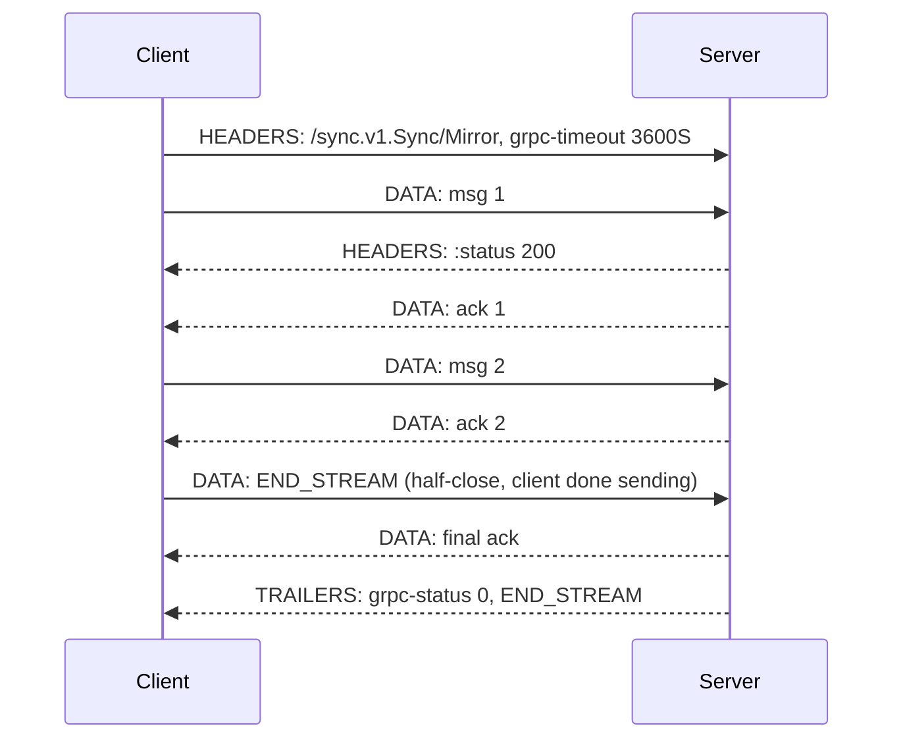

Stream, çağrı süresince açık tutulan tek bir HTTP/2 stream'idir ve bu tek gerçek, bu sayfadaki tüm dengeleri üretir. Kazandığınız şeyler: amortize edilmiş çerçeveleme maliyeti, aşamalı teslim ve transport düzeyinde backpressure. Kaybettikleriniz: ilk mesajdan sonra otomatik retry, istek başına yük dengeleme ve herhangi bir ara katmanın idle timeout'unu başkasının problemi sayma lüksü. Stream'ler ayrıca ömürleri boyunca her iki uçta bellek ve bir eşzamanlılık yuvası tutar; 50.000 stream taşıyan bir endpoint, sunucunun bağlantıları üzerindeki `MAX_CONCURRENT_STREAMS` bütçesinden 50.000 yuva tutuyor demektir.
 
gRPC, yalnızca hangi tarafın birden fazla mesaj gönderebildiğine göre ayrılan dört çağrı türü tanımlar. Wire mekaniği aynıdır: `DATA` frame'leri içinde uzunluk önekli mesajlar ve `grpc-status` taşıyan trailer'larla sonlanma (çerçeveleme ve status detayları için bkz. [gRPC & Protocol Buffers](/distributed-systems/tr/communication/synchronous-protocols/grpc-protocol-buffers/)).
 
| Çağrı türü | İstemci mesajı | Sunucu mesajı | Çatı tarafından retry edilebilir mi | Tipik kullanım |
|------------|----------------|---------------|--------------------------------------|----------------|
| Unary | 1 | 1 | Evet | Sıradan RPC |
| Server-streaming | 1 | N | Yalnızca ilk yanıt mesajından önce | Büyük sonuç kümeleri, değişiklik akışları, log takibi |
| Client-streaming | N | 1 | Hayır | Toplu veri alımı, dosya yükleme, metrik yığınları |
| Çift yönlü | N | N | Hayır | Uzun ömürlü kontrol düzlemleri, sohbet, etkileşimli oturumlar |
 
## Yaşam Döngüsü: Sözleşme Half-Close'dur
 
Bir gRPC stream'i iki bağımsız tek yönlü bayt akışıdır. Her taraf kendi yönünü `END_STREAM` ile kapatır; diğer yön açık kalır. Client-streaming'i mümkün kılan şey bu **half-close**'dur: istemci göndermeyi bitirir, sunucu hesaplar ve hâlâ açık olan yönden yanıt verir.
 

*İstemci half-close'lu çift yönlü stream; sunucu istemcinin yönü kapandıktan sonra da göndermeye devam eder ve çağrıyı yalnızca trailer'lar sonlandırır.*
 
Bundan doğrudan üç sonuç çıkar:
 
- Mesaj sırası bir yön içinde ve yalnızca bir yön içinde garantilidir. Hiçbir şey istemci mesajıyla sunucu mesajını birbirine göre sıralamaz; kendi mesajlarınıza bir korelasyon kimliği koymadıkça istek-yanıt eşleşmesi yoktur.
- Status yalnızca bir kez, en sonda, trailer'larda gelir. 10.000 mesaj göndermiş ve ardından başarısız olmuş bir sunucu, `grpc-status: 13`'ü o mesajlardan sonra yayar. İstemci, hatayla biten kısmen tüketilmiş bir stream'i işleyebilecek şekilde yazılmalıdır; stream'in sonlanmasını başarı saymak kozmetik değil, veri bütünlüğü hatasıdır.
- "7. mesaj için hata" diye bir şey yoktur. Hatalar tüm stream'i sonlandırır. Toplu bir operasyondaki öğe bazlı başarısızlıklar, RPC hatası olarak değil, yanıt mesajının içinde (öğe başına bir status alanı) modellenmelidir.
## Backpressure HTTP/2 Flow Control'dür ve Otomatik Değildir
 
Temel mekanizma: her `DATA` frame'i flow-control kredisi tüketir ve kredi yalnızca alıcının uygulaması mesajı *okuduktan* sonra `WINDOW_UPDATE` ile yenilenir. Yavaş bir tüketici `Recv` çağırmayı bırakır, pencere boşalır ve göndericinin `Send`'i bloklanır. Bu, uygulamadan transport'a yayılan gerçek uçtan uca backpressure'dır ve yüksek hacimli aktarımda streaming'in naif chunked HTTP'yi yenmesinin başlıca nedenidir.
 
Bu bağlantıyı kırdığınız anda mekanizma çalışmaz. Kırmanın iki yaygın yolu:
 
- **Sınırsız bir kuyruğa hevesle okumak.** Döngüsü `for { msg := Recv(); queue <- msg }` olan ve `queue`'su sınırsız olan bir alıcı pencereyi her zaman hızla boşaltır, dolayısıyla gönderici hiç bloklanmaz ve alıcının heap'i OOM'a kadar büyür. Kuyruk sınırlı olmalıdır ve flow-control baskısına çevrilen şey bu sınırdır.
- **Sınırsız bir üreticiden göndermek.** Karşı tarafın yetişip yetişmediğini hiç kontrol etmeyen bir goroutine'den ateşle-unut `Send` çağrıları, birikimi bu kez göndericinin sürecine taşır.
Pencere boyutlandırması, throughput'u herhangi bir HTTP/2 stream'inde olduğu gibi belirler: stream başına varsayılan 64 KB, tek bir stream'i bandwidth-delay-product sınırlarına sabitler; kıtalar arası RTT'lerde bu, hat kapasitesinden bağımsız olarak birkaç Mbps demektir. `InitialWindowSize` yükseltilmeden bölgeler arası stream açmak, "gRPC streaming yavaş" şikayetlerinin en yaygın nedenidir (bkz. [HTTP/2 ve HTTP/3](/distributed-systems/tr/communication/synchronous-protocols/http2-http3-quic/)).
 
:::tip
Mesajları kabaca 16 KB ile 256 KB arasında boyutlandırın. Bunun altında mesaj başına çerçeveleme ve codec ek yükü baskın hale gelir ve CPU'yu syscall ile bellek ayırma çalkantısına harcarsınız; yaklaşık 1 MB'ın üstünde tek bir mesaj flow-control penceresini tekeline alır, iptal tepkiselliğini geciktirir ve alıcıda büyük bitişik bir ayırma zorlar. Büyük payload'ları `MaxRecvMsgSize`'ı payload boyutuna doğru yükselterek değil, orta boy mesajlardan oluşan bir stream'e bölerek taşıyın.
:::
 
## Uzun Ömürlü Çağrılarda İptal ve Deadline'lar
 
İptal bir `RST_STREAM` frame'idir. Sunucunun context'i iptal edilir ve ondan türeyen her bloklayıcı işlem geri döner; stream'leri terk etmeyi ucuz kılan mekanizma budur. Yapmadığı şey yan etkileri geri almaktır — 50.000 satırın 40.000'ini çoktan yazmış bir client-streaming alımı, o satırları yazılmış halde bırakır. Ya operasyonu yeniden başlama altında idempotent yapın ya da bir hazırlık alanına yazıp half-close anında atomik olarak commit edin.
 
Deadline'lar mutlaktır ve mesaj başına değil tüm çağrıya uygulanır. `grpc-timeout: 3600S` ile açılmış bir server-streaming aboneliği, etkinlikten bağımsız olarak bir saatte ölür; deadline'ı olmayan bir abonelik ise kendiliğinden hiç ölmez — `FIN` göndermeden kaybolan istemcilerden sızdırılmış stream'lerin birikme şekli budur. Üretimde iki uç da yanlıştır:
 
- Sonlu bir maksimum stream ömrü belirleyin ve istemcinin bir resume token ile şeffaf biçimde yeniden bağlanmasını sağlayın. Bu, kaynak sızıntılarını sınırlar ve yeniden bağlanma yolunun yalnızca olaylar sırasında değil sürekli çalıştırılmasını zorunlu kılar.
- Yarı açık bağlantıların — istemcinin makinesi uyudu, NAT eşlemeyi düşürdü, güvenlik duvarı durumu sessizce attı — tespit edilebilmesi için keepalive zorunlu kılın. Keepalive ping'leri olmadan sunucu stream'i işletim sisteminin TCP zaman aşımına kadar tutar; bu Linux'ta varsayılan olarak iki saatin üzerindedir.
:::caution
gRPC'nin yerleşik retry politikası, çağrı taahhüt edildiği anda devre dışı kalır: server-streaming için bu ilk yanıt mesajının alınması, client-streaming ve çift yönlü streaming için herhangi bir mesajın gönderilmesidir. Service config'de tanımladığınız retry'lar stream'lerinize sessizce uygulanmaz. Stream yeniden başlatma uygulama düzeyinde bir meseledir: istemci son işlenen offset'i veya resume token'ı takip eder ve sunucu bunu başlangıç pozisyonu olarak kabul eder; tıpkı bir Kafka consumer'ının offset takip etmesi gibi (bkz. [Kafka Mimarisi](/distributed-systems/tr/communication/async-messaging/kafka-architecture/)).
:::
 
## Uygulama
 
```proto
syntax = "proto3";
 
package sync.v1;
 
option go_package = "example.com/gen/sync/v1;syncv1";
 
service Sync {
  // Server-streaming: the resume token makes reconnection cheap after
  // a broken stream, since gRPC will not retry this for us.
  rpc WatchChanges(WatchRequest) returns (stream ChangeEvent);
 
  // Client-streaming: per-item outcomes go in the summary, because an
  // RPC error would abort the whole batch.
  rpc IngestBatch(stream Record) returns (IngestSummary);
 
  // Bi-directional: correlation_id is mandatory, since nothing in the
  // protocol pairs a response with a request.
  rpc Mirror(stream MirrorRequest) returns (stream MirrorResponse);
}
 
message WatchRequest {
  string shard_id = 1;
  // Opaque server-defined position. Empty means "from the beginning".
  string resume_token = 2;
}
 
message ChangeEvent {
  string entity_id = 1;
  bytes payload = 2;
  // Echoed on every event so the client can checkpoint and resume.
  string resume_token = 3;
}
 
message Record {
  string id = 1;
  bytes payload = 2;
}
 
message IngestSummary {
  int64 accepted = 1;
  repeated ItemFailure failures = 2;
 
  message ItemFailure {
    string id = 1;
    string reason = 2;
  }
}
```
 
İptal kontrolleri ve yineleme başına sınırlı iş ile server-streaming:
 
```go
func (s *server) WatchChanges(req *syncv1.WatchRequest, stream syncv1.Sync_WatchChangesServer) error {
	ctx := stream.Context()
 
	cur, err := s.log.Open(ctx, req.GetShardId(), req.GetResumeToken())
	if err != nil {
		if errors.Is(err, ErrTokenExpired) {
			// The client must restart from a snapshot; a retry with the
			// same token would loop forever.
			return status.Error(codes.OutOfRange, "resume token expired, take a new snapshot")
		}
		return status.Error(codes.Internal, "cannot open change log")
	}
	defer cur.Close()
 
	for {
		// Cheap check so an abandoned client stops backend work immediately
		// instead of at the next blocking read.
		select {
		case <-ctx.Done():
			return status.FromContextError(ctx.Err()).Err()
		default:
		}
 
		ev, err := cur.Next(ctx)
		switch {
		case errors.Is(err, ErrNoMoreEvents):
			// Live tail: keep the stream open rather than terminating,
			// but respect the call deadline set by the client.
			if err := sleepCtx(ctx, 200*time.Millisecond); err != nil {
				return status.FromContextError(err).Err()
			}
			continue
		case err != nil:
			return status.Error(codes.Internal, "change log read failed")
		}
 
		// Send blocks when the HTTP/2 flow-control window is exhausted.
		// That block IS the backpressure: do not wrap it in a goroutine
		// with an unbounded queue.
		if err := stream.Send(ev.Proto()); err != nil {
			// A send error means the peer is gone; the status is already
			// determined by the transport, so just stop.
			return err
		}
	}
}
```
 
Çift yönlü streaming eşzamanlı gönderme ve alma döngüleri gerektirir ve deadlock tehlikesi gerçektir:
 
```go
func (s *server) Mirror(stream syncv1.Sync_MirrorServer) error {
	ctx := stream.Context()
	g, ctx := errgroup.WithContext(ctx)
 
	// Bounded channel: this is what converts a slow producer into
	// flow-control pressure instead of unbounded heap growth.
	work := make(chan *syncv1.MirrorRequest, 64)
 
	g.Go(func() error {
		defer close(work)
		for {
			req, err := stream.Recv()
			if errors.Is(err, io.EOF) {
				return nil // client half-closed; drain and finish
			}
			if err != nil {
				return err
			}
			select {
			case work <- req:
			case <-ctx.Done():
				return ctx.Err()
			}
		}
	})
 
	g.Go(func() error {
		for req := range work {
			resp, err := s.apply(ctx, req)
			if err != nil {
				// Per-item failure travels inside the message. Returning
				// an error here would kill the whole session.
				resp = &syncv1.MirrorResponse{
					CorrelationId: req.GetCorrelationId(),
					Error:         err.Error(),
				}
			}
			// Send and Recv on a stream are each single-goroutine-safe but
			// must never be called concurrently with themselves.
			if err := stream.Send(resp); err != nil {
				return err
			}
		}
		return nil
	})
 
	return g.Wait()
}
```
 
```go
// Client keepalive must not be more aggressive than the server's
// EnforcementPolicy MinTime, or the server answers with GOAWAY
// and too_many_pings and the client reconnects in a loop.
conn, err := grpc.NewClient(target,
	grpc.WithTransportCredentials(creds),
	grpc.WithDefaultServiceConfig(`{"loadBalancingConfig":[{"round_robin":{}}]}`),
	grpc.WithKeepaliveParams(keepalive.ClientParameters{
		Time:                20 * time.Second, // ping an idle connection
		Timeout:             5 * time.Second,  // declare it dead after this
		PermitWithoutStream: true,             // required for idle subscriptions
	}),
	grpc.WithInitialWindowSize(4<<20),     // per stream, sized to the BDP
	grpc.WithInitialConnWindowSize(16<<20),
)
```
 
Ara katmanlar açıkça yapılandırılmazsa uzun ömürlü stream'leri kendi takvimlerine göre sonlandırırlar:
 
```yaml
# Envoy route for a streaming service. The defaults are wrong for streams.
route:
  cluster: sync_v1
  # Disable the overall route timeout; it applies to the entire call,
  # so any finite value kills long-lived streams at that boundary.
  timeout: 0s
  # Idle timeout measured between frames, not for the whole stream.
  # Must exceed the application-level keepalive interval.
  idle_timeout: 300s
```
 
## Hata Modları ve Operasyonel Tuzaklar
 
**Proxy idle timeout'larının sağlıklı stream'leri sonlandırması.** Belirti: abonelikler şüpheli biçimde yuvarlak bir aralıkta — 60 sn, 5 dk, 1 saat — tüm istemcilerde aynı anda, `UNAVAILABLE` ile ve sunucu tarafında hiçbir hata olmadan ölür. Tespit: sabit bir değerde sert uçurum gösteren stream süresi histogramları. Suçlu genellikle uygulama değil, bir load balancer veya ingress varsayılanıdır; her sıçramayı kontrol edin, çünkü yoldaki en kısa timeout kazanır.
 
**Stream'lerin retry'ı sessizce atlaması.** Belirti: geçici backend yeniden başlatmaları unary endpoint'lerde kendiliğinden düzelirken streaming endpoint'lerde kullanıcıya yansıyan hatalar üretir. Neden: çağrı taahhüt edildikten sonra retry politikası uygulanamaz. Çözüm: uygulama düzeyinde resume token'lar artı istemci tarafında üstel geri çekilme ve jitter ile yeniden bağlanma (bkz. [Üstel Geri Çekilme ve Jitter ile Yeniden Deneme](/distributed-systems/tr/resilience/protection-patterns/retry-exponential-backoff/)).
 
**Çift yönlü deadlock.** Her iki uç da `Send`'de bloklanır çünkü ikisi de `Recv` çağırmıyordur; dolayısıyla hiçbir flow-control penceresi yenilenmez. Stream deadline'a kadar asılı kalır. Bu bir ayar problemi değil tasarım hatasıdır: gönderme ve alma ayrı goroutine'lerde veya bir event loop üzerinde çalışmalıdır ve hiçbir kod yolu, aynı stream üzerinden gelecek bir yanıt için gönderme işlemini bloklamamalıdır.
 
**Uzun ömürlü stream'lerden kaynaklanan yük dengesizliği.** Bir stream, istemciyi saatlerce tek bir backend'e sabitler. Scale-out sonrası yeni pod'lar hiçbir şey almaz; rolling update sonrası tüm yeniden bağlanmalar ayakta olan pod'lara aynı anda düşer ve thundering herd üretir. Jitter'lı sonlu maksimum stream ömrü (yeniden bağlanmaları yaymak için), sunucuda `MaxConnectionAge` ve birden fazla subchannel üzerinde istemci taraflı dengeleme ile azaltın (bkz. [L4 ve L7 Yük Dengeleme](/distributed-systems/tr/communication/load-balancing/l4-vs-l7/)).
 
**Stream yuvasının tükenmesi.** Her açık stream, bağlantısındaki `MAX_CONCURRENT_STREAMS` yuvalarından birini tüketir. Belirti: sunucu tarafında yük yokken yeni RPC'lerin istemci tarafında kuyruğa girmesi; çünkü istemci sunucuyu değil bir yuvayı beklemektedir. Tespit için bağlantı başına uçuştaki stream sayısını müzakere edilmiş limitle karşılaştırın; aynı channel'ı paylaşan bir abonelik iş yükü ile istek-yanıt iş yükü birbirini aç bırakır.
 
**Kaynak tutan yarı açık bağlantılar.** TCP kapanışı yapmadan kaybolan bir istemci, sunucuda stream'i, goroutine'lerini ve cursor'larını tutulu bırakır. Keepalive olmadan bu, kernel TCP zaman aşımına kadar sürer. Belirti: istemci sayısıyla ilişkisiz biçimde yukarı sürüklenen sunucu belleği ve açık cursor sayıları.
 
**Sınırsız tamponlamanın backpressure'ı boşa çıkarması.** Belirti: flow-control pencereleri hiç sıfıra inmezken üretici hızıyla orantılı heap büyümesi. Tespit: yalnızca artan uçuştaki mesaj sayaçları. Çözüm daha büyük bir pencere değil, kapasitesi bilinçli seçilmiş sınırlı bir kuyruktur.
 
**Stream ortasındaki hataların temiz sonlanma sanılması.** Her `Recv` dönüşünü status'a bakmadan stream sonu sayan bir istemci döngüsü, kırpılmış bir sonuç kümesini sessizce kabul eder. Her stream tüketicisi `io.EOF` ile OK olmayan status'u ayırt etmeli ve sonuçları toplayan çağıranlar hata durumunda kapanmalıdır.
 
## Hangi Çağrı Türü Ne Zaman
 
Streaming'in belirli bir özelliği gerekmedikçe **unary** kullanın. Otomatik retry eder, çağrı başına yük dengeler, uygulama düzeyinde kolayca cache'lenir ve her proxy onu doğru işler.
 
**Server-streaming**'i, materyalize edilmesi gerçek bellek maliyeti doğuracak kadar büyük sonuç kümeleri için veya istemcinin sonuçları oluştukça istediği değişiklik akışları ve takip senaryoları için kullanın. Bir `List` endpoint'ini saniyede bir yoklamanın doğru ikamesidir; istemci gerçekten rastgele sayfa erişimi istiyorsa offset sayfalamanın yanlış ikamesidir.
 
**Client-streaming**'i, mesaj başına RPC ek yükünün baskın olacağı toplu veri alımlarında ve operasyonun doğal olarak tek bir özet sonucu olduğu durumlarda kullanın. Öğe bazlı başarısızlıkları o özetin içinde modelleyin.
 
**Çift yönlü**yü gerçekten etkileşimli veya uzun ömürlü oturumlar için kullanın: yapılandırma iten kontrol düzlemleri (xDS böyle çalışır), etkileşimli protokoller ve istemcinin tek bir stream üzerinde çok sayıda mantıksal isteği multiplex etmesi gereken durumlar. Operasyonel olarak en pahalı seçenektir — retry yok, yapışkan yönlendirme, özel korelasyon, deadlock potansiyeli — dolayısıyla yerini hak etmesi gerekir.
 
Streaming'i mesaj kuyruğu olarak kullanmayın. Bir stream'in dayanıklılığı, consumer group'u, sizin uygulamadığınız hiçbir replay yeteneği ve tüketici çevrimdışıyken tamponlaması yoktur. Bu özellikler gerektiğinde cevap bir broker'dır ve queue ile log semantiği arasındaki seçim [Mesaj Kuyruğu ve Event Streaming](/distributed-systems/tr/communication/async-messaging/message-queue-vs-event-streaming/) sayfasında ele alınır.
 