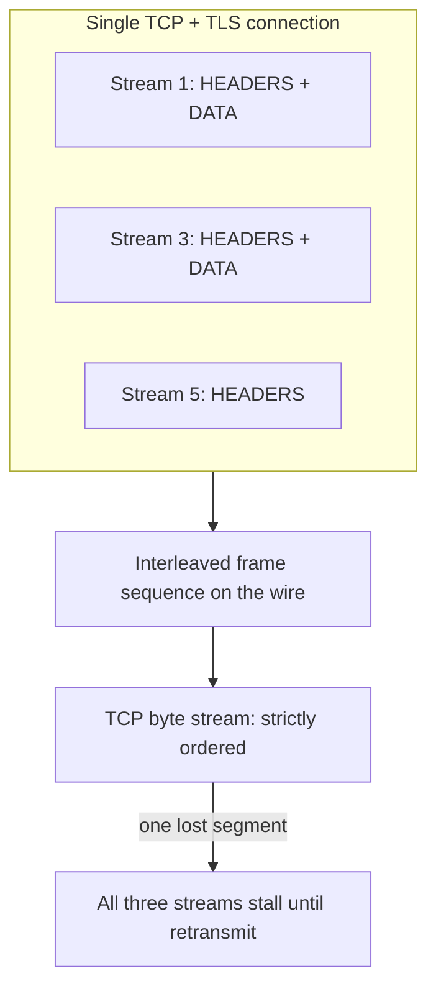
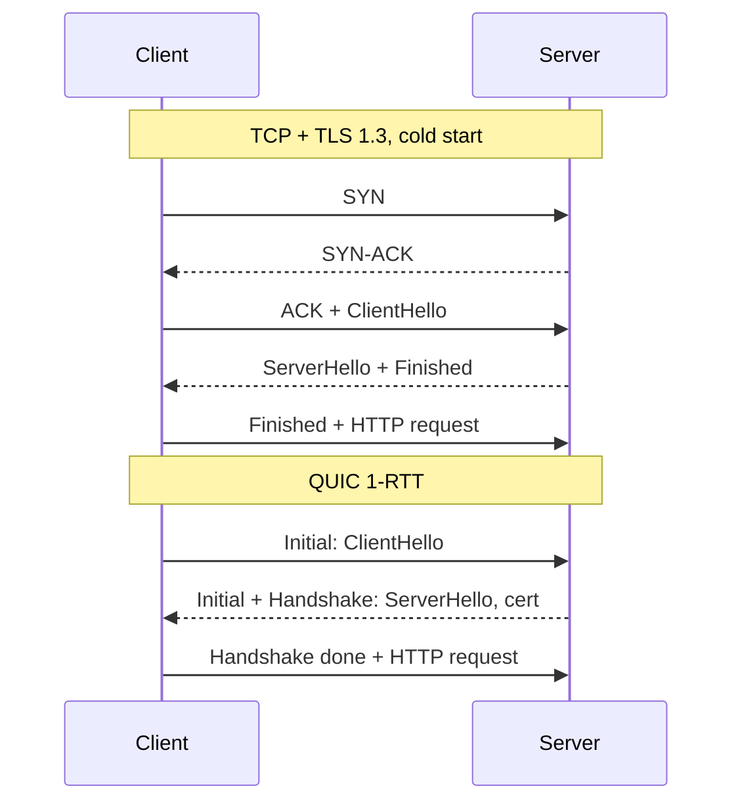

HTTP/2 uygulama katmanındaki head-of-line blocking'i çözdü ve problemi bir katman aşağı taşıdı; HTTP/3 problemi transport katmanında çözdü ve bunun bedelini CPU, middlebox düşmanlığı ve artık kendi işlettiğiniz bir congestion controller ile ödedi. İki yükseltme de bedava değildir ve getirdikleri hata modları %0 paket kaybı olan bir laboratuvarda görünmez — bu yüzden ilk olarak mobil ağlarda ve bölgeler arası trafikte ortaya çıkarlar.
 
**HOL blocking** (head-of-line blocking), sıralı bir kuyruğun başındaki gecikmiş öğenin, arkasındaki her öğeyi (bunlar bağımsız işlenebilir olsa bile) durdurması durumudur. Üç ayrı katmanda var olur ve her protokol sürümü farklı bir katmanı ele alır.
 
| Katman | Mekanizma | HTTP/1.1 | HTTP/2 | HTTP/3 |
|--------|-----------|----------|--------|--------|
| Uygulama (istek) | Bağlantı başına tek uçuştaki istek | Bloklu | Stream multiplexing ile çözüldü | Çözüldü |
| Transport (bayt akışı) | TCP sokete sıralı teslimi garanti eder | 6 paralel bağlantıyla kısmen maskelenir | **Bloklu**: tek kayıp segment tüm stream'leri durdurur | QUIC'in stream başına teslimiyle çözüldü |
| Sıkıştırma durumu | Header tablosu sırayla uygulanmalı | Yok (sıkıştırma yok) | HPACK sıralı işleme gerektirir | QPACK, açık blocked-stream limitiyle |
 
## HTTP/1.1 Gerçekte Neye Mal Olur
 
HTTP/1.1 bağlantı başına tam olarak bir bekleyen isteğe izin verir. Pipelining spesifikasyonda vardı ama fiilen ölüdür: ara katmanlar yanlış işledi ve yanıtların istek sırasına göre dönmesi zorunlu olduğundan HOL blocking zaten geri geldi. Tarayıcılar origin başına yaklaşık altı bağlantıyla, API istemcileri ise connection pool'larla telafi etti.
 
Maliyetler somuttur:
 
- **Handshake katlanması.** Altı bağlantı, soğuk başlangıçta altı TCP ve altı TLS handshake demektir. 80 ms RTT'de TCP artı TLS 1.3, istemciden ilk istek baytı çıkmadan önce 2 RTT eder.
- **Congestion window parçalanması.** Her bağlantı kendi `cwnd`'sini tutar ve bağımsız olarak slow start yapar. Kısa ömürlü on bağlantı slow start'tan hiç çıkmaz; toplam throughput, ısınmış tek bir bağlantının ulaşacağının çok altında kalır.
- **Header tekrarı.** Her istek `Authorization`, `User-Agent`, `Cookie` ve trace header'larının tamamını düz metin olarak tekrarlar. Stateless bir REST API'de (bkz. [REST: Kısıtlar, Kaynaklar ve HTTP Sözleşmeleri](/distributed-systems/tr/communication/synchronous-protocols/rest/)) küçük isteklerde header baytları rutin olarak gövde baytlarını aşar.
- **Domain sharding** standart geçici çözümdü: daha fazla paralel bağlantı için varlıkları `static1`, `static2` gibi alt alanlara dağıtmak. HTTP/2 altında bu aktif olarak zararlı hale gelir, çünkü tek bir multiplexed bağlantı olması gerekeni yeniden parçalar.
## HTTP/2: Binary Framing ve Stream'ler
 
HTTP/2, metin protokolünü binary bir framing katmanıyla değiştirir. Tek bir TCP bağlantısı çok sayıda **stream** taşır; her stream, 31 bitlik bir stream ID ile etiketlenmiş (istemci başlatanlar tek, sunucu başlatanlar çift) çift yönlü bir **frame** dizisidir. Operasyonel olarak önemli frame türleri: `HEADERS`, `DATA`, `SETTINGS`, `WINDOW_UPDATE`, `RST_STREAM`, `GOAWAY`, `PING`.
 

*HTTP/2 stream'leri TCP'nin üstünde iç içe geçirir; tek bir kayıp segment, baytları çoktan varmış stream'leri de bloklar.*
 
Protokol seçimi TLS handshake'i içinde **ALPN** (Application-Layer Protocol Negotiation) ile yapılır. Şifresiz HTTP/2 (`h2c`) ya önceden bilgi ya da Upgrade adımı gerektirir ve esasen yalnızca TLS'in sidecar tarafından sonlandırıldığı mesh içlerinde kullanılır.
 
### Flow Control İki Seviyelidir ve Sizi Sessizce Kısar
 
HTTP/2, hem bağlantı hem stream seviyesinde kredi tabanlı flow control uygular. Alıcı bir pencere ilan eder; gönderici, `WINDOW_UPDATE` pencereyi yenileyene kadar pencerenin izin verdiğinden fazla `DATA` okteti gönderemez. Varsayılan başlangıç penceresi stream başına ve bağlantı başına 65.535 bayttır.
 
Bu varsayılan, "HTTP/2, HTTP/1.1'den yavaş" şikayetlerinin en yaygın nedenidir. 100 ms RTT'de RTT başına 64 KB, mevcut bant genişliğinden bağımsız olarak tek bir stream'i yaklaşık 5 Mbps'e sabitler — klasik bir bandwidth-delay product sınırı. Bölgeler arası büyük indirmeler veya gRPC stream'leri, `SETTINGS_INITIAL_WINDOW_SIZE` ve bağlantı penceresinin BDP'ye (bant genişliği çarpı RTT) yükseltilmesini gerektirir; kıtalar arası yüksek throughput hatlarında bu çoğu zaman 8–16 MB'dır.
 
:::tip
Hedef pencereyi tahminle değil açıkça hesaplayın: 150 ms RTT'de 200 Mbps için BDP, 200e6 / 8 * 0,150 = 3,75 MB'dır. Hem stream hem bağlantı penceresini bunun üzerine ayarlayın ve karşı tarafın ilan ettiği `SETTINGS_MAX_CONCURRENT_STREAMS` değerinin, istemcinizin stream'leri göndermek yerine yerelde kuyruğa almasına yol açmayacak kadar yüksek olduğunu doğrulayın.
:::
 
### HPACK: Paylaşılan Değişebilir Durumla Sıkıştırma
 
**HPACK**, header'ları 61 yaygın girdilik bir statik tablo, daha önce görülmüş ad-değer çiftlerinden oluşan bağlantı başına dinamik bir tablo ve literaller için Huffman kodlaması kullanarak sıkıştırır. Tekrar eden bir `authorization: Bearer ...` ilk istekten sonra tek baytlık bir indeks referansına iner.
 
Sonucu durum bağımlı sıralamadır: dinamik tablo her `HEADERS` frame'i tarafından değiştirilir ve gönderim sırasında uygulanmalıdır; HPACK'in kendisinin bir HOL blocking kaynağı olmasının nedeni budur. Aynı zamanda bir saldırı yüzeyidir. Sır taşıyan header'ları dinamik tabloda saklanmamaları için never-indexed olarak işaretleyin ve `SETTINGS_HEADER_TABLE_SIZE`'ı sınırlayın — sınırsız tablo artı düşmanca header kümeleri bir bellek tüketme vektörüdür.
 
### Stream Eşzamanlılığı, İptal ve Rapid Reset
 
`SETTINGS_MAX_CONCURRENT_STREAMS` uçuştaki stream sayısını sınırlar. Sunucular yaygın olarak 100–250 varsayar; çok düşük olması istemcileri serileştirir, çok yüksek olması tek bir bağlantıyı sınırsız bir iş kuyruğuna çevirir.
 
`RST_STREAM`, bağlantıyı yıkmadan tek bir stream'i iptal eder. **CVE-2023-44487 (HTTP/2 Rapid Reset)** bunu mümkün kılan şeydi: istemci bir stream açar ve hemen reset eder; kendi muhasebesinde eşzamanlılık yuvası boşalırken sunucu backend işini çoktan başlatmıştır. Origin'deki saniyedeki istek sayısı eşzamanlılık limitinden bağımsızlaşır ve tek bir bağlantı yüz binlerce RPS sürebilir. Azaltma yöntemi reset'leri saymaktır — bağlantı başına reset/istek oranını izleyip eşik aşıldığında `ENHANCE_YOUR_CALM` ile `GOAWAY` göndermek — ve istek kabulünü stream muhasebesinden bağımsız uygulamaktır (bkz. [Yük Atma](/distributed-systems/tr/resilience/flow-control/load-shedding/)).
 
`GOAWAY`, zarif kapanış primitifidir: sunucunun işleyeceği son stream ID'sini taşır, böylece uçuştaki stream'ler tamamlanırken yeniler reddedilir. `GOAWAY` göndermeden TCP bağlantısını kapatan bir sunucu, her deploy'da istemci tarafında sahte hatalar üretir. İki aşamalı `GOAWAY` — önce uyarı olarak 2^31-1 stream ID'li bir tane, drain aralığından sonra nihai olan — istemcinin uçuştaki stream'inin son-stream-ID anlık görüntüsünden sonra varması yarışını ortadan kaldırır.
 
:::caution
HTTP/2'nin tek bağlantı modeli L4 yük dengelemeyle kötü etkileşir. Bağlantı ömrü boyunca tek bir backend'e sabitlenir; uzun ömürlü istemci bağlantıları hiçbir L4 hash'inin düzeltemeyeceği kalıcı yük dengesizliği üretir ve yeni ölçeklenen backend, istemciler yeniden bağlanana kadar sıfır trafik alır. Çözümler: HTTP/2'yi stream başına dengeleme yapan bir L7 proxy'de sonlandırmak, istemcilerin periyodik olarak yeniden çözümleme yapması için jitter'lı `max_connection_age` ayarlamak veya birden fazla subchannel üzerinde istemci taraflı dengeleme kullanmak. Bkz. [L4 ve L7 Yük Dengeleme](/distributed-systems/tr/communication/load-balancing/l4-vs-l7/).
:::
 
Server Push (`PUSH_PROMISE`) ölü bir özelliktir; tarayıcılar desteği kaldırdı, çünkü push ya zaten cache'lenmiş kaynakları tekrarlıyor ya da çok geç varıyordu. Yerine `Link: rel=preload` içeren `103 Early Hints` kullanın: neye ihtiyacı olduğuna istemci karar verir, dolayısıyla hiçbir şey boşa gitmez.
 
## HTTP/3 ve QUIC: Transport'u Userspace'e Taşımak
 
**QUIC**, UDP üzerinde çalışan, şifreli ve multiplexed güvenilir stream'ler sağlayan bir transport protokolüdür. HTTP/3 ise HTTP semantiğinin QUIC üzerine eşlenmesidir. Temel değişiklik: stream'ler transport seviyesinde bir kavramdır, dolayısıyla bir stream'deki kayıp başka bir stream'in teslimini geciktirmez. QUIC paketleri herhangi bir stream'e ait frame'ler taşır; kayıp bir paket yalnızca baytlarını içerdiği stream'leri durdurur.
 
TLS 1.3 katmanlanmak yerine entegre edilmiştir: kripto handshake'i QUIC frame'lerinin içinde çalışır, bu da 1-RTT bağlantı kurulumu (TCP+TLS 1.3'te 2 RTT) ve resumption'da 0-RTT sağlar.
 

*QUIC, transport ve kriptografik handshake'i tek adımda birleştirerek soğuk başlangıç gecikmesinden tam bir gidiş dönüş siler.*
 
### 0-RTT ve Replay Problemi
 
Önbelleklenmiş bir session ticket ile istemci, uygulama verisini ilk paket grubunda gönderebilir. Veri, tazelik garantisi olmayan resumption secret'ından türetilmiş bir anahtarla şifrelenir: yol üzerindeki bir saldırgan 0-RTT paketlerini yakalayıp tekrar oynatabilir ve sunucu bunu orijinalinden ayırt edemez.
 
0-RTT'de yalnızca idempotent istekler taşınabilir. İki kez oynatılan bir `POST /payments` mükerrer tahsilattır. Bunu edge'de zorlayın: early data içinde güvenli olmayan metotları reddedin veya idempotency key zorunlu kılın (bkz. [Idempotency ve Güvenli HTTP Metotları](/distributed-systems/tr/communication/api-gateway/idempotency/)). Sunucular ayrıca bir anti-replay penceresi tutmalıdır, ancak dağıtık bir edge filosu bunu POP'lar arasında kusursuz yapamaz.
 
### Connection Migration ve Connection ID'ler
 
Bir TCP bağlantısı dört bileşenli demetle tanımlanır; bu yüzden NAT rebinding veya Wi-Fi'dan hücresele geçiş onu öldürür. QUIC bağlantıları paket başlığındaki opak bir **Connection ID** ile tanımlar, dolayısıyla bağlantı adres değişikliğinden sağ çıkar: istemci göç eder, yeni yolu doğrular ve yeni bir handshake olmadan devam eder. Mobil istemciler için bu, her ağ geçişinde yaşanan yeniden bağlanma ve retry fırtınasını ortadan kaldırır.
 
Operasyonel sonuç şudur: load balancer'lar dört bileşenli demete değil Connection ID'ye göre yönlendirmelidir. QUIC farkındalıklı dengeleyiciler, sunucu tanımlayıcısını kodlayan yönlendirilebilir connection ID'ler kullanır; bu olmadan göç eden bağlantı, kripto durumuna sahip olmayan bir sunucuya düşer ve tek yapabileceği bağlantıyı reset etmektir.
 
### QPACK: Sıralı Teslim Olmadan Sıkıştırma
 
HPACK, QUIC üzerinde çalışamaz; stream'ler sırasız varabildiğinden dinamik tablo tutarsız uygulanırdı. **QPACK**, durumu adanmış tek yönlü encoder ve decoder stream'lerine ayırır ve encoder'ın dinamik tabloyu ne kadar agresif referanslayacağına karar vermesine izin verir.
 
Henüz alınmamış bir tablo girdisine yapılan referans, istek stream'ini encoder stream'i yetişene kadar **blocked** hale getirir — sıkıştırma katmanında, kasıtlı olarak ve açık bir bütçe altında HOL blocking'i geri getirir. `SETTINGS_QPACK_BLOCKED_STREAMS` kaç stream'in bloklanabileceğini sınırlar. Sıfıra ayarlamak riskli referansları tamamen devre dışı bırakır: daha kötü sıkıştırma, sıfır sıkıştırma kaynaklı bloklanma. Header tekrarı düşük olan gecikmeye duyarlı API'ler için çoğu zaman doğru tercih budur.
 
### Kimsenin Bütçelemediği CPU Maliyeti
 
TCP, onlarca yıllık offload desteğiyle kernel'de çalışır. QUIC userspace'te çalışır ve her paket syscall sınırını geçer ve tek tek şifrelenir. İlk deployment'lar eşdeğer throughput için TLS-over-TCP'nin kabaca 2 katı CPU ölçtü; `UDP_SEGMENT` (GSO) ve `GRO`, toplu `sendmmsg`/`recvmmsg` ve kernel veya NIC offload'ıyla fark kapanır ama yok olmaz.
 
Pratik operasyonel maddeler:
 
- UDP soket tamponlarını yükseltin. Linux'ta varsayılan `net.core.rmem_max` yüksek throughput'lu QUIC için fazlasıyla küçüktür ve alıcı tampon düşmeleri olarak görünür; congestion controller bunu ağ kaybı sanır ve gönderim hızını düşürerek yanıt verir.
- Yalnızca uygulama metriklerini değil `netstat -su` alıcı hatalarını da izleyin. Artık congestion sinyaliniz QUIC kaybıdır.
- Congestion control sizin kodunuzun sorumluluğudur. Kötü ayarlanmış veya standart dışı bir controller içeren bir kütüphaneyi deploy etmek, kernel düzeyinde hiçbir inceleme görmemiş bir transport değişikliğini üretime göndermek demektir.
```shell
# UDP receive buffer sizing for a QUIC edge node. Defaults cause
# silent receive-side drops that look like network loss to QUIC.
sysctl -w net.core.rmem_max=16777216
sysctl -w net.core.wmem_max=16777216
 
# Receive errors here indicate buffer drops, not path loss.
netstat -su | grep -i "receive buffer errors"
 
# Confirm the negotiated protocol end to end.
curl -sS --http3 -o /dev/null -w '%{http_version} %{time_connect}\n' https://api.example.com/health
```
 
### Keşif, Middlebox'lar ve Geri Düşüş
 
İstemci HTTP/3 ile başlamaz. Onu ya HTTP/2 üzerinden gelen bir `Alt-Svc: h3=":443"; ma=86400` yanıt header'ından ya da `alpn=h3` taşıyan bir DNS `HTTPS` (SVCB) kaydından öğrenir; ikincisi ilk bağlantı cezasını ortadan kaldırır. UDP/443 bazı kurumsal ve operatör ağlarında bloklandığı veya agresif biçimde kısıldığı için istemciler QUIC ile TCP'yi yarıştırır ("happy eyeballs") ve geri düşer. Her deployment bir HTTP/2 yolunu hizmette tutmak zorundadır.
 
QUIC ayrıca header alanlarının çoğu dahil paketin neredeyse tamamını şifreler; bu middlebox incelemesini boşa çıkarır — QUIC'in evrimleşmesini mümkün kılan kasıtlı anti-ossification tasarımı ve aynı zamanda bazı ağ operatörlerinin onu düşürmesinin nedeni.
 
## Pratikte Yapılandırma
 
```go
package main
 
import (
	"crypto/tls"
	"log/slog"
	"net/http"
	"time"
 
	"github.com/quic-go/quic-go"
	"github.com/quic-go/quic-go/http3"
	"golang.org/x/net/http2"
)
 
func main() {
	mux := http.NewServeMux()
	mux.HandleFunc("GET /health", func(w http.ResponseWriter, r *http.Request) {
		w.WriteHeader(http.StatusOK)
	})
 
	h2 := &http2.Server{
		// Bound in-flight work per connection. Too low serializes clients,
		// too high turns one connection into an unbounded work queue.
		MaxConcurrentStreams: 250,
		// Raise above the 64 KB default or a single stream is capped by
		// the bandwidth-delay product on any high-RTT path.
		MaxUploadBufferPerStream:     8 << 20,
		MaxUploadBufferPerConnection: 32 << 20,
		// Detect dead peers behind a NAT that silently dropped state.
		IdleTimeout:      120 * time.Second,
		ReadIdleTimeout:  30 * time.Second,
		PingTimeout:      15 * time.Second,
		MaxReadFrameSize: 1 << 20,
	}
 
	tcpSrv := &http.Server{
		Addr:              ":443",
		Handler:           mux,
		ReadHeaderTimeout: 5 * time.Second,  // slowloris bound
		WriteTimeout:      30 * time.Second, // must exceed the slowest legitimate response
		TLSConfig: &tls.Config{
			MinVersion: tls.VersionTLS13,
			NextProtos: []string{"h2", "http/1.1"}, // ALPN order is preference order
		},
	}
	if err := http2.ConfigureServer(tcpSrv, h2); err != nil {
		slog.Error("h2 configure failed", "err", err)
		return
	}
 
	h3 := &http3.Server{
		Addr:    ":443",
		Handler: mux,
		TLSConfig: &tls.Config{
			MinVersion: tls.VersionTLS13,
			NextProtos: []string{"h3"},
		},
		QUICConfig: &quic.Config{
			MaxIncomingStreams:             250,
			InitialStreamReceiveWindow:     4 << 20,
			InitialConnectionReceiveWindow: 16 << 20,
			MaxIdleTimeout:                 30 * time.Second,
			KeepAlivePeriod:                15 * time.Second,
			// Only enable after non-idempotent methods are rejected in
			// early data; 0-RTT payloads are replayable by design.
			Allow0RTT: false,
		},
	}
 
	// Advertise h3 on the TCP responses, otherwise clients never discover it.
	advertised := withAltSvc(mux, `h3=":443"; ma=86400`)
	tcpSrv.Handler = advertised
	h3.Handler = advertised
 
	go func() {
		if err := h3.ListenAndServe(); err != nil {
			// UDP/443 may be blocked; TCP must keep serving regardless.
			slog.Error("h3 listener stopped", "err", err)
		}
	}()
 
	if err := tcpSrv.ListenAndServeTLS("cert.pem", "key.pem"); err != nil &&
		err != http.ErrServerClosed {
		slog.Error("h2 listener stopped", "err", err)
	}
}
 
func withAltSvc(next http.Handler, value string) http.Handler {
	return http.HandlerFunc(func(w http.ResponseWriter, r *http.Request) {
		if r.ProtoMajor < 3 {
			w.Header().Set("Alt-Svc", value)
		}
		next.ServeHTTP(w, r)
	})
}
```
 
## Hata Modları ve Operasyonel Tuzaklar
 
**Varsayılan flow-control pencerelerinden kaynaklanan throughput çöküşü.** Belirti: yüksek RTT'li hatlarda HTTP/2 veya gRPC stream'leri birkaç Mbps'te tavan yaparken altı bağlantılı HTTP/1.1 daha hızlıdır. Tespit: paket kaybı olmadan throughput'un RTT ile ters orantılı olması. Düzeltme, pencereleri her iki tarafta da BDP'ye göre boyutlandırmaktır; tek tarafta büyük pencere hiçbir işe yaramaz.
 
**Uzun ömürlü bağlantılardan kaynaklanan yük dengesizliği.** Belirti: yeni ölçeklenen pod'lar sıfıra yakın CPU'da beklerken eskiler doyuma ulaşır. Tespit: scale-out sonrası backend başına istek oranı varyansı. Düzeltme: jitter'lı `max_connection_age` ve `GOAWAY` tabanlı yeniden dengeleme.
 
**Rapid Reset ve stream muhasebesinin atlatılması.** Belirti: mütevazı bağlantı sayısı ve normal görünen eşzamanlılık metrikleriyle origin CPU doyumu. Tespit: bağlantı başına `RST_STREAM` oranı ve gönderilen istek sayısı ile eşzamanlı stream sayısının birbirinden ayrışması.
 
**Sessiz 0-RTT replay.** Belirti: uygulama katmanının istek log'unda mükerrer kayıt olmadan mükerrer yan etkiler; çünkü replay meşru biçimde kimlik doğrulanmış bir istektir. `Allow0RTT` bu yüzden varsayılan olarak kapalı olmalı ve yalnızca güvenli metotlar için açılmalıdır.
 
**QUIC'in ağ kaybı sanılması.** Belirti: sağlıklı bir yolda yüksek yeniden iletim ve düşük throughput. Tespit: NIC'te düşme yokken kernel UDP alıcı tampon hatalarının artması. Düzeltme, congestion control ayarı değil, soket tamponu boyutlandırması ve GSO/GRO etkinleştirmesidir.
 
**Üç protokol katmanı arasında timeout istiflenmesi.** QUIC idle timeout, HTTP/3 istek timeout'u, uygulama handler deadline'ı ve istemci sabrı en içteki en kısa, en dıştaki en uzun olacak şekilde sıralanmalıdır. Keepalive aralığından kısa bir idle timeout sağlıklı bağlantıları sürekli yıkar; ortaya çıkan yeniden bağlanma çalkantısı upstream arızası gibi görünür. Bkz. [Zaman Aşımları](/distributed-systems/tr/resilience/protection-patterns/timeouts/).
 
**Connection coalescing sürprizleri.** HTTP/2 istemcileri, sertifika kapsıyorsa ve IP eşleşiyorsa farklı bir hostname için aynı bağlantıyı yeniden kullanır. Tek bir wildcard sertifikanın arkasındaki iki "bağımsız" servis aynı bağlantıyı, aynı flow-control penceresini ve aynı `GOAWAY`'i paylaşır; birinin kapanışı diğerini bozar.
 
## Hangisi Ne Zaman Tercih Edilir
 
| Boyut | HTTP/1.1 | HTTP/2 | HTTP/3 |
|-------|----------|--------|--------|
| Transport HOL blocking | Paralel bağlantılarla maskelenir | Mevcut, kayıpla kötüleşir | Ortadan kalkar |
| İlk bayta kadar soğuk başlangıç RTT'si | 2 (TCP + TLS 1.3) | 2 | 1, resumption'da 0 |
| Bayt başına CPU | En düşük | Düşük | En yüksek, offload ile iyileşiyor |
| Ağ değişimine dayanıklılık | IP değişiminde yeniden bağlanır | IP değişiminde yeniden bağlanır | Connection migration |
| Debug edilebilirlik | Doğrudan okunabilir | Araç gerektirir | Keylog artı araç gerektirir |
| Middlebox uyumu | Evrensel | TLS üzerinde evrensel | Bazı ağlarda UDP bloklu |
 
Düşük hacimli iç endpoint'ler, health check'ler ve operatör okunabilirliğinin verimlilikten önemli olduğu her yerde HTTP/1.1 kullanın. Veri merkezi içi servisler arası trafikte varsayılan olarak HTTP/2 kullanın; orada kayıp sıfıra yakındır, dolayısıyla transport HOL blocking pratik bir sorun değildir ve gRPC zaten ona bağımlıdır (bkz. [gRPC ve Protocol Buffers](/distributed-systems/tr/communication/synchronous-protocols/grpc-protocol-buffers/)). İnternete bakan edge için HTTP/3 kullanın: mobil istemciler, kayıplı veya yüksek RTT'li yollar ve çok sayıda küçük paralel nesne içeren trafik desenleri. Aynı veri merkezindeki iki rack arasında HTTP/3 deploy etmek hiçbir kazanç sağlamaz ve CPU'ya mal olur, çünkü onu haklı çıkaracak kayıp oranı orada mevcut değildir.