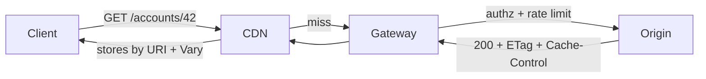
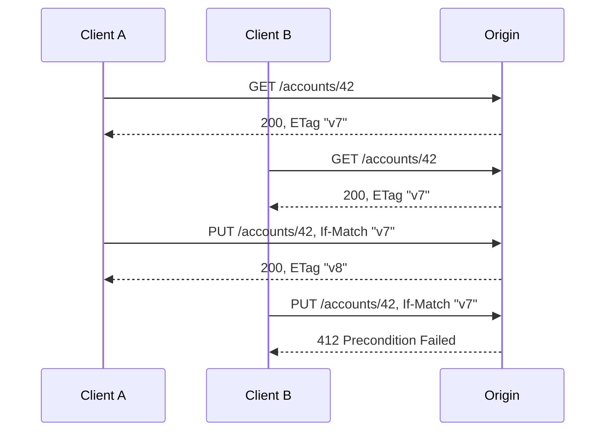

REST, altı kısıtla tanımlanan bir mimari stildir ve bu kısıtların her biri bir takastır: sunucuda bir yetenekten vazgeçip karşılığında ağda bir özellik satın alırsınız. Stateless olmak size istek başına bağlamı yeniden kurma maliyeti yükler, karşılığında yatay ölçeklenebilirlik ve bedava failover verir. Uniform interface protokol düzeyinde verimlilikten feragat ettirir, karşılığında trafiğinizi domain'inizi bilmeden anlayabilen ara katmanları (cache'ler, proxy'ler, gateway'ler) mümkün kılar. Kendini RESTful olarak adlandıran sistemlerin çoğu URI estetiğini benimseyip kısıtları bir kenara atar; bu yüzden faydaların hiçbirini, ayrıntı yükünün tamamını devralırlar.
 
**REST** (Representational State Transfer), Roy Fielding tarafından HTTP'nin kendisinin nasıl çalışması gerektiğinin tarifi olarak tanımlandı. Bu köken mekanik açıdan önemlidir: aşağıdaki garantiler HTTP'nin üzerine sonradan eklenmiş konvansiyonlar değil, yol üzerindeki her CDN'in, reverse proxy'nin ve tarayıcı cache'inin zaten uyguladığı özelliklerdir. Kısıtları ihlal ettiğinizde yalnızca bir stil kılavuzunu çiğnemiş olmazsınız; sizin yerinize iş yapan altyapıyı sessizce devre dışı bırakırsınız.
 
## Altı Kısıt, Mühendislik Dengeleri Olarak
 
### Client-Server ve Layered System
 
Client-server, kullanıcı arayüzü kaygısını veri depolamadan ayırarak iki tarafın bağımsız evrimleşmesine izin verir. **Layered system**, operasyonel kaldıraç açısından en güçlü kısıttır: istemci, origin sunucuyla mı yoksa bir ara katmanla mı konuştuğunu ayırt edemez. Bu ayırt edilemezlik, istemci kodu değişmeden bir CDN edge'inin, caching reverse proxy'nin, TLS sonlandıran load balancer'ın veya API gateway'in araya sokulmasını meşru kılan şeydir.
 
Bedeli, her katmanın gecikme eklemesi ve her katmanın yalnızca HTTP zarfında görünen bilgiyle hareket edebilmesidir. Bir ara katman, tazeliği JSON gövdesine gömülü bir alana bağlı olan yanıtı cache'leyemez. Üretimdeki REST API'lerinin cache isabet oranının sıfır olmasının en yaygın nedeni tam olarak budur: doğruluk bilgisi header'lar yerine payload'da yaşar.
 

*Her katman yalnızca HTTP zarfına bakar; gövdeye kodlanmış bir tazelik kuralı üç ara katmanın da gözünden kaçar.*
 
### Statelessness: Maliyetin Tel Üzerine Taşınması
 
Her istek, anlaşılması için gereken tüm bilgiyi taşımak zorundadır. Sunucu tarafında session affinity yok, "ikinci çağrı, birincisinin bu makinede gerçekleştiğini varsayar" yok.
 
- **Fayda:** herhangi bir replika herhangi bir isteği karşılayabilir. Instance ölümünün kullanıcıya yansıyan bir state maliyeti yoktur. Autoscaling ve rolling update sıradanlaşır; bir node'u drain etmek hiçbir şey kaybettirmez (bkz. [Sağlık Durumuna Duyarlı Yönlendirme ve Bağlantı Boşaltma](/distributed-systems/tr/communication/load-balancing/health-aware-routing/)).
- **Maliyet:** kimlik doğrulama materyali, sayfalama cursor'ları ve tenant bağlamı istek başına yeniden iletilir ve yeniden doğrulanır. 40 claim içeren bir JWT ile trace context birleşince istek header'ları 4 KB'ı aşabilir; bu, sunucuda bir `max_header_size` limiti varken veya HTTP/2 altında HPACK dinamik tablo baskısı multiplexing verimini düşürürken doğrudan sorun üretir.
- **Anti-desen:** "REST çalışsın diye" konulan sticky session'lar. Session affinity, stateless bir katmanı gerçek bir state deposunun dayanıklılık garantilerinden yoksun biçimde stateful hale getirir. Yeniden dengeleme anında kullanıcılar sepetlerini ve yarım kalmış akışlarını kaybeder.
Sunucu tarafı state yok olmaz; istemcinin taşıdığı bir tanımlayıcıyla adreslenen açık bir depoya (Redis, veritabanı) taşınır. Bu meşru bir tasarımdır ve affinity'den esasen farklıdır: state kalıcı, replike edilmiş ve gözlemlenebilirdir.
 
### Cacheability
 
Yanıtlar cache'lenebilir veya cache'lenemez olarak açıkça etiketlenmelidir. HTTP birbirinden bağımsız iki mekanizma tanımlar ve bunların karıştırılması bayat veri kaynaklı olayların klasik nedenidir:
 
1. **Tazelik (freshness)** — `Cache-Control: max-age`, `s-maxage`, `Expires`. Cache, origin'e hiç dokunmadan sakladığı kopyayı sunabilir. Bu, gidiş dönüşü tamamen ortadan kaldırır.
2. **Doğrulama (validation)** — `If-None-Match` / `If-Modified-Since` ile birlikte `ETag` / `Last-Modified`. Cache yine bir gidiş dönüş yapar, ancak `304 Not Modified` gövde transferini ve origin'deki serileştirme işini ortadan kaldırır.
Tazelik gecikmeyi, doğrulama bant genişliğini ve origin CPU'sunu kurtarır. P99'u ağ RTT'sinin belirlediği okuma ağırlıklı bir endpoint tazeliğe ihtiyaç duyar. Saatte bir değişen 2 MB'lık bir katalog döndüren endpoint doğrulamaya ihtiyaç duyar.
 
:::caution
`Cache-Control: private` ile `Vary: Authorization` birbirinin yerine geçmez. `private`, paylaşımlı cache'lerin yanıtı hiç saklamasını yasaklar. `Vary: Authorization` ise saklamaya izin verir ama girdiyi kimlik bilgisine göre anahtarlar; milyonlarca farklı token'ın olduğu bir CDN'de bu, sınırsız bir anahtar uzayı ve kalıcı %0 isabet oranı üretirken depolamayı da tüketir. Kullanıcıya özel veri için `private` kullanın; `Vary`'yi `Accept-Encoding` gibi gerçek temsil farklılıkları için saklayın.
:::
 
### Uniform Interface
 
Uniform interface dört alt kısıttan oluşur: kaynakların tanımlanması (URI'ler), temsiller üzerinden manipülasyon, kendi kendini tanımlayan mesajlar ve uygulama durumunun motoru olarak hypermedia (**HATEOAS**).
 
İlk üçü ara katmanları mümkün kılan şeydir. Kendi kendini tanımlama, bir proxy'nin yalnızca metot ve header'lara bakarak isteğin retry edilmesinin güvenli olup olmadığını, yanıtın cache'lenebilirliğini ve gövdenin nasıl ayrıştırılacağını belirleyebilmesi demektir. `POST /getUser`'ın, `GET /users/42`'nin bozuk olmadığı bir biçimde bozuk olmasının nedeni budur: proxy o POST'u güvensiz ve cache'lenemez saymak zorundadır, dolayısıyla her okuma origin'e gider.
 
HATEOAS ise pratikte neredeyse hiç kimsenin uygulamadığı kısıttır ve bu konuda dürüst olmak yapıyormuş gibi davranmaktan iyidir. Amacı istemcileri URI yapısından ayrıştırmaktır: istemci tek bir giriş noktası bilir, geçişleri yanıtlardaki link ilişkilerinden keşfeder. İstemciler çok sayıda, bağımsız deploy edilen ve aynı anda güncellenemeyen türdense (public API'ler, uzun ömürlü gömülü cihazlar) karşılığını verir. API ile birlikte deploy edilen, zaten bir [OpenAPI](/distributed-systems/tr/communication/api-gateway/openapi-swagger/) dokümanından üretilmiş ve şemaya sıkı sıkıya bağlı birinci taraf bir SPA için karşılığını vermez. İstemciler URI şablonlarını hard-code etmeye devam ederken her payload'a `_links` eklemek saf ek yüktür.
 
### Code-on-Demand
 
Tek opsiyonel kısıt: sunucu, istemciyi genişleten çalıştırılabilir kod (tarihsel olarak JavaScript) gönderebilir. Servisler arası API'lerde nadiren anlamlıdır; güvenlik yüzeyi ortadadır.
 
## Kaynak Modelleme: Kimlik ve Temsil Ayrımı
 
**Kaynak (resource)**, bir varlık kümesine yapılan kavramsal bir eşlemedir; bir satır, bir sınıf veya bir DTO değildir. **Temsil (representation)** ise o kaynağın belirli bir andaki durumunun serileştirilmiş halidir. `/accounts/42` hesabı sonsuza dek tanımlar; `application/json` ve `application/vnd.company.account.v2+json` onun iki temsilidir.
 
Bunun sonucu şudur: kaynak kimliği şema değişiklikleri, depolama migration'ları ve refactor'lar boyunca sabit kalmalıdır. İçinde veritabanı shard tanımlayıcısı veya dahili bir tip ayırıcısı barındıran URI, ilk resharding'de kırılır (bkz. [Dinamik Yeniden Dengeleme](/distributed-systems/tr/data-management/data-partitioning/dynamic-rebalancing/)).
 
### Üretimle Temas Ettiğinde Ayakta Kalan URI Tasarımı
 
- Kimlik için isim, eylem için HTTP metodu. `POST /doTransfer?account=42` yerine `POST /accounts/42/transfers`. İlki yaratılan şeyi adreslenebilir kılar: yanıt `Location: /transfers/8f3a` başlığıyla `201 Created` döner ve istemci daha sonra `GET` ile durumunu sorgulayabilir.
- Koleksiyonlar çoğul, üyeler tekil: `/accounts`, `/accounts/42`.
- Alt kaynaklar yalnızca gerçek bir içerme ilişkisi varsa. Bir işlemin hesap dışında anlamı yoksa `/accounts/42/transactions` doğrudur. Aynı varlığa iki ebeveynden ulaşılabiliyorsa onu üst düzey bir kaynağa terfi ettirip query filtreleri kullanın; aksi halde tek varlık için iki cache anahtarına sahip olur ve ikisini de invalidate etmek zorunda kalırsınız.
- CRUD olmayan operasyonlar gerçekten vardır. "İptal" gibi bir durum geçişi, geçişin kendisinin kalıcılaştırmaya değer öznitelikleri varsa (sebep, aktör, zaman damgası) alt kaynak yaratımı (`POST /orders/91/cancellations`), yoksa bir durum alanı üzerinde `PATCH` olarak modellenir. Her şeyi aggregate üzerinde `PUT`'a tıkıştırmak read-modify-write döngülerini zorunlu kılar ve lost update penceresini genişletir.
- Yanıt formatını asla path'e kodlamayın. `/accounts/42.json` cache'i parçalar ve kimliği ikizler; `Accept` kullanın.
### Content Negotiation ve Temsil Farklılığı
 
`Accept`, `Accept-Encoding` ve `Accept-Language` temsiller arasında seçim yapar; origin, seçimi etkileyen istek header'larını tam olarak listeleyen bir `Vary` döndürmelidir. Paylaşımlı cache arkasında `Vary: Accept-Encoding` unutmak klasik bir olaydır: gzip kodlanmış gövde, gzip desteği bildirmemiş bir istemciye sunulur ve uygulama katmanında binary bozulma gibi görünen bir hata üretir.
 
### Koleksiyonlar, Sayfalama ve Kararsız Offset
 
Offset sayfalama (`?offset=1000&limit=50`) üretimde iki şekilde başarısız olur. Birincisi maliyet: motorların çoğu atlanan satırları taramak ve atmak zorundadır, dolayısıyla P99 sayfa derinliğiyle doğrusal bozulur. İkincisi doğruluk: eşzamanlı ekleme ve silmeler pencereyi kaydırır, istemciler tam bir gezinti sırasında sessizce kayıt atlar veya tekrarlar.
 
Keyset (cursor) sayfalama — `WHERE (created_at, id) < (:ts, :id) ORDER BY created_at DESC, id DESC LIMIT 50` — indeks üzerinden sayfa başına O(log n)'dir ve eşzamanlı yazmalar altında kararlıdır; bedeli rastgele sayfa erişiminin kaybıdır. Cursor'ı opak bir token olarak kodlayın ki tuple düzeni sunucu tarafı bir uygulama detayı olarak kalsın; ham sıralama anahtarını dışa vurursanız asla değiştiremeyeceğiniz, versiyonsuz bir sözleşme yayımlamış olursunuz.
 
## HTTP Sözleşmesi
 
### Güvenlik, Idempotency ve Retry Semantiği
 
Metot tablosu, bir ara katmanın, istemci kütüphanesinin veya service mesh'in timeout sonrası isteği yeniden deneyip deneyemeyeceğini belirleyen, makine tarafından okunabilir bir sözleşmedir.
 
| Metot | Safe | Idempotent | Cacheable | Timeout sonrası retry? |
|-------|------|-----------|-----------|------------------------|
| `GET` | Evet | Evet | Evet | Her zaman |
| `HEAD` | Evet | Evet | Evet | Her zaman |
| `PUT` | Hayır | Evet | Hayır | Gövde tam yer değiştirme ise evet |
| `DELETE` | Hayır | Evet | Hayır | Evet; ikinci denemede `404`/`204` bekleyin |
| `POST` | Hayır | Hayır | Yalnızca açık tazelikle | Yalnızca idempotency key ile |
| `PATCH` | Hayır | Doğası gereği değil | Hayır | Yalnızca patch idempotent tanımlandıysa |
 
**Safe**, amaçlanan bir durum değişikliği olmaması demektir; bir crawler'ın veya prefetch yapan proxy'nin isteği kendiliğinden göndermesini meşru kılan şey budur. **Idempotent**, N özdeş isteğin sunucu durumunu tek istekle aynı bırakması demektir; yanıtın aynı olacağını söylemez. İkinci `DELETE`'in `404` dönmesinin idempotency'yi bozmamasının nedeni budur.
 
`PATCH` yalnızca mutlak operasyonlar için idempotenttir. `{"op":"replace","path":"/status","value":"closed"}` (RFC 6902 JSON Patch) idempotenttir; `{"op":"add","path":"/tags/-","value":"vip"}` ekleme yapar ve değildir. JSON Merge Patch (RFC 7386) yapısı gereği idempotenttir ancak dizi elemanı düzenlemesini ifade edemez ve "null'a ayarla" ile "dokunma" ayrımını kendi null-siler kuralının ötesinde yapamaz. Bilinçli seçin ve belgeleyin: retry yapan bir istemci ile idempotent olmayan bir patch, yalnızca paket kaybı altında yüzeye çıkan bir çift-ekleme hatasıdır.
 
`POST` için retry güvenliği, operasyon sonucuyla birlikte kalıcılaştırılan, istemci tarafından üretilmiş bir **idempotency key** gerektirir; mekanizmanın tamamı, anahtar ömrü ve eşzamanlı istek yönetimi [Idempotency ve Güvenli HTTP Metotları](/distributed-systems/tr/communication/api-gateway/idempotency/) sayfasında ele alınır.
 
### Conditional Request'ler: Tek Primitiften Caching ve Optimistic Concurrency
 
Aynı `ETag` iki işe yarar. Okumada `If-None-Match` ile `304`'ü mümkün kılar. Yazmada `If-Match` ile HTTP üzerinde compare-and-swap uygular: sunucu verilen validator'ı mevcut olanla karşılaştırır ve uyuşmazlıkta `412 Precondition Failed` döner. Bu, kilit olmadan, lease olmadan ve çakışma anına kadar hiçbir koordinasyon maliyeti olmadan çalışan optimistic concurrency control'dür.
 

*If-Match, lost update yarışını istemcinin yeniden okuyup yeniden uygulayarak çözebileceği açık bir 412'ye dönüştürür.*
 
`If-Match` olmadan ikinci `PUT` kazanır ve Client A'nın yazması sistemin hiçbir yerinde hata üretmeden yok olur: klasik lost update. Kaynak değiştirilebilir ve paylaşımlıysa, koşulsuz `PUT` kabul eden bir yazma endpoint'i veri kaybı vektörüdür; istemcileri açıkça dahil olmaya zorlamak için `428 Precondition Required` dönün.
 
:::danger
`ETag`'i monoton artan bir versiyon sayacından veya depolama motorunun revizyon numarasından türetin, asla serileştirilmiş yanıt baytlarının hash'inden değil. Bayt hash'leri JSON encoder map anahtarlarını yeniden sıraladığında, bir deploy yeni alan eklediğinde veya bir kayan noktalı değer kütüphane sürümleri arasında farklı render edildiğinde değişir; sonuç rolling update sırasında sahte `412` fırtınalarıdır. Daha kötüsü, bir alan kaldırıldıktan sonra iki farklı durum aynı baytlara serileşirse gerçekten farklı durumlar aynı ETag'i taşır.
:::
 
### Status Kodları ve Makine Tarafından Okunabilir Hatalar
 
Status kodları, herhangi bir insan görmeden önce circuit breaker'lar, retry middleware'leri ve gateway metrikleri tarafından tüketilir. Kesinlik bilgiçlik değil, operasyonel bir gerekliliktir:
 
- `400` bozuk sözdizimi, `422` sözdizimsel olarak geçerli ama anlamsal olarak reddedilmiş. İkisini de retry etmek anlamsızdır; istemci middleware'i her ikisini de terminal olarak sınıflandırmalıdır.
- `401` eksik veya geçersiz kimlik bilgisi, `403` geçerli kimlik ama yetersiz yetki. Yalnızca `401` token yenileme yolunu tetiklemelidir.
- `409` kaynağın mevcut durumuyla çakışma (mükerrer yaratım), `412` başarısız önkoşul (bayat validator). İstemcinin yapması gerekenler farklıdır.
- `429` ve `503` mutlaka `Retry-After` taşımalıdır. `Retry-After`'a uyan istemci, [Retry Fırtınaları ve Metastabil Hatalar](/distributed-systems/tr/resilience/flow-control/retry-storms-metastable-failures/) sayfasında anlatılan senkronize retry dalgasından kaçınır.
- `502`/`503`/`504` retry edilebilir; `500` genellikle edilemez, çünkü çoğunlukla tekrar üretilecek deterministik bir hatayı işaret eder.
Hata gövdeleri, kararlı ve makine tarafından okunabilir bir `type` URI'si içeren `application/problem+json` (RFC 9457) kullanmalıdır. Bir `message` alanındaki serbest metin İngilizce dizeler, bir istemci onların içinde substring araması yapmaya başladığı anda kazara bir sözleşmeye dönüşür.
 
## Uygulama: Koşullu Okuma ve Compare-and-Swap Yazma
 
```go
package api
 
import (
	"context"
	"crypto/sha256"
	"encoding/hex"
	"encoding/json"
	"errors"
	"log/slog"
	"net/http"
	"strconv"
	"time"
)
 
type Account struct {
	ID      string `json:"id"`
	Balance int64  `json:"balance_minor_units"`
	version int64  // storage revision, never serialized to clients
}
 
var (
	ErrNotFound = errors.New("account not found")
	ErrConflict = errors.New("version conflict")
)
 
type Store interface {
	Get(ctx context.Context, id string) (Account, error)
	CompareAndSwap(ctx context.Context, a Account, expected int64) error
}
 
// etagOf derives a strong validator from the storage revision, not from the
// serialized bytes. Byte-derived ETags break on encoder or schema changes.
func etagOf(a Account) string {
	sum := sha256.Sum256([]byte(a.ID + ":" + strconv.FormatInt(a.version, 10)))
	return `"` + hex.EncodeToString(sum[:8]) + `"`
}
 
type Handler struct {
	store   Store
	timeout time.Duration // per-request upper bound, independent of client patience
}
 
func (h *Handler) GetAccount(w http.ResponseWriter, r *http.Request) {
	// Bound the downstream call. Without this, a slow store converts one
	// stuck dependency into exhausted server goroutines and file descriptors.
	ctx, cancel := context.WithTimeout(r.Context(), h.timeout)
	defer cancel()
 
	id := r.PathValue("id")
	acc, err := h.store.Get(ctx, id)
	switch {
	case errors.Is(err, ErrNotFound):
		problem(w, http.StatusNotFound, "account-not-found", "No account with that id.")
		return
	case errors.Is(err, context.DeadlineExceeded):
		// 504 is retryable; 500 would tell the client not to bother.
		w.Header().Set("Retry-After", "1")
		problem(w, http.StatusGatewayTimeout, "upstream-timeout", "Store did not respond in time.")
		return
	case err != nil:
		slog.ErrorContext(ctx, "store get failed", "id", id, "err", err)
		problem(w, http.StatusInternalServerError, "internal", "Unexpected failure.")
		return
	}
 
	tag := etagOf(acc)
	w.Header().Set("ETag", tag)
	// private: per-user data must never enter a shared cache.
	// must-revalidate: a stale balance is worse than an extra round trip.
	w.Header().Set("Cache-Control", "private, max-age=0, must-revalidate")
 
	if match := r.Header.Get("If-None-Match"); match == tag {
		w.WriteHeader(http.StatusNotModified) // no body, no serialization cost
		return
	}
 
	w.Header().Set("Content-Type", "application/json")
	if err := json.NewEncoder(w).Encode(acc); err != nil {
		// Status is already written; only logging is possible here.
		slog.ErrorContext(ctx, "response encode failed", "id", id, "err", err)
	}
}
 
func (h *Handler) PutAccount(w http.ResponseWriter, r *http.Request) {
	ctx, cancel := context.WithTimeout(r.Context(), h.timeout)
	defer cancel()
 
	ifMatch := r.Header.Get("If-Match")
	if ifMatch == "" {
		// Force clients to opt into concurrency control instead of
		// silently allowing last-write-wins on a shared resource.
		problem(w, http.StatusPreconditionRequired, "if-match-required",
			"Provide If-Match with the ETag from a prior GET.")
		return
	}
 
	var body Account
	// Cap the body to keep a hostile or buggy client from driving OOM.
	dec := json.NewDecoder(http.MaxBytesReader(w, r.Body, 1<<20))
	dec.DisallowUnknownFields()
	if err := dec.Decode(&body); err != nil {
		problem(w, http.StatusBadRequest, "malformed-body", "Body is not valid Account JSON.")
		return
	}
 
	id := r.PathValue("id")
	current, err := h.store.Get(ctx, id)
	if err != nil {
		problem(w, http.StatusNotFound, "account-not-found", "No account with that id.")
		return
	}
	if etagOf(current) != ifMatch {
		problem(w, http.StatusPreconditionFailed, "stale-etag",
			"Resource changed since your last read. Re-read and retry.")
		return
	}
 
	body.ID = id
	body.version = current.version + 1
	if err := h.store.CompareAndSwap(ctx, body, current.version); err != nil {
		if errors.Is(err, ErrConflict) {
			// Lost the race between the validator check and the write.
			problem(w, http.StatusPreconditionFailed, "stale-etag", "Concurrent update won.")
			return
		}
		slog.ErrorContext(ctx, "cas failed", "id", id, "err", err)
		problem(w, http.StatusInternalServerError, "internal", "Unexpected failure.")
		return
	}
 
	w.Header().Set("ETag", etagOf(body))
	w.WriteHeader(http.StatusOK)
}
 
func problem(w http.ResponseWriter, status int, kind, detail string) {
	w.Header().Set("Content-Type", "application/problem+json")
	w.WriteHeader(status)
	_ = json.NewEncoder(w).Encode(map[string]any{
		"type":   "https://api.example.com/problems/" + kind,
		"status": status,
		"detail": detail,
	})
}
```
 
Oku-sonra-CAS dizisi hâlâ bir yarış içerir; `CompareAndSwap`'in beklenen versiyonu parametre olarak alıp önceki `Get`'e güvenmemesinin nedeni budur. Validator kontrolü hızlı başarısızlık üretip temiz bir `412` döndüren bir optimizasyondur; asıl doğruluk sınırı depolama düzeyindeki compare-and-swap'tir.
 
```shell
# Read, capture the validator, then attempt a conditional write.
ETAG=$(curl -sS -D - -o /dev/null https://api.example.com/accounts/42 \
  | awk 'tolower($1) == "etag:" { print $2 }' | tr -d '\r')
 
curl -sS -i -X PUT https://api.example.com/accounts/42 \
  -H "Content-Type: application/json" \
  -H "If-Match: ${ETAG}" \
  --data '{"id":"42","balance_minor_units":125000}'
# Expect 200 with a new ETag, or 412 if another writer committed first.
```
 
## Hata Modları ve Operasyonel Tuzaklar
 
**Koşulsuz yazmalar üzerinden lost update.** Belirti: kullanıcıdan gelen "değişikliğim kayboldu" bildirimi ve hiçbir log'da hata olmaması, çünkü her iki yazma da `200` dönmüştür. Zor olan kısım tespittir; metriklerde anormal hiçbir şey yoktur. `If-Match` taşıyan `PUT`/`PATCH` isteklerinin oranını ölçün; değiştirilebilir ve paylaşımlı bir kaynakta %100'ün altındaki her değer gizli bir veri kaybı yoludur.
 
**Konuşkanlık ve istemci tarafı N+1.** Normalize edilmiş bir kaynak modeli istemciyi `GET /orders/91` ardından her satır kalemi için bir `GET /products/{id}` yapmaya zorlar. Yüksek RTT'li bir mobil hatta, her biri 120 ms süren 30 ardışık gidiş dönüş saf 3,6 saniyelik gecikmedir. Tercih sırasına göre azaltma yöntemleri: çağrıların ardışık değil eşzamanlı olması için bağlantı multiplexing'i (bkz. [HTTP/2 ve HTTP/3](/distributed-systems/tr/communication/synchronous-protocols/http2-http3-quic/)), amaca özel bir bileşik kaynak, bir [BFF](/distributed-systems/tr/communication/api-gateway/bff-pattern/), veya [GraphQL](/distributed-systems/tr/communication/synchronous-protocols/graphql/) gibi bir sorgu dili. Yaygın uzlaşma `?expand=items.product` parametresi eklemektir; bedeli cache anahtarlarının kombinatoryal patlamasıdır.
 
**Cache anahtarı patlaması ve zehirlenmesi.** Her farklı query parametresi permütasyonu ayrı bir cache girdisidir. Sınırsız parametreler (serbest metin arama, keyfi sıralama anahtarları, URI'ye yansıtılan istemci üretimi korelasyon değerleri) isabet oranını sıfıra indirir ve sıcak girdileri kasten tahliye etmek için kullanılabilir. Query parametrelerini gateway'de normalize edip allowlist'e alın, temsili etkilemeyenleri ayıklayın. İlgili invalidation stratejileri [Önbellek Geçersizleştirme](/distributed-systems/tr/data-management/distributed-caching/cache-invalidation/) sayfasında ele alınır.
 
**Hatayı `200 OK` içine sarmak.** `{"success": false, "error": "..."}` gövdesini `200` ile döndürmek her ara katmanı devre dışı bırakır: circuit breaker bağımlılığı sağlıklı görür, retry middleware yeniden denemez, gateway hata oranı SLO'ları tam kesinti sırasında bile sıfır okur. Hata, müşteriler şikayet edene kadar görünmezdir.
 
**Timeout asimetrisi.** İstemci 2 saniyede vazgeçer, sunucu 30 saniye boyunca çalışmaya devam eder. İstemci retry eder, sunucu aynı idempotent olmayan operasyonu ikinci kez işler ve yük tam da sistem zaten bozulmuşken katlanır. Sunucu tarafı deadline'lar yayılmalı, uygulanmalı ve her sıçramada istemcinin sabır bütçesinden kısa olmalıdır.
 
**Sondaki eğik çizgi ve büyük/küçük harf tutarsızlığı.** `/accounts/42` ile `/accounts/42/` farklı URI'lerdir, dolayısıyla bağımsız invalidation'a sahip farklı cache girdileridir. Bir biçimi seçin, diğerini edge'de `301` ile yönlendirin.
 
**`DELETE` retry belirsizliği.** İlk `DELETE` başarılı olur, yanıt kaybolur, retry `404` döner. `404`'ü başarısızlık sayan istemci kütüphaneleri başarılı bir silme için sahte hata raporlar. `DELETE` üzerinde `404`'ü başarı olarak belgeleyin veya kaynak tombstone'lanıyorsa her iki durumda da `204` dönün.
 
## Ne Zaman REST, Ne Zaman Değil
 
| Boyut | REST/HTTP | gRPC | GraphQL | REST ne zaman tercih edilir |
|-------|-----------|------|---------|------------------------------|
| Payload verimliliği | JSON, ayrıntılı | Protobuf, kompakt binary | JSON, ayrıntılı | Payload'lar küçükse veya gzip belirleyiciyse; insan tarafından debug edilebilirlik baytlardan değerliyse |
| Ara katman caching | Her katmanda yerleşik | Özel çalışma olmadan yok | `POST` sorgularında fiilen yok | Yüksek cache isabet potansiyeli olan okuma ağırlıklı trafik |
| İstemci çeşitliliği | `curl` dahil her HTTP istemcisi | Üretilmiş stub gerektirir | İstemci kütüphanesi gerektirir | Public API'ler, bilinmeyen veya yönetilmeyen tüketiciler |
| Şema zorlaması | Harici (OpenAPI), tavsiye niteliğinde | Derleyici zorlamalı IDL | Şema tarafından zorlanır | Sıkı sözleşme yerine gevşek bağlılık isteniyorsa |
| Streaming | Yanında SSE veya WebSocket | Birinci sınıf çift yönlü | Subscription'lar | Streaming gereksinimi yoksa |
| Veri şekillendirme | Endpoint başına sabit | Metot başına sabit | İstemci belirler | Erişim desenleri kararlı ve az sayıdaysa |
 
Tüketiciler heterojen veya harici olduğunda, okuma trafiği baskın ve edge'de cache'lenebilir olduğunda, standart araçlarla (proxy'ler, WAF'lar, curl, tarayıcı devtools) işletilebilirliğin gerçek bir değeri olduğunda ve kaynak modeli kimliği kararlı varlıklara temiz biçimde oturduğunda REST kullanın.
 
Yük yüksek frekanslı, dahili servisler arası RPC ise ve serileştirme maliyeti ile bağlantı verimliliği belirleyiciyse (bkz. [gRPC ve Protocol Buffers](/distributed-systems/tr/communication/synchronous-protocols/grpc-protocol-buffers/)); istemciler çok sayıda varlık grafiği üzerinde yanıt şekillendirmek zorundaysa; etkileşim doğası gereği istek-yanıt çifti değil uzun ömürlü bir akışsa; ya da operasyon gerçek bir prosedür çağrısıysa ("14:00 anlık görüntüsünü kullanarak 7 numaralı portföyün risk maruziyetini yeniden hesapla") alternatifleri tercih edin. Bu sonuncusu, hiçbir isimleştirme çabasıyla bozulmadan kaynağa dönüşmez.