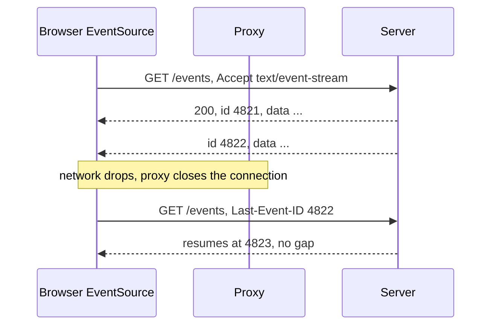
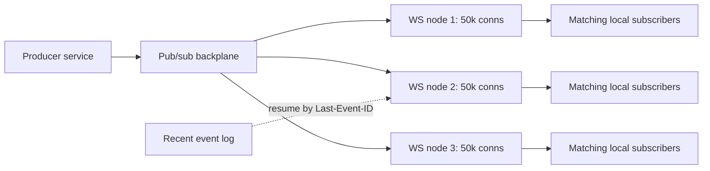

Her iki protokol de polling'i ortadan kaldırmak için vardır ve bunu stateless bir istek-yanıt katmanını stateful bir bağlantı katmanına çevirerek yapar. Maliyetin tamamı bu dönüşümdedir: 200.000 bağlantı tutan bir sunucu, 200.000 dosya tanımlayıcısı, 200.000 yazma tamponu ve deploy anında yok olan 200.000 parça oturum durumu tutuyor demektir. Aşağıdaki her operasyonel problem bundan türer — yapışkan yönlendirme, instance'lar arası fan-out, flow control'ü olmayan yavaş tüketiciler ve her sürüm çıkışında bir yeniden bağlanma fırtınası.
 
Seçimi önce yönlülüğe göre yapın. **SSE** (Server-Sent Events) yalnızca sunucudan istemciye çalışır, düz HTTP üzerinde gider ve devam etme (resumption) protokole gömülüdür. **WebSocket** kendi çerçeveleme katmanı üzerinde çift yönlüdür; devam etme, mesaj kimliği ve uygulama katmanında backpressure sinyali yoktur. İstemcinin yalnızca almaya ihtiyacı varsa, SSE işletilecek kesinlikle daha az makinedir.
 
| Boyut | SSE | WebSocket | Long polling |
|-------|-----|-----------|--------------|
| Yön | Sunucudan istemciye | Çift yönlü | Sunucudan istemciye, istek başına bir mesaj |
| Transport | HTTP, `text/event-stream` | RFC 6455 çerçevelemesine Upgrade | Düz HTTP |
| Payload | Yalnızca UTF-8 metin | Metin veya binary | Herhangi biri |
| Otomatik yeniden bağlanma | `EventSource`'a gömülü | Uygulama kodu | Uygulama kodu |
| Devam etme | `Last-Event-ID`, protokolde | Yok; kendiniz kurarsınız | Uygulama kodu |
| Proxy uyumluluğu | Sıradan HTTP yanıtı | Her sıçramada Upgrade desteği ister | Evrensel |
| Multiplexing | HTTP/2 üzerinde bedava | HTTP/1.1'de soket başına bir TCP bağlantısı | Bedava |
| Ne zaman tercih edilir | Akışlar, bildirimler, ilerleme, dashboard'lar | Etkileşimli oturumlar, oyunlar, ortak düzenleme, istemci kaynaklı trafik | Başka hiçbir şeyin ağdan geçemediği durumlarda geri düşüş |
 
## WebSocket: Handshake ve Çerçeveleme
 
Bağlantı, `Upgrade: websocket` ve rastgele bir `Sec-WebSocket-Key` içeren bir HTTP/1.1 `GET` ile açılır. Sunucu, anahtarın sabit bir GUID ile birleştirilmiş SHA-1'i olan `Sec-WebSocket-Accept` ile `101 Switching Protocols` döner. Bu değer, karşı tarafın handshake'i anladığını, header'ları yankılayan sıradan bir HTTP sunucusu olmadığını kanıtlar — bir cache zehirlenmesi savunmasıdır, kimlik doğrulama değil.
 
`101`'den sonra HTTP semantiği yoktur. Status kodu, header ve metot yoktur; yalnızca frame'ler vardır:
 
- **Opcode'lar:** `0x1` text, `0x2` binary, `0x0` continuation, `0x8` close, `0x9` ping, `0xA` pong.
- **FIN biti ve parçalama:** mantıksal bir mesaj birden fazla frame'e yayılabilir. Kontrol frame'leri (`0x8`-`0xA`) parçalar arasına serpiştirilebilir ve kendileri parçalanamaz; büyük bir yükleme sırasında ping'in ulaşabilmesinin nedeni budur.
- **Masking:** istemciden sunucuya frame'ler, frame başına bir anahtarla XOR maskelenmek zorundadır. Bu güvenlik değildir — anahtar wire üzerindedir — kötü niyetli bir betiğin, şeffaf bir proxy'nin ikinci bir HTTP isteği sanacağı baytlar üretmesini engellemek için vardır. Sunucudan istemciye frame'ler maskelenmemelidir.
- **Payload uzunluğu:** 7 bit, ya da 7+16, ya da 7+64. Frame ek yükü 2-14 bayttır; HTTP'nin yüzlerce baytına karşılık asıl verimlilik kazancı budur.
- **Close handshake:** taraflardan biri kodlu bir `0x8` gönderir, karşı taraf yankılar, ardından TCP kapanır. `1000` normaldir; `1006` bağlantının close frame'i olmadan düştüğü anlamına gelir ve gerçek olaylarda göreceğiniz kod budur.
`Sec-WebSocket-Protocol` bir uygulama alt protokolü müzakere eder ve tarayıcı istemcisinin handshake'e değer koyabildiği tek yerdir — tarayıcının `WebSocket` API'si keyfi header ayarlayamaz; kimlik doğrulama token'larının alt protokol alanına, query string'e veya ilk uygulama mesajına sıkıştırılmasının nedeni budur.
 
HTTP/2 üzerinde WebSocket, RFC 8441 Extended CONNECT gerektirir ve proxy'ler arasında destek eşitsizdir; çoğu deployment WebSocket'i hâlâ HTTP/1.1'de sonlandırır. Bu önemlidir çünkü her HTTP/1.1 soketi tam bir TCP bağlantısıdır; dört soket açan bir sayfa, tarayıcının origin başına altı bağlantısının dördünü tüketir (bkz. [HTTP/2 ve HTTP/3](/distributed-systems/tr/communication/synchronous-protocols/http2-http3-quic/)).
 
:::caution
WebSocket same-origin politikasına tabi değildir. Tarayıcı `Origin` header'ını gönderir ama CORS preflight'ı zorlamaz; dolayısıyla internetteki herhangi bir sayfa, kullanıcının çerezleri iliştirilmiş halde endpoint'inize soket açabilir — Cross-Site WebSocket Hijacking. Handshake sırasında `Origin`'i bir allowlist'e karşı doğrulayın ve çerez tabanlı kimlik doğrulama yerine ilk mesajda token kullanmayı tercih edin; çünkü çerezler otomatik iliştirilir, token iliştirilmez.
:::
 
## SSE: Akış Formatı ve Bedava Devam Etme
 
SSE, `Content-Type: text/event-stream` taşıyan ve hiç bitmeyen sıradan bir HTTP yanıtıdır. Gövde, boş satırlarla ayrılmış alan satırları dizisidir:
 
```text
id: 4821
event: price
data: {"symbol":"ACME","priceMinorUnits":19250}
 
retry: 5000
 
: heartbeat comment, keeps intermediaries from closing the stream
 
id: 4822
event: price
data: {"symbol":"ACME","priceMinorUnits":19310}
```
 
SSE'yi operasyonel olarak WebSocket'ten ucuz kılan şey `id` alanıdır. Tarayıcı en son alınan `id`'yi saklar ve yeniden bağlandığında bunu otomatik olarak `Last-Event-ID` istek header'ı ile geri gönderir. Sunucu o pozisyondan devam eder. Bu, aksi halde bir WebSocket veya gRPC stream'i için elle kuracağınız devam etme mekanizmasıdır ve bedavadır.
 

*EventSource kendiliğinden yeniden bağlanır ve pozisyonu Last-Event-ID ile bildirir; sunucu o geçmişi sakladığı sürece 4822 ile devam noktası arasında kayıp olmaz.*
 
Kısıtlar gerçektir: yalnızca metin, dolayısıyla binary payload'lar %33 boyut cezasıyla base64'lenmelidir; tarayıcının `EventSource` API'si istek header'ı ayarlayamaz, dolayısıyla `fetch` tabanlı bir okuyucu kullanmadıkça kimlik doğrulama çerezlere veya bir query parametresine biner; ve `retry:` yalnızca tarayıcının yeniden bağlanma gecikmesini tavsiye eder — bu gecikme aksi halde jitter'sız, sabit birkaç saniyedir; sunucu bağlantı başına `retry` değerini rastgeleleştirmezse toplu bir kopma senkronize bir yeniden bağlanma dalgası üretir.
 
Diğer tehlike proxy'lerdir. Yanıt gövdesini tamponlayan her sıçrama, canlı bir akışı dakikalarca geç varan ya da hiç varmayan bir toplu teslime çevirir. Yanıt sıkıştırması, sıkıştırıcı flush etmeden önce tam blok beklediğinde aynı etkiyi yaratır.
 
```nginx
location /events {
    proxy_pass http://app_upstream;
    proxy_http_version 1.1;
    proxy_buffering off;          # without this, events are batched by nginx
    gzip off;                     # compressors defeat per-event flushing
    proxy_read_timeout 3600s;     # default 60s silently kills the stream
    proxy_set_header Connection "";
}
```
 
## Backpressure ve Yavaş Tüketici
 
Hiçbir protokolde uygulama düzeyinde flow control yoktur. Bir WebSocket üzerindeki `Send`, kernel soket tamponuna yazar; tampon dolduğunda yazma bloklanır veya userspace kütüphanesi mesajı kuyruğa alır. Siz saniyede 500 mesaj yayınlarken tıkalı bir mobil hatta saniyede 5 mesaj tüketen bir istemci, saniyede 495 mesajı bir yerde biriktirir ve o yer sizin heap'inizdir.
 
Yük altında gerçek zamanlı bir servisin kendini OOM ile öldürmesinin en yaygın nedeni budur. Savunulabilir tek tasarım, bağlantı başına sınırlı bir kuyruk artı kuyruk dolduğunda ne olacağına dair açık bir politikadır:
 
- **Conflate (birleştir).** Yalnızca son değerin önemli olduğu durum güncellemelerinde — fiyatlar, pozisyonlar, dashboard göstergeleri — anahtar başına tek bir yuva tutup üzerine yazın. Yavaş tüketici daha az güncelleme alır, asla bayat olanı almaz ve bellek mesaj hızıyla değil anahtar sayısıyla sınırlanır.
- **İşaretleyerek düşür.** Atın ve "N olayı kaçırdınız, şu cursor'dan senkronize olun" mesajı gönderin ki istemci açıkça mutabakat sağlayabilsin.
- **Bağlantıyı kes.** Bir politika koduyla kapatın ve istemci yeniden bağlanıp devam etsin. Sert, sınırlı ve kalıcı bir devam etme yolu olan akışlar için doğru.
Asla kabul edilemez olan şey sınırsız kuyruktur; çünkü tek bir kötü istemciyi tüm sürecin çöküşüne çevirir. Konunun genel işlenişi [Geri Baskı](/distributed-systems/tr/resilience/flow-control/backpressure/) sayfasındadır.
 
## Fan-Out Mimarisi
 
Bir bağlantı tam olarak bir instance üzerinde yaşar, ama olay genellikle başka bir yerde üretilir. Bu yüzden ölçekleme bir **backplane** gerektirir: instance'lar bir pub/sub kanalına abone olur ve eşleşen olayları yerel bağlantılarına iletir.
 

*Her düğüm bağlantıları ve yerel bir abonelik indeksini tutar; backplane fan-out yapar ve kısa süre saklanan bir log yeniden bağlanma sonrası devam etmeyi karşılar.*
 
Bunun ölçeklenip ölçeklenmeyeceğini belirleyen tasarım noktaları:
 
- **Topic granülaritesi.** Her olayı her düğüme yayınlayıp yerelde filtrelemek basittir ve bant genişliğini düğüm sayısıyla doğrusal biçimde israf eder. Abonelikleri topic'e göre shard'lamak bunu azaltır ama backplane'de yönlendirme bilgisi gerektirir. Redis pub/sub dayanıklılığı olmayan ateşle-unut bir mekanizmadır; Kafka, consumer group mekaniği karşılığında saklama ve replay verir (bkz. [Mesaj Kuyruğu ve Event Streaming](/distributed-systems/tr/communication/async-messaging/message-queue-vs-event-streaming/)).
- **Devam etme için saklama.** `Last-Event-ID` yalnızca bir bileşen o ID'den sonraki olayları hâlâ tutuyorsa işe yarar. Kısa süreli saklanan bir log — günler değil dakikalar — depolamayı sınırlarken yeniden bağlanmaları karşılar.
- **Bağlantı başına bütçe.** Tampon ve defter tutma için bağlantı başına onlarca kilobayt planlayın; 100 bin bağlantı, hiçbir uygulama durumu eklenmeden tek haneli gigabayt eder. `ulimit -n` ve kernel `nofile` limitlerini yükseltin ve load balancer'ın her backend bağlantısı için ephemeral port'a ihtiyaç duyduğunu unutmayın.
## Uygulama
 
```go
// Bounded per-connection queue with conflation, plus liveness pings.
type Client struct {
	conn   *websocket.Conn
	send   chan []byte // bounded: this is the backpressure boundary
	userID string
}
 
const (
	writeWait  = 10 * time.Second  // per-frame write deadline
	pongWait   = 60 * time.Second  // peer must pong within this
	pingPeriod = 45 * time.Second  // must be < pongWait
	maxMessage = 64 << 10          // reject oversized client frames
)
 
func (c *Client) writePump(ctx context.Context) {
	ticker := time.NewTicker(pingPeriod)
	defer func() {
		ticker.Stop()
		c.conn.Close()
	}()
 
	for {
		select {
		case msg, ok := <-c.send:
			if !ok {
				// Hub closed the channel: send a proper close frame so the
				// client sees 1000 instead of an abnormal 1006.
				_ = c.conn.WriteControl(websocket.CloseMessage,
					websocket.FormatCloseMessage(websocket.CloseNormalClosure, ""),
					time.Now().Add(writeWait))
				return
			}
			// A deadline is mandatory: without it a stalled TCP connection
			// blocks this goroutine until the kernel gives up, holding the
			// queue and its memory for hours.
			if err := c.conn.SetWriteDeadline(time.Now().Add(writeWait)); err != nil {
				return
			}
			if err := c.conn.WriteMessage(websocket.TextMessage, msg); err != nil {
				return
			}
 
		case <-ticker.C:
			_ = c.conn.SetWriteDeadline(time.Now().Add(writeWait))
			if err := c.conn.WriteControl(websocket.PingMessage, nil,
				time.Now().Add(writeWait)); err != nil {
				return // peer is gone; stop holding resources for it
			}
 
		case <-ctx.Done():
			return // graceful shutdown path
		}
	}
}
 
// publish applies the slow-consumer policy. Never block the producer and
// never grow the queue without bound.
func (c *Client) publish(msg []byte) {
	select {
	case c.send <- msg:
	default:
		// Queue full: this client cannot keep up. Close it and let the
		// client reconnect and resume from its last cursor. Dropping
		// silently would produce an inconsistent client view.
		slog.Warn("slow consumer evicted", "user", c.userID, "queued", len(c.send))
		close(c.send)
	}
}
 
func (h *Hub) handleUpgrade(w http.ResponseWriter, r *http.Request) {
	// WebSocket has no CORS preflight; Origin must be checked here or the
	// endpoint is open to cross-site hijacking with the user's cookies.
	if !h.allowedOrigins[r.Header.Get("Origin")] {
		http.Error(w, "forbidden origin", http.StatusForbidden)
		return
	}
 
	conn, err := h.upgrader.Upgrade(w, r, nil)
	if err != nil {
		return // Upgrade already wrote the error response
	}
	conn.SetReadLimit(maxMessage)
	_ = conn.SetReadDeadline(time.Now().Add(pongWait))
	conn.SetPongHandler(func(string) error {
		// Each pong extends the read deadline; a peer that stops ponging
		// is reaped instead of lingering until the TCP timeout.
		return conn.SetReadDeadline(time.Now().Add(pongWait))
	})
 
	client := &Client{conn: conn, send: make(chan []byte, 256), userID: userFrom(r)}
	h.register <- client
	go client.writePump(r.Context())
	go client.readPump()
}
```
 
```go
// SSE handler: flushing, heartbeats, and Last-Event-ID resumption.
func (s *Server) Events(w http.ResponseWriter, r *http.Request) {
	rc := http.NewResponseController(w)
 
	w.Header().Set("Content-Type", "text/event-stream")
	w.Header().Set("Cache-Control", "no-cache, no-transform") // no-transform stops proxy compression
	w.Header().Set("Connection", "keep-alive")
	w.Header().Set("X-Accel-Buffering", "no") // tells nginx not to buffer
 
	// The browser sends this automatically after a dropped connection.
	from := r.Header.Get("Last-Event-ID")
	cur, err := s.log.Open(r.Context(), userFrom(r), from)
	if err != nil {
		// Cursor too old: tell the client to resync rather than silently
		// skipping events it will never see.
		http.Error(w, "cursor expired, resync required", http.StatusGone)
		return
	}
	defer cur.Close()
 
	// Randomize the client's reconnect delay so a mass disconnect does not
	// produce a synchronized reconnect wave.
	fmt.Fprintf(w, "retry: %d\n\n", 3000+rand.Intn(4000))
	_ = rc.Flush()
 
	heartbeat := time.NewTicker(15 * time.Second)
	defer heartbeat.Stop()
 
	for {
		select {
		case <-r.Context().Done():
			return // client gone; stop reading the backend cursor
		case <-heartbeat.C:
			// A comment line keeps intermediaries from reaping an idle stream.
			if _, err := io.WriteString(w, ": ping\n\n"); err != nil {
				return
			}
			_ = rc.Flush()
		case ev, ok := <-cur.C():
			if !ok {
				return
			}
			if _, err := fmt.Fprintf(w, "id: %s\nevent: %s\ndata: %s\n\n",
				ev.ID, ev.Type, ev.JSON); err != nil {
				return // client disconnected mid-write
			}
			// Without Flush the event sits in the write buffer indefinitely.
			_ = rc.Flush()
		}
	}
}
```
 
## Hata Modları ve Operasyonel Tuzaklar
 
**Idle timeout'ların sağlıklı bağlantıları kesmesi.** Belirti: tüm istemcilerde bağlantılar tam olarak 60 sn, 5 dk veya 1 saatte, `1006` kapanış koduyla aynı anda ölür. Suçlu bir load balancer, ingress veya kurumsal proxy varsayılanıdır ve yoldaki en kısa timeout kazanır. Çözüm: her sıçramada idle timeout'u yükseltmek *ve* daha kısa aralıkla uygulama düzeyinde ping ya da SSE yorumu göndermek — keepalive, en katı timeout'tan daha sık olmalıdır.
 
**Deploy tetiklemeli yeniden bağlanma fırtınaları.** Her rolling restart, o instance üzerindeki tüm bağlantıları aynı anda düşürür; jitter olmadan hepsi aynı saniye içinde yeniden bağlanır ve handshake artı kimlik doğrulama artı devam etme sorgusu yükü, kararlı durum yükünü kat kat aşabilir. Çözüm: jitter'lı `retry` değerleri, özel istemcilerde üstel geri çekilme ve jitter, ve kademeli pod sonlandırma (bkz. [Üstel Geri Çekilme ve Jitter ile Yeniden Deneme](/distributed-systems/tr/resilience/protection-patterns/retry-exponential-backoff/)).
 
**Sınırsız yazma kuyrukları.** Belirti: belleğin yayın hızıyla doğrusal büyümesi ve hiç geri gelmemesi, üstelik bir avuç bağlantıda yoğunlaşmış olması. Ortalamayla değil bağlantı başına kuyruk derinliği histogramıyla tespit edin — bir istemci limitteyken ortalama gayet iyi görünür.
 
**Yarı açık bağlantılar.** İstemcinin dizüstü bilgisayarı uyur ya da NAT eşlemeyi düşürür; `FIN` gelmez, dolayısıyla sunucu bağlantıyı, aboneliğini ve tamponlarını kernel TCP zaman aşımına kadar tutar; Linux'ta bu varsayılan olarak iki saatin üzerindedir. Okuma deadline'lı ping/pong tek güvenilir dedektördür.
 
**Bağlantı sabitlenmesinden kaynaklanan yük dengesizliği.** Scale-out sonrası yeni instance'lar bağlantı almaz, çünkü mevcut istemciler bağlı kalır. Jitter'lı sonlu bir maksimum bağlantı ömrü kademeli yeniden dağıtımı zorlar ve yeniden bağlanma yolunu sürekli çalıştırır (bkz. [L4 ve L7 Yük Dengeleme](/distributed-systems/tr/communication/load-balancing/l4-vs-l7/)).
 
**Hiç sona ermeyen kimlik doğrulama.** Handshake anında bir kez doğrulanan token, kendisi süresi dolduktan veya kullanıcının yetkileri iptal edildikten saatler sonra bile bağlantıyı yetkilendirir. Zamanlayıcıyla yeniden doğrulayın, bağlantı ömrünü token ömrüyle sınırlayın ve iptal olayında sonlandırın (bkz. [JWT](/distributed-systems/tr/security/authentication-authorization/jwt/)).
 
**Sıkıştırma katlanması.** Context takeover'lı `permessage-deflate`, bağlantı başına bir sıkıştırma penceresi tutar — her biri onlarca kilobayt, 100 bin bağlantıda muhtemelen sıkıntısını çekmediğiniz bant genişliğini kurtarmak için harcanan gigabaytlarca bellek. Yüksek bağlantı sayılı iş yüklerinde context takeover'ı ya da uzantıyı tamamen kapatın.
 
**SSE'nin tamponlanarak işlevsizleşmesi.** Belirti: olayların uzun sessizliklerden sonra düzinelik patlamalar halinde gelmesi veya tarayıcının `EventSource`'unun hiç tetiklenmemesi. Neden: tamponlayan bir proxy, bir sıkıştırma katmanı ya da handler'da eksik bir `Flush`. Gerçek ingress yolu üzerinden `curl -N` ile doğrulayın.
 
## Hangisi Ne Zaman
 
Sunucudan istemciye akışlar için **SSE** kullanın: bildirimler, canlı dashboard'lar, ilerleme göstergeleri, LLM token akışı, etkinlik zaman çizelgeleri. Sıradan HTTP altyapısı üzerinde gider, HTTP/2 üzerinde bedava multiplex olur ve hiç yazmadığınız bir devam etme mekanizması verir. Tek yönlü olması bir özelliktir — istemci eylemleri normal REST çağrılarıyla gider ve bunlar retry edilebilir, cache'lenebilir ve gözlemlenebilir kalır.
 
İstemcinin, eylem başına istek modelinin karşılayamayacağı bir hız veya gecikmede mesaj gönderdiği durumlarda **WebSocket** kullanın: ortak düzenleme, çok oyunculu durum, etkileşimli terminaller, istemci taraflı emir akışı olan işlem arayüzleri. Karşılığında devam etme, backpressure politikası ve yeniden bağlanma mantığını kendiniz kuracağınızı kabul edin.
 
Servisler arası iletişimde ikisini de kullanmayın. Veri merkezi içinde [gRPC streaming](/distributed-systems/tr/communication/synchronous-protocols/grpc-streaming/) aynı çift yönlü semantiği tipli sözleşmeler, deadline'lar ve iptal ile verir. Çevrimdışı olabilecek tüketicilere dayanıklı teslim için cevap soket değil broker'dır — bağlantı bir kuyruk değildir ve istemci kopukken gönderdiğiniz hiçbir şey, onun için bir log yazmadıysanız hiçbir yerde var olmaz.