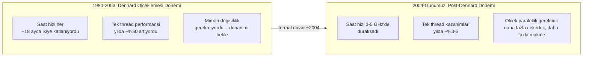
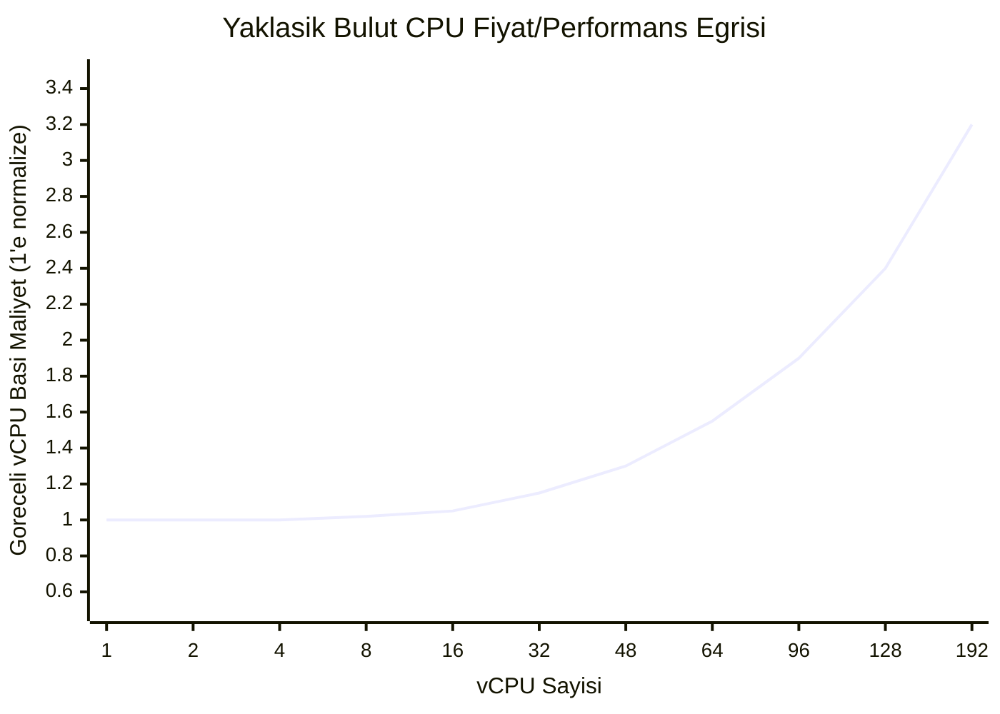
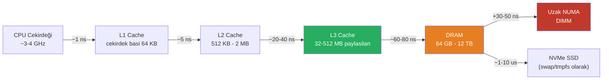
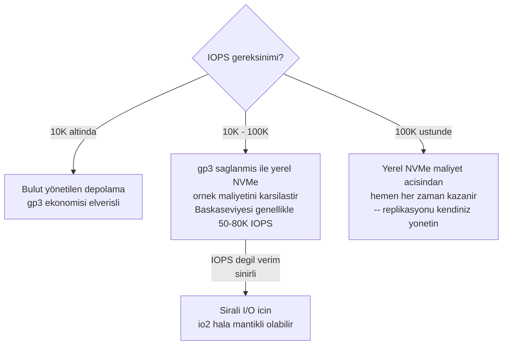
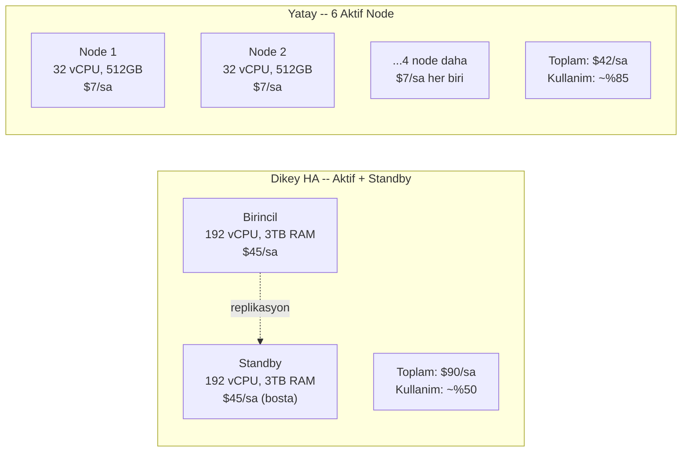

Bir sistemi dağıtma kararı, öncelikle bir yazılım kararı değil — bir donanım ekonomisi kararıdır. Dağıtık sistemler şu yüzden var olur: tek bir makineden daha fazla performans almanın maliyeti eninde sonunda birden fazla makineyi koordine etmenin maliyetini aşar; üstelik bazı donanım sınırları yalnızca pahalı değil, fiziksel olarak aşılmazdır. Bu sınırların *nerede* olduğunu ve yaklaşırken maliyet eğrisinin *ne şekil aldığını* anlamak, ölçekle ilgili her mimari kararın ön koşuludur.
 
## Ücretsiz Performansın Sonu: Dennard Ölçeklemesi ve Moore Yasası
 
Otuz yıl boyunca mühendisler donanım kısıtlarını görmezden gelebilir ve performansın kendiliğinden artacağını varsayabilirdi. Bunu mümkün kılan iki ampirik gözlem vardı.
 
**Moore Yasası** (1965), entegre devrelerdeki transistor yoğunluğunun yaklaşık her iki yılda bir ikiye katlandığını gözlemledi. Daha fazla transistor daha fazla kapasite anlamına geliyordu: daha büyük cache'ler, daha sofistike sıra dışı (out-of-order) execution üniteleri, daha geniş SIMD şeritleri.
 
**Dennard Ölçeklemesi** (1974), transistorlar küçüldükçe orantılı olarak daha az güç tükettiklerini ve daha hızlı geçiş yaptıklarını gözlemledi. Bir transistoru %50 küçültmek, güç yoğunluğunu sabit tutarken saat frekansının ~%40 artırılmasına izin veriyordu. CPU saat hızlarının 1980'deki ~1 MHz'den 2003'e kadar ~3 GHz'e çıkmasının nedeni budur: 18 ayda bir yaklaşık ikiye katlanan 23 yıl.
 
Bu iki elverişli rüzgar farklı zamanlarda ve farklı nedenlerle sona erdi.
 
Dennard Ölçeklemesi **2004-2006 civarında çöktü**. Transistorlar ~90nm'nin altına küçüldükçe kaçak akım (leakage current) — transistor nominal olarak "kapalıyken" bile akan akım — toplam gücün baskın bileşeni haline geldi. Saat frekansını ~3-4 GHz'in üzerine çıkarmak, güç yoğunluğunun soğutma sistemlerinin pratikte dağıtabileceği miktarı aşmasına neden oldu. Termal duvar gerçektir: Intel'in Prescott nesli Pentium 4'ü 90nm süreçte 3,8 GHz'de ~115 W tüketiyordu; ~7 GHz'e ikiye katlamak, yalnızca CPU'dan ~460 W gerektirecekti; bu, pratik herhangi bir soğutma çözümünün termal zarfını aşmaktadır.
 
Sektörün yanıtı saat frekansını artırmayı durdurup daha fazla çekirdek eklemeye geçmek oldu. Günümüzün üst düzey sunucu CPU'su (AMD EPYC 9654, Intel Xeon Platinum 8592+) 2,4-3,7 GHz temel saat hızında çalışır — 2003'teki CPU'lardan çok az daha hızlı — ancak 96-128 çekirdeği vardır. **Tek thread'li sıralı performans 2005'ten bu yana yalnızca mütevazı biçimde gelişmiştir.** Yazılım performansı açısından en alakalı kıyaslama ölçütü olan tek çekirdekli IPC (Cycle Başına Komut) kazanımı, Dennard ölçeklemesi döneminin yıllık %50+'sına karşılık o günden bu yana yılda yaklaşık %3-5 ortalama göstermektedir.
 
Transistor yoğunluğuna ilişkin Moore Yasası da dramatik biçimde yavaşladı. 18 aylık ikiye katlama temposu yaklaşık 2012-2015'e kadar geçerliydi. O günden bu yana her süreç düğümü geçişi daha uzun sürdü ve daha küçük yoğunluk kazanımları sağladı. TSMC'nin N3 ve N2 düğümleri anlamlı iyileştirmeler sunuyor; ancak her nesil için tasarım ve üretim maliyeti üstel biçimde artıyor: N2 için bir maske seti 20 milyon dolardan fazla, bu yüzden yalnızca Apple, NVIDIA, AMD ve bir avuç diğeri en son süreç teknolojisini karşılayabiliyor.
 
Sistem mimarları için pratik sonuç şudur: **yazılımın performans taleplerini karşılamak için donanımın yetişmesini artık bekleyemezsiniz.** Daha hızlı donanım için birkaç yıl bekleyerek ölçeklenebilirlik kararını ertelenebildiğiniz dönem sona erdi.
 

*Dennard Ölçeklemesi'nin çöküşü, performans iyileştirme yükünü donanımdan yazılım ve mimariye aktardı.*
 
## CPU Maliyet-Performans Eğrileri
 
Dikey ölçekleme modelinde CPU maliyeti performansla doğrusal olarak ölçeklenmez. Bulut ve yerinde (on-premises) donanım pazarlarında üç farklı rejim mevcuttur.
 
**Emtia hesaplama rejimi (1-16 vCPU):** En yoğun üretilen ve en agresif fiyatlanan katman. Hyperscaler bulut sağlayıcıları bu örneklerden milyonlarcasını çalıştırır. Fiyat/performans en yüksek seviyededir. 8 vCPU'lu bir örnek, 1 vCPU'lu bir örneğin yaklaşık 8 katı hesaplama gücünü yaklaşık 8 kat fiyata sunar — ilişki yaklaşık olarak doğrusaldır.
 
**Orta düzey rejim (16-64 vCPU):** Hâlâ emtia, ancak daha büyük örnekler ılımlı bir prim taşımaya başlar. Temel neden, daha büyük örneklerin daha büyük fiziksel host'lar gerektirmesi ve tüm rack konfigürasyonlarının bunları barındıramamasıdır. CPU başına bellek oranları özelleşmiş örnek ailelerine (hesaplama optimize, bellek optimize, depolama optimize) ayrışır; her biri farklı vCPU başına fiyatlar taşır. Emtia katmanından doğrusal ekstrapolasyona kıyasla %10-25 prim bekleyin.
 
**Büyük örnek rejimi (64-192+ vCPU):** Doğrusal olmayan maliyet artışı. Bu örnekler tüm fiziksel host'ları kaplıyor ya da çok soketli NUMA konfigürasyonları gerektiriyor. Onlara ihtiyaç duyan iş yükleri az ve özeldir (büyük bellek içi veritabanları, yüksek frekanslı işlem platformları, gerçek zamanlı simülasyon). Bulut sağlayıcıları doğrusal ekstrapolasyon üzerinde %40-100 primle fiyatlandırır; eşdeğer bare-metal alternatifler çoğunlukla toplu küçük örneklerin 3-5 katı maliyete sahiptir.
 

*Örnek boyutu büyüdükçe göreli vCPU başına maliyet doğrusal olmayan biçimde artar. Kırılma noktası bulut sağlayıcısına göre değişir ancak tipik olarak 32-48 vCPU civarında başlar.*
 
Daha önemli CPU sınırı maliyet değil **tek thread verimidir**. Karmaşık bir sorgu planını ayrıştırmak, saklı bir prosedürü yürütmek ya da tek thread'li bir event loop çalıştırmak gibi doğası gereği sıralı kritik yola sahip herhangi bir iş yükü ek çekirdeklerden yararlanamaz. Tek bir işlemi tamamlama süresini minimize etmesi gereken gecikmeye duyarlı uygulamalar, 20 yıldır neredeyse hiç değişmemiş olan ve mevcut yol haritalarında anlamlı biçimde iyileşmeyecek olan tek çekirdek performansıyla sınırlıdır.
 
## Bellek: Gecikme Durağanlığı Sorunu
 
Bellek, en yanlış anlaşılan donanım ölçekleme boyutudur; çünkü iki çok farklı özellik — **kapasite** ve **gecikme** — 1990'lardan bu yana çarpıcı biçimde ayrışmıştır.
 
**DRAM kapasitesi** büyümeye devam etmiştir. Tek bir DIMM bugün 64-256 GB barındırır. Tamamen doldurulmuş çift soketli bir sunucu 12 TB DRAM'e ulaşabilir. Kapasite darboğaz değildir.
 
**DRAM gecikmesi** 25 yıldır neredeyse hiç iyileşmemiştir. 2000 yılında DDR1 SDRAM'in tipik rastgele erişim gecikmesi ~60 ns'ydi. 2024'te DDR5-6400, modül düzeyinde ~14 döngü CAS gecikmesine sahip; ancak bu döngü-sayısı gecikmesidir, gerçek saat gecikmesi değil. Daha yüksek saat hızlarında DDR5'in *mutlak* gerçek zamanlı gecikmesi, 14 döngü × (1 / 6.4 GHz) ≈ **döngü başına 2,2 ns, CAS 46 ile çarpılmış** ≈ en iyi durumda yerel DIMM erişimi için yaklaşık 14 ns. Pratikte bellek denetleyicisi yükü, satır ön yükleme (row precharge) ve banka çakışmaları dahil olmak üzere DDR5 için rastgele cache-miss erişiminin tipik efektif gecikmesi **60-80 ns**'dir — DDR1'den özünde değişmemiş.
 
Sonuç: CPU cache'leri tam olarak bu gecikmeyi gizlemek için vardır. L1 cache erişimi ~1 ns, L2 ~5 ns, L3 ~20-40 ns'dir. Çalışma kümesini L3 cache'e sığdıran kod hızlı çalışır. DRAM'e cache miss'ler üreten kod yavaş çalışır — ve daha fazla RAM eklemek bu miss'leri daha hızlı yapmaz.
 

*Bellek hiyerarşisi gecikmesi: L3 cache ile DRAM arasındaki uçurum, modern sistemlerdeki en etkili tek performans kaydıdır. Uzak NUMA bunun üzerine 30-50 ns daha ekler.*
 
**Bellek bant genişliği** diğer boyuttur. Modern DDR5 çift kanallı bir sistem ~100 GB/s tepe bant genişliği sunar. 4 kanallı üst düzey bir iş istasyonu sistemi ~200 GB/s'ye ulaşır. Bu sayılar büyük görünür ama veri yoğun iş yükleri tarafından kolayca doyurulur. Büyük bir tabloyu tarayan bir bellek içi veritabanı her bayta bir kez dokunur — 100 GB/s'de 1 TB'ı taramak, tüm işlem yükleri bir yana, 10 saniye saf bellek bant genişliği gerektirir.
 
Daha fazla RAM eklemek bant genişliğini artırmaz (mevcut kanallara DIMM eklemek doğrusal olarak bant genişliği eklemez — yalnızca kanal eklemek bunu yapar). Bellek optimize edilmiş bulut örneklerinin var olmasının nedeni budur: kapasitesinin yanı sıra bant genişliğini artırmak için soket başına daha fazla DRAM kanalı yapılandırırlar.
 
:::caution
Yaygın bir dikey ölçekleme hatası, cache-miss yoğun erişim örüntülerinin neden olduğu bir performans sorununu düzeltmek için RAM eklemektir. İş yükünüz belleğe zayıf yerellikle erişiyorsa — örneğin L3 cache'den büyük bir hash map'te rastgele anahtar aramaları yapıyorsa — daha fazla RAM eklenmesi daha fazla verinin *erişilebilir* olmasını sağlar ama erişimi *daha hızlı* yapmaz. Düzeltme daha fazla DIMM yuvası değil, veri yapısı yeniden tasarımıdır (cache dostu düzenler, daha küçük kayıtlar, bölümleme yoluyla daha iyi yerellik).
:::
 
## Depolama: IOPS Uçurumu ve Bant Genişliği Ekonomisi
 
Depolama performansı, son on yılda öncelikle NVMe SSD devrimi sayesinde diğer tüm donanım boyutlarından daha dramatik biçimde iyileşmiştir. Güncel eğrileri anlamak üç erişim boyutunu ayırt etmeyi gerektirir: **gecikme**, **IOPS** ve **verim (bant genişliği)**.
 
| Depolama Türü | Gecikme (rastgele 4K okuma) | Maks IOPS (tek cihaz) | Sıralı Verim | GB Başına Fiyat |
|---|---|---|---|---|
| 7200 RPM HDD | 3-10 ms | 80-200 IOPS | 150-250 MB/s | $0,02-0,05 |
| SATA SSD (TLC) | 50-100 µs | 80K-100K IOPS | 500-560 MB/s | $0,06-0,10 |
| NVMe SSD (TLC) | 20-100 µs | 700K-1,2M IOPS | 3-7 GB/s | $0,10-0,20 |
| NVMe SSD (Optane/PLC) | 7-10 µs | 1,5M+ IOPS | 7-14 GB/s | $0,50-2,00 |
| DRAM (tmpfs olarak) | 60-80 ns | ~10 milyar+ efektif | 50-200 GB/s | GB başına $3-10 |
 
Kritik gözlem: **NVMe SSD'ler çoğu veritabanı iş yükü için depolama gecikmesini darboğaz olmaktan çıkarmıştır.** 20 µs'de rastgele 4K okuma, tek bir cihazdan saniyede 50.000 IOPS anlamına gelir. NVMe depolamadaki PostgreSQL, ne kadar para harcanırsa harcansın dönen diskli sistemlerde imkânsız olan 99. yüzdelik dilim sorgu gecikmelerine ulaşır.
 
Ancak yüksek uçta depolama IOPS'unun *maliyet* eğrisi doğrusal değildir. Bulut blok depolama (AWS EBS `gp3`, GCP Persistent Disk), kapasite (GB-ay başına) ve sağlanan IOPS (IOPS-ay başına) için ayrı ayrı fiyatlandırılır. IOPS yoğun iş yükleri için ekonomi hızla bozulur:
 
- `gp3` temel hatta: 3.000 IOPS dahil, $0,08/GB-ay
- `gp3` 16.000 IOPS'ta: 3.000'in ötesinde sağlanan IOPS başına +$0,005 — 13.000 ek IOPS için aylık $65 ekler
- `io2` (adanmış IOPS): $0,125/GB-ay + IOPS başına $0,065 — 100K IOPS'luk bir hacim yalnızca IOPS ücretlerinde aylık $6.500 maliyete sahiptir
Bu maliyet düzeyinde, **IOPS yoğun iş yükleri için adanmış örnekteki yerel NVMe depolama önemli ölçüde daha ucuzdur** — yüksek yazma veritabanları gibi. Depolama optimize edilmiş bir örnek (AWS `i4i.8xlarge`, 3,75 TB NVMe, ~2,5M okuma IOPS), eşdeğer IOPS sağlayan EBS `io2` hacminin saatte $9+'sına karşılık ~$2,50/saat'e mal olur. Operasyonel maliyet daha yüksektir (RAID, replikasyon ve yedeklemeyi kendiniz yönetirsiniz), ancak IOPS'u dolduran iş yükleri için ekonomi açıktır.
 

*Depolama ekonomisi kararı: yönetilen blok depolamadaki IOPS maliyeti ~50-80K sürekli IOPS üzerinde engelleyici hale gelir.*
 
## Ağ: Bant Genişliği Ölçeklendi, Gecikme Ölçeklenmedi
 
Ağ donanımı depolama ile benzer bir yörünge izlemiştir: verim dramatik biçimde iyileşmiş, gecikme iyileşmemiştir.
 
**Bant genişliği ilerlemesi:** 1 GbE (2000'ler) → 10 GbE (2010'lar standardı) → sunucu başına 25 GbE (2016+) → 100 GbE (hyperscaler'lar, 2018+) → 400 GbE (ortaya çıkıyor, 2022+). Bulut örnekleri artık rutin olarak 25-100 Gbps ağ bant genişliği sunuyor. Bu, bir veri merkezi veya bulut bölgesi içindeki dağıtık veri transferinde ağ veriminin nadiren darboğaz olduğu anlamına gelir.
 
**Gecikme:** Donanım düzeyinde ham paket round-trip açısından modern 25 GbE ağında modern NIC ile aynı rack'teki gecikme yaklaşık 5-20 µs'dir. Yazılım yükü önemli ölçüde daha fazlasını ekler: Linux çekirdeğinin TCP/IP stack'i hafif yük altında bir paketi ~10-30 µs'de işler ve pratik uygulama düzeyinde round-trip gecikmesini 50-100 µs'ye çıkarır. Dağıtık sistemler için önemli olan bu sayıdır — makineler arası herhangi bir işlemin indirgenemez tabanıdır ve 15 yıl önceki 10 GbE donanımından özünde değişmemiştir.
 
Bu gecikme tabanının dağıtık veritabanı tasarımları açısından önemli sonuçları vardır. İki ardışık ağ round-trip'i gerektiren bir dağıtık işlem (koordinatör → katılımcı 1 → koordinatör → katılımcı 2), kod ne kadar mükemmel olursa olsun ağ donanımı ne kadar hızlı olursa olsun ~200-400 µs'den daha kısa sürede tamamlanamaz. Google Spanner ve CockroachDB gibi sistemlerin minimum işlem gecikmesinin tek haneli milisaniyelerle ölçülmesinin nedeni budur — o gecikme yazılım uygulama sınırlılığı değil, ışık hızı ve ağ stack yükünün fiziksel kısıtıdır.
 
**Kernel bypass ağı (DPDK, RDMA)**, uygulamaların doğrudan NIC donanımından okuyarak kernel yükünü ortadan kaldırır ve gecikmeyi ~1-5 µs'ye indirger. Bu, yüksek frekanslı işlemde, yüksek performanslı hesaplamada ve amaç odaklı depolama sistemlerinde (NVMe-over-Fabrics) kullanılır. Operasyonel karmaşıklık ve yazılım ekosistemi sınırlılıkları, genel amaçlı dağıtık sistemler için pratik olmaması anlamına gelir.
 
:::note
Ağ bant genişliği ölçeklemesi, dağıtık mimarilerde asimetrik bir durum yaratır: makineler arasında çok miktarda veriyi ucuza taşıyabilirsiniz, ancak tek bir koordinasyon işlemini hızlandıramazsınız. Bu nedenle işi toplu hale getiren mimariler (Kafka consumer group'ları, MapReduce shuffle aşamaları, toplu veritabanı replikasyonu), makineler arasında ince taneli öğe başına koordinasyon gerektiren mimarilerden çok daha iyi performans gösterir.
:::
 
## Toplam Sahip Olma Maliyeti Kırılma Noktası
 
Dikey ölçekleme yerine yatay ölçeklemenin ekonomik argümanı, bireysel emtia sunucularının daha ucuz olduğu değildir — saf çekirdek başına veya GB başına temelinde değildir. Argüman şudur: eşdeğer kullanılabilirlik ve verim sağlayan N adet emtia sunucusunun *toplam* maliyeti, özellikle şunları dahil ettiğinizde tek büyük sunucunun maliyetinden düşüktür:
 
- **Yüksek kullanılabilirlik artıklığı maliyeti:** Tek büyük sunucu, yüksek kullanılabilirlik için eşit büyüklükte bir standby replikası gerektirir. N/2 kapasiteli iki sunucu aktif-aktif eş olarak hizmet verebilir; aksi takdirde boşta bekleyecek kapasiteyi kullanır. Standby büyük sunucu modeli, ısınmış durumda bekleyen ve kullanılmayan kapasite için tam fiyat öder.
- **Aşırı sağlama maliyeti:** Dikey ölçekleme, tepe yük artı marj için sağlama gerektirir. Otomatik ölçeklemeyle yatay ölçekleme ortalama yük için sağlar ve tepeye ölçeklendirip geri döner. Bursty iş yüklerinde bulut altyapısındaki tasarruf %30-50 olabilir.
- **Yükseltme kesinti maliyeti:** Dikey ölçeklenmiş bir sistemi yükseltmek genellikle bir bakım penceresi ve kesinti gerektirir. Yatay kümeye node eklemek ideal olarak sıfır kesintili bir işlemdir.
- **Hata kurtarma maliyeti:** Büyük örnek arızası yavaş kurtarır — crash recovery, buffer pool ısınması, log replay. Dağıtık kümedeki emtia node'unu değiştirmek genellikle daha hızlıdır ve tam yerel kurtarma yerine replikasyon yetişmesini içerir.

*Eşdeğer hesaplama kapasitesi: $90/saat'te dikey aktif+standby çifti ile $42/saatte yatay aktif küme — neredeyse aynı toplam hesaplama, yaklaşık yarı maliyet. Yatay ölçekleme koordinasyon karmaşıklığı ekler.*
 
Yatay ölçeklemenin dikey ölçeklemeden ekonomik olarak üstün hale geldiği kırılma noktası iş yükü türüne göre değişir:
 
- **Saf stateless hesaplama (web sunucuları, API worker'ları):** Birkaç yüz RPS'nin üzerinde hemen her ölçekte yatay ölçekleme kazanır. Load balancer arkasındaki emtia örnekleri daha iyi kullanılabilirlik ve daha düşük maliyet aynı anda sağlarken büyük örnek için para ödemenin hiçbir nedeni yoktur.
- **Durum bilgili tek yazıcı sistemler (ilişkisel veritabanları, mesaj broker'ları):** Dikey ölçekleme 32-48 çekirdek ve 256-512 GB RAM'e kadar rekabetçi kalır. Bunun ötesinde NUMA cezaları, standby maliyeti ve lisanslama primleri (soket başına fiyatlanan ticari veritabanlar için) ekonomiyi yatay tarafa iter.
- **Replikalar ile okuma ağırlıklı iş yükleri:** Okuma replikaları eklemek yatay ölçeklemedir. Tek birincil, çok replikalu PostgreSQL konfigürasyonu, yazma yolu basitliğini korurken okumalar için yatay ölçeklemenin faydalarının çoğunu çıkaran hibrit bir mimaridir.
## Pazarlık Edilemez Donanım Sınırları
 
Bazı performans kısıtları daha fazla donanıma para harcayarak aşılamaz. Bunlar fiziğin yönetimindedir.
 
**Işık hızı:** Fiber optik kablo içinde vakumdaki ışık hızının yaklaşık 2/3'ünde ilerleyen bir sinyal, 1.000 km'yi geçmek için ~5 ms harcar. New York ile Londra arasındaki round-trip, herhangi bir donanım yatırımından bağımsız olarak minimum ~70 ms'dir ve indirgenemez. Coğrafi olarak dağıtılmış uzlaşma protokollerinin her dağıtık veritabanı kıyaslama sorumluluk reddinde görünen minimum gecikme tabanlarına sahip olmasının nedeni budur.
 
**DRAM rastgele erişim gecikmesi:** Yukarıda açıklandığı üzere, cache-miss erişimi için ~60-80 ns. Bu 25 yıldır anlamlı biçimde değişmemiştir ve temel DRAM hücre fiziğiyle sınırlıdır — özellikle süreç düğümü ölçeklenmesinde bir kondansatörü güvenilir biçimde şarj etmek ve deşarj etmek için gereken süredir.
 
**CPU boru hattı derinliği ve dal yanlış tahmin maliyeti:** Daha derin boru hatları daha yüksek saat frekanslarına izin verir ama yanlış tahmin edilen dallar için cezayı artırır. 14-20 aşamalı boru hatlarına sahip modern CPU'lar yanlış tahmin üzerinde 14-20 döngü öder — 3 GHz'de bu, 5-7 ns'lik boşa gidilen zamandır. Spekülatif yürütme ve dal öngörücüleri bunu hafifletir ama önbelleğe alınamayan veriler üzerindeki karmaşık if-zincirleri gibi son derece öngörülemeyen kod, CPU neslinden bağımsız olarak bu limitlere çarpar.
 
**Disk arama süresi (mekanik):** Dönen diskin ~5 ms ortalama arama süresi, tablonun fiziksel dönüş hızıyla (7200 RPM = dönüş başına 8,3 ms) ve tahrik kolu mekaniğiyle sınırlıdır. Bu fiziksel limit, HDD'nin gecikmeye duyarlı rastgele I/O için uygunsuz kalmasının ve plak yoğunluğundaki gelecekteki iyileştirmelerden bağımsız olarak böyle kalacağının nedenidir.
 
:::danger
Yanlış donanım kapasitesi varsayımları altında alınan mimari kararlar, dağıtık sistemlerdeki en pahalı hatalardır. Daha fazla RAM ile bellek gecikmesinin iyileşeceğini, CPU eklemenin sıralı işlemleri hızlandıracağını ya da standart yazılım stack'leriyle ağ round-trip gecikmesinin ~50 µs'nin altına indirilebileceğini varsaymak; sonradan çözülmesi son derece güç olan kapasite modellerine, SLO bütçelerine ve sistem tasarımlarına yanlış öncüller yerleştirir.
:::
 
## Donanım Sınırlarını Mimari Kısıtlara Çevirmek
 
Her donanım sınırı, birinci sınıf tasarım girdileri olarak ele alınması gereken bir dizi mimari kısıtı doğrudan gerektirir.
 
| Donanım Sınırı | Mimari Sonuç |
|---|---|
| ~3-5 GHz frekans tavanı | Gecikmeye duyarlı kod, frekans artışına güvenmek yerine komut sayısını minimize etmelidir. JIT derlenmiş ve yorumlanan diller gerçek verim vergisi öder. |
| ~60-80 ns DRAM gecikmesi | Cache-miss ağırlıklı erişim örüntüleri baskın performans darboğazıdır. Büyük ölçekli veri için algoritmik karmaşıklıktan çok veri düzeni önemlidir. |
| NUMA bant genişliği cezası | Veritabanı buffer pool'ları NUMA-yerel olmalıdır. NUMA sınırlarını aşan JVM heap boyutlandırması performansı öngörülemez biçimde bozar. |
| ~50-100 µs aynı-rack RTT | Ağ koordinasyonu gerektiren herhangi bir işlem sub-100 µs gecikme sağlayamaz. Sıcak yollarda senkron ince taneli koordinasyon mimari olarak hatalıdır. |
| ~5 ms/1000 km ışık hızı RTT | Güçlü tutarlılıkla aktif-aktif bölgeler arası yazmalar, tek haneli milisaniye gecikme SLO'larıyla bağdaşmaz. |
| NVMe IOPS tavanı (~1-5M cihaz başına) | Cihaz başına IOPS NVMe'yi bile doyurabilir. Tek bir cihaz üzerinden — ister tek SSD ister tek EBS hacmi — tüm I/O'yu yönlendiren tasarımlar bu tavana ölçekte çarpar. |
 
Stateless ile stateful tasarımın bu sınırlardan hangisiyle önce karşılaştığınızı doğrudan nasıl belirlediğine dair tamamlayıcı analiz için bkz. [Stateful ve Stateless Servisler](/distributed-systems/tr/foundations/monoliths-to-distributed/stateful-vs-stateless/).
Ağ donanım sınırlarının dağıtık sistem güvenilirlik kısıtlarına nasıl yayıldığı için bkz. [Ağ Güvenilirliği, Bant Genişliği Sınırları ve Topoloji Değişiklikleri](/distributed-systems/tr/foundations/monoliths-to-distributed/network-reliability/).