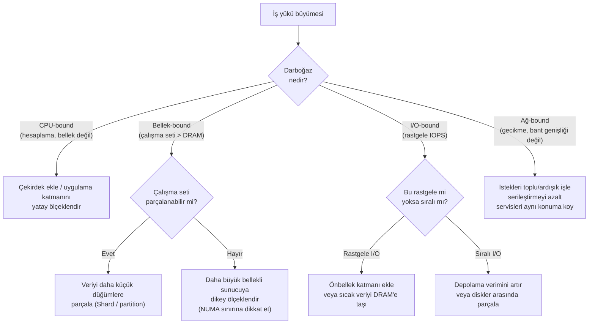

Her mimari karar nihayetinde bir kaynak tahsisi kararıdır. Her bir donanım katmanının — CPU, bellek, depolama, ağ — maliyet-performans eğrisini anlamak, bir sonraki aşamada hangi darboğaza çarpacağınızı ve bunu ertelemenin ne kadara mal olacağını size söyler. Yanlış tahmin yürütmek, ya aşırı tedarik edilmiş (overprovisioned) bir altyapı ya da sabah saat 3'te yaşanan bir olay (incident) ile sonuçlanır.

## CPU Ölçeklendirmesi: Çekirdekler, Frekans ve Bellek Duvarı

Tek iş parçacıklı performans 2006'dan beri fiilen yerinde saymaktadır. Saat frekansları, güç yoğunluğu sınırları — **güç duvarı (power wall)** — nedeniyle 4-5 GHz civarında bir platoya ulaştı. Transistörler küçüldükçe orantılı güç artışı olmadan daha yüksek saat hızlarına izin veren Dennard Ölçeklemesi (Dennard Scaling), hemen hemen aynı zamanlarda çöktü. Endüstri buna daha fazla çekirdek ekleyerek yanıt verdi, bu da farklı bir sorun yarattı: çoğu yazılım, düzinelerce paralel iş parçacığını verimli bir şekilde kullanacak şekilde yazılmamıştır.

Çekirdek sayısı ile verim (throughput) arasındaki ilişki doğrusal değildir. **Amdahl Yasası**, paralelleştirmeden elde edilecek maksimum hızlanmanın, bir programın seri kısmıyla (serial fraction) sınırlandığını belirtir:

```
Hızlanma = 1 / (S + (1 - S) / N)
```

Burada `S`, yürütmenin seri olması gereken kısmını ve `N` paralel çalışanların (iş parçacıklarının) sayısını temsil eder. İş yükünüzün %10'u seriyse, ne kadar paralellik olursa olsun — sonsuz çekirdeğiniz olsa bile — 10 kat hızlanmayı aşamazsınız. Bağlantı yönetimi, istek ayrıştırma (parsing) ve kimlik doğrulama mantığı gibi tam olarak paralelleştirilemeyen gerçek dünya HTTP servislerinde, verim (throughput) mevcut tüm çekirdekler doygunluğa ulaşmadan çok önce platoya ulaşacaktır.

Amdahl'ın ötesinde, **önbellek çekişmesi (cache contention)** vardır. Modern CPU'lar çekirdek başına L1/L2 önbelleklerine ve aynı zar (die) üzerindeki çekirdekler arasında paylaşılan bir L3 önbelleğine sahiptir. Birçok iş parçacığı aynı önbellek satırları (cache lines) için yarıştığında, **sahte paylaşım (false sharing)** performansı düşürür: Aynı 64 baytlık önbellek satırında bulunan farklı değişkenlere yazmaya çalışan iki iş parçacığı, bu satırın çekirdeklerin özel önbellekleri arasında gidip gelmesine (bounce) neden olur ve çekirdekler arası tutarlılık (coherence) trafiği oluşturur.

```go
// Sahte paylaşım: counter0 ve counter1 muhtemelen aynı önbellek satırını kaplar
type BadCounters struct {
    counter0 int64
    counter1 int64
}

// Her sayacın kendi önbellek satırına (64 bayt) girmesini zorlamak için dolgulama (padding)
type PaddedCounters struct {
    counter0 int64
    _pad0    [56]byte
    counter1 int64
    _pad1    [56]byte
}
```

**Bellek duvarı (memory wall)**, yüksek çekirdek sayılarında baskın olan CPU darboğazıdır. DRAM gecikmesi kabaca 60-100ns'dir; bir L1 önbellek isabeti (hit) ise ~1ns'dir. Ana belleği beklerken duraklayan bir CPU, her erişimde 60-100 saat döngüsünü boşa harcar. Yüksek çekirdek sayısına sahip sunucular (64+ çekirdek), hesaplama kapasitesinden önce bellek bant genişliğini doygunluğa ulaştırır. Bu noktadan sonra daha fazla çekirdek eklemek verimde (throughput) sıfır iyileşme sağlar — zamanının çoğunu veri bekleyerek geçiren bir işlem kapasitesi satın almış olursunuz.

```shell
# Çalışan bir Linux sisteminde bellek bant genişliğini ölçün
# mlc (Intel Memory Latency Checker) en doğru tabloyu verir
mlc --bandwidth_matrix

# Alternatif: stream benchmark
# Şununla derleyin: gcc -O3 -fopenmp stream.c -o stream
./stream

# 32 çekirdekli çift soketli bir sunucudaki örnek çıktı:
# Function    Best Rate MB/s  Avg time     Min time     Max time
# Copy:          145230.8     0.022033     0.022034     0.022035
# Scale:         144821.4     0.022097     0.022096     0.022099
# Add:           160430.1     0.029924     0.029920     0.029929
# Triad:         160289.2     0.029958     0.029946     0.029964
```

CPU maliyet eğrisi bu kısıtlamaları yansıtır. Bulut sunucu fiyatlandırması bir aile içinde vCPU sayısıyla kabaca doğrusal ölçeklenir, ancak büyük sunucu tipleri (32xlarge, 48xlarge) vCPU başına %15-30 prim taşır çünkü talep daha düşüktür, marjlar daha yüksektir ve alttaki donanım (ECC bellekli yüksek çekirdekli sunucu, yedekli PSU'lar, raf üstü bant genişliği) birim başına standart orta seviye sunuculardan daha pahalıdır.

## Bellek: Kapasite, Bant Genişliği ve NUMA Vergisi

DRAM kapasitesi, JEDEC DDR standart nesli tarafından yönlendirilen öngörülebilir maliyet adımlarıyla ölçeklenir. DDR5 (2024-2025 itibarıyla güncel ana akım), kanal başına DDR4'ün kabaca 2 katı bant genişliği sağlar, ancak asıl kısıtlama bant genişliği değil, CPU soket tasarımı tarafından sabitlenen **bellek kanalı sayısıdır**.

AMD EPYC veya Intel Xeon işlemcili tipik bir çift soketli sunucu, soket başına 8-12 bellek kanalını destekler ve soket başına ~300-400 GB/s teorik tepe bant genişliği sağlar. Bu, 96 çekirdeğin aynı anda 512 GB'lık bir veri setini taramaya çalıştığı bellek içi (in-memory) bir veritabanını düşünene kadar büyük görünür. Çekirdek başına ~4 GB/s teorik gereksinimle, 384 GB/s bellek bant genişliğine ihtiyaç duyulur — ve artık donanım tavanındasınız demektir.

**NUMA topolojisi, büyük sunucular için bellek maliyet eğrisini katlar.** Çift soketli bir sunucuda, her soketin kendi yerel DRAM'i vardır. Soketler arası bellek erişimi (uzak NUMA erişimi), yerel erişime kıyasla %30-80 oranında gecikme ekler. İşletim sistemleri varsayılan olarak NUMA yerel tahsisi yapmaya çalışır, ancak bellek baskısı altında çekirdek (kernel) uzak düğümlerden tahsis yapar ve performansı sessizce düşürür.

```shell
# Bir süreci NUMA düğümü 0'a sabitleyin ve belleği yerel olarak tahsis edin
numactl --cpunodebind=0 --membind=0 ./servisiniz

# Çalışan bir sürecin (PID 1234) NUMA bellek tahsisini doğrulayın
numastat -p 1234

# Çıktı sütunları: Node0 (yerel) vs Node1 (uzak)
# Node1 sütunlarındaki yüksek değerler NUMA çalkalanmasını (thrashing) gösterir
```

Pratik maliyet etkisi: Bellek optimizasyonlu bulut sunucuları (`r7g`, `x2idn`), özellikle CPU'ya oranla daha fazla DRAM kapasitesi sağladıkları için prim alırlar. Bu prim keyfi değildir; tüm DIMM yuvalarının doldurulmasının donanım maliyetini (BOM) ve yüksek yoğunluklu bellek modüllerinin onaylanmasından kaynaklanan düşük verimi yansıtır.

| Sunucu Sınıfı | Oran (GB RAM / vCPU) | Görece vCPU Maliyeti | Temel Kullanım Durumu |
|---|---|---|---|
| Genel Amaçlı (`m7i`) | 4 GB | 1.0× (baz) | Dengeli iş yükleri |
| İşlem Optimizasyonlu (`c7i`) | 2 GB | 0.8× | CPU-bound, düşük bellek |
| Bellek Optimizasyonlu (`r7i`) | 8 GB | 1.3× | Bellek içi DB, önbellekleme |
| Yüksek Bellekli (`x2idn`) | 32 GB | 3.8× | SAP HANA, büyük bellek içi analitik |
| Depolama Optimizasyonlu (`i4i`) | 4 GB + NVMe | 2.1× | Yüksek IOPS, NVMe-yerel depolama |

Yüksek bellekli sunuculara geçiş, dikey bellek ölçeklendirmesinin mimari olarak pahalı hale geldiği noktayı temsil eder. vCPU başına 3.8 kat maliyetle, durumu bir Redis Cluster üzerinden dağıtmanın veya bir veri setini birden fazla küçük düğüm arasında parçalamanın (partitioning) ekonomisi genellikle daha avantajlı hale gelir — iş yükü geri döndürülemez şekilde durumlu (stateful) ve koordinasyon duyarlı değilse.

## Depolama: Gecikme Hiyerarşisi ve IOPS Ekonomisi

Depolama, bir gecikme ve maliyet hiyerarşisidir. Her katmanın belirgin bir maliyet-performans eğrisi vardır ve yanlış katmanı seçmek hem gereksiz maliyetin hem de beklenmedik darboğazların yaygın bir kaynağıdır.


```
Bileşen             | Gecikme        | Verim (Throughput) | Maliyet (Görece)
--------------------|----------------|-----------------|----------------
CPU L1 önbellek     | ~1 ns          | ~1 TB/s         | Yok (yonga üstü)
CPU L2 önbellek     | ~4 ns          | ~400 GB/s       | Yok (yonga üstü)
CPU L3 önbellek     | ~40 ns         | ~200 GB/s       | Yok (yonga üstü)
DRAM                | ~60-100 ns     | ~100-400 GB/s   | 1× (baz)
NVMe SSD (yerel)    | ~100-200 μs    | ~7 GB/s         | 0.05×
SATA SSD            | ~200-500 μs    | ~500 MB/s       | 0.02×
Ağ Tabanlı          | ~500 μs-2 ms   | ~1-10 GB/s      | 0.005×
(EBS gp3, Azure Premium)
HDD                 | ~5-10 ms       | ~100-200 MB/s   | 0.001×
```

NVMe gecikmesi (~100μs) ile DRAM gecikmesi (~100ns) arasındaki fark 1000 kattır. Bu, depolama performansındaki en önemli rakamdır. **Çalışma setini (working set)** — sık erişilen veri alt kümesi — DRAM'e sığdıramayan herhangi bir iş yükünün performansı, NVMe (veya daha kötüsü, ağ tabanlı depolama) gecikmesi tarafından domine edilecektir.

**Bulut blok depolama alanındaki IOPS maliyetleri doğrusal değildir.** AWS EBS `gp3`, ek ücret ödemeden 3.000 IOPS ve 125 MB/s baz performans sağlar. Bunun ötesindeki tedarik IOPS başına ücretlendirilir ve eğri hızla dikleşir:

```
gp3 maliyet dökümü (yaklaşık, us-east-1):
- Depolama: $0.08/GB/ay
- Baz 3.000 IOPS: Dahil
- Her ek 1.000 IOPS: +$0.005/IOPS/ay
- Maksimum 16.000 IOPS: $0.08/GB + $65/ay IOPS ücreti

io2 Block Express (tutarlı milisaniye altı gecikme için):
- Depolama: $0.125/GB/ay
- IOPS: Baz seviyede $0.065/IOPS/ay
- 50.000 IOPS = Sadece IOPS ücreti olarak aylık $3,250
```

50.000 IOPS seviyesinde, IOPS tedariki için orta seviye bir hesaplama sunucusundan daha fazla ödeme yaparsınız. Bu, iş yükünün yeniden tasarlanması gerektiğine dair ekonomik bir sinyaldir — önüne bir önbellek katmanı eklemek, yazmaları toplu hale getirmek (batching), sıralı I/O modellerine sahip bir LSM-tree depolama motoruna geçmek veya çalışma setinin DRAM'e sığması için veri setini parçalamak gerekir.

:::tip
En yüksek kaldıraçlı depolama optimizasyonu genellikle rastgele I/O'yu azaltmaktır. NVMe üzerindeki sıralı okumalar, aynı verim değerinde rastgele okumalardan 10-50 kat daha hızlıdır; çünkü sıralı I/O, önceden okuma (read-ahead prefetching) yapılmasına izin verir ve arama (seek) maliyetini amorti eder. 1 GB veriyi sıralı okuyan bir iş yükü NVMe üzerinde ~150ms'de tamamlanır; aynı 1 GB'ın 250.000 adet rastgele 4KB okuma olarak yapılması, tipik rastgele okuma gecikmesiyle ~25 saniye sürer.
:::

## Ağ: Bant Genişliği, Gecikme ve Serileştirme Vergisi

Bulut sunucularındaki ağ bant genişliği giderek artmaktadır — büyük sunucularda 100 Gbps standarttır. Daha önemli olan rakam **gecikmedir (latency)**, özellikle aynı kullanılabilirlik alanı (availability zone - AZ) içindeki iş birliği yapan servisler arasındaki gidiş-dönüş süresidir (RTT).

AWS/GCP/Azure üzerinde tipik aynı AZ içi RTT: **0.1-0.5ms**. Bu küçük görünür. Senkronize bir istek-yanıt protokolüyle 1ms RTT'de, bant genişliği veya CPU kullanılabilirliğinden bağımsız olarak, tek bir bağlantı üzerinden teorik maksimum saniyede 1.000 istektir. Bu, bir bant genişliği tavanı değil, **gecikme sınırlı bir eşzamanlılık (concurrency) tavanıdır**.

```
Maksimum istek/sn (tek bağlantı) = 1000ms / RTT
0.2ms RTT'de → 5,000 istek/sn
1ms RTT'de   → 1,000 istek/sn
5ms RTT'de   →   200 istek/sn (tipik AZ'ler arası)
```

Çözüm daha fazla bant genişliği değil; bağlantı çoklama (multiplexing), ardışık düzen (pipelining) veya toplu işlemedir (batching). gRPC'nin HTTP/2 çoklaması, tek bir TCP bağlantısı üzerinden binlerce bekleyen isteğe izin verir. Kafka üreticileri (producers), kayıtları tek bir ağ yazma işleminde toplar. Yüksek verimli sistemlerin mimari olarak asenkron, toplu iletişime yönelmesinin nedeni budur: istek başına düşen gecikme vergisini amorti eder.

**Serileştirme maliyeti (serialization cost)**, ağ performansı eğrisinin sıklıkla gözden kaçan bir bileşenidir. Bir ağ sınırını geçen her nesne, bayt dizisine serileştirilmeli ve karşı tarafta geri serileştirilmelidir (deserialization). REST üzerinden JSON için:

```
10 alanlı bir JSON nesnesi:
- Serileştirme (Go/Jackson): Nesne başına ~1-5 μs
- 100,000 istek/sn'de: Saniyede 100ms-500ms saf serileştirme CPU'su
- İletim boyutu: Nesne başına ~300-500 bayt

Aynı nesne Protobuf ile:
- Serileştirme: Nesne başına ~0.1-0.5 μs
- 100,000 istek/sn'de: Saniyede 10ms-50ms CPU
- İletim boyutu: Nesne başına ~80-120 bayt (3-4 kat daha küçük)
```

Orta ölçekli verimlerde serileştirme maliyeti önemsizdir. 500.000+ istek/sn seviyesinde CPU bütçesinin anlamlı bir parçası haline gelir; bu yüzden ölçekteki Protocol Buffers kullanan gRPC, REST+JSON'a göre ciddi CPU verimlilik kazancı sağlar — bu HTTP/2 ve HTTP/1.1 farkından değil, ikili (binary) serileştirme ile metin serileştirme farkından kaynaklanır.

:::caution
AZ'ler arası ağ trafiği, gözden kaçması kolay iki maliyet taşır: gecikme (0.1-0.5ms aynı AZ yerine 5-20ms RTT) ve dışa aktarım (egress) ücretleri (sağlayıcıya ve bölgeye bağlı olarak GB başına $0.01-0.02). Her istek için senkronize AZ'ler arası çağrılar yapan yüksek verimli bir servis, hem kuyruk gecikmesinde (tail latency) bozulma yaşayacak hem de ciddi bir ağ faturasıyla karşılaşacaktır. Veri yakınlığını ve yerleşimini (placement) AZ topolojisini göz önünde bulundurarak tasarlayın.
:::

## Eğrilerin Birleştiği Yer: Darboğaz Kayması Deseni

Donanım performans eğrileri homojen bir şekilde düşmez — maliyetin doğrusal olmayan bir şekilde hızlandığı **kırılma noktaları (inflection points)** vardır. Bu kırılma noktalarını tanımak, doğru ölçeklendirme kararını yönlendirir.


*Darboğaz kayması karar ağacı. Her donanım katmanının belirgin bir hafifletme stratejisi vardır; darboğazı yanlış tanımlamak pahalı ve etkisiz bir ölçeklendirmeye yol açar.*

Büyüyen bir web servisi için tipik darboğaz ilerleyişi şöyledir:

1. **CPU** — hesaplama ağırlıklı (compute-bound) iş yüklerinin çarptığı ilk sınırdır; durumsuz (stateless) uygulama katmanının yatay ölçeklendirilmesiyle çözülür.
2. **Veritabanı bağlantı havuzu** — bir donanım sınırı değildir ancak öyle davranır; donanım sınırlarına ulaşmadan önce bağlantı havuzlama (PgBouncer, ProxySQL) ile çözülür.
3. **Veritabanı I/O** — birincil veritabanı (primary) üzerindeki rastgele okuma IOPS değeridir; donanım yükseltmelerinden önce okuma replikaları, önbellekleme veya indeks optimizasyonu ile çözülür.
4. **Bellek** — çalışma setinin (working set) mevcut DRAM'i aşması durumudur; çözümlerin (parçalama/sharding, daha büyük sunucular, kademeli depolama/tiered storage) tümü önemli bir karmaşıklık veya maliyet getirdiği için en pahalı kırılma noktasıdır.
5. **Ağ (Network)** — genellikle dahili servisler için en son ulaşılan sınırdır, ancak dışa aktarım (egress) maliyetleri veya AZ'ler arası gecikme (latency) baskın olduğunda ilk olarak ulaşılan sınırdır.

Buradaki mühendislik disiplini, tahmin yürütmek yerine **hangi katmanın gerçekten doygunluğa ulaştığını (saturated) ölçmektir**. Dikey ölçeklendirme her adımda zaman kazandırır; yatay ölçeklendirme ise problemi yeniden yapılandırır ve eğriyi sıfırlar. İki strateji de temel fiziği ortadan kaldırmaz — yalnızca bir sonraki aşamada hangi katmanın tavanına çarpacağını değiştirir.

:::note
Bulut sağlayıcılarının **Tasarruf Planları (Savings Plans) ve Rezerve Edilmiş Sunucuları (Reserved Instances)** maliyet eğrisi karşılaştırmasını temelden değiştirir. İsteğe bağlı (on-demand) fiyatlandırma, büyük sunucuların pahalı görünmesine neden olur; tek bir büyük sunucu üzerinde 3 yıllık rezerve bir taahhüt, eşdeğer kapasitede çok sayıda küçük spot sunucuyu yatay ölçeği yönetme operasyonel yüküyle birlikte çalıştırmaktan daha ucuza gelebilir. Toplam sahip olma maliyeti (TCO) yalnızca altyapı kalemlerini değil, mühendislik zamanını da içermelidir.
:::