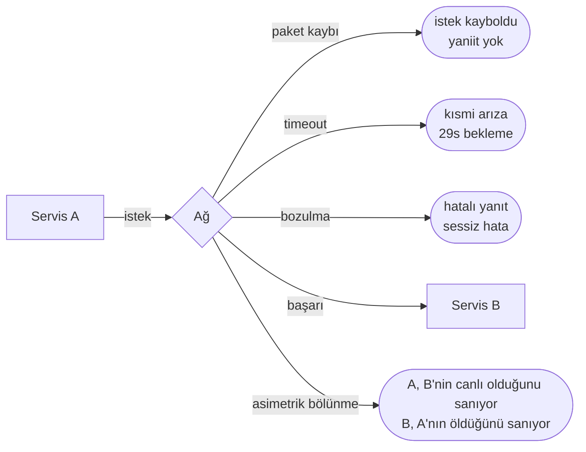
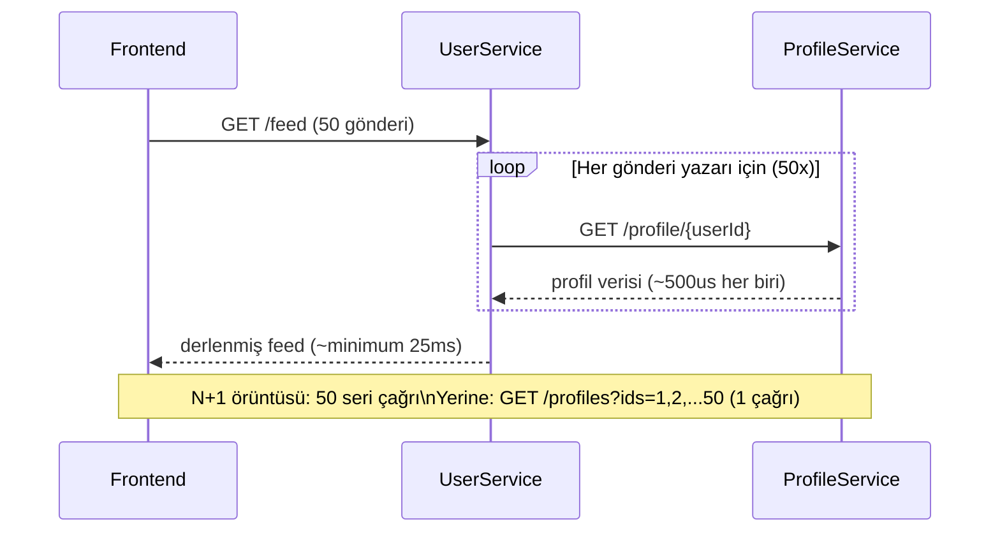
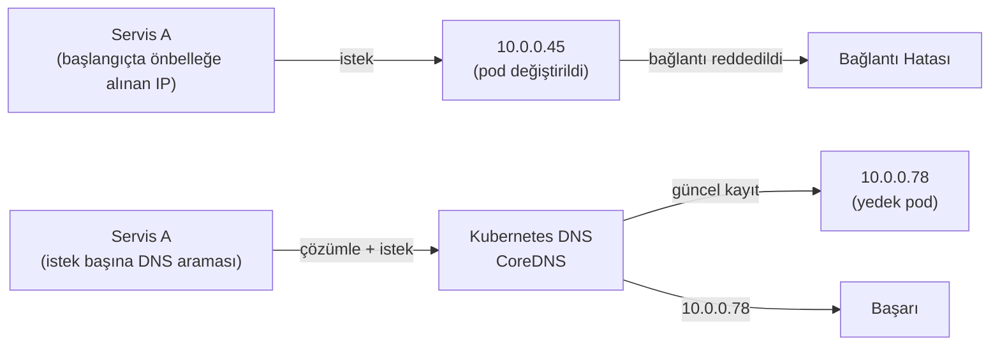
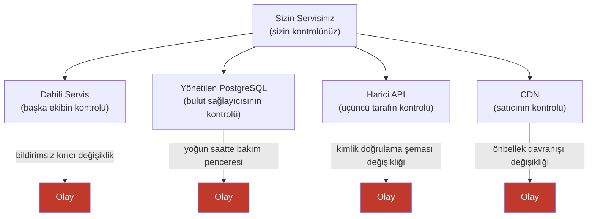

Peter Deutsch ve James Gosling, dağıtık sistemlere yeni başlayan mühendislerin tutarlı biçimde yaptığı sekiz varsayımı resmileştirdi — tek bir makinede doğru olan, ancak bileşenler arasına bir ağ girdiğinde felakete yol açan varsayımlar. Başlangıçta 1990'larda Sun Microsystems'da dile getirilen bu yanılgılar, tarihsel bir merak nesnesi değildir. Bugün dağıtık sistemlerdeki üretim olaylarının büyük çoğunluğunun kök nedenidir; çünkü bu yanılgıların betimlediği varsayımlar bilinçli olarak benimsenmiş inançlar değildir — çoğu programlama dilinde, framework'te ve tek makine geliştirmesinden devralınan zihinsel modellerde örtük varsayılan değerlerdir.
 
Her yanılgı bir hipotezdir. Aşağıdakiler bu hipotezlerin ampirik çürütülmesidir; her birinin ürettiği hata modları ve gerçekliği ele alan mühendislik yanıtlarıyla birlikte.
 
## Yanılgı 1: Ağ Güvenilirdir
 
Bir dağıtık sistemin hiçbir parçası ağdan daha sık güvenilmez değildir; hiçbir varsayım da onu güvenilirmiş gibi ele almaktan daha fazla üretim olayına yol açmaz.
 
Ağ arızaları, özel kod yolları gerektiren istisnai olaylar değildir. Yeterli ölçekteki herhangi bir sistemde sürekli bir arka plan koşuludur. Hata modları çeşitlidir:
 
- **Paket kaybı**, "güvenilir" bulut sağlayıcısı ağları dahil herhangi bir ağ segmentinde meydana gelir. %0,01 paket kayıp oranı, kabaca 10.000 pakette birinin düşürülmesi demektir — sıralamaya bağımlı akış protokolleri için yıkıcıdır.
- **Aralıklı bağlantı kesilmesi**, toplam arızalardan daha zor ele alınan kısmi arızalara yol açar: 29 saniyede başarısız olan bir istek, 50 ms'de başarısız olandan daha kötüdür; çünkü tüm süre boyunca thread'leri, bağlantıları ve kaynakları tutar.
- **Asimetrik bölünmeler**, trafiğin bir yönde akmasına ama diğer yönde akmamasına izin verir. Bir servis heartbeat'leri başarıyla gönderirken hiç yanıt alamayabilir — canlı olduğuna inandığı ama kümenin geri kalanının ölü saydığı koşullar yaratır.
- **Ağ donanımındaki sessiz veri bozulması** (NIC hataları, arızalı switch'ler, aktarım sırasındaki bit çevrilmeleri), verinin TCP düzeyinde hiçbir hata göstergesi olmaksızın hatalı biçimde ulaşmasına neden olur. Ağ üzerinden alınan verilerde sağlama toplamı (checksum) doğrulaması yapmayan uygulamalar bozulmuş veriyle sessizce çalışmaya devam eder.

*İki servis arasındaki dört hata modu: beş sonuçtan yalnızca biri mutlu yoldur.*
 
**Mühendislik yanıtı**, her ağ çağrısını başarısız olabilecek, zaman aşımına uğrayabilecek veya keyfi bir gecikmeden sonra başarılı olabilecek bir işlem olarak ele almak ve her çağrı noktasında savunmacı kod yazmaktır:
 
```go
func callDependency(ctx context.Context, client *http.Client, url string) (*Response, error) {
    // İptal için her zaman context'i aktar
    req, err := http.NewRequestWithContext(ctx, http.MethodGet, url, nil)
    if err != nil {
        return nil, fmt.Errorf("istek oluşturma: %w", err)
    }
 
    // Her giden çağrıda açık timeout -- varsayılana (sonsuz) asla güvenme
    ctx, cancel := context.WithTimeout(ctx, 2*time.Second)
    defer cancel()
 
    resp, err := client.Do(req)
    if err != nil {
        // Circuit breaker kararları için timeout'u diğer hatalardan ayırt et
        if errors.Is(err, context.DeadlineExceeded) {
            return nil, fmt.Errorf("bağımlılık 2s sonra timeout: %w", err)
        }
        return nil, fmt.Errorf("bağımlılık çağrısı başarısız: %w", err)
    }
    defer resp.Body.Close()
 
    if resp.StatusCode >= 500 {
        return nil, fmt.Errorf("bağımlılık %d döndürdü", resp.StatusCode)
    }
 
    // Limit ile oku -- ağ üzerinden gelen boyuta asla güvenme
    body, err := io.ReadAll(io.LimitReader(resp.Body, 10*1024*1024))
    if err != nil {
        return nil, fmt.Errorf("yanıt okuma: %w", err)
    }
 
    return parseResponse(body)
}
```
 
## Yanılgı 2: Gecikme Sıfırdır
 
Ağ üzerindeki fonksiyon çağrılarının ihmal edilebilir maliyeti olduğu varsayımı, servis odaklı mimarilerde kasıtsız performans düşüşünün tek en yaygın nedenidir.
 
Tek bir makinedeki fonksiyon çağrısı nanosaniyeler içinde tamamlanır. Aynı veri merkezindeki 10 GbE ağı üzerinden yapılan servisler arası çağrı, hafif yük altında ~100-500 µs sürer. Yük altında, kuyruklama nedeniyle aynı çağrı 5-50 ms sürer. Availability zone'lar arasında 2-10 ms. Bölgeler arasında 30-300 ms. Bu sayılar daha iyi donanımla müzakere edilemez; sinyal yayılma fiziği ve OS ağ stack yükü tarafından belirlenir.
 
Bu yanılgının hata modu, **N+1 sorgu sorunlarının** kılık değiştirmiş halidir. Bir varlık yükleyen ve ardından ilişkili her varlığı çözümlemek için bağlantı başına bir ağ çağrısı yapan bir servis, N+1 SQL anti-deseninin dağıtık karşılığıdır. Her biri ayrı bir arama çağrısı gerektiren 50 kullanıcı profilini gösteren bir sayfa, 50 seri veya paralel ağ round-trip'i oluşturur — en iyi durumda minimum 50 × 500 µs = 25 ms, herhangi bir çakışma altında çok daha fazla.
 

*Dağıtık N+1 örüntüsü: tek bir toplu çağrının yeteceği yerde 50 seri arama.*
 
**Mühendislik yanıtı**, toplu işlemi destekleyen API'ler tasarlamak, seri gerekmediğinde asenkron paralel çağrılar kullanmak ve her performans bütçesinde ağ gecikmesini hesaba katmaktır:
 
```python
from typing import List
import asyncio
import aiohttp
 
# Anti-desen: seri çağrılar
async def get_profiles_serial(user_ids: List[int]) -> List[dict]:
    profiles = []
    async with aiohttp.ClientSession() as session:
        for uid in user_ids:  # N ağ round-trip'i
            async with session.get(f"/profile/{uid}") as resp:
                profiles.append(await resp.json())
    return profiles
 
# Doğru: tek toplu çağrı, veya toplu API yoksa paralel
async def get_profiles_batched(user_ids: List[int]) -> List[dict]:
    async with aiohttp.ClientSession() as session:
        ids_param = ",".join(str(uid) for uid in user_ids)
        async with session.get(f"/profiles?ids={ids_param}") as resp:
            return await resp.json()  # N'den bağımsız olarak 1 ağ round-trip'i
 
# Toplu işlem yokken: eşzamanlılık sınırlı paralel
async def get_profiles_parallel(user_ids: List[int], max_concurrent: int = 10) -> List[dict]:
    semaphore = asyncio.Semaphore(max_concurrent)
    async def fetch_one(uid: int) -> dict:
        async with semaphore:
            async with aiohttp.ClientSession() as session:
                async with session.get(f"/profile/{uid}") as resp:
                    return await resp.json()
    return await asyncio.gather(*[fetch_one(uid) for uid in user_ids])
```
 
## Yanılgı 3: Bant Genişliği Sonsuzdur
 
Bant genişliği kısıtlamaları, modern ağların yeterli görünen başlık verim sayıları sunması nedeniyle sinsidir — ta ki sunmayana kadar. İki rack arasındaki 10 Gbps ağ bağlantısı, uygulama trafiği için sınırsız görünür ve öyledir; ta ki toplu veri transferi, log göndericisi veya yedekleme işi eşzamanlı çalışarak bağlantıyı doyuruncaya kadar. Doygunlukta, kuyruklama nedeniyle aynı bağlantıdaki diğer tüm trafik için gecikme dramatik biçimde artar.
 
Bant genişliği yanılgısı, mikro servis mimarilerinde iki özel hata modu üretir.
 
**Geveze protokoller.** Yalnızca iki alan değiştiğinde 10 KB'lık kaydın tam durumunu göndererek her çağrıda büyük etki alanı nesnelerini seri hale getiren bir servis, bant genişliğini ve seri hale getirme CPU'sunu gereksiz yere harcar. Hata modu incedir: servis ağların kısıtsız olduğu geliştirme ortamında doğru çalışır, ardından birçok örnek aynı anda iletişim kurduğunda üretim yükü altında bozulur.
 
**Sınırsız yanıt boyutları.** Sayfalama yapmak yerine bir koleksiyondaki tüm kayıtları döndüren bir API, istemcilerin yanlışlıkla çok gigabaytlık yanıtlar istemesine izin verir. Tam tablo taraması döndüren tek bir yanlış kapsamlı sorgu, çağıran servisin heap'ini ve ağ tamponunu aynı anda tüketir.
 
**Mühendislik yanıtı**, baştan ağ verimliliği için tasarım yapmaktır:
 
```protobuf
// gRPC/Protobuf: ikili serileştirme, hat açısından verimli alan kodlaması
// Yalnızca değişen alanları gönder -- güncellemeler için tam nesne serileştirmesinden kaçın
message UserProfileUpdate {
    string user_id = 1;                    // her zaman gerekli
    optional string display_name = 2;      // yalnızca değişmişse ayarla
    optional string avatar_url = 3;        // yalnızca değişmişse ayarla
    google.protobuf.Timestamp updated_at = 4;
    // DEĞİL: 40 alanlı tam UserProfile nesnesi
}
 
// Herhangi bir koleksiyon uç noktası için sayfalama zorunludur
message ListOrdersRequest {
    string customer_id = 1;
    int32 page_size = 2;       // sunucu tarafında zorunlu maks, örn. 100
    string page_token = 3;     // imleç (cursor), ofset değil -- ofset O(N)
}
```
 
:::caution
Bir servis uç noktasından sınırsız koleksiyon döndürmeyin. Bir müşteri için tüm siparişleri döndüren `GET /orders`, gizli bir üretim olayıdır: 10 test kaydıyla geliştirmede doğrudur, bir müşteri üç yılda 50.000 sipariş biriktirdiğinde felaket olur. İstemcinin ne istediğinden bağımsız olarak her zaman sunucu tarafı sayfalama limitlerini zorunlu kılın.
:::
 
## Yanılgı 4: Ağ Güvenlidir
 
Dağıtık sistemlerdeki güvenlik varsayımları her katmanda işler — taşıma, kimlik, yetkilendirme ve veri bütünlüğü — ve herhangi bir katmandaki arızalar, tek makine güvenlik arızasından niteliksel olarak farklı sonuçlar üretir; çünkü saldırı yüzeyi tüm ağ dokusudur.
 
Dağıtık sistemin tehdit modeli şunları içerir:
- Şifrelenmemiş servisler arası trafik üzerinde **gizlice dinleme** (VPC içinde ilgili; herhangi bir paylaşılan ağ altyapısı için ilgili)
- TLS sertifikalarını doğrulamayan veya sabitleme olmaksızın öz imzalı sertifikalar kullanan servislere **ortadaki adam** saldırıları
- **Yetkisiz yanal hareket** — ele geçirilen bir servisin, ağ çevresindeki herhangi bir çağrıcının güvenilir olduğunu varsayan dahili API'leri çağırması
- İsteklere zaman damgası veya nonce dahil etmeyen API'lere **replay saldırıları**
"Ağ güvenlidir" yanılgısının özel hata modu, **örtük dahili güven sınırıdır**: özel bir ağ veya VPC içinden gelen trafiğin kimlik doğrulama veya yetkilendirmeye ihtiyaç duymadığı varsayımı. Bu, sıfır güven mimarisinin açıkça reddettiği merkezi öncüldür. API'sinde kimlik doğrulama token'ı gerektirmeyen dahili bir servis, herhangi bir çevre bileşeni ihlal edilirse tam dahili güvenlik açığından yalnızca bir yanal hareket uzaklığındadır.
 
**Mühendislik yanıtı**, servisler arası kimlik doğrulama için mTLS (mutual TLS), kritik işlemler için imzalı istek yükleri ve güven sınırı olarak ağ konumunu değil kimliği ele alan yetkilendirme kontrolleri içerir:
 
```yaml
# Istio PeerAuthentication -- tüm mesh içi trafik için mTLS'i zorunlu kıl
apiVersion: security.istio.io/v1beta1
kind: PeerAuthentication
metadata:
  name: default
  namespace: production
spec:
  mtls:
    mode: STRICT   # Geçiş sırasında PERMISSIVE, kararlı durumda STRICT
 
---
# AuthorizationPolicy -- açık izin listesi, varsayılan olarak reddet
apiVersion: security.istio.io/v1beta1
kind: AuthorizationPolicy
metadata:
  name: order-service-authz
  namespace: production
spec:
  selector:
    matchLabels:
      app: order-service
  action: ALLOW
  rules:
    - from:
        - source:
            principals: ["cluster.local/ns/production/sa/api-gateway"]
            # Yalnızca API gateway, order-service'i doğrudan çağırabilir
      to:
        - operation:
            methods: ["GET", "POST"]
            paths: ["/orders/*"]
```
 
## Yanılgı 5: Topoloji Değişmez
 
Bir servisin başlangıçta keşfettiği ağ topolojisi, bir saat, bir gün veya bir hafta sonra üzerinde çalıştığı topoloji olmayacaktır. Kubernetes kümesinde pod IP adresleri her pod yeniden başladığında değişir. Küme otomatik ölçeklemesi node'lar ekler ve kaldırır. Rolling deployment'lar IP adresleri arasında döner. Servis mesh yapılandırmaları gerçek zamanlı güncellenir. DNS TTL'leri sona erer ve farklı adreslerle yenilenir.
 
Topolojiyi statik olarak ele almanın hata modu, **eski servis keşfidir**: başlangıçta bir servisin IP'sini çözümleyen ve sonsuza kadar önbelleğe alan bir istemci, o host değiştirildiğinde ölü bir host'a istek yönlendirir. Arıza gecikimli ve aralıklıdır — servis önbelleğe alınan IP bayatlayana kadar çalışır, ardından günler veya haftalar boyunca doğru çalıştıktan sonra üretimde başarısız olur; bu da onu ilgisiz bir değişiklikten gelen bir gerileme gibi gösterir.
 

*Statik IP önbelleklemesi ve dinamik DNS çözümleme karşılaştırması: önbelleğe alınan IP ölü bir pod'a yönlenirken, DNS çözümleyen istemci doğru yönlendirir.*
 
**Mühendislik yanıtı**, IP adreslerini asla sabit kodlamamak, DNS TTL'lerine uymak ve mantıksal servis kimliğini fiziksel ağ konumundan ayıran servis mesh veya servis kayıt defteri soyutlamalarını kullanmaktır:
 
```go
// YANLIŞ: başlangıçta bir kez çözümle, sonsuza kadar önbelleğe al
var serviceAddr = net.LookupHost("order-service.production.svc.cluster.local")
 
// DOĞRU: DNS TTL'lerine saygı duyan bir transport ile HTTP istemcisi kullan
// Go'nun net/http DefaultTransport bunu önbelleğe almalı Resolver aracılığıyla zaten yapıyor
// ancak üretim için açık yapılandırma:
transport := &http.Transport{
    DialContext: (&net.Dialer{
        Timeout:   5 * time.Second,
        KeepAlive: 30 * time.Second,
        // Topoloji değişikliklerini daha hızlı yakalamak için azaltılmış DNS önbelleği TTL'li Resolver
    }).DialContext,
    MaxIdleConnsPerHost:   100,
    IdleConnTimeout:       90 * time.Second,
    TLSHandshakeTimeout:   10 * time.Second,
    ResponseHeaderTimeout: 10 * time.Second,
    DisableKeepAlives:     false,
}
 
client := &http.Client{Transport: transport}
// Her istek doğal olarak TTL sona erme ile OS çözümleyicisi aracılığıyla yeniden çözümler
```
 
## Yanılgı 6: Yalnızca Bir Yönetici Vardır
 
Tek makineli bir sistemin tek bir yönetim alanı vardır: tek bir ekip işletim sistemini, uygulamayı, yapılandırmayı ve bağımlılıkları kontrol eder. Bulut altyapısı, yönetilen Kubernetes, üçüncü taraf veritabanları, harici API'ler, CDN'ler ve SaaS entegrasyonları üzerinde dağıtılan dağıtık sistem, aynı anda birçok yönetim alanı altında çalışır — her birinin kendi değişim temposu, olay müdahale süreci ve önceden haber vermeksizin sisteminizi etkileyebilecek operasyonel kararları vardır.
 
Bu yanılgı, **bağımlılık bağlantı arızalarını** üretir: kimlik doğrulama şemasını değiştiren üçüncü taraf API, yoğun trafik pencerenizde sürüm yükseltmesi uygulayan yönetilen veritabanı sağlayıcısı, yapılandırma güncellemesinde önbelleğe alma davranışını değiştiren CDN veya koordinasyon olmaksızın kırıcı API değişikliği dağıtan dahili ekip.
 
Mühendislik yanıtları savunmacı ama gereklidir:
 
- Yalnızca harici API'lerde değil, tüm servis arayüzlerinde açık kullanımdan kaldırma politikalarıyla **versiyonlanmış API sözleşmeleri**. Versiyonlama olmaksızın dahili kırıcı değişiklikler, mikro servis organizasyonlarında ekipler arası olayların tek en yaygın nedenidir.
- Değişiklik üretime ulaşmadan önce sağlayıcı değişikliklerinin bilinen tüketicileri bozmadığını doğrulayan **tüketici güdümlü sözleşme testi** (Pact veya benzeri).
- Üçüncü taraf bağımlılıklar için **zarif bozulma**: harici bir öneri API'sine bağımlı bir özellik, kullanıcılara `500` döndürmek yerine statik bir yedek sunum kullanarak bozulmalıdır.
- Her dahili servisin hangi harici servislere bağımlı olduğunu, her biri için açık SLA takibiyle izleyen **bağımlılık envanteri**.

*Dört harici yönetim alanına sahip bir servis: her biri kontrolünüz dışında bağımsız bir arıza kaynağıdır.*
 
## Yanılgı 7: Taşıma Maliyeti Sıfırdır
 
Dağıtık sistemde bileşenler arasında veri taşımak hiçbir zaman ücretsiz değildir ve maliyetler ağ bant genişliği ücretleriyle sınırlı değildir. Taşıma maliyetinin üç boyutu vardır: **zaman maliyeti** (serileştirme ve seriden çıkarma CPU'su), **para maliyeti** (çıkış ücretleri, bant genişliği kullanımı) ve **karmaşıklık maliyeti** (protokol yükü, versiyonlama, şema evrimi).
 
**Serileştirme maliyeti** sıklıkla küçümsenir. Ortalama 2 KB yük ile saniyede 100.000 RPS'de çalışan yüksek verimli bir servisteki JSON serileştirmesi, saniyede 200 MB JSON serileştirme ve seriden çıkarmayı gerektirir. Modern CPU'da JSON ayrıştırma yaklaşık 200-500 MB/s hızında çalışır; bu, JSON işlemenin tek başına bu verimde bir ila iki tam CPU çekirdeği tüketebileceği anlamına gelir. İkili formatlar (Protocol Buffer, MessagePack, Avro) 1-5 GB/s hızında ayrıştırılır ve aynı CPU bütçesi için 5-10 kat verim iyileştirmesi sağlar.
 
**Çıkış maliyeti**, sıklıkla göz ardı edilen bir mimari endişedir. Büyük bulut sağlayıcıları, giden veri transferi için GB başına $0,08-$0,09 ücret alır. Büyük nesneleri bölgeler arasında çoğaltan veya genel internet üzerinden istemcilere büyük yükler döndüren bir servis, hesaplama maliyetlerini gölgede bırakan önemli çıkış faturaları oluşturabilir. Veriyi bir bölgede depolayıp başka bir bölgede işlemek — hesaplama perspektifinden makul — çıkış maliyetleri düzgünce hesaba katıldığında ekonomik açıdan irrasyonel olabilir.
 
| Format | Ayrıştırma hızı | JSON'a kıyasla boyut | Versiyonlama |
|---|---|---|---|
| JSON | 200-500 MB/s | 1× (temel) | İnsan tarafından okunabilir, şema zorunluluğu yok |
| Protocol Buffer | 1-3 GB/s | 0,3-0,5× (önemli ölçüde daha küçük) | Alan numarası tabanlı, geriye dönük uyumlu |
| Apache Avro | 800 MB/s - 1,5 GB/s | 0,4-0,6× | Şema kayıt defteri gerekli, zengin evrim |
| MessagePack | 500 MB/s - 1 GB/s | 0,5-0,7× | Şema zorunluluğu yok |
| FlatBuffers | 3-5 GB/s (sıfır kopya) | 0,5-1× | Sıfır seriden çıkarma — doğrudan bellek erişimi |
 
**Mühendislik yanıtı**, serileştirme formatlarını varsayılan değerlere göre değil, gerçek verim gereksinimlerine ve operasyonel kısıtlamalara göre seçmektir:
 
```protobuf
syntax = "proto3";
package order.v1;
 
// Protocol Buffer: kompakt ikili, şema zorunlu, geriye dönük uyumlu
// Alan ekleme: yeni alan numaraları kullan, asla yeniden kullanma
// Alan kaldırma: reserved olarak işaretle, numarayı kayıt defterinden asla kaldırma
message Order {
    string order_id = 1;
    string customer_id = 2;
    repeated OrderLineItem line_items = 3;
    OrderStatus status = 4;
    google.protobuf.Timestamp created_at = 5;
    google.protobuf.Timestamp updated_at = 6;
    // Alan 7, gelecekteki payment_method_id için ayrılmış
    reserved 7;
    reserved "payment_method_id";
}
 
enum OrderStatus {
    ORDER_STATUS_UNSPECIFIED = 0;  // proto3 sıfır değerli varsayılan gerektirir
    ORDER_STATUS_PENDING = 1;
    ORDER_STATUS_CONFIRMED = 2;
    ORDER_STATUS_SHIPPED = 3;
    ORDER_STATUS_DELIVERED = 4;
    ORDER_STATUS_CANCELLED = 5;
}
```
 
## Yanılgı 8: Ağ Homojendir
 
Dağıtık sistem bileşenlerini bağlayan ağ, düzgün ve şeffaf bir ortam değildir. Donanımın (switch'ler, router'lar, load balancer'lar, güvenlik duvarları, NAT cihazları), protokollerin (IPv4, IPv6, VXLAN overlay'leri, MPLS omurgaları) ve her biri kendi kısıtlamalarını, sınırlamalarını ve davranışlarını dayatan — uygulamalara çoğunlukla görünmez olan — politika uygulama noktalarının heterojen bir koleksiyonudur.
 
Heterojenliğin pratik sonuçları:
 
**MTU uyuşmazlıkları.** Farklı ağ segmentleri farklı Maksimum İletim Birimi (MTU) boyutlarına sahiptir. Standart Ethernet MTU'su 1.500 bayttır. Jumbo frame'ler bunu destekleyen ağlarda bunu 9.000 bayta kadar çıkarır. VXLAN overlay'leri 50-54 bayt kapsülleme yükü ekler ve uygulamalara kullanılabilir efektif MTU'yu azaltır. Yol MTU'sundan büyük bir paket ya parçalara ayrılır (gecikme ve parça yeniden birleştirme maliyeti ekler) ya da düşürülür (tüm protokol uygulamaları tarafından doğru şekilde yeniden denenmez). VXLAN overlay içeren ağ segmentleri arasında büyük frame'ler gönderen gRPC bağlantıları, MTU uçtan uca doğru yapılandırılmamışsa sessizce bağlanamaz.
 
**Orta kutu müdahalesi.** Durum bilgisi olan güvenlik duvarları, NAT cihazları ve load balancer'lar, boşta kalma zaman aşımı politikalarıyla bağlantı durum tabloları tutar. Orta kutunun zaman aşımından (genellikle 60-300 saniye) daha uzun süre boşta kalan TCP bağlantısının durumu sessizce düşürülür. O bağlantıdaki bir sonraki paket, orta kutudan TCP RST'ye neden olur — uygulamaya zaman aşımı değil, beklenmedik bağlantı sıfırlama gibi görünen bir arıza. Bu nedenle veritabanı connection pool'ları, yoldaki en kısa orta kutu zaman aşımından daha kısa `keepalive` ayarları yapılandırmalıdır.
 
**IPv4 ile IPv6 dual-stack davranışı.** IPv6'yı yanlış işleyen uygulamalar ve kütüphaneler — yalnızca IPv4'e bağlanan, dize ayrıştırmada IPv4 adres biçimini varsayan, URL'lerde IPv6 adres literallerini işleyemeyen (`http://[::1]:8080/`) — topolojiye bağımlı arızalar üretir: IPv4 ortamlarında çalışır, dual-stack ortamlarında sessizce veya gizemli biçimde başarısız olur.
 
:::tip
Veritabanı bağlantılarında ve uzun ömürlü HTTP/2 bağlantılarında her zaman TCP `keepalive` yapılandırın. Standart öneri `keepalive_time = 60s`, `keepalive_interval = 10s`, `keepalive_probes = 6`'dır. Bu, OS'nin 60 saniyelik boşta kalma süresi sonrasında keepalive probe'ları göndermesini sağlar; ölü bağlantıları tespit eder ve orta kutu durum tablosu süresinin dolmasının bağlantıları sessizce sahipsiz bırakmasını önler.
 
```go
import "net"
 
dialer := &net.Dialer{
    KeepAlive: 30 * time.Second, // 30s boşta kaldıktan sonra keepalive probe'ları gönder
    Timeout:   5 * time.Second,
}
// Bu dialer ile oluşturulan tüm bağlantılarda TCP keepalive etkin olacak
```
:::
 
**Ağ heterojenliğine mühendislik yanıtı**, geliştirme ortamında çalışan bir protokolün üretimde aynı şekilde davranacağını asla varsaymamak ve tüm yol segmentlerinde ağ davranışını doğrulamaktır:
 
```shell
# Hedefe yol MTU'sunu keşfet -- parçalama sorunlarını teşhis etmek için kritik
tracepath -n 10.0.0.1
 
# No-fragment biti ayarlı belirli MTU'yu test et
ping -M do -s 1400 10.0.0.1   # Linux
ping -D -s 1400 10.0.0.1      # macOS
 
# Mevcut bağlantılarda TCP keepalive'ı kontrol et
ss -tnp | grep ESTABLISHED
 
# Bir socket'te TCP keepalive'ın gerçekten yapılandırıldığını doğrula
ss -tnop state established | grep timer
```
 
## Bileşik Etki: Birden Fazla Yanılgı Etkileşime Girdiğinde
 
Üretim olaylarında bu yanılgılar nadiren tek başına ortaya çıkar. En şiddetli kesintiler birden fazla yanlış varsayımı aynı anda birleştirir.
 
Temsili bir kaskad:
1. **Topoloji değişimi** (Yanılgı 5): Kubernetes rolling deployment'ı pod IP'leri döndürür.
2. **Ağ güvenilirliği arızası** (Yanılgı 1): Kısa süreli ağ bölünmesi yeni pod'ların bir alt kümesini izole eder.
3. **Sıfır gecikme varsayımı** (Yanılgı 2): Servisler, yeni çevrilen pod'lara senkron N+1 çağrılar yapar; her biri tam zaman aşımı için bekler.
4. **Thread pool tükenmesi**: Bekleyen thread'ler, bölünmüş pod'lara mevcut tüm bağlantıları tüketir.
5. **Sonsuz bant genişliği varsayımı** (Yanılgı 3): Retry fırtınaları toparlanmakta olan node'lara amplifikasyonlu trafik gönderir.
6. **Tek yönetici varsayımı** (Yanılgı 6): Deployment'ı tetikleyen Kubernetes yükseltmesi, platform ekibi tarafından uygulama ekibinin yoğun trafik penceresiyle koordine edilmeden uygulandı.
Bu olayın postmortem'i her birini katkıda bulunan bir faktör olarak doğru biçimde tanımlayacaktır. Önleme, her yanılgıyı ayrı ayrı düzeltmek değildir — baştan doğru varsayımla sistemler tasarlamaktır: **ağlar başarısız olur, sıfır olmayan gecikmeye sahiptir, sonlu bant genişliği, kimlik doğrulama gerektirir, topoloji değişir, birden fazla yönetim alanına sahiptir, sıfır olmayan taşıma maliyeti ve düzgün olmayan davranışa sahiptir**. Ağ sınırını aşan her bileşen, bu fiziksel ve operasyonel gerçeklikler tarafından yönetilen bir ortamla etkileşime girmektedir ve mimari bunu yansıtmalıdır.
 
Bu özelliklerin belirli ağ arızası senaryolarında nasıl tezahür ettiğine dair daha derin bir analiz için bkz. [Ağ Güvenilirliği, Bant Genişliği Sınırları ve Topoloji Değişiklikleri](/distributed-systems/tr/foundations/monoliths-to-distributed/network-reliability/).
Ağ yanılgılarının crash-stop, omission ve Byzantine hata modlarına nasıl çevrildiğine ilişkin resmi sınıflandırma için bkz. [Hata Modelleri](/distributed-systems/tr/foundations/system-models/failure-models/).