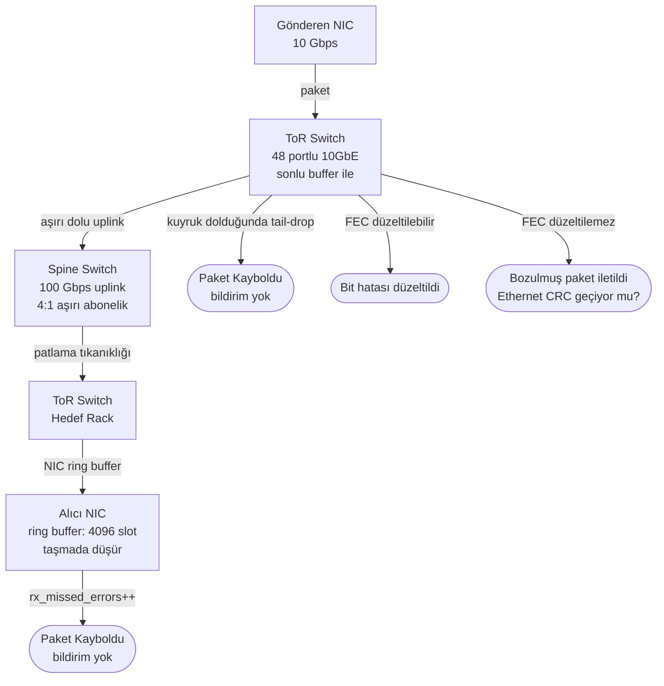
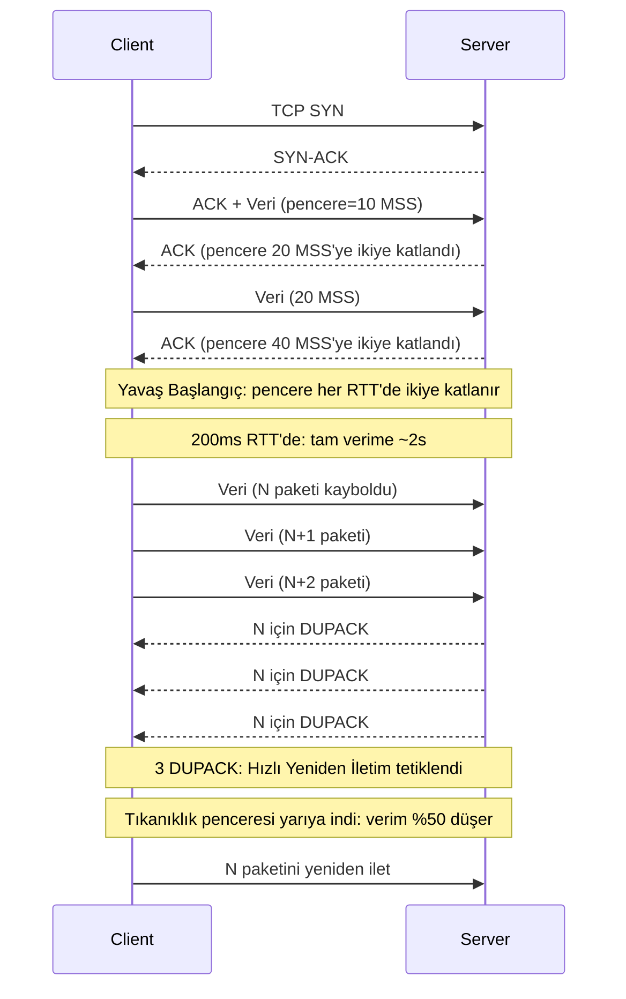
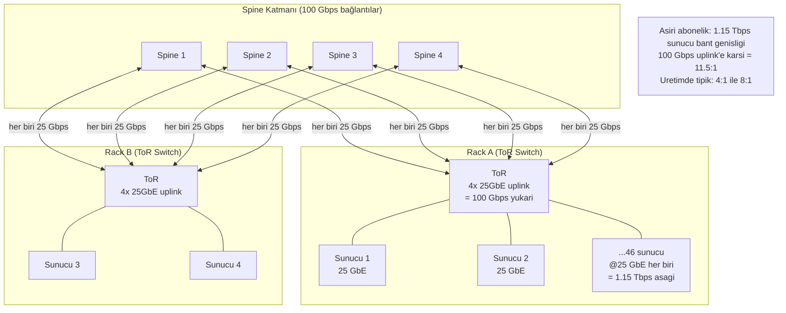
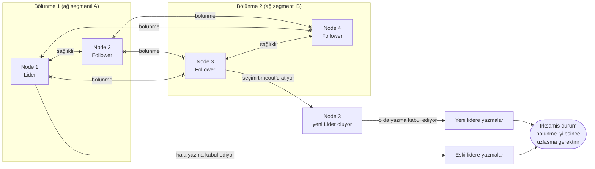
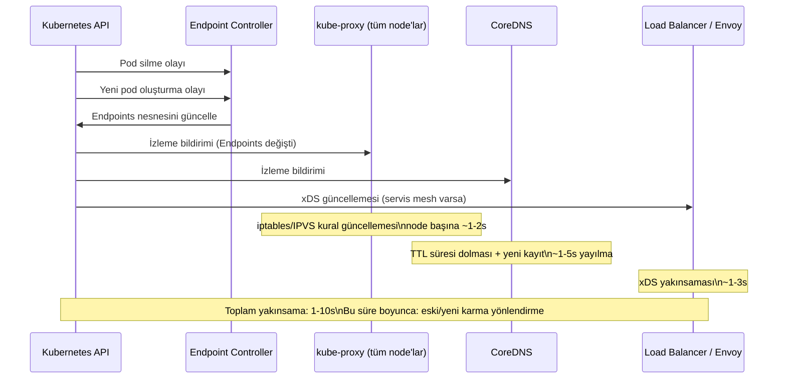
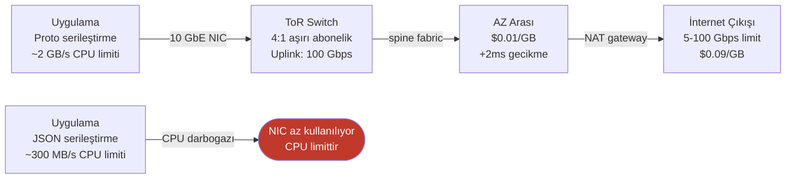

Ağ güvenilirliği ikili bir özellik değildir. Ağ "açık" ya da "kapalı" değildir — kısmi bozulmanın sürekli bir spektrumunda çalışır: paketler, yola, yüke, donanım sağlığına ve günün saatine göre değişen oranlarda geciktirilir, yeniden sıralanır, kopyalanır ve sessizce düşürülür. Ağı ya tam işlevsel ya da tamamen mevcut değil olarak ele alan dağıtık sistemler üretimde başarısız olur; çünkü en kötü arızalar total değildir — kısmi, aralıklı ve onları deneyimleyen uygulamalara çoğunlukla görünmezdirler.
 
Ağı anlamak, onu aynı anda üç düzeyde anlamayı gerektirir: fiziksel katman (kablolar, switch'ler, NIC'ler), protokol katmanı (TCP tıkanıklık kontrolü, yeniden iletim, head-of-line blocking) ve topoloji katmanı (bileşenlerin nasıl bağlandığı ve bu bağlantıların zaman içinde nasıl değiştiği). Her katmandaki arızaların kendine özgü imzaları vardır ve kendine özgü yanıtlar gerektirir.
 
## Fiziksel Katman: Paketlerin Gerçekte Nerede Öldüğü
 
Paket kaybı donanımdan başlar. Mekanizmalar sıradan görünebilir; ancak dağıtık sistemler için sonuçları ağırdır.
 
**NIC ring buffer taşması.** Bir Ağ Arabirimi Kartı (NIC), alınan paketler için host belleğinde sabit boyutlu bir ring buffer tutar. Çekirdek interrupt handler'ı bu buffer'ı yeterince hızlı boşaltamadığında — CPU doygunluğu, yüksek interrupt hızı olayları veya NUMA-yerel bellek çakışması sırasında — buffer taşar ve gelen paketler sessizce düşürülür. NIC bir donanım sayacını artırır (`rx_missed_errors`, `ethtool -S <interface>` aracılığıyla görülebilir), ancak ICMP hatası oluşturulmaz, TCP bildirimi gönderilmez ve uygulamanın kayba doğrudan görünürlüğü yoktur.
 
**Switch buffer tıkanıklığı.** Ağ switch'lerinin sonlu girdi ve çıktı kuyrukları vardır. Trafik, aşırı dolu uplink, trafik patlaması veya çıkış portundaki yavaş bir tüketici nedeniyle yönlendirildiğinden daha hızlı geldiğinde, kuyruk dolar ve tail-drop ek paketleri atar. Modern switch'ler, tüm kuyruklar aynı anda dolduğunda tüm TCP akışlarının global TCP senkronizasyon çöküşüne neden olmak yerine bireysel TCP akışlarını erken düşürmeyi tercih ederek kuyruklardaki paketleri olasılıksal olarak atmak için WRED (Weighted Random Early Detection) kullanır.
 
**Fiziksel ortam hataları.** Fiber optik alıcı-vericiler zamanla bozulur ve tam arızadan önce yükselen bit hata oranları üretir. 10 Gbps bağlantı üzerinde 10⁻⁹ BER (milyar iletilen bit başına bir bit hatası) ile çalışan bir alıcı-verici saniyede yaklaşık 10 hata üretir — fiziksel katmanda FEC (İleri Hata Düzeltme) tarafından düzeltilecek kadar düşük, ancak TCP yeniden iletimlerinin fark edildiği kadar bozulmuş. Uygulama katmanındaki imza, uygulama metriklerinde görünür bir neden olmaksızın yükselen p99 gecikmesidir.
 
**Sessiz veri bozulması.** Ağ donanımı, özellikle yüksek hat hızlarında, Ethernet CRC kontrolünden geçen bozuk içerikli paketleri zaman zaman iletir. Bu, switch ASIC'lerindeki bit çevrilmeleri, paket buffer'larındaki DRAM bit hataları ve geçici elektriksel müdahaleden kaynaklanır. TCP sağlama toplamları 16 bit olup kriptografik bütünlük sağlamaz — bozulmaların çoğunu ama tamamını yakalar. Güvenilmez ağ yolları üzerinde veri bütünlüğü gerektiren uygulamaların, taşıma katmanı garantilerinden bağımsız olarak yük içeriğinde uygulama katmanı sağlama toplamları (CRC32, xxHash) uygulaması gerekir.
 

*İki atlamalı veri merkezi yolu boyunca dört kayıp ve bozulma noktası: hiçbiri uygulamaya görünür ICMP hatası oluşturmaz.*
 
## Stres Altında TCP: Ağ Başarısız Olduğunda Protokol Ne Yapar
 
TCP'nin güvenilirlik mekanizmaları — yeniden iletim, akış kontrolü, tıkanıklık kontrolü — paket kaybının birincil tıkanıklık sinyali olduğu bir dünya için tasarlanmıştır. Bu mekanizmaların gerçekçi ağ stresi altında ne yaptığını anlamak, yük altında öngörülebilir davranan dağıtık sistemler tasarlamak için önkoşul bilgisidir.
 
### Tıkanıklık Kontrolü ve Hata Modları
 
TCP tıkanıklık kontrolü, paket kaybının rastgele fiziksel hatalardan değil tıkanıklıktan kaynaklandığını varsayar. Bir kayıp tespit edildiğinde (yinelenen ACK'lar veya RTO süresi aşımı ile), TCP tıkanıklık penceresini keserek verimi düşürür. Rastgele kayıp oranlarının düşük olduğu yüksek kaliteli veri merkezi ağlarında bu varsayım makuldür. Daha yüksek doğal kayıp oranlarına sahip WAN yollarında veya ağır yüklü veri merkezi ağlarında, TCP fiziksel katman hatalarını tıkanıklık olarak yanlış yorumlayabilir ve gereksiz verim düşüşüne neden olabilir.
 
**TCP Yavaş Başlangıç (Slow Start)**, her yeni bağlantıya 1-10 MSS (Maksimum Segment Boyutu, tipik olarak 1.460 bayt) tıkanıklık penceresinde başlar ve yavaş başlangıç eşiğine ulaşana kadar her RTT'de ikiye katlar. 1 ms RTT ve 10 MSS başlangıç penceresine sahip bir bağlantı için 1 MB/s verime ulaşmak yaklaşık 8-10 RTT, yani yaklaşık 10 ms gerektirir. 200 ms bölgeler arası RTT'de aynı verimi elde etmek 8-10 RTT × 200 ms = 1,6-2 saniye gerektirir. Büyük transferler için kısa ömürlü HTTP bağlantılarının yüksek gecikmeli yollar üzerinde neden kötü performans gösterdiği budur — TCP, bağlantı ömrünün büyük bölümünü yavaş başlangıçta geçirir.
 
**TCP Head-of-Line Blocking.** TCP veriyi sırayla iletir. Tek bir kayıp paket, kaybedilen paket yeniden iletilip alınana kadar alma buffer'ındaki sonraki tüm verinin tutulmasına neden olur. 10 ms RTT ve %1 kayıp oranına sahip bir bağlantıda, bir yeniden iletimi tetikleyen 1 MB'lık transfer, nominal ~10 MB/s verimli akış için ~10 ms'lik bir duraksama yaşar — tek başına ihmal edilebilir, ancak meşgul bir node'daki çok sayıda eşzamanlı akışa çarpıldığında yıkıcıdır.
 
HTTP/2, tek bir TCP bağlantısı üzerinde birden fazla mantıksal akışı çoğalltır. Tek bir paket kaybı, tüm çoğaltılmış akışlar için aynı anda TCP'nin head-of-line blocking'ini tetikler — HTTP/2'nin çözmeye çalıştığı ama bunun yerine daha alt bir katmana taşıdığı bir sorun. UDP üzerinden HTTP/3/QUIC, akış başına güvenilirliği doğrudan UDP'de uygulayarak bunu ortadan kaldırır; böylece bir akıştaki kayıp diğerlerini durdurmaz.
 

*TCP yavaş başlangıç ve tıkanıklık yanıtı: pencere büyümesi yavaş başlangıçta üssel; kayıp anında %50 verim düşüşüne neden olur.*
 
### TCP Timeout vs. RST: Farklı Arıza İmzaları
 
Uygulamalar TCP arızalarını niteliksel olarak farklı iki şekilde deneyimler ve bunları karıştırmak yanlış retry stratejilerine yol açar.
 
**TCP RST (bağlantı sıfırlama):** Uzak eş veya bir orta kutu, RST segmenti göndererek bağlantıyı aktif olarak sonlandırır. Bu anlık bir sinyaldir — uygulama bir hatayı senkron olarak alır. Yaygın nedenler: uzak işlem çöktü ve OS temizlikte RST gönderdi; bir güvenlik duvarı veya NAT cihazı bağlantı durumunu zaman aşımına uğrattı ve sonraki paket geldiğinde RST gönderdi; bir load balancer backend'i kaldırdı ve bağlantıyı reddetti.
 
**TCP timeout:** Hiçbir RST alınmaz. Gönderen taraf, yeniden iletim zamanlayıcı takvimine göre birden fazla kez yeniden iletim yapar (standart üstel geri çekilmede yaklaşık 1s, 2s, 4s, 8s, 16s), ardından yeniden iletim limiti aşıldığında bağlantıyı ölü ilan eder. Linux'ta varsayılan `tcp_retries2` 15'tir; bu, TCP'nin vazgeçmeden önce ~924 saniyeye kadar yeniden iletim denemesine neden olabilir. Arıza tespiti için OS düzeyindeki TCP timeout'larına güvenen uygulamalar, bu sürenin tamamı boyunca thread'leri ve bağlantıları tutacaktır.
 
:::danger
Dağıtık sistem arıza tespiti için asla OS TCP timeout'una güvenmeyin. Her ağ çağrısında açık uygulama düzeyinde timeout'lar ayarlayın. OS, bir bağlantıyı ölü ilan etmeden önce 15 dakikaya kadar yeniden iletim yapabilir. Uygulama düzeyinde, çağıran servisin SLO gereksinimlerine bağlı olarak herhangi bir senkron servis çağrısı için kabul edilebilir maksimum pencere 2-30 saniyedir.
:::
 
Doğru arıza tespit stratejisi şudur: uygulama düzeyinde timeout (2-30s) → eşik arızalarından sonra circuit breaker açılır → sağlık kontrolleri sağlıksız örnekleri tespit edip kaldırır → DNS veya servis kayıt defteri güncellenmiş yönlendirmeyi yayar.
 
## Bant Genişliği: Kısıtların Topolojisi
 
Veri merkezi ve bulut ortamlarında bant genişliği düzgün değildir. Herhangi iki bileşen arasındaki mevcut bant genişliği, aralarındaki yola, her atlamdaki aşırı abonelik oranlarına ve paylaşılan bağlantılardaki mevcut kullanıma bağlıdır.
 
### Veri Merkezi Ağ Topolojisi
 
Modern veri merkezi ağları **Clos (fat-tree) topolojisini** takip eder: bitişik katmanlar arasında tam mesh bağlantısıyla çok katmanlı switch'ler. Tasarım hedefi **bisection bant genişliğidir** — ağın herhangi bir bölünmesinde iki yarı arasındaki toplam mevcut bant genişliği, toplam girdi bant genişliğine eşit olmalıdır. Mükemmel bir fat-tree 1:1 aşırı abonelik elde eder.
 
Pratikte veri merkezleri, daha düşük donanım maliyeti karşılığında ToR (Rack Üstü) ile spine katmanı arasında aşırı aboneliği kabul eder. 4:1 aşırı abonelik, sunuculardan ToR switch'e kadar olan bant genişliğinin ToR'un spine'a uplink kapasitesinin dört katı olduğu anlamına gelir. Tipik trafik örüntülerinde (bursty, hepsi aynı anda aktif değil) bu kabul edilebilirdir. Bir rack'teki tüm sunucular aynı anda büyük transferler gönderdiğinde — Spark shuffle aşamaları, veritabanı yedekleme işleri veya toplu veri taşımaları sırasında — aşırı dolu uplink darboğaz haline gelir ve o rack'teki tüm trafik bundan etkilenir.
 

*Aşırı abonelikle leaf-spine topolojisi: sunucudan ToR'a bant genişliği, ToR'dan spine'a uplink kapasitesini aşar; bu da yoğun rack'ten harici trafikte çakışma noktası oluşturur.*
 
### Bulut Ağ Topolojisi ve Sonuçları
 
Bulut sağlayıcıları fiziksel ağ topolojisini sanal ağ primitifleri (VPC, alt ağ, güvenlik grubu) arkasında soyutlar; ancak altta yatan fizik devam eder. Çeşitli kısıtlamalar operasyonel açıdan önemlidir.
 
**Aynı örnek bant genişliği sonludur.** Bulut örneklerinin, örnek boyutuyla ölçeklenen örnek başına ağ bant genişliği limitleri vardır. Bir `c6i.large` (2 vCPU) 12,5 Gbps'e kadar ağ bant genişliği sağlar; bir `c6i.32xlarge` (128 vCPU) 50 Gbps'e kadar sağlar. "Kadar" niteleyicisi önemlidir: temel bant genişliği, tepe değerinin bir kesimidir ve ağ yoğun iş yükleri küçük örneklerde CPU metriklerinin önerdiğinden daha hızlı bu limite çarpar.
 
**Aynı AZ trafiği ücretsiz ve hızlıdır.** AZ'ler arası trafik para maliyeti getirir (büyük sağlayıcılarda AZ'ler arası GB başına $0,01-0,02) ve 1-3 ms gecikme ekler. Bu fiyatlandırma yapısı ince bir mimari önyargı yaratır: öncelikle maliyeti minimize etmek için tasarlanmış sistemler her şeyi tek bir AZ'de konumlandırma eğilimindedir ve tek bir AZ kesintisinin tüm sistemi devre dışı bıraktığı gizli bir kullanılabilirlik riski yaratır.
 
**Placement group'lar node'lar arası gecikmeyi azaltır.** AWS Cluster Placement Group'ları, GCP Compact Placement Policy'leri ve benzeri yapılar, örneklerin aynı fiziksel rack'e veya aynı düşük gecikmeli ağ kümesine yerleştirilmesini garanti eder. Gecikmeye duyarlı dağıtık sistemler (Kafka kümeleri, dağıtık veritabanları, uzlaşma ağırlıklı iş yükleri) için placement group'lar node'lar arası RTT'yi ~500 µs'den ~100 µs'ye indirir — quorum yazma performansını anlamlı biçimde etkileyen 5 katlık gecikme iyileştirmesi.
 
:::tip
Senkron replikasyon veya uzlaşma gerçekleştiren herhangi bir dağıtık sistem için — Kafka, ZooKeeper, etcd, Cassandra, Redis Cluster — node'lar arası gecikmeyi minimize etmek amacıyla placement group'ları veya eşdeğer birlikte konumlandırma yapılarını kullanın. Follower'ların liderden 500 µs uzakta olduğu bir Raft kümesinin minimum yazma gecikmesi 1 ms'dir (bir round-trip). Node'lar arası 100 µs gecikmeye sahip aynı küme 200 µs yazma gecikmesi elde eder — kritik yolda 5 katlık iyileştirme.
:::
 
## Ağ Bölünmeleri: Özellikler ve Tespit
 
**Ağ bölünmesi**, bir dağıtık sistemdeki bazı node'ların birbirleriyle iletişim kurebildiği ancak diğer node'larla kuramadığı bir durumdur. Bu, total ağ arızasından farklıdır — bölünmede node'lar canlıdır ve işlem yapıyordur, sadece bölünme sınırının ötesindeki diğer node'lara ulaşamıyorlardır.
 
Bölünmeler özellikle sinsidir; çünkü:
 
1. **Her bölünme içindeki node'lar çalışmaya devam eder.** Bölünmüş olduklarını bilmezler — yalnızca bazı diğer node'lara ulaşamadıklarını bilirler. Bir bölünme, zamanlama ve meta verinin farklılaştırmasına izin verene kadar çökmüş bir eşten ayırt edilemez.
2. **Bölünmeler asimetriktir.** Node A, Node B'ye mesaj gönderebilir ama alamayabilir (tek yönlü bölünme). Bu, A'nın B'yi canlı sandığı (göndererek bağlantı hatası almadığı) ama B'nin A'yı hiçbir şeyle bilgilendiremediği durumlar yaratır.
3. **Bölünmeler iyileşir.** Çökmelerden farklı olarak bölünmeler, bağlantı yeniden kurulduğunda çözülür. Bir bölünme iyileştiğinde, her iki taraf durumda ayrışmış olabilir — her biri diğerinin görmediği yazmaları kabul etmiş olabilir. Bu ayrışmanın uzlaştırılması gerekir ve uzlaştırma stratejisi (son yazan kazanır, vektör saat birleştirme, kullanıcı çözümü) sistemin tutarlılık modelinin tanımlayıcı özelliğidir.

*Ağ bölünmesi sırasında split-brain: her iki bölünme de lider seçer ve yazma kabul ederek uzlaştırılması gereken ıraksak durum yaratır.*
 
**Bölünme tespit süresi**, operasyonel açıdan en önemli değişkendir. Bir sistem, bir eşten gelen heartbeat'lerin yapılandırılmış arıza tespit timeout'undan daha uzun süre gelmemesi üzerine bölünmeyi tespit eder. Daha kısa timeout'lar bölünmeleri daha hızlı tespit eder ama yanlış pozitif oranını artırır — geçici ağ sarsıntıları gereksiz yere lider seçimini ve yeniden yapılandırma olaylarını tetikler. Daha uzun timeout'lar yanlış pozitifleri azaltır ama bölünmüş sistemin potansiyel olarak tutarsız durumda çalıştığı pencereyi artırır.
 
Phi Accrual Failure Detector (Akka ve Cassandra tarafından kullanılır), bu dengeyi ikili timeout yerine başarısızlık olasılığı hesaplayarak ele alır: son heartbeat'ten bu yana geçen aralık büyüdükçe φ sürekli artar; bu, uygulamanın sabit bir timeout'a bağlı kalmak yerine kendi kabul edilebilir yanlış pozitif eşiğini seçmesine olanak tanır.
 
## Topoloji Değişiklikleri: Operasyonel Kaynaklar ve Patlama Yarıçapları
 
Ağ topolojisi değişiklikleri normal operasyonlar sırasında istisna olaylar değildir — dinamik olarak yönetilen herhangi bir altyapıda rutindir.
 
### Kubernetes Pod Yaşam Döngüsü ve IP Dönüşümü
 
Her Kubernetes pod'u, pod oluşturulduğunda tahsis edilen ve pod silindiğinde serbest bırakılan benzersiz bir IP adresi alır. Pod'u değiştiren herhangi bir işlem — rolling deployment, otomatik ölçekleme, sağlık kontrolü başarısızlığı ve yeniden başlatma, bakım için node boşaltma, kaynak baskısından tahliye — söz konusu servis örneğiyle ilişkili IP adresini değiştirir.
 
Üretim Kubernetes kümesindeki IP dönüşüm hızı, çoğu mühendisinin beklediğinden yüksektir. Servis başına her 2 saatte bir rolling deployment çalışan 500 servisin bulunduğu bir küme, saatte yaklaşık 250 pod IP değişikliği oluşturur — günde 6.000'den fazla. Her değişiklik şunları gerektirir:
 
1. Endpoint Controller'ın servisin Endpoints nesnesini güncellemesi
2. İlgili tüm node'larda `kube-proxy`'nin iptables veya IPVS kurallarını güncellemesi
3. Her pod'daki Envoy sidecar'ın (Istio/Linkerd kullanılıyorsa) xDS aracılığıyla güncellenmiş küme yapılandırmasını alması
4. Headless servisler için DNS kayıtlarının CoreDNS'de güncellenmesi
Pod oluşturulmasından tam yönlendirme yakınsamasına kadar olan yayılma gecikmesi, sağlıklı bir kümede tipik olarak 1-5 saniyedir ve yük altında veya control plane stresi sırasında 30-60 saniyeye uzayabilir. Bu pencere boyunca bazı istekler eski (sonlandırılan) pod'a, bazıları yeni pod'a yönlendirilecek ve metriklerde yükselen hata oranı olarak görünen başarı ve başarısızlık yanıtlarının karışımı üretilecektir.
 

*Kubernetes pod değiştirme sırasında yönlendirme yakınsaması: yönlendirme tamamen doğru olmadan önce birden fazla bağımsız yayılma yolunun yakınsaması gerekir.*
 
### Bulut Ortamlarında BGP Yeniden Yakınsaması
 
Bulut sağlayıcıları, availability zone'lar ve bölgeler arasında yönlendirme için ve sağlayıcı altyapısı ile müşteri kaynakları arasındaki yönlendirme için BGP (Border Gateway Protocol) kullanır. Topoloji değişikliği sonrası BGP yeniden yakınsaması — bağlantı arızası, rota çekimi veya router yeniden başlatması — zaman alır ve yeniden yakınsama sırasında trafik blackhole'a düşebilir, yanlış yönlendirilebilir veya yüksek kayıp yaşayabilir.
 
2017 Google global kesintisi ve 2021 Facebook/Instagram/WhatsApp kesintisi her ikisi de global olarak yayılan BGP rota çekilmelerinden kaynaklandı ve internetin tüm bölümlerini erişilemez kıldı. Bu olaylar, üretim sistemlerinde günlük olarak daha küçük ölçeklerde AZ içi veya bölgeler arası bağlantı sorunlarına neden olan aynı mekanizmanın aşırı örnekleridir.
 
Dağıtık sistemler için operasyonel sonuç şudur: **AZ'ler arası ve bölgeler arası ağ bağlantıları, diğer güvenilmez bağımlılıklarla aynı şüphecilikle ele alınmalıdır**. AZ'ler arası trafikteki hata oranlarını izleyen ve bir eşiği aştığında açılan circuit breaker, paranoyak mühendislik değildir — bu bağlantıların gerçek güvenilirlik özelliklerine doğru yanıttır.
 
### Bağlantı Toplama ve ECMP Failover
 
Yüksek kullanılabilirlikli ağ konfigürasyonları, trafiği birden fazla yedekli bağlantı üzerinde yaymak için **ECMP (Eşit Maliyetli Çoklu Yol)** yönlendirmesi kullanır. Bir ECMP grubundaki bir bağlantı arızalandığında, akışları dağıtmak için kullanılan hash fonksiyonu yeniden hesaplanmalı ve mevcut TCP bağlantıları farklı yollara yeniden hash'lenebilir. Bu TCP bağlantılarını kırmaz (yeni yol aynı hedefe ulaşır), ancak yeni yol kurulurken ve her yola özgü durum (QoS işaretlemeleri, güvenlik duvarı durumu, NAT çevirileri) yeniden oluşturulurken kısa bir kesintiye neden olur.
 
Pratikte ECMP failover, uygulama metriklerinde bağlantıların bir kesimini etkileyen kısa (~100ms-1s) bir gecikme ve hata oranı artışı olarak görünür — tam olarak jitter'lı üstel geri çekilmeli düzgün yapılandırılmış retry stratejisinin doğru şekilde ele aldığı, ancak retry'sız sabit timeout stratejisinin kullanıcıya görünür bir hataya dönüştürdüğü geçici arıza türü.
 
## Pratikte Bant Genişliği Sınırları: Dört Darboğaz Arketipi
 
Bant genişliği sınırlamaları, ağ yolunda darboğazın nerede olduğuna bağlı olarak farklı tezahür eder.
 
**Host içi darboğaz (CPU sınırlı serileştirme).** Darboğaz NIC değil, uygulamanın NIC'i doyuracak kadar hızlı veri üretme veya tüketme kapasitesidir. ~300 MB/s'deki JSON serileştirmesi 10 GbE NIC'i doyuramaz; ~2 GB/s'deki Protobuf doyurabilir. CPU sınırlı serileştirme iş yükleri için daha verimli bir formata geçmek, ağ bant genişliğini artırmaktan daha etkilidir.
 
**Rack içi darboğaz (ToR aşırı aboneliği).** Kubernetes kümesi içindeki tümden-tümüne iletişim örüntüleri — MapReduce shuffle, dağıtık sıralama veya Kafka consumer group yeniden dengeleme sırasında tipik — toplam rack'ler arası trafik uplink kapasitesini aştığında ToR uplink'ini doyurur. Düzeltme rack farkındalıklı zamanlamadır: mümkün olduğunda trafiği yerel tutmak için iletişim kuran süreçleri aynı rack'e (veya aynı AZ'ye) yerleştirin.
 
**AZ'ler arası darboğaz (ücretlendirilen, gecikme penalize).**  Kullanılabilirlik amacıyla farklı AZ'lere sık iletişim kuran servisler yerleştiren tasarımlar hem gecikme (1-3ms) hem bant genişliği maliyeti ($0,01-0,02/GB) öder. Mimari yanıt, sık iletişim kuran servisleri bir arada konumlandırırken kullanıcıya yönelik istekleri işleyen servisleri kullanılabilirlik için AZ'ler arasına dağıtmaktır.
 
**Çıkış darboğazı (internet bağlantılı trafik).** İnternete veya harici API'lere giden trafik, her birinin bant genişliği limitleri olan NAT gateway'leri, internet gateway'leri veya direct-connect endpoint'lerinden geçer. Harici taraflara düzenli olarak büyük nesne aktaran veya son kullanıcılara büyük indirmeler sunan bir servis, bu gateway'lerin upstream bant genişliği limitini hesaba katmalıdır — dahili ağ bant genişliğinden çoğunlukla çok daha düşük limitler.
 

*Bant genişliği darboğazı ilerlemesi: CPU sınırlı serileştirme NIC kullanımını sınırlar; aşırı dolu ToR rack'ler arası verimi sınırlar; çıkış gateway'i harici transferi sınırlar.*
 
## Ağ Gerçekliği İçin Tasarım Yapmak
 
Ağ güvenilmezliğine, sınırlı bant genişliğine ve topoloji değişikliklerine operasyonel yanıt, güvenilir ağları varsayan sistemler inşa etmek değildir — tüm gerçekçi arıza koşulları altında davranışı doğru ve sınırlı olan sistemler inşa etmektir.
 
**Her katmanda timeout'lar.** Uygulama katmanındaki her ağ çağrısının açık bir timeout'u olmalıdır. Her connection pool, yoldaki en kısa orta kutu timeout'undan (bulut load balancer'ları için tipik olarak 30-60 saniye) daha kısa boşta bağlantı timeout'una sahip olmalıdır. Her sağlık kontrolünün ayrı arıza eşiği ve kurtarma eşiği olmalıdır.
 
**Sınırlı amplifikasyonlu retry.** Retry'lar geçici arızalar için gereklidir, ancak sınırsız retry'lar geçici arızaları süregelen aşırı yüke dönüştürür. Retry mantığı şunları içermelidir: tam jitter'lı üstel geri çekilme, maksimum retry sayısı, çağrıcının timeout'unun ötesinde retry'ı önleyen son tarih ve yinelenen retry'ların güvenli olması için değiştirici işlemlerde idempotency anahtarları.
 
```go
func retryWithBackoff(ctx context.Context, maxAttempts int, fn func() error) error {
    var lastErr error
    for attempt := 0; attempt < maxAttempts; attempt++ {
        if err := ctx.Err(); err != nil {
            return fmt.Errorf("deneme %d'den önce context iptal edildi: %w", attempt, err)
        }
 
        lastErr = fn()
        if lastErr == nil {
            return nil
        }
 
        if !isRetryable(lastErr) {
            return lastErr // Geçici olmayan hataları hızla başarısız yap
        }
 
        if attempt == maxAttempts-1 {
            break
        }
 
        // Tam jitter: bekleme = random(0, min(cap, base * 2^attempt))
        cap := 30 * time.Second
        base := 100 * time.Millisecond
        maxWait := min(cap, base*time.Duration(1<<attempt))
        jitter := time.Duration(rand.Int63n(int64(maxWait)))
 
        select {
        case <-time.After(jitter):
        case <-ctx.Done():
            return fmt.Errorf("geri çekilme sırasında context iptal edildi: %w", ctx.Err())
        }
    }
    return fmt.Errorf("%d denemenin tamamı başarısız, son hata: %w", maxAttempts, lastErr)
}
```
 
**Trafik şekillendirme ve öncelikli kuyruklar.** Bant genişliği sınırlı olduğunda ve birden fazla trafik türü bir bağlantıyı paylaştığında, trafik şekillendirme (uygulama düzeyinde token bucket hız sınırlayıcılar, ağ düzeyinde QoS işaretlemeleri) toplu transferlerin gecikmeye duyarlı trafiği açlığa bırakmasını önler. Kafka replikasyon trafiği, yedekleme işleri ve log gönderimi, kullanıcıya yönelik API trafiğinin yük altında bant genişliği tahsisini koruması için açıkça hız sınırlandırılmalıdır.
 
**Topoloji farkındalıklı zamanlama.** Önemli node'lar arası iletişime sahip iş yükleri için zamanlama kararları ağ topolojisini dikkate almalıdır. Kubernetes `topologySpreadConstraints`, pod'ları arıza etki alanları arasında dağıtır. Kafka partition ataması replikalları farklı rack'lere veya AZ'lere yerleştirmelidir. Cassandra'nın `NetworkTopologyStrategy` replikasyon stratejisi replikalları açıkça tanımlanmış veri merkezleri arasında dağıtır.
 
```yaml
# Kubernetes: pod'ları availability zone'lara yay
# Tek AZ arızasının replikalların en fazla 1/N'ini kaybettirmesini sağlar
apiVersion: apps/v1
kind: Deployment
spec:
  template:
    spec:
      topologySpreadConstraints:
        - maxSkew: 1                          # En fazla bir zone'da diğerinden 1 pod fazla
          topologyKey: topology.kubernetes.io/zone
          whenUnsatisfiable: DoNotSchedule    # Zamanlama hızı yerine kullanılabilirliği tercih et
          labelSelector:
            matchLabels:
              app: order-service
```
 
Bu sayfanın uygulama düzeyinde çürüttüğü varsayımların davranışsal sonuçları için bkz. [Dağıtık Hesaplamanın 8 Yanılgısı](/distributed-systems/tr/foundations/monoliths-to-distributed/eight-fallacies/).
Ağ arızalarının dağıtık algoritmalarda kullanılan resmi hata modeli sınıflandırmasına nasıl çevrildiği için bkz. [Hata Modelleri](/distributed-systems/tr/foundations/system-models/failure-models/).
Burada açıklanan ağ bozulma modlarının uygulama düzeyindeki kesintilere nasıl yayıldığı için bkz. [Hata Yayılımı: Kaskad Hata Analizi](/distributed-systems/tr/foundations/system-models/cascading-failure/).