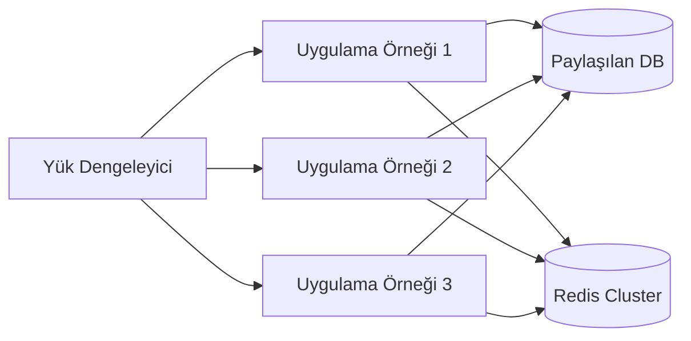
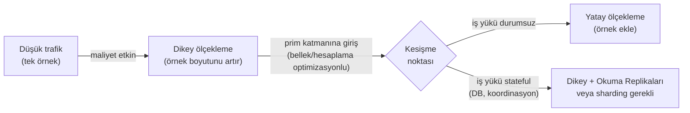

Ölçekleme, eşit derecede geçerli iki seçenek arasında yapılan bir tercih değildir. Kısıtlar altında alınan bir dizi karardır: donanım tavanları, bütçe eğrileri, gecikme bütçeleri ve her yolun dayattığı geri döndürülemez mimari taahhütler.

## Dikey Ölçekleme: Tavan Olarak Fizik

**Dikey ölçekleme** (scale-up), tek bir makineye kaynak eklemek anlamına gelir: daha fazla CPU çekirdeği, daha fazla RAM, daha hızlı NVMe depolama, daha yüksek bantlı NIC'ler. Uzun süre boyunca bu, kapasite sorunlarına verilen varsayılan yanıttı; çünkü uygulama kodunda sıfır değişiklik gerektiriyordu.

Moore Yasası geçerliyken ekonomi mantıklıydı. 1970'ten 2005'e kadar transistör yoğunluğu yaklaşık her 18 ayda bir iki katına çıktı; bu da 18 ay bekleyip yeni bir sunucu satın almanın yazılımı yeniden mimarilendirmekten çoğu zaman daha ucuz olduğu anlamına geliyordu. O dönem sona erdi.

Modern yüksek çekirdekli sunucular temel bir donanım kısıtını gün yüzüne çıkarır: **NUMA (Tekdüze Olmayan Bellek Erişimi)**. Bir CPU soketi fiziksel olarak farklı bir sokete bağlı belleğe erişmesi gerektiğinde, gecikme cezası yerel bellek erişimine kıyasla 2-4× daha yüksektir. 128 çekirdekli bir sunucu, 128 çekirdekli homojen bir makine değildir; bir soket içi ara bağlantıyla (Intel UPI, AMD Infinity Fabric) birbirine bağlı iki ya da dört NUMA düğümüdür. NUMA'yı dikkate almayan kod — ki buna hazır veritabanlarının büyük çoğunluğu dahildir — yüksek çekirdek sayılarında çekişme ve öngörülemeyen gecikme yaşar.

```shell
# Linux ana makinede NUMA topolojisini incele
numactl --hardware

# Çift soketli 64 çekirdekli sunucudaki çıktı:
# available: 2 nodes (0-1)
# node 0 cpus: 0-31 63-95
# node 0 size: 128795 MB
# node 1 cpus: 32-62 96-127
# node 1 size: 129024 MB
# node distances:
# node   0   1
#   0:  10  21    ← soketler arası erişim 2,1× daha pahalı
#   1:  21  10
```

NUMA'nın ötesinde **bellek veri yolu doygunluğu** sorunu da mevcuttur. DDR5 bellekli 96 çekirdekli bir sunucunun tipik olarak 8-12 bellek kanalı bulunur. Tam kullanımda bu kanallar CPU'lardan önce doyar. Bu noktada daha fazla CPU çekirdeği eklemek sıfır verim artışı sağlar; belleği beklerken zamanının büyük bölümünü boşa geçiren pahalı silikon satın almış olursunuz.

Sert tavan, bir bulut sağlayıcısının sattığı en büyük örnektir. 2024 itibarıyla bu, AWS'de yaklaşık 448 vCPU ve 24 TB RAM'dir (`u-24tb1.112xlarge`). Buna ulaştığınızda dikey hareket alanınız kalmaz; üstelik aylarca o tavana yakın olmak için yüksek birim başına prim ödüyor olmuşsunuzdur.

:::caution
Dikey ölçekleme mimari sorunları gizler. Yükü karşılamak için 48xlarge örneğe ihtiyaç duyan bir monolit, ciddi bağlaşım sorunları olan bir monolittir; daha büyük bir makine bunu çözmez, yalnızca 10× maliyetle konuşmayı erteler.
:::

## Yatay Ölçekleme: Vergi Olarak Karmaşıklık

**Yatay ölçekleme** (scale-out), yükü birden fazla ticari makineye dağıtır. Ekonomisi cazip görünür: tek büyük sunucunun yarı maliyetinde iki sunucu, üstelik fazladan yedeklilik avantajıyla. Ama işin püf noktası, uygulamanızın bunu destekleyecek şekilde tasarlanmış olması gerektiğidir.

Temel gereksinim **durumsuzluktur (statelessness)**. Bir servis oturum durumunu, işlem-devam durumunu ya da önbellek durumunu örnek üzerinde yerel olarak saklıyorsa, farklı bir örneğe yönlendirilen her istek başarısız olur ya da eski veri döndürür. Bu durum, tüm kalıcı durumu uygulama katmanından çıkarıp paylaşılan bir katmana — veritabanları, dağıtık önbellekler, nesne depoları — taşımayı zorlar ki bu katman sonunda darboğaz ve tutarlılık noktasına dönüşür.


*Yük dengeleyici arkasında yatay olarak ölçeklendirilmiş durumsuz uygulama katmanı. Tüm kalıcı durum paylaşılan altyapıda yaşar ve koordinasyon darboğazı haline gelir.*

Yatay ölçekleme, tek işlemli modelde hiç var olmayan sorunlar ortaya çıkarır:

- **Kısmi hatalar.** Diğerleri trafik sunmaya devam ederken bir örnek ölebilir. Çağrı yapan taraf, gecikme SLO'nıza göre ayarlanması gereken zaman aşımları olmaksızın yavaş bir düğüm ile başarısız olan bir düğümü birbirinden ayırt edemez.
- **Saat kayması.** İki örnek mükemmel şekilde eşzamanlı saatlere sahip olmaz. Duvar saatine göre sıralamaya dayanan işlemler (örn. "son yazı kazanır" çakışma çözümü) bilinçli saat eşzamanlama stratejileri olmaksızın güvenilmez hale gelir.
- **Ağ gecikmesi.** Bir monolitte nanosaniyeler alan fonksiyon çağrısı, artık iyi donanımlı bir veri merkezinde ~0,5ms medyan gecikmeyle bir ağı aşar; paket kaybı ya da TCP yeniden iletimi altında bu değer kat kat artar.
- **Dağıtık koordinasyon.** Birden fazla örnek arasında atomiklik gerektiren işlemler — dağıtık kilitler, dağıtık işlemler — kendi hata modlarını barındıran ve pahalı olan koordinasyon protokollerine (2PC, Raft tabanlı mutabakat) ihtiyaç duyar.

Yatay ölçeklemenin geçersiz kıldığı varsayımların tam sınıflandırması için bkz. [Dağıtık Hesaplamanın 8 Yanılgısı](/distributed-systems/tr/foundations/monoliths-to-distributed/eight-fallacies/).

## Maliyet-Performans Eğrileri: Her Stratejinin Çöktüğü Nokta

Dikey ve yatay arasındaki pratik karar felsefi değildir; her stratejinin maliyet eğrisinde nerede olduğunuzun bir fonksiyonudur.

| Boyut | Dikey Ölçekleme | Yatay Ölçekleme | Dikeyi tercih etme koşulu |
|---|---|---|---|
| **Düşük ölçekte birim maliyet** | Düşük | Daha yüksek (orkestrasyon yükü) | ~10k istek/s altı iş yükleri |
| **Yüksek ölçekte birim maliyet** | Doğrusal üstü (prim katmanlı fiyat) | Neredeyse doğrusal | Yüksek ölçekte neredeyse hiç |
| **Operasyonel karmaşıklık** | Düşük | Yüksek (servis keşfi, yük dengeleme, dağıtık durum) | Platform mühendisliği kapasitesi olmayan ekipler |
| **Hata patlama yarıçapı** | Tek hata noktası | Kısmi hata mümkün | Kesintinin kabul edilebildiği durumlar |
| **Gecikme** | Nanosaniyelik süreçler arası iletişim | Alt milisaniyeden milisaniyeye ağ atlamaları | Gecikmeye kritik, kilit ağırlıklı iş yükleri |
| **Stateful iş yükleri** | Koordinasyon gerekmez | Dış durum yönetimi zorunlu | Durum dışarıya taşınamadığında |
| **Esneklik** | Manuel, örnek değişimi gerektirir | Otomatik, dakikalar içinde sağlama | Talep öngörülebilir olduğunda |

Maliyet kesişme noktası, dikey ölçeklemenin sizi genel amaçlı bir örnekten bellek optimizasyonlu ya da hesaplama optimizasyonlu katmana taşıdığı yerde bulunur. Bu noktada kaynak birimi başına %20-40 prim ödüyorsunuzdur. Bu genellikle yatay mimariye yatırım yapma sinyalidir.


*Maliyet güdümlü karar yolu. Kesişme noktası, donanım yükseltmesini değil, mimari yatırımı tetikler.*

## Stateful Servisler: Her Şeyi Değiştiren Kısıt

Durumsuz servisler koordinasyon gerektirmeden yatay olarak ölçeklenir. Stateful servisler — veritabanları, mutabakat katılımcıları, iş akışı motorları, oturum depoları — durumu dağıtmanın tutarlılık sorunları doğurması nedeniyle yatay ölçeklemeye direnç gösterir.

Bir PostgreSQL primer, dikey olarak neredeyse sınırsız ölçeklendirilebilir. Dikey sınırlara ulaşıldığında yatay seçenekler kısıtlıdır:

- **Okuma replikaları**, okuma trafiğini boşaltır ancak yazma verimini artırmaz ve replikasyon gecikmesi ortaya çıkarır.
- **Sharding**, yazma yükünü dağıtır; ancak bir yönlendirme katmanı gerektirir, şardlar arası işlemleri ortadan kaldırır ve şema geçişlerini karmaşıklaştırır.
- **Çoklu-primer replikasyon** (örn. Galera, CockroachDB, Spanner), yazmaları dağıtır; ancak her yazmada eşzamanlı düğümler arası koordinasyon getirir ve bu da düğümler arası gidiş-dönüş süresine orantılı gecikme ekler.

Üretim mimarilerinin büyük çoğunluğunun uygulama katmanından çok daha uzun süre **veri katmanı için dikey ölçekleme** kullanmasının temel nedeni budur. Durumu dağıtmanın operasyonel ve tutarlılık maliyeti, çoğu zaman daha büyük bir veritabanı sunucusunun donanım maliyetinden daha yüksektir.

:::tip
Veritabanınızın yatay ölçeklemeye ihtiyaç duyduğu sonucuna varmadan önce iş yükünü profilleyin. Çoğu durumda darboğaz; eksik bir dizin, N+1 sorgu deseni, eksik önbellek katmanı ya da bağlantı havuzu tükenmesidir — ham CPU ya da bellek kapasitesi değil. Bunları düzeltmek her zaman sharding'den daha ucuzdur.
:::

## Otomatik Ölçekleme Sınır Sorunu

Bulut otomatik ölçekleme (AWS Auto Scaling Groups, Kubernetes HPA) yatay ölçekleme üzerinde çalışır. CPU, bellek ya da özel metriklere yanıt olarak yeni örnekler sağlar. Bir ölçekleme tetikleyicisi ile yeni bir örneğin trafik sunmaya başlaması arasındaki gecikme tipik olarak 60-180 saniyedir; bu da kademeli yük artışlarını karşılar ama ani trafik artışlarını karşılamaz.

**Soğuk başlatma sorunu** bunu daha da karmaşık hale getirir: yeni bir örneğin gizli bilgileri çekmesi, bağlantı havuzlarını ısıtması, yerel önbellekleri doldurması ve trafik sunmadan önce sağlık kontrolü kaydını tamamlaması gerekir. JVM tabanlı servisler için JIT derleme, uygulama en yüksek performansa ulaşmadan önce 30-120 saniyelik düşürülmüş verim ekler.

Dikey ölçeklemenin soğuk başlatma sorunu yoktur. Bir iş yükünün ani ve öngörülemeyen trafik desenleri olduğunda ve soğuk başlatması artış süresinden uzun sürdüğünde, yavaş görünse bile dikey ölçekleme operasyonel açıdan doğru tercih olabilir.

:::danger
Yalnızca CPU kullanımına dayalı otomatik ölçekleme, gecikmeye duyarlı servisler için bir tuzaktır. Bir servis %20 CPU kullanımına sahipken veritabanı bağlantıları üzerinde tamamen G/Ç'ye bağlı olabilir; bu noktada örnek eklemek, verimi artırmadan bağlantı havuzu baskısını artırır. Her zaman gerçek darboğaz kaynağını ölçün ve uyarı alın, bir proxy metriği değil.
:::

## Hibrit Gerçeklik

Üretim sistemleri nadiren tek bir stratejiyi dışlayıcı biçimde seçer. Kanonik desen şöyledir:

- **Uygulama katmanı:** Yatay, durumsuz, otomatik ölçeklendirilmiş. Örnekler geçici ve değiştirilebilir niteliktedir.
- **Önbellek katmanı:** Yatay olarak bölümlendirilmiş (Redis Cluster, Memcached consistent hashing), tahliye oranlarını minimize etmek için düğüm başına dikey olarak boyutlandırılmış.
- **Veritabanı primeri:** Ekonomik olarak geçerliyken dikey ölçeklendirilmiş, okuma yükünü boşaltmak için okuma replikalarıyla desteklenmiş.
- **Analitik / OLAP iş yükleri:** Analitik sorguların utanç verici derecede paralel doğası yatay mimariye düzgünce eşlendiğinden, çok sayıda küçük düğüm üzerinde yatay ölçeklendirilmiş (Spark, Presto, BigQuery Capacitor).

Yatay ölçeklemenin mühendislik maliyeti onu kaçınmanın gerekçesi değildir — yeterli ölçekte kaçınılmaz hale gelir. Asıl mesele, hangi katmanın gerçekten darboğazda olduğunu, her ölçekleme stratejisinin o katmandaki gerçek maliyetinin ne olduğunu ve bir ölçekleme sorununu mu yoksa kod kalitesi sorununu mu çözdüğünüzü doğru teşhis etmektir.