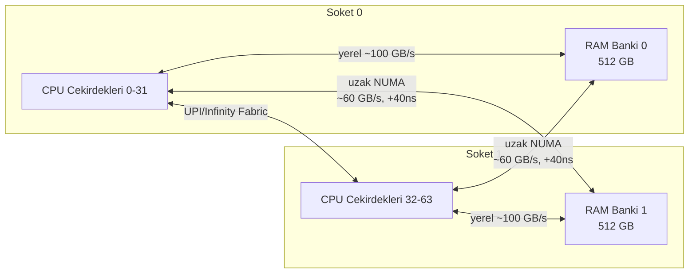
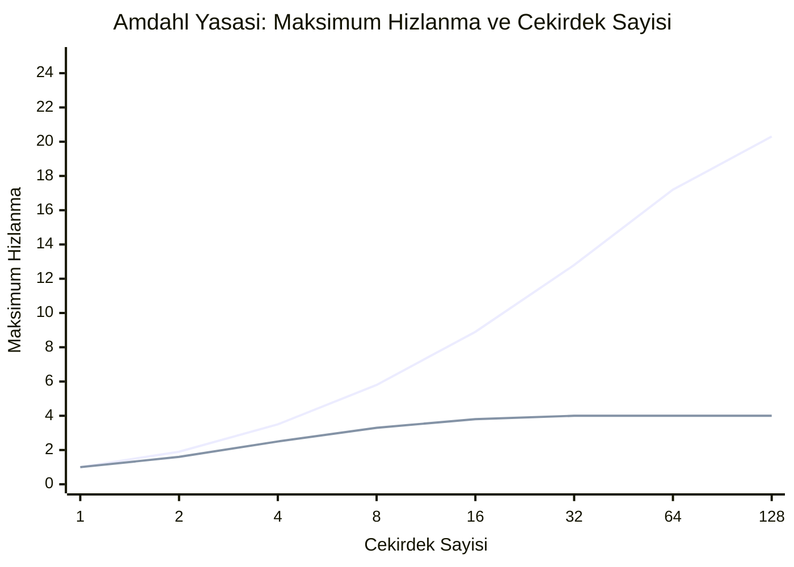
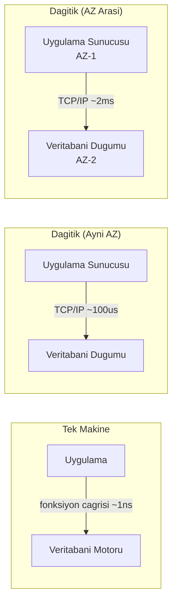

Her sistem eninde sonunda bir duvarla karşılaşır. Trafik büyür, veri hacimleri birikir ya da gecikme gereksinimleri mevcut donanım konfigürasyonunun karşılayabileceğinin ötesine geçer. Bu duvara verilen yanıt, tüm sonraki mimariyi belirler: ya mevcut makinelere daha fazla kapasite eklenecektir (**dikey ölçekleme**, scale-up) ya da daha fazla makine eklenecektir (**yatay ölçekleme**, scale-out). Bu seçim estetik değildir — fizik, ekonomi ve iş yükünün doğası tarafından belirlenir. Erken bir yanlış karar, yanlış varsayımları sonraki her mimari karara taşımak anlamına gelir.
 
## Dikey Ölçekleme: Tek Bir Makinenin Fiziği
 
Dikey ölçekleme, bir makineyi daha fazla CPU'ya, daha fazla RAM'e, daha hızlı depolamaya veya daha yüksek ağ bant genişliğine sahip biriyle değiştirmek ya da yükseltmek demektir. Durum bilgisi olan (stateful) sistemler için — veritabanları, cache'ler, mesaj broker'ları — bu genellikle en az direnç gösteren yoldur; çünkü uygulama kodu değişmez, dağıtım mantığı gerekmez ve tutarlılık modeli önemsiz biçimde basit kalır.
 
Çekiciliği gerçektir; ancak doğrudan birkaç sert fiziksel sınıra çarpar.
 
### NUMA Topolojisi ve Bellek Bant Genişliği
 
Modern çok-soketli sunucular düzgün bellek erişimine sahip değildir. **Non-Uniform Memory Access (NUMA)** mimarisinde her CPU soketi kendi yerel bellek bankasına sahiptir. Yerel belleğe erişen bir CPU tam bant genişliği elde eder (güncel Xeon veya EPYC donanımında tipik olarak 100-200 GB/s). Aynı CPU *uzak* bir sokete bağlı belleğe eriştiğinde Intel'in UPI (Ultra Path Interconnect) veya AMD'nin Infinity Fabric'ini geçer ve yerel erişime kıyasla 30-100 ns gecikme ve %30-50 bant genişliği cezası öder.
 

*İki soketli NUMA topolojisi: uzak bellek erişimi, soketler arası bağlantı üzerinden bant genişliği ve gecikme cezası öder.*
 
Bu operasyonel açıdan önemlidir. 96 çekirdekli 2 soketli bir sunucudaki PostgreSQL örneği, çekirdek ekledikçe okuma verimini doğrusal olarak ölçekleyemez; çünkü soketler arasındaki cache-line transferleri darboğaza dönüşür. NUMA sınırlarını aşan veritabanı buffer pool'ları sık sık uzak bellek erişimlerine neden olur. Linux çekirdeğinin NUMA dengeleme buluşsal yöntemleri bunu hafifletir ama ortadan kaldırmaz; üstelik sayfa taşıma yoluyla kendi CPU yükünü getirir.
 
4 soketli ve 8 soketli makinelere geçiş bunu daha da kötüleştirir: ek her soket NUMA mesh'ine başka bir atlama ekler ve CPU cache'lerini soketler arasında tutarlı tutmak için gereken tutarlılık trafiği, soket sayısının karesiyle büyür. Bu nedenle 4 ve 8 soketli makineler, tarihsel olarak ham bellek kapasitesini devasa çekirdek başına lisans maliyetlerine rağmen sömürmeye hazır bellek içi veritabanlarının (SAP HANA, VoltDB) alanı olmuştur.
 
### Amdahl Yasası: Paralelizmin Tavanı
 
**Amdahl Yasası**, iş yükünün bir bölümünün doğası gereği sıralı olduğu durumlarda CPU çekirdeği eklemekten elde edilecek teorik maksimum hız artışını ortaya koyar:
 
```
Hizlanma(N) = 1 / (S + (1 - S) / N)
```
 
Burada `S`, programın kesinlikle sıralı olan bölümünün oranı ve `N` ise işlemci sayısıdır. `N` sonsuza yaklaştıkça maksimum hız artışı `1/S`'ye yaklaşır.
 
Çıkarımı acımasızdır: yalnızca %5 sıralı kod içeren bir iş yükü, kaç çekirdek eklenirse eklensin 20 katın üzerinde hızlandırılamaz. %20 sıralı kodlu bir iş yükü 5x ile sınırlandırılmıştır. Pratikte "sıralı" kavramı; kilit çakışmasını (lock contention), tek thread'li I/O yollarını, sıralı log yazmalarını ve eşzamanlı işlemleri sıralayan her koordinasyon noktasını kapsar.
 

*Üst çizgi: %1 sıralı oran (100x sınırına yaklaşır). Alt çizgi: %20 sıralı oran (5x'te sabit üst sınır). Gerçek iş yükleri bu iki eğri arasında bir yerdedir.*
 
### Universal Scalability Law
 
Neil Gunther'ın **Universal Scalability Law (USL)** modeli, Amdahl Yasası'nı **tutarlılık** (coherency) için ikinci bir ceza terimi ekleyerek genişletir — bu terim, birden fazla eşzamanlı aktör arasında paylaşılan durumu tutarlı tutmanın yüküdür:
 
```
C(N) = N / (1 + alpha*(N - 1) + beta*N*(N - 1))
```
 
Burada `alpha` çakışma (serialization) parametresi, `beta` tutarlılık (crosstalk) parametresi ve `N` eşzamanlı çalışan sayısıdır. `beta` tutarlılık terimi `N`'de ikinci dereceden olduğundan USL, tutarlılık yükü baskın hale geldiğinde daha fazla eşzamanlılık eklemenin verimi gerçekte *düşürebileceğini* öngörür.
 
Bu teorik değildir. PostgreSQL tek bir örnekte belirli bir bağlantı sayısını geçtikten sonra verim düzlenir ve ardından düşer; çünkü kilit yöneticisi yükü ve paylaşılan buffer cache tutarlılığının ikisi de `beta > 0`'dır. PgBouncer gibi connection pooler'lar tam olarak `N`'yi USL tutarlılık uçurumunun altında tutmak için vardır. Redis'in tek thread'li olması da aynı nedenle açıklanır: tüm işlemleri sıralayarak `beta`'yı tamamen ortadan kaldırmak, sıfır olmayan `beta`'ya sahip çok thread'li bir tasarımdan daha iyi verim sağlar.
 
:::tip
İş yükünüzün `alpha` ve `beta` parametrelerini ölçmek, değişen eşzamanlılık düzeylerinde yük testi yapmayı ve USL eğrisini veriye uydurmayı gerektirir. `usl4j` (Java) veya R `usl` paketi gibi araçlar regresyonu otomatikleştirir. Eğer verim eğriniz üretimde düzenli olarak ulaştığınız bir eşzamanlılık düzeyinin ötesinde dönüp aşağı iniyorsa, daha fazla donanımın çözmeyeceği bir tutarlılık sorununuz var demektir.
:::
 
### Maliyet Eğrisi Doğrusal Değil
 
Dikey ölçekleme için bulut örneği fiyatlandırması doğrusal değildir. 4 çekirdekten 8 çekirdeğe geçiş hesaplamayı ikiye katlar ama fiyatı da yaklaşık olarak ikiye katlar. 96 çekirdekli genel amaçlı bir örnekten 192 çekirdekli yüksek bellekli bir örneğe geçiş, 2 kat çekirdek için 4-6 kat daha fazla maliyet getirebilir; çünkü büyük SKU'lar daha az metalaşmıştır ve önemli bir prim taşır.
 
Dikey ölçeklemenin en pahalı kısmı üst uçtur: kapasitenin son ikiye katlanması genellikle bir öncekinden 3-5 kat daha pahalıdır. Genel amaçlı örneklerin yerini yüksek fiyatlı bellek veya hesaplama optimize edilmiş SKU'lara bıraktığı çoğu bulut sağlayıcısında 48-64 vCPU örnekleri civarında bir fiyat/performans uçurumu vardır. NUMA'ya duyarlı iş yükleri için gereken bare-metal eşdeğerleri, bunun üzerine %40-80 daha prim ekler.
 
Hiçbir fiyat tablosunun yakalayamadığı bir de **tek hata noktası** maliyeti vardır: tek büyük bir makine tek bir hata etki alanıdır. Çöktüğünde üzerindeki her şey kullanılamaz hale gelir. Donanım RAID, yedekli güç kaynakları ve hot-standby replikalar bu riski azaltır ama ortadan kaldırmaz.
 
## Yatay Ölçekleme: Dağıtık Sistemin Fiziği
 
Yatay ölçekleme daha fazla makine ekler ve iş yükünü bu makineler arasında dağıtır. Tek hata noktası sorununu ortadan kaldırır, pratikte sınırsız verime ulaşabilir ve fiyat/performans eğrisinin ucuz ucundaki emtia donanımı kullanır. Buna karşılık tamamen farklı bir problem kategorisi getirir.
 
### Artık Darboğaz Ağdır
 
Tek bir makinede bileşenler arası iletişim, ~1 ns hızında çalışan process içi fonksiyon çağrılarıdır. Yatay ölçekleme bu çağrıların yerini ağ round-trip'leriyle değiştirir. Aynı rack'teki yüklenmemiş koşullarda 10 GbE ağda round-trip ~100 µs'dir. Bir bulut bölgesindeki AZ'ler arası trafik 1-3 ms ekler. Bölgeler arası trafik ise coğrafyaya bağlı olarak 30-300 ms ekler.
 
Bu sayılar, dağıtık sistemlerin performans profilini domine eder. Yerel donanımda 1 ms süren tek bir veritabanı sorgusu, yalnızca ağ round-trip'lerinin gecikmesi nedeniyle ağ koordinasyonu gerektiren bir dağıtık konfigürasyonda 3-5 ms sürer. Birden fazla sıralı round-trip gerektiren herhangi bir işlem — ve önemsiz olmayan çoğu veritabanı işlemi bunu gerektirir — bu maliyeti çarpansal olarak öder.
 

*Process içi iletişimden AZ içine ve AZ'ler arasına geçişte gecikme artışı: beş büyüklük mertebesi.*
 
### Durum, Yatay Ölçeklemenin Düşmanıdır
 
**Stateless** bileşenler koordinasyon olmaksızın yatay olarak ölçeklenir: bir load balancer arkasına daha fazla örnek ekleyin, verim doğrusal olarak artar (paylaşılan downstream bağımlılıklar saklı). Herhangi bir örnek herhangi bir isteği karşılayabilir. HTTP uygulama sunucularının, API gateway'lerin ve hesaplama worker'larının bu kadar kolay yatay ölçeklenmesinin nedeni budur.
 
**Stateful** bileşenler, ilgili isteklerin aynı örneğe ulaşmasını ya da durumun örnekler arasında senkronize edilmesini gerektirir. Her iki yol da koordinasyon yükü getirir. Durumu senkronize etmek, uzlaşma protokollerini (consensus protocol), replikasyon gecikme yönetimini ve çakışma çözümü stratejilerini gerektirir. Yapışkan yönlendirme ise örnekler başarısız olduğunda bozulan load balancer'da session affinity gerektirir.
 
Temel gerilim şudur: **durum bilgisi olan sistemlerin yatay ölçeklenmesi her zaman bir dağıtık sistemler sorunudur**. Tutarlılık (iki replika anlaşmazsa ne olur?), kullanılabilirlik (ağ bölünmesi sırasında ne olur?) ve bölüm toleransı (durum nasıl bölümlenir?) hakkında açık kararlar gerektirir. Bunlar mühendislik detayları değildir — şimdiye kadar yapılmış her dağıtık veritabanının, cache'in ve mesaj broker'ının tanımlayıcı özelliklerini oluştururlar.
 
:::caution
Durum yönetimi katmanı yeniden tasarlanmadan durum bilgisi olan bir servise "sadece daha fazla node ekle" yaklaşımı doğrusal ölçekleme sağlamaz. Tipik olarak dağıtık bir monolit üretir: tek bir makinenin ölçekleme özelliklerine sahip bir dağıtık sistemin operasyonel karmaşıklığı; çünkü tüm node'lar hâlâ paylaşılan bir veritabanı üzerinden sıralı işlem yapar.
:::
 
### Koordinasyon Yükü Node Sayısıyla Birlikte Büyür
 
Dağıtık sisteme eklenen her node, koordinasyon gerektiren işlemler için iletişim yükünü artırır: lider seçimi, dağıtık kilitleme, quorum yazmaları, iki aşamalı commit ve gossip tabanlı üyelik protokolleri bunların başında gelir. En kötü durum O(N²) mesaj karmaşıklığıdır (tüm-ile-tüm koordinasyon); bu nedenle büyük ölçekli sistemler tam mesh koordinasyonu yerine gossip protokolleri (O(N log N)) veya hiyerarşik koordinasyon (O(log N)) kullanır.
 
Bu, USL tutarlılık cezasının dağıtık sistemler karşılığıdır: yüksek koordinasyon gereksinimleri olan bir sisteme daha fazla node eklemek, eninde sonunda verimin yatay kalmasına ya da düşmesine yol açar. Örneğin Raft uzlaşma algoritması, her yazma işlemi için (N/2 + 1) node'un çoğunluğunun onayını gerektirir; N büyüdükçe, ağ üzerinden daha fazla ACK beklenmesi gerektiğinden yazma gecikmesi artar.
 
## Ölçekleme Karar Matrisi
 
Hiçbir yaklaşım tüm senaryolarda üstün değildir. Karar, iş yükü özellikleri, operasyonel kısıtlamalar ve maliyet toleransı tarafından yönlendirilir.
 
| Boyut | Dikey Ölçekleme | Yatay Ölçekleme |
|---|---|---|
| **Uygulama karmaşıklığı** | Düşük — kod değişikliği yok | Yüksek — stateless veya dağıtık durum tasarımı gerektirir |
| **Maksimum verim tavanı** | Sert fiziksel limit (~192 çekirdek, mevcut donanımda ~24 TB RAM) | Doğru sharding ile pratikte sınırsız |
| **Gecikme profili** | Düşük — process içi iletişim | Daha yüksek — ağ round-trip'leri her hop'a ~100 µs ile ms ekler |
| **Hata patlama yarıçapı** | Toplam — tek makine çöküşü tam kesinti | Kısmi — herhangi bir tek node çöküşünde N-1 makine hayatta kalır |
| **Maliyet eğrisi** | Doğrusal'dan üstel'e — büyük SKU'lar için prim | Doğrusal — tutarlı fiyat/performansta emtia donanımı |
| **Durum yönetimi** | Önemsiz — dağıtım gerekmez | Karmaşık — açık tutarlılık modeli gerektirir |
| **Operasyonel yük** | Düşük — yönetilecek tek makine | Yüksek — service discovery, health check, dağıtık yapılandırma |
| **Uygun iş yükleri** | Gecikmeye duyarlı, durum bilgili, düşük-orta verim | Yüksek verimli, embarrassingly parallel, cache'le okuma ağırlıklı |
 
## Pragmatik Yol: Önce Yukarı Ölçekle, Sonra Dışa
 
Pratikte, erken aşamadaki sistemler için en operasyonel açıdan sağlam strateji, maliyet veya fiziksel limit yatay yeniden tasarımı zorunlu kılana kadar dikey olarak ölçeklendirmektir. NVMe SSD'lerle donatılmış 32 çekirdek, 256 GB RAM'lik bir makinede iyi yapılandırılmış tek bir PostgreSQL sunucusu, onu hiç ölçmemiş mühendislerin çoğunu şaşırtacak iş yüklerini karşılar: düzgün indekslenmiş okuma ağırlıklı bir iş yükünde saniyede 10.000-50.000 sorgu, alt milisaniye 99. yüzdelik dilim gecikmesiyle.
 
Yatay ölçeklemeye zorlayan etken "büyük şirket mikroservis kullanıyor, o halde ben de kullanmalıyım" değildir. Bir veya daha fazla somut kısıttır:
 
- **Verim, tüm makul dikey seçenekler tükendikten sonra bile tek bir makinenin sürdürebileceğini aşıyor.**
- **Hata toleransı gereksinimleri** tek hata noktasıyla bağdaşmıyor — %99,99 kullanılabilirlik zorunlu kılan bir SLA en az N+1 artıklık, dolayısıyla yatay dağıtım gerektirir.
- **Coğrafi dağıtım** gerekiyor — birden fazla kıtadaki kullanıcılar sub-100ms gecikme istiyor, bunu hiçbir tek veri merkezi sağlayamaz.
- **Veri hacmi tek makine depolamasını aşıyor** — tek NVMe destekli örnekte ~40 TB'ı aşan aktif veri kümeleri pratik dikey sınırları zorluyor.
- **Düzenleyici gereksinimler** belirli yargı bölgelerinde veri ikametini zorunlu kılıyor ve coğrafi dağıtımı mecbur bırakıyor.
Hata, bu kısıtlardan hiçbiri henüz gerçek değilken spekülatif olarak yatay ölçekleme kararı vermektir. Başından itibaren yatay ölçek için tasarlanmış bir sistem tüm dağıtık sistemler karmaşıklığını taşır — koordinasyon protokolleri, eventual consistency yönetimi, kısmi hata yönetimi — geliştirme hızının en çok önem taşıdığı ve trafiğin en düşük olduğu aşamada.
 
:::note
Diyagonal ölçekleme örüntüsü — tek node'ları büyütürken node sayısını da artırma — Kafka ve Cassandra gibi sistemler tarafından kullanılır. Her broker/node büyüktür (32-64 çekirdek, yüksek RAM, NVMe depolama) ve tek node verimini maksimize ederken koordinasyon yükünü minimize eder; kümenin tamamı ise bu tür daha fazla node eklenerek yatay olarak ölçeklenir. Bu yaklaşım her iki stratejiden de en iyi şekilde yararlanır.
:::
 
## Her Stratejiye Özgü Hata Modları
 
**Dikey ölçekleme hata modları:**
- **Tek hata noktası kesintisi:** Makine çökerse tüm servis, yeniden başlatılana ya da bir standby terfi ettirilinceye kadar kullanılamaz hale gelir. Veritabanı birincillerinde, büyük örneklerde InnoDB/PostgreSQL crash recovery ve buffer pool ısınması nedeniyle soğuk başlatma süresi dakikalar ile saatler arasında sürebilir.
- **Artımlı rahatlama seçeneği olmadan kaynak doygunluğu:** Dikey ölçeklenmiş bir sistem kapasite sınırına ulaştığında, genellikle bakım dönemi gerektiren tam donanım yükseltmesi dışında "bir birim daha kapasite ekle" seçeneği yoktur.
- **NUMA kaynaklı performans uçurumları:** Yanlışlıkla NUMA sınırlarını aşan bir iş yükü, yazılım hatası gibi görünen ancak yalnızca `numastat` ve NUMA farkındalıklı profilleme ile teşhis edilebilen ani performans düşüşleri yaşayabilir.
**Yatay ölçekleme hata modları:**
- **Kısmi hata durumları:** N node aynı anda N farklı durumda olabilir — bazıları açık, bazıları kapalı, bazıları bölünmüş, bazıları eski veri döndürüyor. Kısmi hataları doğru şekilde yönetmek, dağıtık sistemlerin temel mühendislik zorluğudur.
- **Node kurtarmasında thundering herd:** Bir node kümeye yeniden katıldığında diğer node'lar durumu senkronize etmeye anında girişebilir ve büyük miktarda veriyi aynı anda aktarabilir. Bu, ağ bant genişliğini doyurabilir ve kurtarılan node üzerinde kaskad yüke yol açabilir.
- **Koordinatör darboğazları:** Merkezi koordinasyon gerektiren herhangi bir işlem (dağıtık kilitleme, global sıra üretimi, tek lider yazmaları) yatay olarak ölçeklenemeyen bir darboğaz oluşturur. "Sadece daha fazla node ekle" varsayımıyla tasarlanan sistemler genellikle gerçek ölçekleme limitine dönüşen gizli koordinatör tekilleri (singleton) barındırır.
- **Ağ bölünmesinde split-brain:** Bir ağ bölünmesi node'ların bir alt kümesini izole ederse, bu node'lar yazmayı kabul etmeye devam edebilir; bu da bölünme iyileştiğinde uzlaştırılması veya atılması gereken ıraksak durum yaratır.
Dağıtık sistem hata modlarının sistematik sınıflandırması için bkz. [Hata Modelleri](/distributed-systems/tr/foundations/system-models/failure-models/).
Dikey'den yatay ölçeklemeye geçerken bozulan varsayımlar için bkz. [Dağıtık Hesaplamanın 8 Yanılgısı](/distributed-systems/tr/foundations/monoliths-to-distributed/eight-fallacies/).