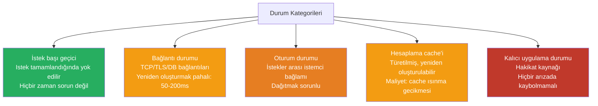
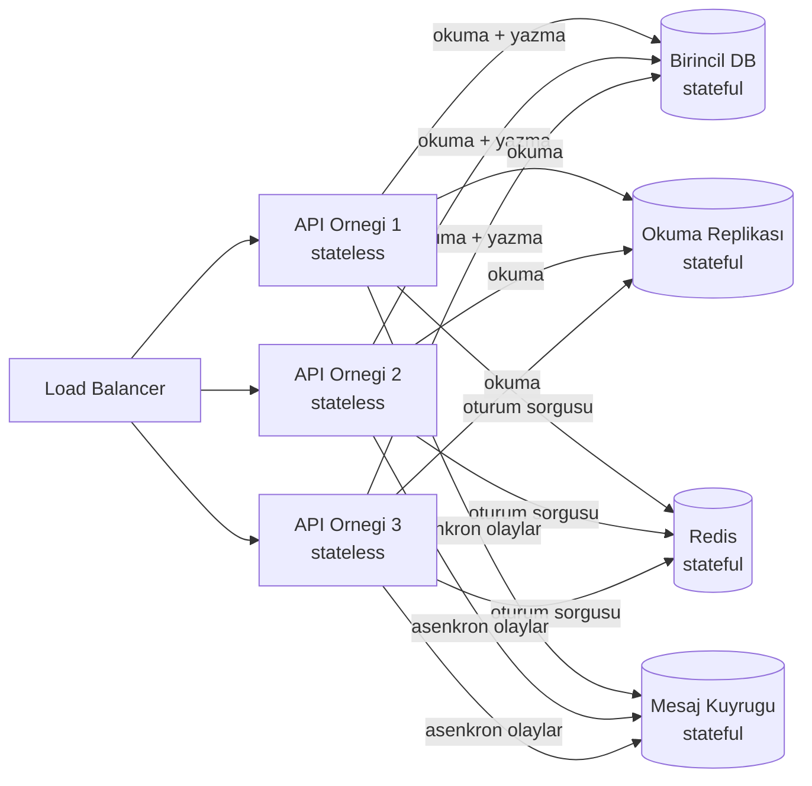
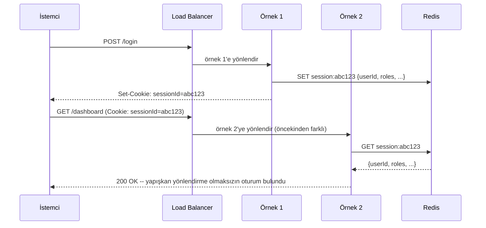
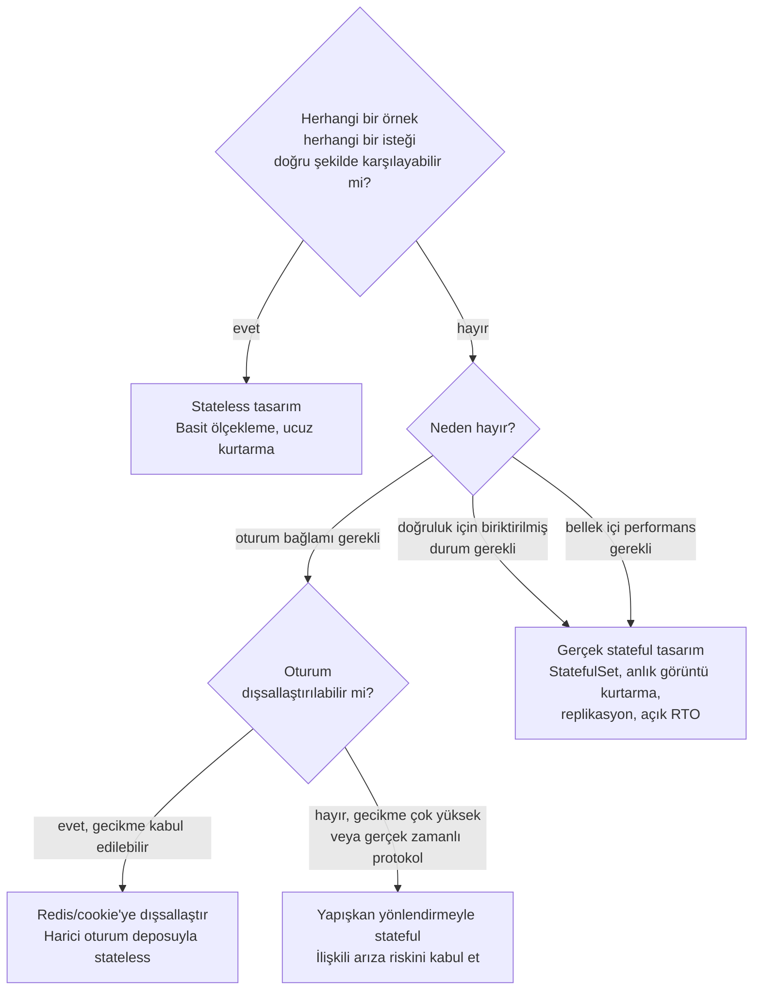

Stateful ve stateless servisler arasındaki ayrım sıklıkla ikilik ve basite indirgenmiş şekilde sunulur. Ne ikilik ne de basittir. Durum (state), geçici istek başı hesaplamadan herhangi bir sayıda hatayı atlatması gereken kalıcı veriye kadar bir spektrum üzerinde yer alır — bir durum türü için doğru olan tasarım kararı, başka bir durum türü için aktif biçimde zararlı olabilir. "Bu servis stateful mi?" sorusu, "Bu servis hangi tür durumu tutuyor, onu kaybetmenin sonuçları neler ve o durumun dayanıklılığından kim sorumlu?" sorusundan daha az kullanışlıdır.
 
## Durumun Gerçekte Ne Olduğu
 
Dağıtık sistemler bağlamında "durum", bir servis örneğinin tuttuğu ve gelecekteki isteklere nasıl yanıt verdiğini etkileyen herhangi bir veri anlamına gelir. Bu, ilk bakışta göründüğünden geniştir ve farklı durum kategorilerini birbirine karıştırmak tasarım hatalarına yol açar.
 
**İstek başı geçici durum**, uçuştaki hesaplamadır: stack üzerindeki değişkenler, bir istek sırasındaki heap nesneleri, birleştirilen kısmi sonuçlar. Her servis bunu tutar; istek tamamlandığında yok edilir ve stateful/stateless ayrımıyla hiçbir ilgisi yoktur.
 
**Bağlantı durumu**, birden fazla istek arasında amortize edilmesi gereken protokol müzakere yüküdür: TCP el sıkışması, TLS oturumu kurulumu, veritabanı kimlik doğrulama ve yetkilendirme, HTTP/2 akış çoklama (stream multiplexing). Açık veritabanı bağlantıları tutan bir servis, uygulama anlamında kendini stateless saydığı halde bağlantı durumu tutmaktadır. Bu durum yeniden oluşturmak için pahalıdır (TLS ve kimlik doğrulama dahil yeni veritabanı bağlantısı başına ~50-200 ms) ve connection pooler'ların var olmasının nedeni budur.
 
**Oturum durumu (session state)**, aynı istemciden gelen birden fazla istek arasında biriktirilen uygulama düzeyinde bağlamdır: kimlik doğrulama token'ları, alışveriş sepeti içerikleri, sihirbaz adım ilerlemesi, kısmi form gönderimleri. Dağıtık sistemlerde en çok operasyonel sorun yaratan durum kategorisi budur; çünkü her isteğe kodlanmak için fazla büyük ve fazla istemciye özgüdür, ancak kalıcı depolamayı haklı çıkarmak için de fazla geçicidir.
 
**Hesaplama cache durumu**, türetilmiş veridir: önceden hesaplanmış toplamlar, sıcak sorgu sonucu cache'leri, başlangıçta oluşturulan bellek içi arama tabloları. Bu durum yetkili kaynaklardan yeniden oluşturulabilir, ancak önemsiz olmayan bir maliyetle — bellek içi cache'ini kaybeden ve bir veritabanından yeniden doldurmak zorunda kalan bir servis kısa süreliğine yavaş olabilir ama yanlış değildir.
 
**Kalıcı uygulama durumu**, sistemin yönetmek için var olduğu hakikat kaynağı veridir: hesap bakiyeleri, sipariş kayıtları, kullanıcı profilleri, olay günlükleri. Bu durum asla bir servis yeniden başlatmasına kaybedilmemelidir ve neredeyse her zaman harici bir kalıcılık sisteminde saklanır. O sistemin veritabanı mı, nesne deposu mu yoksa olay günlüğü mü olduğu bir uygulama detayıdır; herhangi bir tek bileşen arızasını atlatma gerekliliği ise değildir.
 

*Kayıp sonucuna göre durum kategorileri: yeşil kaybı güvenlidir, turuncu maliyetle kurtarılabilir, kırmızı asla kaybolmamalıdır.*
 
## Stateless Servislerin Neden Ölçeklendiği
 
Herhangi bir örneğin, eş örneklerle koordinasyon olmaksızın herhangi bir isteği karşılayabildiğinde bir servis etkin olarak stateless'tır. Kesin teknik gereksinim şudur: **örnekler arasında paylaşılan değişebilir durum yoktur**. Bir örnek salt okunur yapılandırma, yeniden oluşturulabilen yerel bellek içi cache'ler veya geçici istek başı durum tutabilir — bunların hiçbiri stateless sözleşmeyi ihlal etmez.
 
Bu tasarımın ölçekleme avantajları mekanik olup, istekten bağımsızdır.
 
**Yük dengeleme koşulsuzdur.** Herhangi bir istek herhangi bir örneğe gidebilir. Round-robin, en az bağlantı, rastgele — hiçbir yönlendirme kısıtı olmadığından her algoritma işe yarar. Kapasite eklemek, örnek eklemek ve load balancer'a kaydetmek demektir. Veri taşıma yok, yeniden dengeleme yok, koordinasyon yok.
 
**Hata kurtarma anında gerçekleşir.** Bir örnek çöktüğünde, uçuştaki istekler başarısız olur ama kalıcı durum kaybolmaz. Bir yedek örnek soğuk başlar ve anında herhangi bir isteğe hizmet verebilir. Kurtarma süresi, yeni bir işlem başlatmak ve sağlık kontrolünü geçmek için geçen süredir — tipik olarak saniyeler. Bunu, write-ahead log'u yeniden oynatmak, cache'i doldurmak, bağlantıları yeniden kurmak veya replikasyonun yetişmesini beklemek gerektiren stateful bir servistle karşılaştırın.
 
**Deployment'lar sıfır risklidir.** Stateless servislerin rolling update'leri basit olarak güvenlidir: yeni örnekleri ayağa kaldırın, trafiği kaydırın, eski örnekleri boşaltın. Canary deployment'lar patlama yarıçapını trafiğin bir yüzdesine düşürür. Blue/green geçişleri anlık gerçekleşir. Taşıma scripti yok, şema değişikliği yok, boşaltılacak uçuştaki durum yok.
 
**Auto-scaling doğru çalışır.** Scale-in olayları — düşük trafikte örneklerin kaldırılması — güvenlidir; çünkü örnekler benzersiz durum taşımaz. Scale-in yapılan stateful bir servis, kaldırılan örneklerdeki yerel durumu kaybeder.
 
:::tip
Stateless'ın en katı tanımı, bir isteğin ortasında değiştirilebilen bir servisdir — proxy'nin bir isteğin ilk yarısını bir örneğe, ikinci yarısını başka bir örneğe gönderebileceği ve doğru sonuç üretilebileceği durum. Neredeyse hiçbir şey bu standardı karşılamaz; ancak durumun gerçekte nerede tutulduğunu belirlemek için yararlı bir zihinsel modeldir.
:::
 
## Yanılsama: Stateless Servisler Hâlâ Stateful Backend'lere Bağımlıdır
 
Statelessness durumu ortadan kaldırmaz. Yeniden konumlandırır. Her stateless HTTP API servisi, stateful backend'lere bağımlıdır: ilişkisel veritabanları, anahtar-değer depolar, nesne depolama, mesaj kuyrukları. Durum ortadan kalkmaz; onu kalıcı ve tutarlı biçimde yönetmek için açıkça tasarlanmış bileşenlere itilir.
 
Bu üç katmanlı model — stateful depolama katmanı üzerinde stateless hesaplama katmanı — web ölçeğindeki sistemlerin baskın mimarisidir. Hesaplama katmanı yatay ve kolay ölçeklenir; çünkü tüm durumu dışsallaştırılmıştır. Depolama katmanı tüm dağıtık sistemler karmaşıklığını taşır: replikasyon, tutarlılık garantileri, bölüm toleransı, failover. "Kolay ölçeklenir" (stateless hesaplama) ile "zor ölçeklenir" (stateful depolama) arasındaki bu ayrım bir tesadüf değildir — meselenin tam özüdür.
 

*Stateful depolama üzerinde stateless hesaplama: tüm kalıcı durum onu yönetmek için tasarlanmış bileşenlere dışsallaştırıldığından, hesaplama katmanı için yatay ölçekleme basittir.*
 
Bunun sonucu şudur: stateless bir servisi ölçeklendirmek, depolama katmanının artan yükü absorbe etmesini gerektirir. 3'ten 30 örneğe ölçeklenen stateless bir API servisi, veritabanına 10 kat daha fazla istek iletir. Veritabanı bu yükü karşılayamazsa, stateless hesaplama katmanı anlamsızlaşır. **Stateless bir servisin ölçekleme tavanı, stateless örneklerin kendisi tarafından değil, stateful bağımlılıkları tarafından belirlenir.**
 
## Oturum Durumu: En Yaygın Tasarım Hatası
 
Oturum durumu — tek bir istemciden gelen birden fazla istek arasında biriktirilen bilgi — stateless olduğunu iddia eden bir serviste en yanlış ele alınma olasılığı yüksek olan kategoridir.
 
Naif uygulama, oturum verilerini örnek-yerel bellekte saklar (Java'da `HashMap<SessionId, SessionData>`, Python'da modül düzeyinde `dict`). Tek bir örnekle mükemmel çalışır. Birden fazla örnekle sessizce başarısız olur: farklı örneklere yönlendirilen istekler oturum bağlamı görmez ve kimlik doğrulama hatalarına, kaybolan sepet içeriklerine veya bozulmuş sihirbaz durumuna yol açar.
 
Buna verilen iki yaygın yanıt mimari açıdan önemlidir.
 
**Yapışkan oturumlar (session affinity)**, load balancer'ı belirli bir istemciden gelen tüm istekleri genellikle cookie veya IP hash kullanarak aynı örneğe yönlendirmek üzere yapılandırır. Bu doğruluğu yeniden sağlar ama altyapı düzeyinde statefulness'ı yeniden getirir. O örnek başarısız olduğunda veya kaldırıldığında, tüm oturumları aynı anda kaybolur — hata olasılığını filo genelinde dağıtmak yerine aynı anda birçok kullanıcıyı etkileyen ilişkili bir arıza. Deployment'lar sırasında yapışkan oturumlar rolling update'leri karmaşık hale getirir: bir örneği boşaltmak, tüm yapışkan oturumların timeout süreleri dolana kadar beklemeyi gerektirir ve deployment'ları saatlerce bekletebilir.
 
**Dışsallaştırılmış oturum durumu**, oturum verilerini herhangi bir örneğin okuyabileceği paylaşılan bir depoya taşır — Redis, Memcached, bir veritabanı tablosu. Oturum araması, oturum bağlamı gerektiren her isteğe bir ağ round-trip ekler (~yerel Redis için 0,5-1 ms). Bu doğru mimari çözümdür: oturumlar örnek arızasını atlatır, yönlendirme kısıtsızdır, deployment'lar temizdir.
 
Daha radikal bir varyant, **oturum durumunu imzalı token'lar aracılığıyla doğrudan istemciye kodlamaktır**. JWT'ler (JSON Web Token), sunucunun herhangi bir depolama araması olmaksızın doğrulayabildiği kriptografik olarak imzalanmış bir yük içinde oturum iddialarını taşır. Avantajlar gerçektir: oturum depolama için sıfır backend altyapısı, oturum arama gecikmesi yok, CDN'ler ve edge computing ile doğal çalışır. Sınırlamalar eşit derecede gerçektir: token'lar sona ermeden önce sunucu tarafında geçersiz kılınamaz (temel bir güvenlik sınırlılığı), yük boyutu her istekte iletilir ve yükteki hassas iddialar token'ı ele geçiren herkese görünürdür (şifreleme ile hafifletilir ama ortadan kaldırılmaz).
 

*Dışsallaştırılmış oturum durumu: örnek 2, yapışkan yönlendirme gerektirmeksizin örnek 1 tarafından oluşturulan oturum verilerini kullanarak bir isteğe hizmet verir.*
 
## Stateful Servisler: Doğru Yanıt Oldukları Zamanlar
 
Statefulness, ortadan kaldırılması gereken bir tasarım kusuru değildir. Durumu dışsallaştırmanın maliyetinin faydayı aştığı veya erişim örüntülerinin harici durum koordinasyonunu fiziksel olarak olanaksız kıldığı belirli iş yükü kategorileri için bir gerekliliktir.
 
**Bellek içi veritabanları ve cache'ler.** Redis, Memcached, VoltDB ve benzeri sistemler tam olarak şu yüzden var olur: bazı iş yükleri bellek hızlarında, yani harici depoya giden ağ round-trip'inin sağlayamayacağı sub-milisaniye gecikmede durum erişimine ihtiyaç duyar. Statefulness üründür: bu sistemler, veriyi hesaplamaya yakın tuttukları için değerlidir. Onları stateless tasarlamak anlamsız olurdu.
 
**Veritabanı connection pooler'ları.** PgBouncer, ProxySQL ve benzeri araçlar, stateful connection pool'ları tutar: yeniden kurmak 50-200 ms sürecek olan kimliği doğrulanmış, müzakere edilmiş veritabanı backend bağlantıları. Bunlar, birçok stateless uygulama bağlantısını daha küçük kalıcı backend bağlantıları pool'una dönüştüren stateful proxy'lerdir. Statefulness'ları açık bir performans optimizasyonudur.
 
**Biriktirilmiş durumlu akış işleme.** Kullanıcı başına olayların 5 dakikalık kayan sayımını hesaplayan bir Kafka Streams uygulaması, mesajlar arasında değerleri biriktiren bir state store tutmak zorundadır. Bu state store, performans amacıyla işleme örneğine lokaldir; ancak tipik olarak dayanıklılık için bir changelog topic'ine kalıcı hale getirilir. Stateful tasarım isteğe bağlı değildir; hesaplama *biriktirilmiş durumdur*.
 
**Uzun ömürlü protokol bağlantıları.** WebSocket sunucuları, oyun sunucuları, XMPP mesajlaşma sunucuları ve video konferans sunucuları bağlantı başına durum tutar: kimlik doğrulama bağlamı, abonelik listeleri, sıra numaraları, medya müzakere durumu. Bu durum, her mesaja bir ağ hop'u eklemeden dışsallaştırılamaz; bu da çoğunlukla gerçek zamanlı protokoller için gecikme gereksinimlerini bozar. Bu sistemler, belirli örneklere yapışkan yönlendirmeyle stateful olarak doğru biçimde tasarlanır.
 
**Isınma maliyetiyle ML model sunumu.** Büyük dil modeli inference sunucuları, öneri motorları ve benzeri sistemler, model ağırlıklarını GPU/CPU belleğine yüklemek için önemli zaman harcar. İstek başına model ağırlıklarını yükleyip boşaltan "stateless" bir tasarım kullanılamaz olurdu. Isınmış model durumunun istekler arasında korunmaya değer olması, bu servisleri bellek içi modelleri açısından kasıtlı olarak stateful kılar.
 
:::note
Kubernetes'in `Deployment` (stateless) ile `StatefulSet` (stateful) arasındaki ayrımı bu operasyonel asimetriyi tam olarak yakalar. Bir `Deployment` pod'u rastgele bir ad alır (`api-xyz12`) ve keyfi olarak öldürülüp değiştirilebilir. Bir `StatefulSet` pod'u kararlı bir sıralı kimlik (`kafka-0`, `kafka-1`), kararlı ağ hostname'leri ve sıralı başlatma/kapatma semantiği alır. Bunlar kozmetik farklılıklar değildir — çoğaltılmış durumu doğru biçimde yönetmek için gereken operasyonel temel öğelerdir.
:::
 
## Operasyonel Asimetri: Öldür vs. Boşalt
 
Stateful ve stateless servisler arasındaki tek en önemli fark, herhangi bir yaşam döngüsü olayına — deployment'lar, ölçekleme olayları, arızalar ve bakım — verilen operasyonel yanıttır.
 
**Stateless yaşam döngüsü: öldür ve değiştir.** Stateless bir örnek herhangi bir noktada koordinasyon olmaksızın sonlandırılabilir. Uçuştaki istekler başarısız olur ve istemciler tarafından yeniden denenir veya proxy'lenir. Örnek anında değiştirilir. Benzersiz durum bulunmadığından hiçbir durum kaybolmaz.
 
**Stateful yaşam döngüsü: boşalt, anlık görüntü al, geri yükle.** Stateful bir örnek sonlandırmadan önce boşaltılmalıdır: mevcut bağlantılar veya oturumlar taşınmalı ya da tamamlanmalarına izin verilmeli, bellek içi durum checkpoint alınmalı veya eşlere çoğaltılmalı, yedek örnek trafiğe başlamadan önce ya checkpoint'ten kurtarılmalı ya da replikasyon yoluyla yetişmelidir. Bu süreç, ilgili durum miktarına bağlı olarak saniyelerden saatlere kadar sürebilir.
 
| Olay | Stateless servis | Stateful servis |
|---|---|---|
| **Örnek çöküşü** | Anında değiştir, veri kaybı yok | Tespit et, yeni birincil seç veya replikadan geri yükle, olası veri kaybı penceresi |
| **Rolling deployment** | Trafiği kaydır, boşalt, sonlandır, tören gerekmez | Yazmaları durdur veya replikasyon failover kullan, deploy sonrası durum tutarlılığını doğrula |
| **Scale-in** | Herhangi bir örneği güvenle sonlandır | Bağlantıları boşalt, partition'ları taşı, yükü yeniden dengele |
| **Scale-out** | Yeni örnekleri başlat, kaydet, hizmet ver | Yeni örneği başlat, durumu bootstrap et (anlık görüntü transferi, log replay), ısın |
| **Kurtarma süresi** | Saniyeler (işlem başlatma + sağlık kontrolü) | Saniyelerden dakikalara (durum kurtarma) ile saatlere (büyük anlık görüntü replay) |
 
Bu asimetrinin SLO (Servis Seviyesi Hedefi) tasarımı için derin sonuçları vardır. Stateless bir servis, saniyelerle ölçülen kurtarma sürelerine güvenilir biçimde taahhüt edebilir. Stateful bir servis ise RTO'suna (Kurtarma Süresi Hedefi) durum kurtarma süresini dahil etmelidir; o kurtarma süresi de veri hacmiyle birlikte büyür — ilk üretim arızasına kadar sıklıkla göze çarpmayan bir biçimde.
 
## Kazara Statefulness Yaratan Anti-Desenler
 
Statefulness, çoğunlukla tasarım kararı yoluyla değil, tek başına makul görünen uygulama seçimleri aracılığıyla bir servise girer.
 
**Harici yedekleme olmadan yerel bellek içi cache'ler.** Başlangıçta bir veritabanından okuyarak arama tablosu oluşturan ve bunu modül düzeyinde bir değişkende saklayan bir servis, o cache açısından stateful'dür. Servis beş örneğe ölçeklendirilmişse ve altta yatan veri değişirse, aynı anda beş farklı cache durumu mevcuttur — split-brain cache. Farklı örneklere yönlendirilen istekler farklı sonuçlar döndürür. Düzeltme, paylaşılan harici cache veya tüm örnekleri tutarlı tutan bir cache geçersizleştirme mekanizmasıdır (TTL, olay güdümlü geçersizleştirme).
 
**Yerel dosya sistemi kullanımı.** Yerel dosya sistemine geçici dosyalar, yüklemeler veya işleme yapıtları yazan bir servis, bu dosyalar açısından stateful'dür. Örnek değiştirildiğinde dosyalar gider. Servis birden fazla örneğe ölçeklendiğinde, her örnek farklı bir dosya sistemi görünümüne sahiptir. Kubernetes bunu açık hale getirir: bir `PersistentVolumeClaim` bağlanmadığı sürece pod'lar yeniden başlatmada yerel dosya sistemini kaybeder — kalıcı birim bağlamak ise StatefulSet semantiğini yeniden getirir.
 
**Sabit kodlanmış giden bağlantılar.** Başlangıçta tek bir veritabanı bağlantısı açan ve bunu global bir değişkende tutan bir servis, o bağlantı açısından stateful'dür. Veritabanı bağlantısı düştüğünde ve servis yeniden bağlanmayı denediğinde, yeniden bağlanma mantığı yük altında başarısız olabilir. Connection pool kütüphaneleri (HikariCP, Go'da `database/sql`, SQLAlchemy) bu durumu health checking, yeniden bağlanma backoff'u ve pool boyutlandırmasıyla doğru şekilde yönetmek için vardır.
 
**Uygulama belleğinde biriktirilen metrikler veya durum.** Prometheus sayaçları, bellek içi token bucket olarak uygulanan rate limiter'lar, circuit breaker durumu ve yeniden deneme bütçeleri — bunların tümü uygulama belleğinde durum biriktirir. Bir örnek yeniden başladığında sıfırlanırlar. Çoğu metrik için bu kabul edilebilirdir (Prometheus scrape kısa süreliğine sayaç sıfırlaması gösterecektir). Circuit breaker'lar ve rate limiter'lar için sıfırlama kısa süreli güvensiz bir durum yaratabilir: yeni başlayan bir rate limiter'ın tam bütçesi vardır ve küme düzeyindeki bütçenin tükettiği bir patlamaya izin verebilir.
 
:::danger
Yerel bellek içi rate limiter ile 10 örneğe dağıtılmış bir servis, amaçlanan rate limit'in 10 katını sağlar; çünkü her örnek limiti bağımsız olarak uygular. Round-robin ile farklı örneklere çarpan bir patlama, her örnek tarafından yerel limitine kadar izin verilecek ve amaçlanan global limitin 10 katına toplanacaktır. Global bir kısıtı uygulaması gereken rate limiting, örnek-yerel bellekte değil, paylaşılan harici bir depoda — standart seçim Redis'tir — uygulanmalıdır.
:::
 
## Sınırı Tasarlamak: Durum Nereye Konulmalı
 
Pratik tasarım sorusu "servisim stateless mi olmalı?" değil, "stack'teki hangi katmanda her durum türü yaşamalı?"dır.
 
**Oturum durumunu** uygun TTL'lerle amaç odaklı bir oturum deposuna dışsallaştırın. Redis, otomatik anahtar sona erdirilmesiyle standart seçimdir. Oturum yüklerini küçük tutun — keyfi uygulama bağlamı değil, yalnızca kimlik ve izinleri saklayın.
 
**Koordinasyon durumunu** — dağıtık kilitler, lider seçimi kayıtları, örnekler arasında tutarlı olması gereken yapılandırma — adanmış bir koordinasyon servisine dışsallaştırın. etcd, ZooKeeper ve Consul bunun için amaç odaklı olarak oluşturulmuştur. Kilitleme semantiğini tam olarak anlamıyorsanız paylaşılan veritabanı tablosunda dağıtık koordinasyon uygulamayın.
 
**Hesaplama cache'lerini yerel tutun ama yeniden oluşturulabilir kabul edin.** Kabul edilebilir gecikme bütçesi içinde yetkili veriden yeniden oluşturulabilen bellek içi cache, dışsallaştırılmaya ihtiyaç duymaz. Servis, yerel cache durumu tutsa bile gözlemlenebilir davranışı açısından stateless'tır.
 
**Stateful iş yükleri için stateful tasarımı açıkça kabul edin.** Erişim örüntüsü biriktirilmiş duruma sub-milisaniye gecikme gerektiriyorsa (akış işleme, bellek içi veritabanları) veya bağlantı kurulum maliyetleri birçok istek arasında amortize ediliyorsa (veritabanı proxy'leri, connection pooler'lar), statefulness için açıkça tasarım yapın: kararlı kimlikler, sıralı yaşam döngüsü, anlık görüntü tabanlı kurtarma ve replikasyon.
 

*Stateful/stateless sınırı için karar akışı: oturum dışsallaştırma, en yaygın durumlar için stateless tasarımın avantajlarının çoğunu kurtarır.*
 
## Etkiyi Ölçmek: Durum İşlemleri İçin Gecikme Bütçesi
 
Durum konumu, bir isteğe hizmet vermek için mevcut gecikme bütçesini doğrudan belirler. Bu sayıları üretimde enstrüman etmek, dışsallaştırılmış durum tasarımının SLO'larını karşılayıp karşılamadığını bilmenin tek güvenilir yoludur.
 
| Durum konumu | Tipik erişim gecikmesi | İçin uygun |
|---|---|---|
| CPU kaydı / L1 cache | < 1 ns | İstek başı geçici hesaplama |
| L3 cache / yerel heap | ~20-40 ns | Yerel bellek içi cache, connection pool nesneleri |
| Yerel NVMe SSD | ~20-100 µs | Write-ahead log, yerel checkpoint dosyaları |
| Aynı rack Redis (pipeline) | ~0,1-0,5 ms | Oturum durumu, dağıtık kilitler, rate limiter token'ları |
| Aynı AZ veritabanı okuma | ~1-5 ms | Kalıcı uygulama durumu, güçlü tutarlılık okumaları |
| AZ'ler arası veritabanı okuma | ~5-15 ms | AZ hata toleranslı çoğaltılmış durum |
| Bölgeler arası okuma | ~50-300 ms | Coğrafi dağıtılmış veri, eventual consistency kabul edilebilir |
 
10 ms P99 gecikme hedefi olan bir servisin, bir istekteki tüm I/O işlemlerinde harcanacak yaklaşık 10 ms bütçesi vardır. Oturum durumu araması (0,5 ms) + birincil veritabanı okuma (3 ms) + Redis cache kontrolü (0,3 ms) + dahili işleme (2 ms) = 5,8 ms ise marj vardır. Aynı servis üç ardışık veritabanı okuma yaparsa (3 ms × 3 = 9 ms), neredeyse hiç marj kalmaz. Durum konumu teorik bir endişe değildir — bir SLO'nun ulaşılabilir olup olmadığını doğrudan belirler.
 
Stateful servislerin arızalar arasında durum dayanıklılığını nasıl yönettiği için bkz. [Replikasyon Stratejileri](/distributed-systems/tr/data-management/replication/).
Hesaplama cache durumunu ölçekte dışsallaştırmak için kullanılan belirli örüntüler için bkz. [Dağıtık Önbellekleme](/distributed-systems/tr/data-management/distributed-caching/).