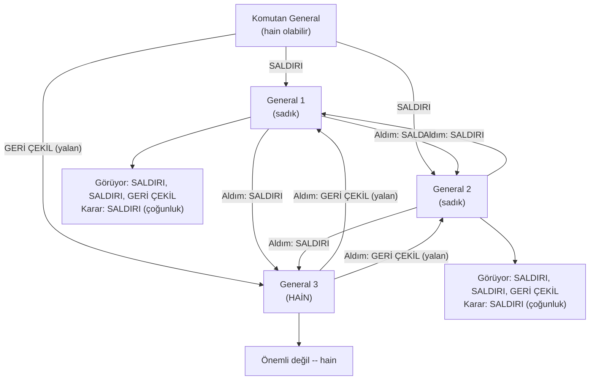
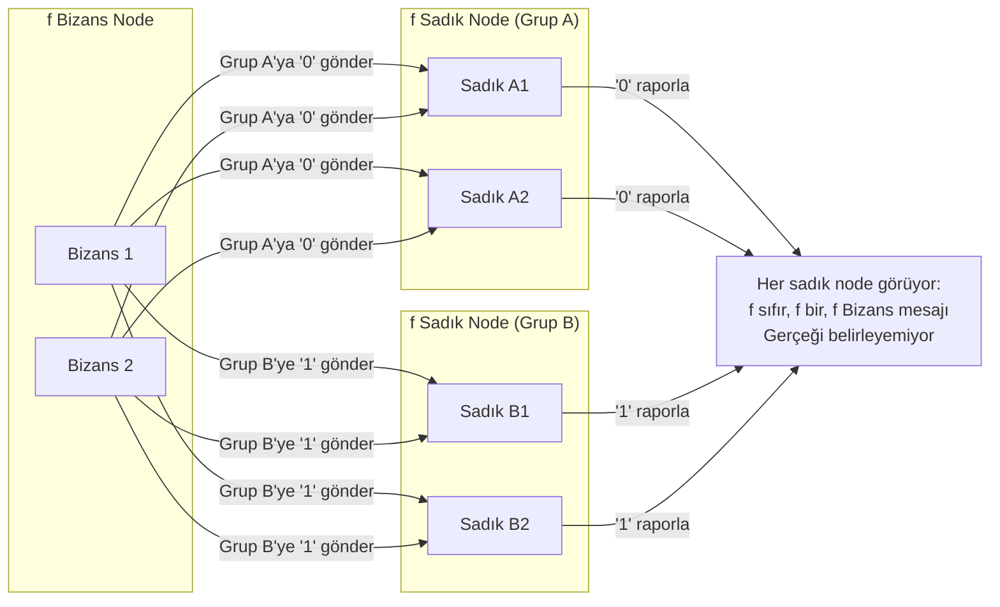
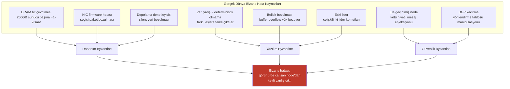
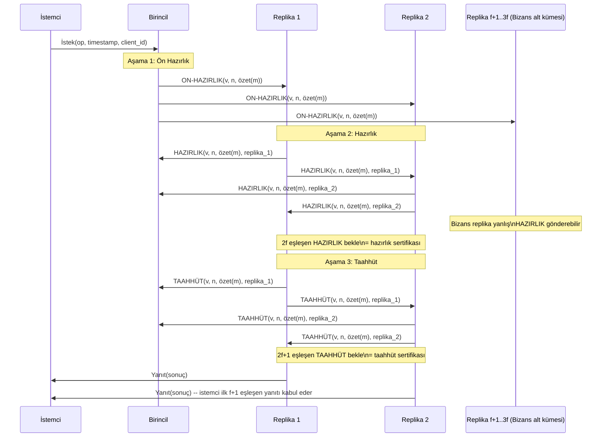
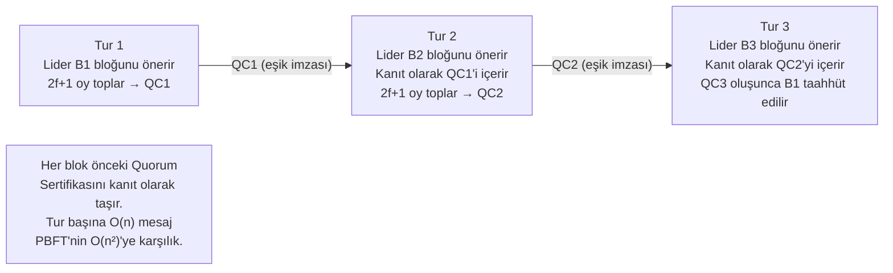
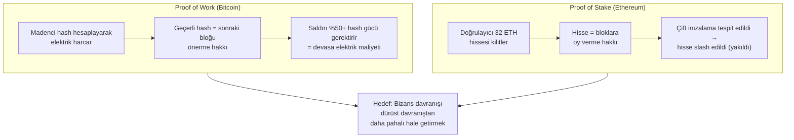

Şimdiye kadar ele alınan her hata modeli, hatalı süreçlerin işbirlikçi biçimlerde başarısız olduğunu varsayar — dururlar, yavaşlarlar, mesajları düşürürler. Bizans hataları bu varsayımı paramparça eder. Bizans süreç her şeyi yapabilir: farklı eşlere çelişkili mesajlar gönderebilir, bazı mesajları seçici biçimde iletip diğerlerini bastırabilir, bazı katılımcılara doğru yanıtlar verirken diğerlerine yalan söyleyebilir ya da kritik bir anda hedefe yönelik saldırı başlatmadan önce uzun süre doğru davranabilir. Terim, 1982'de Lamport, Shostak ve Pease tarafından ortaya atılan Bizans Generalleri Probleminden gelir — bazı katılımcılar aktif biçimde bunu engellemeye çalışırken anlaşmaya ulaşma sorununu resmileştiren bir düşünce deneyi.
 
Bizans hata toleransı (BFT) öncelikli olarak bir güvenlik sorunu değildir; güvenlik Byzantine davranışının kaynaklarından biridir. Bir doğruluk sorunudur: bileşenlerinin bir kesimi keyfi, potansiyel olarak düşmanca çıktılar üretirken sistem nasıl doğru çıktılar üretir? Yanıt, çökme toleranslı uzlaşmadan temelden farklı algoritmik mekanizma gerektirir ve daha ağır bir kaynak gereksinimini beraberinde getirir: çökme toleranslı uzlaşma `f` arızayı tolere etmek için `2f+1` node gerektirirken, Bizans hata toleransı `3f+1` gerektirir.
 
## Bizans Generalleri Problemi
 
Orijinal formülasyon, düşman bir şehri kuşatan Bizans ordusunun çeşitli tümenleri hayal eder. Her tümene bir general komuta eder ve generaller yalnızca haberciyle iletişim kurar. Bazı generaller sadık generallerin bir savaş planı (saldırı veya geri çekilme) üzerinde anlaşmalarını engelleyecek hainler olabilir. Problem: hainlerin ne yaptığından bağımsız olarak sadık generallerin aynı eylem üzerinde anlaşmasına izin veren bir protokol geliştirmek.
 
Hainler keyfi biçimde davranabilir: farklı generallere farklı emirler gönderebilir, mesaj göndermeyebilir, başka generallerden geliyormuş gibi görünen mesajlar gönderebilir ya da diğer hainlerle birlikte aldatmacalarını koordine edebilir. Bu, dağıtık sistemlerdeki Bizans hatalarının davranışını tam olarak yakalar — keyfi davranış, potansiyel olarak koordineli, potansiyel olarak aldatıcı.
 

*Bir hain ile Bizans Generalleri: sadık generaller aldıklarını paylaşır ve çoğunluk oylaması yapar. 1 hain ve 4 general ile (3f+1=4, f=1), çoğunluk doğru biçimde SALDIRI'ya çözümlenir.*
 
Lamport, Shostak ve Pease'in temel sonucu: **`f` tanesi Bizans olduğunda toplam `3f+1`'den az node ile Bizans anlaşması imkânsızdır**. Eşdeğer olarak, katılımcıların üçte birinden fazlası Bizans ise hiçbir deterministik protokol sadık katılımcılar arasında anlaşmayı garanti edemez.
 
## Neden 3f+1: Alt Sınır
 
`3f+1`'den az node ile Bizans anlaşmasının imkânsızlığı keyfi bir kısıtlama değildir — alınan mesajlardan sadık node'ların ne çıkarabileceğine dair bilgi-teorik bir argümandan kaynaklanır.
 
`f` Byzantine hatalı olmak üzere `3f` node'u ele alın. En kötü durumda, herhangi bir mesaj alışverişi turunda, `f` Byzantine node, farklı sadık node'lara farklı değerler göndererek şu senaryoyu yaratabilir:
 
- `f` Byzantine node çelişkili mesajlar gönderir.
- Geriye kalan `2f` sadık node, her biri farklı kaynaklardan görünürde tutarlı çoğunluk görüşü almış iki `f` gruplu node'a ayrılır.
- Hiçbir sadık node, güvendiği `f` node'dan hangisinin Bizans olduğunu ayırt edemez.

*Yalnızca 3f node ile: Bizans node'lar, f sadık node'ları her birinin görünürde geçerli çoğunluk gördüğü iki eşit gruba böler. Hiçbir node Bizans'ı sadıktan ayırt edemez.*
 
`3f+1` node ile: `2f+1` sadık node, herhangi bir `f` Bizans node üzerinde çoğunluk oluşturur. Byzantine node'lar çelişkili mesajlar göndermek için iş birliği yapsa bile, `3f+1` node arasındaki çoğunluk oyu, sadık çoğunluğun gerçekte aldığıyla tutarlı bir sonuç üretir. `f` Byzantine oy dengeyi bozamaz; çünkü `2f+1`'e karşı `f` ile sayısal olarak yenik düşer — 2:1'den fazla.
 
`3f+1`'in hem gerekli hem de yeterli olduğunun kanıtı, Lamport, Shostak ve Pease tarafından oluşturuldu ve daha sonra Dolev ve Strong tarafından rafine edildi. Senkron model için, `f+1` mesaj alışverişi turunun yeterli olduğunu gösterdiler — her tur, potansiyel bir hainin aldatma becerisini ortadan kaldırır.
 
## Gerçek Sistemlerde Bizans Davranışı
 
Üretim mühendisleri için en önemli içgörü, Bizans hatalarının kötü niyetli aktörler gerektirmediğidir. Aynı algoritmik sorunlar, bileşenlerin spesifikasyonlarıyla tutarsız biçimde davranmasına neden olan donanım arızaları ve yazılım hatalarından kaynaklanır.
 
### Donanım Kaynaklı Bizans Davranışı
 
**DRAM bit çevrilmeleri (Tek Olay Bozulmaları).** Kozmik ışınlar, lehim kirliliğinden kaynaklanan alfa partiküller ve yüksek enerjili nötronlar, DRAM'deki tek bitleri herhangi bir harici gösterge olmaksızın çevirir. Oran, ECC'siz emtia DRAM'de bit başına saatte yaklaşık 10⁻⁷ ila 10⁻⁸ bit çevrilmesidir. 256 GB DRAM'i (yaklaşık 2 × 10¹² bit) olan bir sunucu saatte yaklaşık bir ila iki bit çevrilme olayı yaşar. ECC bellek olmadan bu çevrilmeler veriyi sessizce bozar — bir süreç doğru yazılmış ama o zamandan beri bellekte bozulmuş bir değeri okur ve yanlış ama yapısal olarak geçerli sonuçlar üretir.
 
Ölçekte bu önem taşır. 1.000 node'lu, her biri 256 GB DRAM olan bir dağıtık sistem, filo genelinde saatte yaklaşık 1.000-2.000 bit çevrilme olayı bekler. Çoğu ilgisiz bellek bölgelerini etkiler. Küçük bir kesim kritik veri yapılarını bozar — oy sayıları, dizi numaraları, sağlama toplamları, yönlendirme tabloları — görünürde doğru çalışan donanımdan Byzantine düzeyinde davranış üretir.
 
**NIC ve switch firmware hataları.** Ağ arabirimi kartları ve switch'ler, firmware çalıştıran işlemciler içerir. Firmware hataları tarihsel olarak IP sağlama toplamı doğrulamasından geçen paket bozulmasına, seçici paket iletme (bazı akışlar doğru iletilirken diğerleri sessizce düşürülür veya bozulur) ve asimetrik yönlendirme yaratan yanlış ECMP hash hesaplamalarına neden olmuştur. Dağıtık algoritmanın bakış açısından, NIC firmware hatasından etkilenen node bazı mesajları doğru gönderirken diğerlerini bozabilir — tam olarak Byzantine gönderme davranışı.
 
**Depolama denetleyicisi sessiz bozulma.** RAID denetleyicileri ve SAS/SATA denetleyicileri, disk üzerindeki sağlama toplamlarından geçen bozulmuş veriyi sessizce teslim ettiği belgelenmiş durumlara sahiptir. Bu, disk okuma hatasından (hata döndüren) farklıdır — veri başarıyla teslim edilmiştir ama yanlıştır. Bozulmuş veritabanı sayfasını okuyan, üzerinde hesaplama yapan ve sonucu ağa döndüren bir süreç Bizans davranışı sergilemektedir: süreç perspektifinden doğrudur ama yanlış çıktılar üretmektedir.
 
### Yazılım Kaynaklı Bizans Davranışı
 
**Deterministik olmayan yürütme.** Veri yarışı olan bir süreç aynı girdilerle farklı çalışmalarda farklı çıktılar üretebilir ya da zamanlama sırasına bağımlı çıktılar üretebilir. Bu süreç bir uzlaşma protokolüne katılırsa, aynı protokol turunda farklı eşlere farklı değerler gönderebilir — tam olarak Bizans davranışı. Pratikte JVM JIT derleme farklılıkları, mimariler arasındaki glibc matematik kütüphanesi kesinlik farklılıkları ve CPU'lar arasındaki kayan nokta deterministik olmaması bunların belgelenmiş kaynakları arasındadır.
 
**Bellek bozulma hataları.** Buffer overflow veya use-after-free hatası, bir mesaj yükünü içeren bellek bölgesini bozarak bir sürecin yapısal olarak geçerli ama anlamsal olarak yanlış mesaj göndermesine neden olabilir. Bozulmuş mesaj tüm ağ düzeyindeki bütünlük kontrollerinden geçer — TCP sağlama toplamı, TLS, uygulama düzeyinde çerçeveleme — ama yanlış veri içerir. Alıcı node'lar bozulmuş göndericiden aldıkları değer konusunda anlaşmazlığa düşer.
 
**Eski liderlik / split-brain.** Hatalı biçimde hâlâ lider olduğuna inanan bir süreç — doğru ele alınmayan bölünmüş ağ nedeniyle — gerçek mevcut liderin komutlarıyla çelişen komutlar verebilir. Bu, protokol düzeyinde Bizans davranışıdır: iki node aynı kaynak için yetkili olduğunu iddia eder ve kümenin geri kalanına çelişkili direktifler yayar.
 

*Bizans hataları üç bağımsız kaynaktan kaynaklanır: donanım hataları, yazılım hataları ve kötü niyetli aktörler. Kaynaktan bağımsız olarak algoritmik zorluk aynıdır.*
 
## Pratik Bizans Hata Toleransı: PBFT
 
1999'da Castro ve Liskov tarafından yayımlanan Pratik Bizans Hata Toleransı (PBFT) algoritması, pratik performans özelliklerine sahip ilk BFT protokolüydü — önceki yaklaşımların üstel karmaşıklığına karşılık O(n²) mesaj karmaşıklığı. Kısmen senkron ağ modeli altında üç aşamada çalışır ve `3f+1` toplam replica arasında `f` Byzantine replicayı tolere eder.
 
### PBFT Protokolüne Genel Bakış
 
PBFT, bir replicayı **birincil** (lider) ve geri kalanını **yedekler** olarak belirler. İstemci isteği, yürütülmeden önce üç aşamadan geçer:
 
**Aşama 1 — Ön hazırlık (Pre-prepare):** Birincil, istemci isteğine bir dizi numarası atar ve istek özeti ile dizi numarasını içeren PRE-PREPARE mesajını tüm yedeklere yayınlar.
 
**Aşama 2 — Hazırlık (Prepare):** Ön hazırlığı kabul eden her yedek, tüm diğer repliclara (birincil + tüm yedekler) PREPARE mesajı yayınlar. Replika, farklı repliclardan `2f` eşleşen PREPARE mesajı alana kadar bekler. Bu noktada replica, `2f+1` replicanın (kendisi dahil) aynı dizi numarası atamasını kabul ettiğine dair kanıt olan **hazırlık sertifikasına** sahiptir.
 
**Aşama 3 — Taahhüt (Commit):** Hazırlık sertifikasına sahip her replika COMMIT mesajı yayınlar. Replika, `2f+1` eşleşen COMMIT mesajı alana kadar bekler. Bu noktada replica **taahhüt sertifikasına** sahiptir ve isteği yürütür.
 

*PBFT üç aşamalı protokol: her aşamada 2f+1 eşleşen mesaj gerektirerek Bizans güvenliği sağlayan iki herkese-herkese yayın turu (O(n²) mesaj).*
 
### İki Aşamanın Neden Gerekli Olduğu
 
İki aşama (hazırlık + taahhüt) gereksiz değildir. Farklı amaçlara hizmet eder:
 
**Hazırlık aşaması**, iki hatasız replicanın aynı görünüm içinde aynı dizi numarası için farklı istekleri hazırlamadığını garanti eder. Birincinin atamasının tutarlı olduğunu oluşturur.
 
**Taahhüt aşaması**, bir replicada taahhüt edilen isteğin tüm hatasız repliclarda taahhüt edildiğini garanti eder — görünüm değişiklikleri boyunca bile. Taahhüt aşaması, kararı potansiyel birincil arızaları ve görünüm değişiklikleri boyunca sabitleler; birincil değiştirilirse taahhüt edilen değerin kaybolduğu senaryoyu önler.
 
### PBFT Mesaj Karmaşıklığı ve Ölçeklenebilirlik
 
PBFT'nin mesaj karmaşıklığı, hazırlık ve taahhüt aşamalarındaki herkese-herkese yayın nedeniyle istek başına O(n²)'dir. `n = 100` replicayla, tek bir istek yaklaşık 100² = 10.000 mesaj gerektirir. `n = 1.000`'de, istek başına 1.000.000 mesajdır.
 
Bu ikinci dereceden karmaşıklık PBFT'nin temel ölçeklenebilirlik sınırlamasıdır. PBFT'yi küçük replikasyon grupları için pratik kılar (`n ≤ 20`), ancak büyük ölçekli dağıtık sistemler için elverişsizleştirir. Mesaj karmaşıklığı bir uygulama detayı değildir — her node'un güvenli sertifika oluşturmak için `2f+1` diğer node'dan duymak zorunda olduğunun bilgi-teorik gereksiniminin sonucudur.
 
:::caution
PBFT'nin O(n²) mesaj karmaşıklığı, replika sayısını ikiye katlamak istek başına mesaj yükünü dört katına çıkarır. 10 replicayla PBFT kümesi uzlaşmayı yönetilebilir yük ile ele alır; 100 replicayla küme, makul herhangi bir verimde, uzlaşma mesajlarına gerçek uygulama trafiğinden daha fazla ağ kapasitesi harcar. Bu nedenle pratik BFT dağıtımları ya küçük replikasyon gruplarını kullanır ya da küçük gruplar içinde BFT çalıştıran ve gruplar arasında daha basit protokollerle koordinasyon sağlayan hiyerarşik protokolleri benimser.
:::
 
## HotStuff: Doğrusal Karmaşıklıklı BFT
 
HotStuff (2018, Yin vd.), eşik imzaları kullanarak BFT uzlaşmasının **aşama başına O(n) mesaj karmaşıklığıyla** elde edilebileceğini kanıtladı. Lider, `2f+1` bireysel imzayı toplamak yerine onları tek kompakt bir kanıta — `2f+1` replicanın anlaştığının kanıtı olan bir **Quorum Sertifikasına (QC)** — toplar. Her tur bir QC üretir ve sonraki tur önceki QC üzerine inşa eder, zincirli bir yapı oluşturur.
 
HotStuff, birçok üretim blockchain uzlaşma motorunun temelini oluşturur: DiemBFT (Facebook'un Diem/Libra'sı), Tendermint ve birçok Ethereum 2.0 doğrulayıcı istemci uygulaması. Doğrusal karmaşıklığı, yüzlerden binlerce doğrulayıcı ağ ölçeklerinde pratik kılar.
 

*HotStuff'ın zincirli QC yapısı: her tur, bir sonraki tur için kanıt görevi gören tek bir Quorum Sertifikası üretir; mesaj karmaşıklığını O(n²)'den O(n)'e indirger.*
 
## BFT Mekanizması Olarak Proof of Work ve Proof of Stake
 
Blockchain uzlaşma protokolleri, farklı bir tehdit modeli altında Bizans anlaşmasının bir varyantını çözer: katılımcıların kimliğinin önceden bilinmediği açık, izinsiz katılım.
 
**Proof of Work (PoW)**, Bizans hata toleransını olasılıksal olarak sağlar. Madenciler hedefin altında bir hash bulmak için yarışır; geçerli hash bulma olasılığı hesaplama gücüyle orantılıdır. Toplam hash gücünün %50'sinden azını kontrol eden saldırgan, dürüst çoğunluktan daha hızlı tutarlı biçimde geçerli bloklar üretemez. Güvenlik olasılıksaldır: çift harcama saldırısı olasılığı, onaylayan blok sayısıyla üstel biçimde azalır. Bitcoin, yüksek değerli işlemler için 6 onay (~1 saat) gerektirir; bu, saldırgana %50 hash gücüyle bile yalnızca `(0.5)^6 ≈ %1,6` başarı şansı verir.
 
**Proof of Stake (PoS)**, doğrulayıcıların dürüst olmayan davranış halinde imha edilebilecek ("slash") ekonomik değer kilitlemesini ("stake") zorunlu kılarak Bizans hata toleransını sağlar. Ethereum'un Casper FFG'si, doğrulayıcıların açık oy yayımlamasını gerektirir; çift imzalama (aynı slot için çelişkili oyları imzalamak), doğrulayıcının hissesinin bir bölümünün müsaderesine — slashing — neden olur. Bizans davranışının ekonomik maliyeti, başarılı saldırıdan elde edilecek ekonomik kazancı aşmalıdır.
 

*PoW ve PoS, her ikisi de Bizans davranışını ekonomik açıdan irrasyonel hale getirerek Bizans hata toleransı sağlar: saldırganın kazanabileceğinden daha fazla harcaması gerekir.*
 
## Tam BFT Olmadan Bizans Davranışını Tespit Etmek
 
Tam BFT protokolleri önemli ek yük taşır. Birçok üretim dağıtık sistemi için tehdit modeli aktif düşmanları içermez — Bizans arızaları sessiz donanım veya yazılım hatalarıdır, koordineli saldırılar değil. Daha hafif bir yaklaşım, gerçek zamanlı önlemek yerine Bizans davranışını gerçekleştikten sonra tespit etmek ve uyarmaktır.
 
**Çapraz doğrulama sağlama toplamları.** Depolamaya yazılan ve depolamadan okunan tüm verilerde bağımsız olarak hesaplanan, taşıma katmanı sağlama toplamlarından bağımsız uygulama düzeyindeki CRC32 veya xxHash sağlama toplamları. Hesaplanan ve depolanan sağlama toplamı arasındaki uyuşmazlık, depolama katmanı sessiz bozulmasını gösterir. PostgreSQL'in `data_checksums` özelliği tam olarak bunu yapar — her sayfanın her okumada doğrulanan CRC'si vardır.
 
```shell
# PostgreSQL veri sayfası sağlama toplamlarını etkinleştir (initdb sırasında veya mevcut kümeler için pg_checksums)
initdb --data-checksums /var/lib/postgresql/data
 
# Mevcut kümede sağlama toplamlarını çevrimdışı doğrula
pg_checksums --check /var/lib/postgresql/data
# Çıktı: Sağlama toplamı doğrulaması tamamlandı
# Taranan dosyalar:   1023
# Taranan bloklar:  131072
# Hatalı sağlama toplamları:   0          # sıfır dışı değer = sessiz bozulma tespit edildi
```
 
**Denetim günlükleri ve hash zinciri.** Her girdinin önceki girdinin kriptografik hash'ini içerdiği salt ekleme denetim günlüğü, müdahaleye karşı kanıt zinciri oluşturur. Tarihsel herhangi bir girdide yapılan değişiklik, tüm sonraki hash'leri geçersiz kılar; böylece bozulma, mevcut zincir başını depolayan herkes tarafından tespit edilebilir hale gelir. Bu, sertifika şeffaflık günlüklerinin, blockchain defterlerinin ve Git'in nesne modelinin arkasındaki mekanizmadır.
 
**Determinizm doğrulaması (çok taraflı hesaplama çapraz kontrolü).** Kritik hesaplamalar için aynı hesaplamayı birden fazla bağımsız node'da çalıştırıp çıktıları karşılaştırmak, hesaplama yolundaki Bizans davranışını tespit eder. Bu, özel anahtar yönetimi için çok taraflı hesaplama (MPC) protokollerinin ve sonuçları istemcilere döndürmeden önce repliclar arasında çapraz kontrol yapan Google'ın Bizans dirençli üretim sistemlerinin kullandığı mekanizmadır.
 
:::tip
ECC (Hata Düzeltme Kodu) bellek, donanım kaynaklı Bizans hatalarına karşı tek en uygun maliyetli savunmadır. ECC DIMM modülleri tek bit hatalarını otomatik olarak düzeltir ve çift bit hatalarını tespit eder. Standart DIMM üzerindeki maliyet primi yaklaşık %10-20'dir. Finansal verileri, tıbbi kayıtları veya güvenlik açısından kritik durumu işleyen herhangi bir dağıtık sistem için ECC bellek isteğe bağlı bir özellik değil, temel gereksinim olarak ele alınmalıdır. Bare-metal örnekler sunan bulut sağlayıcıları genellikle ECC bellek desteğini donanım spesifikasyonu olarak listeler.
:::
 
## Eşik İmzaları ve Bizans Dirençli Kriptografi
 
Birçok modern BFT protokolü, doğrusal mesaj karmaşıklığı elde etmek için **eşik imza şemalarına** dayanır. `(t, n)` eşik imza şeması, `n` anahtar payı sahibinden herhangi `t`'sinin tek bir genel anahtara göre doğrulanabilen, herhangi bir tarafın tam özel anahtarı olmadan işbirlikçi biçimde imza üretmesine olanak tanır.
 
BFT uzlaşmasında bu, `2f+1` doğrulayıcının anahtar paylarını katkıda bulunarak Quorum Sertifikası üretebileceği ve elde edilen sertifikanın `2f+1` bireysel imza koleksiyonu yerine tek kompakt bir imza olduğu anlamına gelir. Sertifikanın boyutu imzacı sayısıyla büyümez.
 
**BLS (Boneh-Lynn-Shacham) imzaları** verimli toplama destekler: aynı mesaj üzerindeki birden fazla BLS imzası, sabit boyutlu tek bir imzada birleştirilebilir. Ethereum'un Beacon Chain'i, binlerce doğrulayıcı imzasının kompakt bir kanıtta toplanmasına izin vererek doğrulayıcı onayları için BLS12-381 imzalarını kullanır.
 
```python
# Kavramsal illüstrasyon: BLS imza toplama
# (py_ecc kütüphanesi kullanılarak, basitleştirilmiş)
from py_ecc.bls import G2ProofOfPossession as bls
 
# Her doğrulayıcı aynı mesajı imzalar
signatures = []
for validator_key in validator_signing_keys:
    sig = bls.Sign(validator_key, block_hash)
    signatures.append(sig)
 
# Tüm imzaları tek bir imzada topla
# Toplu imzanın boyutu tek imzayla aynıdır
aggregate_sig = bls.Aggregate(signatures)
 
# Toplu genel anahtara göre doğrula
aggregate_pubkey = bls.AggregatePKs(validator_public_keys)
is_valid = bls.FastAggregateVerify(
    validator_public_keys, 
    block_hash, 
    aggregate_sig
)
# is_valid, 2f+1 doğrulayıcı aynı block_hash'i doğru imzaladıysa True
```
 
## Bizans Hata Toleransının Maliyeti
 
Tam BFT, tehdit modeline karşı tartılması gereken gerçek maliyetler taşır:
 
| Özellik | Çökme toleranslı (Raft/Paxos) | Bizans toleranslı (PBFT/HotStuff) |
|---|---|---|
| **f arıza için minimum node** | `2f+1` | `3f+1` |
| **Mesaj karmaşıklığı (karar başına)** | O(n) — Raft, O(n²) — Multi-Paxos | O(n²) — PBFT, O(n) — HotStuff |
| **Kriptografik yük** | Yok veya minimal (taşıma için TLS) | Her mesajda dijital imzalar |
| **Görünüm değişikliği karmaşıklığı** | O(n) — Raft lider seçimi | O(n²) — PBFT görünüm değişikliği, O(n) — HotStuff |
| **Pratik maksimum küme boyutu** | Yüzlerden binlerce node | Onlar (PBFT) ile yüzler (HotStuff) |
| **Çökme toleranslıya göre gecikme** | Temel | Tur başına 2-5× daha yüksek |
| **Gereken tehdit modeli** | Yalnızca çökme hataları | Düşmanca dahil keyfi hatalar |
 
BFT kullanma kararı nihayetinde bir tehdit modeli kararıdır. Fiziksel erişim kontrolleri, güvenilen operatörler ve ECC belleğe sahip özel veri merkezi için çökme toleranslı uzlaşma (Raft, Paxos) uygundur — Bizans hataları nadirdir ve izleme yoluyla tespit edilebilir. İzinsiz blockchain için, güvenilmez karşı taraflardan gelen işlemleri işleyen finansal sistem için veya bireysel node operatörlerine tam güvenilemeyen herhangi bir sistem için Bizans hata toleransı isteğe bağlı değildir.
 
Bizans arıza oranlarının nicel güvenilirlik analizine nasıl dahil edildiği için bkz. [Deterministik ve Olasılıksal Hata Modelleri](/distributed-systems/tr/foundations/system-models/deterministic-vs-probabilistic/).
BFT protokollerinin genişlettiği çökme toleranslı uzlaşma temeli için bkz. [Uzlaşma Algoritmaları: Raft](/distributed-systems/tr/coordination/consensus-algorithms/raft/).
Bu algoritmaların üretim dağıtım detayları için bkz. [Bizans Hata Toleransı: PBFT, Proof of Work / Proof of Stake](/distributed-systems/tr/coordination/consensus-algorithms/byzantine-fault-tolerance/).