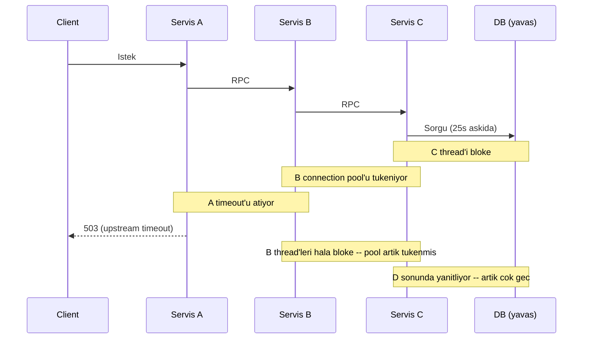
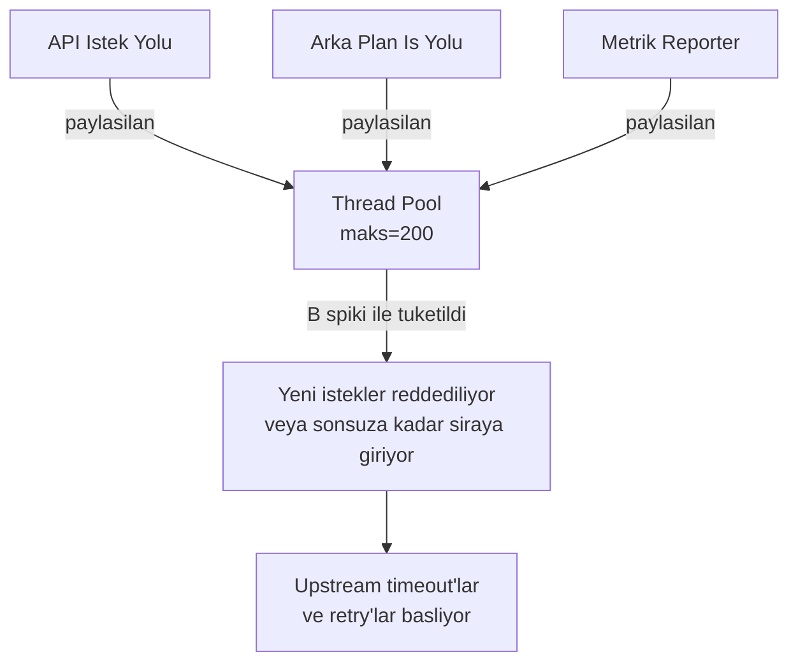
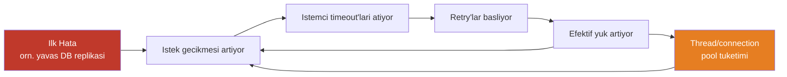
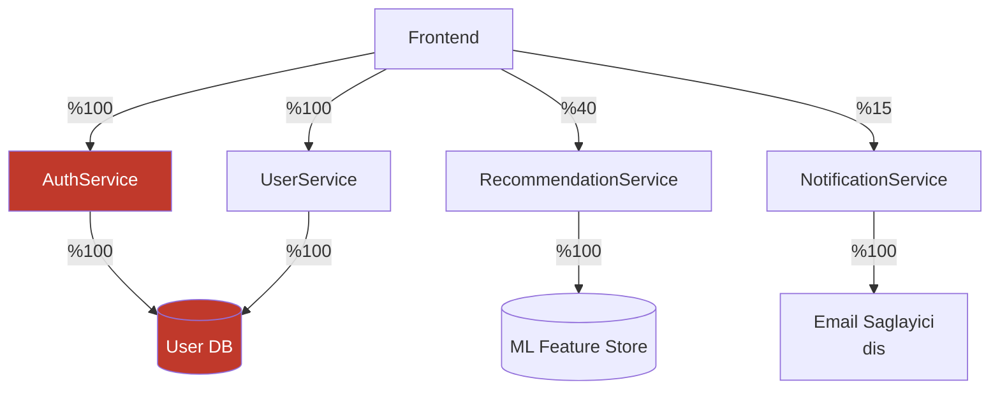

Kaskad hata tek bir olay değildir — bir süreçtir. Tek bir bileşendeki yerel hata, kaynak tüketimi, timeout amplifikasyonu ve retry fırtınalarının birbirini tetiklediği bir zinciri başlatır; bu zincir komşu bileşenlerin savunmalarını birer birer aşarak başlangıçta hiç dahli olmayan sistemleri de çökertene kadar yayılır. Kaskad hatayı anlamak, semptomu değil yayılım *mekanizmasını* anlamayı gerektirir.
 
Klasik senaryo şudur: tek bir yavaş veritabanı replikası, sorgu thread'lerinin bloke olmasına neden olur. Bloke thread'ler connection pool slotlarını tutar. Pool tükenir. Yeni istekler kuyruğa girer. Kuyruk dolar. Upstream servisler timeout almaya başlar. Bu timeout'lar retry'ları tetikler. Retry'lar zaten bozulmuş olan veritabanındaki yükü artırır. Veritabanı daha da bozulur. Veritabanıyla hiçbir doğrudan bağımlılığı olmayan servisler bile, aynı JVM thread pool'unu veritabanı bağımlı servislerle paylaştığı için çökmeye başlar. Kesintinin kapsamı, başlangıçtaki hatanın etki alanını büyüklük sıralarıyla aşmıştır.
 
## Yayılım Mekanizmaları
 
Kaskadlar birkaç farklı fiziksel kanal üzerinden yayılır. Her birinin kendine özgü yayılım hızı ve müdahale noktası vardır.
 
### Senkron Çağrı Zinciri Çöküşü
 
A servisi B'yi, B servisi C'yi, C servisi de D'yi çağırdığı senkron bir istek grafiğinde, D'deki yavaşlama her upstream katmanda gecikme amplifikasyonuna yol açar. Her servisin `T` süreli bir timeout'u varsa, uçtan uca en kötü durum gecikmesi, `N` zincir derinliği olmak üzere `N * T`'dir. Daha kritik olanı şudur: D tamamen başarısız olmak yerine yavaşlarsa (kısmi hata modu), C'deki thread'ler D yanıtlarını bekleyerek birikir. C'nin thread pool'u sonludur. C'ye gelen yeni istekler kuyruğa girmeye başlar. B'nin C'ye bağlantıları timeout almaya ya da bloke olmaya başlar. B'nin pool'u tükenir. Çökme upstream katmanları tek tek aşar.
 

*Senkron zincir çöküşü: A, D yanıt vermeden önce timeout alır; ancak B ve C thread'leri bloke kalmaya devam eder ve sonraki istekler için pool'larını tüketir.*
 
Buradaki sinsi özellik **fan-in amplifikasyonudur**. Saniyede 100 istemci A'yı çağırıyorsa ve her istek 30 saniyelik timeout ile D'ye bir çağrı yapıyorsa, 30 saniye içinde zincir boyunca dağılmış 3.000 bloke thread oluşur. Herhangi bir katmanın thread pool'u 3.000'den küçükse, artık doymuş demektir ve yeni istekleri reddediyordur.
 
### Kaynak Çakışması ile Yayılım
 
Mantıksal olarak ilgisiz görünen kaynaklar çoğunlukla aynı yerde bulunur: thread pool'ları, connection pool'ları, file descriptor limitleri, CPU çekirdekleri, bellek ve ağ tamponlarının tamamı bir process sınırı içinde paylaşılır. Bir çağrı yolundaki hata bu paylaşılan kaynakları tüketerek ilgisiz diğer çağrı yollarını açlığa bırakır.
 
Klasik durum, gecikmeye duyarlı bir API ile aynı JVM'de çalışan düşük öncelikli bir arka plan işidir: **gürültülü komşu** senaryosu. Arka plan işi garbage collection baskısı yaratır ya da connection pool'u doyurursa, API yolunun arka plan işiyle mantıksal hiçbir bağımlılığı olmamasına karşın performansı düşer.
 

*Paylaşılan thread pool çakışması: arka plan işi spiki, doğrudan mantıksal bağımlılık olmaksızın API yolunu açlığa bırakır.*
 
### Retry Amplifikasyonu
 
Retry'lar, kaskad hastaların en yaygın hızlandırıcısıdır. Başarısız bir isteği üç kez yeniden deneyen bir istemci, bozulmuş sistemdeki yükü 3 katına çıkarır. 10 upstream servis jitter'sız olarak üçer kez retry denerse, bozulan sistem tam olarak kapasitesinin en düşük olduğu anda normal istek hacminin 30 katıyla karşı karşıya kalır.
 
**Jitter'sız üstel geri çekilme (exponential backoff)** farklı bir patoloji yaratır: senkronize retry dalgaları. Aynı aralık için (örn. 2 saniye) geri çekilen tüm istemciler retry'larını aynı anda ateşler. Retry şimşeği, downstream sistemin elde ettiği kısmi toparlanmayı alt üst edecek senkronize bir patlama olarak gelir. Bu pattern resmi adıyla **retry fırtınası** (retry storm) olarak bilinir ve üretim sistemlerindeki saatlerce süren kesintilerin orantısız büyük bir bölümünden sorumludur.

```mermaid
gantt
    title Senkronize ve Jitterli Retry Dalgalari
    dateFormat ss
    section Jitter Yok
    Ilk patlama     :a1, 00, 2s
    Retry dalgasi 1 :a2, 02, 2s
    Retry dalgasi 2 :a3, 04, 2s
    section Jitter Var
    Ilk patlama     :b1, 00, 2s
    Retry (yayili)  :b2, 02, 4s
    Retry (yayili)  :b3, 05, 4s
```
 

*Jitter olmadan retry'lar, toparlanmaya çalışan bir sistemi yeniden doyurabilecek senkronize patlamalar olarak gelir. Jitter yükü zamanla yayar.*
 
:::danger
Dağıtık sistemde asla sabit aralıklı retry uygulayın. `baseDelay = 1s` ile retry deneyen tek bir servis zararsızdır. Paylaşılan bir bağımlılık bozulduktan sonra hepsinin `baseDelay = 1s` ile retry denemesi, kendi altyapınıza yönelik bir hizmet reddi (DoS) saldırısıdır. Her zaman tam jitter'lı üstel geri çekilme kullanın: `delay = random(0, min(cap, base * 2^attempt))`.
:::
 
### Head-of-Line Blocking
 
FIFO istek kuyruklarına sahip sistemlerde, tek bir yavaş istek arkasındaki tüm isteklerin bloke olmasına neden olabilir. Bu, **head-of-line (HOL) blocking** olarak adlandırılır. HTTP/1.1 yapısal olarak bu sorunu yaşar — kalıcı bir bağlantıdaki yavaş yanıt, o bağlantıdaki tüm sonraki istekleri bloke eder. HTTP/2 multiplexing, HOL blocking'i HTTP katmanında hafifletir ancak TCP katmanında yeniden ortaya çıkarır (tek bir paket kaybı, TCP yeniden iletim yaparken tüm stream'lerin durmasına neden olur).
 
Uygulama düzeyindeki kuyruklarda — mesaj broker'ları, iş kuyrukları, görev zamanlayıcıları — tüketicide askıda kalmasına neden olan bir mesaj, o partition'daki tüm sonraki mesajların işlenmesini engeller. Dead-letter yönlendirmesi ve maksimum teslimat denemesi sınırı olmayan bir tüketicide, her denemede istisna fırlatan hatalı biçimlendirilmiş bir olay olan "zehir hap" (poison pill) mesajı tüm bir Kafka partition'ını süresiz olarak durdurabilir.
 
## Metastabil Hatalar
 
**Metastabil hata**, tetiklendiğinde orijinal hata ortadan kaldırılsa bile kendi kendini sürdüren bir kaskaddır. Sistem yeni bir kararlı duruma — bozulmuş bir dengeye — girmiştir ve dışarıdan müdahale olmadan bu durumdan çıkamaz.
 
Mekanizma şudur: sistemin stres altındaki yük yönetimi davranışı, stresi artıran bir geri besleme döngüsü yaratır. Yaygın geri besleme döngüleri şunlardır:
 
- **Yük altında retry amplifikasyonu:** Sistem aşırı yüklenmiş → istekler timeout alıyor → istemciler retry deniyor → yük artıyor → daha fazla timeout → daha fazla retry → yük daha da artıyor. Orijinal hatanın ortadan kalkması, retry kaynaklı yükü azaltmaz; retry'ların kendisi artık yük haline gelmiştir.
- **JVM servislerinde GC sarmalı:** Artan gecikme → istekler heap'te kuyruğa giriyor → heap baskısı → GC duraklamaları → artan gecikme. GC duraklama süresi istek timeout'unu aştığında istemciler başarısız olmaya, ardından retry denemeye başlar; bu da heap baskısını daha da artırır. Sistem GC ile bu durumdan çıkamaz.
- **Connection pool açlığı:** Pool tükeniyor → istekler kuyruğa giriyor → kuyruk timeout'u ateşleniyor → hata döndürülüyor → istemci retry deniyor → pool tükenmiş kalmaya devam ediyor. Mevcut bağlantılar, sorguları tamamlanana kadar serbest bırakmayacak olan bloke thread'ler tarafından tutuluyor.

*Metastabil hata geri besleme döngüsü: başlangıçtaki tetikleyici çözülse bile, retry kaynaklı yük bozulmuş durumu sürdürür.*
 
Metastabil hatanın belirleyici özelliği, **sistemin mevcut yük altında kendi kendini iyileştirememesidir**. Toparlanma için ya yük azaltılmalıdır (circuit breaker, rate limiting, trafik yönlendirme) ya da retry amplifikasyonunun tükettiğinden daha hızlı kapasite eklenmesi gerekir. Pratikte en hızlı toparlanma yolu, giriş noktasında agresif istek atımıdır — bir süre boyunca `503 Service Unavailable` döndürmek kuyrukların boşalmasına ve thread'lerin serbest kalmasına izin verir; bu da geri besleme döngüsünü kırar.
 
:::caution
Metastabil hatalar, postmortem analizlerinde sıklıkla "yük artışı" olarak yanlış teşhis edilir; çünkü biri metriklere bakmaya başladığında yük *gerçekten* yüksektir. Orijinal tetikleyici — kısa süreli bir ağ bölünmesi, geçici bir disk I/O artışı, bir yapılandırma değişikliği — servisin kendi kendini sürdüren bozulmuş duruma girmesinden dakikalar önce çözülmüş olabilir. Postmortem analizi, orijinal dalgalanmayı bulmak için yük örüntülerini geriye doğru izlemelidir.
:::
 
## Bağımlılık Grafiği Analizi
 
Bir hata gerçekleşmeden önce patlama yarıçapını değerlendirmek, bağımlılık grafiğinin kesin bir modelini gerektirir. İki ilgili temsil biçimi vardır:
 
**Statik bağımlılık grafiği:** Hangi servislerin hangi diğer servisleri çağırdığı. Bu, servis mesh'lerinden (Istio, Linkerd), API gateway'lerden veya dağıtık izleme verilerinden çıkarılabilir. Statik grafik, belirli bir hata tarafından hangi servislerin *potansiyel olarak* etkilendiğini söyler.
 
**Dinamik yük bağımlılığı grafiği:** Her servisin istek hacminin ne kadarının hangi downstream servislerine bağlı olduğu. Bu, operasyonel açıdan daha ilgilidir. Bir servisin 10 downstream bağımlılığı olabilir, ancak isteklerinin %90'ı yalnızca birini çağırıyorsa, diğer dokuzdaki bir hatanın pratikte sınırlı bir patlama yarıçapı vardır.
 

*Ağırlıklı bağımlılık grafiği: UserDB kritik yol bağımlılığıdır (isteklerin %100'ü transitif olarak ona bağlıdır). EmailProvider hatası yalnızca %15 trafiği etkiler.*
 
Kritik yollar — kullanıcıya yönelik isteklerin %100'ünü engelleyen bağımlılık zincirleri — en yüksek dayanıklılık yatırımını gerektirir. Kritik olmayan yollar (opsiyonel özellikler, asenkron zenginleştirmeler), hataları upstream'e yaymak yerine zarif biçimde bozularak geri düşen (fallback) mekanizmalarla korunmalıdır.
 
Kaskad hata için en tehlikeli grafik topolojisi **elmas bağımlılığıdır**: A ve B servisleri her ikisi de C servisine bağımlıyken, üst düzey bir D servisi hem A hem de B'ye bağımlıdır. C'deki bir hata hem A'nın hem de B'nin çökmesine, bunun da D'nin doğrusal bir zincirin 2 katı hata yüzeyiyle çökmesine neden olur. Büyük mikroservis grafiklerinde elmas bağımlılıklar neredeyse kaçınılmazdır; bu yüzden patlama yarıçapı analizinin yalnızca yol derinliğini değil, giriş derecesini (in-degree) de dikkate alması gerekir.
 
## Paylaşılan Altyapı Üzerinden Hata Yayılımı
 
Uygulama düzeyindeki bağımlılıkların ötesinde, hatalar hiçbir servis bağımlılık grafiğinin yakalamadığı paylaşılan altyapı katmanları üzerinden de yayılır.
 
**Paylaşılan DNS resolver'lar:** Aşırı yüklenen ya da eski kayıtlar döndüren bir DNS resolver, onu kullanan her servisin ad çözümlemesinde başarısız olmasına neden olur. Bu, tüm uygulama düzeyindeki bağımlılık sınırlarını aşan yatay bir yayılım yoludur. Kubernetes kümelerinde CoreDNS'in yük altında olması bu nedenle bilinen bir hata modudur.
 
**Paylaşılan ağ yapısı:** Çok kiracılı Kubernetes node'larında NIC bant genişliğini doyuran ya da agresif yeniden iletim fırtınalarını tetikleyen gürültülü bir komşu, aynı node'da bulunan tüm pod'ların ağ verimini düşürür. Bu durum, uygulama düzeyinde görünür bir bağımlılık olmaksızın birbiriyle ilgisiz servisler arasında yüksek gecikme olarak kendini gösterir.
 
**Paylaşılan depolama I/O:** NFS mount'ları, ağa bağlı blok depolama ve paylaşılan disk denetleyicileri, bilinen seri darboğazlardır. Paylaşılan bir depolama backend'inde IOPS'u doyuran bir iş yükü, uygulama düzeyi bağımlılık grafiğinden bağımsız olarak o backend'e bağlı diğer tüm iş yüklerinin gecikme artışı yaşamasına neden olur.
 
**Control plane doygunluğu:** Kubernetes'te etcd yazma gecikmesi, API server'ı etkiler; bu da controller reconciliation döngülerini, dolayısıyla pod zamanlamasını ve servis endpoint güncellemelerini etkiler. Yük altındaki bir Kubernetes API server'ı, yeni pod'ların zamanlanmamasına, servislerin endpoint kaydının başarısız olmasına ve otomatik ölçekleyicilerin eski verilerle çalışmasına neden olabilir — tam da control plane'e en çok ihtiyaç duyulan pencerede.
 
:::tip
Paylaşılan altyapıyı uygulama metriklerinden bağımsız olarak izleyin. etcd gecikmesi, CoreDNS sorgu hızı, node NIC doygunluğu ve depolama IOPS'unun tamamının özel dashboard'ları ve alertleri olmalıdır. Uygulama katmanı dağıtık trace'leri bu hata modlarını göstermez; çünkü hata, uygulama enstrümantasyon sınırının altında gerçekleşir.
:::
 
## Patlama Yarıçapı Sınırlama
 
Sınırlama stratejileri, statik mimari kararlardan çalışma zamanı uygulamalarına uzanan bir yelpazede yer alır.
 
**Bulkhead izolasyonu**, paylaşılan kaynakları (thread pool'ları, connection pool'ları, semaforlar) downstream bağımlılığa göre bölümler. Üç downstream bağımlılığı olan bir servisin, her biri bağımsız olarak boyutlandırılmış üç ayrı thread pool'u olmalıdır. C bağımlılığındaki bir hata yalnızca C'nin pool'unu tüketir; A ve B için pool'lar kullanılabilir kalır. Bu, bir gemideki su geçirmez bölmelerin mimari eşdeğeridir — hata etki alanı yapısal olarak sınırlandırılmıştır.
 
**Altyapı düzeyinde hata etki alanı segmentasyonu**, bileşenleri hata etki alanına (rack, availability zone, region) göre gruplandırır ve trafiği, bir etki alanındaki hatanın diğerinde kaskad yük tetiklemeyecek şekilde yönlendirir. Bu, gerçekçi hata senaryolarını karşılamak için her etki alanını fazla kapasiteyle donatmayı gerektirir — genellikle N+1 veya N+2 kapasite — bu pahalıdır ancak tek bir AZ hatasının tam bölge kesintisine yayılmasını önleyen tek mekanizmadır.
 
**Circuit breaker'lar**, thread'lerin bloke olmasına izin vermek yerine bilinen bozulmuş bir bağımlılığa gelen istekleri anında hata döndürerek senkron geri besleme döngüsünü kırar. Açık bir circuit breaker, thread'leri engelleyen bir hatayı anında hataya dönüştürür; bu da çağıran servisin thread pool'unun boşalmasını sağlar. Kritik nokta: circuit breaker'lar servis giriş noktasına değil, *bağımlılık sınırına* yerleştirilmelidir.
 
**Öncelikli kuyruklu yük atımı**, toplam istek hacmi sistem kapasitesini aştığında önce düşük öncelikli isteklerin düşürülmesini sağlar. Bu, istek önceliği meta verilerinin tüm servisler tarafından saygı gösterilen header'larla (örn. özel `X-Request-Priority` header'ları) uçtan uca yayılmasını gerektirir. Bu olmadan, ayrımsız yük atımı gecikmeye duyarlı kullanıcı isteklerini arka plan health-check trafiğiyle aynı oranda düşürür.
 
Circuit breaker durum makinesi detayları ve ayarlama parametreleri için bkz. [Circuit Breaker](/distributed-systems/tr/resilience/protection-patterns/circuit-breaker/).
Thread pool ve semafor izolasyonu uygulaması için bkz. [Bulkhead Deseni](/distributed-systems/tr/resilience/protection-patterns/bulkhead-pattern/).
 
## Postmortem'de Kaskad Analizi
 
Etkili kaskad postmortem'leri, zaman çizelgesini milisaniye düzeyinde hassasiyetle yeniden oluşturmayı gerektirir. Gerekli veri kaynakları:
 
| Sinyal | Ne ortaya koyar | Araç |
|--------|-----------------|------|
| Dağıtık trace'ler | Hangi servis-servis çağrılarının önce ve ne zaman başarısız olduğu | Jaeger, Tempo, Zipkin |
| Thread pool metrikleri | Pool'ların ne zaman tükendiği, zaman içinde kuyruk derinliği | Prometheus, Dropwizard Metrics |
| Connection pool metrikleri | Pool bekleme süresi, aktif/boşta oranı | HikariCP metrikleri, pgBouncer istatistikleri |
| Circuit breaker durumu | CB'lerin ne zaman açıldığı ve neyin tetiklediği | Micrometer, özel gauge'lar |
| Altyapı metrikleri | CPU, NIC, disk IOPS, bellek | Node Exporter, CloudWatch |
| Retry hızı | Her servisten saniyedeki retry sayısı | OpenTelemetry counter'ları |
 
Yeniden oluşturmanın hedefi **ilk anomaliyi** tanımlamaktır — diğer tüm metriklerden önce sapan metriği. Bu genellikle en fazla alert üreten servis değil, bir performans uçurumunu geçmiş sessiz bir upstream bağımlılıktır. Bu ilk anomaliyi altyapı olaylarıyla (dağıtımlar, cron job'lar, trafik artışları, yapılandırma değişiklikleri) ilişkilendirmek kök nedeni ortaya çıkarır.
 
Postmortem'lerde yapılan kritik bir hata, en görünür şekilde başarısız olan bileşeni kök neden olarak kabul etmektir. Bir kaskadda en yüksek sesle başarısız olan, genellikle en downstream bileşendir — circuit breaker'ı olmayan ve tüm amplifikasyonlu yükü absorbe eden, kullanıcılara en yakın servis. Kök neden tipik olarak birkaç hop upstream'dedir ve birkaç dakika önce gerçekleşmiştir.
 
## Kaskad Riskini Ölçme: Hata Modu ve Etkileri Analizi
 
Dağıtık sistemler için uyarlanmış **Hata Modu ve Etkileri Analizi (FMEA)**, hangi tek bileşen hatalarının en yüksek patlama yarıçapına sahip olduğunu ölçen bir risk matrisi üretir. Bağımlılık grafiğindeki her bileşen için şunları tahmin edin:
 
- **Hata olasılığı** (geçmiş olay oranına veya hata modeline göre)
- **Tespit süresi** (izlemenin alert göndermesi ne kadar sürer)
- **Patlama yarıçapı** (bu bileşen başarısız olursa toplam sistem isteklerinin ne kadarı etkilenir)
- **Toparlanma süresi** (gerekirse manuel müdahale dahil ortalama geri yükleme süresi)
Bu dört faktörün çarpımı — Risk Öncelik Sayısı (RPN) — hangi bileşenlerin mimari sağlamlaştırma yatırımını hak ettiğini belirler. Yüksek patlama yarıçapı ve yüksek tespit süresi olan bileşenler en tehlikelisidir: herhangi bir alert tetiklenmeden dakikalarca sessizce bozulabilirler ve bu sürede kaskad zaten yayılmıştır.
 
Bu analiz, paylaşılan altyapıyı (veritabanları, cache'ler, servis mesh'leri, DNS) neredeyse her zaman en yüksek RPN bileşenler olarak öne çıkarır. Bu yüzden, dört dokuz veya daha yüksek SLO'larla ölçülen üretim sistemlerinde paylaşılan altyapı için artıklık ve çok-AZ dağıtımı isteğe bağlı değildir.